

 
     

The purpose of this document is to provide an introduction on how to use the Holos model (version 4) and the required vs. optional inputs. For the purpose of this training, we are going to create a farm that has an annual beef production system and a feed crop production system. The farm is located in Manitoba near Portage La Prairie. 

 

# Launch Holos

Please note that Holos 4 can be installed on a Microsoft Windows PC only. Mac OS will be supported in the next version.

Launch Holos by double-clicking on the Holos desktop icon. Holos will ask the user to open an existing farm, create a new farm, or import a saved farm file (Figure 1). If there is already a saved farm in the system, the user can click **Open**. If there are no saved farms in the system, Holos will ask the user if they want to create a **New** farm or **Import** a saved farm file (i.e., a .json file). If the user creates a new farm, they are asked for the farm name and an optional comment (Figure 2).  

Enter **"Holos 2024"** as the Name and **"Training Version"** in the Comments.  Click **OK** to proceed to the next screen.

Ensure **"Metric"** is selected as the unit of measurement type and then click the **Next** button at the bottom of the screen (Figure 3). 

 

    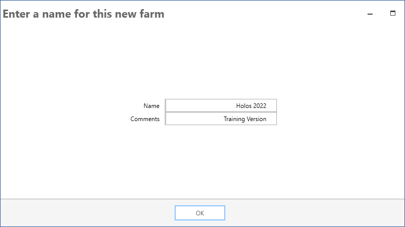
     
    <em>Figure 1: Entering a name for the new farm.</em>

 

 

    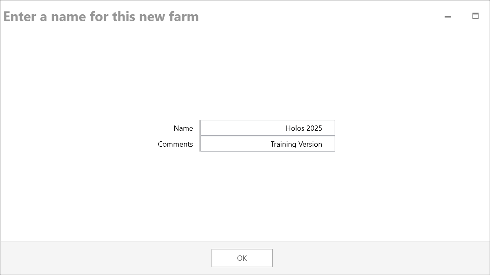
     
    <em>Figure 2: If a farm has been previously saved, Holos will prompt the user to re-open that farm.</em>

 

 

    
     
    <em>Figure 3: Select "Metric" as the unit of measurement.</em>

 
 

# Creating and locating the new beef farm

The beef farm that we will create for this exercise is located in the province of Manitoba. Select **"Manitoba"** on the **Select a province** screen, and then click the **Next** button.

 

    
     
    <em>Figure 4: Select "Manitoba" as the province.</em>

 

Holos uses **Soil Landscapes of Canada** (SLC) polygons, which are a series of GIS coverages that report the soil characteristics for all of Canada (compiled at a scale of 1:1 million). SLC polygons may contain one or more distinct soil landscape components.

The **Farm Location** screen brings up a map of Canada with the province of Manitoba centered on the screen (Figure 5). 

The map contains red-colored polygons that can be selected by moving the cursor over the region that contains the location of your farm. You can zoom in or out of the map by using the mouse wheel or by hovering the cursor over the zoom icon at the bottom of the screen.

The dairy farm for this example is located between Winnipeg and Portage la Prairie (Portage), in SLC polygon number **851003**. 

Find and right-click on this polygon to select it on the map (Figure 6). Note that at this point daily climate data will be downloaded from [NASA](https://power.larc.nasa.gov/data-access-viewer/). 

 

> *Note: Climate data is central to most calculations performed by Holos. For the most accurate estimation of farm emissions, measured climate data should be provided by the user which will override the default data obtained from the NASA weather API. If the user chooses to use the default NASA climate data, these data are available in a 10 km grid, and so can vary throughout the SLC polygon, depending on the precise location of the farm. Therefore, if possible, the user should choose the location of their farm as precisely as possible. Doing so can be aided by using different views (e.g., the Aerial view), which can be selected via the eye icon at the bottom of the map on the Farm Location screen.*
> 

> *Holos will use daily precipitation, temperature, and potential evapotranspiration values to model soil carbon (C) change (climate parameter), nitrous oxide (N2O) emissions, and ammonia (NH3) volatilization.*

 

    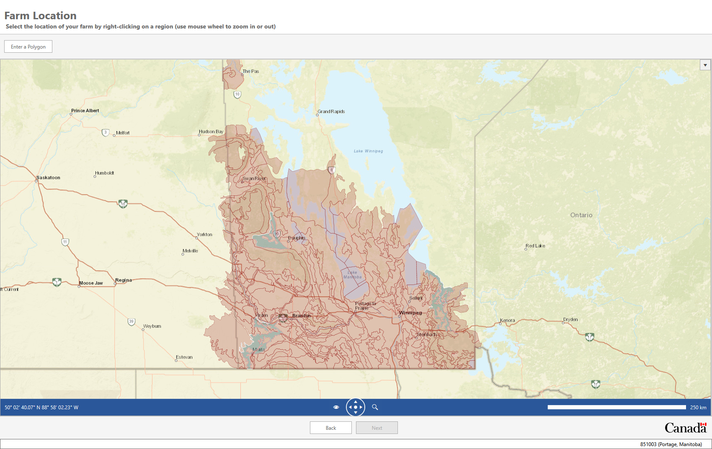
     
    <em>Figure 5: Map of the Manitoba province showing the different selectable polygons.</em>

Once the farm location is selected, soil information (texture, sand, and clay proportions) for the types of soils found in this polygon are displayed on the right side of the screen. It is possible that more than one soil type per polygon will be found and the user is expected to select their soil type from this list or use the default selection (Figure 7). The default soil type selected represents the dominant soil type for the chosen polygon.

For this tutorial, keep the default **Soil Zone** as **"Black"** soil, and the default **Hardiness Zone** as **"3b"**.  

 

    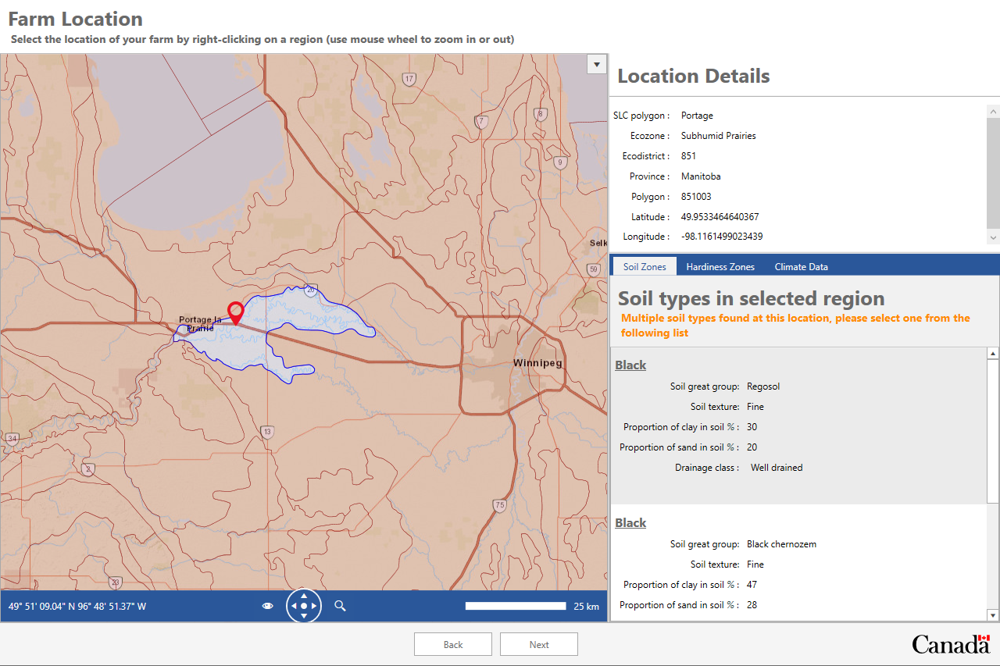
     
    <em>Figure 6: Multiple soil types may be available for a given region.</em>

  

 

 > *Note: Soil data obtained from the user’s selected location will be used in the calculation of location-specific N2O emission factors. Properties such as soil texture, top layer thickness, and pH are required for these calculations, and can be overwritten on the Component Selection screen, under Settings > Farm Defaults > Soil.*

 

Click the **Next** button to proceed to the next step.

# Selecting Farm Components

Now that the farm location has been selected, we can move on to the **Component Selection** screen. This is where the user can select different components for their farm. Holos will display all available components on the left side of the screen under the **Available Components** column (Figure 8). These components are grouped into various categories including Land Management, Beef Production, Dairy Cattle, Swine, Sheep, Poultry and Other Livestock.

If we click on the drop-down button next to a category's name, we can see the available components in that category.  For this portion of the training, we will be working with the “Land management” and “Beef Production” categories.  

 

    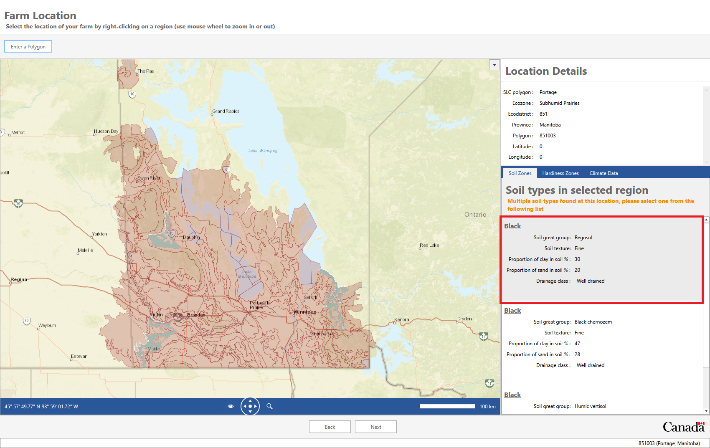
     
    <em>Figure 7: The available components screen. Specific components can be chosen here to include in the farm.</em>

 
 

The Holos model is designed so that the land management components are defined before the livestock components. This is because the model allows for the placement of livestock onto a specific field(s) (i.e., pasture(s)) for grazing. It is easier to do this if the pasture field has already been defined. However, the user can first set up their livestock components and then their field components, but will then need to return to their livestock components to ‘place’ them on pasture.

## Crop and Hay Production

Now we can add our first component to the farm. Drag a **Field** component from the left side of the screen and drop it on the **My Farm** on the right side (Figure 9). The screen will now update to reflect this new component that you have added to your farm. Holos will  label the field as **"Field #1"**. At this point, we can enter production information related to the crop being grown on this field.  

    
     
    <em>Figure 8: Adding a component to the farm.</em>

 
 

### Wheat with Cover Crop

Our first field on the farm will grow continuous wheat with a cover crop of hairy vetch. Change the following elements in the **"Field #1"** component.

1. Rename the field to **"Wheat & Hairy Vetch"** in the **Step 1** section of the screen. Change the area of the field to **18 ha**.
   
2. Leave the start year as 1985 and change the end year to 2023.

3. Select **"Wheat"** as the main crop and **"Hairy Vetch"** as the cover crop in **Step 2**.

4. Under the **General** tab:
    * Enter a yield of **"3,000 kg ha-1"** (wet weight). The dry weight value will be calculated automatically based on the moisture content of crop value.
    * Select **"Reduced Tillage"**" as the tillage type.
    * Enter **"200"** mm ha-1 as the amount of irrigation.
    * Select **"0"** as the number of pesticide passes.
    * Leave **"Cash crop"** as the harvest method.
   
 

    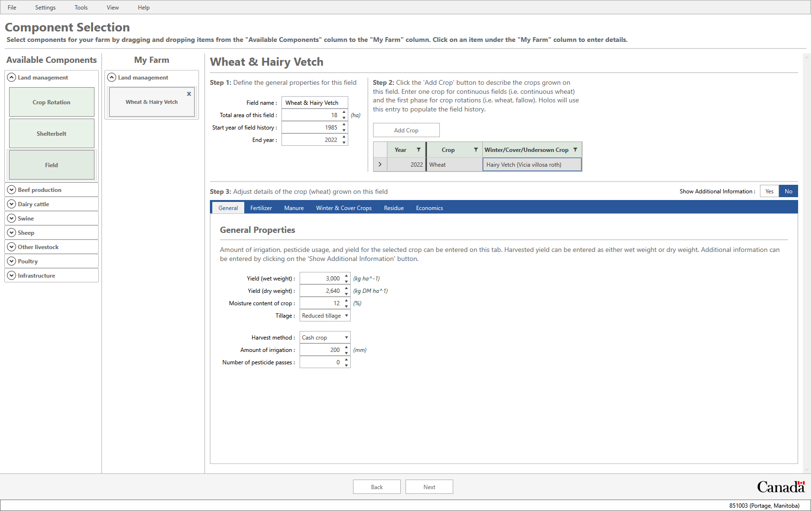
     
    <em>Figure 9: Field component of the farm.</em>

 
  

4. Select the **Fertilizer** tab and click the **Add Fertilizer Application** button. Holos has now added a new fertilizer application for this field and will suggest **"Urea"** as the fertilizer blend. A default application rate is calculated based on the yield value entered for this field. Details of this fertilizer application can be changed by clicking the **Show Additional Information** button (e.g., season of application, blend, method of application, etc.).

 

    
     
    <em>Figure 10: Adding fertilizer to a field.</em>

 
 

>*Note: It is not necessary to enter a crop for each individual year going back to 1985 (or an alternative user-defined start year); only enough crops to describe a single phase of the rotation will need to be entered by the user. Holos will then copy this phase information and back-populate the field history (i.e., Holos will copy the specified rotation back to the start year on behalf of the user).*

>*At a minimum, Holos requires the area of the field, type of crop grown, and a field-specific fertilizer application rate (where applicable) to calculate direct and indirect N2O emissions.*

> *Residue management of each crop (and cover crop) can be adjusted in Holos (see the Residue tab). Holos provides default values depending on the type of crop being grown and will set a value for percentage of product returned to soil, percentage of straw returned to soil, etc. These residue input settings will have an impact on the final soil C change estimates, as well as soil N2O emissions estimates.*

> *Furthermore, biomass fractions and N concentrations can be overwritten by the user, and in this way ‘custom’ crops can be added that are currently not available in the crop drop-down menus.*

## Native Grassland

The cow-calf operation (defined later on) relies on native pasture for the summer months (May through October).

1. Drag a new **Field** component to your list of components. Enter **"Native Grassland"** as the field name.
2. Leave the start year as 1985 and change the end year to 2023.
3. Enter **"100"** ha as the total area of the field.
4. Select **"Rangeland (Native)"** from the drop-down crop list in the **Crop** column under **Step 2**. Please note that Holos auto-populates the **Winter/Cover/Undersown Crop** field when a perennial crop is selected.
5. Enter **"0" mm ha-1** as the amount of irrigation and **"0"** as the number of pesticide passes.
6. No fertilizer is used for this crop.

 

    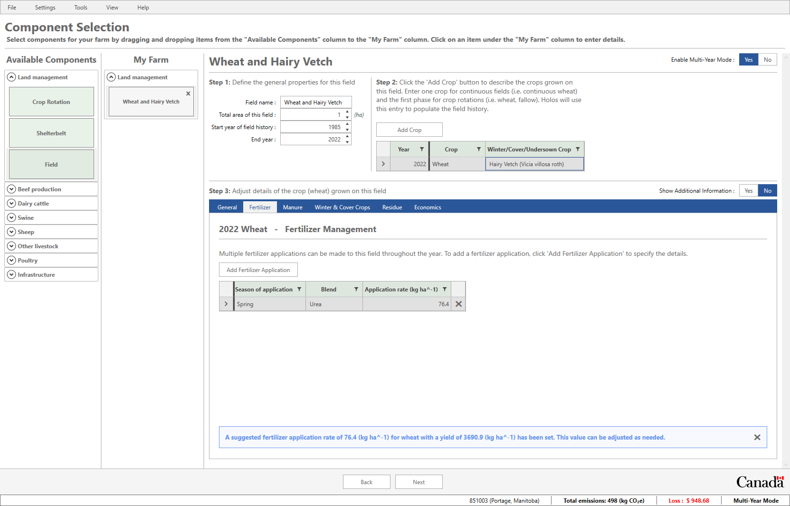
     
    <em>Figure 11: Native Grassland information.</em>

 
 

## Barley Grain and Mixed Hay Rotation

To demonstrate the crop rotation component (as opposed to using individual field components), we will assume that barley grain and mixed hay are grown in rotation, with the mixed hay under-seeded to the barley so that it can be harvested in both main years (example derived from University of Alberta’s Breton plots). 

When using the **Crop Rotation** component, any sequence of crops that are input into this component will be applied to each individual field that is part of the rotation setup. This means one field is added for each rotation phase, and the rotation shifts so that each rotation phase is present on one field. Since each field can have a different historical management, soil C algorithms are run for each field.

For this example, we assume that the farm requires **70 ha** of barley grain and mixed hay, which are grown in rotation. We will need to set up three fields where barley grain is rotated in each field every two years (Figure 12). When using the crop rotation component, the crop management input of a specific crop is repeated on each field in the rotation where the crop is grown. 

**To set up the rotation:** 

1. Add one **Crop Rotation** component from the available components.
2. To expand the horizontal space available in Holos, click on **View** from the top menu bar and select **"Hide List of Available Components"**.
3. The rotation of this field **begins in 1985 and ends in 2024**. Under step 1, please ensure that these two values are set as the start and end year, respectively.
4. Enter **"70"** ha as the area of this field.
5. Under **Step 2** change the crop to **"Barley"**. The year for this crop should be **2024**.
    * Under the **General Tab** enter **"3,000 kg ha-1"** (wet weight) as the crop yield.
    * Change the tillage type to **"Reduced Tillage"**.
    * Keep **"0"** as the amount of irrigation and number of pesticide passes.
6. Now add another crop to this rotation. Click on **Add Crop** under **Step 2** to add a second crop to the rotation. Note that Holos sets the year for this new crop to 2023 or one before the previous crop's year. This means that Holos is expecting the user to enter crops that have been grown in reverse order back to 1985. 
7. For this newly added crop select **"Tame Mixed (grass/legume)"** as the crop type.
8. Click on the **Add crop** button one more time. For this third crop, select **"Tame Mixed(grass/legume)"** once again as the crop type.

 

    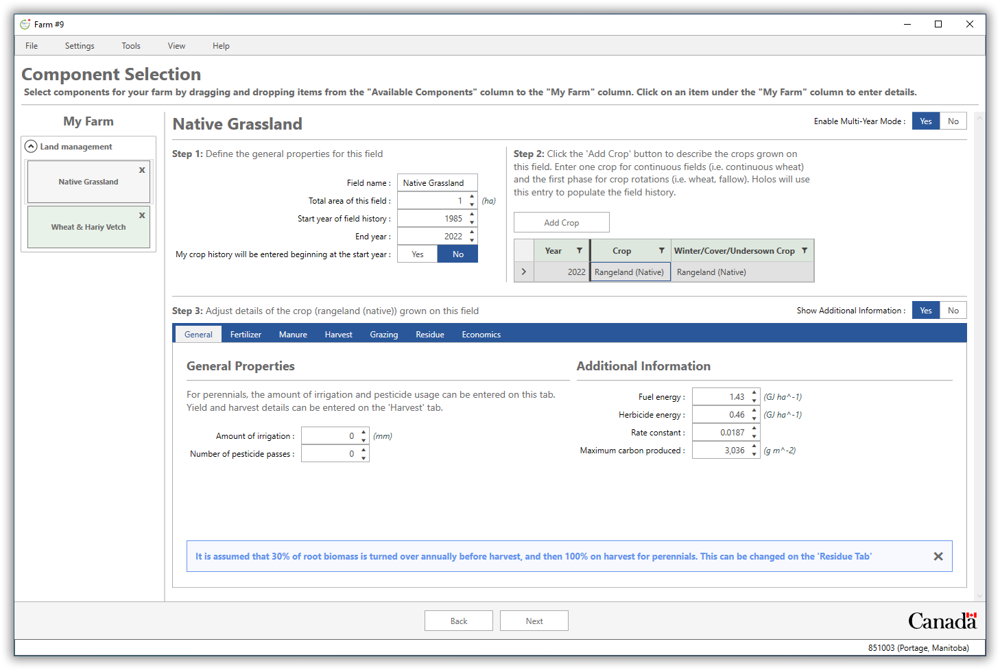
     
    <em>Figure 12: An example of a crop rotation with three crops.</em>

 
 

9. Now add harvest data to each of the tame mixed crops. You will need to select each **Tame mixed** crop and add the harvest data for that specific crop. Select the first tame mixed crop (2023) and then:
    * In the **Harvest Tab**,  click the **Add Harvest Date** button to create a new harvest.
    * Select a harvest date of **"August 31, 2023"**, assuming the harvest is carried out on the same day every year.
    * Select **"Mid"** for the forage growth stage.
    * Enter **"5"** as the total number of bales.
    * Enter **"500"** as the wet bale weight.
10. Repeat step 9 for the second tame mixed crop (in 2022).

If the tame mixed field is harvested more than once, the **Add Harvest Date** button can be used to add subsequent harvests.

## Cow-Calf Operation

Click the view menu item and uncheck the **Hide List of Available Components** option so that we can see all of the available components again.

Adding animal components follows the same approach used for the land management components. Under the **Beef Production** category in the available components, drag and drop one **Beef Cow-Calf** component to the **My farm** section on the right. **Replacement heifers** will not be used in this example, so we will remove this group by clicking the **X** icon right next to this row under **Step 1**.

 

    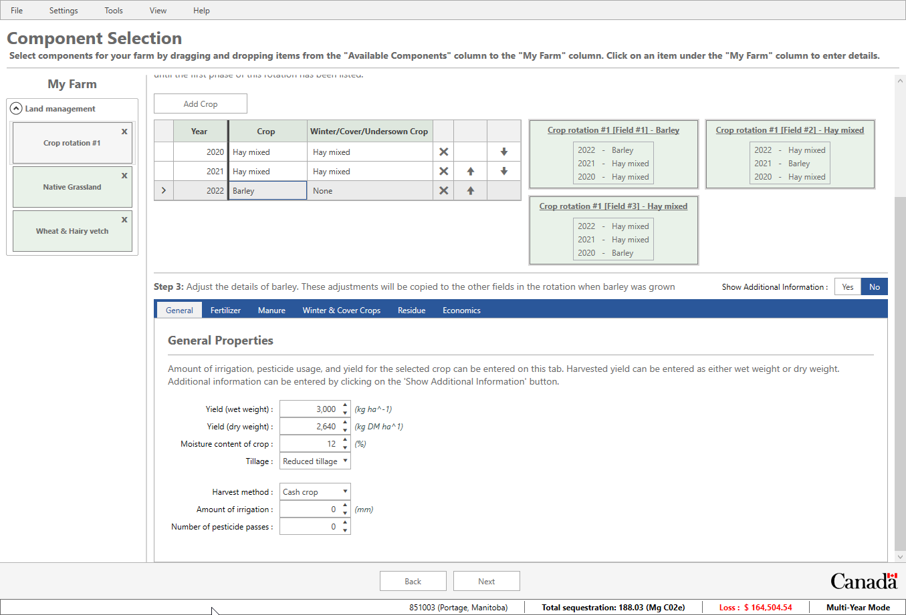
     
    <em>Figure 13: The Beef Cow-Calf Component.</em>

 
 

### Entering information for Beef Cows, Calves and Bulls

#### Beef Cows - Winter Feeding

Following the annual feeding cycle, the beef farm we are working with is **divided into three  management (production) periods**. We can now enter production and management data corresponding to these three management periods. 

1. Under the animal groups section in **Step 1**, make sure that the **"Cows"** row is selected in order to enter the associated management information for that group.

2. Click the management period named **"Winter Feeding"** in **Step 2** to activate that management period.

3. Ensure **"January 1, 2023"** is set as the start date and **"April 30, 2023"** as the end date.

Next, we can enter data related to the number of animals, diet, manure system, and housing type.

* **General tab:**
    * Enter **"150"** as the number of animals.
    * For all other fields keep the default values.

 

> *Note: The number of animals, average daily gain, and feed quality are the minimum required inputs for calculating methane (CH4) and N2O emissions. The duration of individual management periods (e.g., the number of days spent in confined housing or on pasture) will also be needed. Housing and manure management information are also important inputs but are relatively more impactful on the emissions of monogastrics.*

 

* **Diet tab:**

We are going to create a custom diet for our group of cows during the **"Winter feeding"** management period. (Holos incorporates feed ingredient information from the recently published Nutrient Requirements of Beef Cattle book (2016)).

Click on the **Diet** tab. Since we are going to create our own custom diet, we will click on the **Custom Diet Creator** button. Note that Holos also provides a default set of animal diets that can be used.

* **Custom-Diet Creator**:

    * Click the **Add Custom Diet** button in the **Step 1** section of the screen to create a new custom diet.
    * Rename this diet to **"My Custom Cow Diet"** then press Enter to save the name.
    * To add ingredients to our new diet, select **"Alfalfa hay"** from the ingredient list, and then click the **Add Selected Ingredient to Diet** button.
    * We will add one more ingredient to our diet. Select **Barley Hay** from the ingredient list, and then click the **Add Selected Ingredient to Diet** button.
    * Enter **"50%"** for **"Barley Hay"** and **"50%"** for **"Alfalfa Hay"** under **Step 3**. Note that Holos now reports the diet being complete since all ingredients total up to 100%.

* Click the **OK** button to save the new custom diet
* On the main **Diet** tab, select the **"My Custom Cow Diet"** from the drop down-down menu.

 

> *Note: Diet quality information such as crude protein, total digestible nutrient, and fat are required inputs so that Holos can estimate enteric CH4 emissions from an animal group.*

 

 

    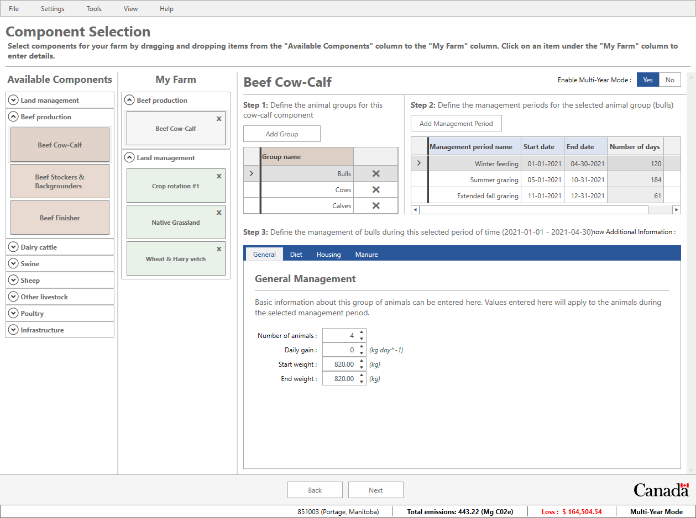
     
    <em>Figure 14: Custom diet creator for the Cows animal group.</em>

 
 

* **Housing tab**: 
    * Select **"Confined no barn"** as the housing type.

* **Manure tab**:
    * Select **"Deep Bedding"** as the manure handling system.
    

 

#### Beef Cows - Summer Grazing

Click on the management period named **"Summer Grazing"**. Ensure that the start date is set to **"May 1st, 2023"** and the end date is set to **"October 31st, 2023"**.

* **General tab:**
    * Enter **"150"** as the number of animals.

* **Diet tab:**
    * Select **"High energy protein"** as the diet type.

* **Housing tab:**
    * Select **"Pasture/range/paddock"** as the housing type.
    * Select **"Native Grassland"** as the pasture location.
 
* **Manure tab**:
    * Select **"Pasture/range/paddock"** as the manure handling system.

 

#### Beef Cows - Extended Fall Grazing

Click on the management period named **"Extended Fall Grazing"**. Ensure that the start date is set to **"November 1st, 2023"** and the end date is set to **"December 31st, 2023"**.

* **General tab:**
    * Enter **"150"** as the number of animals.

* **Diet tab:**
    * Select **"Medium energy protein"** as the diet type.

* **Housing tab:**
    * Select **"Pasture/range/paddock"** as the housing type.
    * Select **"Native Grassland"** as the pasture location.
 
* **Manure tab**:
    * Select **"Pasture/range/paddock"** as the manure handling system.

 

 

    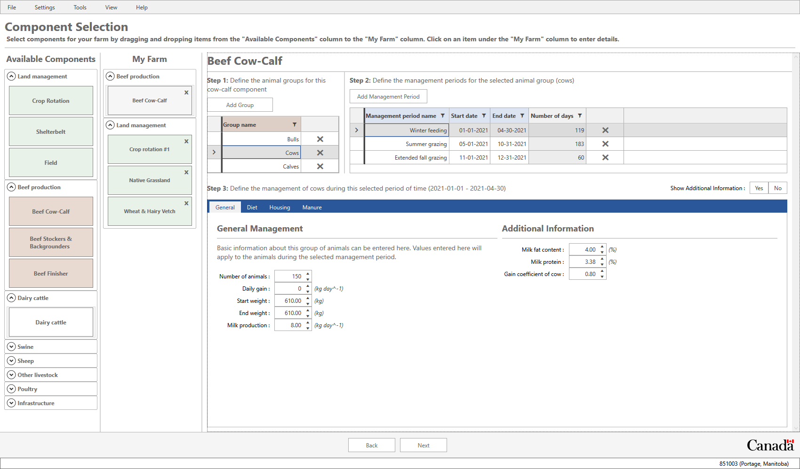
     
    <em>Figure 15: Beef Cow-Calf component, Cow group</em>

 
  

#### Bulls

Click on the **"Bulls"** row in the animal group section under **Step 1**. Information related to diet, housing and manure management is identical to the cows group.

- Right click on the **"Bulls"** animal group. A menu will appear allowing you to select the option to copy management periods from another animal group. Since the management for the bulls is similar to the management for the cows, click the **Copy Management From** -> **Cows** sub-menu item.
- Adjust the number of bulls for each of the three management periods to **"4"**.

 

    
     
    <em>Figure 16: Copying data from another animal group</em>

 
 

#### Beef Calves

Calves on our farm are born on March 1 and weaned on September 30 at the age of seven months. Using a final weaning rate of 85%, we will have 110 calves from March to September. Following the cows, calves will be in confinement for the months of March and April and will be grazing on pasture from May to September. This will result in two separate management periods.

Click on the **"Calves"** row in the animal group section under **Step 1** to activate the calf group. The first management period will span from **"March 1, 2023"** to **"April 30, 2023"** and the second management period will span from **"May 1, 2023"** to **"September 30, 2022**.

**Management Period #1:**

Rename this period from Management Period #1 to **"Confinement"**.

* **General tab:**
    * Enter **"110"** as the number of animals.
    * For all other fields keep the default values.

* **Housing tab:**
    * Select **"Confined no barn"** as the housing type.
 
* **Manure tab**:
    * Select **"Deep bedding"** as the manure handling system.

 

**Management Period #2:**

Rename this period from Management Period #2 to **"Grazing"**.

* **General tab:**
    * Enter **"110"** as the number of animals.

* **Diet tab:**
    * Select **"High energy protein"** as the diet type.

* **Housing tab:**
    * Select **"Pasture/range/paddock"** as the housing type.
    * Select **"Native Grassland"** as the pasture location.
 
* **Manure tab**:
    * Select **"Pasture/range/paddock** as the manure handling system.

 

### Adding a Manure Application to the Wheat Field

Holos has the ability to add manure applications from manure that is sourced from livestock on the current farm or from imported manure (off-site). Since we have now defined our animal components, we can apply manure to any field on our farm.

1. Select the **Wheat & hairy vetch** field from the list of components added to our farm.
2. Click on the **Manure tab** and then click the **Add Manure Application** button. 
    * Select **Beef cattle** as the **Manure type**.
    * Select **Livestock** as the **Origin of manure**.
    * Select **Deep Bedding** as the **Manure handling system**.
    * Enter **200 kg/ha** as the amount of manure applied to this field.
3. Note that both chemical fertilizers and manure applications can be made on the same field

 

### Adding supplemental hay/forage for grazing animals

We can also add additional hay/forage for animals that are grazing on a particular field. Since we have now placed a group of animals on the “Native Grassland” field component, and we have also provided harvest information for our mixed hay crops on the crop rotation component, we can then add an additional forage supplement for these grazing animals.

1. Select the **Native Grassland** field component we created earlier.
2. Click on the **Grazing tab.**
    - Click the **Add Supplemental Hay** button to add additional forage for the animals on this field.
    - Enter "**On-farm**" as the **Sources of bales**.
    - Choose **Crop rotation #1 [Field #2] - Tame Mixed (grass/legume)** under **Field** to select the source of the supplemental hay.
    - Change the **Number of bales** to 1
    - Enter **500** as the wet bale weight.
    - Keep the moisture content as the default value.
  
  *Note: It is not recommended to mix different species of grasses together. Here, we are only demonstrating the ability of Holos to add supplemental hay to a field that has grazing animals*

 

    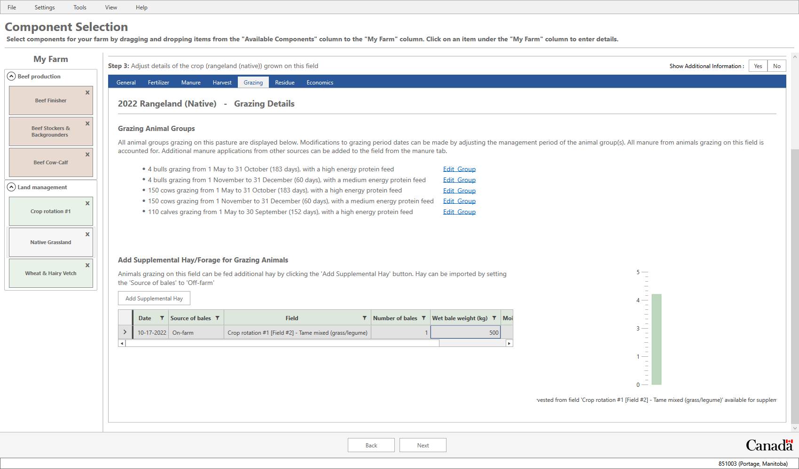
     
    <em>Figure 19 - Adding supplemental hay/forage for grazing animals.</em>

  
 

## Pullet Farm Operation:

We will add one last animal component to our farm. In addition to the beef cattle operations of this farm, we will also be adding a “**Chicken Meat Production**” component to our farm. If you hover your mouse cursor over the “Chicken Meat Production” component under the “Poultry” category, Holos will display a tooltip that gives a brief description of a chicken meat production operation:
    

***“Chicks arriving in the operation from a multiplier hatchery are raised to market weight (1-4 kg)”***

1. Drag one "**Chicken Meat Production**" component to the farm. For each group (Pullets and Cockerels), each management period for that group will consist of **400** animals. This means numbers of animals will be consistent throughout the management periods / year.
2. Select the **Pullets** group. The start and end dates for each management period will be:
    - **Brooding Stage:** Start: January 1st, 2023 - End: January 22nd, 2023. 
    - **Rearing Stage:** Start: January 23rd, 2023 - End: June 26th, 2023.
    - **Rearing Stage:** Start: June 27th, 2023 - End: November 28th, 2023.
3. For each management period, set number of animals to **400**.
4. Leave the entries in Housing and Manure as default.

- The management data for the **Cockerels** group is the same as **Pullets**. Right click on the Cockerels group to activate the right click menu and select **Copy Management From -> Pullets**

 
 

# Timeline Screen

We are now finishing the process of defining our farm. Click the **Next** button to go forward to the timeline screen.
The timeline screen provides a visual layout of all the fields from 1985 to the specified end year for each field. This screen also allows the user to add historical and projected production systems. 

The **Add Historical Production System** button enables the user to add a different cropping history to individual fields whereas the **Add Projected Production System** button enables the user to add a future (projected) cropping system to individual fields.

### Adding a historical production system

We will assume that the barley grain and mixed hay rotation fields were previously in a continuous wheat cropping system between **1985 and 2000.**

1. To add a new historical cropping system, select one of the fields that are in the barley grain and mixed hay rotation. To select an item, click on the timeline bar to activate that field. We will select the first field in this rotation (i.e., the field with the name of “**Crop rotation #1 [Field #1] - Barley**”)

2. Click on the **Add Historical Production System** button which will add a new row to the table under the “**Step 1**” section in the upper left section of the screen. Notice that this new entry has the words “**Historical management practice**” added.

3. We will set the end year of this historical management practice to the year **2000**. To adjust this we use the numeric up/down buttons within the cell.

4. Select the newly added **Historical management practice** and then click the “**Edit Selected**” button. This will open a new screen that allows us to adjust the crops grown and the management during this period.

5. Click on the “**Barley**” crop under the “**Step 2**” section. Change the crop type to ‘**Wheat**’ and on the ‘**General**’ tab change the yield to **3,500** kg/ha. We will keep the other settings unchanged.

6. We also need to remove the “**Tame mixed**” crops from this historical period. Click the ‘**x**’ icon beside each of the “**Tame mixed**” crops under the “**Step 2**” section. Clicking the ‘**x**’ icon will remove these crops from the rotation for this period of time.

7. Click “**Ok**” to save adjustments we just made to this field.

8. Repeat these same steps so that the other fields in this rotation also have continuous wheat from **1985 to 2000** using the same steps we used for the first field.

 

    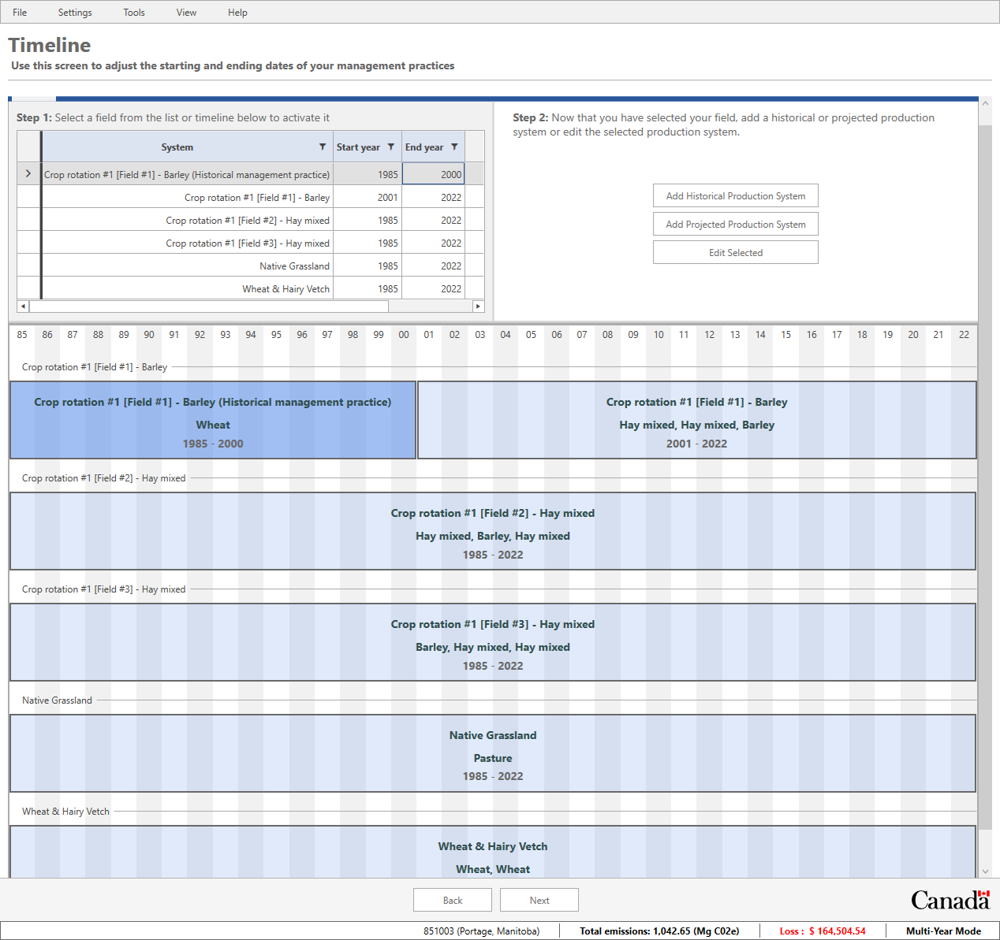
     
    <em>Figure 20: Customized Timeline Screen</em>

 
   

    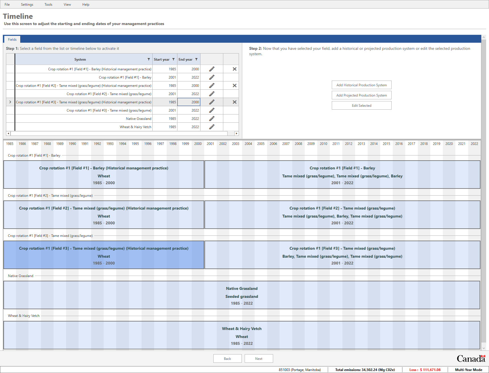
     
    <em>Figure 21: Adjusted start and end year for productions systems on the timeline screen.</em>

 
  

 

    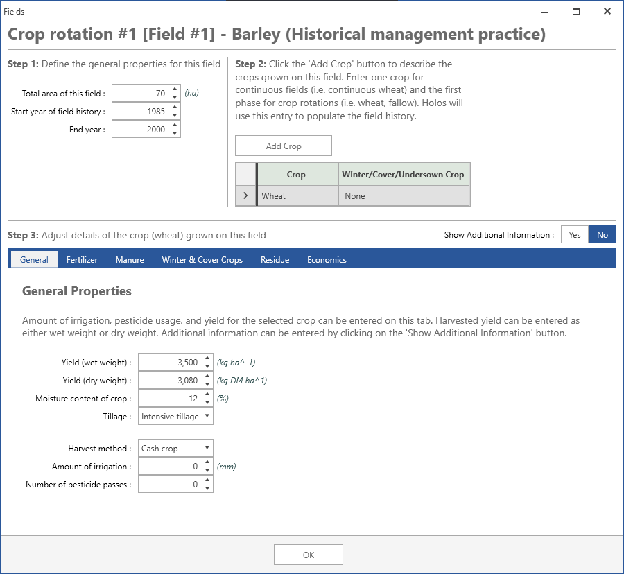
     
    <em>Figure 22: Editing crops in a historical period of the rotation. </em>

 

# Details Screen

Click the “**Next**” button to go forward to the details screen.

To avoid the requirement that a user needs to provide crop yields going back to 1985 for each field on the farm, the model will use Stats Canada reported crop yields as defaults (where available). The model allows the user to calculate how changes in crop type, yield, tillage, residue management, manure, irrigation or fallow will result in changes to soil carbon.

We will adjust this grid so that we can view the above ground and below ground carbon inputs for our wheat field and then we will adjust the crop yield for one specific year.

1. We will set a filter on the first column named ‘**Field name**’ so that we only display information for our **wheat and hairy vetch field**. Beside the column heading, click the ‘**funnel**’ icon to set a filter. Check the box beside **Wheat & hairy vetch**.

2. On the far left of this screen, click the “**Enable Columns**” sidebar (located near the “Field name” column).

3. Place a check beside **Above ground carbon input** to show the column and remove the check beside the **Notes** column to hide it.

4. Click the **Enable Columns** sidebar again to collapse it.

5. We can now (optionally) adjust the yields for our wheat field for any given year if actual measured yields are available.

6. Adjust the yield for **1987** to be **4,100** kg/ha.

7. Note that Holos has updated the above ground carbon inputs for this.

 

    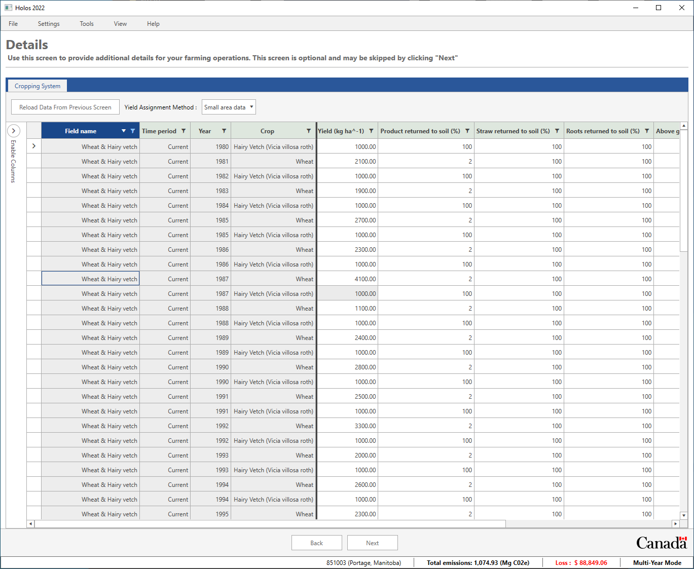
     
    <em>Figure 23: Details screen</em>

 
 
 

#  Discover results

Click the “**Next**” button to move to the final results report. Results will now be displayed in a variety of reports and charts.

1. Click on the tab named **Emissions Pie Chart**

    Starting with the **Emissions pie chart** we can see an overall breakdown of the enteric CH4, manure CH4, direct and indirect N2O. We are also able to see a detailed breakdown of the sources of these emissions.

2. Click the “Yes” button beside **Show details**

    We can see that the biggest source of emissions from our farm is the cow-calf component. If you hover your mouse pointer over any slice of this chart you can get an isolated look at the different emission sources.

3. Click on the tab named **Detailed Emission Report**

    The **Detailed Emission Report** will display a monthly or annual GHG emission report. The detailed emission report will report on enteric methane, manure methane, direct & indirect N2O, and CO2 emissions from the farm.

Click the **Report Format (Monthly)** button to switch to a monthly report. Now we can see a monthly breakdown of all emissions from the farm and the emission source.

In the **Unit of measurements** drop-down menu, you can choose to have the results displayed as CO2 equivalents (CO2e) or as unconverted greenhouse gas (GHG), and you can also choose the unit of measurement as either tonnes or kilograms.

The **Estimates of Production** report provides total harvest yields, amount of land applied manure, and estimates of milk production for dairy components.

The **Feed Estimate** report provides an estimate of dry matter intake based on energy requirements of the animal and the energy in the feed.

    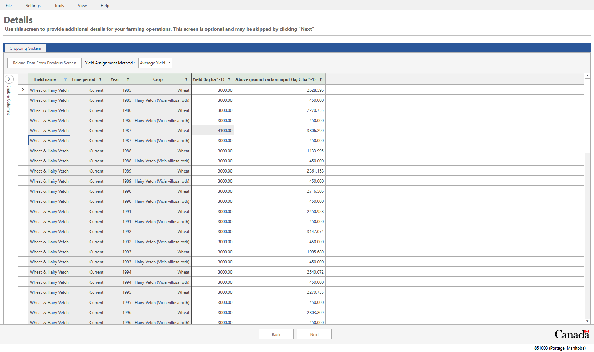
     
    <em>Figure 24: Detailed emissions report.</em>

 
 

    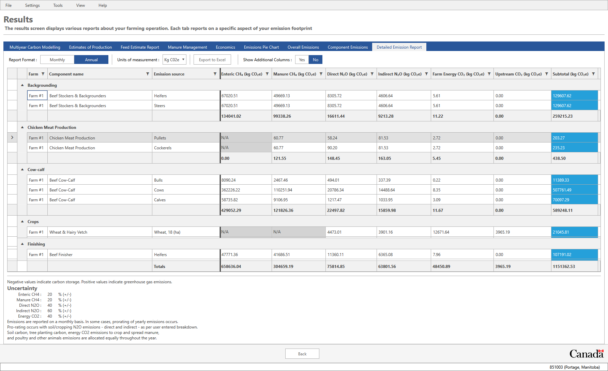
     
    <em>Figure 25: Estimates of production report.</em>

 
 

 

    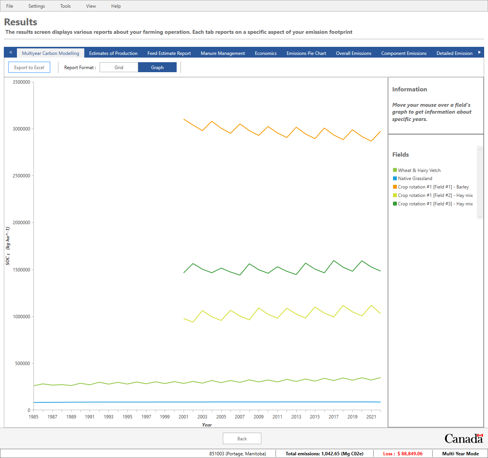
     
    <em>Figure 26: Feed estimate report.</em>

 
 

## Soil carbon modelling results

On the results screen we can see the change in soil carbon over time by clicking the “Multiyear Carbon Modelling” tab. This tab displays a graph showing the change in soil carbon over time for each one of our fields.

For each field on the graph, you can hover your mouse over the series to get more information for each historical year of the field.

If we click on one of these points, we can then view a more detailed breakdown of these results. We can also export this data by clicking the “Export to Excel” button.

 

    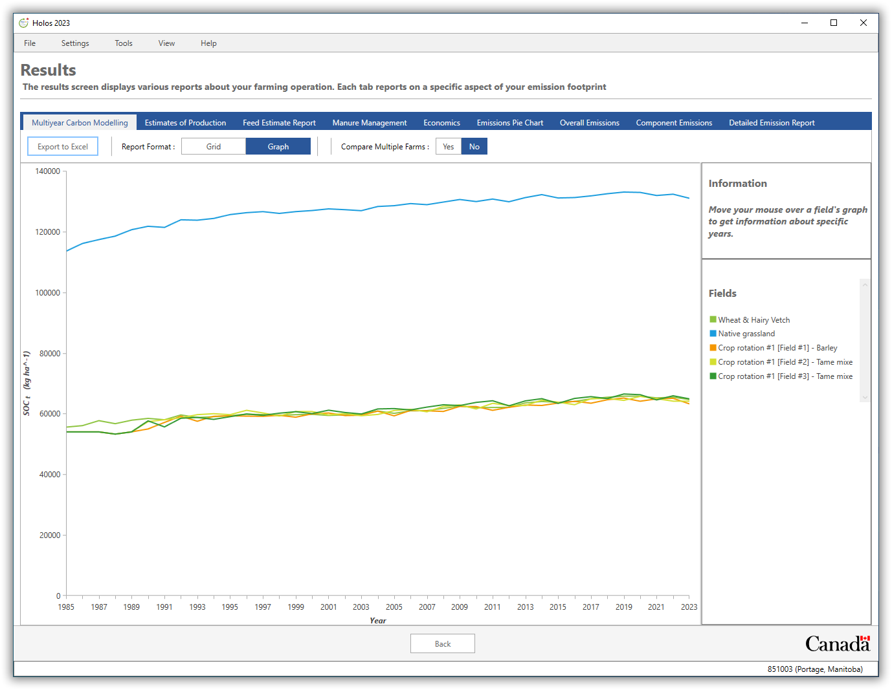
     
    <em>Figure 27: Carbon report section. Allows switching between graph and table format.</em>

 
 

# Finally...

### Whole-systems approach 

An ecosystem consists of not only the organisms and the environment they live in but also the interactions within and between. A whole systems approach seeks to describe and understand the entire system as an integrated whole, rather than as individual components. This holistic approach can be very complex and describing the process can be difficult. One method to conceptualize a whole system is with a mathematical model. 

The whole-systems approach ensures the effects of management changes are transferred throughout the entire system to the resulting net farm emissions. In some cases, reducing one GHG will actually increase the emissions of another. The whole-systems approach avoids potentially ill-advised practices based on preoccupation with one individual GHG.

To download Holos, for more information, or to access a recent list of Holos related publications, visit: www.agr.gc.ca

To contact us, email:
aafc.holos.acc@canada.ca
