**CLI Training Guide**

**Introduction**

An alternative to the Graphical User Interface (GUI), is the Command Line Interface (CLI).

The CLI was meant to make it easier run multiple farming scenarios in a single batch without the need to build each individual farm in the GUI. Building many farms in the GUI can be time consuming when many scenarios must be considered.

The set of features and functionality available in the CLI is different than what is available in the GUI. Generally speaking, the GUI has more flexibility when modelling complicated farming scenarios. This is one of the tradeoffs when using the CLI, the speed of setting up multiple farms in the CLI is at the cost of losing some features and functionality that are only found in the GUI.

For example, it is currently not possible to add an Anaerobic Digestion component to your farm when using the CLI. The Anaerobic Digestion component is only available when using the GUI.

**Getting started**

The CLI can be downloaded from the GitHub page.

<a href="https://agriculture.canada.ca/holos/cli/setup.exe">link to download</a>

The installation package will install the CLI on your computer. As with the GUI, the CLI is only supported on Microsoft Windows PCs. Similar to the GUI, the CLI will automatically update itself when there are new features or bug fixes.

The core algorithms used in the Holos CLI are the same as those used in the GUI and therefore expect the same basic inputs that you would enter into the GUI when building a farm.

Basic requirements such as the farm’s location, number of animals, fertilizer application rates are a few examples of the types of input that will need to be entered when running the CLI.

The fundamental difference between the GUI and CLI is that the user must create a collection of Excel comma separated files (or CSVs) where each file will represent the input data that would have been entered manually in the GUI.

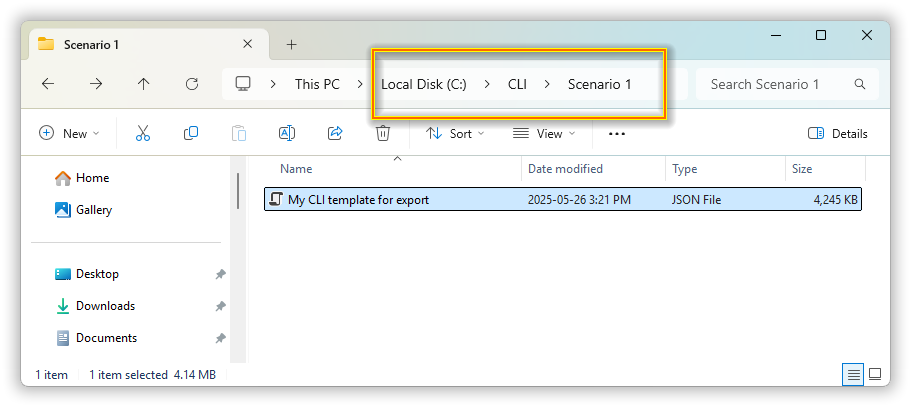

_(Figure 1-1, CLI input files)_

All field and animal management inputs must be specified by the user through the use of these CSV files and the files must have the expected headings and a certain layout of columns and rows.

**Running a Single Farm Though the CLI**

Running the CLI consists of telling Holos where your farm files are located on your computer. The full path to these files is required when starting the CLI. This directory will be where Holos outputs your results.

Starting with a single farm, we will verify that we have the components we want to use for this scenario.

In this simple scenario we will have a single field component and a single backgrounding component. Similar to the way the Holos GUI requires the user to the drag and drop components to specify how their farm is setup, the CLI requires a similar approach by requiring the user to create an Excel file (simple CSV) that represents our field component and one file that represents our backgrounding component.

Now that we understand how the input file mechanism works, we will create a farm folder and add our two input files. We will need to create one field component input file and one beef backgrounding component input file.

(I have already created this farm folder and will show you the directories and files contained)

Steps:

1. Create farm folder on C drive. This folder will contain all components for the farm.
    1. (my demo farm folder is already created)
2. Use templates for field and backgrounding components. These will be the two components that represent our farm.
    1. (the two demo files we need are already created)
3. Fill in or edit template files according to what we want to model
    1. (show both files and quickly show rows and columns)

**Data Files are Prepared and Now We Run the CLI**

Now that we have created our input files, we can run the CLI and get our results.

Start by double clicking the HOLOS CLI desktop icon to begin the application.

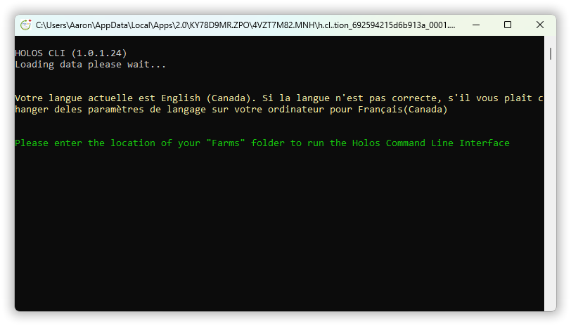

_(Open the Holos CLI, Figure1-2)_

The first question the CLI will ask the user is to specify the location of the CLI input files. The user must enter the full path to the directory/folder including the drive letter. You can copy the path to your input folder/directory displayed in Windows Explorer and paste it into the CLI window.

_(Enter path to farms folder_ **_C:\\Users\\Aaron\\Documents\\WORK\\Projects\\Holos\\Software\\CLI_**_)_

The CLI will then ask the user if they would like to import farm files from the GUI. This next step allows for the user to export any farms from the GUI and then import them as a CLI input files. The user can then use a GUI farm file as a starting point instead of having to manually create the component input files. If you do have files you would like to import, you will need to enter the path to those files on your PC during this prompt.

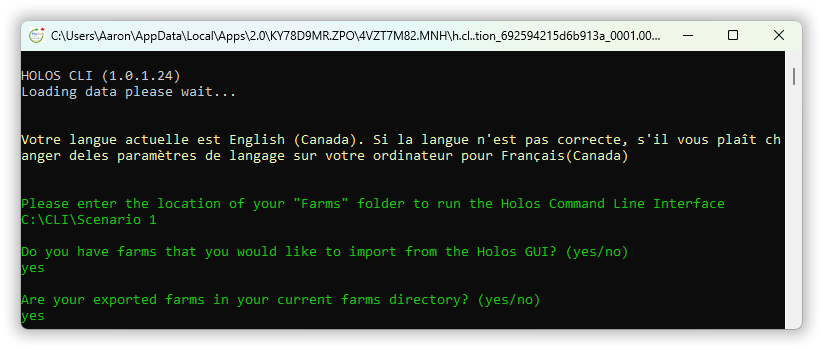

_(Enter no here, Figure1-3)_

Note, all input files must be closed when running the CLI. If you have any input files opened (i.e. opened in Microsoft Excel) the CLI will produce an error and end the session.

After entering all the necessary information required has been collected from the user, the CLI will begin the simulation. The CLI will first read all necessary tables needed to calculate results so the first few seconds will be dedicated to the reading of these data and also downloading the NASA climate data.

Finally, the CLI will ask which units of measurement will be used

Once the initialization process is completed, Holos will then iterate over all of the farm folders located in the directory specified and calculate GHG emission results.

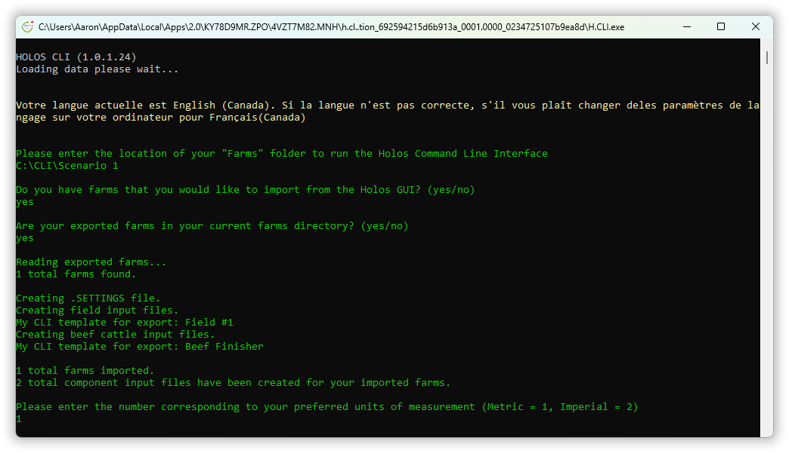

_(Enter units of measurement and then run the CLI, Figure1-4)_

At the end of the simulation, the CLI indicates that it is finished, and that the user can now view the output/result files.

**Output & Result Files**

For our field component results, the CLI will create an Excel output file in the “**Outputs/Farm_Name_Results/Fields**” folder. If we look at this file, we can see that it is the exact same output file that we get if we export our field results from the GUI. We have columns for SOC, N2O emissions, etc.

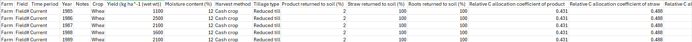

_(Open field results file, Figure1-5)_

For our animal results, there will be an output file placed in the “**Outputs/FarmName_Results**”. There will be a file named “**Farm_Name_CO2EEmissions_Farm-en-CA**” which is equivalent to the “Detailed Emissions Report” available in the GUI. By default, the results will be shown in Mg CO2e which is different from the GUI report which defaults to reporting emissions in kg CO2e.

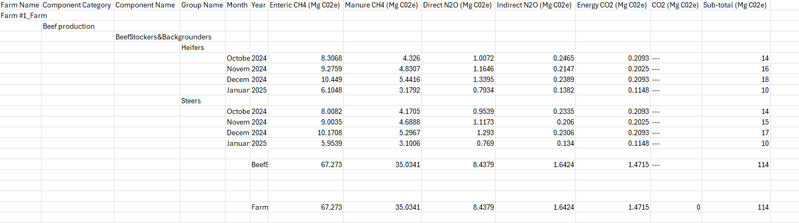

_(Open animal results file, Figure1-6)_

**Running 2 or more farms**

Now that we have demonstrated single farm scenario, we can look at how to run 2 or more farms.

In this demonstration, we will keep most settings between the two farms the same. The only things we will change is the location of the second farm and the number of animals in the second farm. Changing the location of the second farm will demonstrate how to use the settings file that is read by the CLI to determine the climate data for the farm.

To create a second farm, we will simply copy the entire farm folder we used previously and then rename it to farm #2.

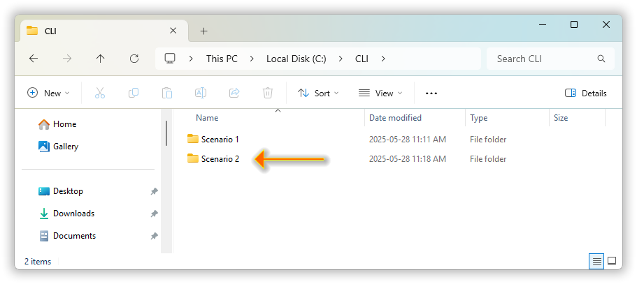

_(copy farm folder and rename it to farm #2, Figure1-7)_

Now we have created a carbon copy of our first farm we can modify the second farm’s settings so that it has a different location. To change the farm’s location, we need to modify the settings file found in the farm folder. This settings file will have the name “Farm” and a file extension of .SETTINGS. You can use any text file editor when editing this .SETTINGS file (i.e. Notepad etc.)

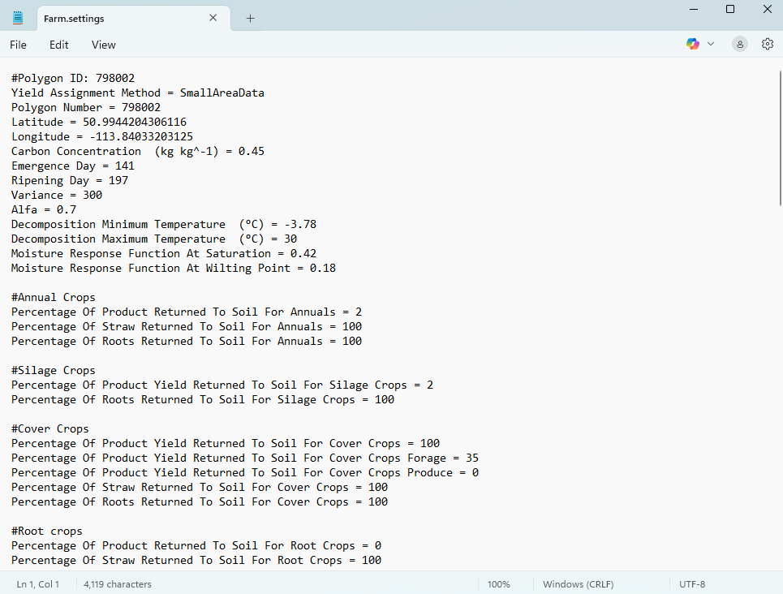

_(Open settings file, Figure1-8)_

Once we open the settings file, we want to locate the two lines that define the Latitude and the Longitude of the farm. Here we can see that these two lines are on the 4th and 5th line of this settings file. Since these two values represent the position of our first farm, we will modify the latitude and longitude now.

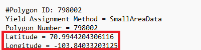

_(Change two values, Figure1-9)_

Our next change will be to edit the number of animals in our beef stockers and backgrounders component. To make this change we need to go into our second farm folder, find our Beef category folder that contains all of our beef cattle components, and open the component input file.

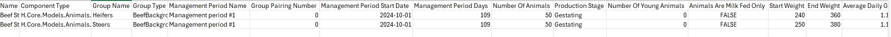

_(Open backgrounders file)_

Once we have the beef cattle file opened, we can see all the columns and rows that represent our management periods for our animal groups.

In this component file, we can see that we have columns that represent what would normally be displayed and modified in the GUI. For example, we can see one row that represents a group of beef backgrounding heifers

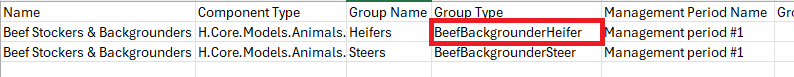

_(show row, Figure1-11)_

and another row that represents beef backgrounding steers.

One of the first columns we can see if the column that represents that start date of the management period. Next, we can see the column that represents the number of animals for each group.

This is where we will make our edit to change the number of animals from 50 heifers to 100 heifers. Once we make the change, we save and then close the CLI file. It is important to make sure all input files are closed before running the CLI.

Now that we have created our second farm and changed our settings, we will run the CLI again.

_(Go through full CLI run at this point)_

Now we are finished with our second run.

When you have two or more farms that you run through the CLI, there will be a combined output file that summarizes the results from all the animal emissions from all farms in the scenario. This combined file will be created in a folder called TotalResultsForAllFarms.

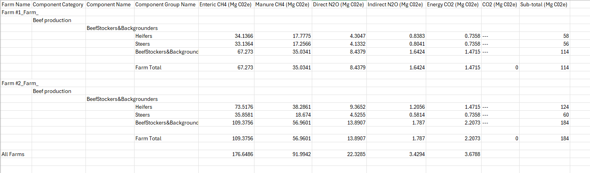

_(Open_ **_totalresults_CO2EEmissions-en-CA_**_.csv, Figure1-12)_

Finished training, move on to Q and A

**What scenarios should I use the CLI for?**

The CLI was built as an alternative to the GUI so that the user could reduce the amount of time needed to build a farm in the GUI. The time is reduced because there is no need to start up the GUI, enter the data, and wait for the results to be calculated. This time is reduced because there is no processing time needed to display the detailed grids and tables, all of the drop down menus, input boxes. All of these visual aspects take significant computing resources when displaying them on the screen.

The very simply interface offered by the CLI results in much faster processing times.

One possible use case of the CLI would be if you are interested in iterating over all possible values of one or many input variables (i.e. Monte Carlo analysis). In this case, the CLI should be used since it is easier to create multiple farms which have different values of one particular target variable.

One example variable that could be easily iterated over would the TDN value of an animal diet. Using the CLI, the user can create 1 farm file with the starting TDN, and then subsequent farm files that each add step value to the beginning TDN value. (i.e. One farm file starts with a TDN of 50, subsequent farm files use a TDN value of 55, 60, etc.)

**What scenarios should I use the GUI for?**

If you are only interested in simulated a small number of farms, the GUI should be used. This is because the learning curve to use the GUI is much smaller than the CLI. Also, there are components that are only available in the GUI (i.e. Anaerobic Digestion)

**What are the Limitations of Using the CLI?**

Although the CLI can run scenarios a lot faster than the GUI, the user still needs to create the input files representing the farm components. If there are many farms with many different components, the process of creating these input files can be time consuming as well. One approach to help build these input files is to simply copy and paste entire farm folders essentially making a carbon copy of one farm which can then be adjusted to differ from the original farm in some way. There is also an option to automate the creation of the CLI input files using a scripting languages such as Python.

To help understand how to use the CLI, there is a general CLI user guide on GitHub. We also have a list of CLI parameters which can be used as a reference guide when creating the CLI input files.

_Show demo of 100 farms being run in CLI_

Finished
