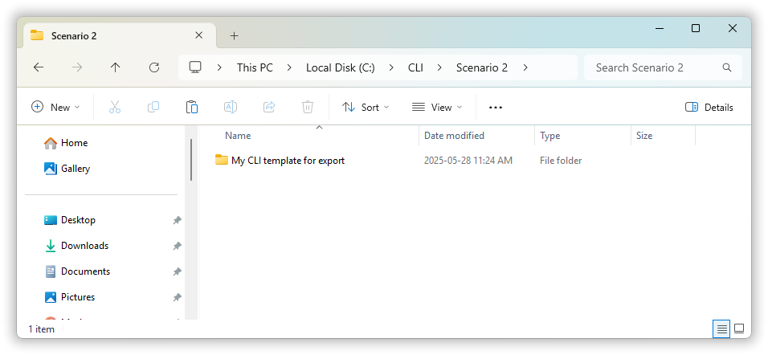
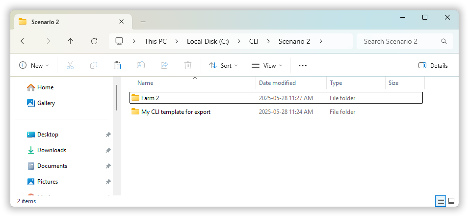

# CLI Training Guide

## Introduction

An alternative to the Holos Graphical User Interface (GUI), is the Command Line Interface (CLI).

The CLI was meant to make it easier to run multiple farming scenarios in a single batch without the need to build each individual farm in the GUI. Building many farms in the GUI can be time consuming when many scenarios must be considered.

The features and functionality available in the CLI is similar but not exactly the same to what is available in the GUI. Generally speaking, the GUI has more flexibility when modelling complicated farming scenarios. This is one of the tradeoffs when using the CLI, the speed of setting up multiple farms in the CLI is at the cost of losing some features and functionality that are only found in the GUI.

For example, it is currently not possible to add an Anaerobic Digestion component to your farm when using the CLI. The Anaerobic Digestion component is only available when using the GUI.

## Getting started

The first step in using the Holos CLI is to download the installation package.

The CLI can be downloaded from the <a href="https://github.com/holos-aafc/Holos" target="_blank">Holos GitHub page</a> under the "**Download**" section. Alternatively you can use this  <a href="https://agriculture.canada.ca/holos/cli/setup.exe" target="_blank">direct download link for the Holos CLI</a>

The installation package will install the CLI on your computer. As with the GUI, the CLI is only supported on Microsoft Windows PCs. Similar to the GUI, the CLI will automatically update itself when there are new features or bug fixes.

### Basic Assumptions when Using the CLI

The core algorithms used in the Holos CLI are the same as those used in the GUI and therefore the CLI will expect the same basic inputs that you would enter into the GUI when building a farm.

Basic requirements such as the farm’s location, number of animals, fertilizer application rates are a few examples of the types of input that will need to be entered when running the CLI.

The fundamental difference between the GUI and CLI is that the user **must create a collection of Excel Comma Separated Files (CSVs) where each file will represents the required input data**. Each one of these files will represent a single component that would normally be added to the farm using the drag & drop interface in the GUI.

When adding component data into the CLI, all field and animal management inputs must be specified by the user through the use of these CSV files. As mentioned in the <a href="https://github.com/holos-aafc/Holos/blob/main/H.Content/Documentation/User%20Guide/User%20Guide.md#chapter-10---command-line-interface" target="_blank">Holos CLI user guide</a>, the files must have the expected headings and a certain layout of columns and rows. More information on how to format these files can be found in the user guide.

## Using the GUI to Build a Template for our First Farm

We will begin by using the GUI to create a basic farm which will then be used as a starting point for our first run of the CLI. Using a farm file that was exported from the GUI is one approach to building the input files required to run scenarios through the CLI. An alternative approach to creating the input files will be discussed later on in the training.

We begin by opening up the Holos GUI and creating a new farm. 

*Note, we will assume that the reader has used the GUI before and is familiar with locating farms on the map screen and adding components to their farm.*

### Creating a Simple Farm in the GUI

1. Open the Holos GUI and create a new farm

2. Name the farm "**My CLI template for export**"

3. Choose **Manitoba** on the province selection screen and then locate any polygon near Winnipeg. Right-click on the polygon to download the climate data.
    * For the purposes of this demonstration it is not important to select a particular polygon. Any polygon can be selected on the map screen.

4. Navigate to the component selection screen and add a single field component to the farm. The details of this field are not important since we are only interested in understanding how to build a basic template for the CLI.

5. Next we will add a single **"Beef Stockers & Backgrounders"** component to our farm. Again the details of the animal management are not important (i.e. number of animals or diet information does not need to be changed).

6. Next we will navigate to the results screen so that Holos can generate the export file (in .JSON format) we will need in the next steps. It is important to always navigate to the final results screen when exporting farm files. The farm files will be empty unless the user has navigated to the final results screen before exporting their data.

7. Finally, we will export our farm file to a location on our computer. Go to the "**File->Export Farm(s)**" to select and then export your farm. Note the name of the file and the location you have saved the file. On my machine. To find the full path to a file, you can right-click on the file and get the location. For this demonstration we will use the location of "**C:\CLI\Scenario 1**".

_(Scenario 1 folder location, Figure 1-1)_

### Running a Single Farm Though the CLI

One of the first steps in running the CLI is to tell Holos where your farm files are located on your computer. The full path to these files is required when starting the CLI. This directory will also be where Holos outputs your final result files.

1. Start by double clicking the HOLOS CLI desktop icon to begin the application.

_(Open the Holos CLI, Figure1-2)_

The first question the CLI will ask is for the location of the CLI input files. The user must enter the full path to the directory/folder including the drive letter. You can copy the path to your input folder/directory displayed in Windows Explorer and paste it into the CLI window.

2. Enter the full path to the location of your exported farm file.
    * _(Enter path to location on your PC where you saved the exported farm file. For example, on my PC my file is located here:_ **_"C:\\CLI\\Scenario 1"_**_)_ You can copy the location of any file or folder on your PC by using Windows Explorer. You can either type full path to the directory or you can copy and paste from Windows Explorer.
    * When you have entered the path, press the "**Enter**" key

The CLI will then ask if you would like to import farm files from the GUI. This allows for the user to export any farms from the GUI and then import them as a CLI input files. The user can then use a GUI farm file as a starting point instead of having to manually create the component input files. 

3. Type **"Yes"** and then the press the "**Enter**" key so that the CLI will use our exported farm file as an input. The next question will be if your exported farm files are in the same directory, type "**Yes**" then press "**Enter**"

_(Import files from the GUI, Figure1-3)_

Finally, the CLI will ask which units of measurement will be used.

4. Type "**1**" for metric and then press "**Enter**"

_(Entering units of measurement, Figure1-4)_

After all the necessary information required has been collected from the user, the CLI will begin the simulation. The CLI will first read all necessary tables needed to calculate results so the first few seconds will be dedicated to the reading of these data and also downloading the NASA climate data.

Once the CLI has completed the calculations it will inform the user that they can press the "**Enter**" key to close the CLI.

5. Press "**Enter**" to close the CLI.

## Output Files

For our field component results, the CLI will create an Excel output file in the “**Outputs/Farm_Name_Results/Fields**” folder. If we look at this file, we can see that it is the exact same output file that we get if we export our field results from the GUI. We have columns for SOC, N2O emissions, etc.

_(Open field results file, Figure1-5)_

For our animal results, there will be an output file placed in the “**Outputs/FarmName_Results**”. There will be a file named “**Farm_Name_CO2EEmissions_Farm-en-CA**” which is equivalent to the “Detailed Emissions Report” available in the GUI. By default, the results will be shown in Mg CO2e which is different from the GUI report which defaults to reporting emissions in kg CO2e.

_(Open animal results file, Figure1-6)_

## Exploring the CSV Input Files

Before continuing, it is important to understand what has been done for us when we told the CLI that we had farm files to import from the GUI. When creating input files for the Holos CLI, the user can take two different approaches. The first approach is the one we have taken in this scenario. Previously, we exported a farm file from the Holos GUI (a file which has the .JSON file extension) and we then informed the Holos CLI to use that file as the basis for running the scenario. The other approach is to not use the GUI at all and instead create a set of input files. Either approach can be used.

Lets first look at the set of input files the CLI has created for us based on the exported farm file we used previously.

1. Locate the folder (e.g. "**My CLI template for export**" where we originally saved our exported farm file.
2. Open the "**Fields**" folder
3. View the field file generated by the CLI (e.g. "**Field #1**"). Verify that we have a row for each year of field history and that "**Wheat**" is grown in each year. Close this file once you have finished viewing it.
4. View the animal component file "**Beef Finisher**" which was generated by the CLI. This file will be in the "**Beef**" folder. Verify that we have two rows - one for each animal management period. Verify that the start weight is "**310 kg**" for our group of steers. Close the file.
5. Note that these are the input files and folders we would have had to make ourselves (by using Excel) if we had not exported a farm from the GUI.

# Running 2 or More Farms

Now that we have demonstrated single farm scenario and understand how to create CLI input files for our farm components, we can look at how to run 2 or more farms.

**Before continuing, we will create a new folder to contain our new farms for this next scenario**

1. Create a new folder "**outside**" of the folder we used previously. A suggested location for this new folder is "C:\\CLI\\Scenario 2". Again, this new folder should not be contained inside the "C:\\CLI\\Scenario 1" folder we created previously.

In this second demonstration, we will keep most settings between the two farms the same. The only things we will change is the location of the second farm and the number of animals in one of our management periods. Changing the location of the second farm will demonstrate how to use the settings file that is read by the CLI to determine the climate data for the farm.

_(Second scenario folder location, Figure1-7)_

1. Copy the first farm folder named "**My CLI template for export**" from the **Scenario 1** directory and paste it into the second scenario folder.

_(Second scenario folder location with copied farm folder, Figure1-7b)_

2. To create our second farm, right click on "**My CLI template for export**" folder to and select copy and then paste the content in the same location so that we two folders. Rename the second farm folder to "**Farm 2**".

_(Second scenario folder location with two farm folders, Figure1-7c)_

Now we have created a carbon copy of our first farm we can modify the second farm’s settings so that it has a different location. To change the farm’s location, we need to modify the settings file found in the second farm folder. This settings file will have the name "**Farm**" and a file extension of .SETTINGS. You can use any text file editor when editing this .SETTINGS file (i.e. Notepad)

_(Open settings file, Figure1-8)_

Once we open the settings file, we want to locate the two lines that define the **Latitude** and the **Longitude** of the farm. Here we can see that these two lines are on the 4th and 5th line of this settings file. Since these two values represent the position of our first farm, we will modify the latitude and longitude now.

1. Locate latitude and longitude in the settigns file and make simple edits to change the location of the farm.

_(Change two values, Figure1-9)_

Our next change will be to edit the number of animals in our beef stockers and backgrounders component. To make this change we need to go into our second farm folder, find our Beef category folder that contains all of our beef cattle components, and open the component input file.

_(Open backgrounders file, Figure1-10)_

Once we have the beef cattle file opened, we can see all the columns and rows that represent our management periods for our animal groups.

In this component file, we can see that we have columns that represent what would normally be displayed and modified in the GUI. For example, we can see one row that represents a group of beef backgrounding heifers

_(Heifer group row, Figure1-11)_

Next we will locate the column that represents the number of animals for each group.

This is where we will make our edit to change the number of animals from 50 heifers to 100. 

1. Edit the number of animals.

Once we make the change, we save and then close the CLI file. It is important to make sure all input files are closed before running the CLI.

Now that we have created our second farm and changed our settings, we will run the CLI again. Before we start the CLI we will ensure all input files are closed.

1. **Start the CLI for our second scenario by double-clicking the CLI desktop icon. Enter the information asked for by the CLI ensure that we use the new folder directory we created for the second scenario. Note that we are entering the name of the folder containing our two farm folders - we don't enter the directory of the farm folders but the directory containing these two folders. We also indicate that we do not want to import farms from the GUI for this second scenario since we already have our two farm folders with the component input files.**

Now we are finished with our second run.

When you have two or more farms that you run through the CLI, there will be a combined output file that summarizes the results from all the animal emissions from all farms in the scenario. This combined file will be created in a folder called TotalResultsForAllFarms.

_(Open_ **_totalresults_CO2EEmissions-en-CA_**_.csv, Figure1-12)_

**End of Training**

# Questions and Answers

**What scenarios should I use the CLI for?**

The CLI was built as an alternative to the GUI so that the user could reduce the amount of time needed to build a farm in the GUI. The time is reduced because there is no need to start up the GUI, enter the data, and wait for the results to be calculated. Total time is reduced because there is no processing time needed to display the detailed grids, tables, drop down menus, etc. All of these visual elements of the GUI take significant computing resources when displayed on the screen.

The very simple interface offered by the CLI results in much faster processing times.

One possible use case of the CLI would be if you are interested in iterating over all possible values of one or many input variables (i.e. Monte Carlo analysis). In this case, the CLI should be used since it is easier to create multiple farms having different values of one particular target variable.

For example, one variable that could be easily iterated over would the TDN value of an animal diet. Using the CLI, the user can create 1 farm file with the starting TDN, and then subsequent farm files that each add step value to the beginning TDN value. (i.e. One farm file starts with a TDN of 50, subsequent farm files use a TDN value of 55, 60, etc.)

**What scenarios should I use the GUI for?**

If you are only interested in simulating a small number of farms, the GUI should be used. This is because the learning curve to use the GUI is much smaller than the CLI. Also, there are components that are only available in the GUI (i.e. Anaerobic Digestion)

**What are the Limitations of Using the CLI?**

Although the CLI can run scenarios a lot faster than the GUI, the user still needs to create the input files representing the farm components. If there are many farms with many different components, the process of creating these input files can be time consuming as well. One approach to help build these input files is to simply copy and paste entire farm folders essentially making a carbon copy of one farm which can then be adjusted to differ from the original farm in some way. There is also an option to automate the creation of the CLI input files using a scripting languages such as Python.

To help understand how to use the CLI, there is a general CLI user guide on GitHub. We also have a list of CLI parameters which can be used as a reference guide when creating the CLI input files.

Finished
