

 
     

The purpose of this document is to provide an introduction on how to use the Holos model (version 4) and the required vs. the optional inputs. We are going to create a farm that has a dairy production system and a feed crop production system. The farm is located in Manitoba near Portage La Prairie.

 

# Launch Holos

Please note that Holos 4 can be installed on a Microsoft Windows PC only. Mac OS will be supported in the next version.

Launch Holos by double-clicking on the Holos desktop icon. Holos will ask the user to open an existing farm, create a new farm, or import a saved farm file (Figure 1). If there is already a saved farm in the system, the user can click **Open**. If there are no saved farms in the system Holos will ask the user if they want to create a **New** farm or **Import** a saved farm file (i.e., a .json file). If the user creates a new farm, they are asked for the farm name and an optional comment (Figure 2).  

Enter **"Holos 2024"** as the Name and **"Training Version"** as the Comments.  Click **OK** to proceed to the next screen.

Ensure **"Metric"** is selected as the unit of measurement type and then click the **Next** button at the bottom of the screen (Figure 3). 

 

    
     
    <em>Figure 1: If a farm has been previously saved, Holos will prompt to re-open that farm.</em>

 

    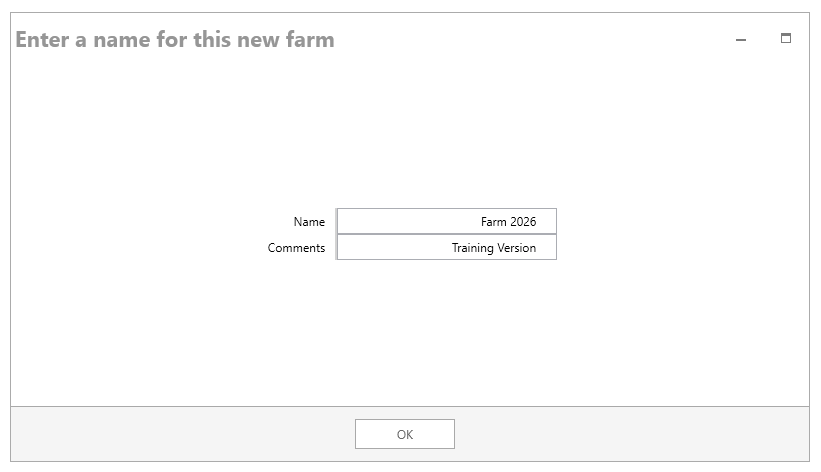
     
    <em>Figure 2: Entering a name for the new farm. </em>

 

    
     
    <em>Figure 3: Select "metric" as the unit of measurement.</em>

 

# Creating and Locating the New Dairy Farm

The dairy farm that we will create for this exercise is located in the province of Manitoba. Select **"Manitoba"** on the **Select a province** screen, and then click the **Next** button.

 

    
     
    <em>Figure 4: Select Manitoba as the province.</em>

 

Holos uses **Soil Landscapes of Canada** (SLC) polygons, which are a series of GIS coverages that report the soil characteristics for all of Canada (compiled at a scale of 1:1 million). SLC polygons may contain one or more distinct soil landscape components.

The **Farm Location** screen brings up a map of Canada with the province of Manitoba centered on the screen (Figure 5). 

The map contains red colored polygons that can be selected by moving the cursor over the region that contains the location of your farm. You can zoom in or out of the map by using the mouse wheel or by hovering the cursor over the zoom icon at the bottom of the screen.

The dairy farm for this example is located between Winnipeg and Portage la Prairie (Portage), in SLC polygon number **851003**. 

Find and right-click on this polygon to select it on the map (Figure 6). Note that at this point daily climate data will be downloaded from [NASA](https://power.larc.nasa.gov/data-access-viewer/). 

 

> *Note: Climate data is central to most calculations performed by Holos. For the most accurate estimation of farm emissions, measured climate data should be provided by the user which will override the default data obtained from the NASA weather API. If the user chooses to use the default NASA climate data, these data are available in a 10 km grid, and so can vary throughout the SLC polygon, depending on the precise location of the farm. Therefore, if possible, the user should choose the location of their farm as precisely as possible. Doing so can be aided by using different views (e.g., the Aerial view), which can be selected via the eye icon at the bottom of the map on the Farm Location screen.*
> 

> *Holos will use daily precipitation, temperature, and potential evapotranspiration values to model soil carbon (C) change (climate parameter), nitrous oxide (N2O) emissions, and ammonia (NH3) volatilization.*

 

    
     
    <em>Figure 5: Map of the Manitoba province showing the different selectable SCL polygons.</em>

 

    
     
    <em>Figure 6: Selecting the SLC polygon for the farm location.</em>
 

 
  
 
Once the farm location is selected, soil information (texture, sand, and clay proportions) for the types of soils found in this polygon are displayed on the right side of the screen. It is possible that more than one soil type per polygon will be found and the user is expected to select their soil type from this list or use the default selection (Figure 7). The default soil type selected represents the dominant soil type for the chosen polygon.

For this tutorial, keep the default **Soil Zone** as 'Black' soil, and the default **Hardiness Zone** as '3b'.  
  
 

    
     
    <em>Figure 7: Multiple soil types may be available for the selected SLC polygon.</em>

 

 

 > *Note: Soil data obtained from the user’s selected location will be used in the calculation of location-specific N2O emission factors. Properties such as soil texture, top layer thickness, and soil pH are required for these calculations, and can be overwritten on the Component Selection screen, under Settings > Farm Defaults > Soil.*

 

Click the **Next** button to proceed to the next step.

# Selecting Farm Components

Now that the farm location has been selected, we can move on to the **Component Selection** screen. This is where the user can select different components for their farm. Holos will display all available components on the left side of the screen under the **Available Components** column (Figure 8). These components are grouped into various categories including Land Management, Beef Production, Dairy Cattle, Swine, Sheep, Poultry and Other Livestock.

If we click on the drop-down button next to a category's name, we can then see the available components in that category.  For this portion of the training, we will be working with the “Land management” and “Dairy Cattle” categories. 

 

    
     
    <em>Figure 8: The Available Components screen. Specific components can be chosen here to include in the farm. </em>

 

 

The Holos model is designed so that the land management components are defined before the livestock components. This is because the model allows for the placement of livestock onto a specific field(s) (i.e., pasture(s)) for grazing. It is easier to do this if the pasture field has already been defined. However, the user can first set up their livestock components and then their field components, but will then need to return to their livestock components to ‘place’ them on pasture.

## Crop and Hay Production

Now we can add our first component to the farm. Drag a **Field** component from the left side of the screen and drop it on the **My Farm** on the right side (Figure 9). The screen will now update to reflect this new component that you have added to your farm. Holos will  label the field as **"Field #1"**. At this point, we can enter production information related to the crop being grown on this field.  

 

    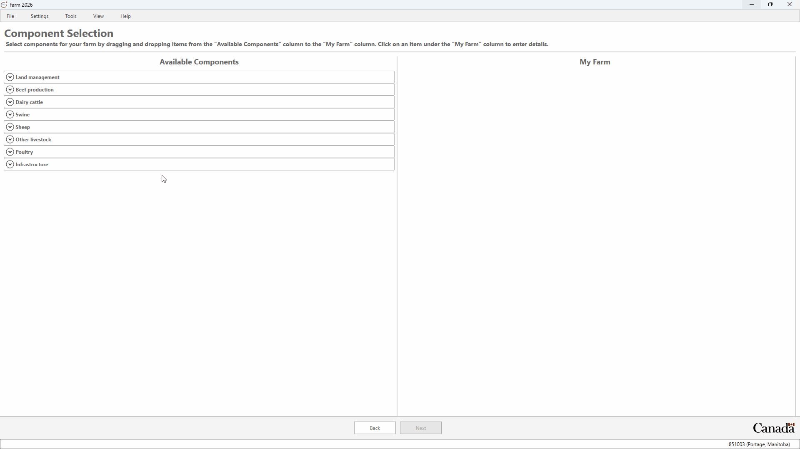
     
    <em>Figure 9: Adding a component to the farm.</em>

 

 

### Wheat with Cover Crop

Our first field on the farm will grow continuous wheat with a cover crop of hairy vetch. Change the following elements in the **"Field #1"** component.

1. Rename the field to **"Wheat & Hairy Vetch"** in the **Step 1** section of the screen. Change the area of the field to **18 ha**.

2. Select **"Wheat"** as the main crop and **"Hairy Vetch"** as the cover crop in **Step 2**.

3. Under the **General** tab:
    * Enter a yield of **"3,000 kg ha-1"** (wet weight). The dry weight value will be calculated automatically based on the moisture content of crop value.
    * Select **"Reduced Tillage"**" as the tillage type.
    * Enter **"200"** mm ha-1 as the amount of irrigation.
    * Select **"0"** as the number of pesticide passes.
    * Leave **"Cash crop"** as the harvest method.

 

    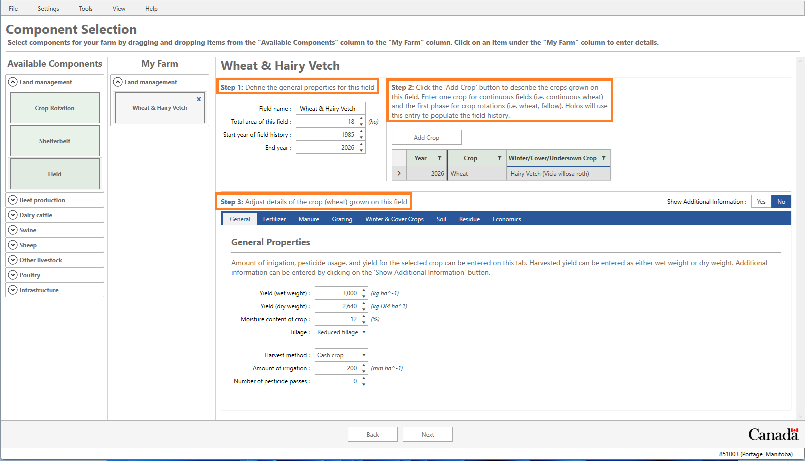
     
    <em>Figure 10: Field Component of the farm.</em>

 

 

4. Select the **Fertilizer** tab and click the **Add Fertilizer Application** button. Holos has now added a new fertilizer application for this field and will suggest "Urea" as the fertilizer blend. A default application rate is calculated based on the yield value entered for this field. Details of this fertilizer application can be changed by clicking the **Show Additional Information** button (e.g., season of application, blend, method of application, etc.).

 

    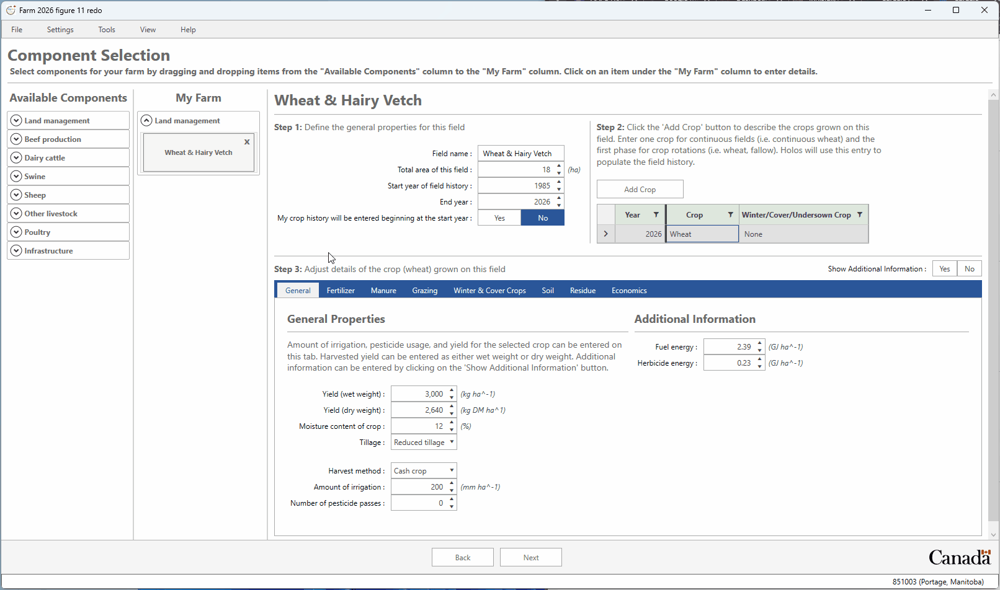
     
    <em>Figure 11: Adding fertilizer to a field.</em>

 

 

>*Note: It is not necessary to enter a crop for each individual year going back to 1985 (or an alternative user-defined start year), only enough crops to describe a single phase of the rotation will need to be entered by the user. Holos will then copy this phase information and back-populate the field history (i.e., Holos will copy the specified rotation back to the start year on behalf of the user).*

>*At a minimum, Holos requires the area of the field, type of crop grown, and a field-specific fertilizer application rate (where applicable) to calculate direct and indirect N2O emissions.*

> *Residue management of each crop (and cover crop) can be adjusted in Holos (see the ‘Residue’ tab). Holos provides default values depending on the type of crop being grown and will set a value for percentage of product returned to soil, percentage of straw returned to soil, etc. These residue input settings will have an impact on the final soil C change estimates, as well as soil N2O emissions estimates.*

> *Furthermore, biomass fractions and N concentrations can be overwritten by the user, and in this way ‘custom’ crops can be added that are currently not available in the crop drop-down menus.*

### Native Grasslands 

1. Drag a new **Field** component to your list of components. Enter the name **"Native Grassland"** in the **Field name** input box.
2. Enter **"100"** ha as the total area of the field.
3. Select **"Rangeland (Native)"** from the drop-down crop list in the **Crop** column under **Step 2**. Please note that Holos auto-populates the **Winter/Cover/Undersown Crop** field when a perennial crop is selected.
4. Keep **"80.78"** mm ha-1 as the amount of irrigation and **"0"** as the number of pesticide passes.
5. No fertilizer is used for this crop.

 

    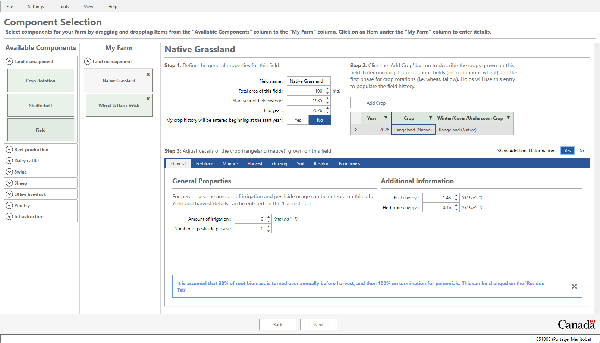
     
    <em>Figure 12: Native Grasslands information.</em>

 

 

## Barley Grain and Mixed Hay Rotation

To demonstrate the crop rotation component (as opposed to using individual field components), we will assume that barley grain and mixed hay are grown in rotation, with the mixed hay under-seeded to the barley so that it can be harvested in both main years (example derived from University of Alberta’s Breton plots). 

When using the **Crop Rotation** component, any sequence of crops that are input into this component will be applied to each individual field that is part of the rotation setup. This means one field is added for each rotation phase, and the rotation shifts so that each rotation phase is present on one field. Since each field can have a different management history, soil C algorithms will run for each field.

For this example, we assume that the farm requires **70** ha of barley grain and mixed hay, which are grown in rotation. We will need to set up three fields where barley grain is rotated in each field every two years. When using the crop rotation component, the crop management input of a specific crop is repeated on each field in the rotation where the crop is grown. 

**To set up the rotation:** 

1. Add one **Crop Rotation** component from the available components.

2. To expand the horizontal space available in Holos, click on **View** in the top menu bar and select **Hide List of Available Components**.

3. The rotation of this field begins in **"1985"** and ends in **"2024"**. Under **Step 1**, please ensure that these two values are set as the start and end year, respectively.

4. Enter **"70"** (ha) as the total area of this field.

5. Under **Step 2** change the crop to **"Barley"**. The year for this crop should be **"2024"**.
    * Under the **General** Tab enter **"3,000 kg ha-1"** (wet weight) as the yield for this crop.
    * Change the tillage type to **"Reduced Tillage"**.
    * Keep the default values of **"80.78"** mm ha-1 as the amount of irrigation and **"0"** as the number of pesticide passes.

6. Now add another crop to this rotation. Click on **Add Crop** under **Step 2** to add a second crop to the rotation. 

 

> *Note: As a default, Holos sets the year for this new crop to 2023 (or the year before the previously defined crop year). This means that Holos is expecting the user to enter crops that have been grown in reverse order back to 1985.*

> *It is not necessary to enter a crop for each individual year going back to 1985, only enough crops to describe a single phase of the rotation will need to be entered by the user. Holos will then copy the phase information and back-populate the field history (i.e., Holos will copy the rotation back to 1985 on behalf of the user).*

 

7. For this newly added crop select **"Tame Mixed (grass/legume)"** as the crop type.

8. Click on the **Add crop** button one more time. For this third crop, select **"Tame Mixed (grass/legume)"** once again as the crop type.

9. Now add harvest data to each of the tame mixed crops. You will need to select each "**tame mixed crop**" and add the harvest data to that specific crop. So select the first tame mixed crop **(2023)** and then:
    * Under the **Harvest Tab** click the **"Add Harvest Date"** button to create a new harvest.
    * Select a Harvest date of **"August 31, 2023"**, assuming the harvest is done on the same day every year.
    * Select **"Mid"** for  the forage growth stage.
    * Enter **"5"** as the total number of bales.
    * Enter **"500"** as the wet bale weight.
    
10. **Repeat** Step 9 for the second tame mixed crop **(2022)**.

 

If the tame mixed field is harvested more than once, the **Add Harvest Date** button can be used to add subsequent harvests.

 

    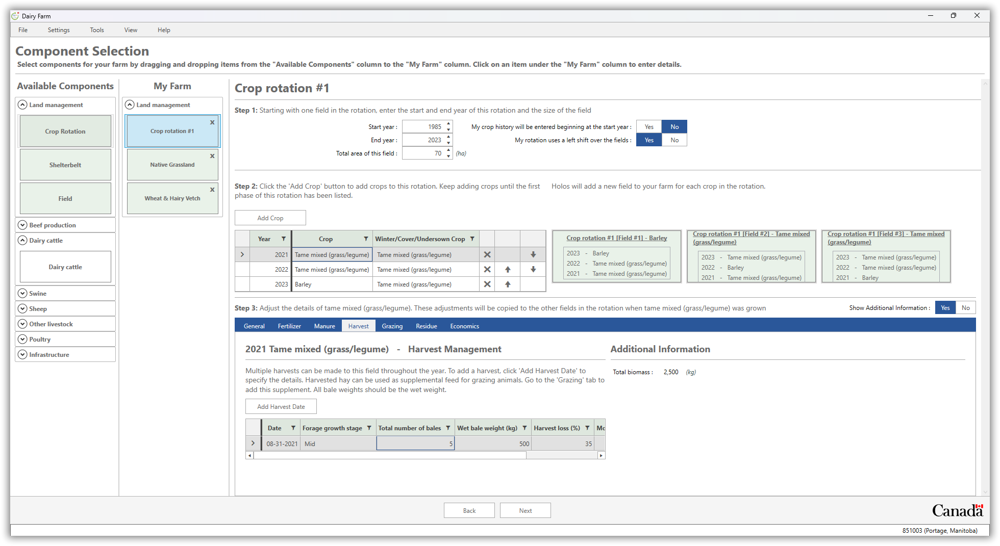
     
    <em>Figure 13: An example of a crop rotation with three crops.</em>

 

 

# Dairy Operation

Click on the **View** menu item and uncheck the **Hide List of Available Components** option.

Adding animal components follows the same approach that was used for the land management components. Under the **"Dairy cattle"** category, drag and drop one dairy component to the **My Farm** area. If any of the animal groups under **Step 1** are not needed for the farm, they can be removed by clicking the relevant **"X"** icon (similarly, additional dairy groups can be added using the **Add Group** button).

 

    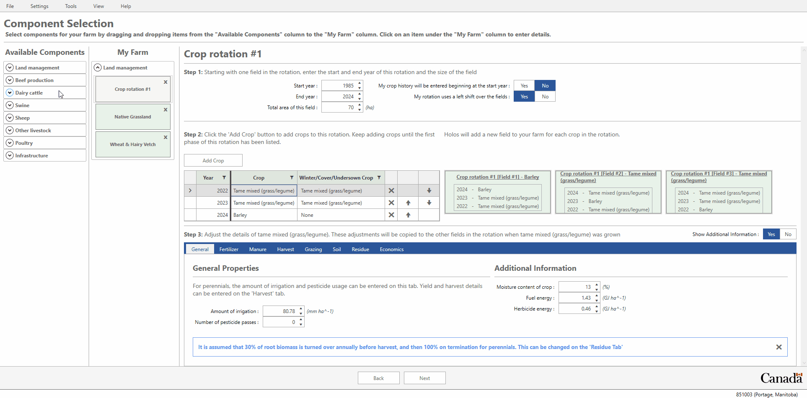
     
    <em>Figure 14: The Dairy Cattle Component.</em>

 

 

## **Lactating cows, calves, dairy heifers, and dry cows information**

**Lactating Cows:**

Holos provides the user with the option to have more than one lactating cows group. Holos assumes that lactation lasts for 10 months and that the cows are dry for the remaining 2 months in a 12-month period.

1. Under **Step 1**, make sure that the **"Dairy lactating"** row is selected in order to enter the associated management information for that group of animals.

2. Click the management period named **"Early lactation"** in **Step 2** to activate that management period. Ensure **"January 1, 2023"** is set as the 'Start date' and that **"May 31, 2023"** is set as the 'End date' (150 days). Note that the 'Number of days' being shown is inclusive of the start and end dates.

3. Next, we can enter data related to the number of animals, housing type, manure system, and diet for our group of lactating cows under **Step 3**. 

4. Click on the **General** tab and enter **"65"** for 'Number of animals'.

5. We are going to create a custom diet for our group of lactating cows. Click on the **Diet** tab. Note that Holos provides a default set of animal diets that can also be used. Since we are going to create our own custom diet, we will click on the **"Custom Diet Creator"** button.

 

> *Note: The number of animals, average daily gain, and feed quality are the minimum required inputs for calculating methane (CH4) and N2O emissions. The duration of individual management periods (e.g., the number of days spend in confined housing or on pasture) will also be needed. Housing and manure management information are also important inputs but are relatively more impactful on the emissions of monogastrics.*

 

 6. Click the **"Add Custom Diet"** button in the **Step 1** section of the screen to create a new custom diet. Rename this diet to **"Custom Dairy Diet"** then press the Enter key to save the name.
 
 7. To add ingredients to our new diet, move to the **Step 2** section and select **"ALFALFA"** from the ingredient list, and then click the **"Add Selected Ingredient to Diet"** button.
 
 8. We will add one more ingredient to our diet. Select **"Barley grain, rolled"** from the ingredient list, and then click the 'Add Selected Ingredient to Diet' button once again. 
 
 9. Enter **"50%"** for ALFALFA and **"50%"** for Barley grain, rolled in **Step 3**. Click the **OK** button to save the new custom diet.

 

    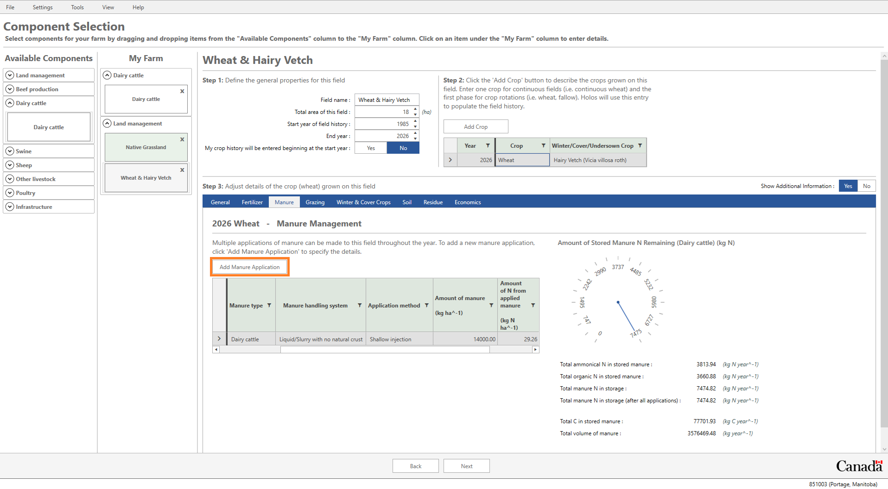
     
    <em>Figure 15: Custom diet creator for the Dairy Lactating animal group.</em>

 

 

> *Note: Holos now reports the diet being complete since all ingredients add up to 100%.*

 

 10.  Now select 'Custom Dairy Diet' from the drop-down menu on the **Diet** tab.

 

> *Note: Diet quality information such as crude protein, total digestible nutrient, and fat are required inputs so that Holos can estimate enteric CH4 emissions from an animal group.*

 

 11. On the **Housing** tab, select **"Tie stall (solid litter)"** for the housing type.

 12. Click on the **Manure** tab and select **"Solid storage (stockpiled)"** from the list.
 
 13. Under **Step 1**, make sure that the **"Dairy lactating"** row is selected to enter further management period information.
 
 14. Click the management period named **"Mid lactation"** in **Step 2**. Ensure **"June 01, 2023"** is set as the 'Start date' and that **"July 31, 2023"** is set as the 'End date' (60 days). 
 
 15. We can enter data related to the number of animals, housing type, manure system, and diet for our group of lactating cows under **Step 3** just as before.
 
 16. On the **General** tab enter **"65"** animals, on the **Diet** tab choose **"Custom Dairy Diet"**, on the **Housing** tab choose **"Tie stall (solid litter)"**, and on the **Manure** tab choose **"Solid storage (stockpiled)"**.
 
 17. Click the management period named **"Late lactation"** in **Step 2**. Ensure **"August 01, 2023"** is set as the 'Start date' and that **"November 04, 2023"** is set as the 'End date' (95 days). 
 
 18. **Repeat** Step 16 above. Enter in the same information in **Step 3** for this management period.

 

**To set up for Calves:**

Calves that are not used for replacement will enter into the veal system and are fed mainly milk replacer and corn grain. Factoring in a fertility loss of 7.7%, 60 calves are produced with a sex ratio of 50:50 male:female. Out of the 30 female calves produced, the farm selected 15 as a replacement heifer (young heifer) for lactating dairy cows. With an assumed mortality rate of 4.4% at four months of age, 43 veal calves will be fed on a corn grain-based diet. Veal calves are slaughtered at the age of 6 months (~270 kg body weight).

1. Under the animal groups section in **Step 1**, make sure that the **"Dairy calves"** row is selected in order to enter the associated management information for this group. 

2. Under **Step 2**, the first management period will be from **"January 1, 2023"** to **"March 31, 2023"** (90 days).

3. Under **Step 3**, click on the **General** tab and enter **"45"** for 'Number of animals'. Click on the **Manure** tab and select 'Solid storage (stockpiled)' from the list.

4. Returning to **Step 2**, click on the **"Add Management Period"** button. This will add a second management period for our group of calves. Ensure the 'start date' is **"April 01, 2023"** and the 'end date' is "**June 30, 2023**" (90 days). Since we assumed a mortality rate of 4.4% at four months of age, we will adjust the number of animals in the second management period to **"43"**.

 

> *Note: Diet and housing data for dairy calves are not needed for Holos calculations (i.e. tabs are omitted in **Step 3**).*

 

**To set up for Dairy Heifers:**

Out of the 30 female calves produced, the farm selected 15 as replacement heifers for lactating dairy cows.

1. Under the animal groups section in **Step 1**, make sure that the **"Dairy heifers"** row is selected in order to enter the associated management information for that group.

2. For **"Management period #1"**, enter **"January 01, 2023"** as the 'Start date’ and   **"December 31, 2023"** as the ‘End date’.

3. Click on the **General** tab and enter **"15"** for 'Number of animals'.

4. On the **Diet** tab, ensure the 'High fiber' diet is selected for the heifers.

5. On the **Housing** tab, select 'Free stall barn (solid litter)' as the housing type.

6. On the **Manure** tab, select 'Solid storage (stockpiled)'.

 

**To set up for Dairy Dry:**

20 cows will stop milking for a rest period allowing for recovery and recuperation.

1. Under the animal groups section in **Step 1**, make sure that the **"Dairy dry"** row is selected in order to enter the associated management information for that group.

2. Under **Step 2** in the **"Dry period"** management period, enter **"November 05, 2023"** as the 'Start date’ and **"January 4, 2024"** as the ‘End date’.

3. Click on the **General** tab and enter **"20"** for 'Number of animals'.

4. On the **Diet** tab, ensure the 'Legume forage based diet' is selected.

5. On the **Housing** tab, select 'Free stall barn (solid litter)' as the housing type.

6. On the **Manure** tab, select 'Solid storage (stockpiled)'.

 

# Discover Results 

## Timeline Screen

We are now finishing the process of defining our farm. Click the **Next** button to go forward to the **Timeline** screen.
The Timeline screen provides a visual layout of all the fields from 1985 to the specified end year for each field. This screen also allows the user to add historical and projected production systems. 

The **Add Historical Production System** button enables the user to add a different cropping history to individual fields whereas the **Add Projected Production System** button enables the user to add a future (projected) cropping system to individual fields.

Click the **Next** button to go forward to the **Details** screen.

## Details Screen

To avoid the requirement that a user needs to provide annual crop yields going back to 1985 (or the specified start year, if different) for each field on the farm, the model will use default year- and crop-specific yield data from *Statistics Canada* (where available). Changes in crop yield affect various model outputs, including soil carbon sequestration rates and soil N2O emissions. The following steps demonstrate how adjusting the crop yield affects the above- and below-ground carbon inputs to the soil.

Click the **Next** button to move to the final **Results** screen. 

 

## Results Screen

The **Results** will now be displayed in a variety of reports and charts.

1. Click on the tab named **"Emissions Pie Chart"**. Starting with the 'Emissions pie chart' we can see an overall breakdown of the enteric CH4, manure CH4, direct and indirect N2O. We are also able to see a detailed breakdown of the sources of these emissions.

2. Click the **Yes** button beside ‘Show details’. Here we can see the biggest sources of emissions from our farm. If you hover your mouse pointer over any slice of this chart you can get an isolated look at the different emission sources.

 

    
     
    <em>Figure 16: Emissions Pie Chart.</em>

 

 

 3. Click on the tab named **"Detailed Emission Report"** which will display a monthly or annual GHG emission report. This 'Detailed emission report' will report on enteric CH4, manure CH4, direct & indirect N2O, and CO2 emissions from the farm.
 
 4. Click the **"Report Format"** tab, which allow the switch between 'Monthly' and 'Annual' reports. In the **"Unit of measurements"** drop-down menu, you can choose to have the results displayed as CO2 equivalents (CO2e) or as unconverted greenhouse gas (GHG), and you can also choose the unit of measurement as either tonnes or kilograms.

 

    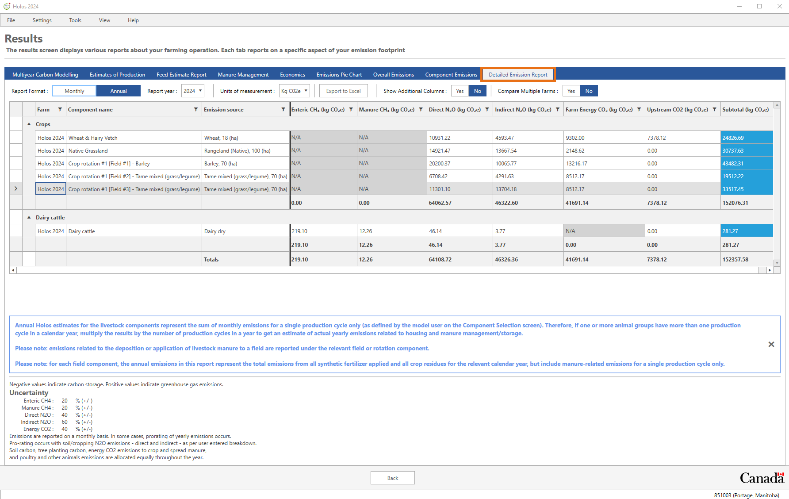
     
    <em>Figure 17: Detailed Emissions Report.</em>

 

 5. The **"Estimate of Production"** report provides total harvest yields, amount of land applied manure, and estimates of milk production for dairy components.

 

    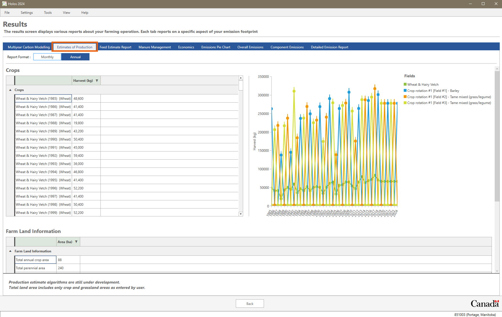
     
    <em>Figure 18: Estimates of Production Report.</em>

 

6. The **"Feed Estimate Report"** provides an estimate of dry matter intake based on energy requirements of the animal and the energy in the feed.

 

    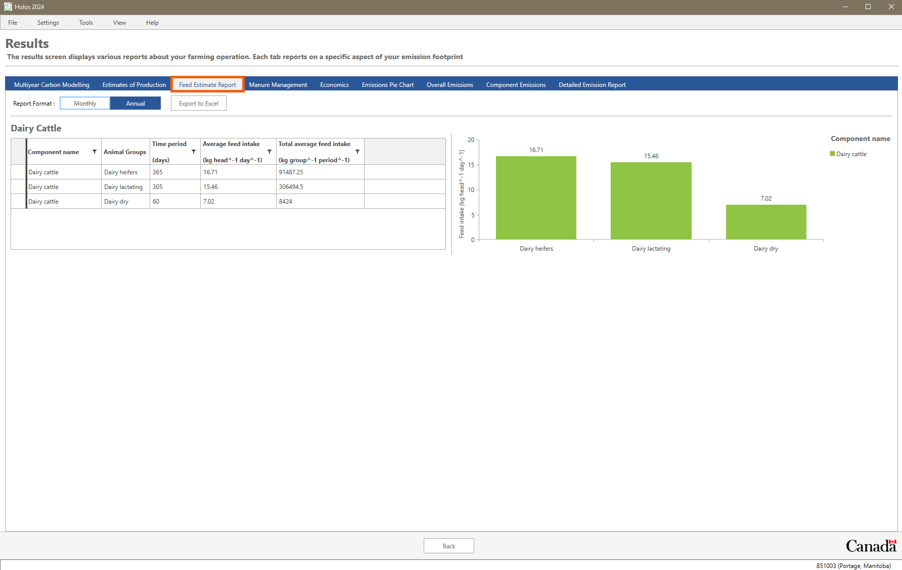
     
    <em>Figure 19: Feed Estimate Report.</em>

 

 

## Soil carbon modelling results
On the results screen we can see the change in soil carbon over time by clicking the **Multiyear Carbon Modelling** tab. This tab displays a graph showing the change in soil carbon over time for each one of our fields.

For each field on the graph, you can hover your mouse over the series to get more information for each year of the simulation.

If we click on one of these points, we can then view a more detailed breakdown of these results via the “Grid” report format. We can also export this data by clicking the **"Export to Excel"** button.
 
 

    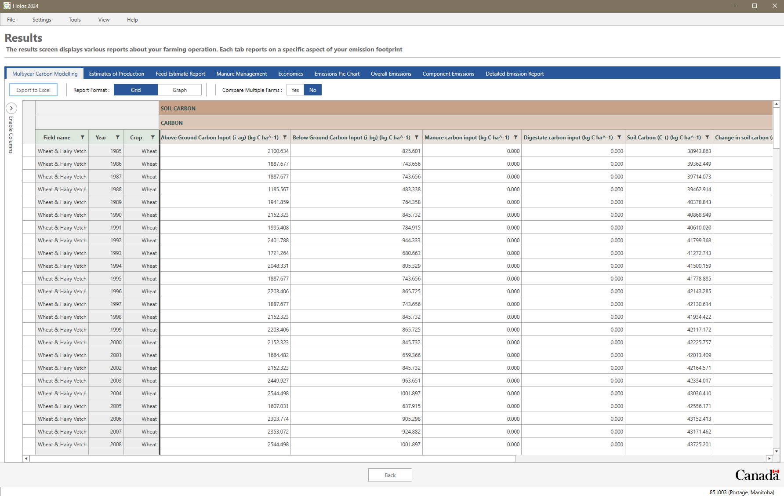
     
    <em>Figure 20: Multiyear Carbon Modelling.</em>

 

 

If you would like to export your entire farm file, from **File** on the main taskbar select 'Export'. Click the arrow to highlight your farm and save it as a .json file.  
 

# Finally...
## **Whole-systems approach**

> An ecosystem consists of not only the organisms and the environment they live in but also the interactions within and between. A whole systems approach seeks to describe and understand the entire system as an integrated whole, rather than as individual components. This holistic approach can be very complex and describing the process can be difficult. One method to conceptualize a whole system is with a mathematical model. The whole-systems approach ensures the effects of management changes are
> transferred throughout the entire system to the resulting net farm emissions. In some cases, reducing one GHG will actually increase the emissions of another. The whole-systems approach avoids potentially ill-advised practices based on preoccupation with one individual GHG.

To download Holos, for more information, or to access a recent list of Holos related publications, visit:
https://agriculture.canada.ca/en/agricultural-science-and-innovation/agricultural-research-results/holos-software-program

To contact us, email:
aafc.holos.acc@canada.ca
