

 
     

Le présent document sert d’introduction à l’utilisation du modèle Holos (version 4) et à la distinction entre les données requises et les données facultatives. Nous allons créer une ferme qui comprendra un système de production laitière et un système de cultures fourragères. Notre ferme est située au Manitoba, près de Portage la Prairie.

 

# Lancez Holos 

Veuillez noter que Holos 4 ne peut être installé que sur le système Windows de Microsoft. Le système d’exploitation Mac OS sera pris en charge dans la prochaine version.

Lancez Holos en double-cliquant sur l’icône Holos qui se trouve sur le bureau. Holos demande à l’utilisateur d’ouvrir une ferme existante, de créer une nouvelle ferme ou d’importer un fichier enregistré (figure 1). Si une ferme est déjà enregistrée dans le système, l’utilisateur peut cliquer sur **Ouvrir**. Si aucune ferme n’est enregistrée dans le système, Holos demande à l’utilisateur s’il veut créer une **nouvelle** ferme ou **importer** un fichier de ferme enregistré (c.-à-d. un fichier JSON). Si l’utilisateur crée une nouvelle ferme, le système lui demande le nom de celle-ci et un commentaire facultatif (figure 2).

Enter **"Holos 2024"** as the Name and **"Training Version"** in the Comments.  Click **OK** to proceed to the next screen.

Entrez le nom de ferme **Holos 2024** et le commentaire **Version de formation**. Cliquez sur **OK** pour passer à l’écran suivant. 

Assurez-vous de sélectionner l’option **Métrique** comme unité de mesure, puis cliquez sur le bouton Suivant, au bas de l’écran (figure 3).

 

    
     
    <em>Figure 1: Si une ferme a déjà été enregistrée, Holos présente une invite pour la rouvrir.</em>

 

    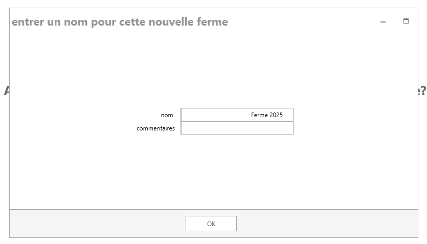
     
    <em>Figure 2: Entrée d’un nom pour la nouvelle ferme. </em>

 

    
     
    <em>Figure 3: Select "Metric" as the unit of measurement.</em>

 

# Création et emplacement de la nouvelle ferme laitière

La ferme laitière que nous allons créer dans le cadre de notre exercice sera située dans la province du Manitoba. Sélectionnez l’option **Manitoba** dans l’écran **Sélectionner une province**, puis cliquez sur le bouton Suivant.

 

    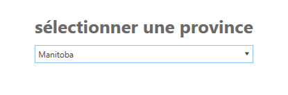
     
    <em>Figure 4: Sélectionnez l’option "Manitoba".</em>

 

Holos utilise Pédo-paysages du Canada (PPC), une série de couvertures SIG qui montrent les principales caractéristiques des sols et des terres pour l’ensemble du Canada (compilées à une échelle de 1:1 million). Les polygones de PPC peuvent contenir un ou plusieurs éléments distincts du pédo-paysage.

L’écran Emplacement de la ferme affiche une carte du Canada, avec la province du Manitoba au centre de l’écran.

La carte contient des polygones de couleur rouge que vous pouvez sélectionner en déplaçant votre curseur sur la région contenant l’emplacement de votre ferme. Vous pouvez faire un zoom avant ou arrière sur la carte à l’aide de la molette de la souris ou en déplaçant le curseur sur l’icône de zoom, au bas de l’écran.

La ferme laitière de notre exemple est située entre Winnipeg et Portage la Prairie (Portage), avec le numéro de polygone 851003 de PPC.

Trouvez ce polygone et cliquez à droite pour le sélectionner sur la carte (figure 6). Notez qu’à ce stade, les données climatiques quotidiennes seront téléchargées à partir du site de la [NASA](https://power.larc.nasa.gov/data-access-viewer/). 

 

> *Note: Climate data is central to most calculations performed by Holos. For the most accurate estimation of farm emissions, measured climate data should be provided by the user which will override the default data obtained from the NASA weather API. If the user chooses to use the default NASA climate data, these data are available in a 10 km grid, and so can vary throughout the SLC polygon, depending on the precise location of the farm. Therefore, if possible, the user should choose the location of their farm as precisely as possible. Doing so can be aided by using different views (e.g., the Aerial view), which can be selected via the eye icon at the bottom of the map on the Farm Location screen.*
> 

> *Holos will use daily precipitation, temperature, and potential evapotranspiration values to model soil carbon (C) change (climate parameter), nitrous oxide (N2O) emissions, and ammonia (NH3) volatilization.*

 

    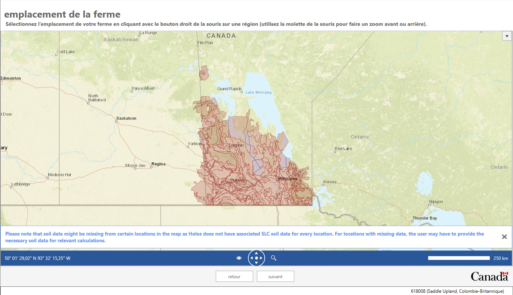
     
    <em>Figure 5: Map of the Manitoba province showing the different selectable SCL polygons.</em>

 

    
     
    <em>Figure 6: Selecting the SLC polygon for the farm location.</em>
 

 
  
 
Once the farm location is selected, soil information (texture, sand, and clay proportions) for the types of soils found in this polygon are displayed on the right side of the screen. It is possible that more than one soil type per polygon will be found and the user is expected to select their soil type from this list or use the default selection (Figure 7). The default soil type selected represents the dominant soil type for the chosen polygon.

For this tutorial, keep the default **Soil Zone** as **"Black"** soil, and the default **Hardiness Zone** as **"3b"**.  
  
 

    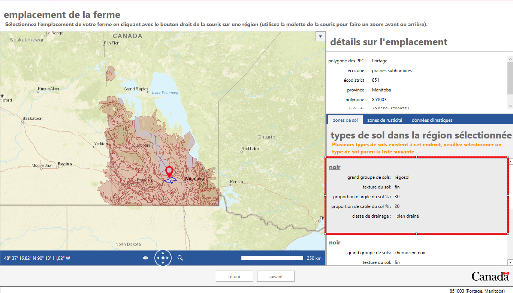
     
    <em>Figure 7: Multiple soil types may be available for the selected SLC polygon.</em>

 

 

 > *Note: Soil data obtained from the user’s selected location will be used in the calculation of location-specific N2O emission factors. Properties such as soil texture, top layer thickness, and pH are required for these calculations, and can be overwritten on the Component Selection screen, under Settings > Farm Defaults > Soil.*

 

Click the **Next** button to proceed to the next step.

# Sélection des composantes de la ferme

Sélection des composantes. C’est dans cet écran que vous pouvez sélectionner différentes composantes pour votre ferme. Holos affiche toutes les composantes disponibles du côté gauche de l’écran dans la colonne Composantes disponibles (figure 8). Ces composantes sont regroupées en catégories telles que Gestion des terres, Production bovine, Bovins laitiers, etc.

Si vous cliquez pour visualiser la liste déroulante de l’une de ces catégories, les composantes disponibles s’affichent. Dans le cadre de la présente formation, nous travaillerons avec les catégories Gestion des terres et Bovins laitiers.

 

    
     
    <em>Figure 8 : Écran des composantes disponibles. Des composantes particulières peuvent être choisies ici pour être incluses dans la ferme. </em>

 

 

Le modèle Holos est conçu de manière à ce que les composantes de gestion des terres soient définies avant celles du bétail. Cela parce que le modèle nous permet de placer le bétail dans des champs (c.-à-d. des pâturages) particuliers afin qu’ils s’y nourrissent. Il est en effet plus facile d’effectuer cette opération lorsque le pâturage a été préalablement défini. L’utilisateur peut toutefois configurer ses composantes du bétail avant de configurer ses composantes de champ, mais il devra ensuite retourner à ses composantes du bétail pour les préciser et les "placer" au pâturage.

## Culture et production de foin

Now we can add our first component to the farm. Drag a **Field** component from the left side of the screen and drop it on the **My Farm** on the right side (Figure 9). The screen will now update to reflect this new component that you have added to your farm. Holos will  label the field as **"Field #1"**. At this point, we can enter production information related to the crop being grown on this field.

Nous pouvons maintenant ajouter à la ferme notre première composante. Faites glisser une composante Champ du côté gauche de l’écran et déposez-la dans le volet **Ma ferme**, du côté droit (Figure 9). L’écran est maintenant mis à jour pour refléter la composante que vous avez ajoutée à votre ferme. Holos a étiqueté le champ comme **Champ 1**. À ce stade, nous pouvons entrer des données de production sur la culture dans ce champ.

 

    
     
    <em>Figure 9: Des composantes particulières peuvent être choisies ici pour être incluses dans la ferme.</em>

 

 

### Blé et culture de couverture

Dans le premier champ de notre ferme, nous cultiverons du blé en continu avec une culture de couverture de vesce velue. Changez les éléments suivants dans la composante "Champ 1".

1. Renommez le champ pour lui donner le nom de **Blé et vesce velue** dans la section **Étape 1** de l’écran. Changez la superficie du champ pour la faire passer à **18 ha**.
   
2. Laissez l'année de départ à 1985 et changez l'année de fin à 2023.

3. À l’étape 2, sélectionnez l’option **Blé** comme culture principale, et l’option **Vesce velue** comme culture de couverture.

4. Ouvrez l’onglet Renseignements **généraux**.:
    * Inscrivez un rendement de **3 000 kg ha -1** (poids humide). La valeur du poids sec est 
    * Sélectionnez l’option **Travail réduit du sol** comme type de travail du sol.
    * Entrez la valeur **200 » mm ha -1** comme quantité d’eau d’irrigation.
    * Sélectionnez la valeur **0** comme nombre de passages de pesticides.
    * Laissez la valeur par défaut **Méthode de récolte**.

 

    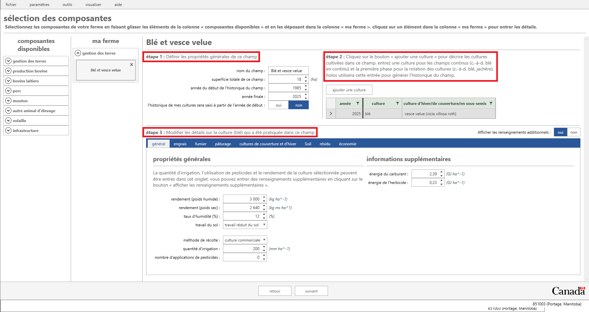
     
    <em>Figure 10: Composante de champ pour la ferme.</em>

 

 

4. Ouvrez la page d’onglet Engrais, puis cliquez sur le bouton **Ajouter l’épandage d’un engrais**. Holos a maintenant ajouté un nouvel épandage d’engrais pour ce champ et proposera l’urée comme mélange d’engrais. Un taux d’épandage par défaut est calculé en fonction de la valeur de rendement entrée pour ce champ. On peut modifier les détails de cet épandage d’engrais (saison de l’épandage, mélange d’engrais différent, etc.) en cliquant sur le bouton Afficher les renseignements additionnels.

 

    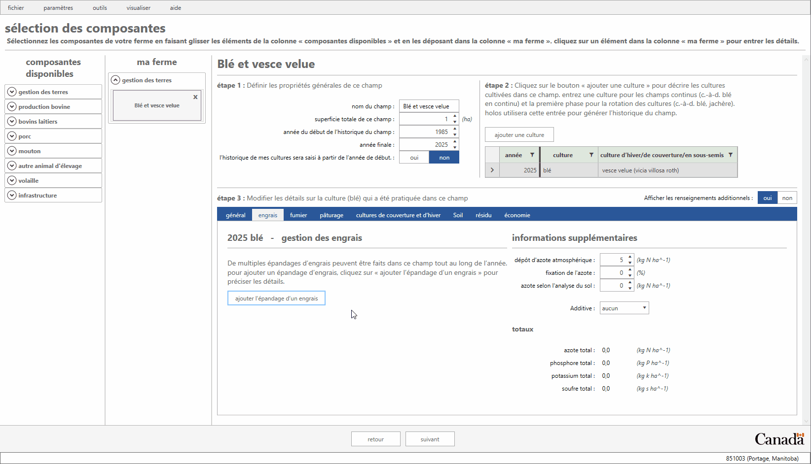
     
    <em>Figure 11: Ajout d’un engrais à un champ. </em>

 

 

>*Note: It is not necessary to enter a crop for each individual year going back to 1985 (or an alternative user-defined start year); only enough crops to describe a single phase of the rotation will need to be entered by the user. Holos will then copy this phase information and back-populate the field history (i.e., Holos will copy the specified rotation back to the start year on behalf of the user).*

>*Remarque: Holos exige au minimum la superficie du champ, le type de culture et un taux d’épandage d’engrais propre au champ pour pouvoir calculer les émissions directes et indirectes d’oxyde nitreux.*

> *La gestion des résidus de chaque culture (et de chaque culture de couverture) peut être ajustée dans Holos (voir la page d’onglet Résidus). Holos fournit des valeurs par défaut selon le type de culture et établi une valeur selon le pourcentage de produit et de paille retournés dans le sol, etc. Ces paramètres d’entrée des résidus auront une incidence sur les estimations finales de la variation du carbone dans le sol.*

> *De plus, les fractions de biomasse et les concentrations d’azote peuvent être écrasées par l’utilisateur, ce qui permet d’ajouter les cultures « personnalisées » qui ne sont actuellement pas disponibles.*

### Prairies indigènes

1. Faites glisser une nouvelle composante de champ vers votre liste de composantes. Entrez le nom **Prairie indigène** dans la case de saisie **Nom du champ**.
2. Leave the start year as 1985 and change the end year to 2023.
3. Entrez une superficie totale du champ de **100 ha**.
4. Sélectionnez l’option **Parcours (indigène)** dans la liste déroulante de la colonne Culture, à **l’étape 2**. Veuillez noter que Holos remplit automatiquement la colonne **Culture d’hiver/de couverture/intermédiaire** lorsqu’un type de culture vivace est sélectionné.
5. Conserver la valeur **"0" mm ha-1** comme quantité d’eau d’irrigation et la valeur **"0"** comme nombre d’applications de pesticides.
6. Aucun engrais n’est utilisé pour cette culture.

 

    
     
    <em>Figure 12: Renseignements sur les pâturages indigènes.</em>

 

 

# Dairy Operation

Adding animal components follows the same approach used for the land management components. Under the **Dairy** category in the available components, drag and drop one **Dairy Cattle** component to the **My farm** section on the right. In this example, all animal groups listed under this component will be used. This means we will not have to remove any animal group by clicking the **X** icon next to it under **Step 1**. We can now begin entering information for each animal group.

*Note: Click on the **View** menu item in the top taskbar and check/uncheck the **Hide List of Available Components** option. Checking this option hides the list of **Available Components**, allowing more room on the screen for the **My Farm** section.*

 

    
     
    <em>Figure 13: The Dairy Cattle Component.</em>

 

 

## **Lactating cows, calves, dairy heifers, and dry cows**

**Lactating Cows:**

Holos provides the user with the option to have more than one lactating cows group. Holos assumes that lactation lasts for 10 months and that the cows are dry for the remaining 2 months in a 12-month period.

1. Under **Step 1**, make sure that the **"Dairy lactating"** row is selected in order to enter the associated management information for that group of animals.

2. Click the management period named **"Early lactation"** in **Step 2** to activate that management period. Ensure **"January 1, 2023"** is set as the start date and **"May 31, 2023"** as the end date (151 days). Note that the **Number of days** being shown is inclusive of the start and end dates.

3. Next, we can enter data related to the number of animals, housing type, manure system, and diet for our group of lactating cows under **Step 3**. 

4. Click on the **General** tab and enter **"65"** as the number of animals.

5. We are going to create a custom diet for our group of lactating cows. Click on the **Diet** tab. Note that Holos provides a default set of animal diets that can also be used. Since we are going to create our own custom diet, we will click on the **Custom Diet Creator** button.

 

> *Note: The number of animals, average daily gain, and feed quality are the minimum required inputs for calculating methane (CH4) and N2O emissions. The duration of individual management periods (e.g., the number of days spent in confined housing or on pasture) will also be needed. Housing and manure management information are also important inputs but are relatively more impactful on the emissions of monogastrics.*

 

 6. Click the **Add Custom Diet** button in the **Step 1** section of the screen to create a new custom diet. Rename this diet to **"Custom Dairy Diet"** then press the Enter key to save the name.
 
 7. To add ingredients to our new diet, move to the **Step 2** section and select **"ALFALFA"** from the ingredient list, and then click the **Add Selected Ingredient to Diet** button.
 
 8. We will add one more ingredient to our diet. Select **"Barley grain, rolled"** from the ingredient list, and then click the **Add Selected Ingredient to Diet** button once again. 
 
 9. Enter **"50%"** for **ALFALFA** and **"50%"** for **Barley grain, rolled** in **Step 3**. Click the **OK** button to save the new custom diet.

 

    
     
    <em>Figure 14: Custom diet creator for the Dairy Lactating animal group.</em>

 

 

> *Note: Holos now reports the diet being complete since all ingredients add up to 100%.*

 

 10.  Now select **"Custom Dairy Diet"** from the drop-down menu on the **Diet** tab.

 

> *Note: Diet quality information such as crude protein, total digestible nutrient, and fat are required inputs so that Holos can estimate enteric CH4 emissions from an animal group.*

 

 11. On the **Housing** tab, select **"Tie stall (slurry)"** for the housing type.

 12. Click on the **Manure** tab and select **"Liquid/Slurry with no natural crust"** from the list.
 
 13. Click the management period named **"Mid lactation"** in **Step 2**. Ensure **"June 01, 2023"** is set as the start date and **"July 31, 2023"** as the end date (61 days). 
 
 14. We can enter data related to the number of animals, housing type, manure system, and diet for our group of lactating cows under **Step 3** just as before.
 
 15. On the **General** tab enter **"65"** animals, on the **Diet** tab choose **"Custom Dairy Diet"**, on the **Housing** tab choose **"Tie stall (slurry)"**, and on the **Manure** tab choose **"Liquid/Slurry with no natural crust"**.
 
 16. Click the management period named **"Late lactation"** in **Step 2**. Ensure **"August 01, 2023"** is set as the start date and **"November 04, 2023"** as the end date (96 days). 
 
 17. Repeat Step 16 above. Enter in the same information in **Step 3** for this management period.

 

**Dairy calves:**

Calves that are not used for replacement will enter into the veal system and are fed mainly milk replacer and corn grain. Factoring in a fertility loss of 7.7%, 60 calves are produced with a sex ratio of 50:50 male:female. Out of the 30 female calves produced, the farm selected 15 as replacement heifers (young heifers) for lactating dairy cows. With an assumed mortality rate of 4.4% at four months of age, 43 veal calves will be fed on a corn grain-based diet. Veal calves are slaughtered at the age of 6 months (~270 kg body weight).

1. Under **Step 1**, make sure that the **"Calves"** row is selected in order to enter the associated management information for this group. 

2. Under **Step 2**, the first management period will be from **"January 1, 2023"** to **"March 31, 2023"** (90 days).

3. Under **Step 3**, click on the **General** tab and enter **"45"** as the number of animals. Click on the **Housing** tab and select **"Free stall barn (slurry scraping)"** as the housing type and click on the **Manure** tab to select **"Liquid/Slurry with no natural crust"**.

4. Returning to **Step 2**, click on the **Add Management Period** button. This will add a second management period for our group of calves. Ensure the start date is **"April 01, 2023"** and the end date is "**June 30, 2023**" (90 days). Since we assumed a mortality rate of 4.4% at four months of age, we will adjust the number of animals in the second management period to **"43"**. The housing and manure management options are the same as for the first dairy calves management period.

 

> *Note: Dietary data for dairy calves are not currently needed for Holos calculations and so this tab is not present in **Step 3**.*

 

**Dairy (Replacement) Heifers:**

Out of the 30 female calves produced, the farm selected 15 as replacement heifers for lactating dairy cows.

1. Under **Step 1**, make sure that the **"Dairy heifers"** row is selected in order to enter the associated management information for that group.

2. For **"Management period #1"**, enter **"January 01, 2023"** as the start date and **"December 31, 2023"** as the end date (365 days).

3. Click on the **General** tab and enter **"15"** as the number of animals.

4. On the **Diet** tab, ensure the **"High fiber"** diet is selected.

5. On the **Housing** tab, select **"Free stall barn (slurry scraping)"** as the housing type.

6. On the **Manure** tab, select **"Liquid/Slurry with no natural crust"**.

 

**Dairy Dry:**

In this dairy animal group there are 20 cows that are not milked, allowing for recovery and recuperation.

1. Under **Step 1**, make sure that the **"Dairy dry"** row is selected in order to enter the associated management information for that group.

2. Under **Step 2** in the **"Dry period"** management period, enter **"November 05, 2023"** as the start date and **"January 4, 2024"** as the end date (61 days).

3. Click on the **General** tab and enter **"20"** as the number of animals.

4. On the **Diet** tab, ensure the **"Legume forage based diet"** is selected.

5. On the **Housing** tab, select **"Free stall barn (slurry scraping)"** as the housing type.

6. On the **Manure** tab, select **"Liquid/Slurry with no natural crust"**.

 

### Adding a Manure Application to the Wheat Field

In Holos, the user can apply livestock manure to a field using either manure produced by the livestock on the farm or manure imported from off-farm. Since we have now defined our animal components, we can apply dairy manure produced on-farm to any field on our farm.

1. Select the **Wheat & hairy vetch** field from the list of components added to our farm.

2. Click on the **Manure tab** and then click the **Add Manure Application** button.
    * Select **"April 30, 2024"** as the date.
    * Select **"Livestock"** as the origin of manure.
    * Select **"Dairy"** as the manure type.
    * Select **"Liquid/Slurry with no natural crust"** as the manure handling system.
    * Select **"Shallow injection"** as the application method.
    * Enter **"14,000 kg ha-1"** as the amount of manure applied to this field.
4. Note that both chemical fertilizer and manure applications can be made on the same field.

> Holos provides an interactive gauge on the left of the manure tab to show the **Amount of Stored Manure N Remaining (Dairy cattle) (kg N)**, which adjusts to reflect the user's application choices and quantify the amount of stored manure (N) remaining for application.

 

    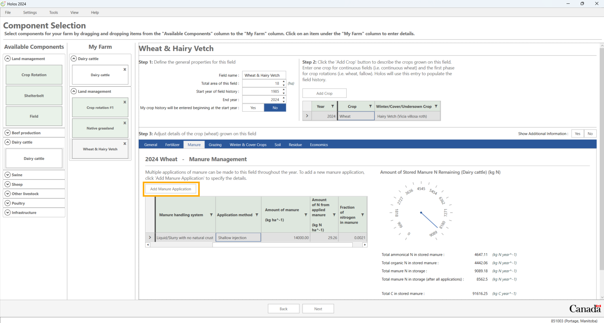
     
    <em>Figure 15: Adding a manure application to a field.</em>

 
 

# Timeline Screen

We are now finished the process of defining our farm. Click the **Next** button to go forward to the timeline screen.
The timeline screen provides a visual layout of the farm's fields from the start year to the end year for each field. This screen also allows the user to add historical and projected production systems for individual fields and/or rotations. 

The **Add Historical Production System** button enables the user to add a different cropping history to individual fields whereas the **Add Projected Production System** button enables the user to add a future (projected) cropping system to individual fields.

### Adding a historical production system

We will assume that the **Wheat & Hairy Vetch** field was used to grow a **Barley** grain - **Tame mixed (grass\legume)** hay rotation between **1985 and 2000**.

1. To add a new historical cropping system, select the "**Wheat & Hairy Vetch field**". To select an item, click on the timeline bar to activate that field.

2. Click on the **Add Historical Production System** button which will add a new row to the table under the **"Step 1"** section in the upper left section of the screen. Note that this new entry has the words **"Historical management practice"** added.

3. We will set the end year of this historical management practice to the year **"2000"**. To adjust this we use the numeric up/down buttons within the cell.

4. Select the newly added **Historical management practice** and then click the **"Edit Selected"** button. This will open a new screen that allows us to adjust the crops grown and their management during this period.

5. As we want to make this a three-crop rotation, under **"Step 2"** click the "**Add Crop**" button twice to add two more crops. 

7. Change the first crop type to "**Barley**" (with no cover crop). Enter a yield of **"3,500 kg ha-1"** (wet weight) and keep all other settings as default.
  
8. Change the second and third rows to **"Tame mixed (grass/legume)"** - note that when a perennial crop is selected as the main crop, Holos automatically selects the same crop type as the cover crop. Keep all other settings as default for both years. 

10. Click **"OK"** to save these adjustments.

 

    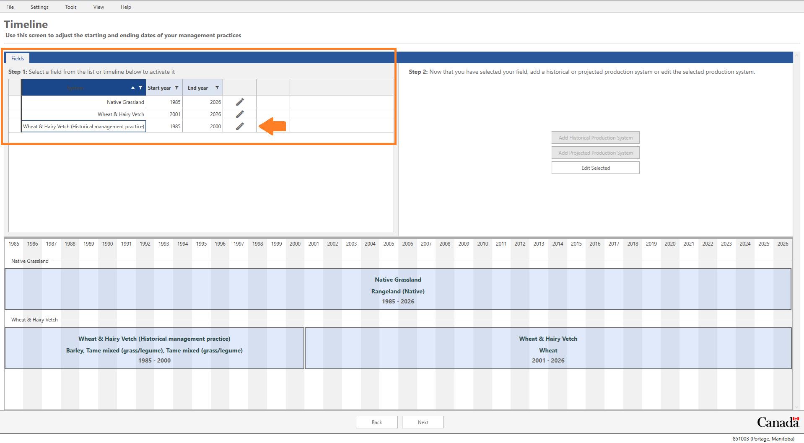
     
    <em>Figure 16: Customized Timeline screen</em>

 

   

    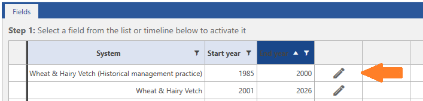
     
    <em>Figure 17: Adjusted start and end year for productions systems on the timeline screen.</em>

 

  

    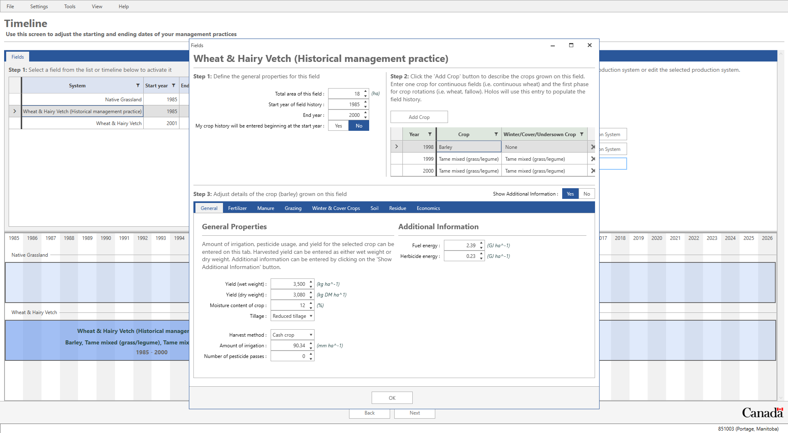
     
    <em>Figure 18: Editing crops in a historical period of the rotation. </em>

 

## Details Screen

Click the **Next** button to go forward to the details screen.

To avoid the requirement that a user needs to provide annual crop yields going back to 1985 (or the specified start year, if different) for each field on the farm, the model will use default year- and crop-specific yield data from *Statistics Canada* (where available). Changes in crop yield affect various model outputs, including soil C sequestration rates and soil N2O emissions. The following steps demonstrate how adjusting the crop yield affects the above- and below-ground C inputs to the soil.

We will adjust this grid so that we can view the above-ground and below-ground C inputs for our **Wheat & Hairy Vetch** field and then we will adjust the crop yield for one specific year.

1. We will set a filter on the first column named **"Field name"** so that we only display information for our current **Wheat and hairy vetch** field. Beside the column heading, click the **'funnel'** icon to set a filter. Check the box beside **'Wheat & hairy vetch'**.

2. On the far left of this screen, click the **Enable Columns** sidebar (located near the “Field name” column).

3. Place a check beside **"Above-ground carbon input"** to show the column and remove the check beside the **'Notes'** column to hide it.

4. Click the **'Enable Columns'** sidebar again to collapse it.

5. We can now (optionally) adjust the yields for our wheat crop for any given year if actual measured yields are available.

6. Adjust the wheat yield for **2006** to be **4,100 kg ha-1"**.

7. Note that Holos has updated the above-ground C inputs for this.

 

    
     
    <em>Figure 19: Details screen</em>

 

 

#  Results Screen

Click the **"Next"** button to move on to discover the results on the final screen. The Holos outputs for our simulated farm are displayed in a variety of reports and charts.

1. Click on the tab named **Detailed Emission Report**

    The **Detailed Emission Report** will display a monthly or annual GHG emission report. The detailed emission report will report on enteric methane (CH4), manure CH4, direct and indirect N2O, and carbon dioxide (CO2) emissions from the farm.

2. Click the **Report Format (Monthly)** button to switch to a monthly report. Now we can see a monthly breakdown of all emissions from the farm and the emission source.

    In the **Unit of measurement** drop-down menu, you can choose to have the results displayed as CO2 equivalents (CO2e) or as unconverted greenhouse gases (GHG), and you can also choose the unit of measurement as either tonnes/megagrammes (Mg) or kilograms (kg).
 

    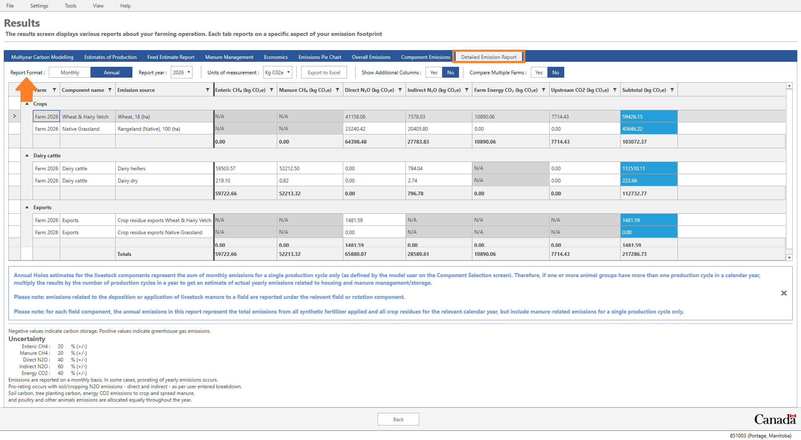
     
    <em>Figure 20: Detailed emissions report.</em>

 

 

3. Click on the **Estimates of Production** report which provides total harvest yields for the farm's fields and of the amount of N available in manure produced by the farm's livestock.

 

    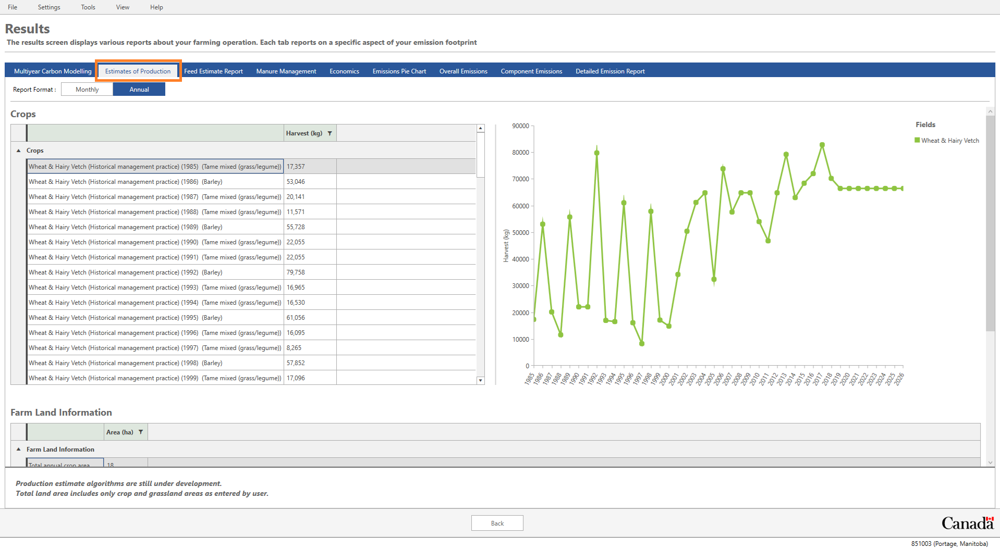
     
    <em>Figure 21: Estimates of production report.</em>

 

 

## Soil carbon modelling results

On the results screen we can see the change in soil C over time by clicking the “**Multiyear Carbon Modelling**” tab. This tab displays a graph showing the estimated soil C stock for each field on the farm.

For each field on the graph (where more than one field is present), you can hover your mouse over the series to get more information for each year of the simulation.

If we click on one of these points, we can then view a more detailed breakdown of these results via the “Grid” report format. We can also export this data by clicking the "**Export to Excel**" button on the top-left.

If you would like to export your entire farm file, from '**File**' on the main taskbar select '**Export**'. Click the arrow to highlight your farm and save it as a .json file.

 

    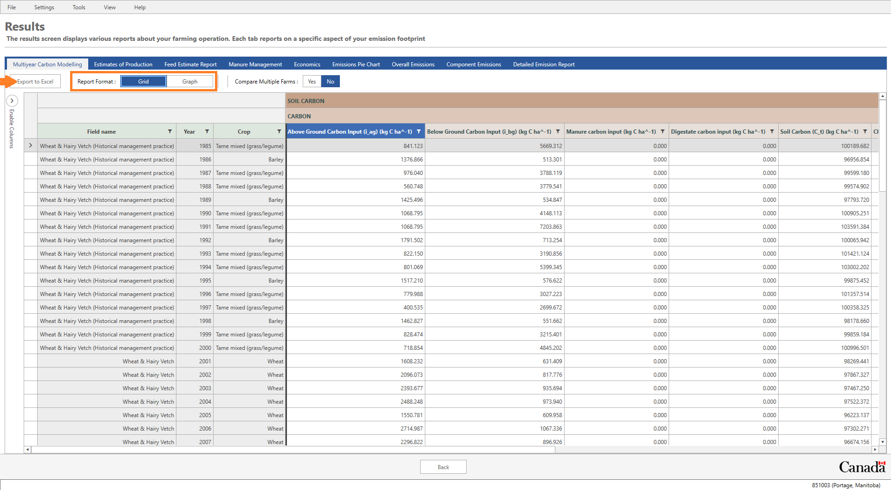
     
    <em>Figure 22: Carbon report section. Allows switching between graph and table format.</em>

 

 

# Finally...

## Whole-systems approach 

> An ecosystem consists of not only the organisms and the environment in which they live but also the interactions within and between these organisms and their surroundings. A whole systems approach seeks to describe and understand the entire system as an integrated whole, rather than as individual components. This holistic approach can be very complex and describing the process can be difficult. One method to conceptualize a whole system is with a mathematical model.
> 
> The whole-systems approach ensures the effects of management changes are transferred throughout the entire system to the resulting net farm emissions. In some cases, reducing one GHG will actually increase the emissions of another. The whole-systems approach avoids potentially ill-advised practices based on preoccupation with one individual GHG.

To download Holos, for more information, or to access a recent list of Holos-related publications, visit: www.agr.gc.ca

To contact us, email:
aafc.holos.acc@canada.ca
