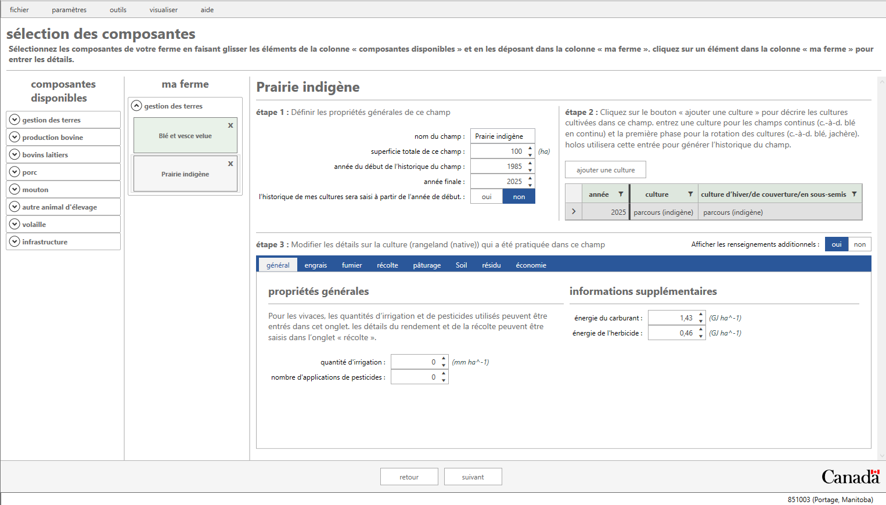
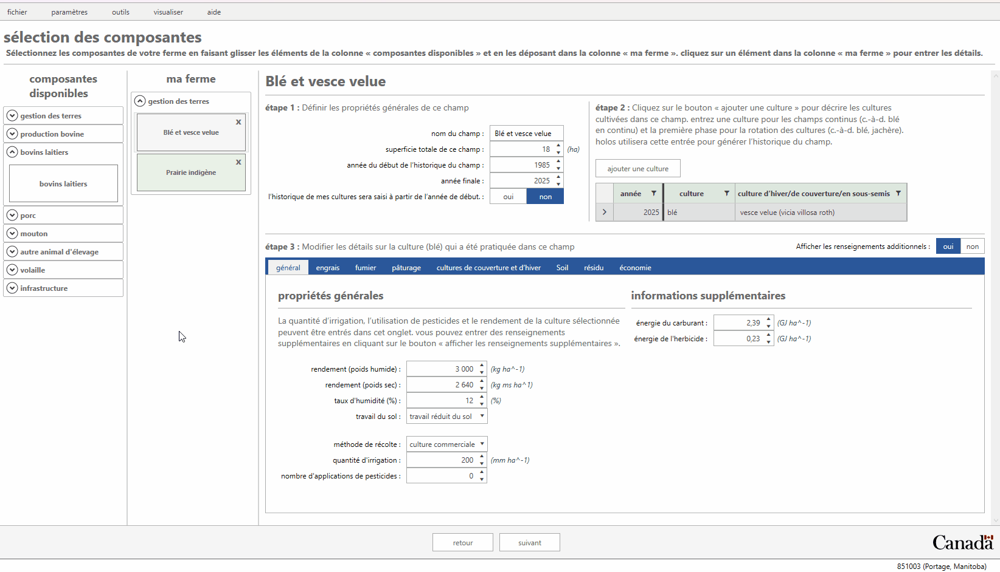
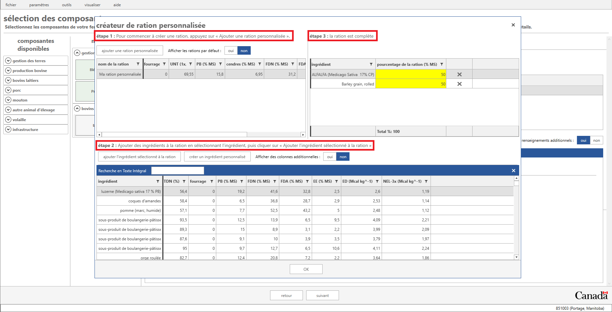
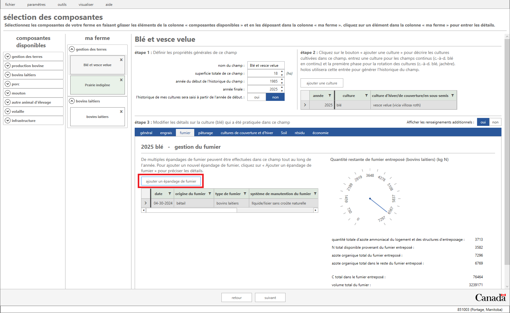
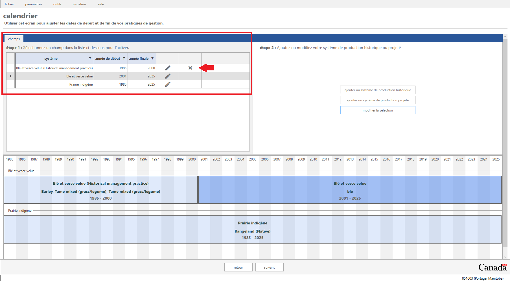
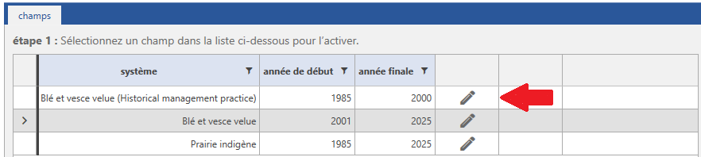
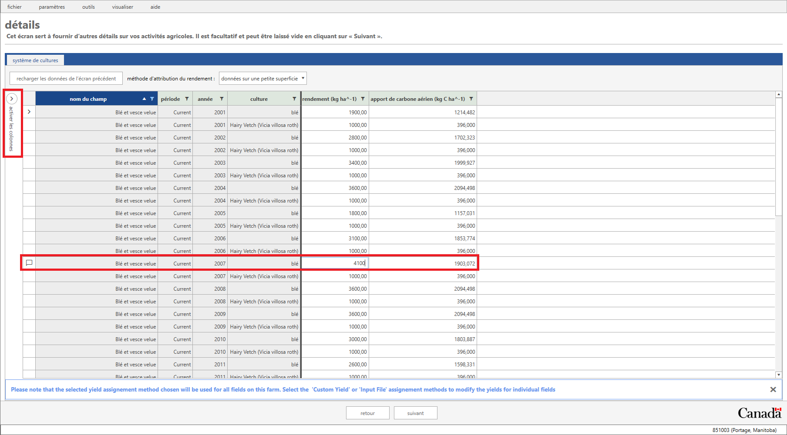
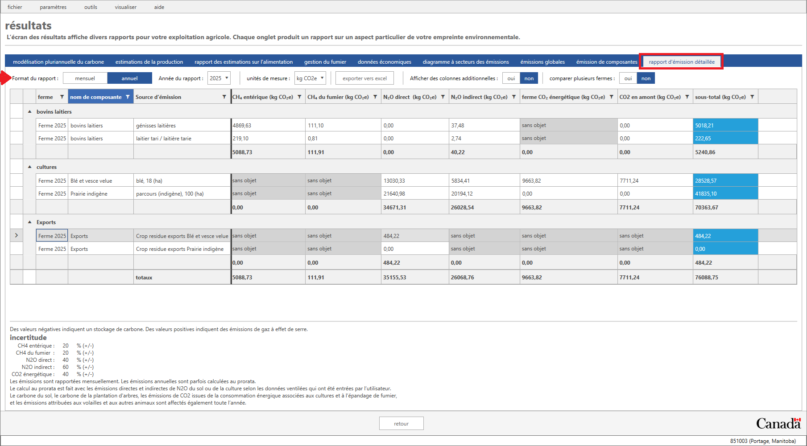
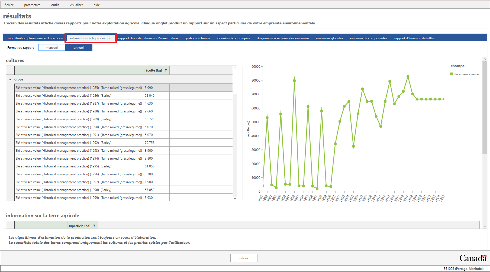
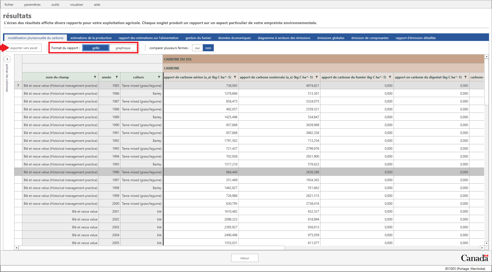

 
     

Le présent document sert d’introduction à l’utilisation du modèle Holos (version 4) et à la distinction entre les données requises et les données facultatives. Nous allons créer une ferme qui comprendra un système de production laitière et un système de cultures fourragères. Notre ferme est située au Manitoba, près de Portage la Prairie.

 

# Lancez Holos 

Veuillez noter que Holos 4 ne peut être installé que sur le système Windows de Microsoft. Le système d’exploitation Mac OS sera pris en charge dans la prochaine version.

Lancez Holos en double-cliquant sur l’icône Holos qui se trouve sur le bureau. Holos demande à l’utilisateur d’ouvrir une ferme existante, de créer une nouvelle ferme ou d’importer un fichier enregistré (figure 1). Si une ferme est déjà enregistrée dans le système, l’utilisateur peut cliquer sur **Ouvrir**. Si aucune ferme n’est enregistrée dans le système, Holos demande à l’utilisateur s’il veut créer une **nouvelle** ferme ou **importer** un fichier de ferme enregistré (c.-à-d. un fichier JSON). Si l’utilisateur crée une nouvelle ferme, le système lui demande le nom de celle-ci et un commentaire facultatif (figure 2).

Entrez le nom de ferme **Holos 2024** et le commentaire **Version de formation**. Cliquez sur **OK** pour passer à l’écran suivant. 

Assurez-vous de sélectionner l’option **Métrique** comme unité de mesure, puis cliquez sur le bouton Suivant, au bas de l’écran (figure 3).

 

    
     
    <em>Figure 1: Si une ferme a déjà été enregistrée, Holos présente une invite pour la rouvrir.</em>

 

    
     
    <em>Figure 2: Entrée d’un nom pour la nouvelle ferme. </em>

 

    
     
    <em>Figure 3: Sélectionnez l’unité de mesure Métrique. </em>

 

# Création et emplacement de la nouvelle ferme laitière

La ferme laitière que nous allons créer dans le cadre de notre exercice sera située dans la province du Manitoba. Sélectionnez l’option **Manitoba** dans l’écran **Sélectionner une province**, puis cliquez sur le bouton **Suivant**.

 

    
     
    <em>Figure 4: Sélectionnez l’option "Manitoba".</em>

 

Holos utilise Pédo-paysages du Canada (PPC), une série de couvertures SIG qui montrent les principales caractéristiques des sols et des terres pour l’ensemble du Canada (compilées à une échelle de 1:1 million). Les polygones de PPC peuvent contenir un ou plusieurs éléments distincts du pédo-paysage.

L’écran Emplacement de la ferme affiche une carte du Canada, avec la province du Manitoba au centre de l’écran.

La carte contient des polygones de couleur rouge que vous pouvez sélectionner en déplaçant votre curseur sur la région contenant l’emplacement de votre ferme. Vous pouvez faire un zoom avant ou arrière sur la carte à l’aide de la molette de la souris ou en déplaçant le curseur sur l’icône de zoom, au bas de l’écran.

La ferme laitière de notre exemple est située entre Winnipeg et Portage la Prairie (Portage), avec le numéro de polygone 851003 de PPC.

Trouvez ce polygone et cliquez à droite pour le sélectionner sur la carte (figure 6). Notez qu’à ce stade, les données climatiques quotidiennes seront téléchargées à partir du site de la [NASA](https://power.larc.nasa.gov/data-access-viewer/). 

 

> *Note: Climate data is central to most calculations performed by Holos. For the most accurate estimation of farm emissions, measured climate data should be provided by the user which will override the default data obtained from the NASA weather API. If the user chooses to use the default NASA climate data, these data are available in a 10 km grid, and so can vary throughout the SLC polygon, depending on the precise location of the farm. Therefore, if possible, the user should choose the location of their farm as precisely as possible. Doing so can be aided by using different views (e.g., the Aerial view), which can be selected via the eye icon at the bottom of the map on the Farm Location screen.*
> 

> *Holos will use daily precipitation, temperature, and potential evapotranspiration values to model soil carbon (C) change (climate parameter), nitrous oxide (N2O) emissions, and ammonia (NH3) volatilization.*

 

    
     
    <em>Figure 5: Map of the Manitoba province showing the different selectable SCL polygons.</em>

 

    
     
    <em>Figure 6: Selecting the SLC polygon for the farm location.</em>
 

 
  
 
Once the farm location is selected, soil information (texture, sand, and clay proportions) for the types of soils found in this polygon are displayed on the right side of the screen. It is possible that more than one soil type per polygon will be found and the user is expected to select their soil type from this list or use the default selection (Figure 7). The default soil type selected represents the dominant soil type for the chosen polygon.

For this tutorial, keep the default **Soil Zone** as **"Black"** soil, and the default **Hardiness Zone** as **"3b"**.  
  
 

    
     
    <em>Figure 7: Multiple soil types may be available for the selected SLC polygon.</em>

 

 

 > *Note: Soil data obtained from the user’s selected location will be used in the calculation of location-specific N2O emission factors. Properties such as soil texture, top layer thickness, and pH are required for these calculations, and can be overwritten on the Component Selection screen, under Settings > Farm Defaults > Soil.*

 

Click the **Next** button to proceed to the next step.

# Sélection des composantes de la ferme

Maintenant que l’emplacement de la ferme a été sélectionné, nous passons à l’écran Sélection des composantes. C’est dans cet écran que vous pouvez sélectionner différentes composantes pour votre ferme. Holos affiche toutes les composantes disponibles du côté gauche de l’écran dans la colonne Composantes disponibles (figure 8). Ces composantes sont regroupées en catégories telles que Gestion des terres, Production bovine, Bovins laitiers, etc.

Si vous cliquez pour visualiser la liste déroulante de l’une de ces catégories, les composantes disponibles s’affichent. Dans le cadre de la présente formation, nous travaillerons avec les catégories Gestion des terres et Bovins laitiers.

 

    
     
    <em>Figure 8 : Écran des composantes disponibles. Des composantes particulières peuvent être choisies ici pour être incluses dans la ferme. </em>

 

 

Le modèle Holos est conçu de manière à ce que les composantes de gestion des terres soient définies avant celles du bétail. Cela parce que le modèle nous permet de placer le bétail dans des champs (c.-à-d. des pâturages) particuliers afin qu’ils s’y nourrissent. Il est en effet plus facile d’effectuer cette opération lorsque le pâturage a été préalablement défini. L’utilisateur peut toutefois configurer ses composantes du bétail avant de configurer ses composantes de champ, mais il devra ensuite retourner à ses composantes du bétail pour les préciser et les "placer" au pâturage.

## Culture et production de foin

Nous pouvons maintenant ajouter à la ferme notre première composante. Faites glisser une composante Champ du côté gauche de l’écran et déposez-la dans le volet **Ma ferme**, du côté droit (Figure 9). L’écran est maintenant mis à jour pour refléter la composante que vous avez ajoutée à votre ferme. Holos a étiqueté le champ comme **Champ 1**. À ce stade, nous pouvons entrer des données de production sur la culture dans ce champ.

 

    
     
    <em>Figure 9: Des composantes particulières peuvent être choisies ici pour être incluses dans la ferme.</em>

 

 

### Blé et culture de couverture

Dans le premier champ de notre ferme, nous cultiverons du blé en continu avec une culture de couverture de vesce velue. Changez les éléments suivants dans la composante **"Champ 1"**.

1. Renommez le champ pour lui donner le nom de **Blé et vesce velue** dans la section **Étape 1** de l’écran. Changez la superficie du champ pour la faire passer à **18 ha**.
   
2. Laissez l'année de départ à 1985 et changez l'année de fin à 2023.

3. À l’étape 2, sélectionnez l’option **Blé** comme culture principale, et l’option **Vesce velue** comme culture de couverture.

4. Ouvrez l’onglet Renseignements **généraux**.:
    * Inscrivez un rendement de **3 000 kg ha -1** (poids humide). La valeur du poids sec est 
    * Sélectionnez l’option **Travail réduit du sol** comme type de travail du sol.
    * Entrez la valeur **200 » mm ha -1** comme quantité d’eau d’irrigation.
    * Sélectionnez la valeur **0** comme nombre de passages de pesticides.
    * Laissez la valeur par défaut **Méthode de récolte**.

 

    
     
    <em>Figure 10: Composante de champ pour la ferme.</em>

 

 

4. Ouvrez la page d’onglet Engrais, puis cliquez sur le bouton **Ajouter l’épandage d’un engrais**. Holos a maintenant ajouté un nouvel épandage d’engrais pour ce champ et proposera l’urée comme mélange d’engrais. Un taux d’épandage par défaut est calculé en fonction de la valeur de rendement entrée pour ce champ. On peut modifier les détails de cet épandage d’engrais (saison de l’épandage, mélange d’engrais différent, etc.) en cliquant sur le bouton Afficher les renseignements additionnels.

 

    
     
    <em>Figure 11: Ajout d’un engrais à un champ. </em>

 

 

>*Note: It is not necessary to enter a crop for each individual year going back to 1985 (or an alternative user-defined start year); only enough crops to describe a single phase of the rotation will need to be entered by the user. Holos will then copy this phase information and back-populate the field history (i.e., Holos will copy the specified rotation back to the start year on behalf of the user).*

>*Holos exige au minimum la superficie du champ, le type de culture et un taux d’épandage d’engrais propre au champ pour pouvoir calculer les émissions directes et indirectes d’oxyde nitreux.*

> *La gestion des résidus de chaque culture (et de chaque culture de couverture) peut être ajustée dans Holos (voir la page d’onglet Résidus). Holos fournit des valeurs par défaut selon le type de culture et établi une valeur selon le pourcentage de produit et de paille retournés dans le sol, etc. Ces paramètres d’entrée des résidus auront une incidence sur les estimations finales de la variation du carbone dans le sol.*

> *De plus, les fractions de biomasse et les concentrations d’azote peuvent être écrasées par l’utilisateur, ce qui permet d’ajouter les cultures « personnalisées » qui ne sont actuellement pas disponibles.*

### Prairies indigènes

1. Faites glisser une nouvelle composante de champ vers votre liste de composantes. Entrez le nom **Prairie indigène** dans la case de saisie **Nom du champ**.
2. Laissez l'année de départ à 1985 et changez l'année de fin à 2023.
3. Entrez une superficie totale du champ de **100 ha**.
4. Sélectionnez l’option **Parcours (indigène)** dans la liste déroulante de la colonne Culture, à **l’étape 2**. Veuillez noter que Holos remplit automatiquement la colonne **Culture d’hiver/de couverture/intermédiaire** lorsqu’un type de culture vivace est sélectionné.
5. Conserver la valeur **"0" mm ha-1** comme quantité d’eau d’irrigation et la valeur **"0"** comme nombre d’applications de pesticides.
6. Aucun engrais n’est utilisé pour cette culture.

 

    
     
    <em>Figure 12: Renseignements sur les pâturages indigènes.</em>

 

 

# Exploitation laitière 

L’ajout de composantes animales se fait exactement comme l’ajout de composantes de gestion des terres. Dans la catégorie **Bovins laitiers**, glissez et déposez une composante laitière dans la volet **Ma ferme**. Si l’un des groupes d’animaux de **l’étape 1** n’est pas nécessaire pour la ferme, vous pouvez le supprimer en cliquant sur l’icône **X** correspondante (de même, d’autres groupes d’animaux laitiers peuvent être ajoutés à l’aide du bouton Ajouter un groupe).

*Remarque: Sélectionnez l’option de menu **Visualiser** et décochez l’option **Masquer la liste des composantes disponibles**.*

 

    
     
    <em>Figure 13: Composante Bovins laitiers.</em>

 

 

## **Données sur les vaches en lactation, les veaux, les génisses laitières et les vaches taries**

**Pour définir les paramètres liés aux vaches en lactation:**

Holos donne à l’utilisateur la possibilité d’avoir plus d’un groupe de vaches en lactation. Nous avons supposé que l’intervalle de vêlage était de 10 mois au cours d’une période de lactation de 12 mois.

1. À **l’étape 1**, assurez-vous que la ligne Laitier en lactation/laitière en lactation est sélectionnée avant d’entrer l’information de gestion connexe pour ce groupe.

2. Cliquez sur la période de gestion **Early lactation** à **l’étape 2** pour activer cette période de gestion. Assurez-vous que la date de début est le **1er janvier 2024** et que la date de fin est le **31 mai 2024** (150 jours). Veuillez noter que le **nombre de jours** qui s’affiche inclut les dates de début et de fin.

3. Nous pouvons ensuite entrer les données liées au nombre d’animaux, au type de logement, au système de gestion du fumier et à la ration pour notre groupe de vaches en lactation de **l’étape 3**. 

4. Ouvrez la page d’onglet **Général** et entrez la valeur **"65"** dans le champ Nombre d’animaux. 

5. Nous allons créer une ration personnalisée pour notre groupe de vaches en lactation. Ouvrez la page d’onglet **Ration** Notez que Holos fournit un ensemble de rations par défaut que vous pouvez utiliser. Puisque nous allons créer une ration personnalisée, nous allons cliquer sur le bouton **Créateur de ration personnalisée**.

 

> *Remarque : Le nombre d’animaux, le gain quotidien moyen et la qualité des aliments sont les données minimales requises pour que le système puisse calculer les émissions de méthane et d’oxyde nitreux. La durée des périodes de gestion (p. ex. la durée du broutage) sera également nécessaire. Les données sur le logement et la gestion du fumier sont*

 

 6. Cliquez sur le bouton **Ajouter une ration** personnalisée, dans la section **Étape 1** de l’écran, pour créer une nouvelle ration personnalisée. Donnez à cette nouvelle ration le nom de **Ma ration personnalisée**, puis appuyez sur la touche Entrée pour l’enregistrer.
 
 7. Pour ajouter des ingrédients à la nouvelle ration, passez à la section **Étape 2** et sélectionnez l’option **"Luzerne"** dans la liste des ingrédients, puis cliquez sur le bouton Ajouter l’ingrédient sélectionné à la ration.
 
 8. Nous ajouterons encore un ingrédient à notre ration. Sélectionnez l’option **"Orge roulée"** dans la liste des ingrédients, puis cliquez de nouveau sur le bouton **Ajouter l’ingrédient sélectionné à la ration**.
 
 9. Entrez la valeur **"50 %"**" pour le **foin de luzerne** et la valeur **"50 %"** pour le **grain d’orge aplati** à **l’étape 3**. Cliquez sur **OK** pour enregistrer la nouvelle ration personnalisée.

 

    
     
    <em>Figure 14: Créateur de ration personnalisée pour le groupe d’animaux laitiers en lactation.</em>

 

 

> *Remarque: La ration est maintenant complète dans Holos, puisque la somme de ses ingrédients arrive à 100 %.*

 

 10.  Sélectionnez maintenant l’option **"Ma ration personnalisée"** dans le menu déroulant de la page d’onglet **Ration**.

 

> *Remarque: Les renseignements sur la qualité de l’alimentation, comme la teneur en protéines brutes, le total des nutriments digestibles et la teneur en graisses, sont nécessaires pour que Holos puisse estimer les émissions de méthane entérique d’un groupe animal.*

 

 11. Dans la page d’onglet **Logement**, sélectionnez le type de bâtiment **"Stabulation entravée (litière solide)"**. 

 12. Ouvrez la page d’onglet **Fumier** et sélectionnez l’option **"litière solide (entreposée)"** dans la liste.
 
 13. Cliquez sur la période de gestion **Mi-lactation** à **l’étape 2**. Assurez-vous que la date de début est le **"1er juin 2023"** et que la date de fin est le **"31 juillet 2023"** (60 jours).
 
 14. Nous pouvons entrer des données liées au nombre d’animaux, au type de logement, au système de gestion du fumier et à la ration pour notre groupe de vaches en lactation de l’étape 3, comme nous l’avons fait précédemment.
 
 15. Dans la page d’onglet **Général**, entrez la valeur **65** pour le nombre d’animaux; dans la page d’onglet **Ration**, sélectionnez l’option **Régime laitier personnalisé**; dans la page d’onglet **Logement**, sélectionnez l’option **Stabulation entravée (litière solide)** et dans la page d’onglet **Fumier**, sélectionnez l’option **"litière solide (entreposée)"**.
 
 16. Cliquez sur la période de gestion **Lactation tardive**, à **l’étape 2**. Assurez-vous que la date de début est le **"1er août 2023"** et que la date de fin est le **"4 novembre 2023"** (95 jours).
 
 17. Répétez l’étape 16 ci-dessus. Entrez les mêmes données à **l’étape 3** pour cette période de gestion.

 

**Pour établir les paramètres liés aux veaux:**

Les veaux qui ne sont pas destinés au remplacement seront saisis dans le système de production des veaux et recevront principalement du lait de remplacement et du maïs grain. Si l’on tient compte d’une perte de fertilité de 7,7 %, 60 veaux sont produits selon un rapport mâle:femelle de 50:50. Sur les 30 veaux femelles produits, la ferme en a sélectionné 15 comme génisse de relève (jeune génisse) pour les vaches laitières en lactation. Avec un taux de mortalité présumé de 4,4 % à l’âge de 4 mois, 43 veaux de boucherie recevront une ration à base de maïs grain. Les veaux de boucherie sont abattus à 6 mois (~ 270 kg de poids corporel).

1. Dans la section des groupes d’animaux de **l’étape 1**, assurez-vous que la ligne **des veaux laitiers** est sélectionnée avant d’y entrer les données de gestion connexe pour ce groupe. 

2. À **l’étape 2**, la première période de gestion ira du **"1er janvier 2023"** au **"31 mars 2023"** (90 jours).

3. À **l’étape 3**, ouvrez la page d’onglet **Général** et entrez la valeur **"45"** dans le champ Nombre d’animaux. Ouvrez la page d’onglet **Fumier** et sélectionnez l’option **"litière solide (entreposée)"** dans la liste.

4. Retournez à **l’étape 2** et cliquez sur le bouton **Ajouter une période de gestion**. Une deuxième période de gestion sera ainsi ajoutée pour notre groupe de veaux. Assurez-vous que la date de début est le **"1er avril 2023"** et que la date de fin est le **"30 juin 2023"** (90 jours). Comme nous avons supposé un taux de mortalité de 4,4 % à l’âge de quatre mois, nous ajusterons le nombre d’animaux au cours de la deuxième période de gestion à **"43"**.

 

> *Remarque: Les données sur la ration et sur le logement des veaux laitiers ne sont pas nécessaires pour les calculs de Holos (les pages d’onglets correspondantes sont donc ignorées à **l’étape 3**).*

 

**Pour définir les paramètres liés aux génisses laitières:**

Sur les 30 veaux femelles produits, la ferme en a sélectionné 15 comme génisses de relève pour les vaches laitières en lactation.

1. Dans la section des groupes d’animaux de **l’étape 1**, assurez-vous que la ligne **des génisses laitières** est sélectionnée avant d’entrer l’information de gestion connexe pour ce groupe.

2. Pour la **"période de gestion no 1"**, entrez la date de début du **"1er janvier 2023"** et la date de fin du **"31 décembre 2023"**. 

3. Ouvrez la page d’onglet **Général** et entrez la valeur **"15"** dans le champ Nombre d’animaux.

4. Dans la page d’onglet **Ration**, assurez-vous que la ration **"Haute teneur en fibres"** est sélectionnée pour les génisses.

5. Dans la page d’onglet **Logement**, sélectionnez le type de logement **"Étable à stabulation libre en logettes (litière solide)"**". 

6. Dans la page d’onglet **Fumier**, sélectionnez l’option **"litière solide (entreposée)"**.

 

**Pour définir les paramètres liés aux produits laitiers:**

Vingt vaches cesseront de produire du lait durant une période de repos, ce qui permettra leur rétablissement et leur récupération.

1. Dans la section des groupes d’animaux de **l’étape 1**, assurez-vous que la ligne des **animaux laitiers taris** est sélectionnée avant d’entrer l’information de gestion connexe pour ce groupe.

2. À **l’étape 2** de la période de gestion du tarissement, entrez la date de début du **"5 novembre 2023"** et la date de fin du **"4 janvier 2024"**. 

3. Ouvrez la page d’onglet **"Général"** et entrez la valeur **"20"** dans le champ Nombre d’animaux.

4. Dans la page d’onglet **"Ration"**, assurez-vous que l’option **"Ration à base de fourrage de légumineuses"** est sélectionnée.

5. Dans la page d’onglet **"Logement"**, sélectionnez l’option **"Étable à stabulation libre en logettes (litière solide)"** comme type de logement.

6. Dans la page d’onglet **"Fumier"**, sélectionnez l’option **"litière solide (entreposée)"**.

 

### Adding a Manure Application to the Wheat Field

In Holos, the user can apply livestock manure to a field using either manure produced by the livestock on the farm or manure imported from off-farm. Since we have now defined our animal components, we can apply dairy manure produced on-farm to any field on our farm.

1. Select the **Wheat & hairy vetch** field from the list of components added to our farm.

2. Click on the **Manure tab** and then click the **Add Manure Application** button.
    * Select **"April 30, 2024"** as the date.
    * Select **"Livestock"** as the origin of manure.
    * Select **"Dairy"** as the manure type.
    * Select **"Liquid/Slurry with no natural crust"** as the manure handling system.
    * Select **"Shallow injection"** as the application method.
    * Enter **"14,000 kg ha-1"** as the amount of manure applied to this field.
3. Note that both chemical fertilizer and manure applications can be made on the same field.

> Holos provides an interactive gauge on the left of the manure tab to show the **Amount of Stored Manure N Remaining (Dairy cattle) (kg N)**, which adjusts to reflect the user's application choices and quantify the amount of stored manure (N) remaining for application.

 

    
     
    <em>Figure 15: Adding a manure application to a field.</em>

 
 

# Écran Calendrier

Nous sommes en train de terminer la définition de notre ferme. Cliquez sur le bouton **Suivant** pour continuer vers l’écran Calendrier. Cet écran présente une vue d’ensemble de tous les champs, de 1985 à l’année de fin spécifiée pour chaque champ. Cet écran permet également à l’utilisateur d’ajouter des systèmes de production antérieurs et prévus.

Le bouton **Ajouter un système de production historique** permet à l’utilisateur d’ajouter un historique de culture différent à des champs individuels, tandis que le bouton **Ajouter un système de production prévu** permet à l’utilisateur d’ajouter un système de culture futur (prévu) à des champs individuels.

### Adding a historical production system

We will assume that the **Wheat & Hairy Vetch** field was used to grow a **Barley** grain - **Tame mixed (grass\legume)** hay rotation between **1985 and 2000**.

1. To add a new historical cropping system, select the "**Wheat & Hairy Vetch field**". To select an item, click on the timeline bar to activate that field.

2. Click on the **Add Historical Production System** button which will add a new row to the table under the **"Step 1"** section in the upper left section of the screen. Note that this new entry has the words **"Historical management practice"** added.

3. We will set the end year of this historical management practice to the year **"2000"**. To adjust this we use the numeric up/down buttons within the cell.

4. Select the newly added **Historical management practice** and then click the **"Edit Selected"** button. This will open a new screen that allows us to adjust the crops grown and their management during this period.

5. As we want to make this a three-crop rotation, under **"Step 2"** click the "**Add Crop**" button twice to add two more crops. 

7. Change the first crop type to "**Barley**" (with no cover crop). Enter a yield of **"3,500 kg ha-1"** (wet weight) and keep all other settings as default.
  
8. Change the second and third rows to **"Tame mixed (grass/legume)"** - note that when a perennial crop is selected as the main crop, Holos automatically selects the same crop type as the cover crop. Keep all other settings as default for both years. 

10. Click **"OK"** to save these adjustments.

<em>Cliquez sur le bouton Suivant pour passer à l’écran Détails.

 

    
     
    <em>Figure 16: Customized Timeline screen</em>

 

   

    
     
    <em>Figure 17: Adjusted start and end year for productions systems on the timeline screen.</em>

 

  

    
     
    <em>Figure 18: Editing crops in a historical period of the rotation. </em>

 

## Écran Détails

Pour éviter qu’un utilisateur soit obligé de fournir les rendements annuels des cultures en remontant jusqu’à 1985 (ou à une autre date, si la date précisée est différente) pour chaque champ de la ferme, le modèle utilisera les données de *Statistique Canada* sur le rendement annuel propre à une culture par défaut (le cas échéant). Les changements dans le rendement des cultures ont une incidence sur divers extrants du modèle, notamment sur les taux de séquestration du carbone dans le sol et sur les émissions de N2O des sols. Les étapes suivantes montrent comment l’ajustement du rendement des cultures influe sur les intrants de carbone au-dessus et en dessous du sol.

We will adjust this grid so that we can view the above-ground and below-ground C inputs for our **Wheat & Hairy Vetch** field and then we will adjust the crop yield for one specific year.

1. We will set a filter on the first column named **"Field name"** so that we only display information for our current **Wheat and hairy vetch** field. Beside the column heading, click the **'funnel'** icon to set a filter. Check the box beside **'Wheat & hairy vetch'**.

2. On the far left of this screen, click the **Enable Columns** sidebar (located near the “Field name” column).

3. Place a check beside **"Above-ground carbon input"** to show the column and remove the check beside the **'Notes'** column to hide it.

4. Click the **'Enable Columns'** sidebar again to collapse it.

5. We can now (optionally) adjust the yields for our wheat crop for any given year if actual measured yields are available.

6. Adjust the wheat yield for **2006** to be **4,100 kg ha-1"**.

7. Note that Holos has updated the above-ground C inputs for this.

Cliquez sur le bouton Suivant pour passer à l’écran du rapport final des résultats. 

 

    
     
    <em>Figure 19: Details screen</em>

 

 

#  Écran des résultats

Les résultats sont maintenant affichés dans divers rapports et graphiques.

1. Cliquez sur l’onglet intitulé **Diagramme circulaire des émissions**.

    Ouvrez la page d’onglet **Rapport d’émissions détaillées** pour accéder à un rapport mensuel ou annuel sur les émissions de GES. Ce rapport porte sur les émissions de CH4 entérique, les émissions de CH4 du fumier et les émissions directes et indirectes de N20 de la ferme.

2. Le Format du rapport offre la possibilité de se déplacer entre les rapports mensuels et annuels.

    Dans le menu **déroulant Unité de mesure**, vous pouvez choisir d’afficher les résultats sous forme d’équivalents CO2 (CO22) ou de gaz à effet de serre non convertis (GES), et vous pouvez également choisir l’unité de mesure (tonnes ou kilogrammes). 
 

    
     
    <em>Figure 20: Rapport d’émissions détaillées. </em>

 

 

3. Le rapport Estimations de la production fournit les rendements totaux des récoltes, la quantité de terres sur lesquelles du fumier a été épandu et les estimations de la production laitière pour les composantes laitières.

 

    
     
    <em>Figure 21: Rapport Estimation de la production. </em>

 

 

## Résultats de la modélisation du carbone dans le sol 

Dans l’écran des résultats, nous pouvons voir l’évolution du carbone dans le sol au fil du temps en cliquant sur l’onglet **"Modélisation pluriannuelle du carbone"**. Dans cette page d’onglet, un graphique présente l’évolution du carbone dans le sol avec le temps pour chacun de nos champs.

Pour chacun des champs présents dans le graphique, vous pouvez passer votre souris sur la série pour obtenir plus de données sur chaque année de la simulation. 

Cliquez sur l’un de ces points pour voir une répartition plus détaillée des résultats sous forme de grille. Vous pouvez également exporter les données en cliquant sur le bouton **"Exporter vers Excel"**. 

Si vous voulez exporter l’ensemble de votre fichier agricole, sélectionnez les options de menu **"Fichier"**, puis **"Exporter"** dans le menu principal. Cliquez sur la flèche pour mettre votre ferme en évidence et enregistrez-la sous forme de fichier JSON. 

 

    
     
    <em>Figure 22: Modélisation pluriannuelle du carbone.</em>

 

 

# Finalement…

## Approche intégrée

> Un écosystème est composé non seulement des organismes et de l’environnement où ils vivent, mais également des interactions des organismes avec leur milieu et entre eux. L’approche intégrée vise à décrire et à comprendre le système entier comme un ensemble intégré et non comme un ensemble de composantes distinctes, c’est-à-dire que l’on considère le tout plutôt que la somme des parties. C’est une approche holistique qui peut être très complexe et il est difficile d’en décrire le processus. Recourir à un modèle mathématique est une façon de conceptualiser un système dans son ensemble. 
> 
> C’est une approche intégrée qui permet de s’assurer que les effets des changements de gestion à l’échelle du système influent sur les émissions nettes des fermes. Dans certains cas, la réduction des émissions d’un GES entraîne une hausse des émissions d’un autre GES. L’approche intégrée permet d’éviter d’adopter des pratiques potentiellement inopportunes fondées sur les préoccupations à l’égard d’un seul GES.

Pour télécharger Holos, obtenir de plus amples renseignements ou accéder à une liste récente des publications concernant Holos, visitez le site : https://agriculture.canada.ca/fr/production-agricole/holos. 

Pour nous joindre, envoyez un courriel à:
aafc.holos.acc@canada.ca. 