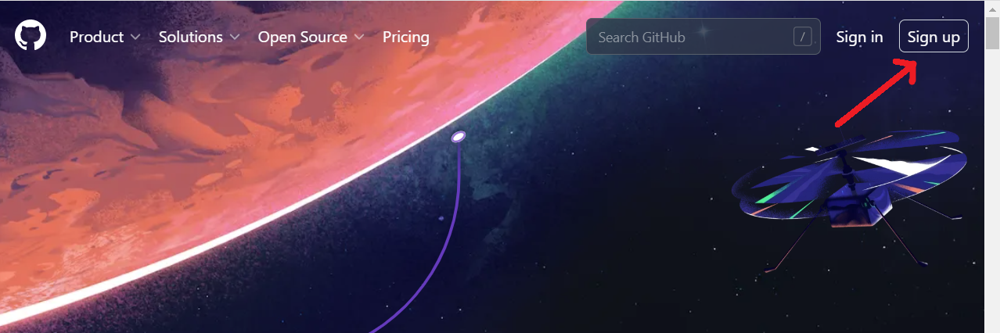
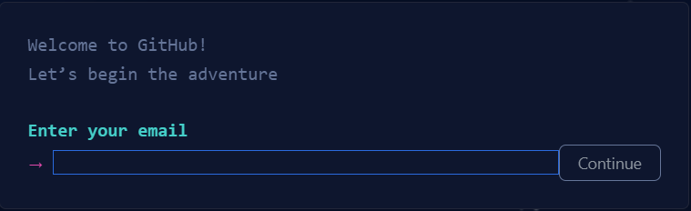
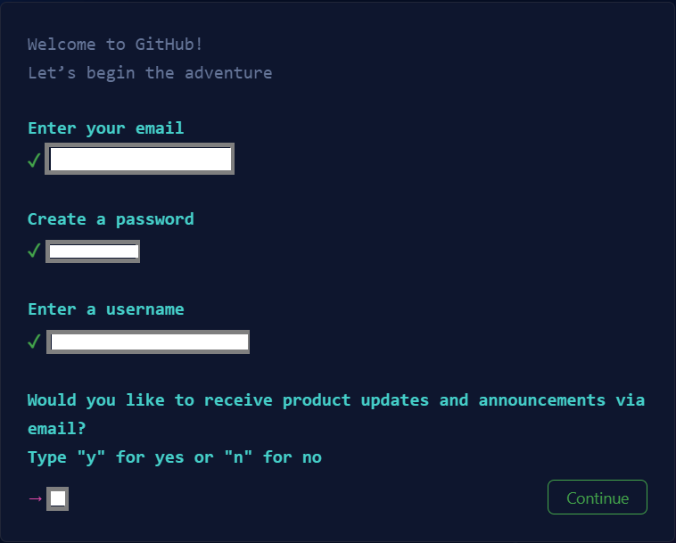
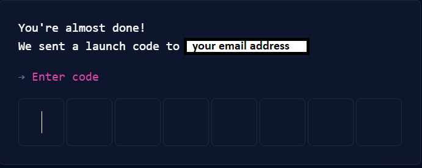
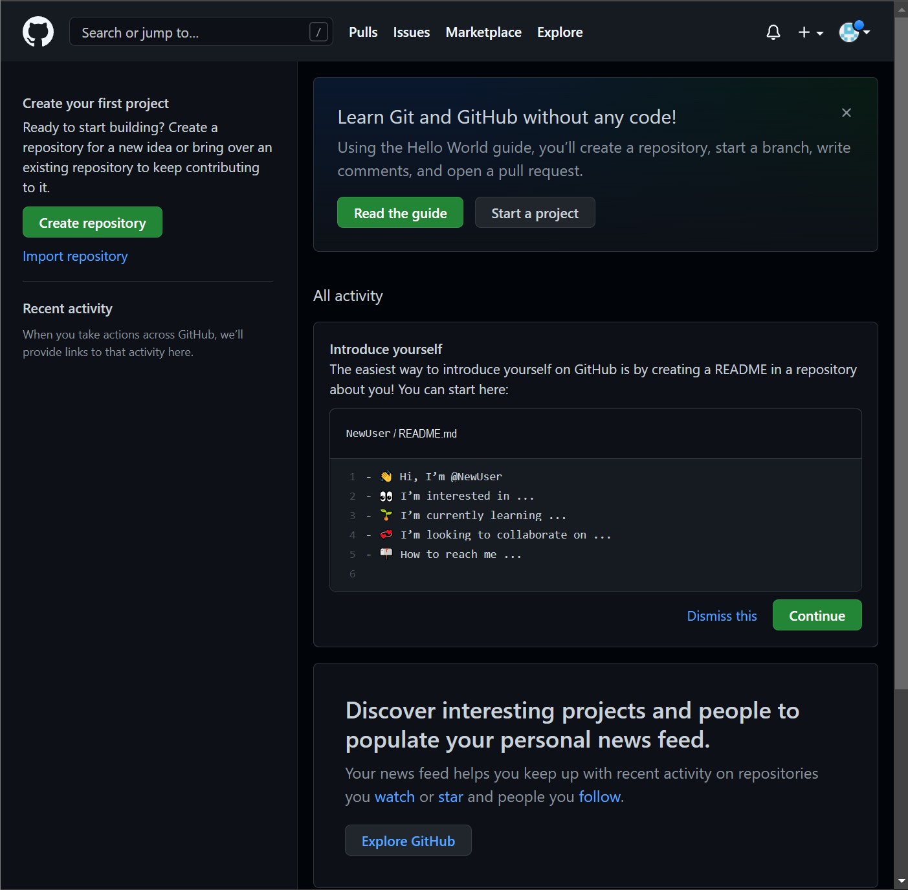
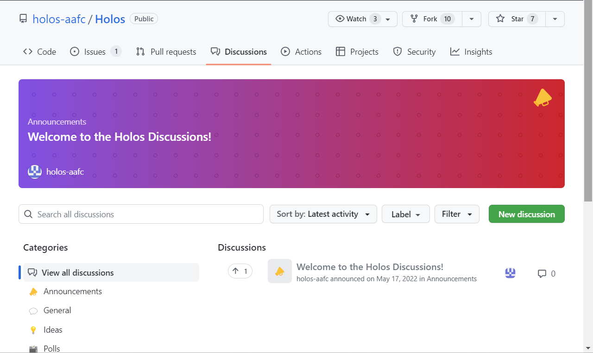
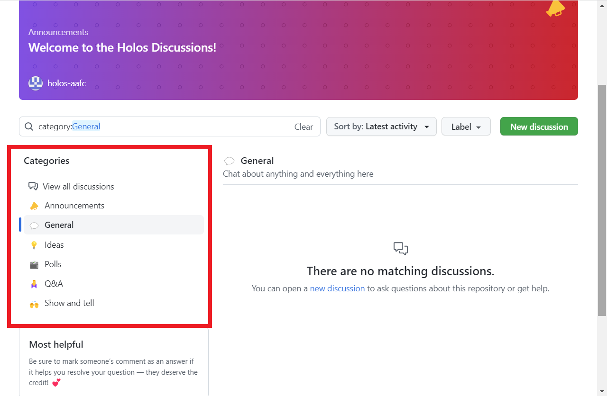

# Holos Discussion Forum
In <a href="https://github.com/holos-aafc/Holos/discussions">Holos Discussion Forum</a>, you can share your idea, give some feedback about the program, and ask questions. To begin using the discussion forum, a GitHub account needs to be created. If you don’t already have a GitHub account, follow the steps below.

 
 

# How to create a GitHub account
1. Open https://github.com in a web browser, and then select **Sign up**.

 
2. Enter your email address.

 

3. Create a password for your new GitHub account and enter a username. Next, choose whether you want to receive updates and announcements via email, and then select **Continue**. 
 
 
4. Verify your account by solving a puzzle. Select the Start Puzzle button to do so, and then follow the prompts.

5. After you verify your account, select the **Create account** button.

6. Next, GitHub sends a launch code to your email address. Type that launch code in the Enter code dialog, and then press Enter.

 

7. GitHub asks you some questions to help tailor your experience. Choose the answers that apply to you.

 

8. On the Where teams collaborate and ship screen, you can choose whether you want to use the Free account or the Team account. To choose the **Free** account, select the Skip personalization button.

9. GitHub opens a personalized page in your browser. You've successfully created your GitHub account.

 
 

# How to write a post in the discussion forum
1. Click the link to access <a href="https://github.com/holos-aafc/Holos/discussions">Holos Discussion Forum</a>. 
If you don't have a GiHub account, follow instructions from Ho <a href="hthttps://github.com/holos-aafc/Holos/blob/main/H.Content/Documentation/FAQ/GitHub%20account.md#how-to-create-a-github-account">HolHow to create a GitHub account</a>
If you already have a GitHub account, sign in your account. 

2. Select one of the categories you want to write. In this example, 'General' is selected.

 
3. After you Write discussion title and the details, select **Start discussion**.

 
4. Your post is successfully created. If you want to edit your post, right click on **...** and select **edit**.

