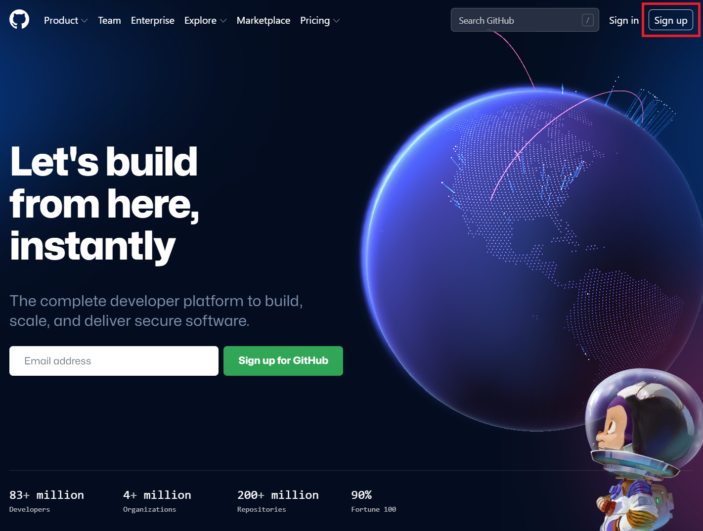
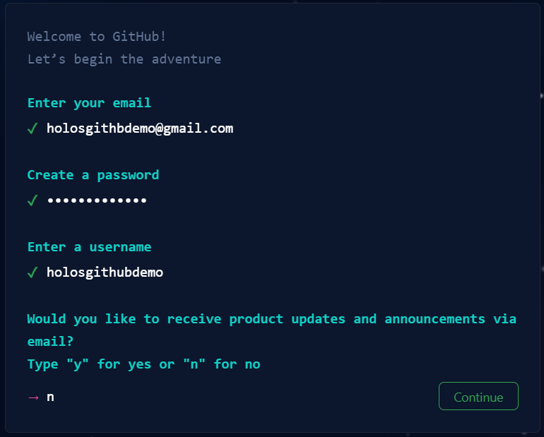
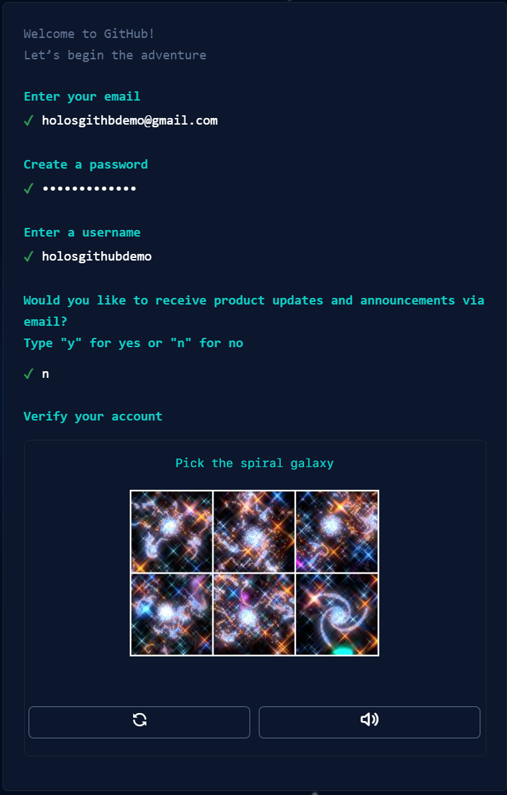
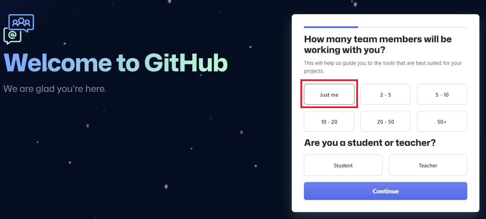
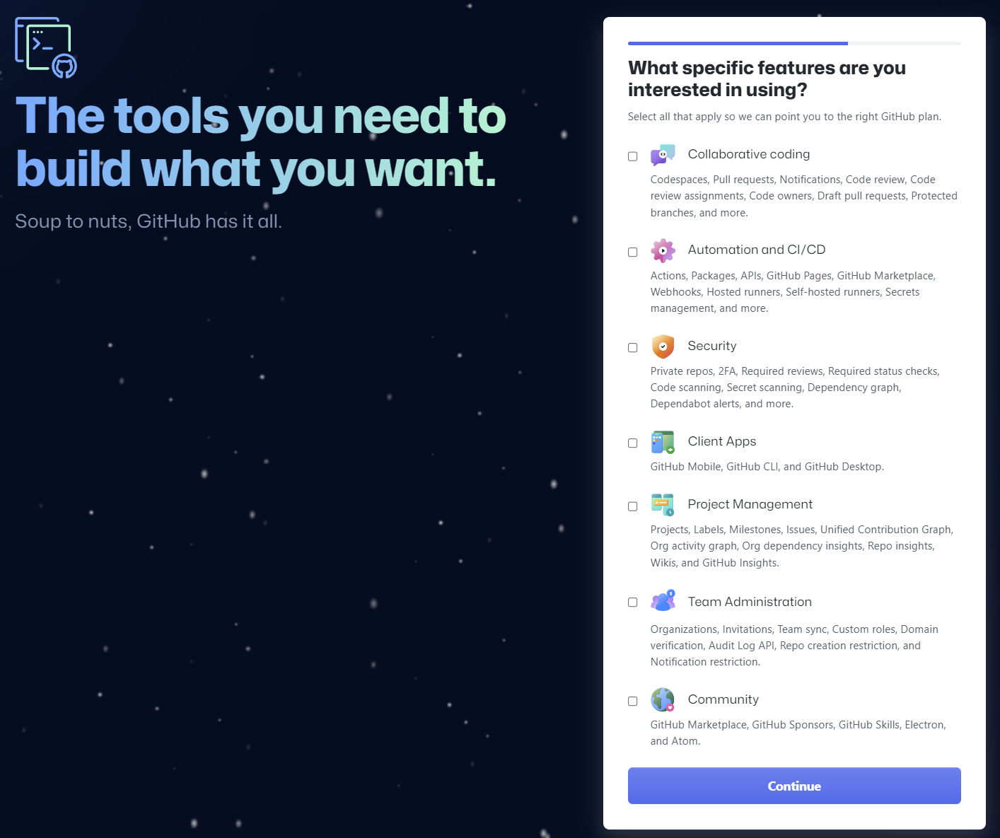
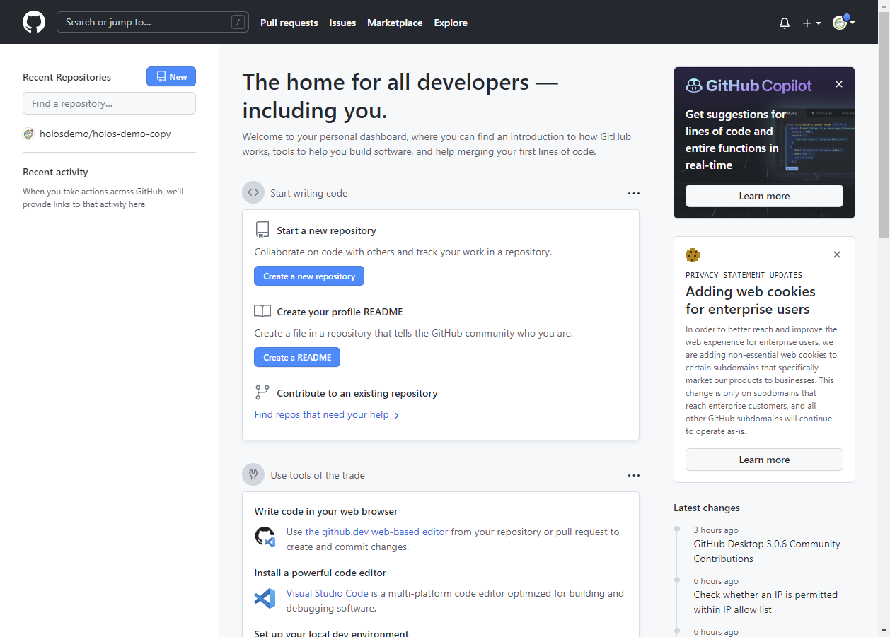
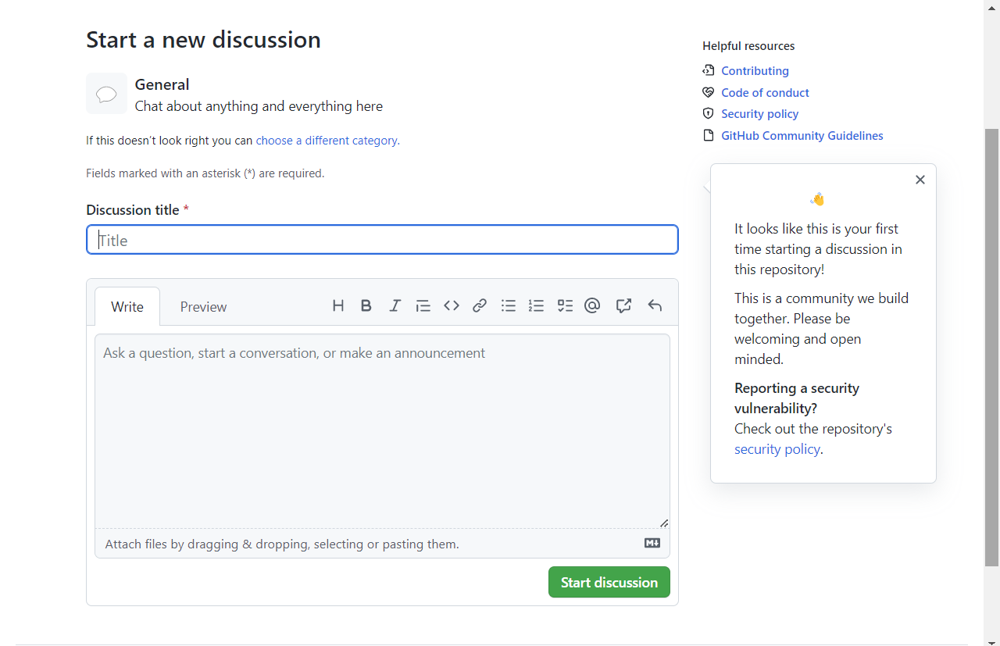
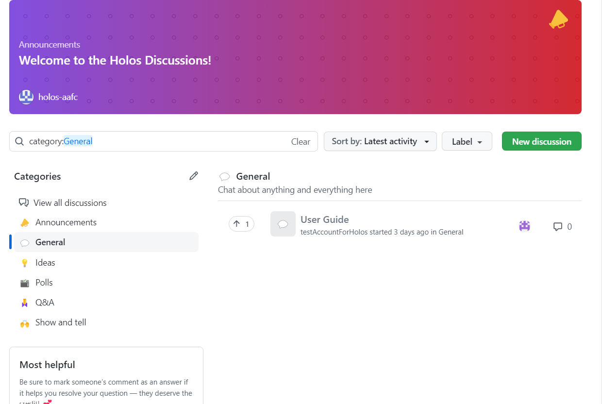

 
     

In Holos Discussion Forum, you can share your idea, give some feedback about the program, and ask questions. To begin using the discussion forum, a GitHub account needs to be created. If you don’t already have a GitHub account, follow the steps below.

 

# Creating an account

The account creation process on Github is similar to most other websites. To start this process, go to
the Github homepage

**https://github.com**

1. After the homepage loads, click on the **sign-up** button in the top right corner of the page.

 

    
     
    <em>Figure 0: Click the sign up button.</em>

 
 

2. A new page will load and ask you for various information related to the account, including **email**, **password** and **username**.

 

    
     
    <em>Figure 1: Enter your details.</em>

 
 

3. Github will sometimes ask you to solve a simple puzzle. This is done to stop bots from registering new accounts.

 

    
     
    <em>Figure 2: Solve the puzzle if it appears.</em>

 
 

4. Next, Github will ask you if the account is for a team or an individual. For this purpose, select **just me** and press **continue**.

 

    
     
    <em>Figure 3: Select "just me" to create an individual account.</em>

 
 

5. Github will present options to further customize your account on the following screen. For our purpose, keep everything unselected and click **continue**.

 

    
     
    <em>Figure 4: Pick options (if needed) to customize github for your account.</em>

 
 

6. Finally, Github will ask you if you want to make a **free** or **paid** account. Select **Continue for free**.

 

    
     
    <em>Figure 5: Choose "continue for free" to create a free account.</em>

 
 

7. The account creation process is complete; you should now see your homepage.

 

    
     
    <em>Figure 6: Your github home page after account creating and logging in.</em>

 
 

# How to write a post in the discussion forum

1. Click the link to access <a href="https://github.com/holos-aafc/Holos/discussions">Holos Discussion Forum</a>. 
If you don't have a GiHub account, follow instructions from Ho <a href="hthttps://github.com/holos-aafc/Holos/blob/main/H.Content/Documentation/FAQ/GitHub%20account.md#how-to-create-a-github-account">HolHow to create a GitHub account</a>
If you already have a GitHub account, sign in your account. 

 

    
     
    <em>Figure 7: Holos Dicsussion Forum.</em>

 
 

2. Select one of the categories you want to write. In this example, 'General' is selected.

 

    
     
    <em>Figure 8: Select 'General'.</em>

 
 

3. After you Write discussion title and the details, select **Start discussion**.

 

   
     
    <em>Figure 9: Select 'General'.</em>

 
 

4. Your post is successfully created. If you want to edit your post, right click on **...** and select **edit**.

 

   
     
    <em>Figure 10: The page shown after account creating a post.</em>

 
 