

 
     

In Holos Discussion Forum, you can share your idea, give some feedback about the program, and ask questions. To begin using the discussion forum, a GitHub account needs to be created. If you don’t already have a GitHub account, follow the steps below.

 
 

# Creating an account

The account creation process on Github is similar to most other websites. To start this process, go to
the Github homepage

**https://github.com**

1. After the homepage loads, click on the **sign-up** button in the top right corner of the page.

 

    
     
    <em>Figure 0: Click the sign up button.</em>

 
 

2. A new page will load and ask you for various information related to the account, including **email**, **password** and **username**.

 

    
     
    <em>Figure 1: Enter your details.</em>

 
 

3. Github will sometimes ask you to solve a simple puzzle. This is done to stop bots from registering new accounts.

 

    
     
    <em>Figure 2: Solve the puzzle if it appears.</em>

 
 

4. Next, Github will ask you if the account is for a team or an individual. For this purpose, select **just me** and press **continue**.

 

    
     
    <em>Figure 3: Select "just me" to create an individual account.</em>

 
 

5. Github will present options to further customize your account on the following screen. For our purpose, keep everything unselected and click **continue**.

 

    
     
    <em>Figure 4: Pick options (if needed) to customize github for your account.</em>

 
 

6. Finally, Github will ask you if you want to make a **free** or **paid** account. Select **Continue for free**.

 

    
     
    <em>Figure 5: Choose "continue for free" to create a free account.</em>

 
 

7. The account creation process is complete; you should now see your homepage.

 

    
     
    <em>Figure 6: Your github home page after account creating and logging in.</em>

 
 

# How to write a post in the discussion forum

1. Click the link to access <a href="https://github.com/holos-aafc/Holos/discussions">Holos Discussion Forum</a>. 
If you don't have a GiHub account, follow instructions from Ho <a href="hthttps://github.com/holos-aafc/Holos/blob/main/H.Content/Documentation/FAQ/GitHub%20account.md#how-to-create-a-github-account">HolHow to create a GitHub account</a>
If you already have a GitHub account, sign in your account. 

 

    
     
    <em>Figure 7: Holos Dicsussion Forum.</em>

 
 

2. Select one of the categories you want to write. In this example, 'General' is selected.

 

    
     
    <em>Figure 8: Select 'General'.</em>

 
 

3. After you write a title and details, select **Start discussion**.

 

   
     
    <em>Figure 9: Fill the blank.</em>

 
 

4. Your post is successfully created. 

 

   
     
    <em>Figure 10: The page shown after creating a post.</em>

 
 

5. If you want to edit your post, right click on **...** and select **edit**.

 

   
     
    <em>Figure 11: Click edit button to edit your post.</em>

 
 

# Fork/Copy a repository to your account

Github does not allow direct contributions to a repository unless changes are made by a repository
maintainer. Therefore, to contribute changes to any project, we must **Fork** (or copy) the original
repository to our account. We will then make changes to this **Fork** in our account and submit these
changes to the original repository as a **pull request**.

The purpose of a **pull request** is to create a formal process with which changes are accepted to a
repository. It allows maintainers of a repository to review incoming requests, suggest changes and
collaborate with people submitting these changes. **Pull requests** also ensure that only approved
changes are included in the original repository.

Therefore, the first step in contributing changes to a repository is to create a personal **Fork**.

1. Go to the original repository. The Holos repository's URL is,

**https://github.com/holos-aafc/Holos**

 

   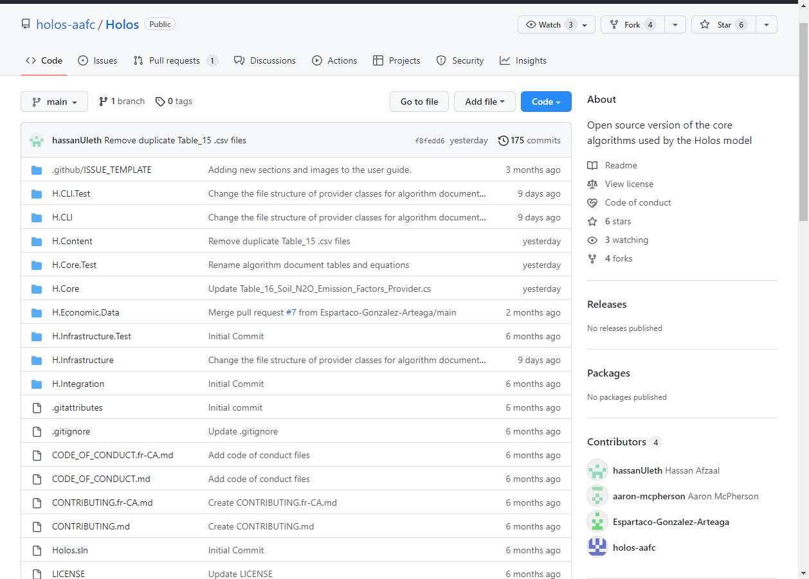
     
    <em>Figure 11: The Holos repoistory
     
Note: The above image is of the actual Holos repository page. This example will use a demo
repository for the rest of the guide.</em>

 
 

1. In the top right corner of the Holos repository, click **Fork**.

 

   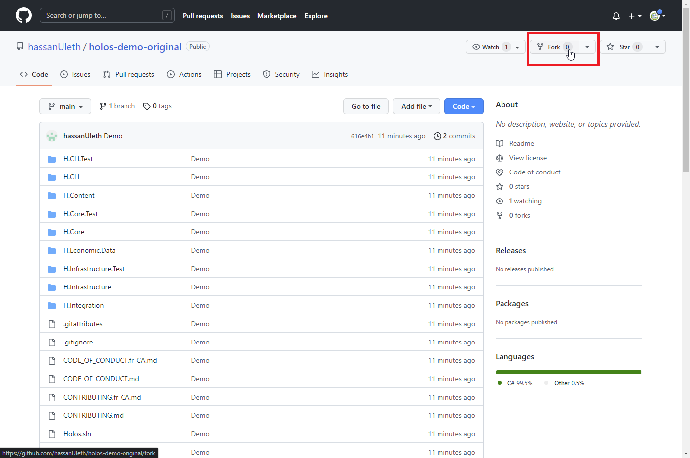
     
    <em>Click the fork button on the repository you want to copy.</em>

 
 

3. A new page will load, asking you to provide a name and description for your personal copy of the original repository. The name can be anything and does not need to mirror the original repository.
**3.1.** Please make sure you keep **copy the main branch only** selected as this ensures you're not copying any unnecessary information to your account.
**3.2.** Click **Create fork** when done.

 

   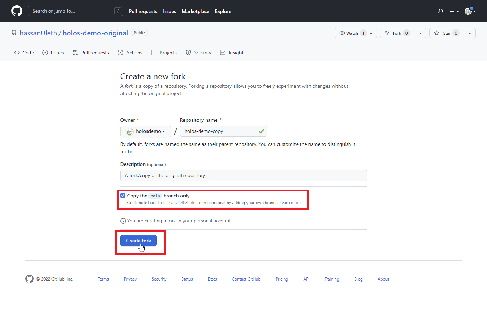
     
    <em>Set a name for your copied repository.</em>

 
 

4. Your personal repository should look like this:

 

   
     
    <em>Your personal repository copy.</em>

 
 

You can confirm that you are looking at your own repository by looking at the top left corner of your
Github page. The top left corner shows your account name and the name of the current repository.
The format here is **Account_Name / Repository_Name**.

 
 

# Making changes to your repository's files

Changes can be made to your repository's files directly from github.com. To make a change, open
the file editor in GitHub by clicking the pencil icon (edit button) located right above the table.

 

   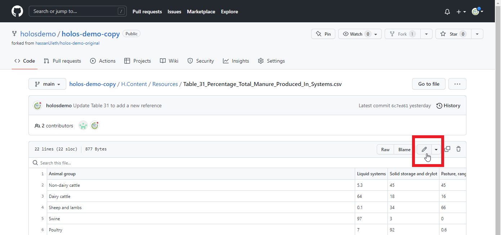
     
    <em>Click the edit (pencil) icon to edit the file.</em>

 
 

Clicking the icon opens the file in Github's editor, which allows us to edit the file and write a commit
message to explain the change.

 

   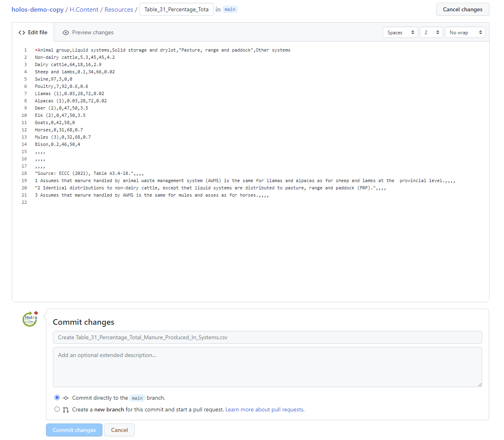
     
    <em>GitHub's file editor.</em>

 
 

After editing the content, please write a commit message and an optional description explaining the
change and its purpose. Then, click commit message to save your changes.

 

   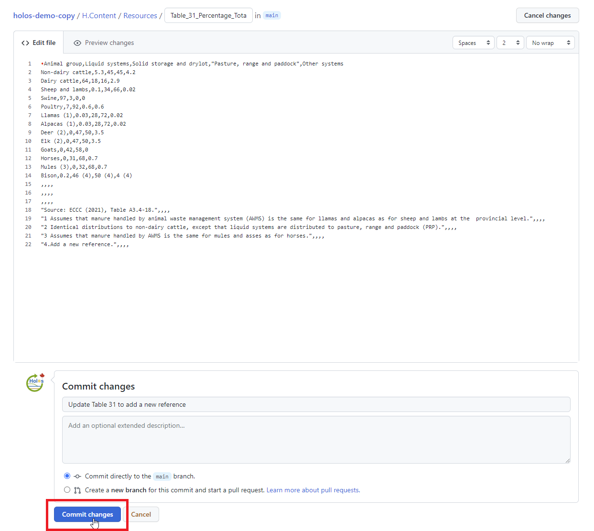
     
    <em>Write a commit message and commit file changes.</em>

 
 

# Contributing changes to the original repository

After making changes to the files and **committing** those changes, we are now ready to contribute
these changes to the original repository. To start this process, go to your personal repository's
home page. Here, click the **Contribute** drop down and click on Open pull request. This will start
the pull request process. A pull request is a request sent to the original repository to **pull** data from
**your** repository.

 

   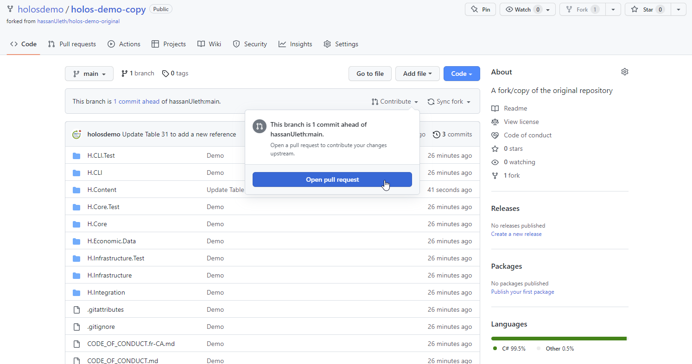
     
    <em>Open a pull request by clicking "Contribute"</em>

 
 

Before creating a **pull request**, add a meaningful title and describe the purpose of the change. This
description will help make the pull request process a lot easier. On the **pull request** page, you can
also scroll down to see all your **commits** as well as the changes made to your files.

Create the **pull request** by clicking the **Create pull request** button.

 

   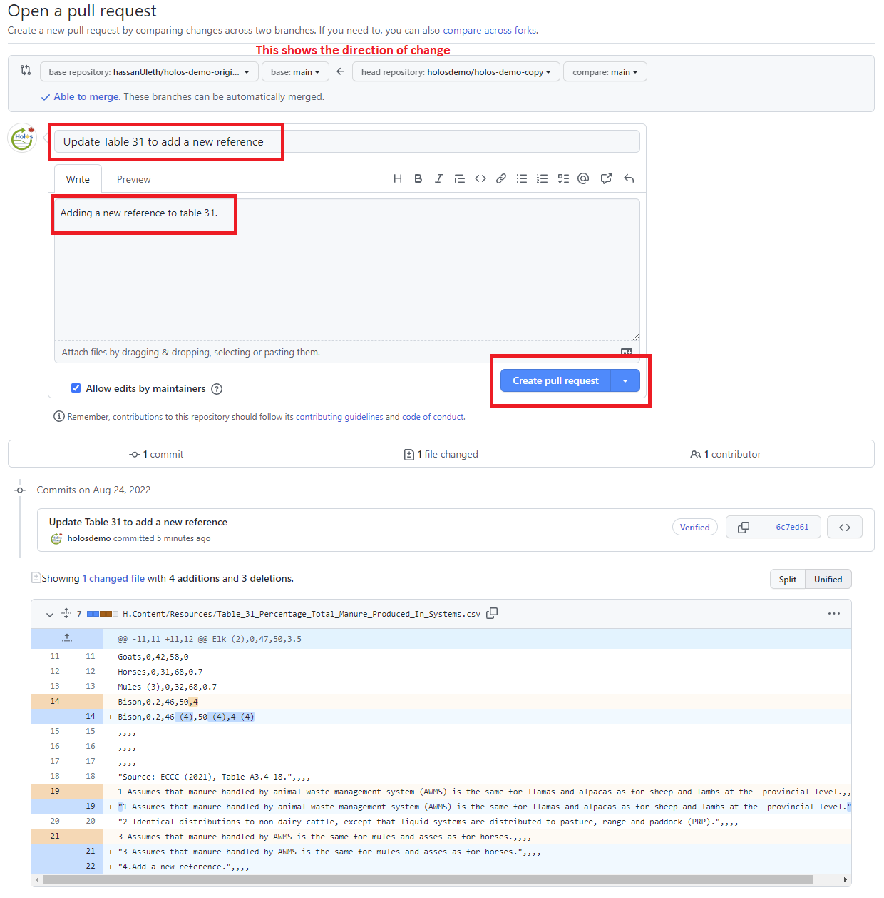
     
    <em>Write a meaningful title and description for the request.</em>

 
 

You'll then be automatically taken to the newly created pull request (in the original repository).

 

   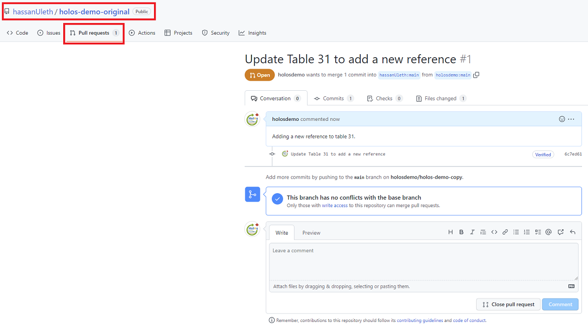
     
    <em>You'll be taken to the original repository automatically.</em>

 
 

# Syncing changes from the original repository to your fork

The original repository often contains changes not present in your personal copy. When this happens,
a message will show on **your repository** saying,
**This branch is x commits behind {original_branch_name}**. When this happens, you can sync
changes from the original repository to bring your copy up to date.

 

   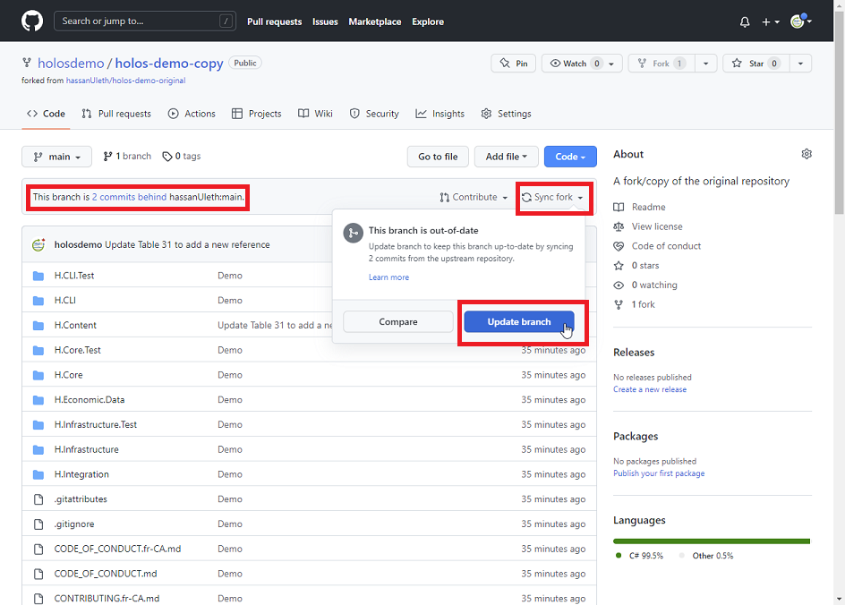
     
    <em>Sync changes made in original repository with your copy.</em>

 
 

To sync changes, click on the **Sync fork** drop-down, located next to the contribute drop-down. When
you click this button, you will be asked to either **compare** the repositories or **Update branch**. The
latter will update your repository and sync it with the original version.

 

   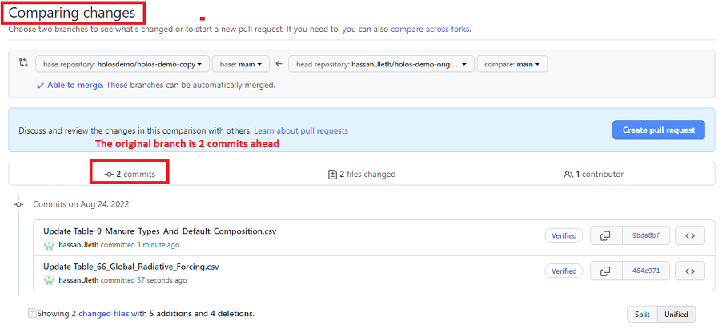
     
    <em>We can compare repositories before syncing.</em>

 
 

# Submitting a bug/suggestion

We can use GitHub to submit bugs and suggestions as well. To submit a bug/suggestion:

1. Go to the main page of the Holos repository **https://github.com/holos-aafc/Holos** and click on the **Issues** tab at the top.

 

   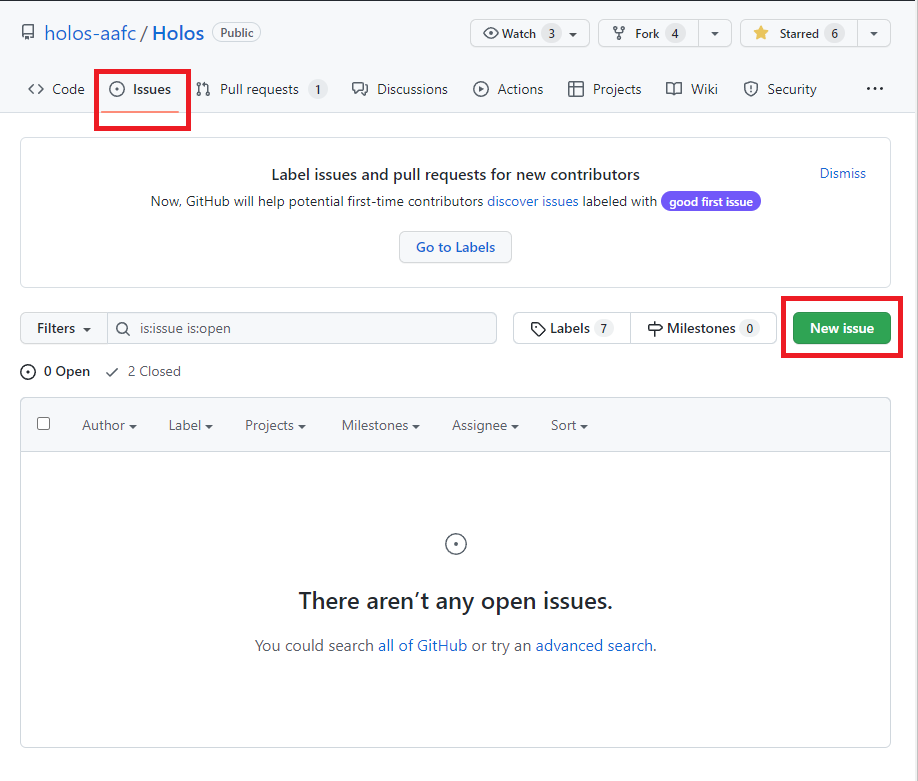
     
    <em>Create an issue by clicking the issue button.</em>

 
 

2. Click on the **New Issue** button.
3. Select **Get Started** located opposite the issue template you want to use. Each issue
    template contains fields that guides the user and helps them provide important
    information needed to resolve/discuss issues.

 

   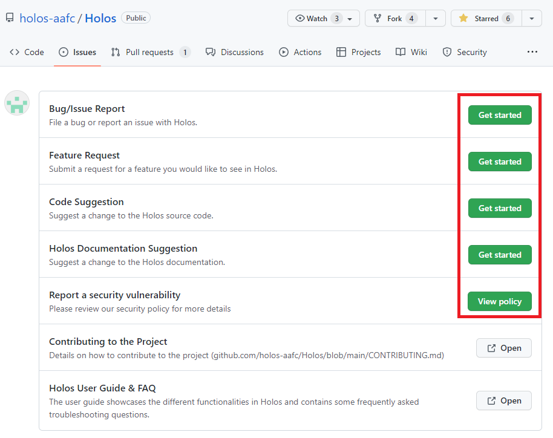
     
    <em>Use a pre-defined template to create an issue.</em>

 
 

# Terms used in this guide

**Repository** : A storage space containing a collection of files. In this context, a repository means a storage space for files insideGitHub.com

**Original Repository** : The original set of files or original source of files.

**Branch** : A branch is an isolated component (space) of a repository. 'Main' is the primary branch of a default repository. A repository can have multiple branches, and changes in each branch are contained/limited to that branch only.

**Fork** : Copying someone else's repository into our own account. In this context, creating a fork would mean making a copy of Holos' source files inside our personal account.

**Pull Request** : A request sent to the maintainers of a repository to pull(accept) potential file changes. In this context, we will create a pull request to ask Holos' Github repository maintainers to pull our changes to their repository.

**Commits** : Collection(s) of changes made to a repository. Every time we want to save our changes to a repository, we have to 'commit' these changes.

**Public** : This means that a repository is publicly visible to everyone who has its Github link.
