# Table des matières
- [Table des matières](#table-des-matières)
- [Processus de contrôle à la source et de flux de travail](#processus-de-contrôle-à-la-source-et-de-flux-de-travail)
- [Utilisation d’Azure DevOps](#utilisation-dazure-devops)
  - [Clonage du référentiel Holos depuis le serveur Azure DevOps](#clonage-du-référentiel-holos-à-partir-dazure-devops-server)
  - [Soumission des modifications à Azure DevOps](#soumission-des-modifications-à-azure-devops)
    - [Retrait des modifications depuis le référentiel Azure DevOps](#retirez-les-modifications-du-référentiel-à-distance-azure-devops)
    - [Validation des modifications vers les articles de référentiel et les articles de travail à distance ](#valider-une-modification-des-articles-de-répertoire-et-des-articles-de-travail-à-distance)
- [Utilisation de GitHub/GitHub Desktop](#utilisation-de-githubgithub-desktop)
  - [Clonage du référentiel Holos depuis GitHub](#clonage-du-référentiel-holos-depuis-github)
  - [Retrait des modifications depuis GitHub à l’aide de GitHub Desktop](#retrait-des-modifications-depuis-github-à-laide-de-github-desktop)
  - [Pousser les modifications vers GitHub à l’aide GitHub Desktop](#pousser-les-modifications-vers-github-à-laide-github-desktop)
- [Configuration de FreeFileSync](#configuration-de-freefilesync)
  - [Traitement des fichiers FreeFileSync : Icônes et leur signification](#traitement-des-fichiers-freefilesync--les-icônes-et-leur-signification)
  - [Synchronisation entre Azure DevOps et GitHub](#synchronisation-entre-azure-devops-et-github)
  - [Gestion de la création de fichiers](#gestion-de-la-création-de-fichiers)
    - [Création de fichiers dans Azure DevOps Server](#création-de-fichiers-dans-azure-devops-server)
    - [Création de fichiers dans GitHub](#création-de-fichiers-dans-github)
  - [Gestion de la suppression des fichiers](#gestion-de-la-suppression-des-fichiers)
    - [Suppression de fichiers dans Azure DevOps Server](#suppression-de-fichiers-dans-azure-devops-server)
    - [Suppression de fichiers dans GitHub](#suppression-de-fichiers-dans-github)
  - [Gestion des conflits de fichiers et modifications du code](#gestion-des-conflits-de-fichiers-et-modifications-apportées-au-code)
    - [Modification des fichiers dans Visual Studio](#modification-des-fichiers-dans-visual-studio)
    - [Modification des fichiers dans GitHub](#modification-des-fichiers-dans-github)

    
 
 

# Processus de contrôle à la source et de flux de travail 

Le flux de travail de développement de Holos utilise Azure DevOps et GitHub aux fins de contrôle à la source. Azure DevOps est utilisé pour les travaux de développement privés, tandis que le code source libre accessible au public est disponible dans GitHub. Cette division existe parce que Holos utilise l’interface utilisateur Telerik pour les contrôles WPF, et ces éléments de l’interface utilisateur ne peuvent pas être libres en raison des limites imposées par les licences. Par conséquent, GitHub est utilisé pour publier le code et les éléments de Holos ne faisant pas partie de l’UI, tandis que le référentiel complet est hébergé dans Azure DevOps, où ont lieu les travaux de développement.

Pour faciliter le processus de synchronisation entre ces deux plateformes, nous utilisons un programme appelé FreeFileSync qui synchronise sur votre lecteur local les fichiers des deux dossiers de référentiel en suivant diverses règles et en respectant divers paramètres de fichier. Le flux de travail du développement peut ensuite être divisé selon les étapes suivantes:

1. Tenir à jour deux référentiels locaux, un pour [Azure DevOps](#clonage-du-référentiel-holos-à-partir-dazure-devops-server) et l’autre pour [GitHub](#clonage-du-référentiel-holos-depuis-github).
2. Perform all development work on the Azure DevOps repository.
3. [Transférer ces modifications à Azure DevOps pour le contrôle à la source.](#soumission-des-modifications-à-azure-devops). 
4. [Utiliser FreeFileSync pour synchroniser son référentiel local Azure DevOps avec le référentiel local GitHub.](#synchronisation-entre-azure-devops-et-github).
5. [Une fois le processus de synchronisation terminé, transférez ces modifications à GitHub au moyen du bureau GitHub](#pousser-les-modifications-vers-github-à-laide-github-desktop). Le fichier de configuration FreeFileSync est configuré pour ignorer tous les fichiers liés à l’interface utilisateur, de sorte que les modifications transférées vers GitHub ne contiendront que des fichiers pouvant être en source libre.

 
 

# Utilisation d’Azure DevOps 

Azure DevOps est une plateforme de contrôle des versions et des sources semblable à GitHub. C’est dans cette plateforme que se déroulent la plupart des travaux de développement Holos, et le référentiel Azure DevOps n’est pas accessible au public. Nous utilisons Visual Studio (2019-2022) pour interagir avec ce référentiel et le modifier.

La première étape pour du travail de développement consiste à créer une copie locale du référentiel Azure DevOps dans votre ordinateur.

## Clonage du référentiel Holos à partir d’Azure DevOps Server 

Pour cloner le référentiel Holos à partir d’Azure DevOps Server, nous utilisons Visual Studio. Ce processus est semblable pour les versions 2019 et 2022 de Visual Studio.

 

1. Démarrez Visual Studio et cliquez sur "Cloner le référentiel".

    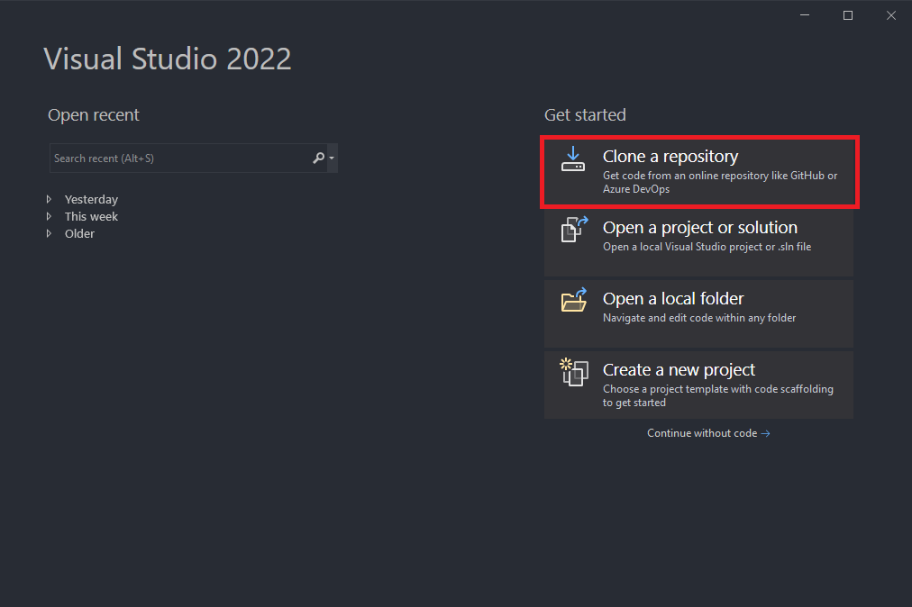
         
    <em>
		Figure 1 - Visual Studio, Cloning repository in Visual Studio
	</em>

 

2. Sélectionnez l’emplacement de stockage local du référentiel. Après avoir sélectionné votre emplacement, cliquez sur "Azure DevOps".

    
     
    <em>
		Figure 2 - Visual Studio, Selecting local path
	</em>

 

3. Dans la nouvelle fenêtre qui s’affiche, sélectionnez l’option **"Holos 4"** et cliquez sur **Connecter**.

    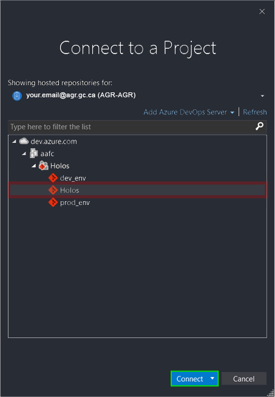
     
    <em>
		Figure 3 - Visual Studio, Selecting local path
	</em>

 

4. Après la connexion de Visual Studio au répertoire en ligne, quelques options vous sont présentées dans le volet des paramètres **Team Explorer**, à droite de l’écran.

* liquez sur **"Explorateur de contrôle à la source"**, dans le volet des paramètres, à droite.
* Une nouvelle page d’onglet s’ouvre pour l’explorateur de contrôle à la source.
* Dans cette nouvelle page, cliquez à droite sur **"Holos 4"**, puis sélectionnez l’option **Get Latest Version** du menu contextuel.

    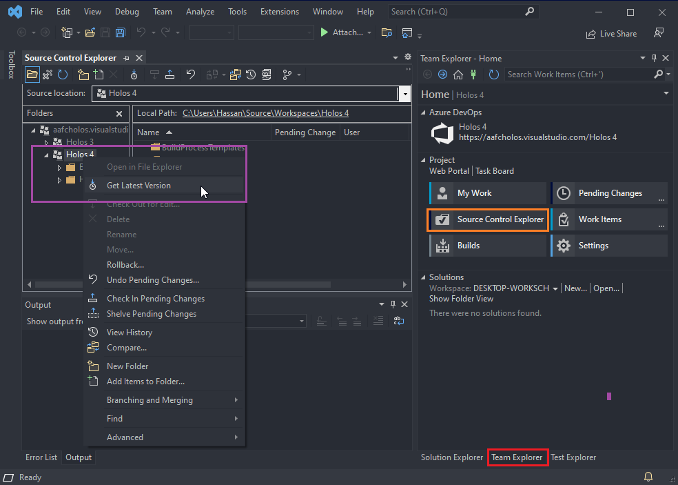
     
    <em>
		Figure 4 - Visual Studio, Team explorer tab
	</em>

Visual Studio copie maintenant le référentiel en ligne dans votre ordinateur local.

    
     
    <em>
		Figure 5 - Visual Studio, Pulling remote repository
	</em>

 

5. Vous devriez maintenant voir la nouvelle section **"Solutions"** dans le menu latéral Team Explorer. Cliquez à droite sur le fichier **"H.sln"** et ouvrez-le.

    
     
    <em>
		Figure 6 - Visual Studio, Opening H.sln
	</em>

 

6. Le code devrait maintenant être visible dans la section de la barre latérale de droite **"Solution Explorer"**. 

 
 

Maintenant que vous avez copié le référentiel à distance dans votre ordinateur local, vous pouvez apporter et soumettre les modifications voulues. 

## Soumission des modifications à Azure DevOps 

### Retirez les modifications du référentiel à distance Azure DevOps

Avant d’apporter des modifications à Azure DevOps, retirez les modifications du serveur à distance et obtenez la dernière version de chaque fichier. Cela nous permet de nous assurer que nous travaillons avec la version la plus récente de chaque fichier et de résoudre tout conflit lié à une fusion.

Pour obtenir la dernière version du référentiel, cliquez à droite sur le fichier de solution et sélectionnez l’option `Obtenir la dernière version (récursive)`. 

    
     
    <em>
		Figure 35 - Visual Studio, Getting latest Version
	</em> 

Les fichiers mis à jour apparaîtront dans la fenêtre Extrants. Vous pouvez y accéder en sélectionnant les options de menu Visualiser -> Extrants. Si vous avez la dernière version de tous les fichiers, un message indiquant que **"Tous les fichiers sont à jous"** s’affiche.

    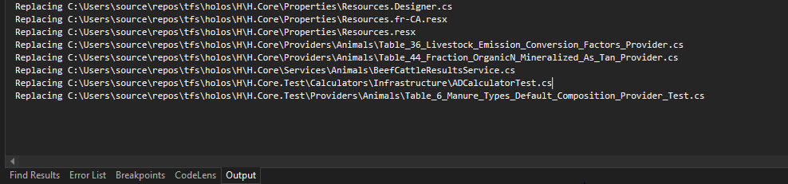
     
    <em>
		Figure 36 - Visual Studio, Updated files in output console
	</em>

 
 

### Valider une modification des articles de répertoire et des articles de travail à distance

- On peut valider les modifications dans Azure DevOps en accédant à la page d’onglet `Team Explorer` de Visual Studio. Cliquez sur `Modifications en cours` pour voir les fichiers qui ont été modifiés et qui sont en attente d’envoi.

    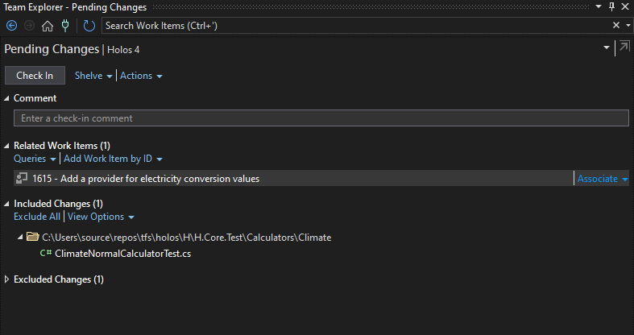
     
    <em>
		Figure 37 - Visual Studio, Pending changes view
	</em>

- Si vous résolvez un article de travail ou un bogue, obtenez l’ID de ce bogue et entrez-le dans la section `Articles de travail connexes` en cliquant sur `Ajouter un article de travail par ID`. 

- Pour examiner les différences entre les fichiers locaux et distants, cliquez à droite sur le fichier, puis cliquez sur `Comparer à la version la plus récente`.
  - Cela vous permet de confirmer les modifications apportées à un fichier précis avant de l’envoyer au serveur distant.

- Enfin, pour pousser les modifications, écrivez un commentaire sur celles-ci et cliquez sur **Vérifier**. 

 
 

Un message devrait surgir pour vous demander de confirmer que vous associez les articles de travail et poussez les modifications. Sélectionnez l’option **"Oui"** pour confirmer votre choix.

    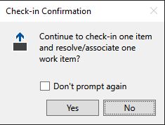
     
    <em>
		Figure 38 - Check-in Confirmation
	</em>

 
 

# Utilisation de GitHub/GitHub Desktop 

## Clonage du référentiel Holos depuis GitHub

 

1. Téléchargez l’outil Github Desktop à partir [d’ici](https://desktop.github.com/).

 

2. Ouvrez l’outil et sélectionnez l’option **"Cloner un référentiel à partir d’Internet"**.

    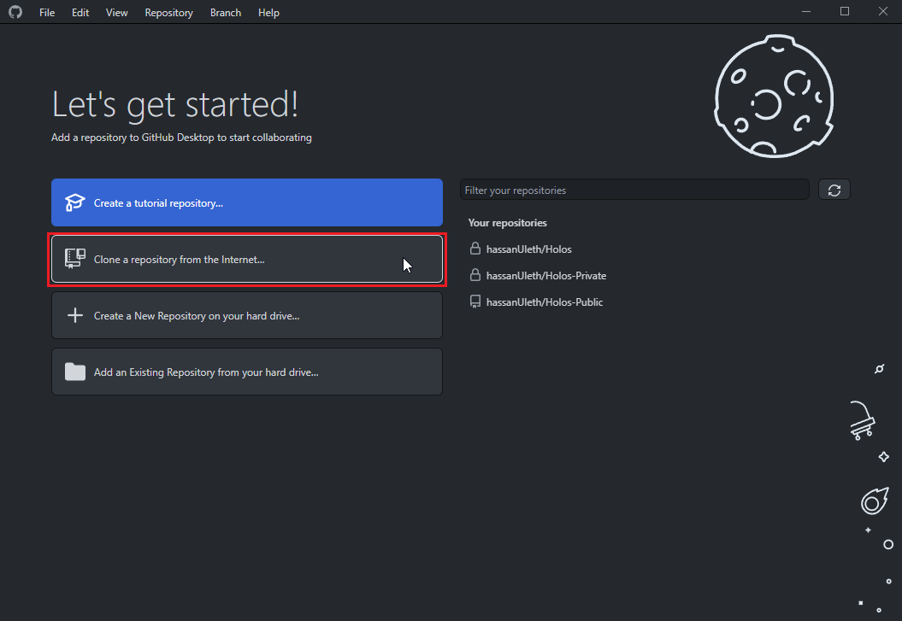
     
    <em>
		Figure 8 - GitHub Desktop, Start screen
	</em>

 

3. Dans la nouvelle fenêtre qui s’affiche, ouvrez la page d’onglet URL. Entrez ensuite l’URL Web HTTPS de votre référentiel GitHub et sélectionnez un chemin d’accès local pour désigner l’emplacement où le référentiel sera téléchargé.

    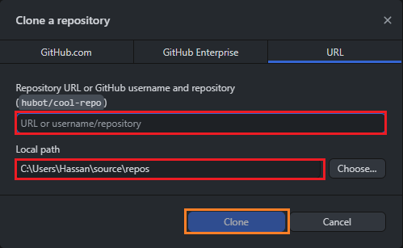
     
    <em>
		Figure 8-2 - GitHub Desktop, Entering remote repository URL and local save path
	</em>

    
     
    <em>
		Figure 9 - Entering repository URL
	</em>

 

GitHub crée maintenant un référentiel local à l’emplacement choisi.

    
     
    <em>
		Figure 10 - Cloning Holos repository
	</em>

    
     
    <em>
		Figure 11 - Holos directory
	</em>

 
 

## Retrait des modifications depuis GitHub à l’aide de GitHub Desktop

Ouvrez le GitHub Desktop et assurez-vous que votre répertoire actuel est correctement configuré à `holos-aafc/Holos`.

    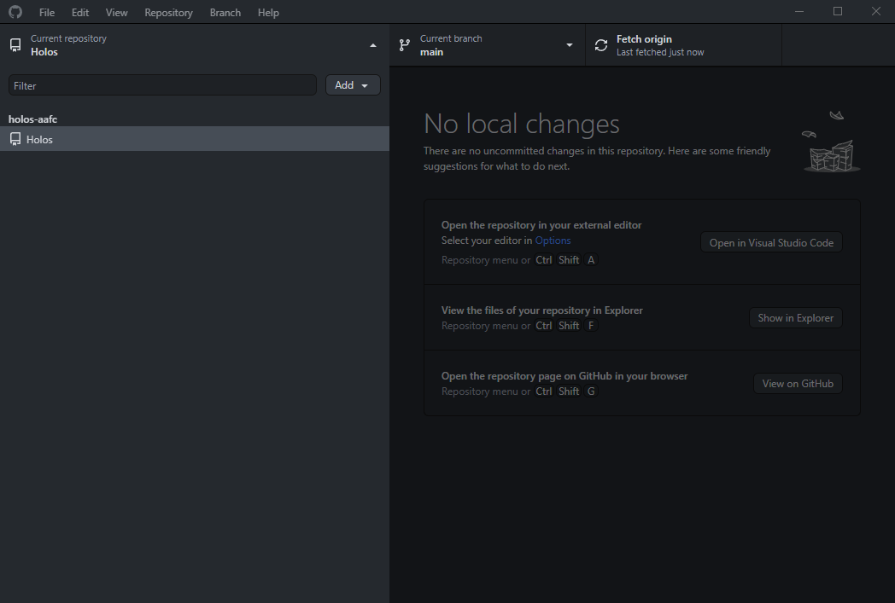
     
    <em>
		Figure 48 - GitHub Desktop, Setting current repository in GitHub Desktop 
	</em>

Cliquez ensuite sur le bouton `Récupérer l’origine` pour vérifier si des modifications sont disponibles.

    
     
    <em>
		Figure 49 - GitHub Desktop, Fetch origin
	</em>

Si des modifications sont disponibles, vous pouvez voir un chiffre indiquant le nombre de modifications devant être récupérées et le bouton de récupération de l’origine précédente indique maintenant `Récupérer l’origine`.

    
     
    <em>
		Figure 50 - GitHub Desktop, Pull origin
	</em>

Cliquez sur le bouton `Récupérer l’origine` pour récupérer les modifications du référentiel GitHub distant vers votre dossier local.

 

## Pousser les modifications vers GitHub à l’aide GitHub Desktop

- Après avoir synchronisé vos dossiers au moyen de FreeFileSync, ouvrez GitHub. Sur le côté gauche, vous pouvez voir une liste de fichiers prêts à être ajoutés lors de la prochaine validation. Examiner les modifications et les dossiers, au besoin.

    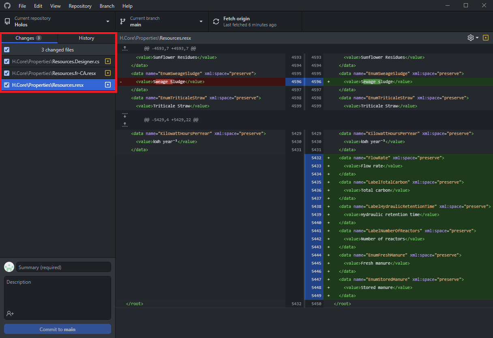
     
    <em>
		Figure 52 - GitHub Desktop, Pending changes
	</em>

- Ajoutez un commentaire et une description facultative pour cette validation. Cliquez ensuite sur `Valider` vers la branche principale.

    
     
    <em>
		Figure 53 - GitHub Desktop, Commit comment
	</em>

- Finalement, cliquez sur le bouton `Pousser l’origine` pour envoyer la validation vers le serveur distant.

    
     
    <em>
		Figure 54 - GitHub Desktop, Push origin
	</em>

 

# Configuration de FreeFileSync

[FreeFileSync](https://freefilesync.org/) est un logiciel de comparaison et de synchronisation de dossiers en source libres qui permet de synchroniser les fichiers entre deux dossiers dans votre ordinateur local. Le logiciel trouve les différences entre un dossier source et un dossier cible, et il permet aux utilisateurs de copier des fichiers en fonction de règles et de filtres prédéfinis.

Nous utilisons ce logiciel pour faciliter la copie des fichiers entre les dossiers de référenciel Holos Azure DevOps et GitHub dans nos ordinateurs locaux. Le référentiel Azure DevOps pour Holos contient des fichiers spécifiques qui ne sont pas présents dans le référentiel GitHub libre. Comme ces fichiers ne peuvent pas être libres, ils sont conservés dans un référentiel privé distinct.

La nature privée-publique de Holos et le fait de ne pouvoir rendre libre que certains aspects du logiciel nous obligent à conserver deux copies de Holos, et des fichiers précis doivent être synchronisés entre les deux copies en fonction de filtres prédéfinis.

FreeFileSync nous permet donc de faire ce qui suit:

* Synchroniser tous les fichiers créés dans l’un ou l’autre des référentiels.
* Définir les règles concernant les fichiers qui seront synchronisés entre les référentiels
* Traiter les modifications de fichiers un fichier à la fois pour nous assurer que les fichiers ne soient pas écrasés par erreur.

Le manuel et les documents FreeFileSync sont disponibles [ici](https://freefilesync.org/manual.php?topic=freefilesync).

Interface principale de FreeFileSync

    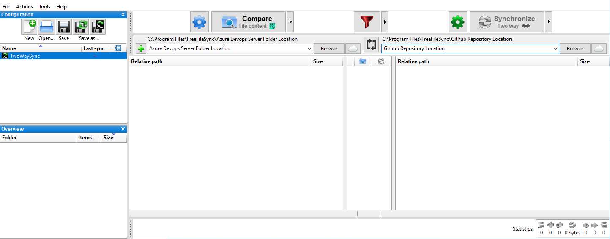
     
    <em>
		Figure 12 - FreeFileSync, Main interface
	</em>

    
     
    <em>
		Figure 13 - FreeFileSync, Écran de comparaison
	</em>

    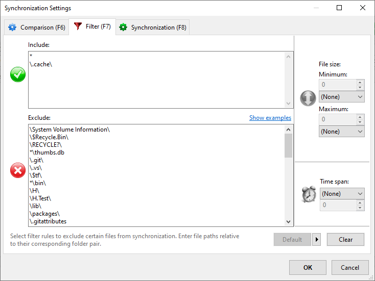
     
    <em>
		Figure 14 - FreeFileSync, Écran des filtres
	</em>

    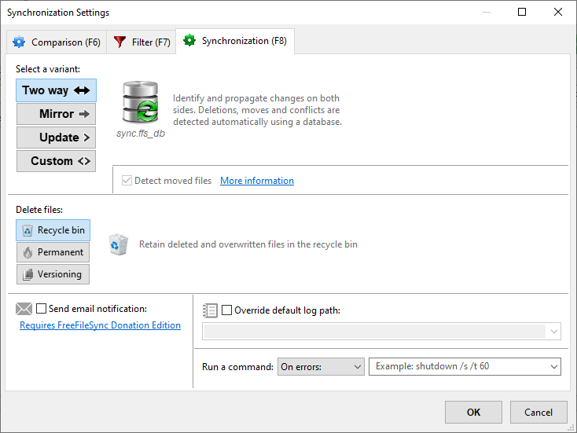
     
    <em>
		Figure 15 - FreeFileSync, Écran de synchronisation 
	</em>

 

Glissez et déposez le fichier "HolosSyncSettings.ffs_gui" dans FreeFileSync pour charger les filtres prédéfinis dans le logiciel.

Veuillez vous assurer de sélectionner les dossiers source et cible appropriés. Dans notre exemple, le panneau de gauche représente le dossier source (Azure DevOps) et le panneau de droite, le dossier cible (GitHub).

Dans le présent guide, nous utilisons le type de comparaison de fichiers **"Comparer le contenu des fichiers"**, et le type de synchronisation **"Synchronization bidirectionnelle"**. 

    
     
    <em>
		Figure 12-2 - FreeFileSync, main interface
	</em>

 

## Traitement des fichiers FreeFileSync : Les icônes et leur signification 

FreeFileSync utilise diverses icônes pour indiquer l’action qui sera faite par le processus de synchronisation.

* **Flèche verte** : Une flèche verte indique un fichier mis à jour dans le dossier cible (GitHub). Le sens de la flèche indique quel fichier sera mis à jour.

* **Flèche bleue** : Une flèche bleue indique un fichier mis à jour dans le dossier source (Azure DevOps). Le sens de la flèche indique quel fichier sera mis à jour.

* **Flèche verte avec signe "+"** : Une flèche verte avec un signe **'+'**" indique un nouveau fichier ajouté au dossier de destination (dans GitHub). Le sens de la flèche indique le dossier auquel le fichier sera ajouté. 

* **Flèche bleue avec signe "+"** : Une flèche bleue avec un signe **'+'** indique un nouveau fichier ajouté au dossier de source (dans Azure DevOps). Le sens de la flèche indique le dossier auquel le fichier sera ajouté.

* **Bac de recyclage avec trait rouge** : Un bac de recyclage vert avec un trait rouge indique un fichier supprimé dans le dossier de destination (GitHub). Le fichier précis qui est supprimé aura également une **'icône de fichier avec un tiret rouge'** à côté du nom du fichier.

* **Bac de recyclage avec trait rouge** : Une corbeille bleue avec un tiret rouge indique qu’un fichier est supprimé dans le dossier source (Azure DevOps). Le fichier précis qui est supprimé aura également une **'icône de fichier avec un tiret rouge'** à côté du nom du fichier.

* **Tiret en grisé** : Un tiret en grisé indique qu’aucune modification n’est apportée à un fichier.

* **Un signe '='** : Un signe **'='** indique que deux fichiers sont égaux. 

* **Signe '≠' ou signe d’éclair** : Un signe **'≠'** ou signe d’éclair indique que deux dossiers ne sont pas égaux et qu’il sont en conflit. Certaines mesures doivent être prises pour résoudre le conflit. Cela se produit habituellement lorsqu’un fichier est modifié et dans le dossier source et dans le dossier cible. Une façon rapide de résoudre ce conflit est de vous assurer d’avoir la dernière version du fichier à la fois dans GitHub et dans Azure DevOps (récupérer les modifications à distance dans chaque cas). On peut résoudre la plupart des conflits en récupérant les dernières versions du fichier de leurs sources respectives.

 

## Synchronisation entre Azure DevOps et GitHub

Pour synchroniser les modifications entre vos répertoires Azure DevOps et GitHub locaux, vous devrez utiliser la fonction de synchronisation des dossiers de FreeFileSync.

Des instructions sur la manière de paramétrer FreeFileSync sont [disponibles ici](#setting-up-freefilesync).

La première étape avant de démarrer le processus de synchronisation consiste à récupérer les modifications des serveurs distants de chaque service.

Vous trouverez ici des instructions sur la façon de récupérer les modifications [d’Azure DevOps](#retrait-des-modifications-depuis-le-référentiel-azure-devops).

Bien que des instructions sur la façon de récupérer les modifications de [GitHub soient disponibles ici](#retrait-des-modifications-depuis-github-à-l’aide-de-github-desktop).

après avoir récupéré les modifications de chaque serveur distant, ouvrez FreeFileSync. Dans FFS:

- Cliquez sur le bouton `Compare` pour comparer les modifications entre les deux dossiers locaux.
- Gérez le comportement de synchronisation des fichiers pour chaque fichier ou ensemble de fichiers. Les sections suivantes présentent diverses opérations et situations de synchronisation des fichiers.
- Appuyez sur le bouton `Synchroniser` pour synchroniser les modifications.

    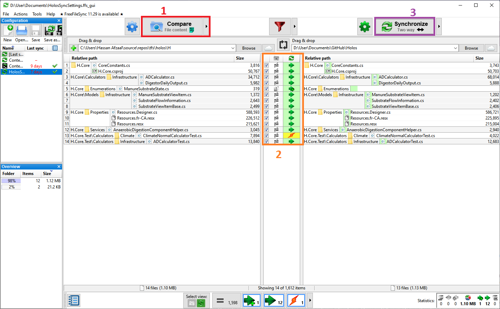
     
    <em>
		Figure 51 - FreeFileSync, Synchronizing changes of two local folders
	</em>

 
 

## Gestion de la création de fichiers

Cette section montre comment gérer la synchronisation entre les deux référentiels lors de la création d’un fichier.

 

### Création de fichiers dans Azure DevOps Server

1. Créez un nouveau fichier dans Visual Studio. Cette modification devrait apparaître dans la section **Modifications en attente**, dans la barre latérale droite de Team Explorer.

    
     
    <em>
		Figure 16 - Visual Studio, Creating new file for Azure DevOps Server
	</em>

2. Ouvrez FreeFileSync et cliquez sur **"Comparer"**. 

    
     
    <em>
		Figure 17 - FreeFileSync, Comparing directories
	</em>

3. Le fichier qui vient d’être créé dans Visual Studio devrait maintenant apparaître dans FreeFileSync.

    
     
    <em>
		Figure 18 - FreeFileSync, Comparing directories
	</em>

Notez la section marquée en rouge dans l’image ci-dessus. Cette section représente la direction dans laquelle les fichiers sont déplacés. Dans ce cas, le fichier sera copié de la source vers le référentiel cible.

4. Cliquez sur **Synchroniser** pour copier ce fichier dans le dossier cible.

    
     
    <em>
		Figure 19 - FreeFileSync, Synchronizing directories
	</em>

5. Une fenêtre contextuelle présentant le résumé des modifications s’affiche. Dans cet exemple, un fichier sera créé dans le dossier cible. Cliquez sur Démarrer pour lancer le processus de synchronisation. 

    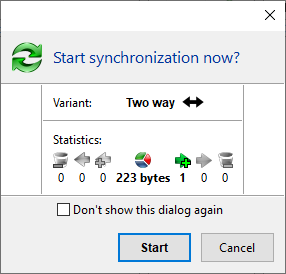
     
    <em>
		Figure 20 - FreeFileSync, Comparing directories
	</em>

6. Une fois le processus de synchronisation terminé, une nouvelle fenêtre contextuelle s’affiche et indique le journal et la progression globale.

    
     
    <em>
		Figure 21 - FreeFileSync, Successful synchronization
	</em>

7. Le fichier devrait maintenant apparaître dans l’outil Github Desktop; il peut être envoyé en ligne vers le référentiel GitHub.

    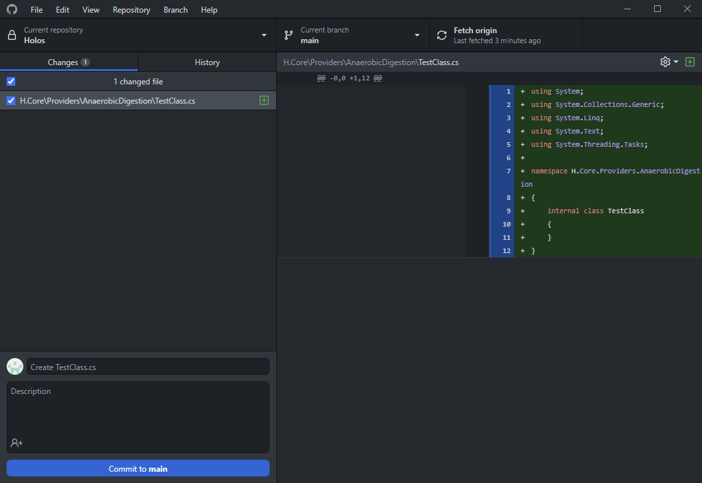
     
    <em>
		Figure 22 - Github Desktop, Created files appearing in Github Desktop
	</em>

 

### Création de fichiers dans GitHub

Le processus de création des fichiers fonctionne de la même façon pour les fichiers créés dans GitHub ou les nouveaux fichiers récupérés du référentiel GitHub en général.
 
1. Création de fichiers ou envoi de ceux-ci vers GitHub

    
     
    <em>
		Figure 23 - Creating a new file in GitHub
	</em>

2. Dans votre client local Github Desktop, cliquez sur Extraire l’origine pour récupérer les modifications.

    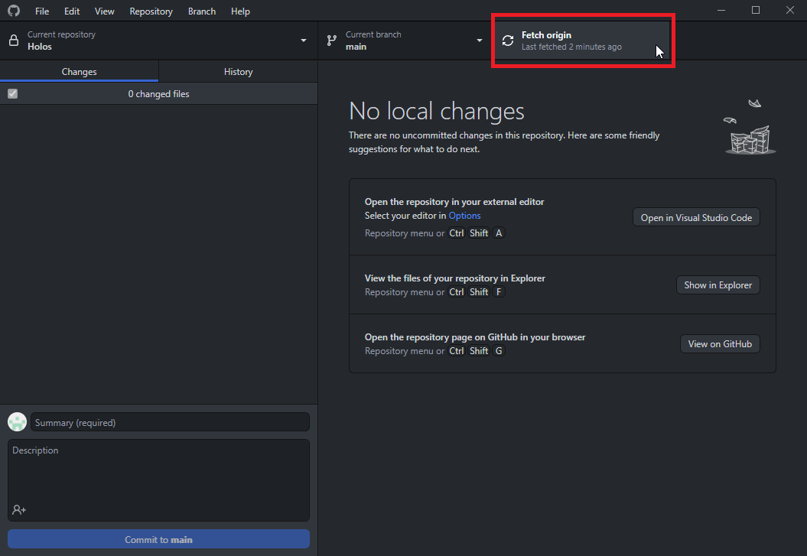
     
    <em>
		Figure 24 - GitHub Desktop, Fetch Origin
	</em>

3. Ensuite, cliquez sur **Récupérer l’origine** pour récupérer les modifications apportées dans l’ordinateur local.

    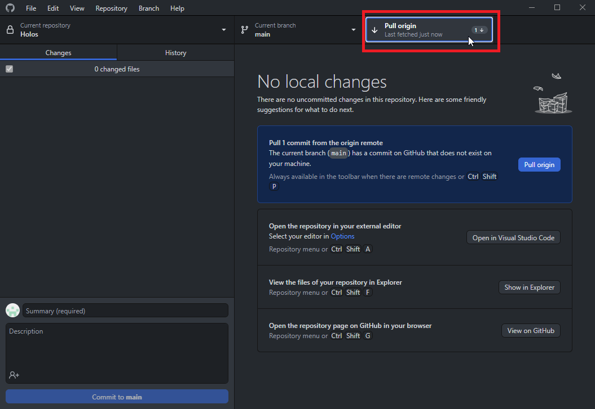
     
    <em>
		Figure 25 - GitHub Desktop, Pull Origin
	</em>

4. Ouvrez FreeFileSync et cliquez sur Comparer. Le nouveau fichier devrait maintenant apparaître dans la fenêtre.

    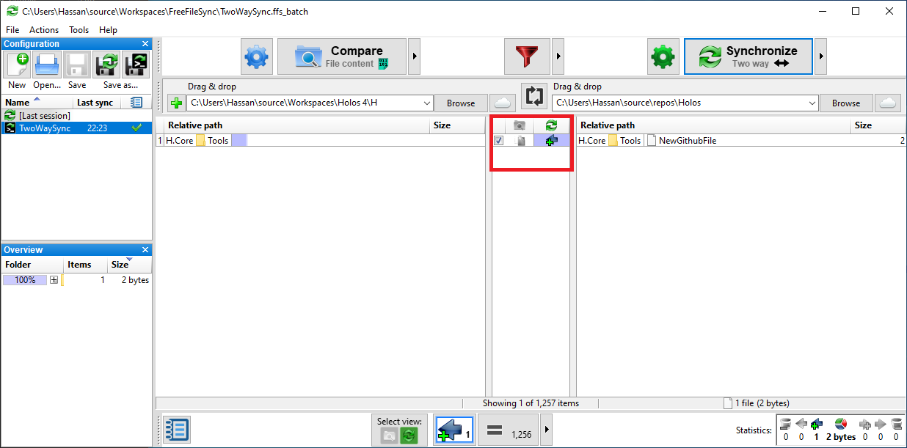
     
    <em>
		Figure 26 - FreeFileSync, Comparing directories
	</em>

Remarquez l’icône de synchronisation des fichiers marquée en rouge dans l’image ci-dessus. Contrairement à ce qu’on voyait dans l’exemple de la section précédente, dans le présent exemple, **on voit une flèche pointant vers la gauche**. Elle représente une opération de synchronisation entre le dossier cible et le dossier source.

 

Si un fichier est créé à l’extérieur de Visual Studio, il ne s’affiche pas directement dans la section **Modifications en attente** du logiciel. Un tel fichier doit être ajouté et envoyé manuellement à Azure DevOps.
 
5. Ouvrez Visual Studio et regardez sous la section **"Modifications exclues"**. Visual Studio devrait détecter qu’un fichier est ajouté à l’espace de travail local. Cliquez sur le texte **Détecté**.

    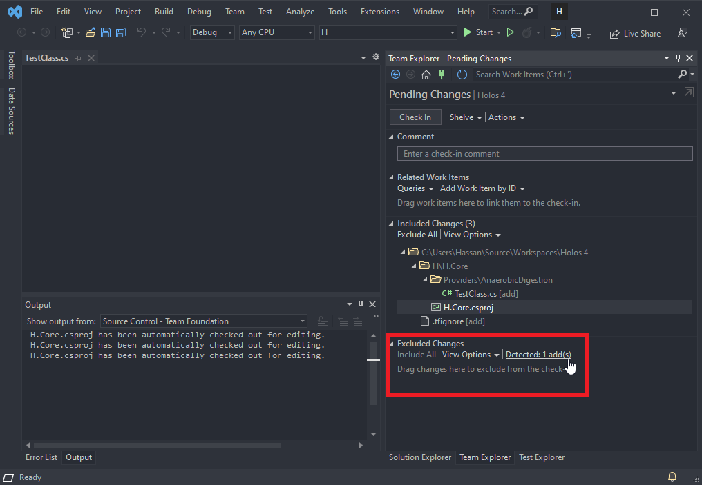
     
    <em>
		Figure 27 - Visual Studio, Adding files to Visual Studios Pending Changes
	</em>

6. Sélectionnez le fichier qui vient d’être copié et cliquez sur **Promouvoir**.

    
     
    <em>
		Figure 28 - Promoting pending changes
	</em>

7. Le dossier devrait maintenant s’afficher dans la section Modifications incluses des **Modifications en attente**.

    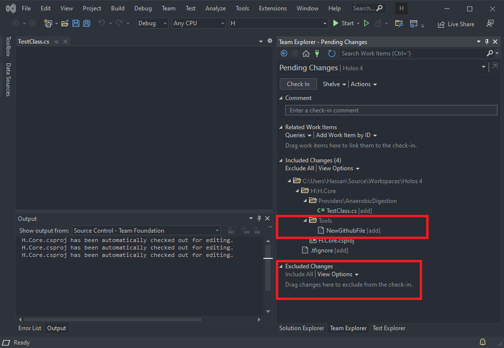
     
    <em>
		Figure 29 - Visual Studio, Included changes
	</em>

 
 

## Gestion de la suppression des fichiers

La suppression des fichiers est traitée de façon presque identique à la création des fichiers. Suivez les mêmes étapes que celles de la création de fichiers pour chacun des référentiels.

 

### Suppression de fichiers dans Azure DevOps Server

1. Supprimez tous les fichiers dans Visual Studio.

2. Ouvrez FreeFileSync et cliquez sur **Comparer**.

    
     
    <em>
		Figure 30 - FreeFileSync, Comparing directories for deleted Visual Studio files
	</em>

3. FreeFileSync affiche tous les fichiers qui ont été supprimés au moyen de Visual Studio. Un fichier supprimé est indiqué par une icône spécifique, comme dans l’image ci-dessus.

Étant donné que Visual Studio a supprimé le fichier dans le dossier source, le processus de synchronisation supprimera le fichier dans le dossier cible. FreeFileSync affiche ensuite une icône de suppression du côté où le fichier est supprimé. Dans le présent exemple, l’icône se trouve sur le côté droit.

 
 

### Suppression de fichiers dans GitHub

1. Supprimez tous les fichiers dans le référentiel GitHub.

2. Ouvrez FreeFileSync et cliquez sur **Comparer**.

    
     
    <em>
		Figure 31 - FreeFileSync, Comparing directories for deleted GitHub files 
	</em>

3. FreeFileSync affiche tous les fichiers qui ont été supprimés au moyen de GitHub. La suppression d’un fichier est indiquée par une icône spécifique, comme dans l’image ci-dessus.

Comme le fichier a été supprimé par GitHub dans le dossier cible, le processus de synchronisation supprime le fichier dans le dossier source. FreeFileSync affiche ensuite une icône de suppression du côté où le fichier est supprimé. Dans le présent exemple, l’icône se trouve sur le côté gauche.

 
 

## Gestion des conflits de fichiers et modifications apportées au code

Des conflits de fichiers peuvent survenir lorsqu’un fichier dans l’un des deux référentiels est modifié. Il peut s’agir d’un fichier modifié dans Visual Studio ou de fichiers dont les modifications ont été transmises dans le référentiel GitHub. FreeFileSync permet à l’utilisateur de gérer les modifications de fichiers sur une base individuelle afin que les conflits n’aient pas préséance sur les fichiers sans avis à l’utilisateur.

 
 

### Modification des fichiers dans Visual Studio

Dans cet exemple, le nom d’un fichier est modifié dans Visual studio et toutes les références de ce fichier sont modifiées dans l’ensemble du référentiel Azure DevOps.

    
     
    <em>
		Figure 32 - FreeFileSync, Comparing directories after editing file name
	</em>

1. Cliquez sur le bouton Compare, dans FreeFileSync, pour visualiser tous les fichiers modifiés.

2. La façon dont chaque fichier est géré peut être vue rapidement dans le panneau central affichant diverses icônes.

 
 

### Modification des fichiers dans GitHub

Dans cet exemple, un certain nombre de fichiers sont modifiés dans GitHub et les fichiers modifiés sont poussés dans le répertoire local GitHub.

    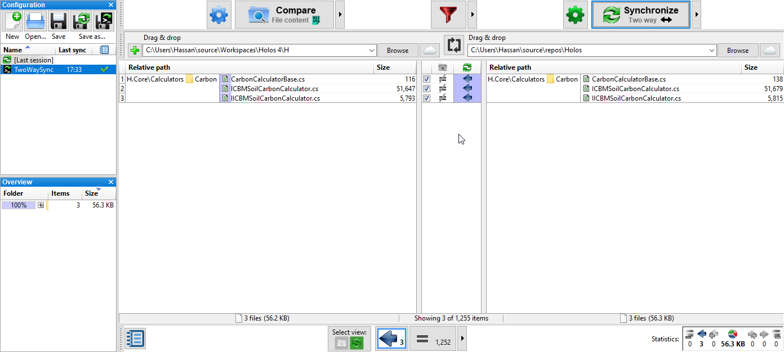
     
    <em>
		Figure 33 - FreeFileSync, Viewing changed GitHub files
	</em>

1. Cliquez sur le bouton Compare, dans FreeFileSync, pour visualiser tous les fichiers modifiés.

2. La façon dont chaque fichier est géré peut être vue rapidement dans le panneau central affichant diverses icônes.

3. L’icône bleue indique que les fichiers du dossier source seront modifiés.

4. Cliquez sur Synchronisé pour synchroniser les modifications.

    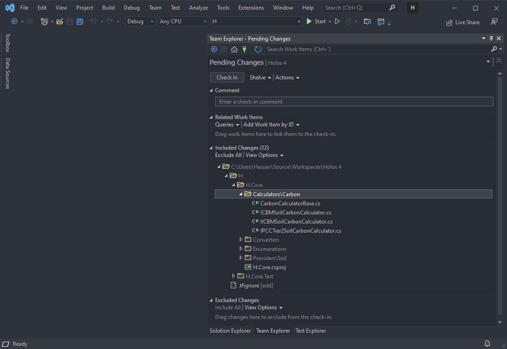
     
    <em>
		Figure 34 - Visual Studio, Pending Changes
	</em>

5. Ces fichiers devraient maintenant apparaître dans Visual Studio, dans la section **Modifications en attente**.

 
 

