# Table of Content
- [Table of Content](#table-of-content)
- [The source control and workflow process](#the-source-control-and-workflow-process)
- [Using Azure Devops](#using-azure-devops)
  - [Cloning Holos repository from Azure DevOps Server](#cloning-holos-repository-from-azure-devops-server)
  - [Submitting changes to Azure Devops](#submitting-changes-to-azure-devops)
    - [Pull changes from remote Azure DevOps repository](#pull-changes-from-remote-azure-devops-repository)
    - [Commit changes to remote repository and associate work items](#commit-changes-to-remote-repository-and-associate-work-items)
- [Using GitHub / GitHub Desktop](#using-github--github-desktop)
  - [Cloning Holos repository from Github](#cloning-holos-repository-from-github)
  - [Pulling Changes from GitHub using GitHub Desktop](#pulling-changes-from-github-using-github-desktop)
  - [Pushing changes to GitHub using GitHub Desktop](#pushing-changes-to-github-using-github-desktop)
- [Setting up FreeFileSync](#setting-up-freefilesync)
  - [FreeFileSync File Processing : Icons and their meaning](#freefilesync-file-processing--icons-and-their-meaning)
  - [Sync between Azure DevOps and GitHub](#sync-between-azure-devops-and-github)
  - [Handling file creation](#handling-file-creation)
    - [File creation in Azure Devops Server](#file-creation-in-azure-devops-server)
    - [File creation in Github](#file-creation-in-github)
  - [Handling file deletion](#handling-file-deletion)
    - [File deletions in Azure Devops Server](#file-deletions-in-azure-devops-server)
    - [File deletions in Github](#file-deletions-in-github)
  - [Handling file conflicts and code changes](#handling-file-conflicts-and-code-changes)
    - [File changes in Visual Studio](#file-changes-in-visual-studio)
    - [File changes in Github](#file-changes-in-github)

    
 
 

# The source control and workflow process

Holos' development workflow uses Azure DevOps and GitHub for source control purposes. Azure DevOps is used for private development work, while the public-facing open-source code is available on GitHub. This division exists because Holos uses Telerik UI for WPF controls, and these UI elements cannot be open-sourced due to licensing limitations. Therefore, GitHub is used to publish Holos' non-UI code and elements, while the complete repository is hosted on Azure DevOps, where the development work occurs.

To make the sync process between these two platforms easier, we use a program called FreeFileSync that syncs files on your local drive between the two repository folders by following various file rules and settings. The development workflow can then be divided into these steps:

1. Maintain two local repositories, one for [Azure DevOps](#cloning-holos-repository-from-azure-devops-server) and the other for [GitHub](#cloning-holos-repository-from-github).
2. Perform all development work on the Azure DevOps repository.
3. [Push these changes to Azure DevOps for source control](#submitting-changes-to-azure-devops). 
4. [Use FreeFileSync to sync your Azure DevOps local repository with the GitHub local repository](#sync-between-azure-devops-and-github).
5. [After the sync process is completed, push these changes to GitHub using GitHub desktop](#pushing-changes-to-github-using-github-desktop). FreeFileSync's configuration file is set up to ignore all UI-related files, so changes pushed to GitHub will only contain files that can be open-sourced.

 
 

# Using Azure Devops

Azure DevOps is a version and source control platform similar to GitHub. This platform is where most of the development work on Holos takes place, and the Azure DevOps repository is not publicly accessible. We use Visual Studio (2019/2022) to interact with and change this repository.

The first step to start development work is to create a local copy of the Azure DevOps repository on your machine.

## Cloning Holos repository from Azure DevOps Server

To clone the Holos repository from Azure DevOps Server, we will use Visual Studio. This process is similar for both the 2019 and 2022 versions of Visual Studio.

 

1. Start visual studio and click on "Clone Repository."

    

 

2. Select a "**Path**" location for where you want to store the repository locally. After selecting your path, click on "Azure DevOps.”

    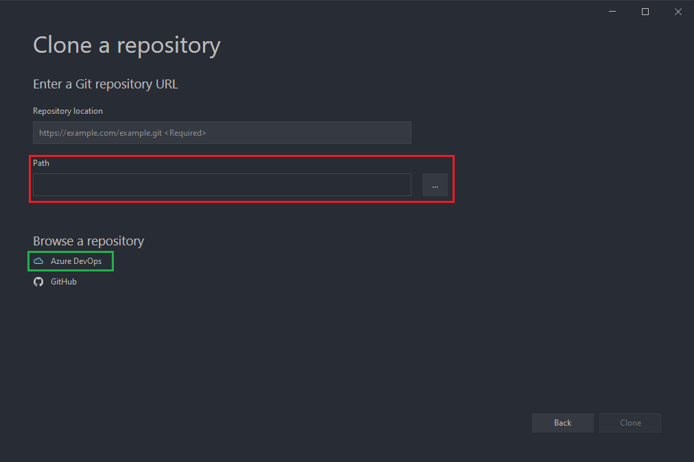

 

3. In the new window that shows up, select "**Holos 4**" and click on "**Connect**".

    

 

4. After Visual Studio connects to the online repository. You will be presented with a few option in the "**Team Explorer**" settings pane on the right side.

* Click on "**Source Control Explorer**" in the right settings pane.
* A new tab will open for source control explorer.
* In this new tab, right click on "**Holos 4**" and select "**Get Latest Version**".

    

Visual studio will now copy the online repository to your local machine.

    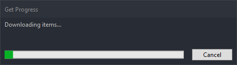

 

5. You should now see a new "**Solutions**" section in the Team Explorer sidebar menu. Right click the "H.sln" file and open it.

    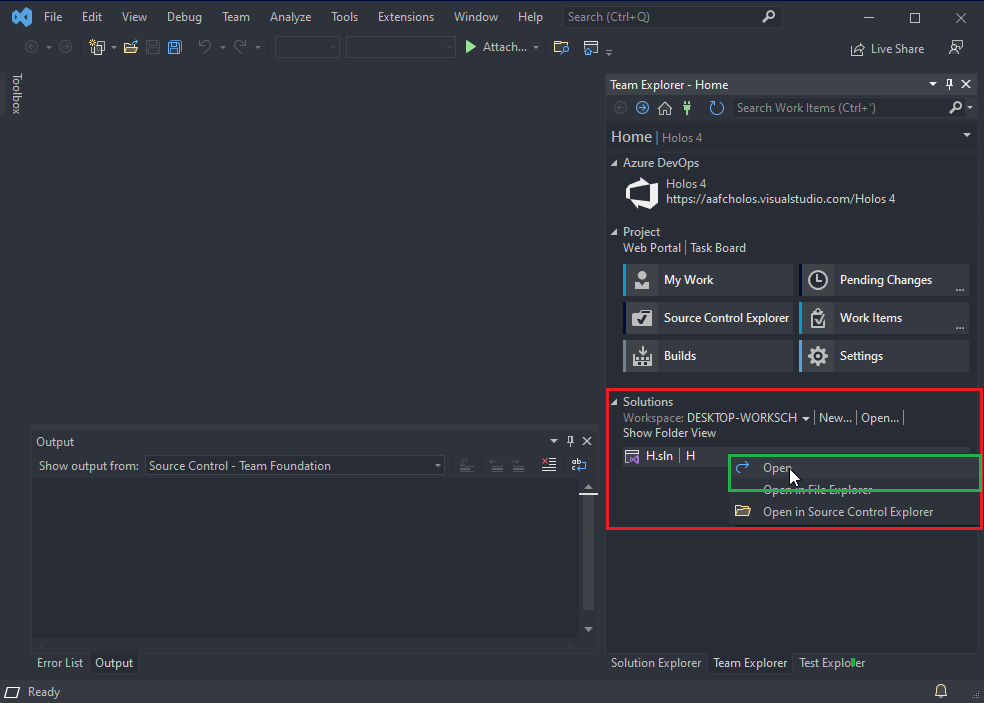

 

6. The code should now be visible under the "**Solution Explorer**" right sidebar section.

 
 

Now that you've copied the remote repository to your local machine, you are able to make and submit changes as needed.

## Submitting changes to Azure Devops

### Pull changes from remote Azure DevOps repository

Before pushing any changes to Azure DevOps, pull changes from the remote server and get the latest versions of each file. This allows us to ensure that we're working with the latest version of each file and to resolve any merge conflicts.

To get the latest version of the repository, right click the solution file and select `Get Latest Version (Recursive)`

    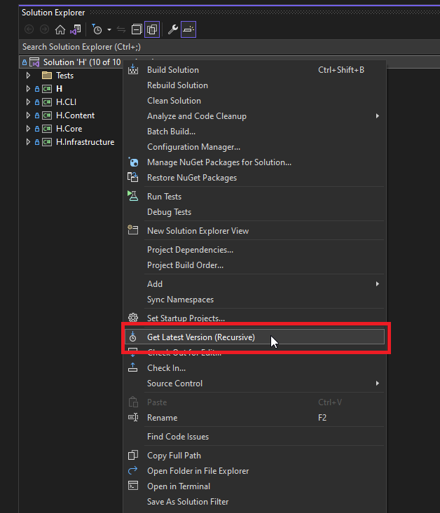

The files that are updated will appear in the `Output` window. This can be accessed by clicking `View -> Output`. If you have the latest version of all files a message saying "**All files are up to date**" will appear.

    

 
 

### Commit changes to remote repository and associate work items

- Changes can be committed to Azure DevOps by going to the `Team Explorer` tab in Visual Studio. Click on `Pending Changes` to view the files that have been edited and are waiting to be pushed.

    

- If you are resolving a work item or a bug, get the ID of that bug and enter it under the `Related Work Items` section by clicking `Add Work Item by ID.`

- To look at the differences between the local and remote files, right-click the file and then click on `Compare with latest version.`
  - This allows you to confirm the changes made to a specific file before pushing it to the remote server.

- Finally, to push changes, write a comment for your change and click on `Check 

 
 

A message should pop-up asking you for confirmation to associate work items and push these changes. Select "Yes" to confirm.

    

 
 

# Using GitHub / GitHub Desktop

## Cloning Holos repository from Github

 

1. Download the Github Desktop tool from [here](https://desktop.github.com/).

 

2. Open the tool and select "**Clone a repository from the Internet**".

    

 

3. In the new window that pops up, click on the "URL" tab. Then enter your github repository's HTTPS web url and select a local path where the repository will be downloaded.

    

    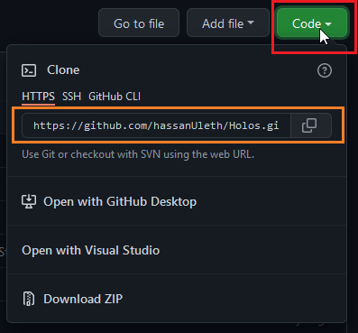

 

Github will now create a local repository in the location specified.

    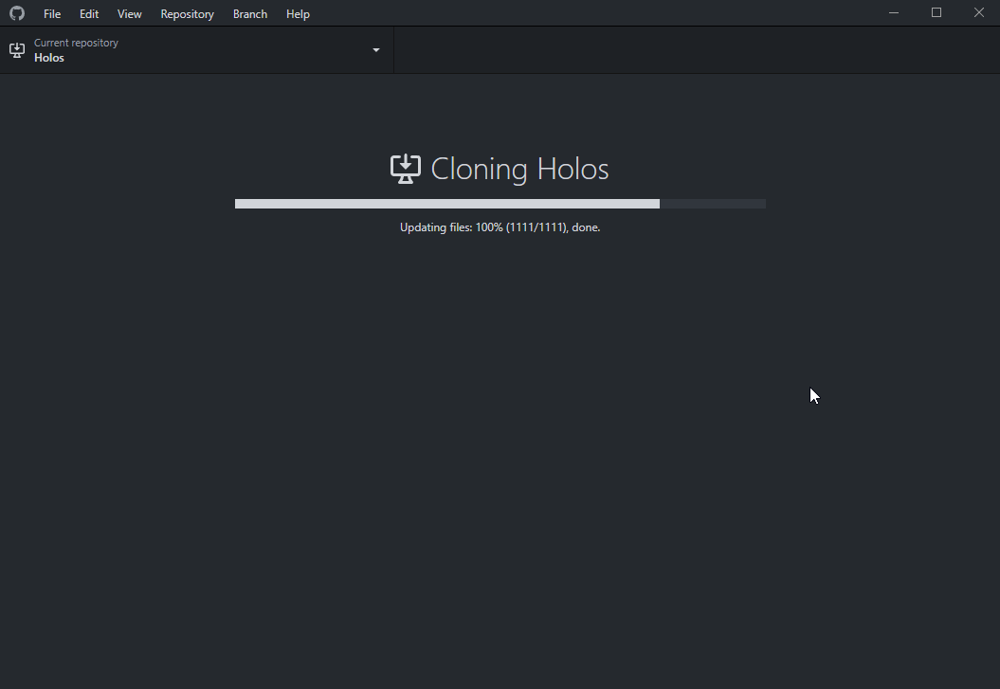

    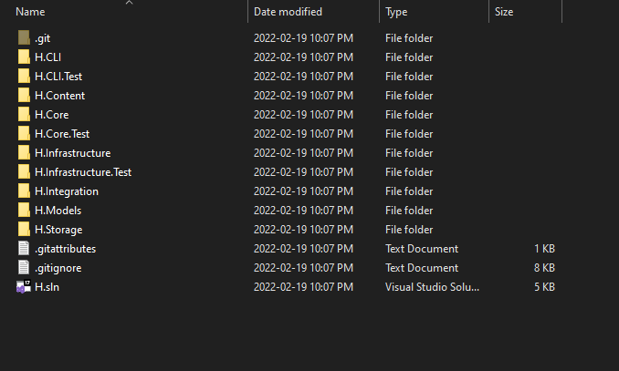

 
 

## Pulling Changes from GitHub using GitHub Desktop

Open GitHub desktop and make sure that your current repository is set properly to `holos-aafc/Holos`.

    

Then click the `Fetch Origin` button to check if any changes are available to pull. 

    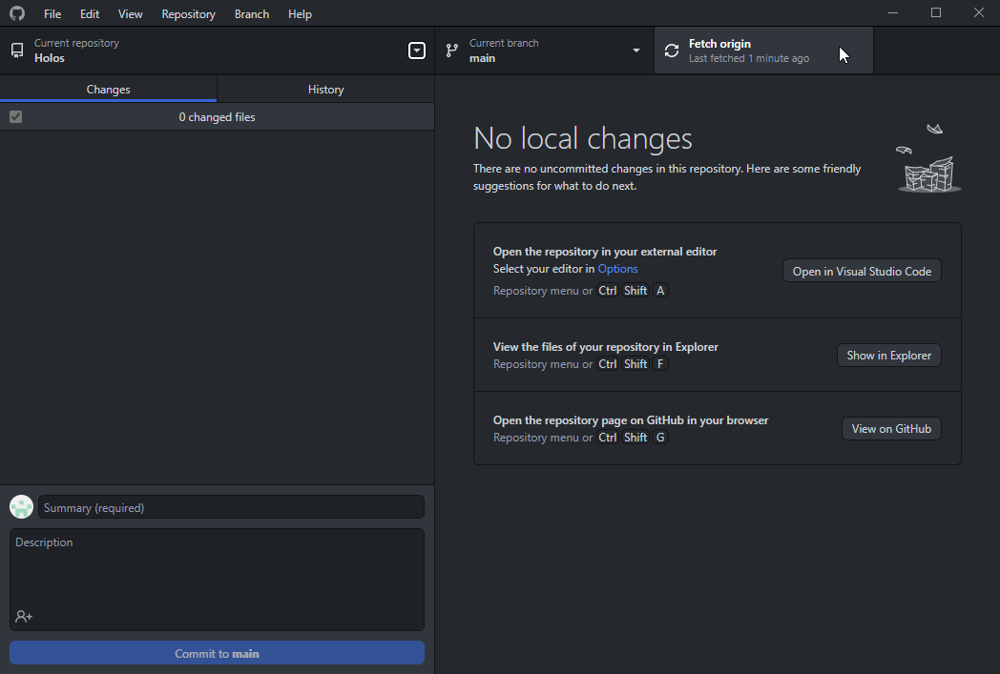

If some changes are available, you'll see a number denoting the amount of changes that need to be pulled and the previous fetch origins button will now say `Pull Origin`.

    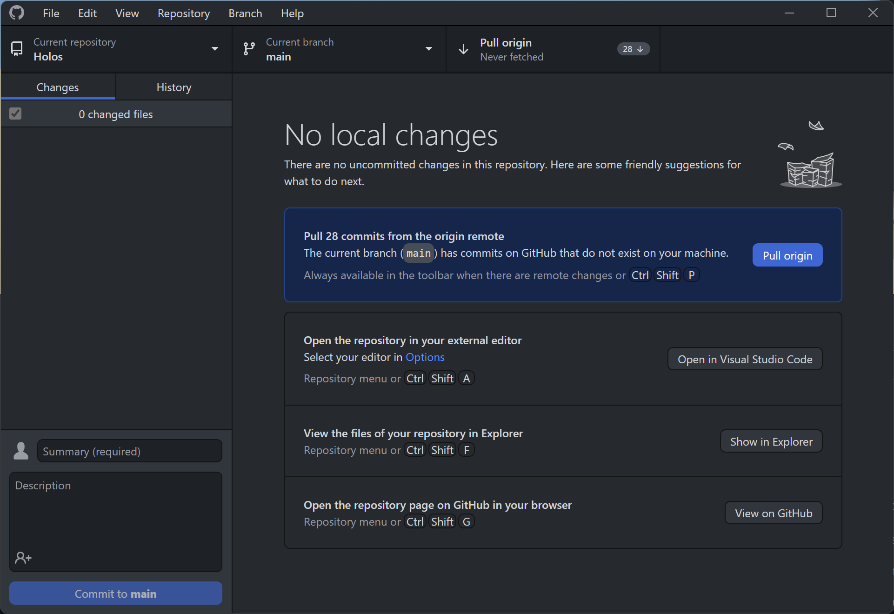

Click the `pull origin` button to pull changes from the remote GitHub repository to your local folder.

 

## Pushing changes to GitHub using GitHub Desktop

- After syncing your folders using FreeFileSync, open GitHub. On the left side, you'll see a list of files ready to be added to the next commit. Review changes and files as needed.

    

- Add a comment and an optional description for this commit. Then click on `commit to main`.

    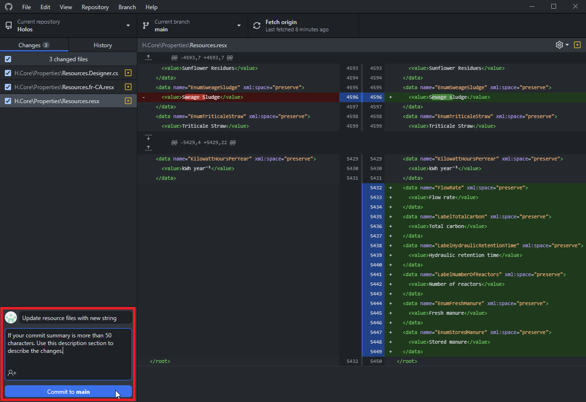

- Finally, click the `Push Origin` button to push the commit to the remote server.

    

 

# Setting up FreeFileSync

[FreeFileSync](https://freefilesync.org/) is an open-source folder comparison and synchronization software that allows files to be synced between two folders on your local machine. The software finds the differences between a source and target folder and allows users to copy files based on pre-defined rules and filters.

We use this software to help copy files between the Holos Azure DevOps and Github repository folders on our local machines. The Azure DevOps repository for Holos contains specific files not present in the open-source GitHub repository. As these files cannot be open-sourced, they are maintained in a separate private repository.

This private-public nature of Holos and the limitation of only being able to open source certain aspects of the software create a situation where we have to maintain two copies of Holos, and specific files need to be synced between the two copies based on pre-defined filters.

FreeFileSync, therefore, allows us to:

* Sync all files created in either repository.
* Define rules regarding which files are synced between the repositories.
* Handle file changes on a per-file basis to ensure that files are not overwritten by mistake.

The documentation/manual for FreeFileSync is available [here.](https://freefilesync.org/manual.php?topic=freefilesync)

The main interface of FreeFileSync

    

The comparison screen

    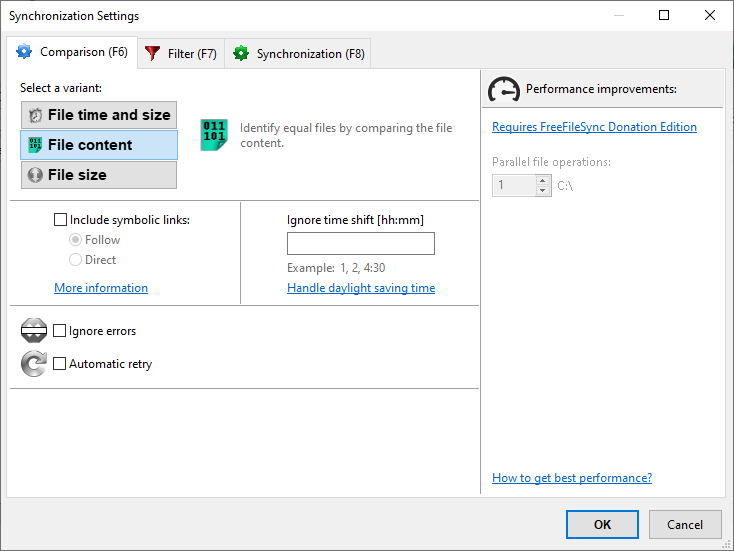

The filters screen

    

The synchronization screen

    

 

Drag and drop the "HolosSyncSettings.ffs_gui" inside FreeFileSync to load the pre-defined filters into the software.

Please make sure that you select the appropriate folders for the source and target. In this example, the panel on the left represents the source folder (Azure Devops), and the panel on the right represents the target folder (Github).

For this guide, we will use "**Compare File Content**" as the file comparison type and "**Two Way Synchronization**" as the synchronization type.

    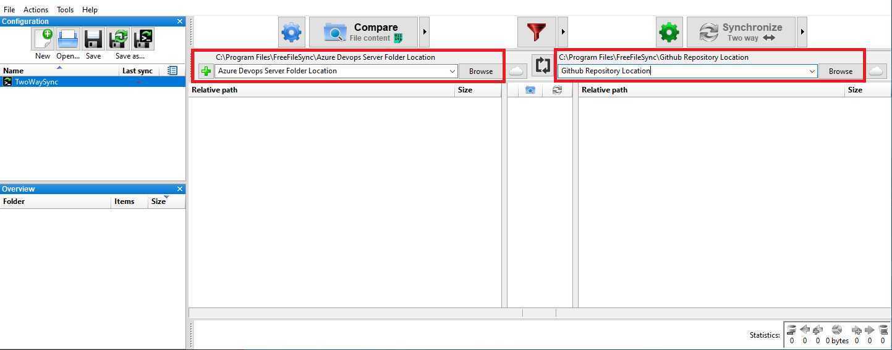

 

## FreeFileSync File Processing : Icons and their meaning

FreeFileSync uses various icons to indicate the action the synchronization process will perform.

* **Green Arrow** : A green arrow indicates a file being updated in the target folder (GitHub). The direction of the arrow shows which file will be updated.

* **Blue Arrow** : A blue arrow indicates a file being updated in the source folder (Azure DevOps). The direction of the arrow shows which file will be updated.

* **Green Arrow with Plus Sign** : A green arrow with a plus sign indicates a new file being added to the destination folder (on Github). The direction of the arrow shows which folder this file will be added to.

* **Blue Arrow with Plus Sign** : A blue arrow with a plus sign indicates a new file being added in the source folder (Azure DevOps). The direction of the arrow shows which folder this file will be added to.

* **Recycle Bin with Red Dash** : A green recycle bin with a red dash indicates a file being deleted in the destination folder (GitHub). The specific file that is being deleted will also have a '**File Icon with a Red Dash**" icon next to the file name.

* **Recycle Bin with Red Dash** : A blue recycle bin with a red dash indicates a file being deleted in the source folder (Azure DevOps). The specific file that is being deleted will also have a '**File Icon with a Red Dash**" icon next to the file name.

* **A Grayed out Dash** : A grayed-out dash indicates no change is occurring with a file.

* **An Equal Sign** : Indicates that two files are equal

* **A Not Equal Sign or Lightning Bolt Sign** : Indicates that two files are not equal and a conflict exists. Some action needs to be taken to resolve the conflict. This usually happens when a file is edited in both the source and destination folders. A quick way to resolve this conflict is to ensure you have the latest version of the file in both GitHub and Azure DevOps (pull changes from remote in each). Most conflicts are resolved by pulling the latest file version from their respective sources.

 

## Sync between Azure DevOps and GitHub

To sync changes between your local Azure DevOps and GitHub repositories, you will need to use FreeFileSync's folder sync feature.

Instructions on how to set up FreeFileSync are [available here.](#setting-up-freefilesync)

The first step before you start the sync process is to pull changes from the remote servers of each service. 

Instructions on how to pull changes from [Azure DevOps are available here.](#pull-changes-from-remote-azure-devops-repository)

While instructions on how to pull changes from [GitHub are available here](#pulling-changes-from-github-using-github-desktop)

After pulling changes from each remote server, open FreeFileSync. In FFS:

- Click the `Compare` button to compare changes between the two local folders.
- Handle the file sync behaviour for each file or set of files. The following sections go through various file sync operations and situations.
- Press the `Synchronize` button to sync changes.

    

 
 

## Handling file creation

This section shows how to handle synchronization between the two repositories when creating a new file.

 

### File creation in Azure Devops Server

1. Create a new file inside Visual Studio. This change should appear in the **Pending Changes** section of the Team Explorer right sidebar.

    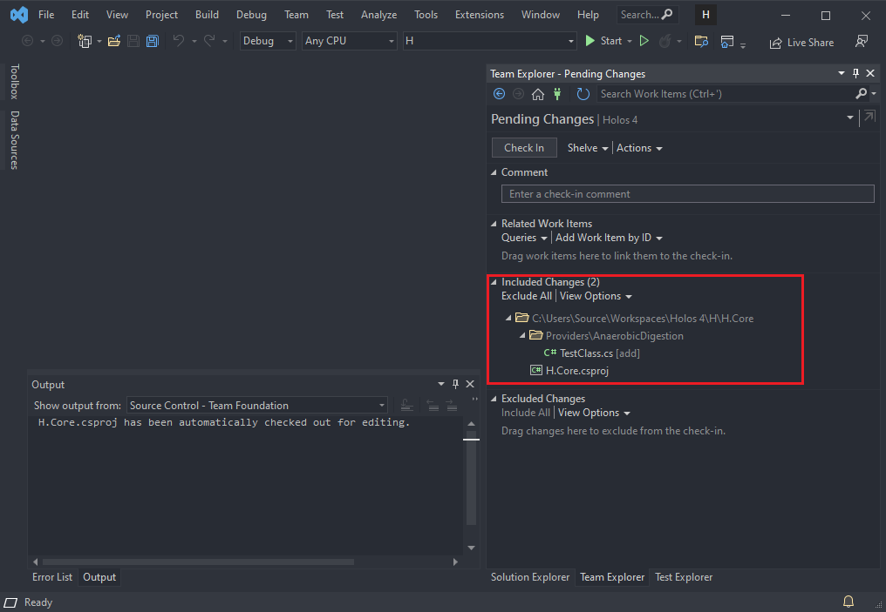

2. Open FreeFileSync and click on "**Compare**".

    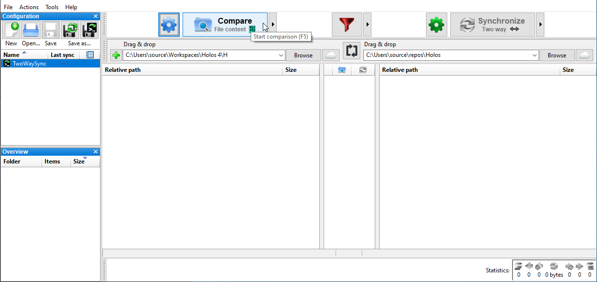

3. That file that was just created in visual studio should now appear in FreeFileSync.

    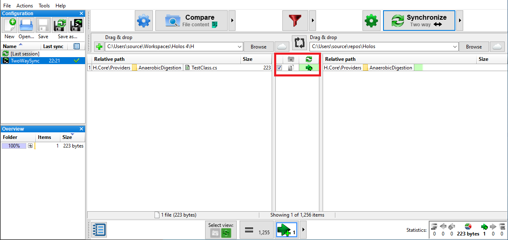

Note the section that is marked red in the above image. This section represents the direction the files are moving. In this case, the file is going to be copied from the source to the target directory.

4. Click on **synchronize** to copy this file to the target folder.

    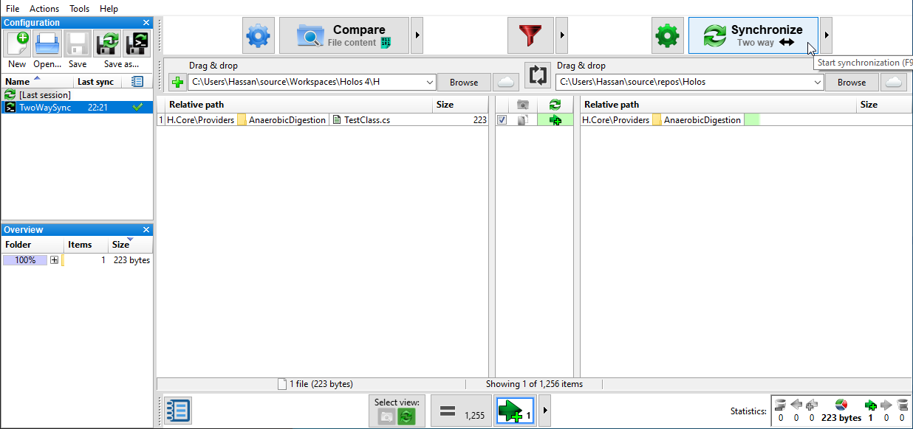

5. A pop-op will now appear showing the summary of the changes. In this example, one file will be created in the target folder. Click on start to begin the synchronization process.

    

6. After the sync process finishes, a new pop-up will appear showing the log and the overall progress.

    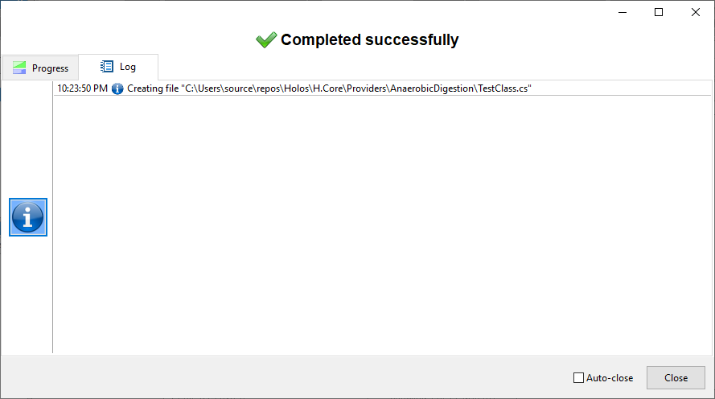

7. The file should now appear in the Github Desktop tool and can be pushed online to the github repository.

    

 

### File creation in Github

The file creation process works similarly for files created on Github or new files pulled from the Github repository in general.
 
1. Create or push files to Github.

    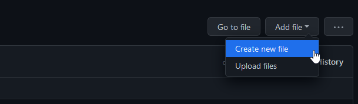

2. In your local Github Desktop client, click on Fetch Origin to fetch the changes.

    

3. After that click on **Pull Origin** to pull the changes to the local machine.

    

4. Open FreeFileSync and click on Compare. The new file should now appear in the window.

    

Notice the file sync icon marked red in the image above. Unlike the example in the previous section, in this example, you can **notice an arrow pointing left**. This shows a sync operation from the target to the source folder.

 
If a file is created outside of Visual Studio, it does not directly appear in the "Pending Changes" section of the software. These files need to be manually added and pushed to Azure DevOps.
 
5. Open Visual Studio and look under the "**Excluded Changes section**". Visual Studio should detect a file being added to the local workspace. Click on the "**Detected**" text.

    

6. Select the file that was just copied over and click on **Promote**.

    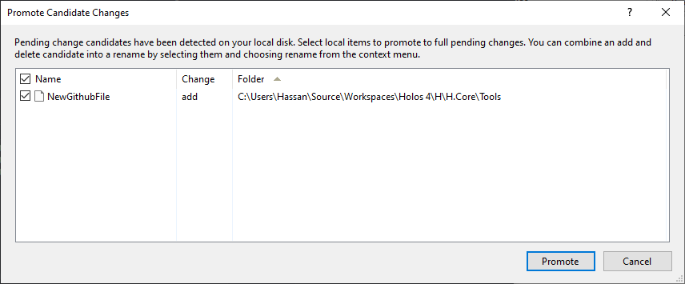

7. The file should now appear under the **Included Changes** section of **Pending Changes**.

    

 
 

## Handling file deletion

File deletion are handled almost identically to file creation. Follow the same steps as outlined under file creation for each of the repositories.

 

### File deletions in Azure Devops Server  

1. Delete any files in Visual Studio.

2. Open FreeFileSync and click on **Compare**.

    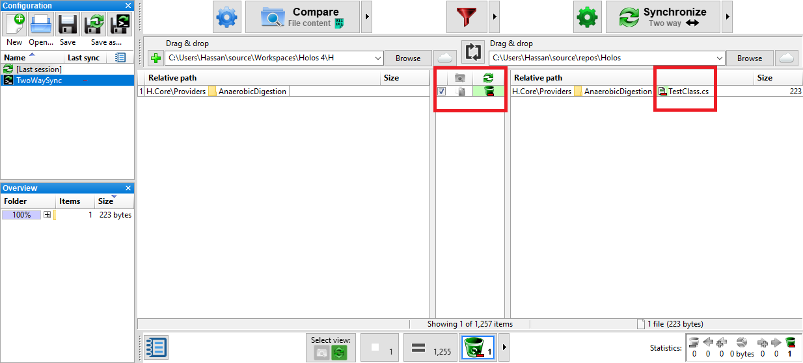

3. FreeFileSync will display all files that were deleted through visual studio. A deleted file is indicated by a specific icon, as shown in the image above. 

As Visual Studio deleted the file in the source folder, the sync process will delete the file in the target folder. FreeFileSync will then show a deletion icon on the side where the file is being deleted. In this example, the icon is on the right side.

 
 

### File deletions in Github

1. Delete any files in the Github repository.

2. Open FreeFileSync and click on **Compare**.

    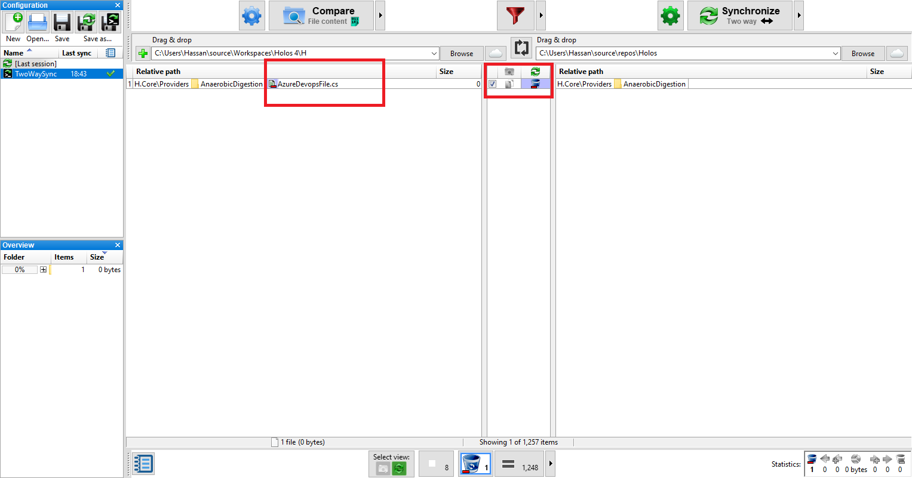

3. FreeFileSync will display all files that were deleted through github. A deleted file is indicated by a specific icon, as shown in the image above. 

As the file was deleted by github in the target folder, the sync process will delete the file in the source folder. FreeFileSync will then show a deletion icon in the side where the file is being deleted. In this example, the icon is on the left side.

 
 

## Handling file conflicts and code changes

File conflicts can occur when a file in either directory is changed. This can be in the form of editing a file on visual studio or pulling changes to files in the github repository. FreeFileSync allows the user to handle file changes on an individual basis so that any conflicts do not override files without notifying the user.

 
 

### File changes in Visual Studio

In this example a file's name is changed in visual studio and all references of that file is edited throughout the Azure Devops repository.

    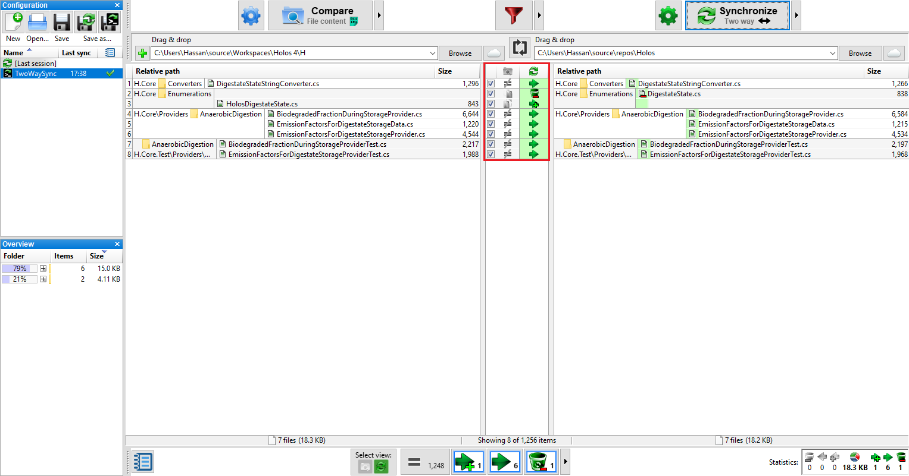

1. Click on the Compare button in FreeFileSync to display all the edited files.

2. How each file is handled can be quickly seen through the center panel displaying various icons.

 
 

### File changes in Github

In this example a number of files are changed in github and the changed files are pulled into the local github repository.

    

1. Click on the Compare button in FreeFileSync to display all the edited files.

2. How each file is handled can be quickly seen through the center panel displaying various icons.

3. The blue icon indicates that files in the source folder will be changed.

4. Click on synchronized to sync the changes.

    

5. These files should now appear in Visual Studio in the **Pending Changes** section.

 
 

