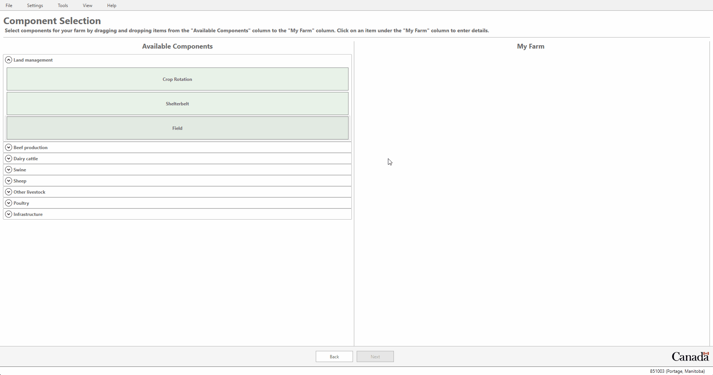
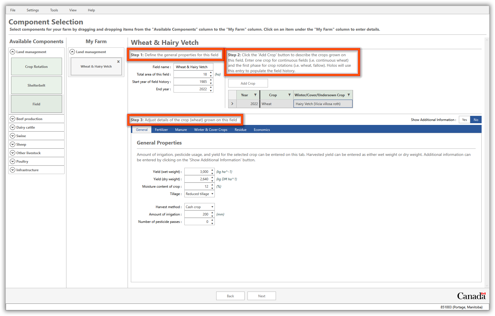
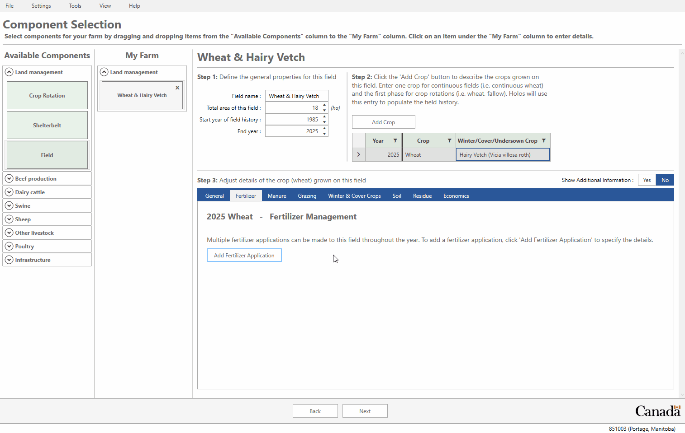
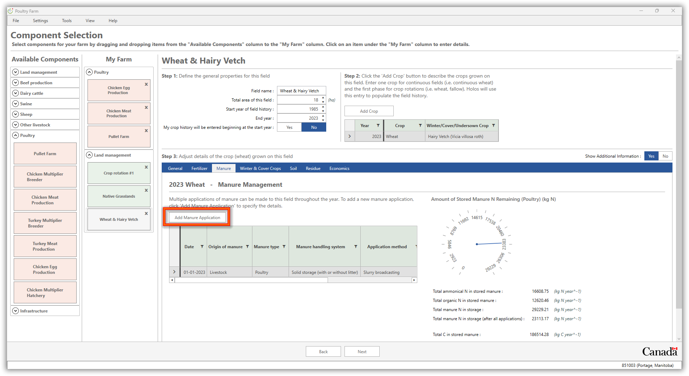
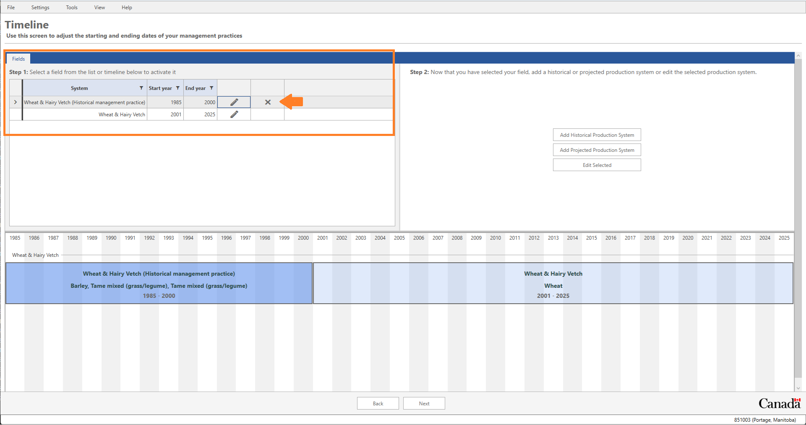
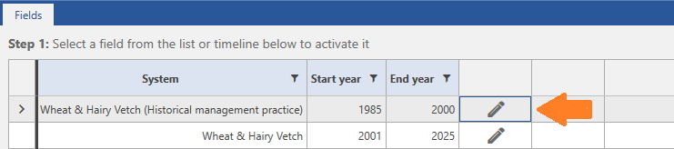
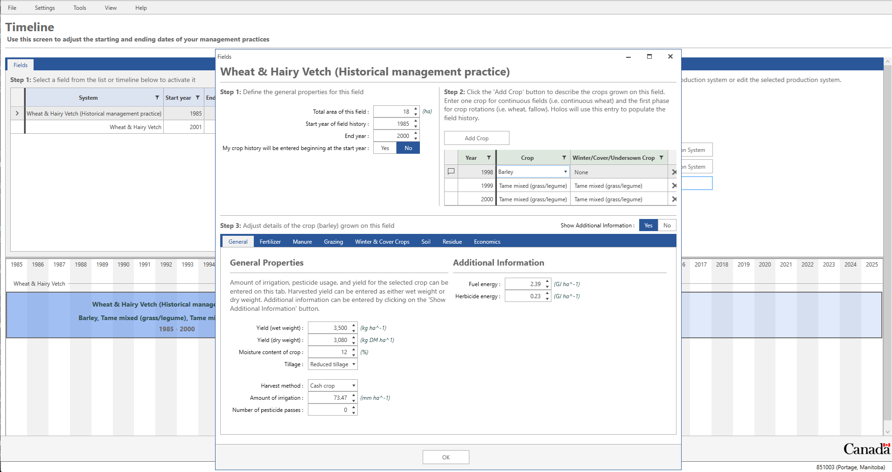
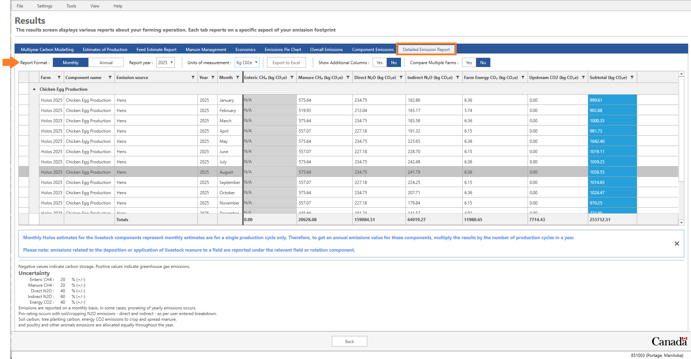
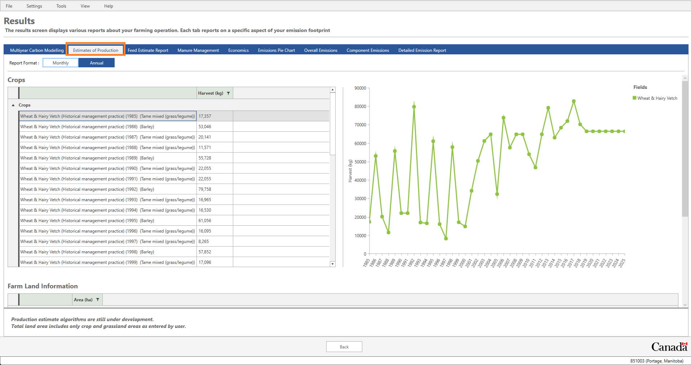
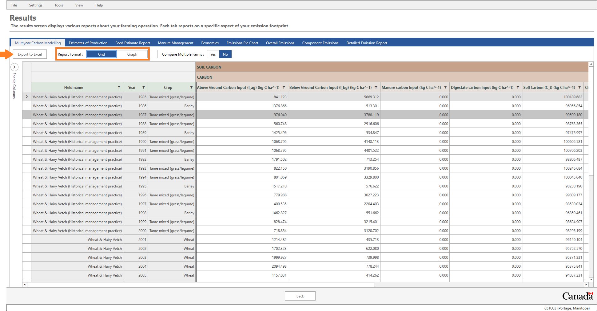

 
     

The purpose of this document is to provide an introduction on how to use the Holos model (version 4) and the required vs. optional inputs.

For the purpose of this training, we are going to create a farm that has an annual poultry production system (including both meat and eggs). We will also create a field component to 'grow' crops on our farm. The farm is located in Manitoba near Portage La Prairie. 

 

# Launch Holos

Please note that Holos 4 can be installed on a Microsoft Windows PC only. Mac OS will be supported in the next version.

Launch Holos by double-clicking on the Holos desktop icon. Holos will ask the user to open an existing farm, create a new farm, or import a saved farm file (Figure 1). If there is already a saved farm in the system, the user can click **Open**. If there are no saved farms in the system, Holos will ask the user if they want to create a **New** farm or **Import** a saved farm file (i.e., a .json file). If the user creates a new farm, they are asked for the farm name and an optional comment (Figure 2).  

Enter **"Holos 2024"** as the Name and **"Training Version"** in the Comments.  Click **OK** to proceed to the next screen.

Ensure **"Metric"** is selected as the unit of measurement type and then click the **Next** button at the bottom of the screen (Figure 3). 

 

    
     
    <em>Figure 1: If a farm has previously been saved, Holos will prompt the user to re-open that farm.</em>

 

    
     
    <em>Figure 2: Entering a name for the new farm. </em>

 

    
     
    <em>Figure 3: Select "metric" as the unit of measurement.</em>

 

# Creating and Locating the New Poultry Farm

The poultry farm that we will create for this exercise is located in the province of Manitoba. Select **"Manitoba"** on the **Select a province** screen, and then click the **Next** button.

 

    
     
    <em>Figure 4: Select Manitoba as the province.</em>

 

Holos uses **Soil Landscapes of Canada** (SLC) polygons, which are a series of GIS coverages that report the soil characteristics for all of Canada (compiled at a scale of 1:1 million). SLC polygons may contain one or more distinct soil landscape components.

The “**Farm Location**” screen brings up a map of Canada with the province of Manitoba centered on the screen (Figure 5). 

The map contains red colored polygons that can be selected by moving the cursor over the region that contains the location of your farm. You can zoom in or out of the map by using the mouse wheel or by hovering the cursor over the zoom icon at the bottom of the screen.

The poultry farm for this example is located between Winnipeg and Portage la Prairie (Portage), in SLC polygon number **851003**. 

Find and right-click on this polygon to select it on the map (Figure 6). Note that at this point daily climate data will be downloaded from [NASA](https://power.larc.nasa.gov/data-access-viewer/). 

 

> *Note: Climate data is central to most calculations performed by Holos. For the most accurate estimation of farm emissions, measured climate data should be provided by the user which will override the default data obtained from the NASA weather API. If the user chooses to use the default NASA climate data, these data are available in a 10 km grid, and so can vary throughout the SLC polygon, depending on the precise location of the farm. Therefore, if possible, the user should choose the location of their farm as precisely as possible. Doing so can be aided by using different views (e.g., the Aerial view), which can be selected via the eye icon at the bottom of the map on the Farm Location screen.*
> 

> *Holos will use daily precipitation, temperature, and potential evapotranspiration values to model soil carbon (C) change (climate parameter), nitrous oxide (N2O) emissions, and ammonia (NH3) volatilization.*

 

    
     
    <em>Figure 5: Map of the Manitoba province showing the different selectable polygons.</em>

 

    
     
    <em>Figure 6: Selecting the SLC polygon for the farm location.</em>

  

 

Once the farm location is selected, soil information (texture, sand, and clay proportions) for the types of soils found in this polygon are displayed on the right side of the screen. It is possible that more than one soil type per polygon is available and the user is expected to select the relevant soil type from this list or use the default selection (Figure 7). The default soil type selected represents the dominant soil type for the chosen polygon.

For this tutorial, keep the default **Soil Zone** as 'Black' soil, and the default **Hardiness Zone** as '3b'. 

 

    
     
    <em>Figure 7: Multiple soil types may be available for a given region.</em>

  

 

**Note: Soil data obtained from the user’s selected location will be used in the calculation of location-specific N2O emission factors. Properties such as soil texture, top layer thickness, and soil pH are required for these calculations, and can be overwritten on the Component Selection screen, under Settings > Farm Defaults > Soil.*

 

Click the **Next** button to proceed to the next step.

# Selecting Farm Components

Now that the farm location has been selected, we can move on to the “Component Selection” screen. This is where the user can select different components for their farm. Holos will display all available components on the left side of the screen under the “All Available Components” column (Figure 8). These components are grouped into various categories including Land Management, Beef production, Dairy cattle, Swine, Sheep, Poultry and Other Livestock.

If we click on the drop-down button next to a category's name, we can then see the available components in that category.  For this portion of the training section, we will be working with the “Land management” and “Poultry” categories. 

 

    
     
    <em>Figure 8: The Available Components screen. Specific components can be chosen here to include in the farm.</em>

 

 

The Holos model is designed so that the land management components are defined before the livestock components. This is because the model allows for the placement of livestock onto a specific field(s) (i.e., pasture(s)) for grazing. It is easier to do this if the pasture field has already been defined. However, the user can first set up their livestock components and then their field components, but will then need to return to their livestock components to ‘place’ them on pasture.

## Crop and Hay Production

Now we can add our first component to the farm. Drag a **Field** component from the left side of the screen and drop it on the **My Farm** section on the right side (Figure 9). The screen will now update to reflect this new component that you have added to your farm. Holos will label the field as **“Field #1”**. At this point, we can enter production information related to the crop being grown on this field.

 

    
     
    <em>Figure 9: Adding a component to the farm.</em>

 

 

### Wheat with Cover Crop

Our first field on the farm will grow continuous wheat with a cover crop of hairy vetch. Change the following elements in the "**Field #1**" component.

1. Rename the field to “**Wheat & Hairy Vetch**” in the “**Step 1**” section of the screen. Change the area of the field to **18 ha**.

2. Select "**Wheat**" as the main crop and "**Hairy Vetch**" as the cover crop in "**Step 2**".

3. Under the "**General**" tab:
    * Enter a yield of **"3,000 kg ha-1"** (wet weight). The dry weight value will be calculated automatically based on the moisture content of crop value.
    * Select "**Reduced Tillage**" as the tillage type.
    * Enter "**200**" as the amount of irrigation.
    * Select **"0"** as the number of pesticide passes.
    * Leave 'Harvest method' as the default selection.

 

    
     
    <em>Figure 10: Field component of the farm.</em>

 

  

4. Select the **Fertilizer** tab and click the **Add Fertilizer Application** button. Holos has now added a new fertilizer application for this field and will suggest "Urea" as the fertilizer blend. A default application rate is calculated based on the yield value entered for this field. Details of this fertilizer application can be changed by clicking the **Show Additional Information** button (e.g., season of application, blend, method of application, etc.).

 

    
     
    <em>Figure 11: Adding fertilizer to a field.</em>

 

 

> *Note: It is not necessary to enter a crop for each individual year going back to 1985 (or an alternative user-defined start year), only enough crops to describe a single phase of the rotation will need to be entered by the user. Holos will then copy this phase information and back-populate the field history (i.e., Holos will copy the specified rotation back to the start year on behalf of the user).*

> *At a minimum, Holos requires the area of the field, type of crop grown, and a field-specific fertilizer application rate (where applicable) to calculate direct and indirect N2O emissions.*
 
> *Residue management of each crop (and cover crop) can be adjusted in Holos (see the ‘Residue’ tab). Holos provides default values depending on the type of crop being grown and will set a value for percentage of product returned to soil, percentage of straw returned to soil, etc. These residue input settings will have an impact on the final soil C change estimates, as well as soil N2O emissions estimates.*
 
> *Furthermore, biomass fractions and N concentrations can be overwritten by the user, and in this way ‘custom’ crops can be added that are currently not available in the crop drop-down menus.*

 

# Poultry Operation

Adding animal components follows the same approach that was used for the land management components. Under the **Poultry** category, drag and drop the following components to the **My Farm** section of the screen: **Chicken Meat Production**, **Chicken Egg Production**, and **Pullet Farm**.

> *Note: Click on the **View** menu item in the top taskbar and check/uncheck the **Hide List of Available Components** option. Checking this option hides the list of **Available Components**, allowing more room on the screen for the **My Farm** section.*

 

    
     
    <em>Figure 12: The Poultry Components.</em>

 

## Entering 'Chicken Meat Production' Information

If you hover your cursor over the “Chicken Meat Production” component under the “Poultry” category, Holos will display a tooltip that gives a brief description of a chicken meat production operation:
    
**“Chicks arriving in the operation from a multiplier hatchery are raised to market weight (1-4 kg, depending on bird type and end product) after approximately 30-56 days (depending on the bird type and rearing system).”**

The poultry meat production farm is **divided into three management (production) periods**. We will enter production and management data corresponding to these three management periods.

1. Under **Step 1**, make sure that the “**Broilers**” row is selected.

2. Click the management period “**Brooding stage**” in **Step 2** to activate that management period.

3. Ensure “**January 1, 2024**” appears as the **Start date** and that “**January 15, 2024**” appears as the **End date**. These dates are set as the defaults.

Keep the remaining entries as their default values for the two "**Rearing stage**" management periods. Thus, all three management periods will be 14 days in length. 

Next, we can enter data related to the number of animals, manure management system, and housing type for each of the three management periods. Select "**Brooding stage**" first, and then repeat the steps outlined below for each of the "**Rearing stage**" periods. This means the number of animals will be consistent throughout the production cycle. 

* **General Tab:**
    * Enter **75,000** as the number of animals. 
    
* **Housing Tab**: 
    * Leave **Housed in barn** as the default housing type.

* **Manure Tab**:
    * Leave **Solid storage (with or without litter)** as the default manure handling system.

## Entering 'Chicken Egg Production' Information

Click on the "**Hens**" row in the animal group section in **Step 1**. As egg-laying occurs year round, there is only a single 358-day management period for hens.

* **General Tab:**

   * Enter **10,000** as the number of animals.

* **Housing Tab:**

    * Leave **Housed in barn** as the default housing type.

* **Manure Tab:**

    * Leave **Solid storage (with or without litter)** as the default manure handling system.

## Entering 'Pullet Farm' Information
We can enter data related to the number of animals, manure system, and housing type for each of the two management periods. Select the "**Brooding stage**" management period first, and then repeat the steps for the "**Rearing stage**". The number of animals will be consistent throughout the production cycle. 
 
1. Under **Step 1**, make sure that the “**Pullets**” row is selected.

2. Click the management period “**Brooding stage**” in **Step 2** to activate that management period.

3. Ensure “**January 1, 2024**” appears as the **Start date** and that “**January 15, 2024**” appears as the **End date**. These dates are set as the defaults.

* **General Tab:**:
    * Enter **150,000** as the number of animals. 
    
* **Housing Tab**: 
    * Leave **Housed in barn** as the default housing type.

* **Manure Tab**:
    * Leave **Solid storage (with or without litter)** as the default manure handling system.

Highlight the "**Rearing stage**" management period and set the **Start date** to “**January 16, 2024**” and the **End date** to “**May 14, 2024**”; enter the same animal number, housing and manure management information as for the "**Brooding stage**".

### Adding a Manure Application to the Wheat Field

In Holos, the user can apply livestock manure to a field using either manure produced by the livestock on the farm or manure imported from off-farm. Since we have now defined our animal components, we can apply poultry manure produced on-farm to any field on our farm.

1. Select the **Wheat & hairy vetch** field from the list of components added to our farm.

2. Click on the **Manure tab** and then click the **Add Manure Application** button.
    * Select **April 30, 2024** as the **Date**.
    * Select **Livestock** as the **Origin of manure**.
    * Select **Poultry** as the **Manure type** .
    * Select **Solid storage (with or without litter)** as the **Manure handling system**.
    * Select **Solid spread (no tillage or reduced tillage)** as the **Application method**
    * Enter **14,000 kg/ha** as the amount of manure applied to this field.
4. Note that both chemical fertilizer and manure applications can be made on the same field.

> Holos provides an interactive gauge on the left of the manure tab to show the "**Amount of Stored Manure N Remaining (Poultry) (kg N)**" that will move to reflect the user's application choices and quantify the amount of stored manure remaining for application.

 

    
     
    <em>Figure 13: Adding a Manure Application to a Field.</em>

 
 

# Timeline Screen

We are now finished the process of defining our farm. Click the **Next** button to go forward to the timeline screen.
The timeline screen provides a visual layout of the farm's fields from the start year to the end year for each field. This screen also allows the user to add historical and projected production systems for individual fields and/or rotations. 

The **Add Historical Production System** button enables the user to add a different cropping history to individual fields whereas the **Add Projected Production System** button enables the user to add a future (projected) cropping system to individual fields.

### Adding a historical production system

We will assume that the **Wheat & Hairy Vetch** field was used to grow a **Barley** grain - **Tame mixed (grass\legume)** hay rotation between **1985 and 2000**.

1. To add a new historical cropping system, select the "**Wheat & Hairy Vetch field**". To select an item, click on the timeline bar to activate that field.

2. Click on the **Add Historical Production System** button which will add a new row to the table under the **"Step 1"** section in the upper left section of the screen. Note that this new entry has the words **"Historical management practice"** added.

3. We will set the end year of this historical management practice to the year **2000**. To adjust this we use the numeric up/down buttons within the cell.

4. Select the newly added **Historical management practice** and then click the **"Edit Selected"** button. This will open a new screen that allows us to adjust the crops grown and their management during this period.

5. As we want to make this a three-crop rotation, under **"Step 2"** click the "**Add Crop**" button twice to add two more crops. 

7. Change the first crop type to "**Barley**" (with no cover crop). Enter a yield of "**3,500 kg ha-1**" (wet weight) and keep all other settings as default.
  
8. Change the second and third rows to **"Tame mixed (grass/legume)"** - note that when a perennial crop is selected as the main crop, Holos automatically selects the same crop type as the cover crop. Keep all other settings as default for both years. 

10. Click **"OK"** to save these adjustments.

 

    
     
    <em>Figure 14: Customized Timeline screen</em>

 

   

    
     
    <em>Figure 15: Adjusted start and end year for productions systems on the timeline screen.</em>

 

  

    
     
    <em>Figure 16: Editing crops in a historical period of the rotation. </em>

 

# Details Screen

Click the **"Next"** button to go forward to the details screen.

To avoid the requirement that a user needs to provide annual crop yields going back to 1985 (or the specified start year, if different) for each field on the farm, the model will use default year- and crop-specific yield data from *Statistics Canada* (where available). Changes in crop yield affect various model outputs, including soil carbon sequestration rates and soil N2O emissions. The following steps demonstrate how adjusting the crop yield affects the above- and below-ground carbon inputs to the soil.

We will adjust this grid so that we can view the above-ground and below-ground carbon inputs for our **Wheat & Hairy Vetch** field and then we will adjust the crop yield for one specific year.

1. We will set a filter on the first column named **'Field name'** so that we only display information for our current **Wheat and hairy vetch** field. Beside the column heading, click the **'funnel'** icon to set a filter. Check the box beside **'Wheat & hairy vetch'**.

2. On the far left of this screen, click the **"Enable Columns"** sidebar (located near the “Field name” column).

3. Place a check beside **"Above-ground carbon input"** to show the column and remove the check beside the **'Notes'** column to hide it.

4. Click the **'Enable Columns'** sidebar again to collapse it.

5. We can now (optionally) adjust the yields for our wheat crop for any given year if actual measured yields are available.

6. Adjust the wheat
7. yield for **2006** to be **4,100** kg/ha.

8. Note that Holos has updated the above-ground C inputs for this.

 

    
     
    <em>Figure 17: Details screen</em>

 

 

#  Results Screen

Click the **"Next"** button to move on to discover the results on the final screen. The Holos outputs for our simulated farm are displayed in a variety of reports and charts.

1. Click on the tab named **Detailed Emission Report**

    The **Detailed Emission Report** will display a monthly or annual GHG emission report. The detailed emission report will report on enteric methane (CH4), manure CH4, direct and indirect N2O, and carbon dioxide (CO2) emissions from the farm.

2. Click the **Report Format (Monthly)** button to switch to a monthly report. Now we can see a monthly breakdown of all emissions from the farm and the emission source.

    In the **Unit of measurement** drop-down menu, you can choose to have the results displayed as CO2 equivalents (CO2e) or as unconverted greenhouse gases (GHG), and you can also choose the unit of measurement as either tonnes/megagrammes (Mg) or kilograms (kg).
 

    
     
    <em>Figure 18: Detailed emissions report.</em>

 

 

3. Click on the **Estimates of Production** report which provides total harvest yields for the farm's fields and of the amount of N available in manure produced by the farm's livestock.

 

    
     
    <em>Figure 19: Estimates of production report.</em>

 

 

## Soil carbon modelling results

On the results screen we can see the change in soil C over time by clicking the “**Multiyear Carbon Modelling**” tab. This tab displays a graph showing the estimated soil C stock for each field on the farm.

For each field on the graph (where more than one field is present), you can hover your mouse over the series to get more information for each year of the simulation.

If we click on one of these points, we can then view a more detailed breakdown of these results via the “Grid” report format. We can also export this data by clicking the "**Export to Excel**" button on the top-left.

If you would like to export your entire farm file, from '**File**' on the main taskbar select '**Export**'. Click the arrow to highlight your farm and save it as a .json file.

 

    
     
    <em>Figure 20: Carbon report section. Allows switching between graph and table format.</em>

 

 

# Finally...

## Whole-systems approach 

> An ecosystem consists of not only the organisms and the environment in which they live but also the interactions within and between these organisms and their surroundings. A whole systems approach seeks to describe and understand the entire system as an integrated whole, rather than as individual components. This holistic approach can be very complex and describing the process can be difficult. One method to conceptualize a whole system is with a mathematical model.
> 
> The whole-systems approach ensures the effects of management changes are transferred throughout the entire system to the resulting net farm emissions. In some cases, reducing one GHG will actually increase the emissions of another. The whole-systems approach avoids potentially ill-advised practices based on preoccupation with one individual GHG.

To download Holos, for more information, or to access a recent list of Holos-related publications, visit: www.agr.gc.ca

To contact us, email:
aafc.holos.acc@canada.ca

