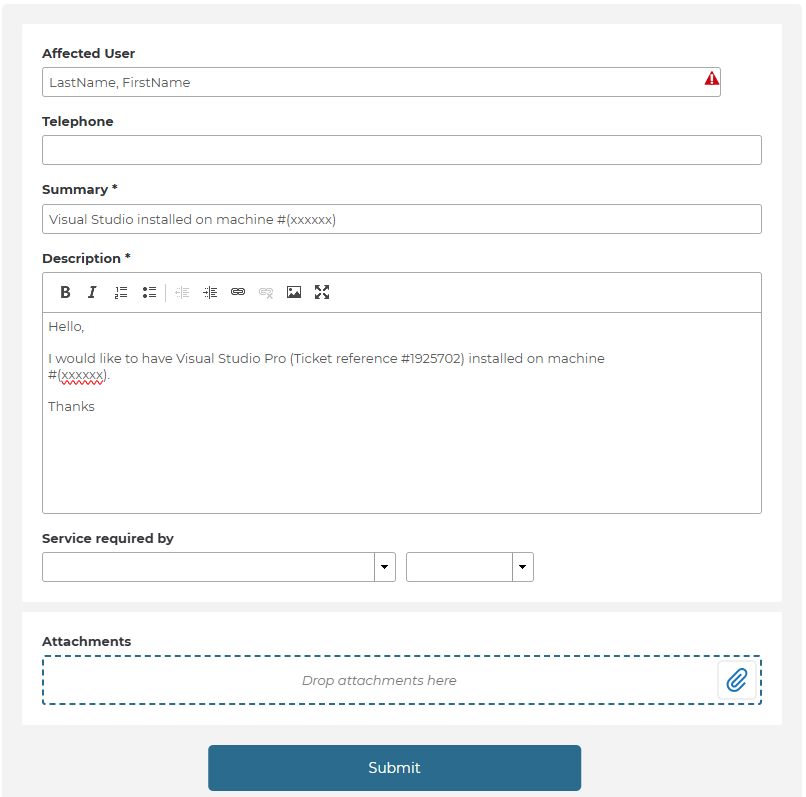
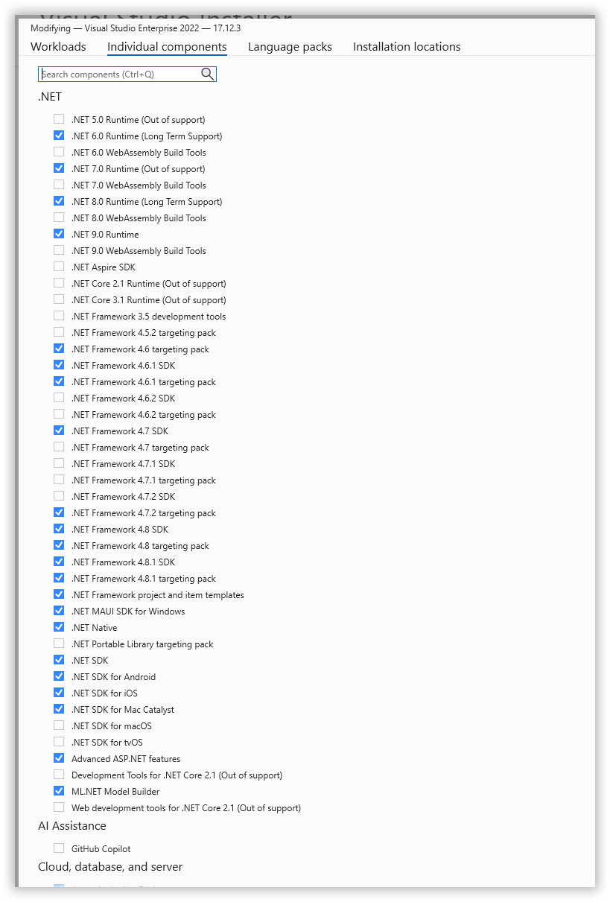
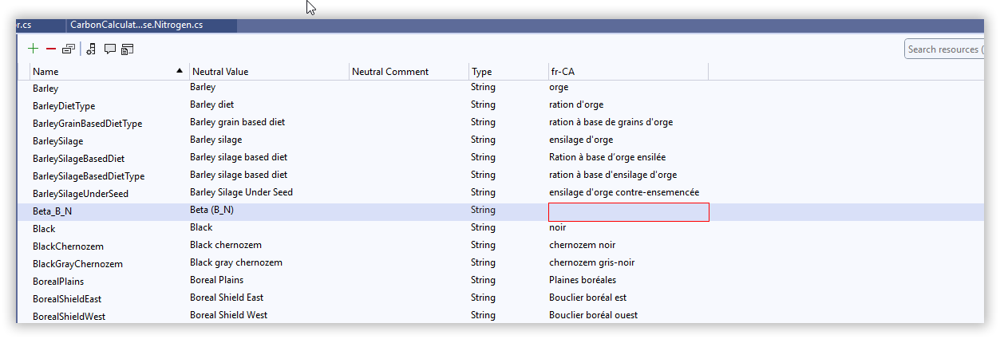

    

The purpose of this document is to provide a guide for new developers joining the Holos team on how to get the software required in order to begin contributing as efficiently as possible.

 

# Table of Contents
- [Table of Contents](#table-of-content)
- [Visual Studio](#visual-studio)
- [Figma](#figma)
- [Discord](discord)

 

# Visual Studio
Visual Studio Professional has been the IDE of choice for Holos' developers, though [Jetbrains Rider](https://www.jetbrains.com/rider/) can also be used. In order to install Visual Studio on your work machine a ticket must be submitted at [assystweb.agr.gc.ca.com](https://assystweb.agr.gc.ca/assystnet/#serviceOfferings/1536). On this form there is a hyperlink to the [WLTS Software List](https://collab.agr.gc.ca/co/ndlm-gncob/Lists/Software%20List/AllItems.aspx) where we find a list of approved, denied, and review required software that can be requested, on this list Visual Studio Pro is to be reviewed when requested and has a ticket reference of #1925702.

Back on the application form, under the **Summary** field input "Visual Studio Pro on machine #(laptop number)" and in the **Description** field input "Hello, I would like to have Visual Studio Pro (ticket reference #1925702) on machine #(laptop number)."

    

After submitting this form you should receive a follow up email containing information regarding your ticket, in this email there is a link to the **ISB Software Request Form**. This form is required to be filled due to Visual Studio Pro having *Review Required* status on the WLTS Software List.  
  
In this form you will be asked several questions, the following lays out how to answer the questions:
  
 

1. <ins>IT Centre TI ticket #</ins>: (Your ticket number from the initial request)
2. <ins>Computer asset #</ins>: (Your computer asset number)
3. <ins>Branch</ins>: Science and Technology Branch
4. <ins>Is this part of a Duty to Accommodate request</ins>: No
5. <ins>Please confirm whether the software will be installed on a</ins>: PC or laptop
6. <ins>This device is owned by</ins>: AAFC
7. <ins>Is the computer that will have this software installed connected to the AAFC network</ins>: Yes
8. <ins>Software name</ins>: Visual Studio
9. <ins>Software website</ins>: https://visualstudio.microsoft.com/vs/professional/
10. <ins>Is this the latest version</ins>: Yes
11.
12.
13. <ins>Does this software run on either Windows 10 or Windows 11</ins>: Yes
14.
15. <ins>Please provide your business rationale and justification for this software request</ins>: I'm a computer science student with the Holos development team. As part of the training in software development that I'm to receive under the supervision of Aaron McPherson (Lead software developer, ISB branch), I require Visual Studio installed to work on projects tasked to me.
16. <ins>Describe how existing approved software cannot fulfill this business requirement (i.e. other approved software in the same software category)</ins>: Visual Studio Code doesn't provide the features required to effectively develop the Holos software. All documentation for working with Holos uses Visual Studio.
17. <ins>Is there a a data component for the software (i.e. does the software capture, manipulate, store or export data)</ins>: Yes
18.
19. <ins>In general terms, what types of data (information) are being stored</ins>: Modeling data
20. <ins>Where is the data stored</ins>: AAFC server
21. <ins>Will additional storage be required to store your data</ins>: No
22. <ins>If the data is shared (internally or externally) how will the data be accessed by others</ins>: Github
23. <ins>Is there a database component to the software</ins>: No
24.
25.
26. <ins>This request is for</ins>: Commercial off-the-shelf (COTS) software
  
 

Once this form has been submitted someone will reach out to you to confirm a license for Visual Studio Professional within approximately one business week. Shortly after this you will receive an email from Microsoft about your Visual Studio subscription. Now someone from our local IT team will reach out to you to install Visual Studio Pro for you, during this process you must specify what frameworks needed during the installation process. The packages required are as follows:

    

After Visual Studio has been installed you can begin following the [GitHub Guide](https://github.com/holos-aafc/Holos/blob/main/H.Content/Documentation/GitHub%20Guide/GitHub%20Guide.md) if you're unfamiliar or need a refresher on working with Github. Once that's complete follow the [Github Devops Guide](https://github.com/holos-aafc/Holos/blob/main/H.Content/Documentation/Github%20Devops%20Guide/GithubDevopsGuide.md) to complete Visual Studio setup and connect to the Holos repositories.

 

# Figma
The Holos developer team uses [Figma](https://www.figma.com/) for GUI prototyping to plan how the interface of Holos V5 will look and interact, along with using it to create a class diagram to map out Holos' code. This can be used as a resource to verify how code contributions fit in Holos as a whole and act as guide on interface design work being done. An account must be created on the Figma website and you must receive an invite in order to access these components. 

 

    

 

# Discord
The Holos team uses the Holos [Discord](https://discord.com/) server to communicate and maintain communication with external parties. This can both be installed on your work machine as it doesn't require admin privilege or can be accessed through the web interface if preferred. Here we let the team know when we're logging on or off for the day, ask programming/modelling questions, share cat memes, and generally keep everyone updated on progress. The search function can also be a helpful tool to look into past conversations regarding design decisions, hardware/software issues, programming questions, etc...