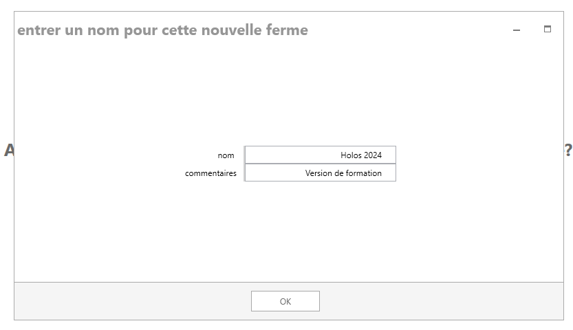
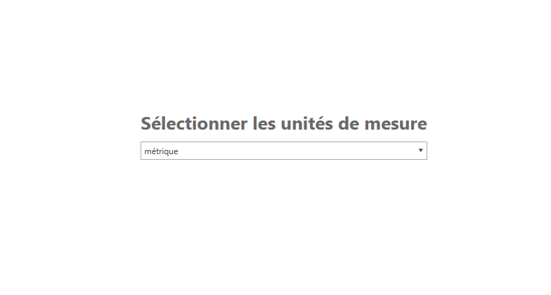
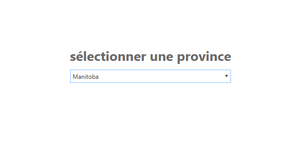
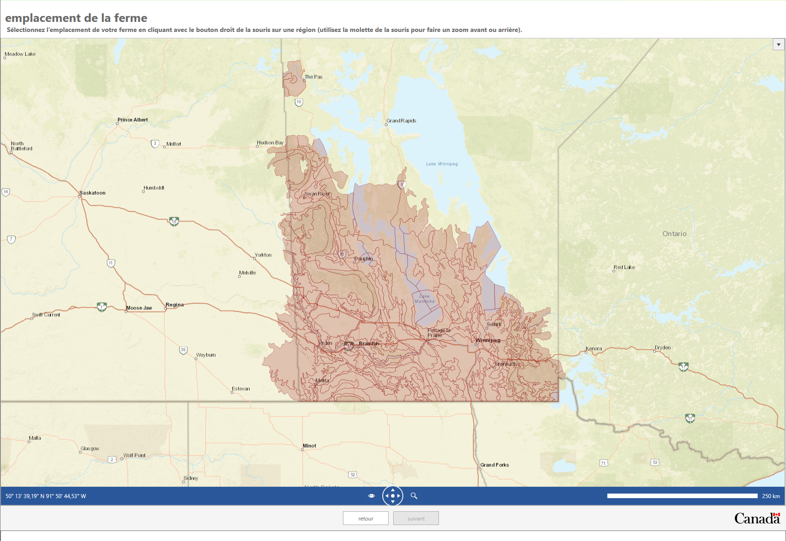
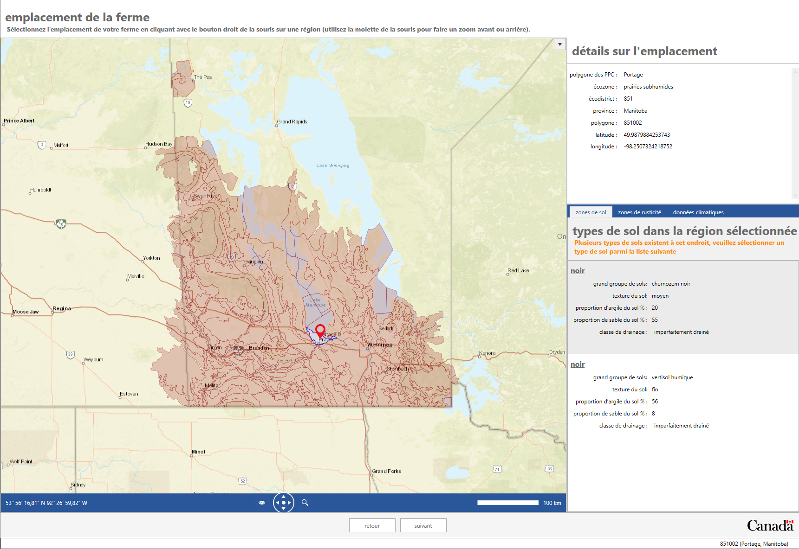
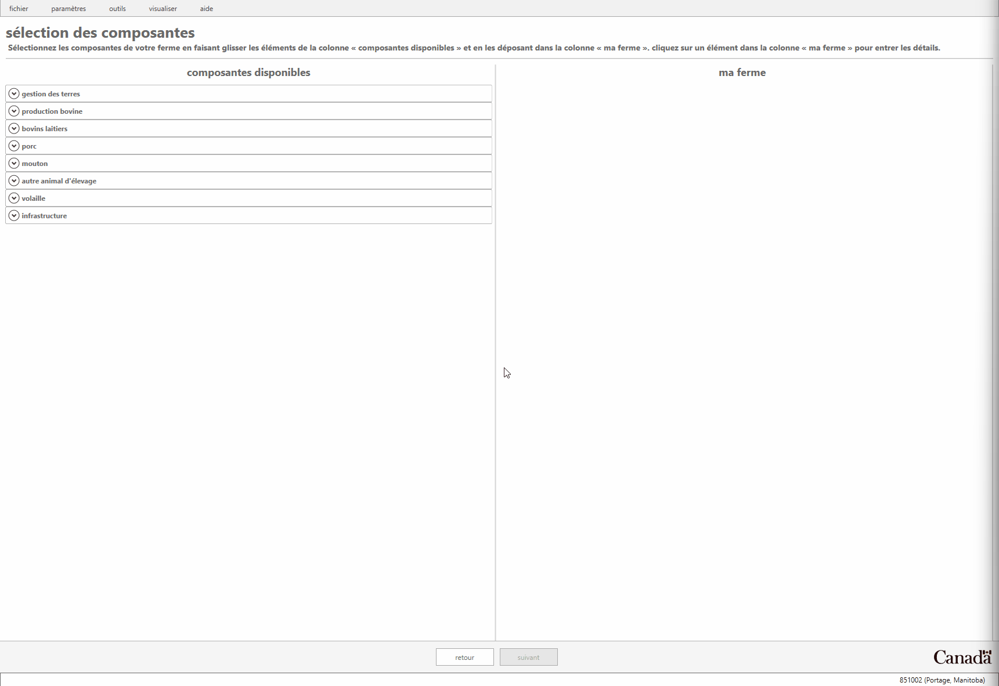
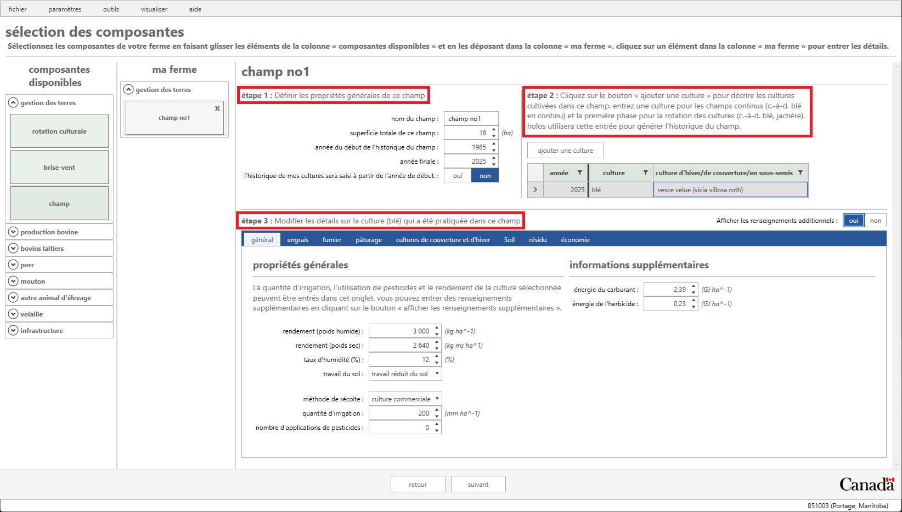
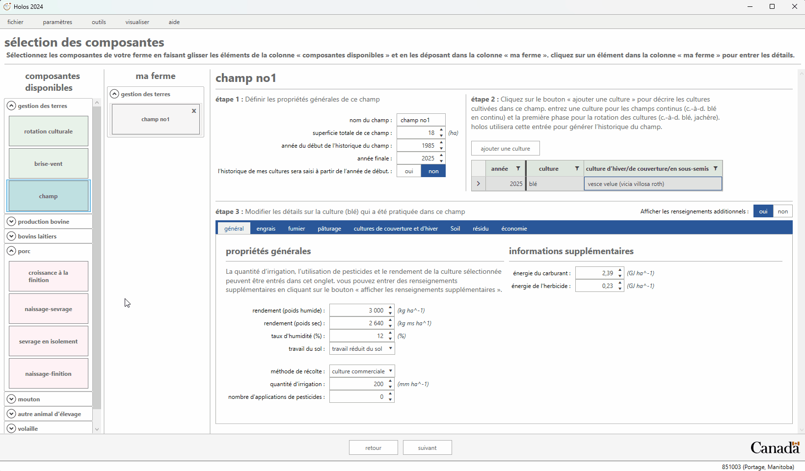
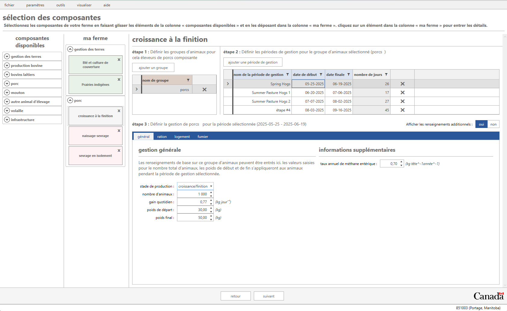
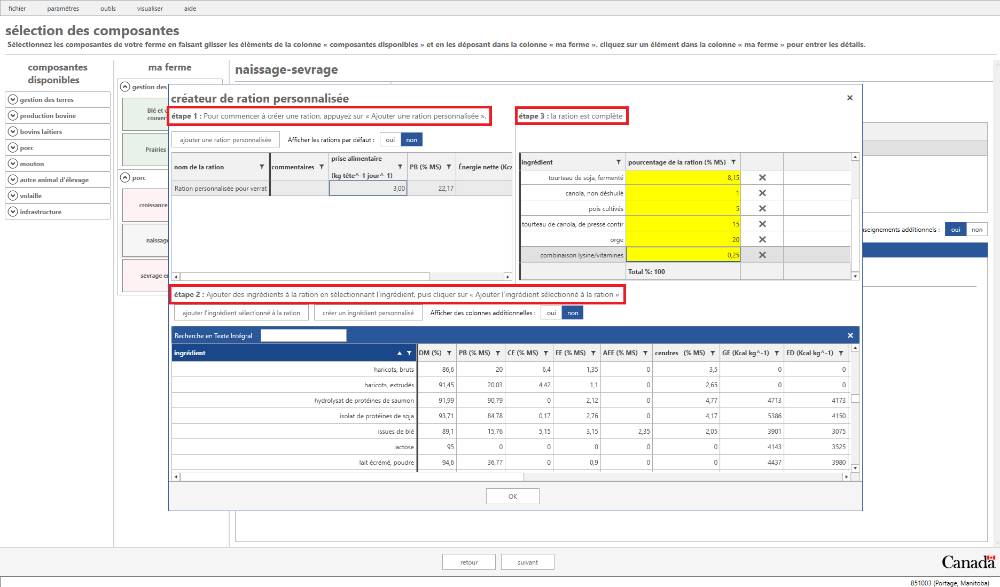

 
     

Le présent document sert d’introduction à l’utilisation du modèle Holos (version 4) et à la distinction entre les données requises et les données facultatives.

Aux fins de la présente formation, nous allons créer une ferme avec un système annuel de production de porc et un système de production de cultures fourragères. La ferme est située au Manitoba, près de Portage la Prairie. 

 

# Lancez Holos 

Veuillez noter que Holos 4 ne peut être installé que sur le système Windows de Microsoft. Le système d’exploitation Mac OS sera pris en charge dans la prochaine version.

Lancez Holos en double-cliquant sur l’icône Holos qui se trouve sur le bureau. Holos demande à l’utilisateur d’ouvrir une ferme existante, de créer une nouvelle ferme ou d’importer un fichier enregistré (figure 1). Si une ferme est déjà enregistrée dans le système, l’utilisateur peut cliquer sur Ouvrir. Si aucune ferme n’est enregistrée dans le système, Holos demande à l’utilisateur s’il veut créer une nouvelle ferme ou importer un fichier de ferme enregistré (c.-à-d. un fichier JSON). Si l’utilisateur crée une nouvelle ferme, le système lui demande le nom de celle-ci et un commentaire facultatif (figure 2).

Entrez le nom de ferme **"Holos 2025"** et le commentaire **"Version de formation"**. Cliquez sur **OK** pour passer à l’écran suivant. 

Assurez-vous de sélectionner l’option **"Métrique"** comme unité de mesure, puis cliquez sur le bouton **Suivant**, au bas de l’écran (figure 3).

 

    
     
    <em>Figure 1: Si une ferme a déjà été enregistrée, Holos présente une invite pour la rouvrir.</em>

 

 

    
     
    <em>Figure 2: Entrée d’un nom pour la nouvelle ferme. </em>

 

    
     
    <em>Figure 3: Sélectionnez l’unité de mesure Métrique.</em>

 

# Création et emplacement de la nouvelle ferme porcine 

La ferme porcine que nous allons créer pour notre exercice est située dans la province du Manitoba. Sélectionnez l’option **"Manitoba"** dans l’écran Sélectionner une province, puis cliquez sur le bouton Suivant.

 

    
     
    <em>Figure 4: Sélectionnez l’option "Manitoba".</em>

 

Holos utilise **Pédo-paysages du Canada** (PPC), une série de couvertures SIG qui montrent les principales caractéristiques des sols et des terres pour l’ensemble du Canada (compilées à une échelle de 1:1 million). Les polygones de PPC peuvent contenir un ou plusieurs éléments distincts du pédo-paysage.

L’écran **Emplacement de la ferme** présente une carte du Canada; la province du Manitoba s’y trouve au centre.

La carte contient des polygones rouges que vous pouvez sélectionner en déplaçant le curseur sur la région correspondant à l’emplacement de votre ferme. Vous pouvez faire un zoom avant ou arrière sur la carte à l’aide de la molette de la souris ou en déplaçant le curseur sur l’icône de zoom, au bas de l’écran.

La ferme porcine de cet exemple est située entre Winnipeg et Portage la Prairie (Portage), dans le polygone **851003** de PPC.

Trouvez ce polygone et cliquez à droite pour le sélectionner dans la carte (figure 6). Notez qu’à ce stade, les données climatiques quotidiennes seront téléchargées à partir du site de la [NASA](https://power.larc.nasa.gov/data-access-viewer/). 

 

> *Remarque: Les données climatiques sont au cœur de la plupart des calculs effectués par Holos. Pour obtenir l’estimation la plus exacte des émissions des exploitations agricoles, les données climatiques mesurées doivent être fournies par l’utilisateur; elles remplaceront alors les données par défaut obtenues à partir des données d’API météo de la NASA. Si l’utilisateur choisit d’utiliser les données climatiques par défaut de la NASA, ces données sont présentées dans une grille de 10 km et peuvent donc varier dans le polygone du PPC, selon l’emplacement précis de la ferme. Par conséquent, si c’est possible, l’utilisateur devrait choisir l’emplacement de sa ferme avec la plus grande précision possible. Pour ce faire, il peut utiliser différentes vues (p. ex., la vue aérienne), qui peuvent être sélectionnées à l’aide de l’icône d’œil au bas de la carte, dans l’écran **Emplacement de la ferme**.*
> 

> *Holos utilisera des valeurs quotidiennes de précipitations, de température et d’évapotranspiration potentielle pour modéliser les changements du carbone dans le sol (paramètre climatique), les émissions d’oxyde nitreux, ainsi que la volatilisation de l’ammoniac.*

 

    
     
    <em>Figure 5: Carte de la province du Manitoba montrant les différents polygones pouvant être sélectionnés.</em>

 

    
     
    <em>Figure 6: Sélectionner le polygone du PPC comme emplacement de la ferme</em>

 

 

Une fois l’emplacement de la ferme choisi, les renseignements sur le sol (texture, proportions de sable et d’argile) pour les types de sols trouvés dans ce polygone sont affichés dans le côté droit de l’écran. Il est possible que plus d’un type de sol par polygone soit trouvé et que l’utilisateur choisisse son type de sol dans cette liste ou utilise la sélection par défaut. Le type de sol par défaut sélectionné représente le type de sol dominant pour le polygone choisi.

Dans le cadre du présent tutoriel, conservez la zone de sol par défaut sol **"noir"**, et la **"zone de rusticité"** par défaut **"3b"**. 

 

    
     
    <em>Figure 7: Plusieurs types de sols seront affichés pour le polygone du PPC sélectionné.</em>

 

 

> *Remarque: Les données sur le sol obtenues à l’emplacement choisi par l’utilisateur seront utilisées dans le calcul des facteurs d’émission d’oxyde nitreux (N2O) propres à l’emplacement. Des propriétés telles que la texture, l’épaisseur de la couche de surface et le pH du sol sont nécessaires à ces calculs et peuvent être écrasées dans l’écran Sélection des composantes, sous Paramètres > Valeurs par défaut de la ferme > Sol.*

 

Cliquez sur le bouton **Suivant** pour passer à l’étape suivante.

# Sélection des composantes de la ferme 

Maintenant que l’emplacement de la ferme a été sélectionné, nous passons à l’écran **Sélection des composantes**. C’est là que l’utilisateur peut sélectionner différentes composantes pour sa ferme. Holos affiche **toutes les composantes disponibles** dans la partie gauche de l’écran, dans la colonne Composantes disponibles (figure 8). Ces composantes sont regroupées en catégories telles que Gestion des terres, Production bovine, Bovins laitiers et Porc. 

Si vous cliquez sur la liste déroulante de l’une des catégories, vous pouvez voir les composantes disponibles. Pour cette partie de la formation, nous travaillerons avec les catégories Gestion des terres et Porc.

 

    
     
    <em>Figure 8: Écran des composants disponibles Des composantes particulières peuvent être choisies ici pour être incluses dans la ferme.</em>

 

 

Le modèle Holos est conçu de manière à ce que les composantes de la gestion des terres soient définies avant celles du bétail. Cela s’explique par le fait que le modèle permet de placer le bétail dans des champs (c.-à-d. des pâturages) particuliers pour qu’ils s’y nourrissent. Cette opération est plus facile si le pâturage a été préalablement défini. L’utilisateur peut toutefois d’abord configurer ses composantes du bétail et ensuite ses composantes de champ, mais il devra dans ce cas retourner à ses composantes du bétail pour les préciser et les "placer" au pâturage.

## Culture et production de foin

Nous pouvons maintenant ajouter notre première composante à la ferme. Faites glisser une composante **Champ** dans la partie gauche de l’écran et déposez-la dans la volet **"Ma ferme"**, du côté droit (Figure 9). L’écran est maintenant mis à jour pour refléter la composante que vous avez ajoutée à votre ferme. Holos associe au champ l’étiquette **"Champ no 1"**. À ce stade, nous pouvons entrer les renseignements sur la production liés à la culture de ce champ.

 

    
     
    <em>Figure 9: Ajout d’une composante à la ferme.</em>

 

 

### Blé et culture de couverture

Dans notre premier champ, nous cultiverons du blé en continu avec une culture de couverture de vesce velue. Changez les éléments suivants dans la composante **"Champ no 1"**.

1. Renommez le champ en lui donnant le nom de **"Blé et vesce velue"** dans la section **Étape 1** de l’écran. Changez la superficie du champ pour la faire passer à **"18 ha"**.

2. Sélectionnez la culture principale **"Blé"** et la culture de couverture **"Vesce velue"** à **l’étape 2**.

3. Dans la page d’onglet Général:
    * Inscrivez un rendement de **"3 000 kg ha -1"** (poids humide). La valeur du poids sec est calculée automatiquement en fonction de la teneur en humidité de la culture.
    * Sélectionnez le type de travail du sol **"Travail réduit du sol"**. 
    * Entrez la valeur **"200"** comme quantité d’eau d’irrigation.
    * Sélectionnez la valeur **"0"** comme nombre de passages de pesticides.
    * Conservez la méthode de récolte par défaut. 
    

 

    
     
    <em>Figure 10: Composante Champ de la ferme</em>

 

  

4. Ouvrez la page d’onglet **Engrais**, puis cliquez sur le bouton **"Ajouter l’épandage d’un engrais"**. Holos a maintenant ajouté un nouvel épandage d’engrais pour le champ et proposera **"l’urée"** comme mélange d’engrais. Un taux d’épandage par défaut est calculé en fonction de la valeur de rendement entrée pour ce champ. On peut modifier les détails de l’épandage d’engrais en cliquant sur le bouton **"Afficher les renseignements additionnels"** (p. ex., saison d’épandage, mélange d’engrais différent, etc.).

 

    
     
    <em>Figure 11: Ajout d’un engrais à un champ.</em>

 

 

> *Remarque: Il n’est pas nécessaire d’entrer une culture pour chaque année depuis 1985; l’utilisateur n’aura à entrer qu’un nombre suffisant de cultures pour définir une seule phase de la rotation. Holos copie ensuite les renseignements sur la phase et remplit automatiquement l’historique des champs (c.-à-d. qu’Holos copie la rotation jusqu’en 1985).*

> *Holos exige au minimum la superficie du champ, le type de culture et un taux d’épandage d’engrais propre au champ pour pouvoir calculer les émissions directes et indirectes d’oxyde nitreux.*

> *La gestion des résidus de chaque culture (et de chaque culture de couverture) peut être ajustée dans Holos (voir l’onglet **Résidus**). Holos fournit des valeurs par défaut selon le type de culture et établit une valeur pour le pourcentage de produit et de paille retournés dans le sol, etc. Ces paramètres d’entrée des résidus auront une incidence sur les estimations finales de la variation du carbone dans le sol.*

> *De plus, les fractions de biomasse et les concentrations d’azote peuvent être écrasées par l’utilisateur, ce qui lui permet d’ajouter des cultures "personnalisées" actuellement non disponibles.*

### Prairies indigènes

Durant les mois d’été (de mai à octobre), l’exploitation porcine (définie plus loin) s’appuie sur les pâturages indigènes pour enrichir la ration.

1. Faites glisser une nouvelle composante de **champ** vers votre liste de composantes. Entrez le nom **"Prairie indigène"** dans la case de saisie Nom du champ.

2. Entrez la valeur **"100"** ha comme superficie totale du champ.

3. Sélectionnez l’option **"Parcours (indigène)"**" dans la liste déroulante de la colonne Culture, à **"l’étape 2"**. Veuillez noter que Holos remplit automatiquement la colonne **Culture d’hiver/de couverture/intermédiaire** lorsqu’un type de culture vivace est sélectionné.

4. Conserver la valeur **"0"** mm ha-1 comme quantité d’eau d’irrigation et comme nombre d’applications de pesticides.

5. Aucun engrais n’est utilisé pour cette culture.

 

    
     
    <em>Figure 12: Renseignements sur les pâturages indigènes</em>

 

 

# Exploitation porcine

L’ajout de composantes animales se fait exactement de la même façon que pour ajouter des composantes de gestion des terres. Dans la catégorie Porc, glissez et déposez une composante Engraissement à finition dans la section Ma ferme, à droite. Ajouter une composante Naissance-sevrage, puis une composante Porcelets sevrés. Dans notre exemple, tous les groupes énumérés sous chaque composante seront utilisés. Cela signifie qu’à l’étape 1, nous n’aurons à supprimer aucun groupe d’animaux en cliquant sur l’icône X. Nous pouvons maintenant commencer à entrer des renseignements dans chaque groupe d’animaux à partir de nos trois composantes porcines.

*Remarque: Sélectionnez l’option de menu **Visualiser** et décochez l’option **Cacher la liste des composantes disponibles**.*

 

    
     
    <em>Figure 13: Composantes de la ferme porcine.</em>

 

 

## Naissance-sevrage 

La composante Naissage au sevrage est divisée en quatre groupes d’animaux, qui sont ensuite divisés en périodes de gestion (production) correspondantes. Nous entrons maintenant des données pour chacune de ces périodes de gestion.

### Jeunes truies

À **l’étape 1**, assurez-vous que la ligne **"Jeunes truies"** est sélectionnée afin d’entrer l’information de gestion connexe pour ce groupe.

1. Cliquez sur la période de gestion **"Jeunes truies vides"**, à **l’étape 2**, pour activer cette période de gestion.

2. Assurez-vous que la date de début est le **"1er janvier 2024"** et que la date de fin est le **"6 janvier 2024"** (5 jours). Les dates de début et de fin par défaut indiquées dans Holos peuvent être modifiées par l’utilisateur; le **nombre de jours** est alors ajusté en conséquence.

3. Entrez les données liées au nombre d’animaux, à la ration, au système de gestion du fumier et au type de logement à **l’étape 3**. Dans la page d’onglet **Général**:
    * Sélectionnez l’option **"Vide (pas en lactation ni en gestation)"** comme étape de production.
    * Entrez la valeur **"83"** comme nombre d’animaux.
    * Enter **"9"** for the litter size, **"1.4"** kg for the weight of piglets at birth and **"6"** kg for the weight of weaned piglets.
    * Pour les autres paramètres, conservez les valeurs par défaut.

3. Dans le menu déroulant Ration de la page d’onglet **Ration**, sélectionnez l’option **"Gestation"**. Dans la page d’onglet **Logement**, sélectionnez l’option **"Logé dans l’étable"** et sélectionnez le type de litière à **"Paille (hachée)"**. Dans la page d’onglet **Fumier**, sélectionnez l’option **"Liquide/lisier avec croûte naturelle"**.

4. Pour chacune des trois périodes de gestion nommées **"Jeunes truies saillies (étapes 1 à 3)"**", fixez les dates de début et de fin respectives pour que les périodes aient **38** jours (étape 1 : 7 janvier 2024 à 14 février 2024, etc.).

5. Surlignez la période de gestion **"Jeunes truies saillies (étape 1)"**, et dans la page **d’onglet Général**:
    * Sélectionnez l’option **"Gestation"** comme étape de production.
    * Entrez la valeur **"83"** comme nombre d’animaux.
    * Pour les autres paramètres, conservez les valeurs par défaut.
    
6. Dans le menu déroulant Ration de la page **d’onglet Ration**, sélectionnez l’option **"Gestation"**. Dans la page **d’onglet Logement**, sélectionnez l’option **"Logé dans l’étable"** et l’option **"Paille (hachée)"**, et dans la page **d’onglet Fumier**, sélectionnez l’option **"Liquide/lisier avec croûte naturelle"**.

7. Répétez les étapes 7 et 8 pour les périodes de gestion **Jeunes truies saillies (étape 2 et 3)**.
  
8. Enfin, sélectionnez l’option **"Jeunes truies de naissage"**, entrez la date du **"1er octobre 2024"** comme date de début et la date du **"24 mai 2024"** comme date de fin (21 jours).

9. Dans la page **d’onglet Général**:**
    * Sélectionnez l’option **"Lactation"** comme étape de production.
    * Entrez la valeur **"83"** comme nombre d’animaux.
    * Pour les autres paramètres, conservez les valeurs par défaut.
    
10. Dans la page **d’onglet Ration**, sélectionnez l’option **"Lactation"** dans le menu déroulant Ration. Dans la page **d’onglet Logement**, sélectionnez l’option **"Logé dans l’étable"** et l’option **"Paille (hachée)"**", et dans la page **d’onglet Fumier**, sélectionnez l’option **"Liquide/lisier avec croûte naturelle"**.

 

### Truies 

Nous allons maintenant passer au groupe des **"truies"** à **l’étape 1** en le mettant en évidence.

1. Cliquez sur la période de gestion intitulée **"Truies ouvertes** à **l’étape 2** pour activer cette période de gestion.

2. Veillez à ce que la date de début soit fixée au **"1er janvier 2024"** et la date de fin au **"6 janvier 2024"** (5 jours). Les dates de début et de fin par défaut fournies par Holos peuvent être modifiées par l'utilisateur et le **nombre de jours** sera ajusté en conséquence.

3. Dans la page d’onglet Général:
    * Sélectionnez l’option **"vide (pas en lactation ni en gestation)"** comme étape de production.
    * Entrez la valeur **"83"** comme nombre d’animaux.
    * La taille de la litière peut être ajustée en conséquence pour toutes les périodes de gestion des truies; ici, nous laisserons la valeur par défaut **"9"**.
    * Pour les autres paramètres, conservez les valeurs par défaut.

4. Dans le menu déroulant Ration de la page **d’onglet Ration**, sélectionnez l’option **"Gestation"**. Dans la page **d’onglet Logement**, sélectionnez l’option **"Logé dans l’étable"** et l’option **"Paille (hachée)"**, et dans la page **d’onglet Fumier**, sélectionnez l’option **"Liquide/lisier avec croûte naturelle"**.

5. Pour chacune des trois périodes de gestion de **l’étape 2** nommées **Truies saillies (étapes 1 à 3)**, les dates de début et de fin sont respectivement fixées à **38 jours** (c.-à-d. étape no 1 : **07 janvier 2024** au **14 février 2024**, etc.). 

6. Dans la page **d’onglet Général** pour les trois périodes de gestion des truies saillies: 
    * Sélectionnez l’option **"Gestation"** comme étape de production.
    * Entrez la valeur **"83"** comme nombre d’animaux.
    * La taille de la litière peut être ajustée en conséquence pour toutes les périodes de gestion des truies; ici, nous laisserons la valeur par défaut **"9"**.
    * Pour les autres paramètres, conservez les valeurs par défaut.
    
7. Dans la page **d’onglet Ration**, sélectionnez l’option **"Gestation"** dans le menu déroulant **Ration**. Dans la page **d’onglet Logement**, sélectionnez l’option **"Logé dans l’étable"** et l’option **"Paille (hachée)"**", et dans la page **d’onglet Fumier**, sélectionnez l’option **"Liquide/lisier avec croûte naturelle"**.

8. Pour passer à la période de gestion des **"truies de naissage en lactation"** à **l’étape 2**, choisissez la date de début du **"3 mai 2024"** et la date de fin du **"24 juin 2024"** (21 jours).

9. Sélectionnez l’option **"en lactation"** comme étape de production et entrez la valeur **"370"** comme nimbre d'animaux. Pour les autres paramètres, conservez les valeurs par défaut.
    
10. Dans la page **d’onglet Ration**, sélectionnez l’option **"Lactation"** dans le menu déroulant **Ration**. Dans la page **d’onglet Logement**, sélectionnez l’option **"Logé dans l’étable"** et l’option **"Paille (hachée)"**", et dans la page **d’onglet Fumier**, sélectionnez l’option **"Liquide/lisier avec croûte naturelle"**.
 

### Verrats 

Dans la section **Verrats**, assurez-vous que ce groupe est mis en évidence à **"l’étape 1"**. À **"l’étape 2"**, une seule période de gestion est définie, avec la date de début du **"1er janvier 2024"** et la date de fin du **"31 décembre 2024"** (365 jours).

1. Dans la page **d’onglet Général**:
    * Sélectionnez le stade de production **"Reproducteurs"**.
    * Entrez la valeur **"2"** comme nombre d’animaux.
    * Pour les autres paramètres, conservez les valeurs par défaut.
      
2. Pour ce groupe d'animaux, nous créerons un régime sur mesure.
    
#### **Création d’une nouvelle ration**

Les utilisateurs de Holos peuvent créer des rations personnalisées pour remplacer les rations animales standard par défaut. (Remarque : Holos intègre les données sur les ingrédients alimentaires dans la ration des porcs de D. Beaulieu, de l’Université de la Saskatchewan (20XX).

Nous allons créer une ration personnalisée pour notre groupe de verrats reproducteurs logés dans l’étable. Ouvrez la page d’onglet **Ration**, puis cliquez sur le bouton **Créateur de ration personnalisée**.

## Écran **Créateur de ration personnalisée**:
1. Cliquez sur le bouton **Ajouter une ration personnalisée**, à **l’étape 1**, pour créer notre nouvelle ration personnalisée.
2. Renommez cette ration en lui donnant le nom de **"Ration personnalisée pour verrat"**, puis appuyez sur la touche Enter pour l’enregistrer.
3. À **l’étape 2**, ajoutez des ingrédients à la nouvelle ration. Sélectionnez l’option **"Ajouter l’ingrédient sélectionné à la ration"**. Cherchez l’option **"Blé de force roux"** dans la liste des ingrédients, mettez-la en évidence, puis cliquez sur le bouton **OK** qui se trouve en dessous pour qu’elle apparaisse à **l’étape 3**, qui comprend la ration.
4. Entrez le **pourcentage de la ration (% MS)** attribué à cet ingrédient; nous entrerons ici la valeur de **"38 %"**".
5. Continuez d’ajouter des ingrédients à la ration. Sélectionnez l’option **"Farine basse"** dans la liste  **Ajoutez l’ingrédient sélectionné à la ration**, mettez-le en évidence et cliquez sur **OK**. À **l’étape 3**, entrez la valeur **"2%"**  comme **pourcentage dans la ration (% MS)**.
6. Entrez la valeur Drèches sèches de distillerie provenant du maïs (10,6 %). Continuez et ajoutez tous les ingrédients voulus à votre ration. Dans le cas de notre ration pour verrat, ajoutez les ingrédients suivants: Tourteau de soja fermenté (8,15%), Graines entières de canola (1%), Pois de grande culture (5,0 %), Tourteau de canola pressé (15%) et Orge (20%).
7. Si aucun ingrédient n’est trouvé dans la **recherche en texte intégral**, l’utilisateur peut entrer les données sur l’ingrédient de façon indépendante à l’aide du bouton **Créer un ingrédient personnalisé**. Dans notre exemple, nous ajouterons la combinaison lysine/vitamines (0,25 %) en suivant ces étapes. La ration est maintenant jugée complète dans Holos puisque les ingrédients représentent ensemble 100 % de la ration.
8. A **l'Étape 1**, entrez **"3"** comme valeur pour la consommation d'aliments.
9. Cliquez sur le OK pour enregistrer la nouvelle ration personnalisée.
10. Vous pouvez maintenant sélectionner l’option **"Ration personnalisée pour verrat"** dans le menu déroulant comme nouvelle ration pour ce groupe d’animaux dans la page d’onglet **Ration**.
11. Dans la page d’onglet **Logement**, sélectionnez l’option **"Logé dans l’étable"** et l’option **"Paille (hachée)"**, et dans la page d’onglet **Fumier**, sélectionnez l’option **"Liquide/lisier avec croûte naturelle"**.
  
 

    
     
    <em>Figure 14: Créateur de ration personnalisée pour le groupe des porcsa</em>

 

 

### Porcelets sevrés

We will now move on to the **"Piglet"** animal group in **Step 1** by highlighting it. 

1. Cliquez sur le groupe d’animaux Porcelets à **l’étape 1**. À **l’étape 2**, cliquez sur la période de gestion **Porcelets sevrés – Étape 1**. Nous laisserons les dates par défaut du **1er janvier 2024** au **22 janvier 2024** (21 jours).
   
2. Dans la page d’onglet Général :
    * Select **"Nursing piglet"** as the production stage.
    * Entrez la valeur « 100 » comme nombre d’animaux.
    * Enter **"1.4"** kg for the start weight and **"6"** kg for the end weight.
    * Pour les autres paramètres, conservez les valeurs par défaut.

3. Sélectionnez le type de ration **"Porcelets sevrés (ration de démarrage no 1)"**. Dans la page **d’onglet Logement**, sélectionnez l’option **"Logé dans l’étable"** et l’option **"Paille (hachée)"**, et dans la page **d’onglet Fumier**, sélectionnez l’option **"Liquide/lisier avec croûte naturelle"**.

 

## Engraissement à finition

For other Swine components, the animal groups and management periods are added/defined in the same way as for the Farrow-to-Wean component.

Cliquez sur le groupe des porcs à l’étape 1.
 
1. Click on the **"Hogs"** animal group in **Step 1** to enter the associated management information for this group.
 
2. Under **Step 2**, select the first management period and set the start date to **"May 25 2024"** and the end date to **"June 19, 2024"** (26 days). Name this period **"Spring Hogs"**. 

3. Highlight the **"Spring Hogs"** management period, and on the **General** tab leave **"Growing/finishing"** as the production stage and enter **"1000"** as the number of animals.

4. On the **Diet** tab, select **"Grower/Finisher diet 1"** as the diet type. On the **Housing** tab, select **"Housed in barn"** as the housing type and **"Straw (Chopped)"** as the bedding type (keep the default application rate) and on the **Manure** tab, select **"Liquid/Slurry with natural crust"** as the manure handling system.

5. For the second, and third management periods, the hogs will be placed on pasture - rename these management periods **"Summer Pasture Hogs 1"** and **"Summer Pasture Hogs 2"**. Set the start date for **"Summer Pasture Hogs 1"** to **"June 20, 2024"** and the end date to **"July 6, 2024"** (17 days), and set the start and end dates for **"Summer Pasture Hogs 2"** to **"July 7, 2024"** and **"August 2, 2024"**, respectively (27 days). 

6. For the **"Summer Pasture Hogs 1"** and **"Summer Pasture Hogs 2"** management periods, on the **General** tab, leave the production stage as **"Growing/finishing"** and enter **"1000"** as the number of animals.

 

> *Il est important de noter que les porcs ne peuvent pas être élevés toute l’année au pâturage seulement et qu’ils auront besoin de rations additionnelles pour leur santé, leur croissance et leur développement.*

 

7. For the diet for these hogs on pasture, we will create a new diet. Select the **"Custom Diet Creator"** button. In **Step 1** on this screen, select **Add Custom Diet** and name the new diet **"Hog Supplement"**. 

8. In **Step 2** and **Step 3**, add the diet ingredients as follows: **"Barley"** (99.5%) and **"Lysine/vitamins"** (0.5%). **"Lysine/vitamins"** will now appear in the text search as it was previously added for the **"Custom Boar Diet"**. 

9. Under **Step 1** enter **"3"** as the feed intake for the **"Hog Supplement"** diet. Click **OK** to save.

10. For the **"Summer Pasture Hogs 1"** and **"Summer Pasture Hogs 2"**, on the **Diet tab** select **"Hog Supplement"** from the drop down menu. On the **Housing** tab, select **"Pasture/range/paddock"** as the housing type and select **"Native Grassland"** as the pasture location, and on the **Manure** tab, select **"Pasture/range/paddock** as the manure handling system.

11. For the final management period, set the start and end dates to **"August 3, 2024"** and **"September 16, 2024"**, respectively (45 days).

12. Highlight this management period, and on the **General** tab leave **"Growing/finishing"** as the production stage and enter **"1000"** as the number of animals.

13. On the **Diet** tab, select **"Grower/Finisher diet #4"** as the diet type. On the **Housing** tab, select **"Housed in barn"** as the housing type and leave **"Straw (Chopped)"** as the bedding type (keep the default application rate, and on the **Manure** tab, select **"Liquid/Slurry with natural crust"** as the manure handling system.

 

    
     
    <em>Figure 14: Engraissement à finition, groupe des porcs</em>

 

  

### Ajout d’une application de fumier dans le champ de blé

Dans Holos, l’utilisateur peut utiliser le fumier produit par le bétail dans sa ferme, ou du fumier importé de l’extérieur de la ferme pour l’appliquer sur un champ. Comme nous avons maintenant défini nos composantes animales, nous pouvons épandre du fumier sur n’importe quel champ de notre ferme.

1. Sélectionnez le champ **"Blé et vesce velue"** dans la liste des composantes ajoutées à notre ferme.

2. Ouvrez la page d’onglet **Fumier**, puis cliquez sur le bouton **Ajouter un épandage de fumier**.
    * Sélectionnez l’option **Bétail** comme origine du fumier.
    * Sélectionnez l’option **Porc** comme type de fumier.
    * Sélectionne le système de manutention du fumier **Liquide/lisier avec croûte naturelle**.
    * Sélectionnez la méthode d’application **Épandage de lisier à la volée**. 
    * Entrez la valeur **200 kg ha-1** comme quantité de fumier épandue sur ce champ.

3. Des engrais chimiques et du fumier peuvent être épandus sur le même champ.

 

    
     
    <em>Figure 15: Ajout d’une application de fumier à la composante du blé et de la vesce velue</em>

 

# Écran Calendrier

Nous terminons le processus de définition de notre ferme. Cliquez sur le bouton **Suivant** pour passer à l’écran Calendrier. L’écran Calendrier présente une vue d’ensemble de tous les champs de 1985 jusqu’à l’année de fin précisée pour chaque champ. Dans cet écran, l’utilisateur peut ajouter des systèmes de production antérieurs et prévus.

Le bouton **Ajouter un système de production historique** permet à l’utilisateur d’ajouter différents historiques de culture à différents champs, tandis que le bouton **Ajouter un système de production** prévu permet à l’utilisateur d’ajouter un système de culture futur (prévu) à des champs individuels.

### Ajout d’un système de production antérieur 

Nous supposerons que les champs de rotation **de l’orge et du mélange de foin** étaient auparavant dans un système de culture continue du blé entre **1985 et 2000**.

1. Pour sélectionner un élément, cliquez sur la barre de calendrier pour activer ce champ. Nous sélectionnerons le premier champ de cette rotation (c.-à-d. le champ portant le nom **"Rotation de cultures no 1 (champ no 1) – Orge"**.

2. Cliquez sur le bouton **"Ajouter un système de production historique"** pour ajouter une nouvelle ligne au tableau dans la section **Étape 1**, dans le coin supérieur gauche de l’écran. Vous pouvez remarquer que la mention **"Pratique de gestion historique"** a été ajoutée.

3. Nous fixerons la fin de cette pratique à l’an **2000**. Pour ce faire, utilisez les boutons numériques haut/bas dans la cellule.

4. Sélectionnez la nouvelle pratique, puis cliquez sur le bouton **Modifier les éléments sélectionnés**. Un nouvel écran s’affiche; il nous permettra d’ajuster les cultures et la gestion durant cette période.

5. Cliquez sur la culture Orge, dans la section Étape 2.

7. Faites passer le type de culture à **"Blé"** et, dans la page d’onglet Général, faites passer le rendement à **"3 500 kg/ha -1"**. Nous ne modifierons pas les autres paramètres. 
  
8. Nous devons également retirer les cultures de mélange de foin de cette période antérieure. Cliquez sur l’icône **X**, à côté de chacune des cultures de mélange de foin, dans la section **Étape 2**. Cliquez sur l’icône **X** pour supprimer ces cultures de la rotation pour cette période.

10. Cliquez sur **OK** pour enregistrer les modifications que nous venons d’apporter à ce champ.

 

    
     
    <em>Figure 16: Écran Calendrier personnalisé</em>

 

   

    
     
    <em>Figure 17: Définir l’année de début et de fin des systèmes de production dans l’écran Calendrier.</em>

 

  

    
     
    <em>Figure 18: Modification des cultures au cours d’une période de rotation antérieure. </em>

 

## Écran Détails 

Cliquez sur le bouton Suivant pour accéder à l’écran Détails.

Pour éviter qu’un utilisateur soit obligé de fournir les rendements annuels des cultures en remontant jusqu’à 1985 (ou à une autre date, si la date précisée est différente) pour chaque champ de la ferme, le modèle utilisera les données de *Statistique Canada* sur le rendement annuel propre à une culture par défaut (le cas échéant). Les changements dans le rendement des cultures ont une incidence sur divers extrants du modèle, notamment sur les taux de séquestration du carbone dans le sol et sur les émissions de N2O des sols. Les étapes suivantes montrent comment l’ajustement du rendement des cultures influe sur les intrants de carbone au-dessus et en dessous du sol.

Nous ajusterons cette grille afin de voir les intrants de carbone en surface et sous la terre pour notre **champ de blé**, puis nous ajusterons le rendement des cultures pour une année donnée.

1. WNous allons définir un filtre pour la première colonne (Nom du champ) afin de ne visualiser que l’information concernant notre champ de blé et de vesce velue. À côté de l’en-tête de la colonne, cliquez sur l’icône Entonnoir. Cochez la case à côté de **'Blé et vesce velue'**.

2. À l’extrême gauche de cet écran, cliquez sur la barre latérale **Activer les colonnes** (près de la colonne Nom du champ).

3. Cochez la case **Intrants de carbone en surface** pour afficher la colonne et décochez la case à côté de la colonne **Notes** pour masquer celle-ci. 

4. Cliquez de nouveau sur la barre latérale **"Activer les colonnes"** pour la réduire.

5. Nous pouvons maintenant (facultativement) ajuster les rendements de notre champ de blé pour une année donnée si les rendements mesurés réels sont disponibles.

6. Ajuster le blé

7. Définissez le rendement de **"2006"** à **"4100 kg/ha"**.

8. Notez que Holos a mis à jour les intrants de carbone en surface à cette fin.

Cliquez sur le bouton Suivant pour passer à l’écran du rapport final des résultats. 

 

    
     
    <em>Figure 19: Écran Détails </em>

 

 

#  Écran des résultats

Cliquez sur le bouton **Suivant** pour accéder au rapport final des résultats. Les résultats sont maintenant affichés dans divers rapports et graphiques.

1. Ouvrez la page d’onglet **Diagramme circulaire des émissions**.

    En commençant par le diagramme circulaire des émissions, nous pouvons voir la répartition globale des émissions de CH4 entérique, CH4 du fumier et des émissions directes et indirectes de N20. Nous sommes également en mesure de voir la répartition détaillée des sources de ces émissions.

2. Le Format du rapport offre la possibilité de se déplacer entre les rapports mensuels et annuels.

    Dans le menu **déroulant Unité de mesure**, vous pouvez choisir d’afficher les résultats sous forme d’équivalents CO2 (CO22) ou de gaz à effet de serre non convertis (GES), et vous pouvez également choisir l’unité de mesure (tonnes ou kilogrammes). 
 

    
     
    <em>Figure 20: Rapport d’émissions détaillées</em>

 

 

3. **Le Rapport des estimations sur l’alimentation** fournit une estimation de l’ingestion de matière sèche en fonction des besoins énergétiques de l’animal et de l’énergie fournie par l’aliment.

 

    
     
    <em>Figure 21: Rapport Estimations de la production.</em>

 

 

## Résultats de la modélisation du carbone dans le sol 

Dans l’écran des résultats, nous pouvons voir l’évolution du carbone dans le sol au fil du temps en ouvrant la page d’onglet **Modélisation pluriannuelle du carbone**. Cette page contient un graphique montrant l’évolution du carbone dans le sol au fil du temps pour chacun de nos champs.

Pour chaque champ figurant dans le graphique, vous pouvez obtenir plus de renseignements sur chaque année de la simulation en passant votre souris sur la série.

Cliquez sur l’un de ces points pour voir une répartition plus détaillée des résultats sous forme de grille. Vous pouvez aussi exporter les données en cliquant sur le bouton **Exporter vers Excel**.

Si vous voulez exporter l’ensemble de votre fichier agricole, sélectionnez les options de menu **Fichier**, puis **Exporter** dans le menu principal. Cliquez sur la flèche pour mettre votre ferme en évidence et enregistrez celle-ci sous forme de fichier JSON.

 

    
     
    <em>Figure 22: Section du rapport concernant le carbone. Permet de basculer entre le graphique présenté ici et le format tableau présenté ci-dessous.</em>

 

 

# Finalement…

## Approche intégrée

> Un écosystème est composé non seulement des organismes et de l’environnement où ils vivent, mais également des interactions des organismes avec leur milieu et entre eux. L’approche intégrée vise à décrire et à comprendre le système entier comme un ensemble intégré et non comme un ensemble de composantes distinctes, c’est-à-dire que l’on considère le tout plutôt que la somme des parties. C’est une approche holistique qui peut être très complexe et il est difficile d’en décrire le processus. Recourir à un modèle mathématique est une façon de conceptualiser un système dans son ensemble. 
> 
> C’est une approche intégrée qui permet de s’assurer que les effets des changements de gestion à l’échelle du système influent sur les émissions nettes des fermes. Dans certains cas, la réduction des émissions d’un GES entraîne une hausse des émissions d’un autre GES. L’approche intégrée permet d’éviter d’adopter des pratiques potentiellement inopportunes fondées sur les préoccupations à l’égard d’un seul GES.

Pour télécharger Holos, obtenir de plus amples renseignements ou accéder à une liste récente des publications concernant Holos, visitez le site : https://agriculture.canada.ca/fr/production-agricole/holos. 

Pour nous joindre, envoyez un courriel à:
aafc.holos.acc@canada.ca. 