Démonstration pratique de l’outil logiciel Holos version 4

HOLOS, UN OUTIL POUR ESTIMER ET RÉDUIRE LES GES DES EXPLOITATIONS AGRICOLES

 
     

# Guide de formation sur l’outil logiciel Holos version 4

***Remarque** : L’objectif du présent document est de fournir une introduction à l’utilisation du modèle Holos (version 4) et aux données requises par rapport aux données facultatives.*

Aux fins de cette formation, nous allons créer une ferme avec un système annuel de production de boeuf et un système de production de cultures fourragères. La ferme est située au Manitoba, près de Portage La Prairie.

# Lancement de Holos

**Veuillez noter que Holos 4 ne peut être installé que sur le système Windows de Microsoft. Le système d’exploitation Mac OS sera pris en charge dans la prochaine version.**

Lancez Holos en double-cliquant sur l’icône Holos qui se trouve sur le bureau. S’il n’y a pas de fermes sauvegardées dans le système, Holos créera une nouvelle ferme et demandera à l’utilisateur un nom de ferme et un commentaire facultatif. S’il y a déjà une ferme enregistrée dans le système, Holos demandera à l’utilisateur d’ouvrir la ferme existante ou de créer une nouvelle ferme.

Entrez "**Holos 2022**" comme nom de ferme et "**version de formation**" comme "commentaire". Cliquez sur "OK" pour passer à l'écran suivant
Assurez-vous de sélectionner « **Métrique** » comme unité de type de mesure, puis cliquez sur le bouton « Suivant » au bas de l’écran.

 

    
     
    <em>Figure 1: Entrer un nom pour la nouvelle ferme.</em>

 

    
     
    <em>Figure 2 : Si une ferme a déjà été sauvegardée, cet écran s’affichera.</em>

 
 

    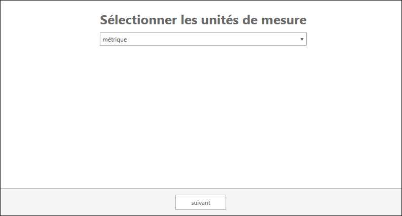
     
    <em>Figure 3: Sélectionnez métrique comme unité de mesure. </em>

 

# Création et localisation de la nouvelle ferme bovine

La ferme bovine que nous allons créer pour cet exercice est située dans la province du Manitoba. Sélectionnez « **Manitoba** » dans l’écran « Sélectionner une province », puis cliquez sur le bouton « Suivant ».

 

    
     
    <em>Figure 4: Sélectionnez Manitoba.</em>

 

Holos utilise Pédo-paysages du Canada (PPC), une série de couvertures SIG qui montrent les principales caractéristiques des sols et des terres pour l’ensemble du Canada (compilées à une échelle de 1:1 million). Les polygones de PPC peuvent contenir un ou plusieurs éléments distincts du pédo-paysage.
L’écran « Emplacement de la ferme » affiche une carte du Canada avec la province du Manitoba au centre de l’écran.

La carte contient des polygones de couleur rouge qui peuvent être sélectionnés en déplaçant le curseur sur la région qui contient l’emplacement de votre ferme. Vous pouvez faire un zoom avant ou arrière de la carte à l’aide de la molette de la souris ou en déplaçant le curseur sur l’icône de zoom au bas de l’écran.

La ferme bovine de cet exemple est située entre Winnipeg et Portage la Prairie (Portage) avec le numéro de polygone **851003** de PPC.

1. Trouvez ce polygone et cliquez avec le bouton droit de la souris pour le sélectionner sur la carte. Notez qu’à ce stade, les données climatiques quotidiennes seront téléchargées à partir du site de la [NASA](https://power.larc.nasa.gov/data-access-viewer/).

 

***Remarque** : Les données climatiques sont au coeur de la plupart des calculs effectués par Holos. Pour obtenir l’estimation la plus exacte des émissions des exploitations agricoles, les données climatiques mesurées doivent être fournies par l’utilisateur, ce qui remplacera les données par défaut obtenues à partir des données d’API météo de la NASA.* 

*Holos utilisera des valeurs quotidiennes de précipitations, de température et d’évapotranspiration potentielle pour modéliser les changements de carbone dans le sol (paramètre climatique), les émissions d’oxyde nitreux, ainsi que la volatilisation de l’ammoniac.*

 

    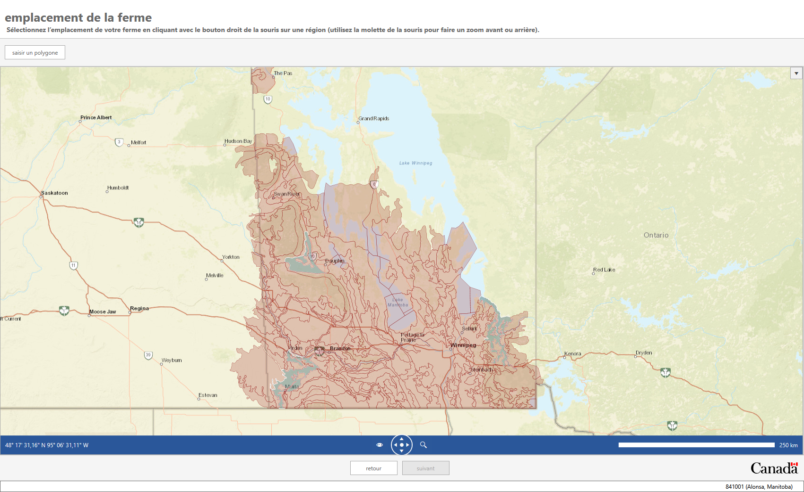
     
    <em>Figure 5: Polygones de PPC et emplacement de la ferme</em>

Une fois l’emplacement de la ferme choisi, les renseignements sur le sol (texture, proportions de sable et d’argile) pour les types de sols trouvés dans cette région sont affichés du côté droit de l’écran. Il est possible que plus d’un type de sol par région soit trouvé et que l’utilisateur choisisse son type de sol dans cette liste ou utilise la sélection par défaut.

Conservez le premier type de sol sélectionné et la « zone de rusticité » par défaut.

 

    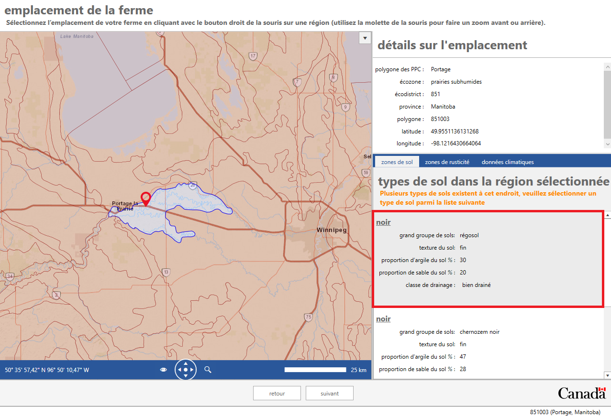
     
    <em>Figure 6: Plusieurs types de sols seront affichés pour la région sélectionnée.</em>

  
 

***Remarque** : Les données sur le sol obtenues à l’emplacement choisi par l’utilisateur seront utilisées dans le calcul des facteurs d’émission d’oxyde nitreux (N2O) propres à l’emplacement. Des propriétés comme la texture, l’épaisseur de la couche de surface et le pH du sol sont nécessaires à ces calculs et peuvent être écrasées.*

Cliquez sur le bouton « Suivant » pour continuer.

#  Sélection des composantes de la ferme

Maintenant que l’emplacement de la ferme a été sélectionné, nous passons à l’écran « **Sélection des composantes** ». C’est là que l’utilisateur peut sélectionner différentes composantes pour sa ferme. Holos affichera toutes les composantes disponibles du côté gauche de l’écran dans la colonne « **Composantes disponibles** ». Ces composantes sont regroupées en catégories comme « gestion des terres », « production bovine », « **bovins laitiers** », etc. Si vous cliquez sur la liste déroulante de l’une des catégories, vous pouvez voir les composantes disponibles. Pour cette partie de la formation, nous travaillerons avec les catégories « **gestion des terres** » et « **production bovine** ». 

 

    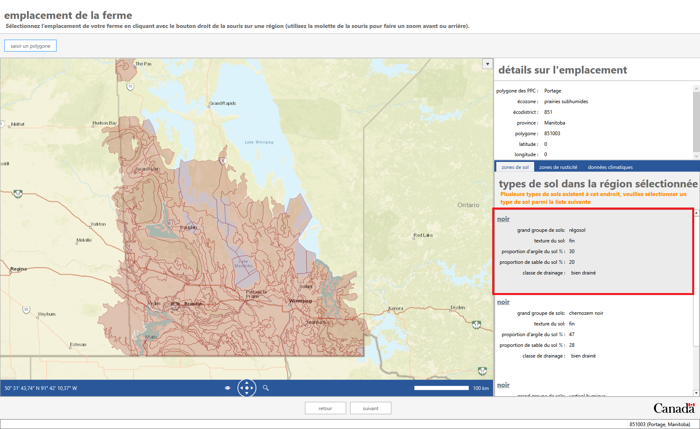
     
    <em>Figure 7: L'écran des composants disponibles </em>

 
 

Le modèle est conçu pour définir la gestion des terres avant le bétail. C’est parce que nous allons permettre de placer le bétail dans un pâturage particulier (champ) pour brouter, ce qui est plus facile lorsqu’un champ de pâturage a déjà été défini (autrement, l’utilisateur devrait interrompre la définition du bétail pour définir un champ).

## Culture et production de foin

Nous pouvons maintenant ajouter notre première composante à la ferme. Faites glisser une composante « Champ » du côté gauche de l’écran et déposez-la dans la zone « Mes composantes » du côté droit (Figure 8). L’écran se met maintenant à jour pour refléter la composante que vous avez ajoutée à votre ferme. Holos a étiqueté le champ comme « Champ 1 ». À ce stade, nous pouvons maintenant entrer les renseignements sur la production liés à la culture de ce champ.

 

    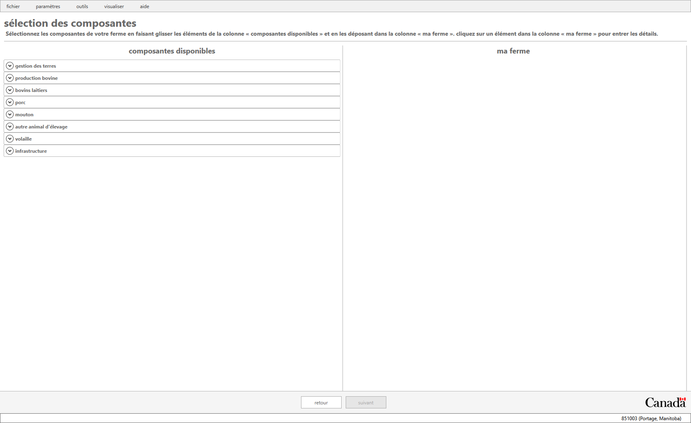
     
    <em>Figure 8: Ajouter un composant à la ferme.</em>

 
 

### Blé et culture de couverture

Dans notre premier champ de la ferme, on cultivera du blé en continu avec une culture de couverture de vesce velue.
1. Renommez le champ « **Blé et vesce velue** » dans la section « **Étape 1** » de l’écran. Changez la superficie du champ à **18** ha.
2. Sélectionnez « **Blé** » dans la liste des cultures dans la colonne « **Culture** » et « **Vesce velue** » comme culture de couverture à **l’étape 2**.
3. Cliquez sur l’onglet « **Général** », puis sélectionnez « **Travail réduit du sol** » comme type de travail du sol.
Entrez un rendement de **3 000 kg/ha** (poids humide),assurez-vous que la « **culture commerciale** » est sélectionnée comme « **méthode de récolte** », inscrivez **200 mm** comme quantité d’irrigation.
4. Aucun pesticide n’est utilisé dans ce champ.

 

    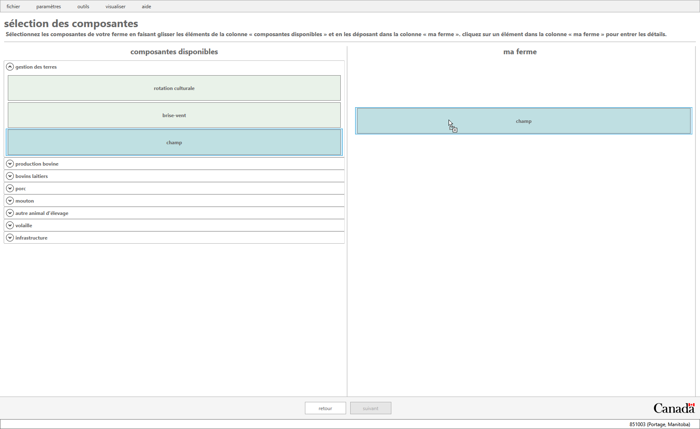
     
    <em>Figure 9: Composant de champ.</em>

 
  

5. Cliquez sur l’onglet « Engrais », puis sur le bouton « **Ajouter l’épandage d’un engrais** ». Holos a maintenant ajouté un nouvel épandage d’engrais pour ce champ et proposera l’urée comme mélange d’engrais. Un taux d’épandage par défaut est calculé en fonction de la valeur de rendement entrée pour ce champ. Les détails de cet épandage d’engrais peuvent être modifiés en cliquant sur le bouton « Voir renseignements supplémentaires » (p. ex., saison d’épandage, mélange d’engrais différent, etc.).

 

    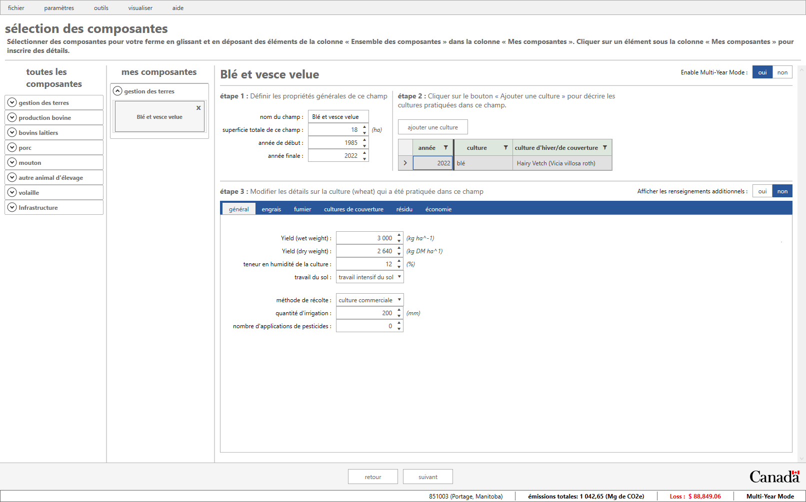
     
    <em>Figure 10: Ajouter l’épandage d’un engrais.</em>

 
  

***Remarque** : À tout le moins, Holos a besoin de la superficie du champ, du type de culture et d’un taux d’épandage d’engrais propre au champ pour calculer les émissions directes et indirectes d’oxyde nitreux.*

*La gestion des résidus de chaque culture (et de chaque culture de couverture) peut être ajustée dans Holos (voir l’onglet « Résidus »). Holos fournit des valeurs par défaut selon le type de culture et établira une valeur pour le pourcentage de produit et de paille retournés dans le sol, etc. Ces paramètres d’entrée des résidus auront une incidence sur les estimations finales de la variation du carbone dans le sol.*

*De plus, les fractions de biomasse et les concentrations d’azote peuvent être écrasées par l’utilisateur, ce qui permet d’ajouter des cultures « personnalisées » qui ne sont actuellement pas disponibles.*

 

## Renseignements sur les pâturages (indigènes)/prairies

L’exploitation de naissage (définie plus loin) dépend des pâturages indigènes pendant les mois d’été (**de mai à octobre**).
1. Faites glisser un nouveau champ vers votre liste de composantes.
2. Entrez le nom « **Prairie indigène** » dans la case de saisie « Nom du champ ».
3. Entrez **100** ha pour la superficie totale du champ.
4. Sélectionnez « **prairie ensemencée** » dans la colonne « Culture » de la liste des cultures à **l’étape 2**.
5. Veuillez noter que Holos remplit automatiquement la colonne « Culture d’hiver/de couverture/intermédiaire » lorsqu’un type de culture vivace est sélectionné.
6. Cette prairie n’est pas irriguée (**0 mm**) et aucun engrais n’est utilisé.

 

    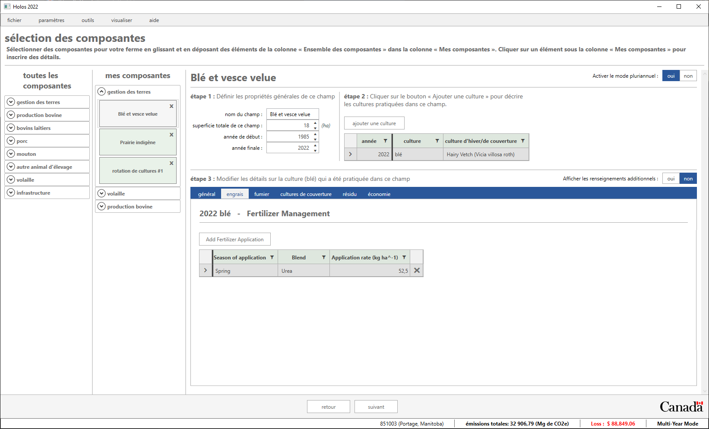
     
    <em>Figure 11: Informations sur les pâturages/prairies .</em>

 
 

## Rotation des grains d’orge et des mélanges de foin

Pour démontrer la composante de rotation des cultures (plutôt que d’utiliser des composantes de champ individuelles), nous supposerons que les grains d’orge et les mélanges de foin sont cultivés en rotation, le mélange de foin étant sous-ensemencé en orge afin qu’il puisse être récolté dans les deux années principales. (Exemple tiré des parcelles Breton de l’Université de l’Alberta).

Lorsqu’on utilise la composante « rotation de cultures », toute séquence de cultures entrée dans cette composante sera appliquée à chaque champ individuel qui fait partie de la configuration de rotation. Cela signifie qu’un champ est ajouté pour chaque phase de rotation et que la rotation se décale de manière à ce que chaque phase de rotation soit présente dans un champ. Étant donné que chaque champ peut avoir une gestion historique différente, des algorithmes de carbone du sol seront appliqués pour chaque champ.

Pour cet exemple, nous supposons que la ferme a besoin de 70 ha de grains d’orge et de mélange de foin, qui sont cultivés en rotation. Nous devrons établir trois champs où le grain d’orge fait l’objet d’une rotation dans chaque champ tous les deux ans [Figure 12]. Lorsqu’on utilise la composante de rotation des cultures, l’intrant de gestion des cultures d’une culture particulière est répété dans chaque champ de la rotation où le produit végétal est cultivé.

Pour configurer la rotation :
1. Ajoutez une composante « rotation de cultures » à notre ferme.
2. Cliquez sur le menu « **Visualiser** » et sélectionnez « **Cacher la liste des composantes disponibles** » pour réduire la quantité de défilement horizontal nécessaire lors de la saisie des données.
3. La rotation pour ce champ a commencé en **1985 et se termine en 2022**. Assurez-vous de ces deux valeurs pour l’année de début et l’année finale à **l’étape 1**.
4. Entrez 70 ha dans « Superficie totale de ce champ ».
5. Sous « **Étape 2** », sous « Culture » entrez « **Orge** » dans la première ligne [2021].
6. La ferme pratique le travail réduit du sol dans le champ d’orge. Changez le type de travail du sol à « Travail réduit du sol ».
7. Entrez un rendement de **3 000 kg/ha** [poids humide] pour la récolte d’orge. Il n’y a pas d’irrigation et nous ajouterons un épandage d’engrais d’urée à cette culture [utilisez le taux d’épandage suggéré].
8. Cliquez sur le bouton « **Ajouter une culture** » sous « **Étape 2** » pour ajouter une deuxième culture à la rotation. Notez que Holos fixe l’année de cette nouvelle récolte à 2020. Holos s’attend donc à ce que l’utilisateur entre les cultures en ordre inverse depuis 1985. Il est à noter qu’il n’est pas nécessaire d’entrer une culture pour chaque année depuis 1985 ; l’utilisateur n’aura à entrer qu’un nombre suffisant de cultures pour décrire une seule phase de la rotation.   
Holos copiera ensuite les renseignements sur la phase et remplira automatiquement l’historique des champs [p. ex., Holos copiera la rotation en 1985 pour l’utilisateur].

 

    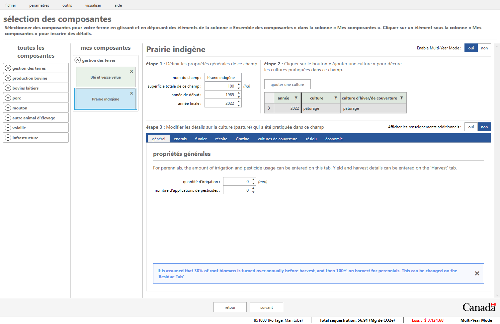
     
    <em>Figure 12: Un exemple de rotation de trois cultures.</em>

 
 

9. Dans la colonne « Culture » pour cette deuxième culture [en 2020], sélectionnez « **Mélange de foin** » comme type de culture.
10. Cliquez sur le bouton « **Ajouter une culture** » une dernière fois pour ajouter un autre champ et sélectionnez « **Mélange de foin** » comme auparavant.
11. Pour ajouter des données de récolte pour les deux champs de mélange de foin :
    * Sélectionnez la ligne mélange de foin 2021.
    * Sous l’onglet « Récolte », cliquez sur le bouton « Ajouter une date de récolte » pour créer une nouvelle récolte, sélectionnez une date de récolte du « **31 août 2021** » [en supposant que la récolte est effectuée le même jour chaque année], sélectionnez « **Moyen** » pour « Étape de croissance du fourrage ». Cette récolte a donné cinq balles totales d’un poids de 500 kg par balle.
    * Répétez les deux dernières étapes ci-dessus pour l’autre récolte de mélange de foin cultivée en 2019.
    
S’il y a plus d’une récolte sur la prairie de fauche, le bouton « Ajouter une date de récolte/broutage » peut être utilisé pour ajouter des récoltes subséquentes.

## Exploitation de naissage

Cliquez sur le menu « Visualiser » et décochez l’option « **Cacher la liste des composantes disponibles** » afin que toutes les composantes s’affichent de nouveau.

L’ajout de composantes animales suit exactement l’approche utilisée pour les composantes de gestion des terres. Dans la catégorie « **Production de boeuf** », glissez et déposez une composante « Naissage de bovin » dans la zone « **Mes composantes** ». Les génisses de relève ne seront pas utilisées dans cet exemple ; nous pouvons donc supprimer ce groupe de la composante en cliquant sur l’icône « **X** » à droite de ce groupe d’animaux.

 

    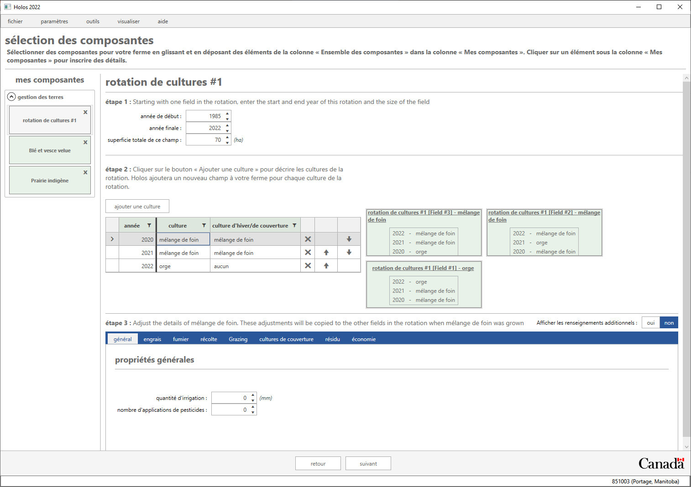
     
    <em>Figure 13 - Composant vache-veau</em>

 
 

### Saisir des renseignements sur les vaches, les veaux et les taureaux de boucherie

#### Vaches de boucherie

Après le cycle annuel d’alimentation, la ferme bovine avec laquelle nous travaillons est divisée en trois périodes de gestion [production]. Nous pouvons maintenant entrer les données de production et de gestion correspondant à ces trois périodes de gestion.

 

**a) Notre première période de gestion portera sur l’alimentation hivernale [de janvier à avril]**

1. Dans la section des groupes d’animaux de l’« **étape 1** », assurez-vous que la ligne des « **vaches** » est sélectionnée afin d’entrer l’information de gestion connexe pour ce groupe.

2. Cliquez sur la période de gestion intitulée « **Alimentation hivernale** » **à l’étape 2** pour activer cette période de gestion.

3. Assurez-vous que la « date de début » est le « **1er janvier 2021** » et que la « date finale » est le « **30 avril 2021** ».

Ensuite, nous pouvons entrer des données liées au nombre d’animaux, au type de logement, au système de gestion du fumier et à la ration.

Cliquez sur l’onglet « Général » et entrez **150** pour le « Nombre d’animaux ».

 

***Remarque** : Le nombre d’animaux, le gain quotidien moyen et la qualité des aliments sont les entrées minimales requises pour calculer les émissions de méthane et d’oxyde nitreux. La durée des périodes de gestion (c.-à-d. la durée du broutage) sera également nécessaire. Les données sur le logement et la gestion du fumier sont également des entrées importantes, mais elles ont une incidence relativement plus importante sur les émissions de monogastriques.*

 

1. Nous allons créer une ration alimentaire personnalisée pour notre troupeau de vaches pendant la période de gestion de l’« **alimentation hivernale** ». (Holos intègre l’information sur les ingrédients des aliments tirée du livre Nutrient Requirements of Beef Cattle publié récemment [2016]).

2. Cliquez sur l’onglet « Ration ». Notez que Holos fournit un ensemble par défaut de rations pour animaux pouvant être utilisées. Puisque nous allons créer notre ration personnalisée, il faut cliquer sur le bouton « **Créateur de ration personnalisée** ».

3. Cliquez sur le bouton « Ajouter une ration personnalisée » **dans la section** « **Étape 1** » de l’écran pour créer une nouvelle ration personnalisée.

4. Renommez cette ration par « **Ma ration personnalisée** », puis appuyez sur la touche Entrée pour sauvegarder le nom.

5. Pour ajouter des ingrédients à la nouvelle ration, sélectionnez « **Foin de luzerne** » dans la liste des ingrédients, puis cliquez sur le bouton « **Ajouter l’ingrédient sélectionné à la ration** ».

6. Un ingrédient sera ajouté à notre ration. Sélectionnez « Foin d’orge » dans la liste des ingrédients, puis cliquez sur le bouton « **Ajouter l’ingrédient sélectionné à la ration** ».

7. Entrez 50 % pour le « **foin d’orge** » et 50 % pour le « **foin de luzerne** » à l’étape 3. Notez que la ration est maintenant complète dans Holos puisque tous les ingrédients totalisent jusqu’à 100 %.

8. Cliquez sur le bouton « **OK** » pour sauvegarder la ration personnalisée.

9. Sélectionnez « Ma ration personnalisée » dans le menu déroulant.

***Remarque** : Les renseignements sur la qualité de l’alimentation, comme les protéines brutes, le total des nutriments digestibles et les graisses, sont nécessaires pour que Holos puisse estimer les émissions de méthane entérique d’un groupe animal.*

 

    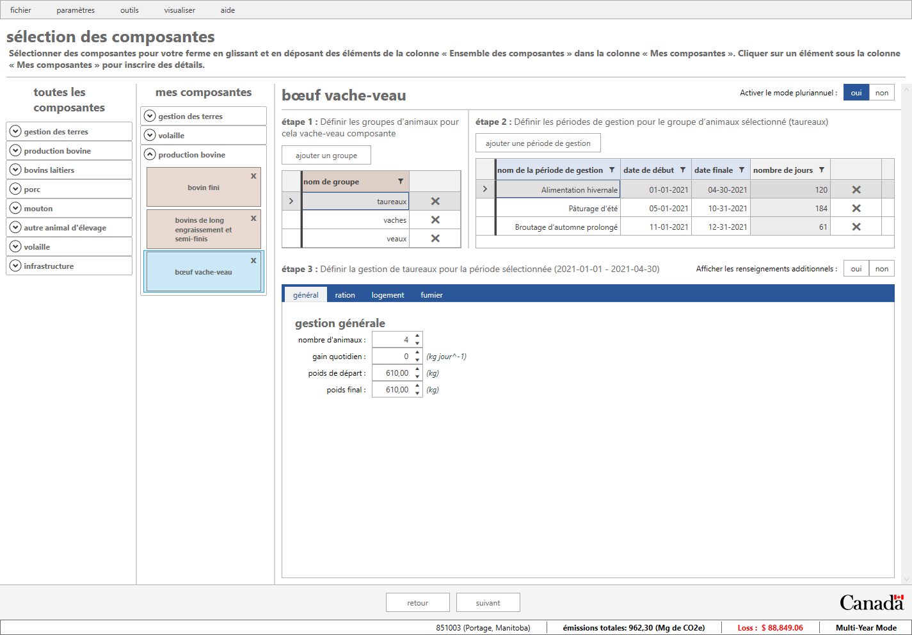
     
    <em>Figure 14 - Créateur de ration personnalisée</em>

 
 

10. Cliquez sur l’onglet « **Logement** » et sélectionnez « **Confiné sans étable** ».

11. Cliquez sur l’onglet « **Fumier** » et sélectionnez « **Litière profonde** » dans la liste.

 

**b) Notre deuxième période de gestion portera sur le broutage en pâturage pendant les mois d’été.**

1. Cliquez sur la période de gestion intitulée « **Pâturage d’été** ».
2. Assurez-vous que le « **1er mai 2021** » correspond à la date de début et que le « **31 octobre 2021** » correspond à la date finale.
3. Cliquez sur l’onglet « **Général** » pour confirmer que nous avons 150 animaux pendant cette période.
4. Sélectionnez « **Protéines à haute énergie** » comme ration par défaut sous l’onglet « **Ration** ».
5. Sélectionnez « **Pâturage** » comme type de logement sous l’onglet « **Logement** », puis repérez le champ (« Prairie indigène ») sur lequel les animaux brouteront à partir de la case de saisie « **Emplacement du pâturage** ». Sélectionnez « **Pâturage de masse/continu** » comme type de pâturage. Holos ajustera les apports de carbone des pâturages en fonction du système de pâturage sélectionné.
6. Sélectionnez « **Pâturage** » comme système de gestion du fumier par défaut sous l’onglet « Fumier ».

 

**c) Notre troisième période de gestion portera sur le broutage prolongé à l’automne.**
1. Sélectionnez la période de gestion appelée « **Broutage d’automne prolongé** ».
2. Sélectionnez le « **1er novembre 2021** » comme date de début et le « **31 décembre 2021** » comme date finale pour la période.
3. Cliquez sur l’onglet « **Général** » et entrez 150 animaux pendant cette période.
4. Sélectionnez « **Protéines d’énergie moyenne** » comme ration par défaut.
5. Sélectionnez « **Pâturage** » comme type de logement sous l’onglet « **Logement** », puis repérez le pâturage sur lequel les animaux broutent **(« prairies indigènes »)** dans la case de saisie « **Emplacement du pâturage** ». Sélectionnez « **Broutage alterné** » comme type de broutage.
6. Sélectionnez « **Pâturage** » comme système de gestion du fumier par défaut sous l’onglet « Fumier ».

 

    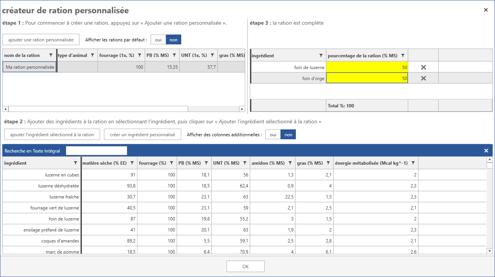
     
    <em>Figure 15 - Volet vache-veau - Section vaches</em>

 
  

#### Taureaux

Cliquez sur la ligne « **Taureaux** » dans la section du groupe d’animaux à l’« **Étape 1** ». L’information sur la ration, le logement et la gestion du fumier est identique à celle du groupe des vaches.

- Cliquez sur « **Taureaux** » avec le bouton droit de la souris. Un menu s’affichera vous permettant de sélectionner l’option pour copier les périodes de gestion d’un autre groupe d’animaux. Étant donné que la gestion des taureaux est semblable à celle des vaches, cliquez sur **« Copier la gestion de » -> « Vaches » dans le sous-menu.**

- Ajustez le nombre de taureaux pour chacune des trois périodes de gestion à 4.

 

 

    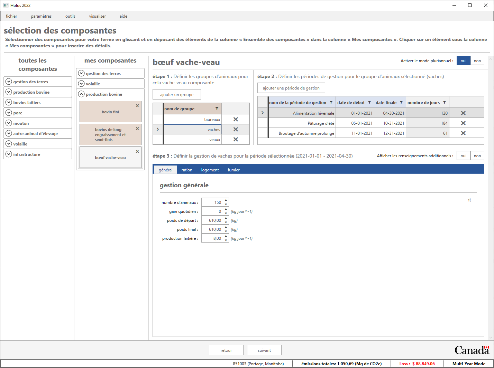
     
    <em>Figure 16 - Copier la section des vaches </em>

 
  

#### Veaux de boucherie

Les veaux de notre ferme naissent le 1er mars et sont sevrés le 30 septembre à l’âge de sept mois. Avec un taux de sevrage final de 85 %, nous aurons 110 veaux de mars à septembre. Après les vaches, les veaux seront en confinement pour les mois de mars et d’avril et brouteront sur les pâturages de mai à septembre. Il en résultera deux périodes de gestion distinctes.

Cliquez sur « **Veaux** » dans la section du groupe animal à l’« **Étape 1** » pour activer le groupe de veaux.

- La première période de gestion s’étendra du **« 1er mars 2021 » au « 30 avril 2021 »**, il y aura un total de 110 animaux, les veaux seront nourris de « **protéines d’énergie moyenne** », dans un type de logement « **confiné sans étable** » avec un système de manutention du fumier à « **Litière profonde** ». Nous renommerons cette période de gestion comme suit : « **Confinement** »
- Le broutage au cours de cette deuxième période de gestion s’étendra du « **1er mai 2020** » **au** « **30 septembre 2020** ». Nous renommerons cette période de gestion « **Broutage** ».
- À l’onglet « **Général** », changez le nombre d’animaux à 110.
- Les veaux consommeront des « **protéines à haute énergie** ».
- Remplacer le logement par « **Pâturage** » où les animaux brouteront dans la « **Prairie indigène** ». Le type de broutage sera « **Pâturage de masse/continu** ».
- À l’onglet « **Fumier** », assurez-vous que « **Pâturage** » est réglé comme système de manutention du fumier.

 

    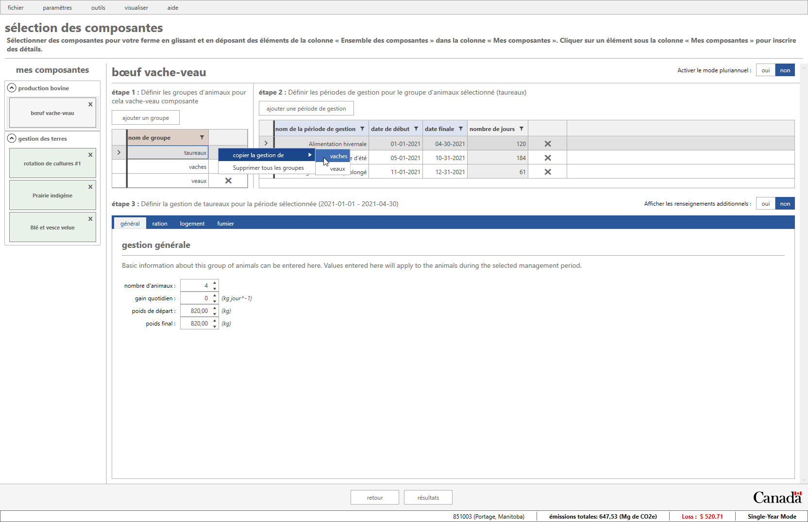
     
    <em>Figure 17 - Veaux de boucherie
 </em>

 
  

## Élevage de bovins de long engraissement et semi-finis

Pour entrer de l’information sur les bovins de long engraissement et semi-finis, nous ajouterons une composante « Long engraissement et semi-fini » à notre ferme.

1. Glissez et déposez une nouvelle composante « **Bovins de long engraissement et semi-finis** ».
La ferme bovine gère **200 bovins semi-finis (100 bouvillons et 100 génisses)**.
1. Cliquez sur le groupe « **Génisses** » pour l’activer et entrer les données de gestion pour ce groupe.
2. Pour la « **période de gestion no 1** », entrez « **1er octobre 2021** » comme « **date de début** » et « **18 janvier 2022** » comme « **date finale** » (110 jours).
3. Cliquez sur l’onglet « **Général** » et entrez 100 pour le nombre d’animaux, **1,1 kg/jour pour le gain quotidien, 240 pour le poids de départ.**
4. Les 100 génisses sont nourries selon une ration à « **croissance moyenne** » et gérées dans un type de logement « **sans étable confiné** » avec un système de manutention du fumier « **à litière profonde** ».
Avec le bouton droit de la souris, cliquez sur le groupe « **Bouvillons** » pour activer le menu de contexte. Dans le menu qui s’affiche, **sélectionnez « Copier la gestion de » -> « Génisses »**.

 

    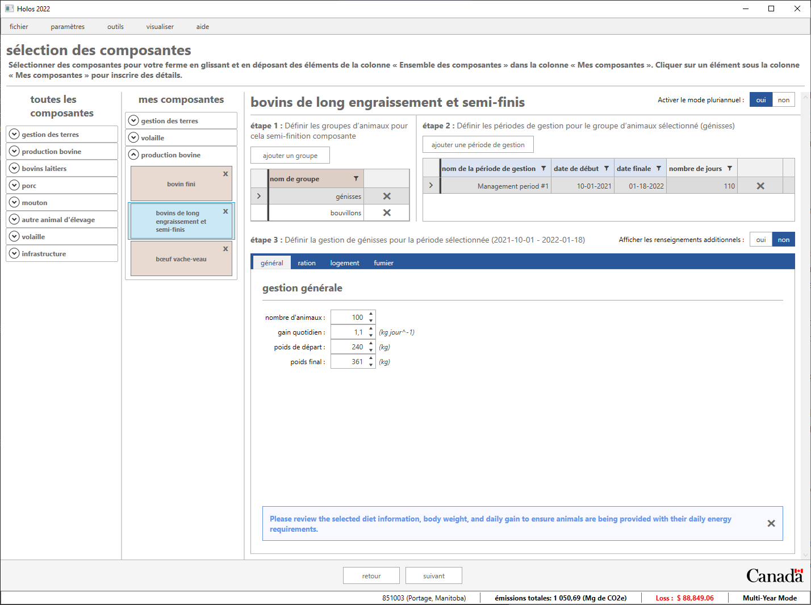
     
    <em>Figure 18 - Élevage de bovins de long engraissement et semi-finis</em>

 
 

## Exploitation d’un parc de finition

Nous allons maintenant répéter les étapes utilisées pour « Bovins de long engraissement et semi-finis » pour entrer les données de gestion du parc de finition. Glissez une nouvelle composante « Bovin de finition » de « Toutes les composantes » dans votre liste de composantes.
La ferme bovine gère 200 animaux d’engraissement (100 bouvillons et 100 génisses) dans un parc de finition pendant **170 jours**.
1. Sélectionnez le groupe « **Génisses** ».
2. Pour la « **période de gestion no 1** », entrez « **19 janvier 2021** » comme « **date de début** » et « **7 juillet 2021** » comme « **date finale** ».
3. Entrez **100** pour le nombre d’animaux, un gain quotidien moyen de **1,2 kg/jour et 350 kg comme poids de départ**.
4. Les animaux en parcs d’engraissement sont nourris de « Rations à base de céréales d’orge », le type de logement sera « **Confiné sans étable** ».
5. Le système de gestion du fumier sera « **Litière profonde** ».
Cliquez sur le groupe « **Bouvillons** » pour l’activer. Les données de gestion pour ce groupe d’animaux sont les mêmes que pour le groupe « **Génisses** ».
1. Avec le bouton droit de la souris, cliquez sur le groupe « **Bouvillons** » pour activer le menu

 

    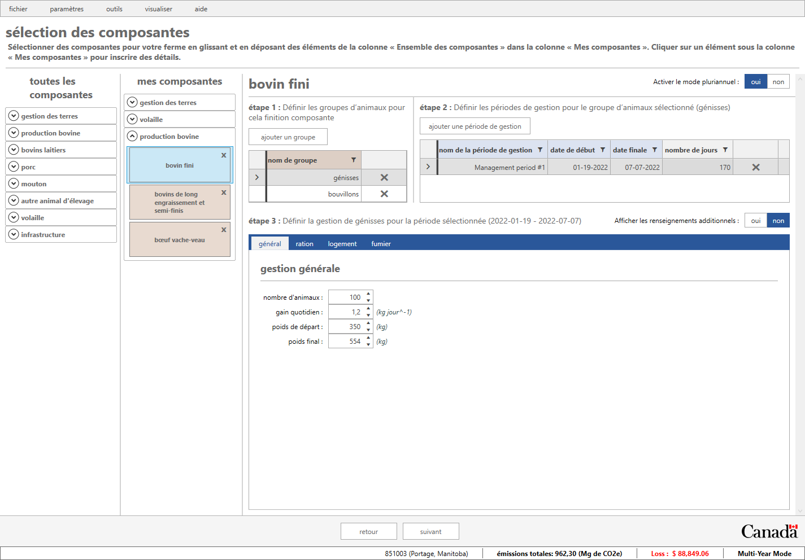
     
    <em>Figure 19 - Exploitation d’un parc de finition</em>

 
 

### Ajout d’un épandage de fumier dans le champ de blé

Holos a la capacité d’ajouter des épandages de fumier à partir de fumier provenant du bétail de la ferme actuelle ou de fumier importé (hors site). Comme nous avons maintenant défini nos composantes animales, nous pouvons épandre du fumier sur n’importe quel champ de notre ferme.

1. Sélectionnez le champ « **Blé et vesce velue** » dans la liste des composantes ajoutées à notre ferme.

2. Cliquez sur l’onglet « **Fumier** », puis sur le bouton « **Ajouter un épandage de fumier** ». Sélectionnez « **Bovins de boucherie** » comme « **Type de fumier** », sélectionnez « **Bétail** » comme « **Origine du fumier** », « **Litière profonde** » comme « **Système de manutention du fumier** », et inscrivez **200 kg/ha** comme quantité de fumier épandue sur ce champ.

3. Il est à noter que les engrais chimiques et le fumier peuvent être épandus sur le même champ.

 

### Ajout de foin/fourrage supplémentaire pour les animaux au pacage

Nous pouvons également ajouter du foin et du fourrage pour les animaux qui broutent dans un champ particulier. Étant donné que nous avons maintenant placé un groupe d’animaux dans la composante de champs « prairies indigènes », et que nous avons également fourni des renseignements sur les récoltes pour nos cultures de mélanges de foin dans la composante de rotation des cultures, nous pouvons ensuite ajouter un supplément fourrager supplémentaire pour ces animaux au pacage.

1. Sélectionnez le composant de champ **prairie indigène** que nous avons créé précédemment.
2. Cliquez sur l'onglet **Pâturage.**
     - Cliquez sur le bouton **Ajouter du foin supplémentaire** pour ajouter du fourrage supplémentaire pour les animaux de ce champ.
     - Entrez "**À la ferme**" comme **Sources de balles**.
     - Choisissez **Rotation des cultures #1 [Champ #2] - Tame Mixed (graminées/légumineuses)** sous **Champ** pour sélectionner la source du foin supplémentaire.
     - Changez le **Nombre de balles** à 1.
     - Entrez **500** comme poids de balle humide.
     - Gardez la teneur en humidité comme valeur par défaut.

 

    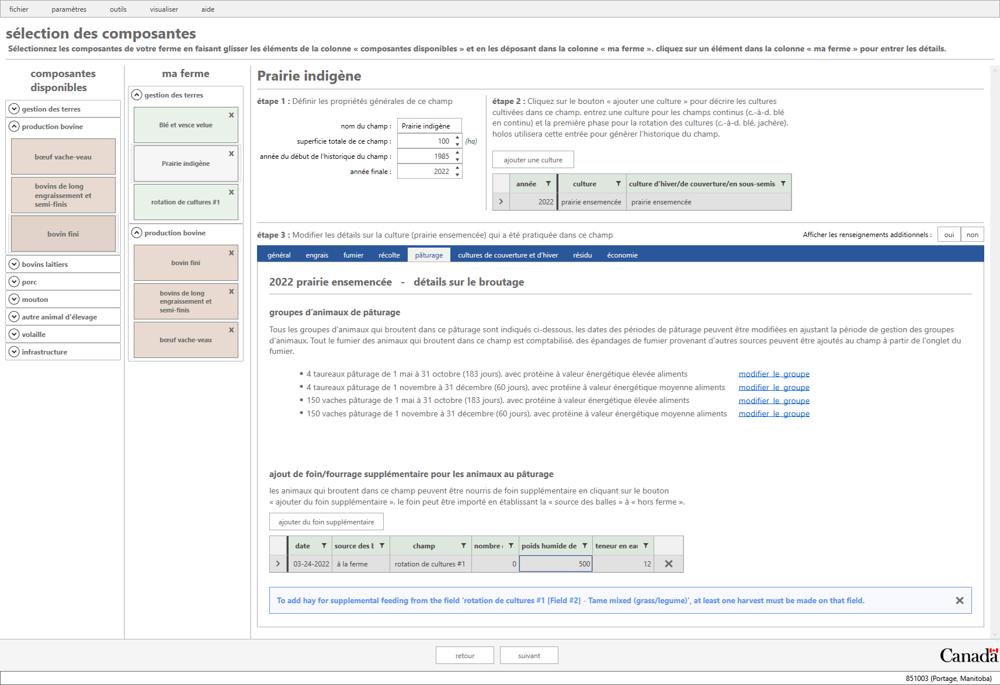
     
    <em>Figure 20 - Ajout de foin/fourrage supplémentaire pour les animaux au pacage</em>

 
 
 

## Exploitation agricole de poulettes

Nous ajouterons une dernière composante animale à notre ferme. En plus des exploitations bovines, nous ajouterons une composante « production de viande de poulet » à notre ferme. Si vous placez le curseur de la souris sur la composante « Production de viande de poulet » dans la catégorie « Volaille », Holos affichera une infobulle qui donne une brève description d’une exploitation de production de viande de poulet :

**« Les poussins qui arrivent dans l’exploitation d’un couvoir multiplicateur sont élevés au poids du marché (1-4 kg) »**

1. Faites glisser une composante « production de viande de poulet » vers la ferme.
2. Cette exploitation compte **400 poulettes et 400 coquelets**.
3. Cliquez sur le groupe « **Poulettes** » pour le sélectionner.
4. Ajuster les trois périodes de gestion pour ce groupe afin qu’il y ait 400 animaux pendant chacune de ces périodes.
5. Le groupe de coquelets a la même gestion que les poulettes. Avec le bouton droit de la souris, cliquez sur le groupe « **Coquelets** » et copiez la gestion du groupe « **Poulettes** ».

 

# Écran Calendrier

Nous sommes en train de terminer la définition de notre ferme. Cliquez sur l’icône « Suivant » pour continuer vers l’écran Calendrier.

L’écran Calendrier présente une vue d’ensemble de tous les champs de 1985 à l’année de fin spécifiée pour chaque champ. Cet écran permet également à l’utilisateur d’ajouter des systèmes de production antérieurs et prévus. Le bouton « **Ajouter un système de production historique** » permet à l’utilisateur d’ajouter un historique de culture différent à des champs individuels, tandis que le bouton « **Ajouter un système de production prévu** » permet à l’utilisateur d’ajouter un système de culture futur (prévu) à des champs individuels.

**Ajout d’un système de production historique**

Nous supposerons que les champs de rotation de l’orge et du mélange de foin étaient auparavant dans un système de culture continue du blé entre 1985 et 2000.
1. Pour ajouter un nouveau système de culture historique, sélectionnez l’un des champs qui font partie de la rotation des grains d’orge et du mélange de foin. Pour sélectionner un élément, cliquez sur la barre de calendrier pour activer ce champ. Nous sélectionnerons le premier champ de cette rotation (c.-à-d. le champ portant le nom « **Rotation de cultures no 1 [Field #1]** »).
2. Cliquez sur le bouton « **Ajouter un système de production historique** » pour ajouter une nouvelle ligne au tableau à la section « **Étape 1** » dans le coin supérieur gauche de l’écran. Vous remarquerez que la mention « Pratique de gestion historique » a été ajoutée.
3. Nous fixerons la fin de cette pratique de gestion historique à l’an **2000**. Pour ce faire, utilisez les boutons numériques haut/bas dans la cellule.
4. Cliquez ensuite sur le bouton « **Modifier les éléments sélectionnés** ». Un nouvel écran s’affichera qui nous permettra d’ajuster les cultures et la gestion pendant cette période.
5. Cliquez sur « orge » à la section « **Étape 2** ». Changez le type de culture à « Blé » et, à l’onglet « Général », changez le rendement à **3 500 kg/ha**. Les autres paramètres resteront inchangés.
6. Nous devons également retirer les cultures de « mélange de foin » de cette période historique. Cliquez sur l’icône « **x** » à côté de chacune des cultures de « **mélange de foin** » à l’« **Étape 2** ». Cliquez sur l’icône « **x** » pour supprimer ces cultures de la rotation pour cette période.
7. Cliquez sur « **OK** » pour enregistrer les changements que nous venons d’apporter à ce champ.
8. Répétez ces mêmes étapes pour que les autres champs de cette rotation aient également du blé continu de 1985 à 2000 en utilisant les mêmes étapes que pour le premier champ.

 

    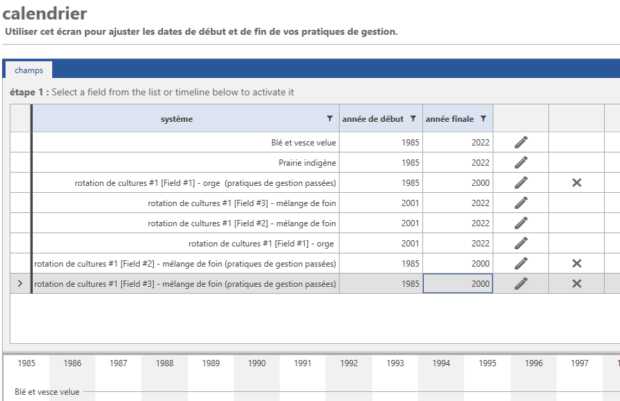
     
    <em>Figure 21 - Écran Calendrier personnalisé </em>

 
 

 

    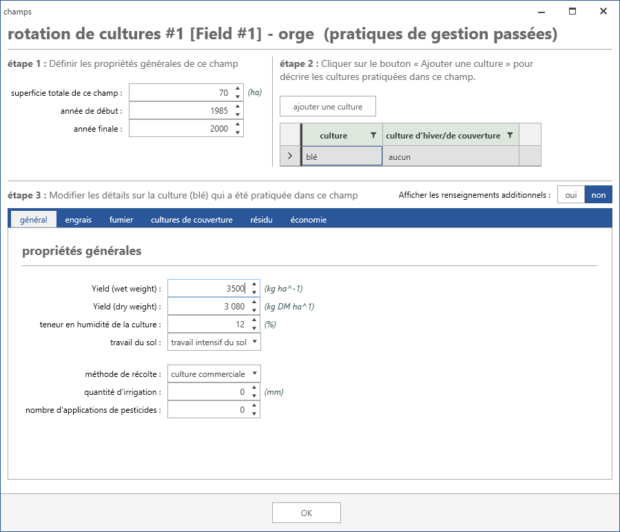
     
    <em>Figure 22 - Définir l’année de début et de fin pour les systèmes de production dans l’écran Calendrier.</em>

 
 

    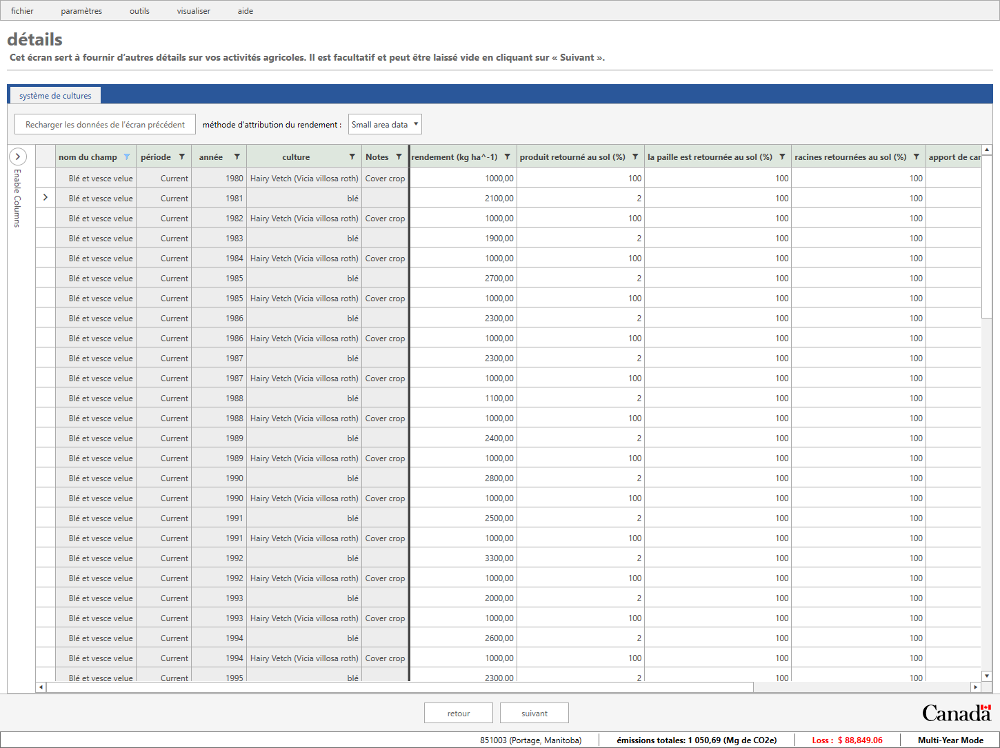
     
    <em>Figure 23 - Modification des cultures au cours d’une période historique de rotation</em>

 
 

 

# Écran Détails

Cliquez sur le bouton « Suivant » pour aller à l’écran Détails.

Pour éviter qu’un utilisateur doive fournir les rendements des cultures remontant à 1985 pour chaque champ de la ferme, le modèle utilisera les rendements des cultures déclarés par Statistique Canada comme valeurs par défaut (le cas échéant). Le modèle permet à l’utilisateur de calculer comment les changements dans le type de culture, le rendement, le travail du sol, la gestion des résidus, le fumier, l’irrigation ou les jachères entraîneront des changements dans le carbone du sol.
Nous ajusterons cette grille afin de pouvoir voir les intrants de carbone en surface et sous la terre pour notre champ de blé, puis nous ajusterons le rendement des cultures pour une année donnée.

1. Nous établirons un filtre dans la première colonne intitulée « **Nom du champ** » afin d’afficher uniquement l’information pour notre champ de blé et de vesce velue. À côté de l’en-tête de la colonne, cliquez sur l’icône en forme d’entonnoir pour définir un filtre. Cochez la case à côté de « **Blé et vesce velue** ».

2. À l’extrême gauche de cet écran, cliquez sur la barre latérale « **Activer les colonnes** » (située près de la colonne « **Nom du champ** »).

3. Cochez la case « **Intrants de carbone en surface** » pour afficher la colonne et décochez la case à côté de la colonne « **Notes** » pour la masquer.

4. Cliquez de nouveau sur la barre latérale « **Activer les colonnes** » pour la réduire.

5. Nous pouvons maintenant (en option) ajuster les rendements de notre champ de blé pour une année donnée si les rendements mesurés réels sont disponibles.

6. Définissez le rendement pour **1987 à 4100 kg/ha**.

7. Veuillez noter que Holos a mis à jour les intrants de carbone en surface à cette fin.

 

    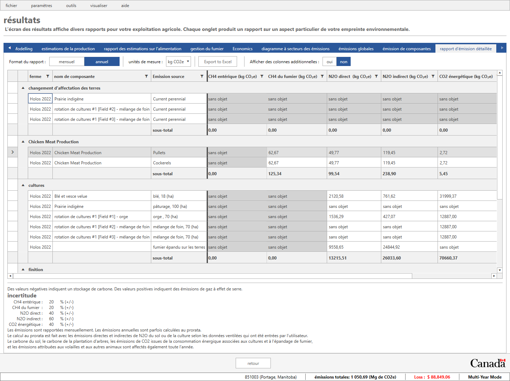
     
    <em>Figure 24 - Écran Détails</em>

 
 

 

# Découvrir les résultats

Cliquez sur le bouton « Suivant » pour aller au rapport final des résultats. Les résultats seront maintenant affichés dans divers rapports et graphiques.

1. Cliquez sur l’onglet intitulé « **Diagramme circulaire des émissions** ». En commençant par le « **graphique circulaire des émissions** », nous pouvons voir une répartition globale des émissions de CH4 entérique, CH4 du fumier et les émissions directes et indirectes de N20. Nous sommes également en mesure de voir une répartition détaillée des sources de ces émissions.

2. Cliquez sur le bouton « **Oui** » à côté de « **Afficher les détails** ». Nous pouvons voir que la principale source d’émissions de notre ferme est la composante Exploitation de naissage. Si vous pointez la souris sur n’importe quelle coupe de ce graphique, vous pouvez obtenir un aperçu isolé des différentes sources d’émission.

3. Cliquez sur l’onglet intitulé « **Rapport détaillé des émissions** ».

Le « **Rapport détaillé sur les émissions** » affichera un rapport mensuel ou annuel sur les émissions de GES.

Le rapport détaillé sur les émissions portera sur le méthane entérique, le méthane du fumier, les émissions de N2O directes et indirectes et les émissions de CO2 de la ferme.

Cliquez sur le bouton « **Format du rapport (mensuel)** »  pour passer à un rapport mensuel. Nous pouvons maintenant voir une répartition mensuelle de toutes les émissions de la ferme et de la source des émissions.

Dans le menu déroulant « **Unité de mesure** », vous pouvez choisir d’afficher les résultats sous forme d’équivalents de CO2 (éq. CO2) ou de gaz à effet de serre non convertis (GES), et vous pouvez également choisir l’unité de mesure sous forme de tonnes ou de kilogrammes.

Le rapport « **Estimations de la production** » fournit les rendements totaux des récoltes, la quantité de terres sur lesquelles du fumier a été épandu et les estimations de la production laitière pour les composantes laitières.

Le rapport « **Estimations sur l’alimentation** » fournit une estimation de l’ingestion de matière sèche en fonction des besoins énergétiques de l’animal et de l’énergie contenue dans l’aliment.

 

    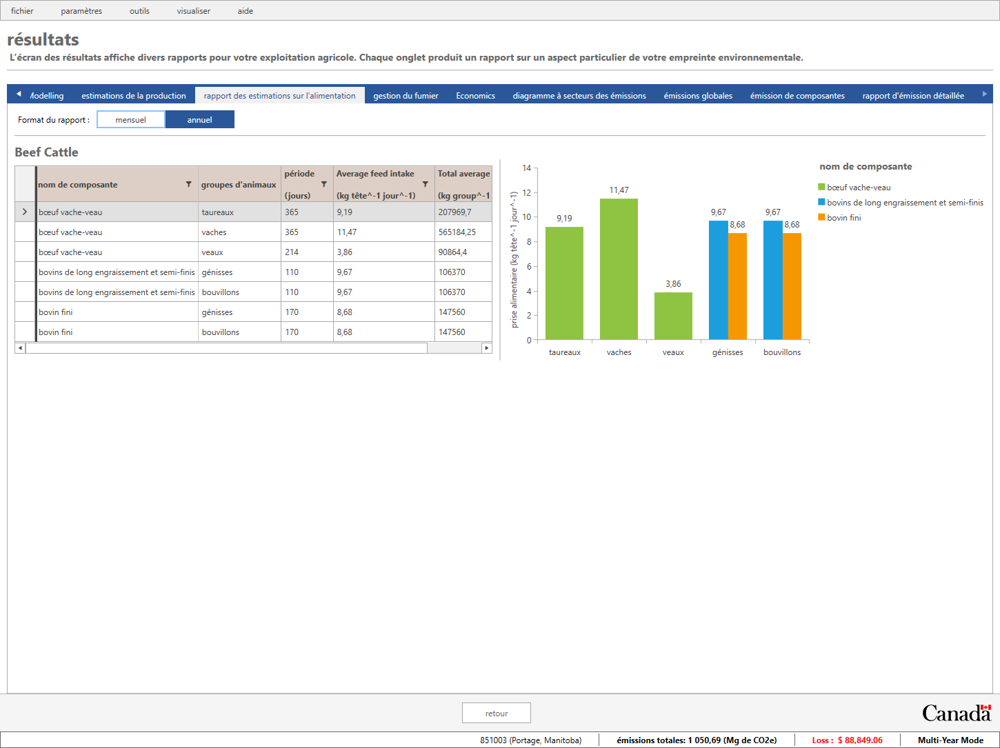
     
    <em>Figure 25 - Rapport détaillé sur les émissions</em>

 
 

 

    
     
    <em>Figure 26 - Rapport d’estimation des aliments du bétail</em>

 
 

## Résultats de la modélisation du carbone dans le sol

À l’écran des résultats, nous pouvons voir l’évolution du carbone dans le sol au fil du temps en cliquant sur l’onglet « **Modélisation pluriannuelle du carbone** ». Cet onglet affiche un graphique montrant l’évolution du carbone dans le sol au fil du temps pour chacun de nos champs.

Pour chaque champ sur le graphique, vous pouvez passer votre souris sur la série pour obtenir plus de renseignements sur chaque année historique du champ.

Si vous cliquez sur l’un de ces points, vous pouvez alors voir une répartition plus détaillée de ces résultats. Vous pouvez également exporter ces données en cliquant sur le bouton « Exporter vers Excel ».

 

    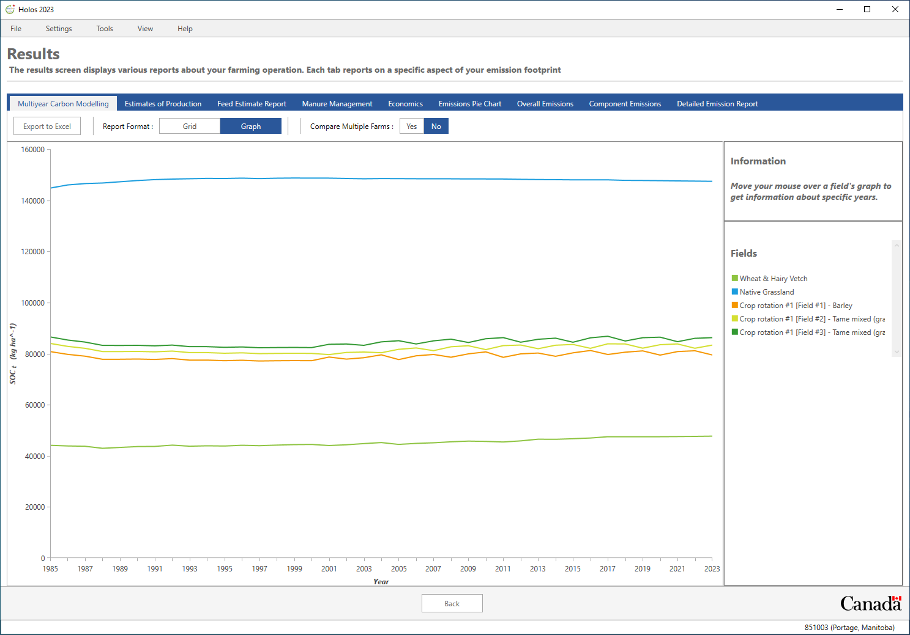
     
    <em>Figure 27 - Modification du format du rapport en mode pluriannuel.</em>

 
 

# Finalement…

**Approche intégrée** 

Un écosystème est composé non seulement des organismes et de l’environnement où ils vivent, mais également des interactions des organismes avec leur milieu et entre eux. L’approche intégrée vise à décrire et à comprendre le système entier comme un ensemble intégré et non comme un ensemble de composantes distinctes – le tout plutôt que la somme des parties. Cette approche holistique peut être très complexe et il est difficile d’en décrire le processus. Une façon de conceptualiser un système entier est de recourir à un modèle mathématique. Cette approche intégrée permet de s’assurer que les effets des changements de gestion, à l’échelle du système entier, influent sur les émissions nettes des fermes. Dans certains cas, la réduction des émissions d’un GES entraîne une hausse des émissions d’un autre GES. L’approche intégrée permet d’éviter d’adopter des pratiques potentiellement inopportunes fondées sur les préoccupations à l’égard d’un seul GES.

Pour télécharger Holos, obtenir de plus amples renseignements ou accéder à une liste récente des publications concernant Holos, visitez le site :
www.agr.gc.ca

Pour nous joindre, envoyez un courriel à : Holos@agr.gc.ca