

 
     

# Chapter - 1 Introduction

To install Holos navigate [here](https://https://aafc-holos.s3.amazonaws.com/setup.exe) on the web.  Click on the specified zip file to download it. Once downloaded, navigate to your downloads folder, and double click the installer named **setup**.  You will be asked if you would like to install the application, click **install**.

 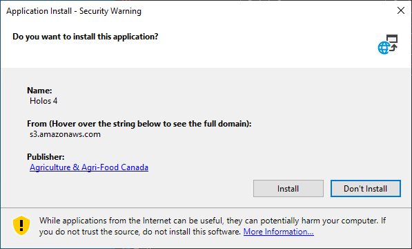
     
    <em>Figure 1.1: The install screen for Holos 4.</em>

The installation will take several minutes to complete, you can do other things on your computer while you wait for it to install.

 
     
    <em>Figure 1.2: Loading bar for Holos install.</em>

Once the install is complete Holos should begin immediately, greeting you with a disclaimer shown below.

 
     
    <em>Figure 1.3 Holos disclaimer on startup.</em>

You can access Holos from the Windows start menu. Open the start menu, Holos should be found under in a folder labeled AAFC-AAC.

 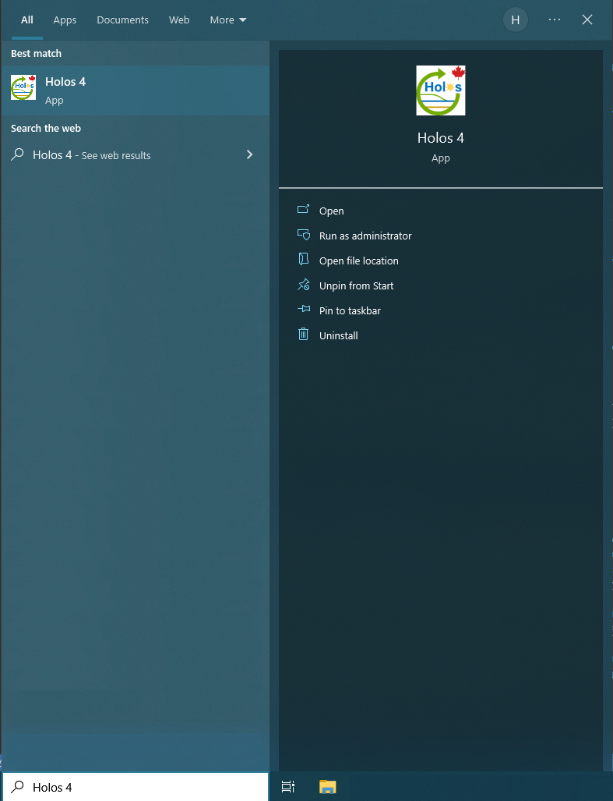
     
    <em>Figure 1.4: Holos in the start menu.</em>

If you already have Holos 3 on your computer, it will not interfere with Holos 4.  It is important to keep in mind however that Holos 4 is not backwards compatible with version 3. Any work saved in Holos 3 will not carry over to Holos 4.

For a quick demonstration of how to install Holos from start to finish you can also watch our video on YouTube , simply follow this link : [Holos Install](https://www.youtube.com/watch?v=V5jXTIq8558)

 
 

# Chapter 2 -  Starting Holos

Holos operates in one of two modes called “Basic” and “Advanced”.  As their names imply, they tailor the Holos experience for different needs.  If you do not need all the functionality that Holos offers and would rather get a summary of your farm’s emissions, then it is recommended to use the “Basic” mode.  If you want to get the most out of Holos with detailed results, then the “Advanced” mode is for you. 

Holos can handle multiple farms created by the user, each representing different farming scenarios for example.  The user can experiment with what management practices do well together or determine what crops to grow together based on their potential yield and green-house emissions. 

 

## Creating a new farm

1. On every Holos start-up you either create a new farm or open an existing farm or import a farm from file.  Figure  2.1 displays the interface you are greeted with on every start-up. Your initial start-up of Holos after installation will skip this screen and send you to step two, automatically selecting “New” for you, to begin the creation process. 

 

 
     
		<em>
			Figure 2-1: Create a new farm or open an existing farm selection screen or import from a file.
			 
			 A: Click “New” to create a new farm.
		</em>

 

2. Please enter a name for the farm you would like to create in the “Name” section and add any additional comments in the “Comments” section. Once you have named your farm you must specify what mode you would like to operate Holos under, either “Basic” or “Advanced” mode.  When you are finished, click the “OK” button to proceed.

 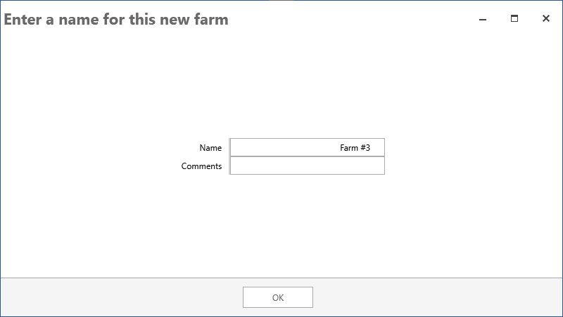
     
    <em> Figure 2.2 Entering name, comments, and selecting operating mode.</em>

3. If you chose “Advanced Mode” you can choose “Metric” or “Imperial” from the drop-down list (“Basic Mode” will skip this step and set your units to “Metric” for you). After you have chosen your unit of measurement, click the “Next” button on the bottom of the screen to proceed (figure 2.3).

 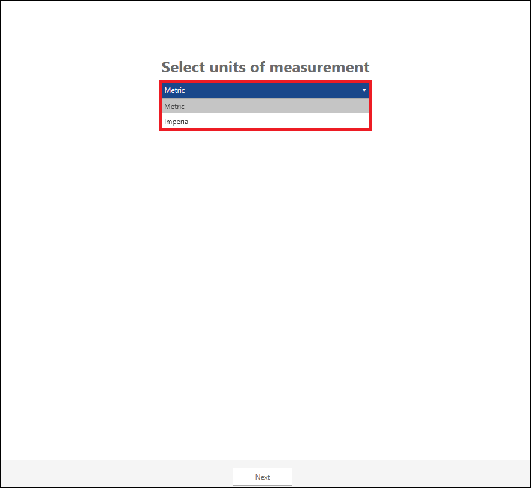
     
    <em>Figure: 2.3 Unit of Measurement Selection Screen. 
	 
	A: Please select a unit of measurement using the drop-down menu.</em>

4. Select your province from the drop-down list and click “Next” on the bottom of the screen.

 
     
		<em>
			Figure: 2.4 Province Selection Screen. 
			 
			 A: Please select your Province with the drop-down menu here. 
			 
			 B: Click here once you have selected your Province.
		</em>

 

## Selecting farm location

1. On your screen, you will now see many regions for the province you selected. Each specific region is shaded in red.  You can adjust the magnification (i.e. zoom in/out) of the map by using your mouse wheel or by selecting the magnifying glass near the bottom of the screen. Please select the location of your farm by right-clicking on one of the regions (see figure 2.5). 

 

 
     
    <em>Figure: 2.5 Hovering the mouse cursor over the regions on the map will display a tool tip near you mouse pointer.</em>

 

2. When you have successfully clicked on one of the regions, Holos will download the climate data directly from NASA.  A progress bar will display the progress in downloading the data, it should only take a few seconds.   The details of that region will be displayed on the right side of the screen (Only for “Advanced Mode” see figure 2.6). You will see the location details, soil and hardiness zones, and climate details for the location you have selected. 

 

 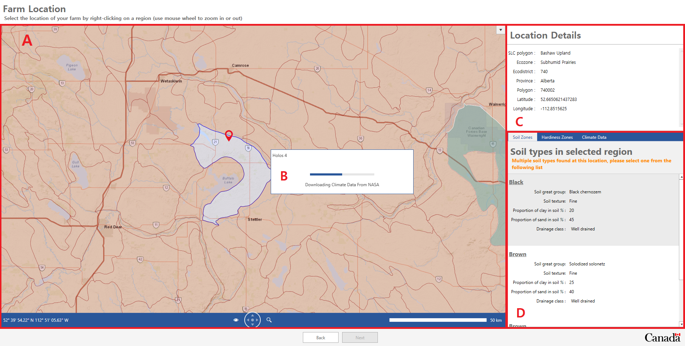
     
	<em>
		Figure: 2.6 Farm Location Selection Screen. 
		 
		A: Select the location of your farm in this section.
		 
		B: The progress bar for downloading climate data from NASA.
		 
		C: The details of the location you have selected will appear here and includes the ecodistrict, province and polygon number.
		 
		D: The details of the soil zones, hardiness zones and climate details for your chosen location will be shown here.
	</em>

 

3. If the region you have selected has multiple soil types, please select the appropriate option for your farm based on either the predominant soil type in your area or the location of farming activities/management practices. The selected option will appear darker to indicate that it has been selected. 

 

 
     
    <em>Figure: 2.7 Soil Zone Selection.</em>

 

4. If the region you have selected has multiple hardiness zones, please select the appropriate option for your farm. The selected option will appear shaded to indicate that it has been selected. To see the list of hardiness zones, please click on the tab at the top that says, “Hardiness Zones”.

 

 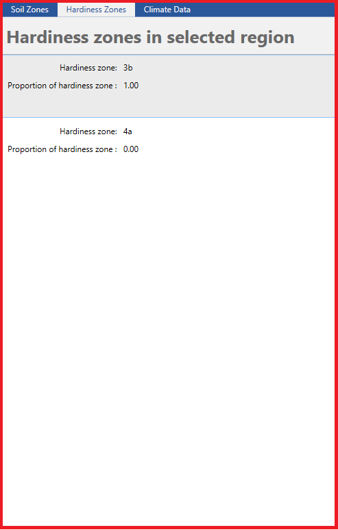
     
	<em>
		Figure: 2.8 Hardiness Zone Selection. 
		 
		A: Select the Hardiness Zone Tab, Soil Zone Tab, or the Climate Data Tab to see the available options.
		 
		B: Please select your hardiness zone here.
	</em>

 

5. Each region you select has access to the climate data.  Holos will load the appropriate climate data by default should you choose to ignore this tab.  If you would like to load custom data, you can load your own data from a file with “**.csv**” extension.  Holos will confirm your custom data is loaded

 

 
     
	<em>
		Figure: 2.9 Climate Data Tab. 
		 
		A: Load your custom climate data file by clicking the button.
		 
		B: A loading bar will show up while the data is being loaded.
		 
		C: If successful, you'll see a confirmation message.
	</em>

 

6. When you are finished selecting your soil type, hardiness zone and climate data, click “**Next**”.

 

## Formatting the custom climate data file

In order to import your own climate data into Holos, the file must be a Comma Separated Values (CSV) and have the “.csv” file extension. The file must also contain the following columns:

* **Year** – The year the climate data is from.
* **Julian day** – The day based on the Julian Calendar.
* **Mean daily air temperature** – The mean temperature of that day.
*	**Mean daily precipitation** – The mean precipitation of that day.
* **Mean daily potential evapotranspiration (PET)** – The mean potential evapotranspiration of that day.

 

 
     
    <em>Figure: 2.10 custom climate data file format.</em>

 
 

# Chapter 3 - User Toolbar

When you are selecting your components for your farm, at the top of the screen are options available for you to manage your farms. There are five options currently available: **File**, **Settings**, **Tools**, **View**, and **Help**.

 

## File Tab
In the “**File**” tab there are several options to manage your farm(s) files as shown below

 

 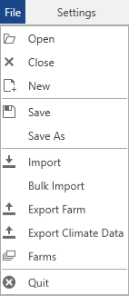
     
    <em>
		Figure 3.1: Holos File Tab Toolbar 
		 
		These are options available for the user to manipulate the files associated with Holos.
	</em>

 

### New Farm

#### Creating a New Farm
- To create a new Farm file, click “New” under the “File” tab. This will allow you to create a new Farm following the steps in the sections “[Creating a New Farm](#creating-a-new-farm)” and “[Selecting a Farm Location](#selecting-farm-location)”. 
- 	If you do not know how to create a new farm, click here: [How to Create a New Farm](#creating-a-new-farm)
- 	If you do not know how to open a pre-existing farm, follow the instructions under **"Opening/Closing Files"**.

 

### Opening/Closing Files

#### Opening
1.	If you have saved previous farm files, you are able to open them by clicking “**Open**” under the “**File**” tab. 
2.	After you have clicked “**Open**”, a list of Farms that you have previously made will be shown with details such as the **Farm Name**, **Comments**, **Date Created** and **Date Modified.**
3.	The details of your farms can be **sorted by clicking on each header**. For example, by clicking on “**Name**” the Farm files will be sorted alphabetically and **the type of sort will be indicated by an up or down arrow** located beside the header name. **For example**, if we want the name of the farms to be sorted from A-Z, then click the “**Name**” header until an up arrow appears and vice-versa.

 

 
     
    <em>
		Figure 3.2: Open Farm Selection
		 
		A: A display of all the pre-existing farms available in Holos.
		 
		B: Click on any of the data headers to sort the farms alphabetically.
		 
		C: Displays the type of sort that has occurred on the list of farms. Up = A-Z, Down = Z-A.
	</em>

 

4. If you would like to **filter your farms more extensively** (i.e. a more detailed search), beside each header is a **funnel icon** that you can click. A window will pop up indicating options for you to filter the header you have chosen.

 

 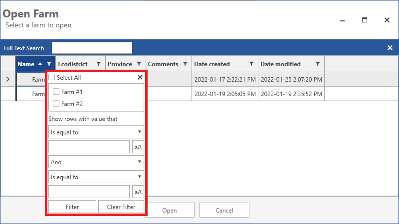
     
    <em>
		Figure 3.3: Additional Filtering For Farms Available For Each Data Header.
		 
		Click on the funnel icon beside the header to apply additional filtering.
	</em>

 

5.	If you would like to **search the list of farms for a keyword**, there is a section at the top of the window called “**Full Text Search**”. Enter the word you would like to search and the results pertaining to that word will be highlighted

 

 
     
    <em>
		Figure 3.4: Full Text Search Option
		 
		A: Enter the text you would like to search for in the box.
		 
		B: The results of the search will be highlighted as shown here.
	</em>

 

6. Select the farm you would like to open by clicking on one of the options. The selected farm will appear darker and will be indicated by a “>” on the left. To open the file, click “Open” at the bottom of the screen.

 

 
     
    <em>
		Figure 3.5: Opening A Farm.
		 
		A: Select one of the farms in the list here.
		 
		B: Click here to open the farm that you have selected.
	</em>

 

#### Closing

- To **close a file**, click “**Close**” under the “**File**” tab. This will automatically save your farm and exit the file and bring you back to the main screen where you can **create a new farm** or **open a pre-existing farm file**.

 

### Exporting/Importing Farm Configuration Files

You can export your farm configuration files to a JSON file (file extension ‘. json’) and then import them into Holos running on a different computer.  This only works for Holos 4, you cannot import old files from Holos 3 into Holos 4 and vice versa.

 

#### Exporting

1.	To export a file, click on the “**Export**” icon under the “**File**” tab. This will open a window where you can see a list of farms that you can export. 
2.	You can **add a description** to each farm or modify the name of the farm by clicking on the appropriate box and modifying its contents. 
3. Click on the **farm**(s) you would like to include and click “**Export**” at the bottom to **choose a location for your exported file. The selected farm(s) will appear shaded*.*

 

 
     
    <em>
		Figure 3.6: Exporting a farm
		 
		A: list of farms available to export. Select the farm(s) you would like to export by clicking anywhere in their row.
		 
		B: A row corresponding to a farm, you can modify any of the data values here such as the name and description.
		 
		C: Click here after you have chosen your farm(s) you would like to export.
	</em>

 

4.	After you have selected your farm(s) and have clicked the “**Export**” button. You will be prompted to **choose a location where you would like the file to be created**. 
5.	You can **navigate** through your system with the tabs on the left side of the screen. 
6.	You can also **add a new folder** in the current location by **clicking on the “New Folder” button** at the top left of your screen. 
7.	You can **modify the name** of your file by **clicking in the section where it says “File name:”** at the bottom of your screen.
8. Click “**Save**” to finish once you have selected a location

 

 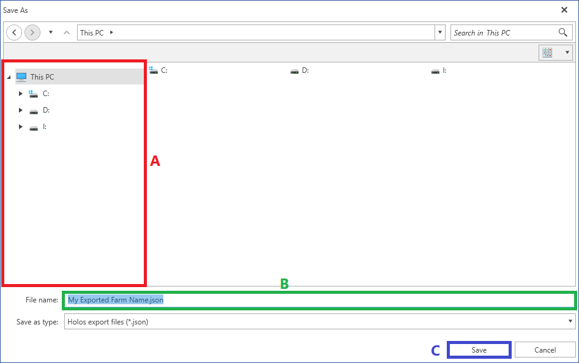
     
    <em>
		Figure 3.7: Choosing A Location To Export The Chosen Farms.
		 
		A: Navigate through your computer using this section.
		 
		B: Customize the name for your exported farm(s) here.
		 
		C: Click “Save” to finalize the exporting of your farm(s).
	</em>

 

#### Importing

1.	To import your farm(s), click “**Import**” under the “**File**” tab. This will open a window (shown below) were you can see the locations of files on your computer. 
2. Navigate to the file you would like to import into Holos and select the file by clicking on it. Then, click “**Open**”.

 

 
     
    <em>
		Figure 3.8: Choosing the farm(s) to import.
		 
		A: Navigate through your computer here.
		 
		B: Select the file which contains the farm(s) you would like to import.
		 
		C: Click “Open” to choose the farm(s) you would like to import.
	</em>

 

4.	After the file has been opened, a window will pop up displaying the list of farms in that file, **select the farm(s) that you would like to import by clicking anywhere in their sections**.  They are selected when the box becomes a darker shade.
5.	Click “**Import**” to proceed

 

 
     
    <em>
		Figure 3.9: Selecting Farm(s) to Import.
		 
		A: Click anywhere in the row of the farm(s) you would like to import. You can select more than one farm.
		 
		B: Click Import to import the farm(s) you have selected.
	</em>

 

#### Bulk Importing

1.	To import farms from more than one file select “**Bulk Import**”.  A window will open where you can select the folder that contains your files.
2.	Navigate to the folder(s) where you store your exported farms.  You can select multiple folders should your files be separated into different folders.  To select multiple press and hold CTRL key while clicking on the folders. When you have selected the folder(s), click “**Open**”.  If you do not select any folders Holos use the current working folder as the folder to open. 
3.	Continue with steps 3 and 4 from [Importing](#importing). 

 

 
     
    <em>
		Figure 3.10: Selecting Farm(s) to Import from multiple folders.
		 
		A: The selected folders containing exported farm files.
		 
		B: The current working folder where the export data/folders is located.
		 
		C. Click 'Open folder' to open the selected folder(s).
	</em>

 

#### Save As

1.	If you already have a farm created but you would like to save it under another name and change it from there you can select “Save As”.  Like other products you might use “Save As” is a way of creating a copy.  Simply select “Save As” from the “File” tab and enter a name to save your new farm under.  
2.	Holos will warn you if the name already exists and will prompt you to change the name.
3.	You can now access this newly copied farm the same way you would open a farm from the “File” tab.

 

### Managing Farms

In this section, you can see all the farms that are in the current file you are working on. You will see a list of each farm and their information. **You can remove your farms in this tab and modify some of their information.**

1.	Click on the “**Farms**” icon under the “**File**” header at the top of the screen.
2.	A window will pop up displaying each farm in the file. Each section of the farm such as **Name, Comments, Date Created and Date Modified** can be changed by clicking on the appropriate box and modifying its contents
3. To **remove a farm**, select the farm you would like to remove by clicking on it and then click the “**Remove**” button at the bottom of the screen

 

 
     
    <em>
		Figure 3.11: Managing Farms Screen.
		 
		A: A list of farms.
		 
		B: After you have selected a farm, if you would like to remove that farm, click “Remove”.
	</em>

 

## Help Tab

Under the “**Help**” tab, there is the option to “**Send Feedback**”, view “**About Holos**”, or view the “**Disclaimer**”.

 

 
     
    <em>
		Figure 3.12: Help Menu Display.
	</em>

 

### Send Feedback

1.	Click on “**Send Feedback**”.
2.	 You will be presented with form requesting certain information such as: first name, last name, reason for feedback and user feedback

 

 
     
    <em>
		Figure 3.13: Send Feedback Form.
		 
		A: Should the Holos team need to contact the user, they will have the individual's full name.
		 
		B: Checkbox for opting into taking a very short user experience survey.
		 
		C: The type of feedback the user is providing.
		 
		D: Which component of the application would the user wish to give feedback for?
		 
		E: Enter User feedback in this area.
	</em>

 

4.	There is the option to offer feedback on user experience (how easy was it to use the application?) this is completely optional and can be left unchecked.
	* Should you wish to check this box you will be asked to select your experience with the program ranging from “**very easy**” to “**very difficult**” using a range of buttons. 
	
	* Once your choice is selected you can explain your experience.

 

 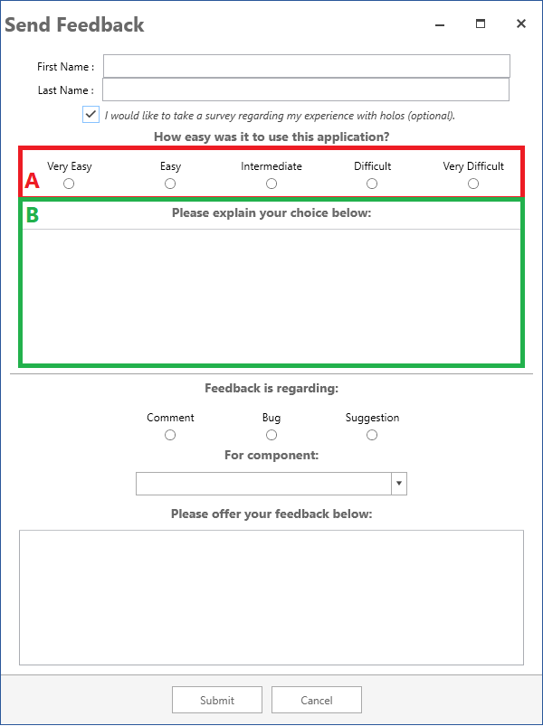
     
    <em>
		Figure 3.14: Send Feedback Form with Optional Survey Displayed.
		 
		A: The choices the user can select to record their experience.
		 
		B: The user can elaborate on their selection from part A in this section.
		 
		NOTE: If the User selects this option, the entire survey MUST be completed for a valid submission.
	</em>

 

4.	When you have completed the entire form press “**Submit**”. If you wish to quit the form and not submit your feedback, click “**Cancel**”.
5.	Your default email application will open with a message complete with destination address, subject, and body 
6.	Press “**send**”.

 
 

# Chapter 4 - Settings

Under the “**Defaults**” header, there are three options available: **Farm Details, User Settings and Crop Defaults**.

 

 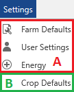
     
    <em>
		Figure 4.1: Defaults Options
		 
		A: A list of options available to set the defaults for your operations.
		 
		B: Allows the user to set custom default values for individual crops.
		 
		C: Option to show results in single or multi-year format.
	</em>

 

## Farm Details

1.	Click on the “**Farm Details**” icon
2.	Here, you will be able to set certain default settings for your farm such as: **Farm**, **Soil, Precipitation, Temperature, Evaporation, Soil N2O breakdown, Default Bedding Composition, and Default Manure Composition**. Select the category you would like to modify the default settings for.
3. Each category has its own set of input fields for you to populate. **Every time you create a new farm in this file, it will have these default settings.**

 

 
     
    <em>
		Figure 4.2: Farm Details Selection.
		 
		A: The different defaults available.
		 
		B: The specific default settings corresponding to the category you have selected that can be adjusted.
	</em>

 

In the farm details section, the farm details categories are:

- **Farm**: Defaults related to general farm  information
- **Soil**: Soil defaults including texture, thickness etc.
- **Precipitation**: Monthly precipitation averages for  the farm
- **Temperature**: Monthly temperature averages
- **Evapotranspiration**: Monthly evapotranspiration values of the farm
- **Soil N2O breakdown**: Monthly emissions distribution for the year
- **Default bedding composition**: Default bedding material for beef, dairy cattle, swine & poultry
- **Default manure composition**: Manure types and default composition
- **Farm manure application**: Summary of all the manure applications across different fields in the farm.

 

## User Settings

The default data for this screen is based on information found in the algorithm document which can be read here.
1.	Click on the “User Settings” icon
2.	Here, you will be able to set certain user default settings such as: Carbon concentration (kg kg^-1), Emergence day or Soil Top Thickness (mm). 
3.	Click “OK” to save the changes to your User Settings

 

 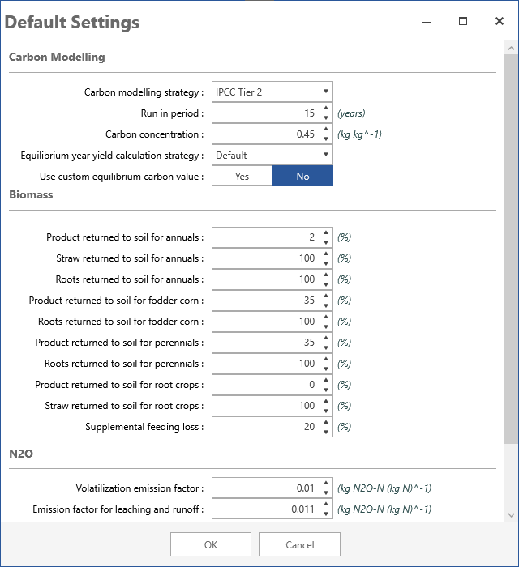
     
    <em>
		Figure 4.3: User Default Settings
		 
		The specific user default settings that can be adjusted for **all farms.**
	</em>

 

## Energy
-	The energy tab displays the conversion of energy from the farm (electricity, diesel, production) into greenhouse gas emissions.
-	The energy tab provides the amount of energy used for each available farm component.

 

 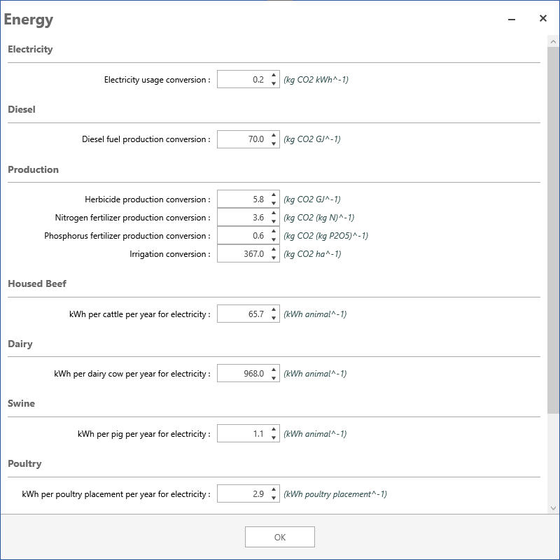
     
    <em>
		Figure 4.4: - Energy Settings
	</em>

 

## Crop Defaults

1.	Select “**Crop Defaults**” 
2.	This view allows you to specify default values for each crop that you might come across in Holos.  For example, every time you enter barley as the crop in a field component, Holos will use the values recorded here to complete its calculations.
3.	To **edit a crop** select it from the left scroll area. Click “**Yes**” under “**Step 2**” if you would like to customize the default values.

 

 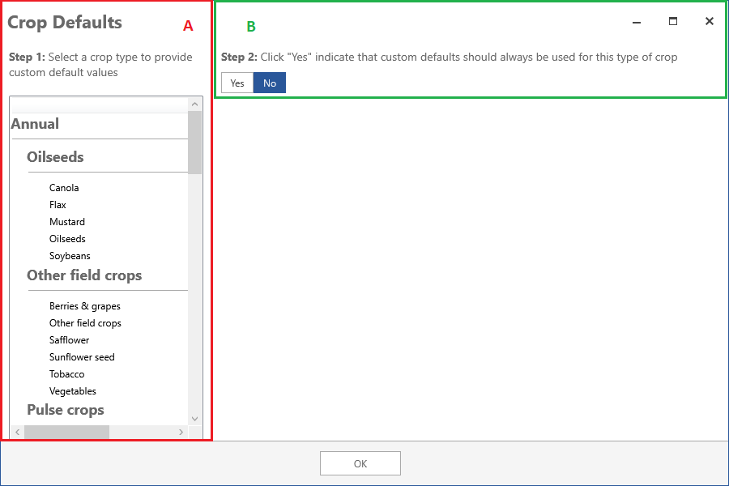
     
    <em>
		Figure 4.5: Crop Defaults
		 
		A: Step 1. Select a crop type for which you'd like to supply custom default values.
		 
		B:Step 2. Select 'Yes' if you always want to use custom values for this crop.
	</em>

 

4. If you select '**Yes**' in **Step 2**, a new section will appear that indicates the custom default values you can set.

 

 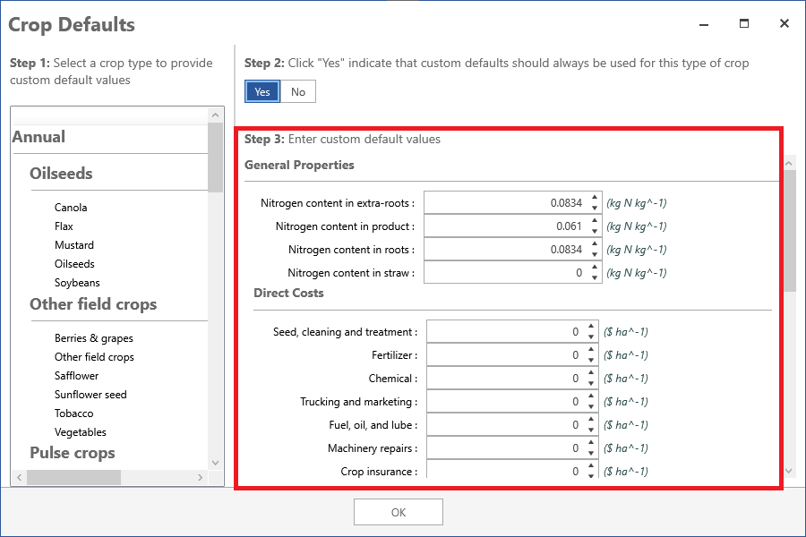
     
    <em>
		Figure 4.6 - Step 3 section.
		 
		This section appears when the user selects 'yes' in Step 2.
 	</em>

 

## Single and Multi-Year Model

-	Holos works with a farm under two modes, **Single Year** and **Multi-Year.**  Basic Mode is just **Single Year** with some buttons and menus hidden for simplicity.  Holos starts any farm in **Single Year Mode (SYM)** by default.  As the name suggests **SYM** only gives data for a single year.  **Multi-Year Mode (MYM)** enables an **advanced carbon modelling system** over a period from 1985 to present.  
-	**SYM** is the simplest mode to use Holos, simply add components to your farm and press “Next” to load the results. This is the default mode when a new farm is created in Holos.
-	MYM changes the interface of certain components (see figure 4.6). 

 

 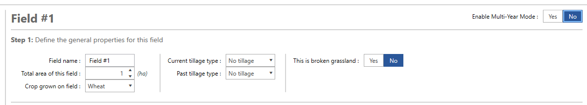
     
    <em>
		Figure 4.7: - A field component properties in single year mode.
 	</em>

 

 

 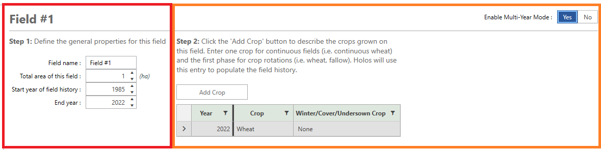
     
    <em>
		Figure 4.8: - A field component properties in multi year mode.
 	</em>

 

-	**MYM** will change the flow of Holos,  instead of the normal steps taken by **SYM**, in **MYM** you must add components to your farm and then navigate to the timeline screen. From that screen, depending on the settings, then go through the details screen and finally arrive at the results section.
-	You can toggle SYM or MYM in “**Settings**” or by clicking “**Yes**” beside “**Enable Multi-Year Mode**” in the component selection screen.
The bottom of Holos will display the current working mode either SYM or MYM.

 

 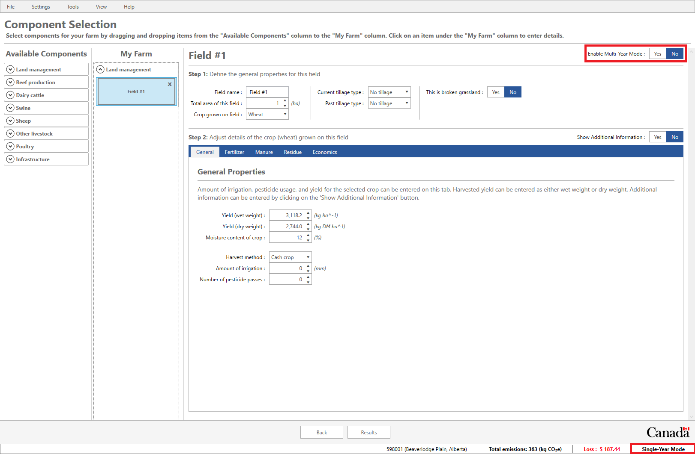
     
    <em>
		Figure 4.9 - The current year mode is displayed in the bottom right corner.
	 	 
		A: The year mode change toggle.
		 
		B: The current year mode.
 	</em>

 
 

# Chapter 5 - Tools

Under the “**Tools**” header, you can create a custom diet for your chosen livestock

 

 
     
    <em>
		Figure 5.1 - Custom Diet Creator Tool
	</em>

 

## Custom Diet Creator

-	With the custom diet creator, you can **create diets for each animal type that you have on your farm**. This will include details about the diet such as: Forage (%), Starch (% DM), and Fat (% DM).
- After selecting a specific diet creator, a new window will pop-up which will allow the user to create a custom diet for their chosen livestock.
-	You can **display default diets** by clicking on “**Yes**” beside the “**Show Default Diets**” section. 
-	To **create a Custom Diet**, click “**Add Custom Diet**” at the top of the window.
 

### Creating A Custom Diet

1.	Click on “**Add Custom Diet**”
2.	For each diet that is added, it will be displayed underneath the “**My Custom Diets**” section. You can change the name, the animal type and any field associated with that diet. 
3.	Each diet contains a list of “**Feed Ingredients**” and is shown on the right of your screen. The Feed Ingredients will be used to calculate the data for your custom diet.
4.	Add feed ingredients to your diet by selecting from the feed ingredient list
5. If you do not know how to add a feed ingredient, follow the instructions in the next section titled, **How To Add A Feed Ingredient To My Diet**

 

 
     
    <em>
		Figure 5.2 - Creating A Custom Diet.
	 	 
		A: A list of diets (may include default diets) and their corresponding data.
		 
		B: Add a new custom diet. This will be shown in the current diet list.
		 
		C: Toggle that handles whether to display default diets.
		 
		D: Click the 'X' button to delete a custom diet row.
		 
		E: A list of the feed ingredient(s) associated with the diet you have selected in the list of diets in section A.
		 
		F: The current total percentage of all the feed ingredient(s). This total must equal 100(%).
	</em>

 

### Adding Feed Ingredients

1.	**Select the diet** you would like to add a feed ingredient to or select  “**Add Custom Diet**” to add a new diet.
2.	**Click on the feed ingredient** you would like to add under the “**Step 2**” section. You can modify the data associated with the selected ingredient by clicking on the box of the data field you would like to modify. The selected ingredient will shaded.
3.	Click on “**Add Selected Ingredient to Diet**” to add the chosen ingredient to your selected diet.
4.	In the yellow box in front of the ingredient you just added, enter its percentage contribution to the diet.

You can click on “Yes” beside “Show Additional Columns” to see additional data fields associated to the ingredients

 

 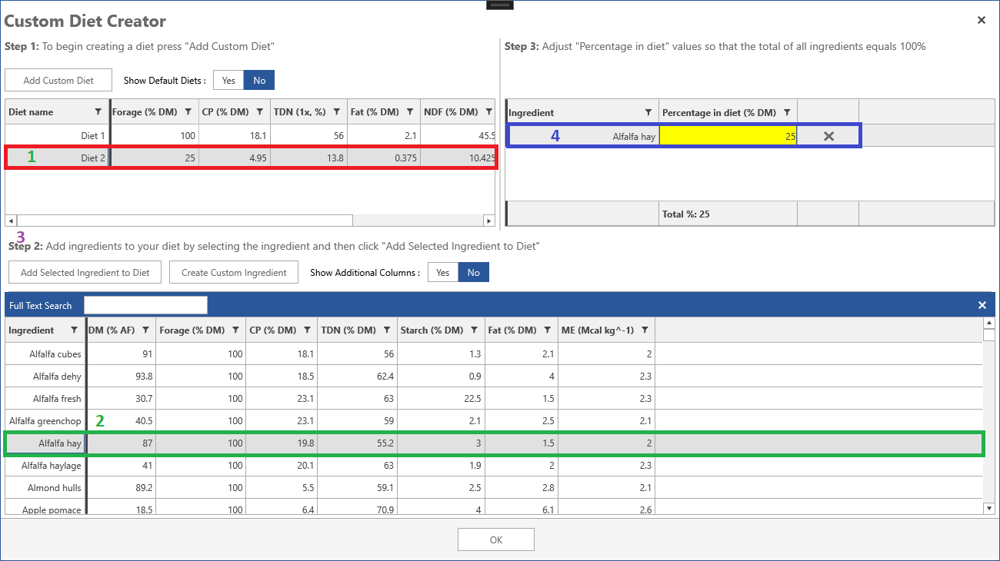
     
    <em>
		Figure 5.3 - Adding a feed ingredient to a diet.
	</em>

 

### Creating a Custom Ingredient

1.	Under “**Available Feed Ingredients**” click on “**Create A Custom Ingredient**”
2. An empty field of data will appear in the list of available feed ingredients. You can customize each data field to conform to the custom ingredient that you wish to add such as the name, **Forage (%), Dry matter (% AF) and Crude protein (% DM)**.

 

 
     
    <em>
		Figure 5.4 - Creating a custom feed ingredient.
	</em>

 

## Tooltips

Tooltips are an informational message that help describe various elements in the program. The Holos software incorporates tooltips throughout the program to provide further explanation for various terms and abbreviations. 

Tooltips are initiated when the mouse cursor (or pointer) is placed on top of a specific element in the program

 

 
     
    <em>
		Figure 5.5 - A tooltip for a field in the program.
	</em>

 

A tooltip displays the following information about non-abbreviated program elements:
- Title
- Description
- Units of measurement (if applicable)

Tooltips are also available for abbreviated terms found in various parts of the Holos program e.g., in the previously mentioned custom diet creator:

 

 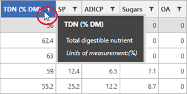
     
    <em>
		Figure 5.6 - Tooltip for a abbreviated table heading.
		 
		Hovering the mouse pointer over an abbreviated term show its meaning and units of measurement (if applicable).
	</em>

 
 

# Chapter 6 - Creating and Modifying Farm Components

## Introducing Component Selection

With Holos, you can create your own farm through a selection of **components** that are available under the “**All Components**” section.

**Each** component is categorized by their type and include the following: **Land Management, Beef Production, Dairy, Swine, Poultry, Sheep and Other livestock.** 

 

 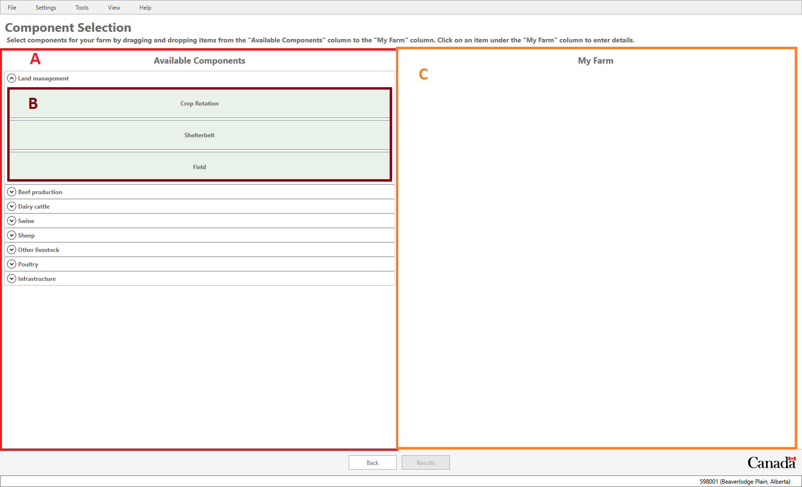
     
    <em>
		Figure 6.1 - Component Selection 
	 	 
		A: All the possible Components, separated by Component Categories that can be added to the Farm
		 
		B: A single Component Category
		 
		C: All the components that have been added to the Farm
	</em>

 

### Adding a Component to Your Farm

1.	To add a component to your farm, you must **double click** or **drag a component** from the “**Available Components**” list into “**My Farm**”.
2.	As a result, the component will appear under the “**My Farm**” tab and the data associated with that component you have chosen will be displayed in the section to the right of “My Components”.
3.	To switch between selected farm components, click on the component that you want to see, and the program will automatically switch to display that component’s information.
4.	See Figure 6.2 below for a visual representation.

 

 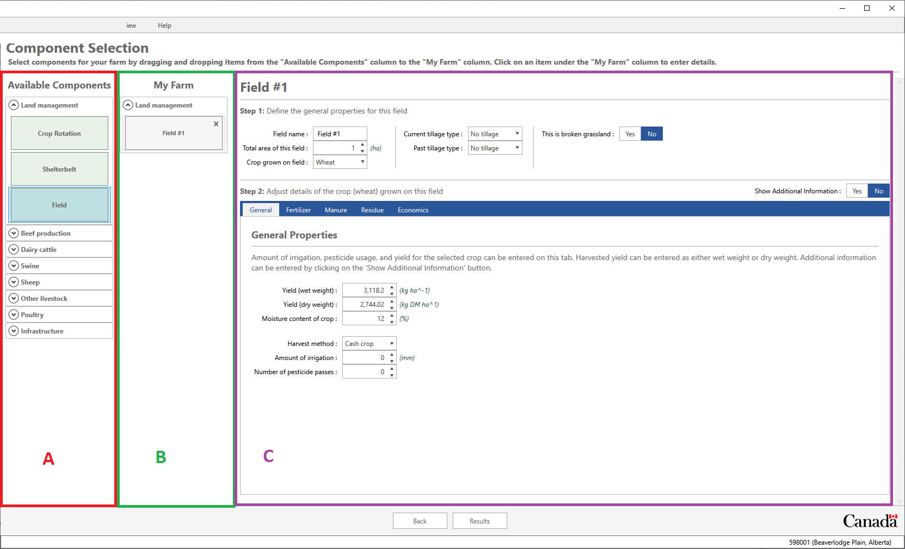
     
    <em>
		Figure 6.2- Adding a Component 
	 	 
		A: A list of all available components that can be added to the farm, separated by component category.
		 
		B: A list of components that have been added to the farm.
		 
		C: The data associated with the selected component.
	</em>

 

### Copying a Component in Your Farm

1.	You can copy a component in you farm by right clicking on the component and selecting “**Create a Copy**”.
2.	A window will appear.  You can select how many copies you would like to create. Press “**OK**” when finished (**see Figure 6.3**).

 

 
     
    <em>
		Figure 6.3 – Window to get the number of copies of your component.
	</em>

 

## Land Management Components

### Field Component

-	A field component contains details like the crop sown, land area, and tillage regime (see figure 6.4). Crops are categorized by their growth type (i.e., Annual, Perennial, etc.)
-	To enter specific details about the field you need to access the **Tab View** containing: **General, Manure, and Residue** properties for the field
-	To view additional information **Tab View**, click “**Yes**” beside “**Show Additional Information**”.

 

 
     
    <em>
		Figure 6.4 – Field Step 1. Define name, area, crop, and tillage type for your field component.
	</em>

 

The field component contains different tabs for each aspect of the component.

 

#### Tab View

##### General Properties

Contains such information like: yield, harvest method, fertilizer application rate etc.

 

 
     
    <em>
		Figure 6.5 – General tab for a field component.
	</em>

 

##### Fertilizer

Allows the user to add a fertilizer application to the field. This application includes information like Season of Application, Blend Type and Application Rate.

 

 
     
    <em>
		Figure 6.6 – Fertilizer tab for a field component. This shows the fertilizer application table for a field.
	</em>

 

##### Manure

Allows the user to add a manure application to the field. This application includes information like Date of Application, Manure Type used, Origin of Manure and Amount of Manure applied.

A summary of all manure applications to a farm can be seen in the [Farm Details](#farm-details) section of the program. The farm details section is available under the [Settings](#chapter-4-settings) header/menu item.

 

 
     
    <em>
		Figure 6.7 – Manure tab for a field component. This shows the manure application table for a field.
	</em>

 

##### Residue

This section lets the user specify how much carbon and nitrogen are in your crops.  They can also specify how much of the crop remains above or below the ground after harvest. 

 

 
     
    <em>
		Figure 6.8 – Residue tab for a field component. 
	</em>

 

##### Economics

The economics section shows various economic data related to the component including crop price, direct costs and total fixed and variable costs.

 

 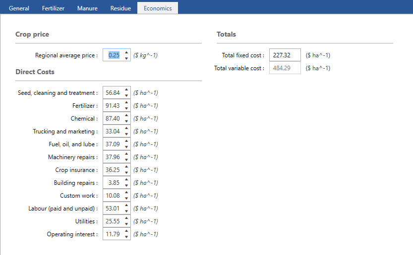
     
    <em>
		Figure 6.9 – Economic tab for a field component showing various costs related to the field.
	</em>

 

### Shelterbelt Component

- A **Shelterbelt component** consists of rows of trees where each row contains various tree types such as Caragana, Green Ash, Hybrid Polar etc. 

- **A shelterbelt row can contain more than one tree type and for each tree type, there are data fields that should be filled in.**

- In this section, we will navigate step by step into how we can modify the data for a shelterbelt component to suit your operation.

- **If you have not created a shelterbelt component**, please click here [Introducing Component Selection](#introducing-component-selection) to learn how to add a component to your farm.

#### Setting Up the Shelterbelt

After adding a shelterbelt component, you have various options to configure this component.

1.	Enter the “**Year of Observation**” for your shelterbelt.
2.	By default, there is one row of trees in the shelterbelt when the component is added to your farm. **To add an additional row of trees, click “Additional Row”.**

 
     
    <em>
		Figure 6.10 - Shelterbelt Component
		 
		A: The shelterbelt component
		 
		B: Shelterbelt name and year of observation
		 
		C: A Shelterbelt row: row length and row name
		 
		D: A Tree type in a shelterbelt row
	</em>

 

#### Modifying the Shelterbelt Rows

-	**Each row in a shelterbelt consists of various tree type(s)** where **each tree type will have its own data fields** that need to be filled in as **shown in Figure 6.3**. **This will be covered in the “Modifying Tree Type Data Section”.**
-	Each row has a data field for the **Row Name and the Row Length(m)** and are located above each row as **shown in Figure 6.3**. 
-	By default, the row name will always correspond to the specific tree types in your shelterbelt row, but you have the option to customize the row name to suit your operation. For example, in figure 6.3, the first row in our shelterbelt consists of a caragana and hybrid poplar tree, therefore the row name will be automatically be adjusted to be “Caragana, Hybrid Poplar”.
-	**If you would like to add another tree type to one of your shelterbelt rows**, beside each shelterbelt row is a button called “**Additional Tree Type**”. 

#### Modifying Tree Type Data in a Shelterbelt Row

For each tree type in your shelterbelt row(s), there is a set of data fields that need to be filled corresponding to the shelterbelts on your farm.
1.	**Select the tree type** by clicking on the drop-down menu beside the “**Species**” tab. You will be shown a list of available tree types, select one.
2.	**Input the rest of the data corresponding to your tree type** which includes: average spacing between trees(m), number of trees and the average circumference(cm) and the tree type name. 
3.	If you do not know the average circumference for your tree type, click on the “Calculator” button beside the “Average Circumference” field. For more information on the Average Circumference Calculator,follow instructions in the next section titled, Average Circumference Calculator.

 

 
     
    <em>
		Figure 6.11 - Tree Types in A Shelterbelt Row  
	</em>

 

#### Average Circumference Calculator

-	The calculator will produce the average circumference of the tree type you are interested in based on the circumference of the trunks at Breast Height of the tree(s).  
-	**If you already know the average circumference of the trees**, you can set the data field on the top left of the Circumference Calculator and select **“Direct Entry” as shown below in Figure 6.5, Section A.**

 

 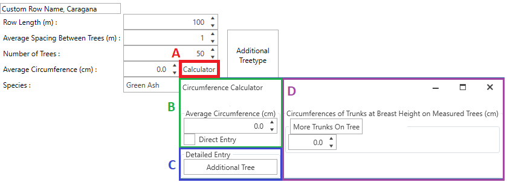
     
    <em>
		Figure 6.12 - Average Circumference Calculator
		 
		A: Clicking the calculator button displays the average circumference calculator window.
		 
		B: Direct entry for average circumference of a tree type
		 
		C: Add an additional tree to section C
		 
		D: Circumference of trunks at breast height associated with the tree(s) for your tree type
	</em>

 

-	There is a section called “**Circumferences of Trunks at Breast Height on Measured Trees (cm)**”. In this section, you can input the appropriate data associated with your tree(s).
-	**To add another trunk to a tree**, click on the “**More Trunks On Tree**” and a new data field will appear underneath the data associated with the tree you are adding a trunk to.
-	**If you would like to add another tree**, click “Additional Tree” as shown in Figure 6.11, Section B. The new tree will be added underneath the “Circumference of Trunks at Breast Height on Measure Trees(cm)” section.

 

 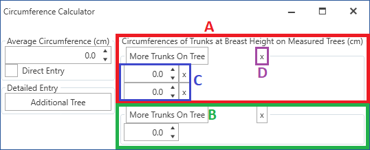
     
    <em>
		Figure 6.13 - Circumference of Trunks at Breast Height on Measured Trees Data
		 
		A: Tree 1.
		 
		B: Tree 2.
		 
		C: The Trunk(s) and their Circumference at Breast Height associated with Tree 1.
		 
		D: The delete trunk button. Clicking this will delete that specific trunk row.
	</em>

 

##### Shelterbelt Details

-	You can select the shelterbelt component you would like to view the results for at the top of the page if your farm has multiple shelterbelts beside the “**Shelterbelt Selector**” tab as shown in figure 6.14 section A.
-	**To get to the details page**, at the bottom of the timeline page is “**Next**”, click here to get to the details page.
-	The details page will **display a list of data for each shelterbelt row and their corresponding tree types**, starting from the plant year up until the cut year that you have inputted on the shelterbelt timeline page (figure 6.14, section C).
-	The details page will also output additional calculations such as Percent Mortality Category (0/15/30/50), Above Ground Carbon (kg C per Tree) and Below Ground Carbon (kg C per Tree).
-	**If you modify any values on the previous pages, click “Rebuild Datacolumns”** to refresh the data shown in the table (Figure 6.14, Section B)
-	If you would like to see the Calculator columns (for Average Circumference) click “Show Calculator Columns” at the top right of the Shelterbelt Details page and a Calculator Column will appear. If you do not know what the Average Circumference Calculator is please click here: [How To Use Average Circumference Calculator](#average-circumference-calculator)

 

 
     
    <em>
		Figure 6.14 – Shelterbelt Details
		 
		A: The Shelterbelts in your Farm.
		 
		B: If you have modified any data on the previous pages, please click here to rebuild the data columns.
		 
		C: The data associated with each Shelterbelt Row and their corresponding Tree Type(s) from Plant Year up Until The Cut Year.
		 
		D:If you have sorted the data and want to reset back to the default, click here.
	</em>

 

##### Shelterbelt Results

1.	**To get to the results**, at the bottom of every component page is a button called “**Results**”, click that button to go to the results page.
2.	The results page will display the emission footprint from the selected Shelterbelt by providing data regarding green house gas emissions calculated from the data inputs on the previous pages.

 
 

### Crop Rotation Component

A crop rotation component is similar to a field component and allows the representation of multiple field components on the farm. If a farm contains multiple field components that are added to represent the rotation of crops on a field over the years, a crop rotation component can represent the same information through a single entry. This allows for easier and more manageable representation of fields and crops on the farm.

 

 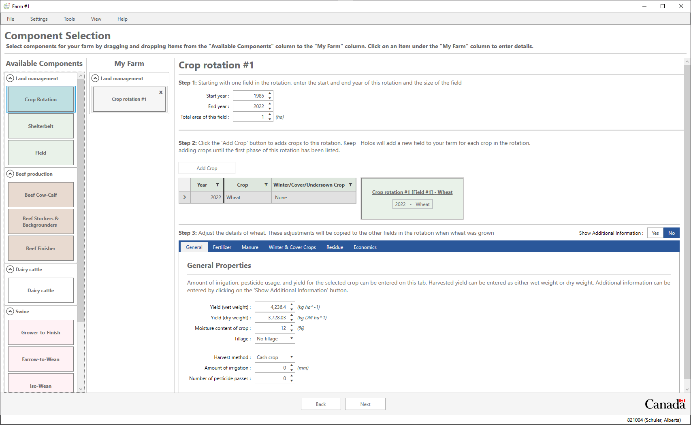
     
    <em>
		Figure 6.58 - Crop Rotation Component
	</em>

 

The crop rotation component allows to easily set the crop grown in a specific year and automatically sets the rotation based on the number of crops chosen.

 

 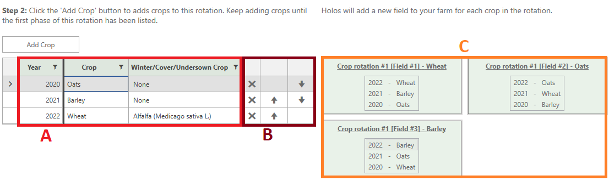
     
    <em>
		Figure 6.59 – Crop Rotation - Setting up the crops
		 
		A: The year and crop information.
		 
		B: Arrow buttons allow adjustment of the crops in the rotation.
		 
		C: The current rotation for each field.
	</em>

 

Most of the remaining settings in the crop rotation component are similar to the [field component mentioned earlier](#field-component).

An additional settings tab is present in the crop rotation component that is missing from the field component, i.e., 'Winter & Cover Crops'. This tab provides options to manage and change settings related to the cover crop for each field.

Adding a winter/cover/undersown crop to any specific crop will enable this tab for that particular crop.

 

 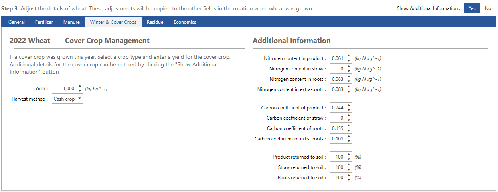
     
    <em>
		Figure 6.60 - Winter & Cover Crops settings
	</em>

 
 

## Animal Components

-	The animal components are separated into the following component categories: **Beef Production, Dairy, Swine, Poultry, Sheep, and Other Livestock.**
-	All the results for each animal component will be displayed on a **single results page.** 
-	However, each animal component requires their own set of data inputs!
-	In this section, we will go through how to enter data for each component category.

 

### Setting Up Animal Components

-	The animal component is very similar in terms of the structure and data required to create the components.
-	Each **animal component** consists of **one or more animal groups (e.g. heifers vs steers)**, where **each animal group has one or more management periods.**
- The **management period** is separated into categories and allows the user to enter data for **General, Diet, Housing and Manure** details for each **animal group.**

 

 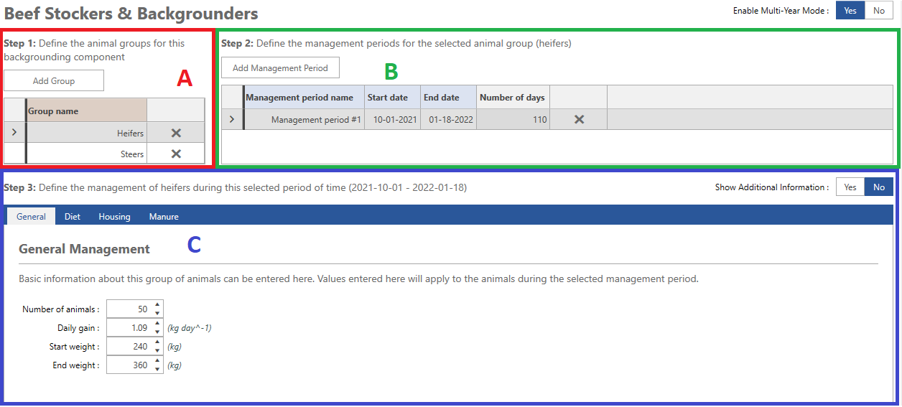
     
    <em>
		Figure 6.15 - Beef Stockers & Backgrounders Layout showcasing an animal component.
		 
		A: A list of animal groups that have been added to the animal component.
		 
		B: A list of management periods for a selected animal group.
		 
		C: The details for the selected management period.
	</em>

 

#### Groups

-	**Each** animal component can have **one or more animal groups**.
-	The **key consideration is each animal group** has a specific or different type of management inputs & practices associated with it e.g. different housing, diet, manure management, etc.
-	To **add a group** for your animal component, there are buttons at the top right of the animal groups section that will allow you to add another animal group.
-	The added group will appear in under “**Step 1**”
-	You can **remove an animal group** by clicking on the “**X**” beside the animal group you would like to remove
-	You can **also sort the groups alphabetically** by clicking on the “**Group name**” header.
-	If you want to see the details for an animal group, please select the group by clicking anywhere on the groups section. the selected animal group will be indicated by a “>” symbol in the left column.
-	You can **adjust the names of each of your animal groups** by clicking the name you would like to change and entering your custom name

 

 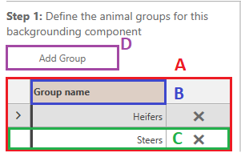
     
    <em>
		Figure 6.16 - Animal Groups
		 
		A: All the animal groups currently added. Each row contains a single group.
		 
		B: A specific animal group - Steers
		 
		C: Click the **Group name** heading to sort the names.
		 
		D: Buttons to add an animal group
	</em>

 

#### Management Period

-	A management period is a period of time for an animal group where details for that animal group are able to be entered specific to the operations during that time period.
-	Each **animal group** can have **one or more** management periods.
-	To view the management period(s) for an animal group, please **select the group under “Step 1”**.
-	You can adjust the **name, start date** and the **number of days** for each management period.
-	To **add a new management period** to your selected animal group, please click the “**Add Management Period**” button below “**Step 2**”.
-	To **remove a management period**, click the **X** button beside the period you would like to remove.
-	The details for a management period can be split into four categories: **General, Diet, Housing and Manure**.
-	To see the details for a management period, please click on the period you would like to view.

 

 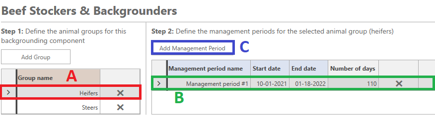
     
    <em>
		Figure 6.17 - Management Periods for Animal Group
		 
		A: The selected animal group
		 
		B: Managements periods for the selected animal group
		 
		C: Click here to add a new management period for your animal group
	</em>

-	To see additional information for each section, click “Yes” beside the “Show Additional Information” header.

 
 

### Beef Production

The beef production category contains the following animal components: 

 

#### Beef Cow-Calf

The Beef Cow-Calf component contains the following groups:

* Bulls
* Replacement heifers
* Cows
* Calves

Holos allows the user to add additional groups and create copies of a group if required. A group can be added/copied by clicking the "**Add Group**" button in Step 1.

 

 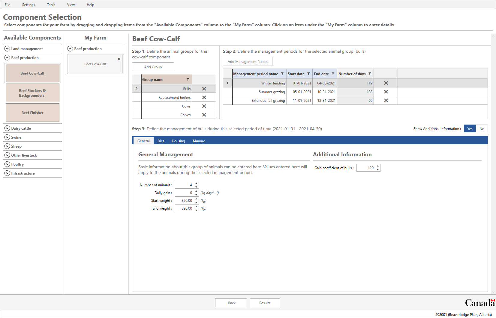
     
    <em>
		Figure 6.18 - Beef Cow-Calf Component
	</em>

 

Each animal group has the following sections that can be further edited and configured. 

##### General

-	The general section contains simple information for the animal group such as the **number of animals** and average daily rate of **gain coefficients**.
-	You can also enter the **start** and **end** weights for your animal group.
-	Some animal groups will have additional data fields specific to that group.

 

 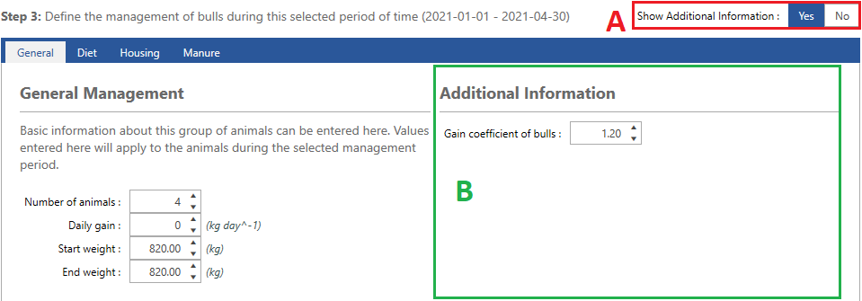
     
    <em>
		Figure 6.19 - Management Periods General Tab
		 
		A: The 'Show Additional Information' toggle allows you to see additional information in a tab.
		 
		B: Additional information regarding a tab section.
	</em>

 

##### Diet

-	The Diet section contains information pertaining to the diet for your animal group in the selected management period.
-	You can select one of the **default diets** such as: **low, medium, or high** energy protein.
-	If you have selected to see **additional information**, you are able to adjust more specific details for the diet such as: forage, crude protein, fat etc.
- If you want to create your own **custom diet**, there is a “**Custom Diet Creator**” button at the bottom of the diet section. If you do not know how to create a custom diet, click here: [How to Create A Custom Diet](#creating-a-custom-diet).

 

 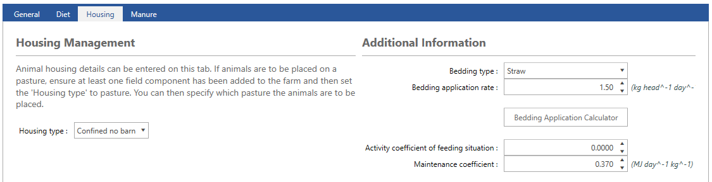
     
    <em>
		Figure 6.20 - Management Periods - Diet Tab.
	</em>

 

##### Housing

-	The housing section contains details pertaining to the housing situation for your selected animal group in the selected management period.
-	You can select default housing types such as: confined no barn, confined, enclosed pasture, etc.

 

 
     
    <em>
		Figure 6.21 - Management Periods - Housing Tab.
	</em>

- If you select “**Enclosed Pasture**”, you will see an additional data field for the “**Pasture Location**"

 

##### Manure

- 	The manure section contains details pertaining to the manure operations for your selected animal group in the selected management period.
- 	You can select default manure management types such as:  Deep Bedding, Solid Storage, etc.
- 	If you have selected to see additional information, you are able to provide data inputs for more specific manure details.

 

 
     
    <em>
		Figure 6.22 - Management Periods - Manure Tab.
	</em>

 
 

#### Beef Stockers & Backgrounders

The Beef Stockers and Backgrounders component has the following animal groups:

- Heifers
- Steers

This component contains similar additional tabs as the [Beef Cow-Calf component](#general).

 

 
     
    <em>
		Figure 6.23 - Beef Stockers and Backgrounders component.
	</em>

 
 

#### Beef Finishers

The Beef Finisher component has the following animal groups:

- Heifers
- Steers

This component contains similar additional tabs as the [Beef Cow-Calf component](#general).

 

 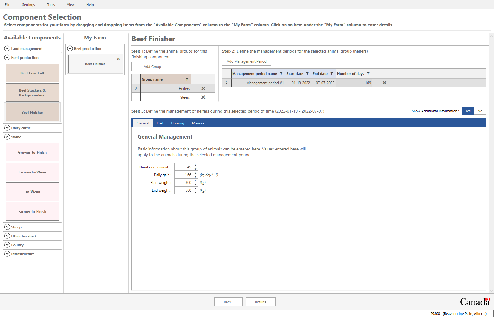
     
    <em>
		Figure 6.24 - Beef Finisher component.
	</em>

 
 

### Dairy

The Dairy category contains the following components:

#### Dairy cattle

The Dairy cattle component has the following animal groups:

- Dairy heifers
- Dairy dry
- Dairy calves
- Dairy lactating

This component contains similar additional tabs as the [Beef Cow-Calf component](#general) which allows further information to be entered regarding each group.

 

 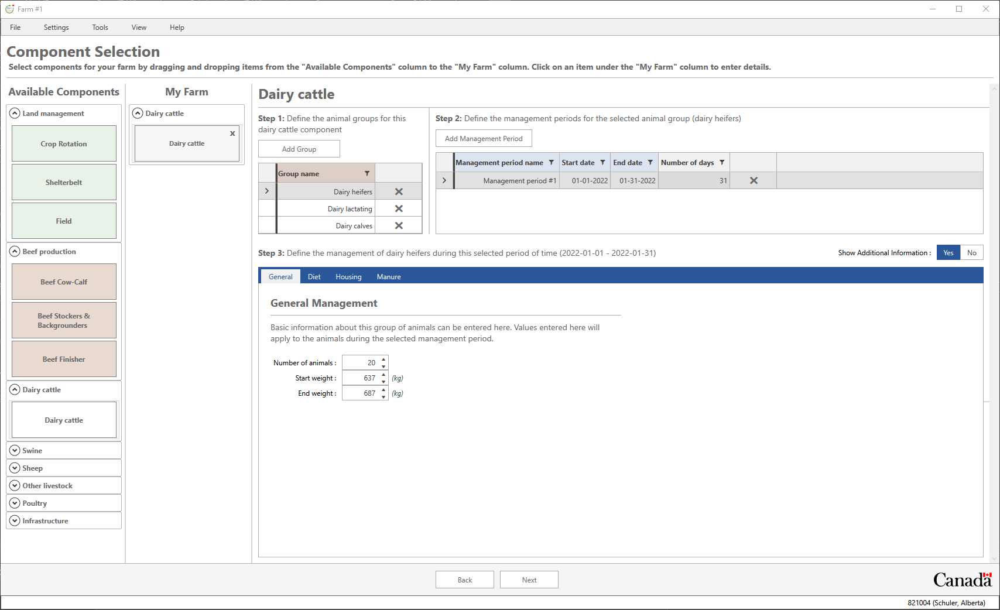
     
    <em>
		Figure 6.25 - Dairy cattle component.
	</em>

 
 

### Swine

The swine category contains the following animal components:

#### Grower-to-Finish

The Grower-to-Finish component has the following animal groups:

- Hogs

 

 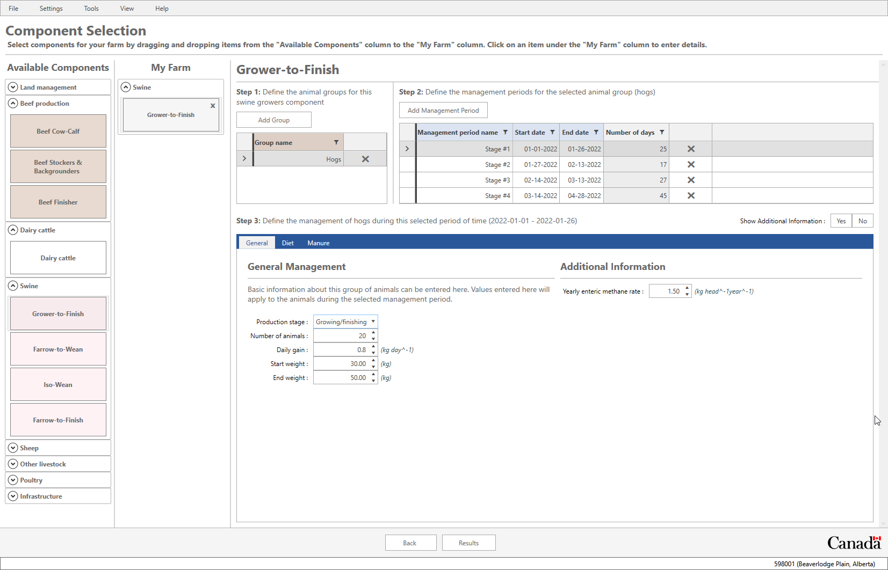
     
    <em>
		Figure 6.26 - Grower-to-Finish component.
	</em>

 
 

This component contains the following tabs which allow further information to be entered regarding each group.

 

##### General - Swine Component

The general tab allows editing the following information:

- The **production stage** of the animal group.
- The **number of animals** on the farm.
- The **daily weight gain** of the animals in the selected animal group.
- The **start and end weight** of the animals in the selected animal group.
- Additional general information regarding the animal group (after selecting "S
- how Additional Information").

 

 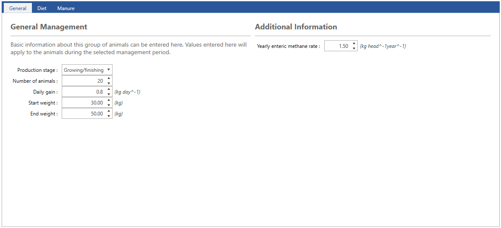
     
    <em>
		Figure 6.27 - Swine component - General tab.
	</em>

 

##### Diet - Swine Component

The diet tab allows editing the following information:

- The **type of diet** of the animal group.
- The **custom diet creator** to create a custom diet for the selected animal group.
- Additional diet information regarding the animal group (after selecting "Show Additional Information").

 

 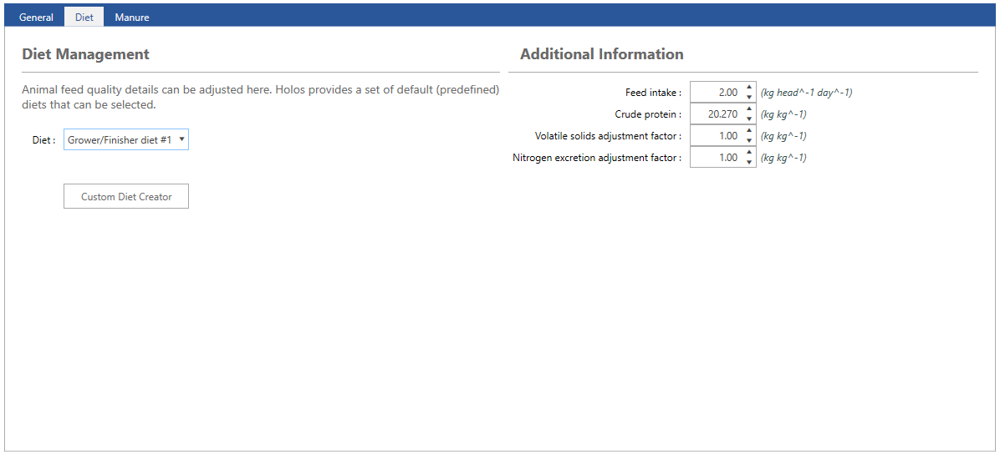
     
    <em>
		Figure 6.28 - Swine component - Diet tab.
	</em>

 

##### Manure - Swine Component

The manure tab allows editing the following information:

- The **manure handling system** for the animal group.
- Additional manure information regarding the animal group (after selecting "Show Additional Information").

 

 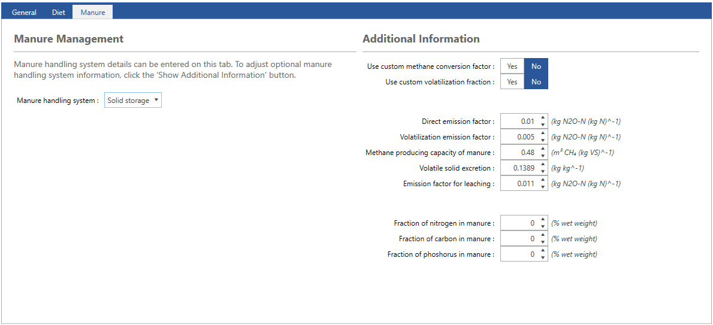
     
    <em>
		Figure 6.29 - Swine component - Diet tab.
	</em>

 

#### Farrow-to-Wean

The Farrow-to-Wean component has the following animal groups:

- Gilts
- Soars
- Boars

This component contains similar additional tabs as the [Grower-to-Finish component](#general-swine-component) which allows further information to be entered regarding each group.

 

 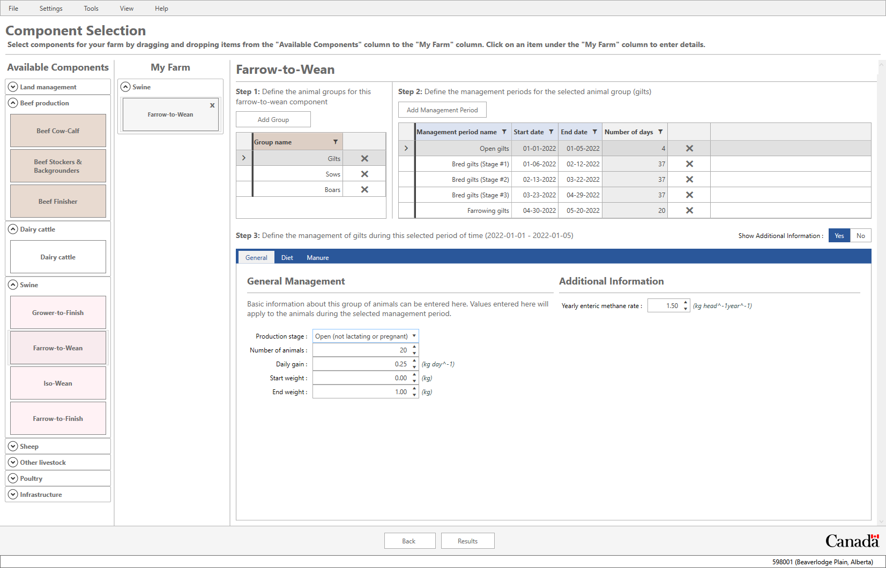
     
    <em>
		Figure 6.30 - Farrow-to-Wean component.
	</em>

 

#### Iso-Wean

The Iso-Wean component has the following animal groups:

- Piglets

This component contains similar additional tabs as the [Grower-to-Finish component](#general-swine-component) which allows further information to be entered regarding each group.

 

 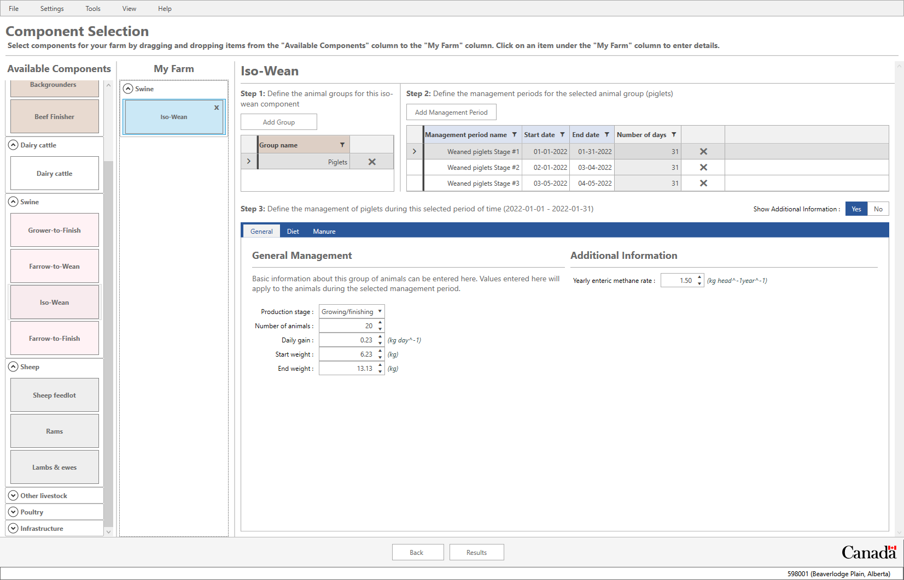
     
    <em>
		Figure 6.31 - Iso-Wean component.
	</em>

 

#### Farrow-to-Finish

The Farrow-to-Finish component has the following animal groups:

- Gilts
- Sows
- Boars
- Piglets

This component contains similar additional tabs as the [Grower-to-Finish component](#general-swine-component) which allows further information to be entered regarding each group.

 

 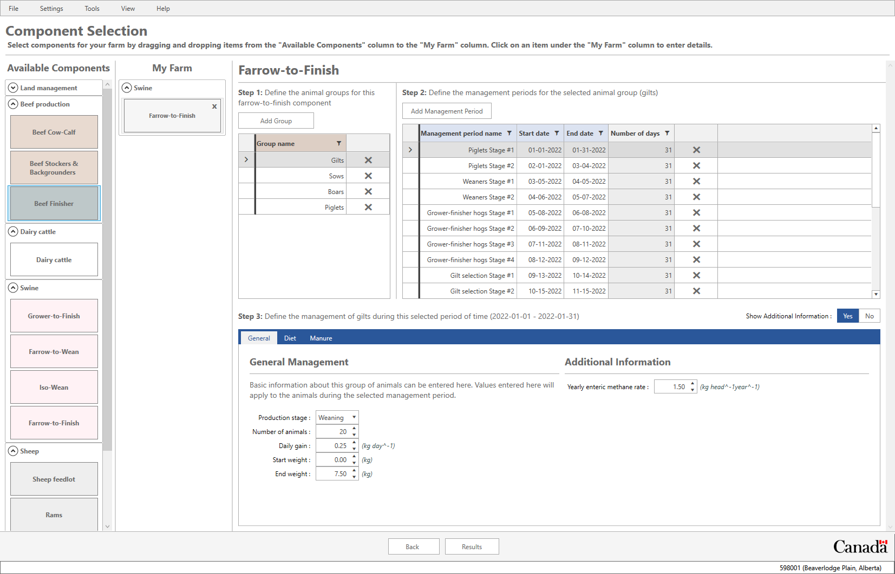
     
    <em>
		Figure 6.32 - Farrow-to-Finish component.
	</em>

 

 

### Poultry
The poultry category contains the following animal components:
 

#### Pullet Farm

The Pullet Farm component has the following animal groups:

- Pullets

 

 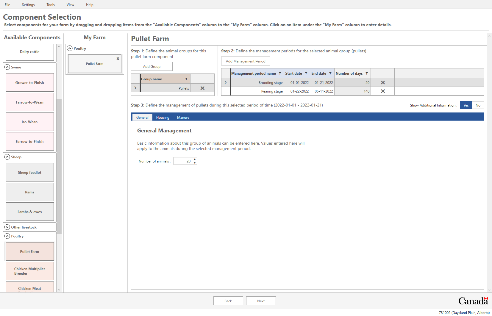
     
    <em>
		Figure 6.34 - Pullet Farm component.
	</em>

 
 

This component contains the following tabs which allow further information to be entered regarding each group.

##### General - Poultry Component

The general tab allows editing the following information:

- The **number of animals** on the farm.
 

 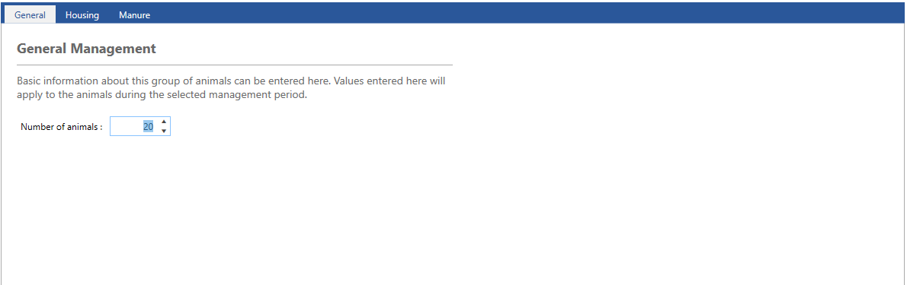
     
    <em>
		Figure 6.35 - Poultry component - General tab.
	</em>

 

##### Housing - Poultry Component

The housing tab allows editing the following information:

- The **housing type** for the animals in the selected animal group.
- Additional housing information regarding the animal group (after selecting "Show Additional Information").

 

 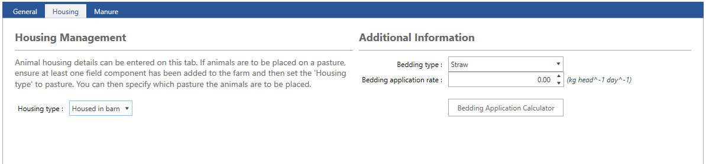
     
    <em>
		Figure 6.36 - Poultry component - Housing tab.
	</em>

 

##### Manure - Poultry Component

The manure tab allows editing the following information:

- The **manure handling system** for the animals in the selected animal group.
- Additional manure information regarding the animal group (after selecting "Show Additional Information").

 

 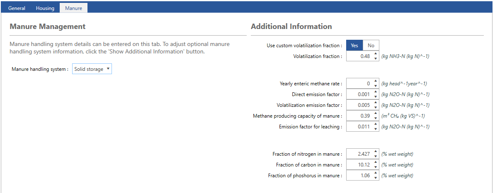
     
    <em>
		Figure 6.37 - Poultry component - Manure tab.
	</em>

 

 

#### Chicken Multiplier Breeder

The Chicken Multiplier Breeder component has the following animal groups:

- Pullets
- Cockerels
- Roosters
- Hens

This component contains similar additional tabs as the [Pullet farm component](#general-poultry-component) which allows further information to be entered regarding each group.

 

 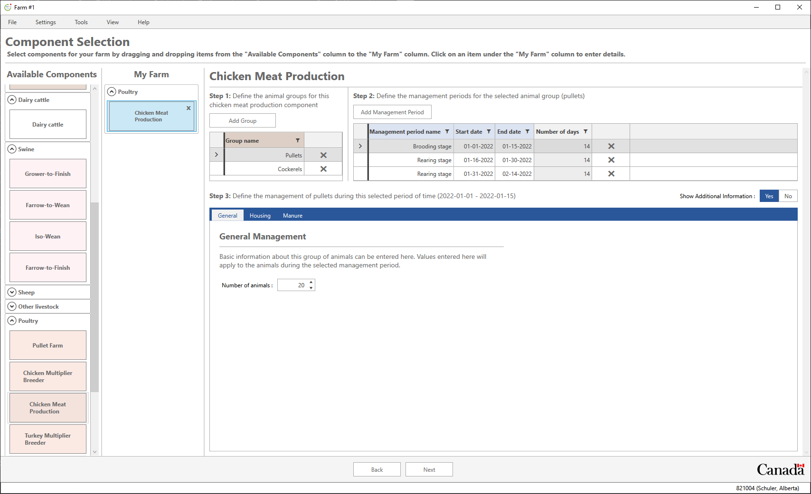
     
    <em>
		Figure 6.38 - Chicken Multiplier Breeder component.
	</em>

 

 

#### Chicken Meat Production

The Chicken Meat Production component has the following animal groups:

- Pullets
- Cockerels

This component contains similar additional tabs as the [Pullet farm component](#general-poultry-component) which allows further information to be entered regarding each group.

 

 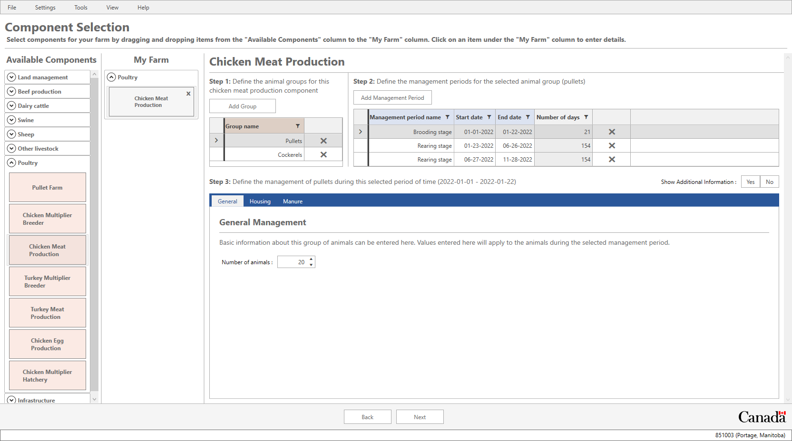
     
    <em>
		Figure 6.39 - Chicken Meat Production component.
	</em>

 

#### Turkey Multiplier Breeder

The Turkey Multiplier Breeder component has the following animal groups:

- Young toms
- Toms
- Young turkey hens
- Turkey hens

This component contains similar additional tabs as the [Pullet farm component](#general-poultry-component) which allows further information to be entered regarding each group.

 

 
     
    <em>
		Figure 6.39 - Turkey Multiplier Breeder.
	</em>

 

#### Turkey Meat Production

The Turkey Meat Production component has the following animal groups:

- Young toms
- Young turkey hens

This component contains similar additional tabs as the [Pullet farm component](#general-poultry-component) which allows further information to be entered regarding each group.

 

 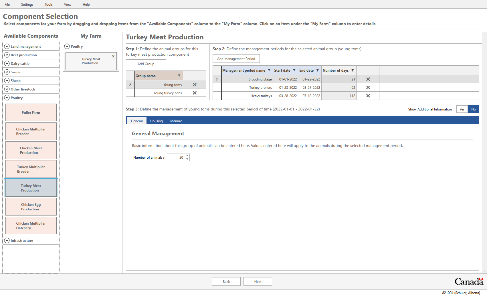
     
    <em>
		Figure 6.40 - Turkey Meat Production component.
	</em>

 

#### Chicken Egg Production

The Chicken Egg Production component has the following animal groups:

- Hens

This component contains similar additional tabs as the [Pullet farm component](#general-poultry-component) which allows further information to be entered regarding each group.

 

 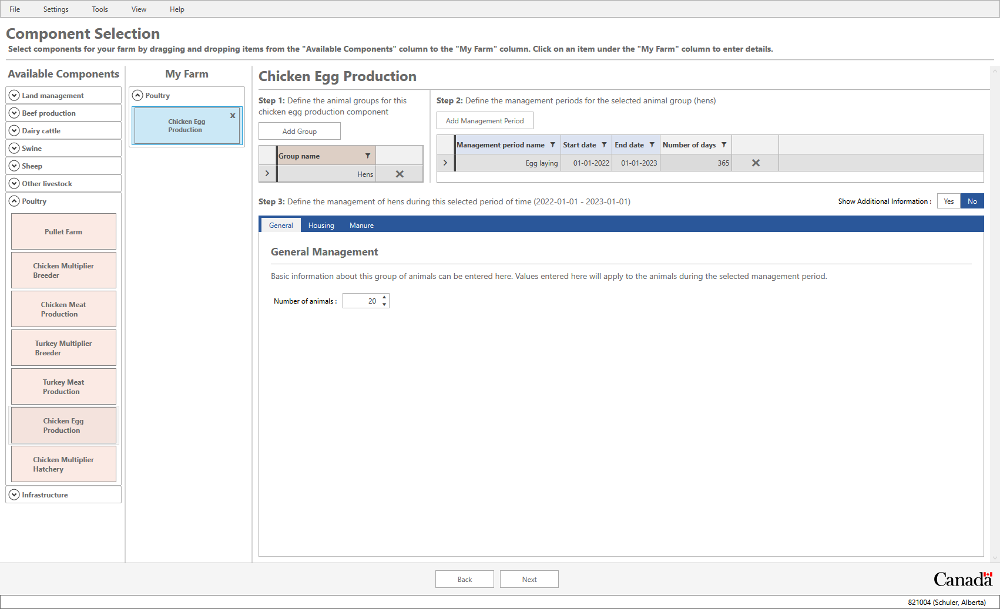
     
    <em>
		Figure 6.41 - Chicken Egg Production component.
	</em>

 

#### Chicken Multiplier Hatchery

The Chicken Multiplier Hatchery component has the following animal groups:

- Chicken eggs
- Chicks
- Turkey eggs
- Poults

This component contains similar additional tabs as the [Pullet farm component](#general-poultry-component) which allows further information to be entered regarding each group.

 

 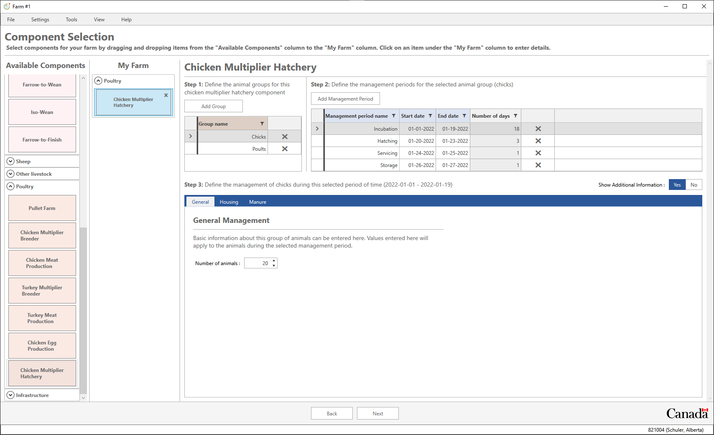
     
    <em>
		Figure 6.42 - Chicken Multiplier Hatchery component.
	</em>

 

 

### Sheep

The sheep category contains the following animal components:
 

#### Sheep Feedlot

The Sheep Feedlot component has the following animal groups:

- Sheep feedlot

 

 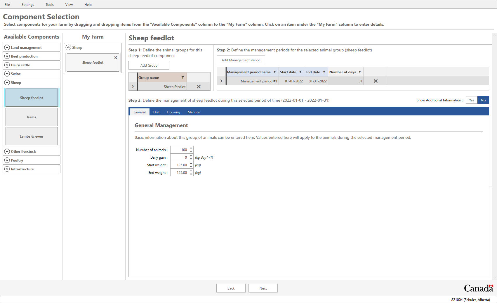
     
    <em>
		Figure 6.43 - Sheep Feedlot component.
	</em>

 
 

This component contains the following tabs which allow further information to be entered regarding each group.

##### General - Sheep Component

The general tab in this category allows changing the following information regarding each animal group:

- Number of animals
- Daily gain
- Start and end weight

 

 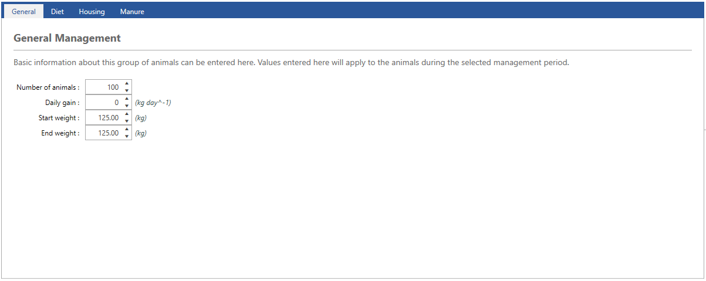
     
    <em>
		Figure 6.44 - Sheep Category - General tab.
	</em>

 

##### Diet - Sheep Component

The diet tab in this category allows changing the following information regarding each animal group:

- Diet type
- Open the custom diet creator.

 

 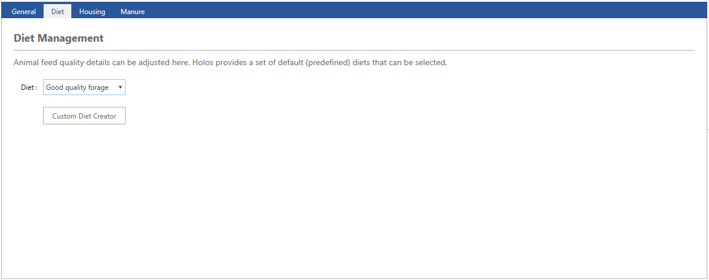
     
    <em>
		Figure 6.45 - Sheep Category - Diet tab.
	</em>

 

##### Housing - Sheep Component

The housing tab in this category allows changing the following information regarding each animal group:

- Housing type

 

 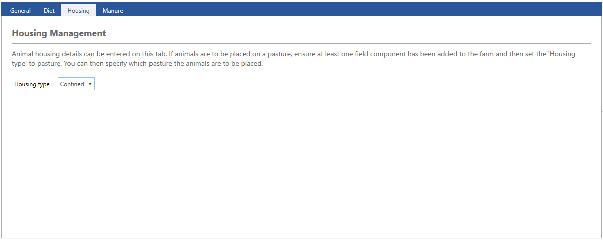
     
    <em>
		Figure 6.46 - Sheep Category - Housing tab.
	</em>

 

##### Manure - Sheep Component

The manure tab in this category allows changing the following information regarding each animal group:

- Manure handling system

 

 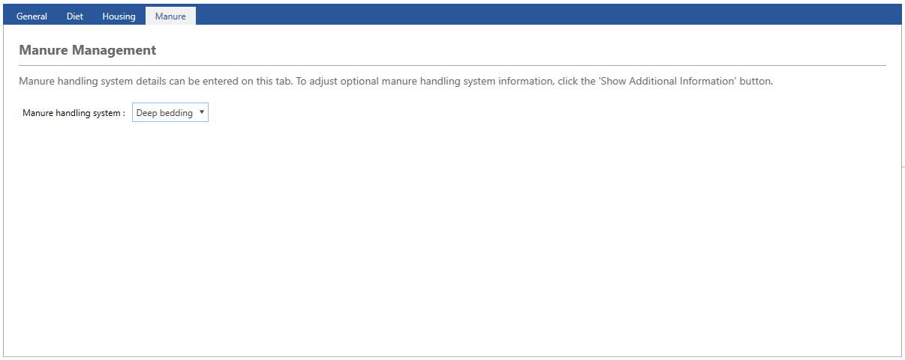
     
    <em>
		Figure 6.47 - Sheep Category - manure tab.
	</em>

 

####	Rams

The Rams component has the following animal groups:

- Rams

This component contains similar additional tabs as the [Sheep Feedlot Component](#general-sheep-component), which allows further information to be entered regarding each group.

 

 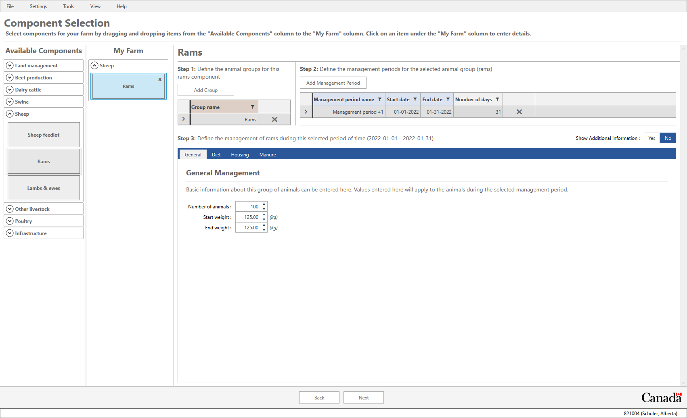
     
    <em>
		Figure 6.48 - Rams Hatchery component.
	</em>

 

####	Lambs & Ewes

The Lambs & Ewes component has the following animal groups:

- Lambs
- Ewes

This component contains similar additional tabs as the [Sheep Feedlot Component](#general-sheep-component), which allows further information to be entered regarding each group.

 

 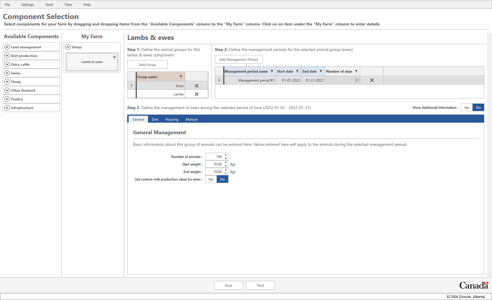
     
    <em>
		Figure 6.49 - Lambs & Ewes component.
	</em>

 
 

### Other Livestock

The other livestock category contains various other livestock that is currently supported by Holos which can be added to a farm. Each component in this category represents a single animal type. Each component contains the following settings tabs:

#### General - Other Livestock

The general tab in this category allows changing the following information regarding the animal:

- Number of animals

 

 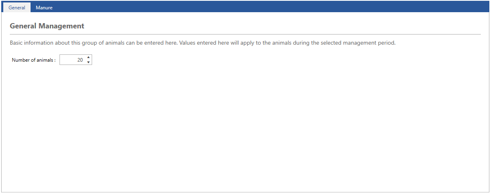
     
    <em>
		Figure 6.50 - Other Livestock - General tab.
	</em>

 

#### Manure - Other Livestock

The manure tab in this category allows changing the following information regarding the animal:

- Manure handling system

 

 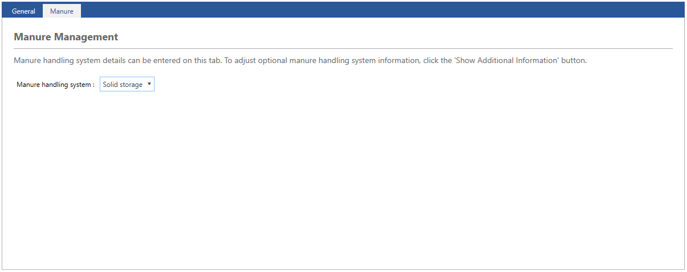
     
    <em>
		Figure 6.51 - Other Livestock - Manure tab.
	</em>

 

The other livestock category contains the following animal components:

#### Goats

 

 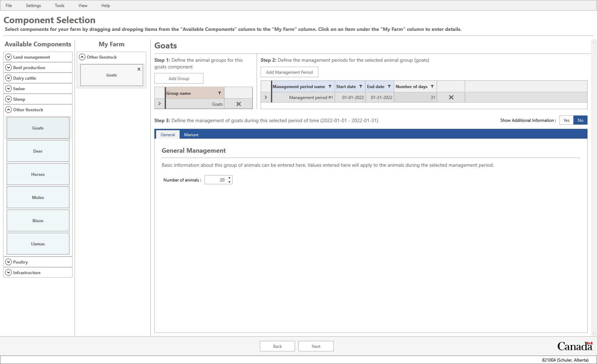
     
    <em>
		Figure 6.52 - Goats component.
	</em>

 

#### Deer

 

 
     
    <em>
		Figure 6.53 - Deer component.
	</em>

 

#### Horses

 

 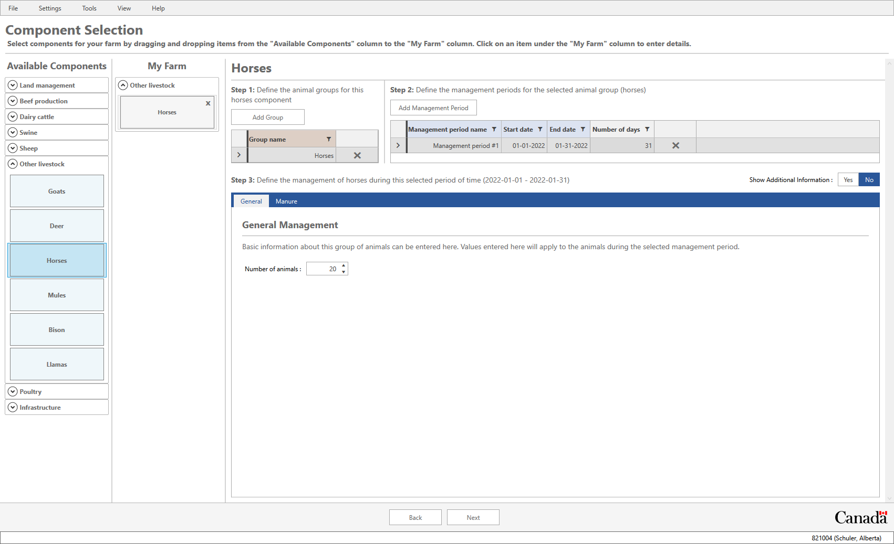
     
    <em>
		Figure 6.54 - Horses component.
	</em>

 

#### Mules

 

 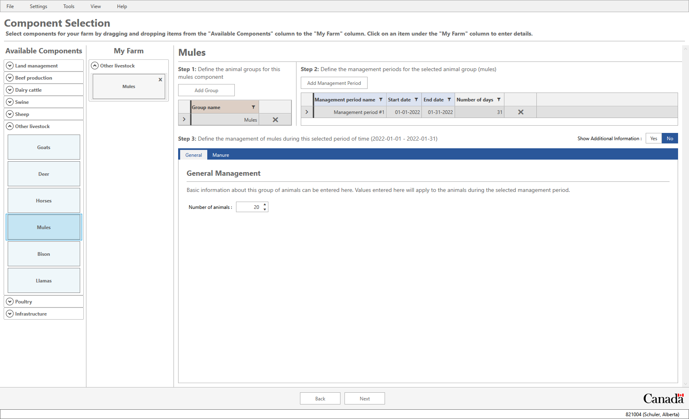
     
    <em>
		Figure 6.55 - Mules component.
	</em>

 

#### Bison

 

 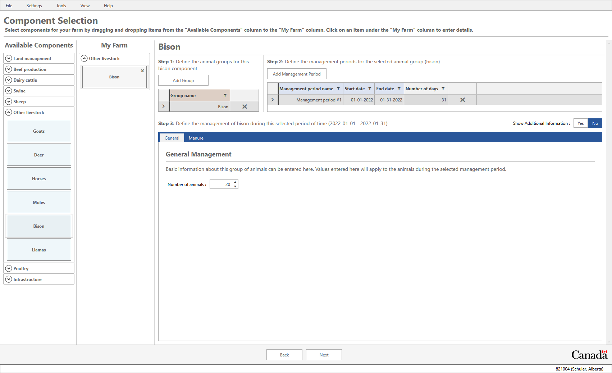
     
    <em>
		Figure 6.56 - Bison component.
	</em>

 

#### Llamas

 

 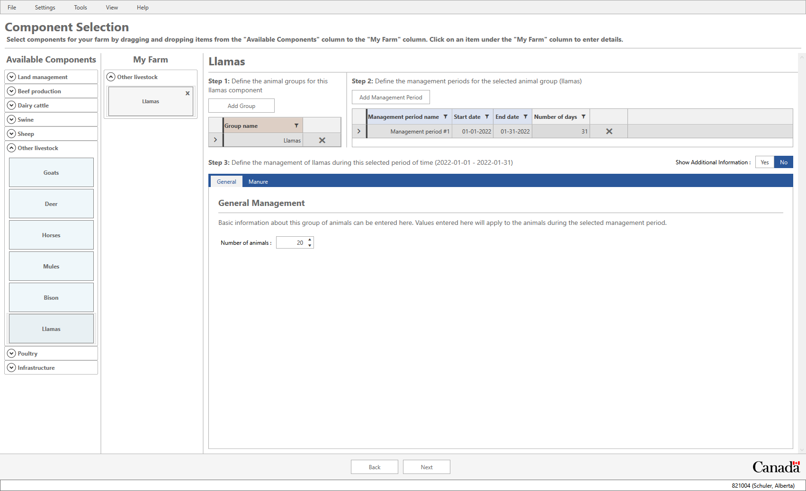
     
    <em>
		Figure 6.57 - Llams component.
	</em>

 

 

## Infrastructure Components

This category contains components related to the infrastructure of the farm.

### Anaerobic Digestion Component:

#### Component is Work in Progress.

 
 

# Chapter 7 - Timeline

To view the Timeline, your farm must be in Advanced mode and enable Multi-Year Mode in the Component Selection Screen
- [Learn how to switch between Basic and Advanced modes](#how-do-i-enable-advanced-mode).
- [Learn how to enable Multi Year Mode](#how-do-i-enable-multi-year-mode)

The timeline screen allows you to see your farm over a period from 1985 to present day. The timeline screen is used for the following components:

- Farm crop system timeline
- Shelterbelt timeline

## Farm crop system timeline:

The farm crop system timeline is displayed when the farm is set to 'Multi-Year Mode'. The crop system timeline shows an overview of the crop(s) grown on the farm and allows the user to add historical and future projections to a particular field and its crop systems.

-	To **add a historical or projected production system** click on the field in the list of production systems under “**Step 1**” or by selecting the system in the timeline region.  
-	Once clicked the system is now active, click either “**Add Historical Production System**” or “**Add Projected Production System**”.
-	Adding a **historical production system** will create a new inline block with the original field at the **beginning of the timeline** while a **projected production system** places the new block at the **end of timeline.**

 

 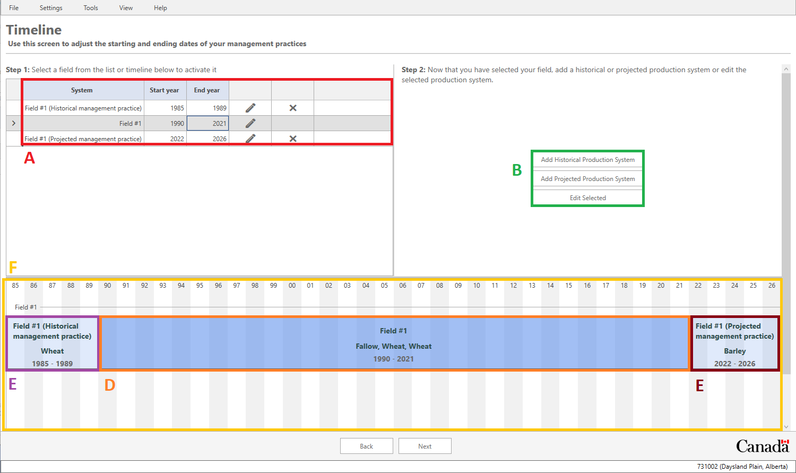
     
    <em>
		Figure 7.1 – Farm crop system timeline Screen
		 
		A: The available production systems.
		 
		B: Controls to add or edit historical/projected production systems.
		 
		C: A historical production system.
		 
		D: The original production system from the component selection screen
		 
		E: A projected production system.
		 
		F: Timeline region.
	</em>

## Shelterbelt Timeline

The shelterbelt timeline works similarly to the farm crop timeline. The timeline shows the type of tree, the year it was planted and the cut-off year. The numbers at the top of the timeline signify the year. In the shelterbelt timeline you can adjust:

- The year the tree was planted.
- The cut-off year of the timeline.
- The year of observation.
- Number of trees alive today (from drop down named 'Mortality').

 

 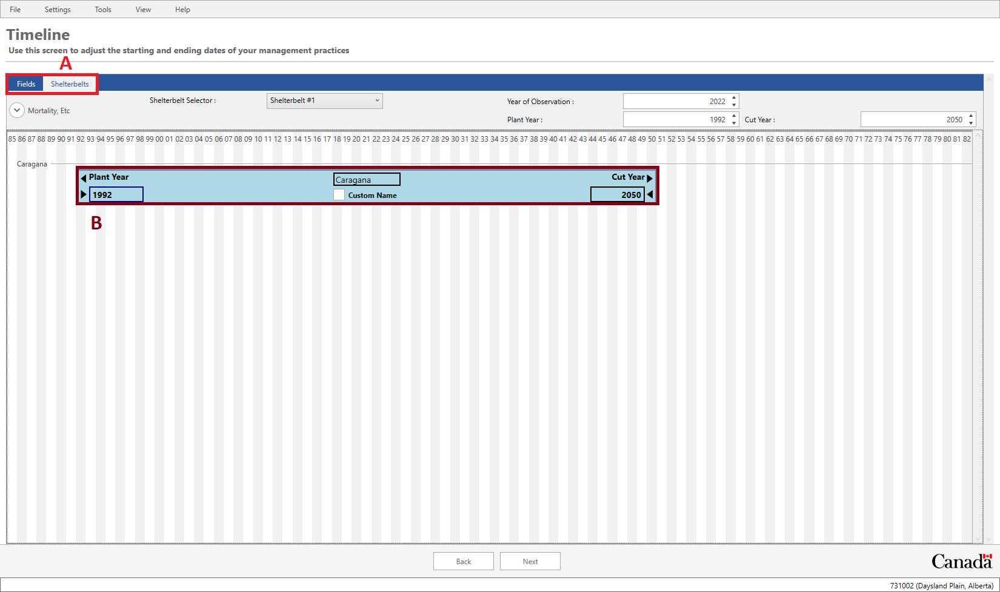
     
    <em>
		Figure 7.2 – Shelterbelt timeline
		 
		A: Switch between crop timeline and shelterbelt timeline.
		 
		B: The timeline for a specific tree added to the shelterbelt.
		 
	</em>

 
 

# Chapter 8 - Details

## Overview

-	To view this screen, ensure that you **enable Multi-Year Mode** while in **Advanced Mode** and **disable simplified results** in the toolbar.
-	This screen offers a detailed grid related to your farm’s fields like **carbon input**, **yield**, and **other factors** for each year of your production systems you created in the **timeline**.  
-	If you don’t know how to create a production system you can learn how by reading Timeline: Setup a Production System
-	We are first introduced to the “**data tray**” (see figure 8.1) on the left of the cropping system grid.  
	-	Clicking on “**Enable Columns**” to the left side of the data grid expands a tray of the available data columns.  
	-	Clicking “Enable Columns” again will collapse the tray to the side.
	-	 The tray allows you to show or hide different columns in the grid.  Your choice of what columns to hide will persist across sessions and farms (i.e. data columns hidden in one farm will also be hidden in other new and existing farms). 
	-	 The data is available in other views using the exact same functionality across each instance.
-	If you have come to this screen and then gone back to change something about your fields then you may have to reload the data to keep it up to date with your changes.  To accomplish the reload click “**Reload Data From Previous Screen**” in the upper left corner of the view.   
-	You can change how the screen reports the yields of your fields with the drop-down menu beside “**Yield Assignment Method**” **(default is “Average Yield”).**
-	Like other grids in Holos you can sort and filter each column shown.  Anything to the right of the Yield column can be edited by hand.

 

 
     
    <em>
		Figure 8.1 – Detail Screen
		 
		A: Click here to reload your changes from the previous screen
		 
		B: Click this to expand or collapse the data tray
		 
		C: The data tray
		 
		D: The current yield assignment
		 
		E: Data that can be edited by the user
	</em>

 

## Load an Input File

-	To assign load a file with custom yields in the results view of Holos, select the drop-down menu beside “**Yield Assignment Method**” and choose “**input file**”.
-	Click on the button that appears, labeled “**Load Custom Yield Data**”.
-	You will be shown a file explorer. Navigate to your input file.
-	The input file must be a **Comma Separated Value (CSV)** file.
-	The format of the file should be as follows:
	-	A column for the year, and as many columns as you have rotations.
	-	You can have as many years and rotations as you like in the file if they conform to the above format.
	- Note that you must separate the field name and rotation name by a hyphen for Holos to correctly associate the yield value with the appropriate field and rotation.

| Year  | Field # 1 - Rotation #1 | Field #1 - Rotation #2 | ... |
| ----- | :---------------------: | :--------------------: | :-: |
| 1990  |          1065           |         1378           | ... |
| 1991  |          1020           |         1223           | ... |
| ...   |          ...            |          ...           | ... |

 
 

# Chapter 9 - Results

Results are available in a simplified or detailed form.  The detailed results are the default when you click “**Results**” while in “**Advanced Mode**”.  To enable simplified results, click “**View**” in the toolbar and click “**Enable Simplified Results**”.

## Simplified Results

- While in "Basic Mode" , the results page will display a basic set of results.
- This page shows a broad summary of the emissions of the farm and how much the farm produced for each component in the farm. 
-  The page also shows a graph displaying overall emission for each farm component.

 
     
    <em>
		Figure 9-1 - Simplified Results in Single Year mode.
		 
		A: Summary details of the farm
		 
		B: Charts displaying  data of various components added to the farm
	</em>

 

## Detailed Results
- While in "Advanced Mode" , the results page will display an Advanced set of results. These results are split into multiple tabs with each tab displaying with each component displaying information regarding a specific aspect of the farm results.

### Estimates of Production

Provides details on farm production.  The report can be shown in a monthly or yearly format. If the component has multiple products like beef cattle (manure and beef), there will be buttons that appear above the graph portion of the report to display the appropriate graph

 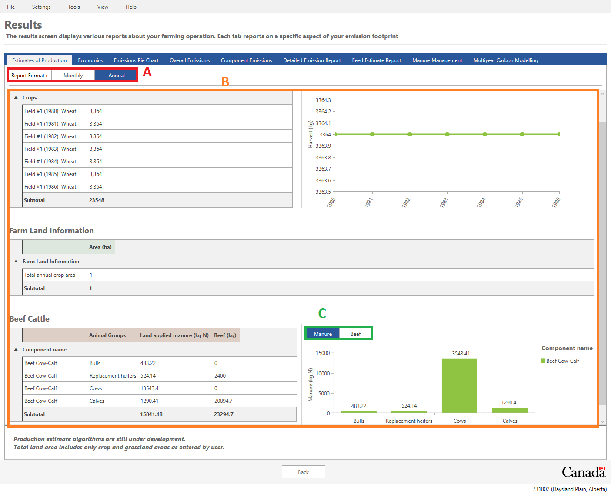
     
    <em>
		Figure 9-2 - Estimates of Production Results Tab
		 
		A: Toggle that helps switch the reporting format to Monthly or Annual.
		 
		B: Production Estimates.
		 
		C: Toggle that helps switch between different component items.
	</em>

 

### Economics

Shows the market price and total revenue for the crops in your farm.  Economic data is provided by various data sources from 2020 and might be incorrect.  This tab offers a rough estimate of what you stand to gain and should be used with caution.

 

 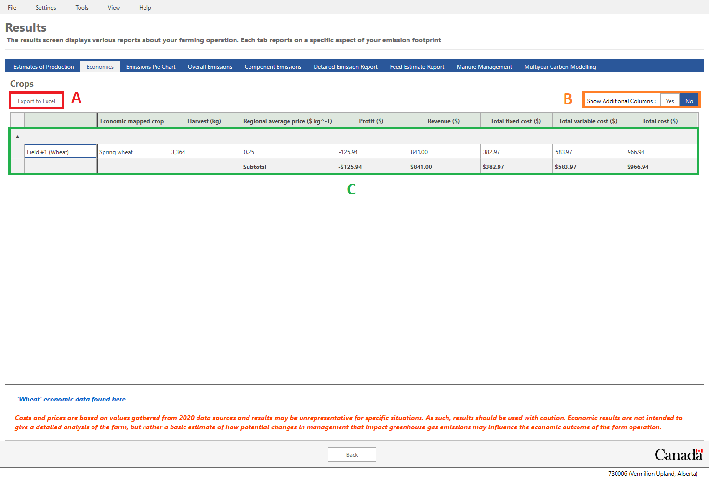
     
    <em>
		Figure 9-3 - Economics Results Tab
		 
		A: Button that allows exporting data to an excel (spreadsheet) file.
		 
		B: Toggle that enables or disables additional columns.
		 
		C: The economic data for the crop.
	</em>

 

### Emissions Pie Chart

A proportional representation of all farm emissions.  You can view how each farm component contributes by clicking “Yes” beside “Show Details”.  You can also change the units of measurement, click on the drop-down box beside “Units of Measurement”. The chart will highlight whichever slice you mouse over for easy identification. 

 

 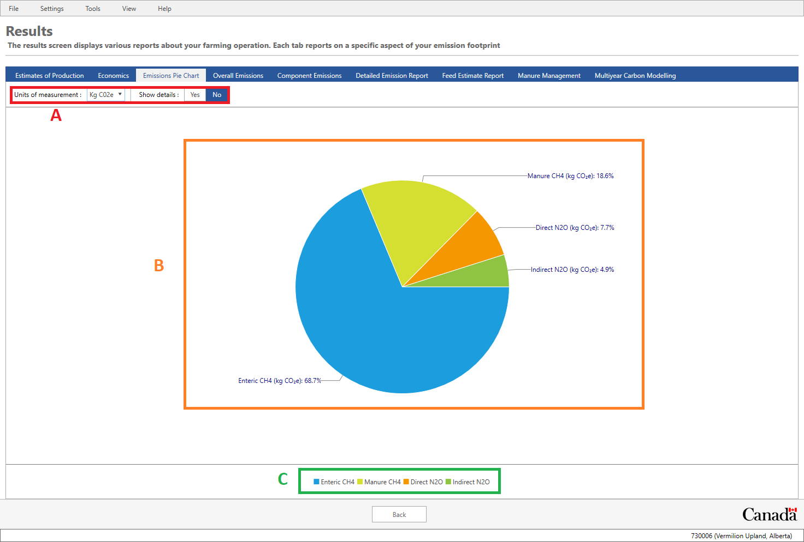
     
    <em>
		Figure 9-4 - Economics Pie Chart Results Tab
		 
		A: Various options related to display of chart.
		 
		B: The pie chart and data.
		 
		C: The various emissions from the farm.
	</em>

 

### Overall Emissions

Display the overall amount of each greenhouse gas produced by the farm.

 

 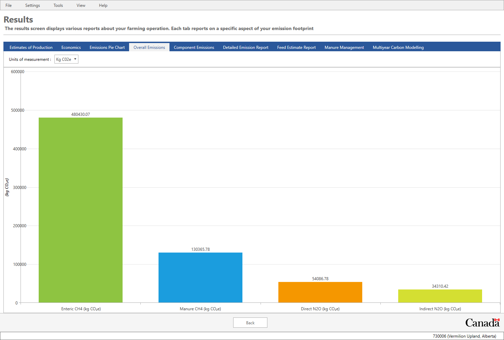
     
    <em>
		Figure 9-5 - Overall Emissions Results Tab.
	</em>

 

### Component Emissions

Shows a breakdown of all emissions from a farm on a monthly basis.

 

 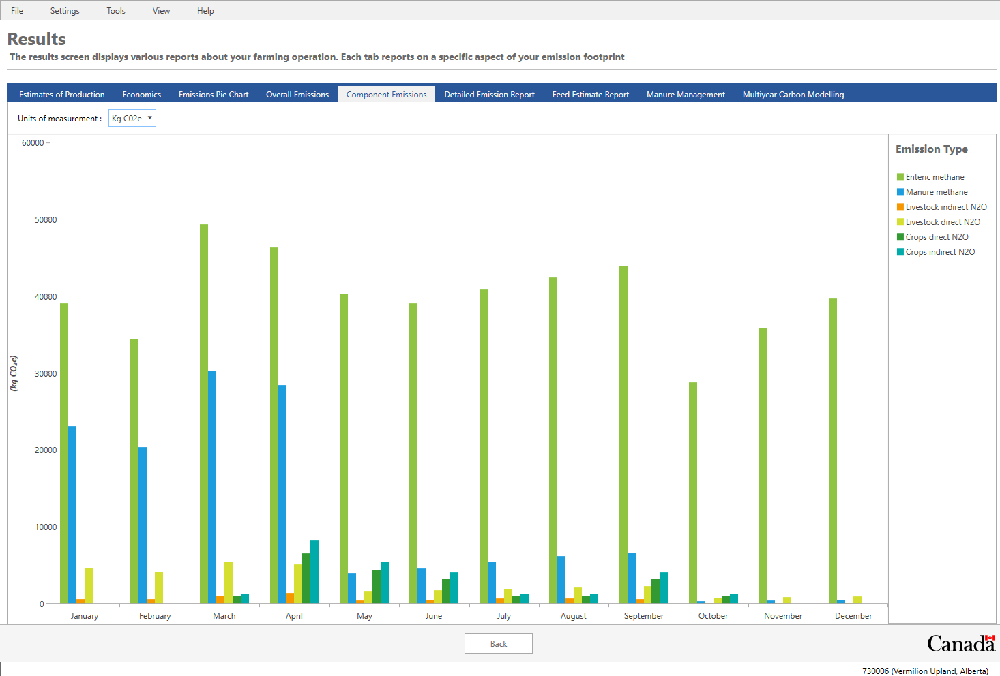
     
    <em>
		Figure 9-6 - Component Emissions Results Tab.
	</em>

 

### Detailed Emissions Report

A detailed summary of each component in the farm, showing emission breakdown for each component in the farm (i.e. total Direct/Indirect N2O, Enteric CH4, and Manure CH4 produced by the given component).  You can export this data to a CSV file of your choosing.  You can also compare multiple farms and see the comparison in the table.

 

 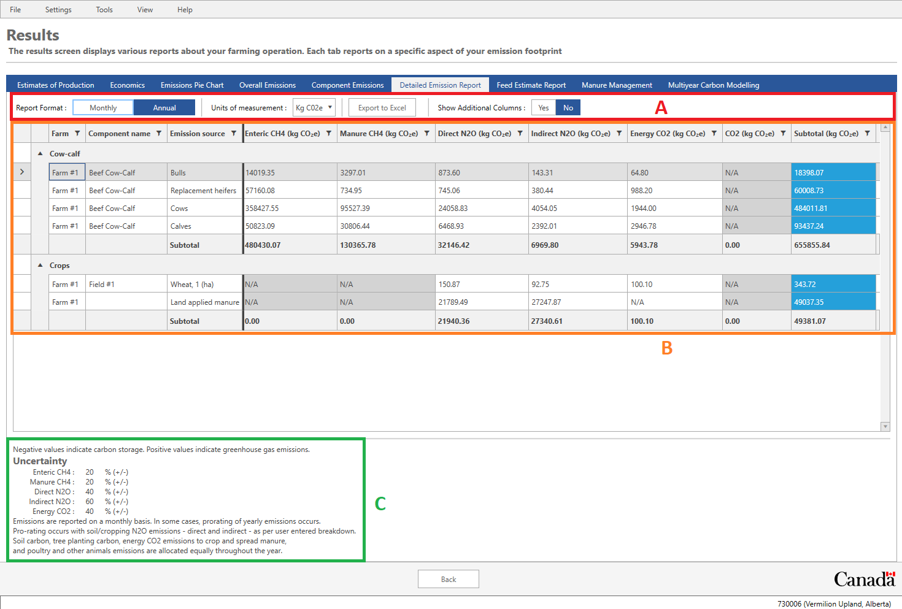
     
    <em>
		Figure 9-7 - Detailed Emissions Results Tab
		 
		A: Command bar capable of exporting the chart data, comparing multiple farms, along with other options previously mentioned.
		 
		B: Legend depicting each type of emission
		 
		C: Uncertainty associated with each type of emission
	</em>

 

#### Comparing Emissions of Farms

The detailed emission report tab allows emissions to be compared between different farms added to Holos by the user. If more than one farm is present, the "Compare Multiple Farms" option becomes available.

 

 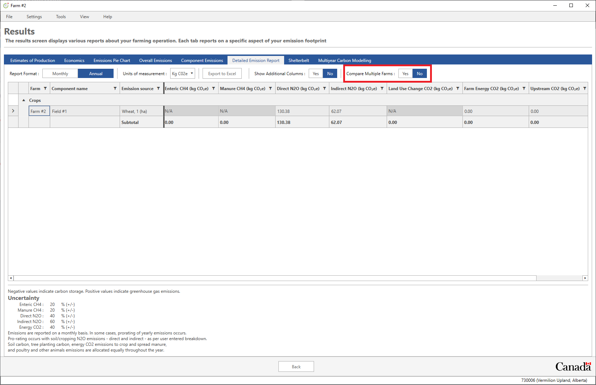
     
    <em>
		Figure 9-7.1 - Compare multiple farms option
	</em>

 

After clicking on 'yes', a new menu will show up which provides further options.

 

 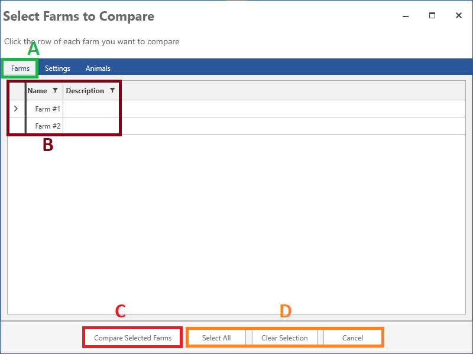
     
    <em>
		Figure 9-7.2 - Select farms to compare settings
		 
		A: Tabs in the top bar present different options to the user.
		 
		B: The current farms added to Holos by the user. Click the farms that need to be compared.
		 
		C: Click here to compare the farms.
		 
		D: Options that allow the user to select all available farms, clear the current selection and close the select farm setting menu.
	</em>

 

 

 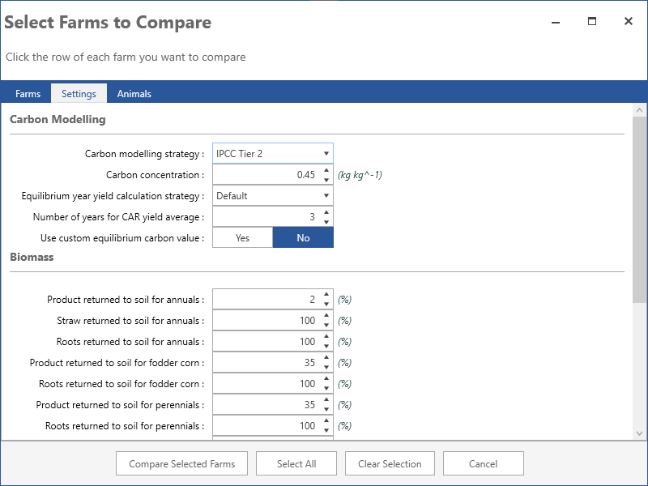
     
    <em>
		Figure 9-7.3 - Default settings for the farms.
	</em>

 

 

 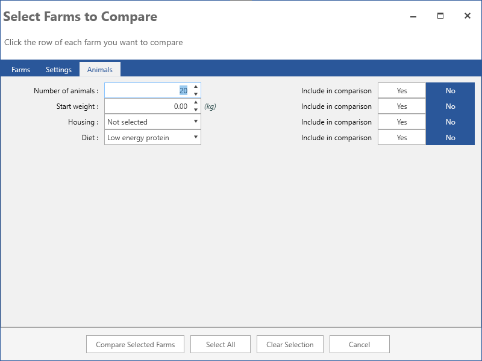
     
    <em>
		Figure 9-7.4 - Animal settings for the farm. Each setting and be included and excluded from the comparison.
	</em>

 
  

### Feed Estimate Report

Displayed only when an animal component is added to a farm. Displays how much each animal component group consumed on average per day (can be displayed monthly or yearly). 

 

 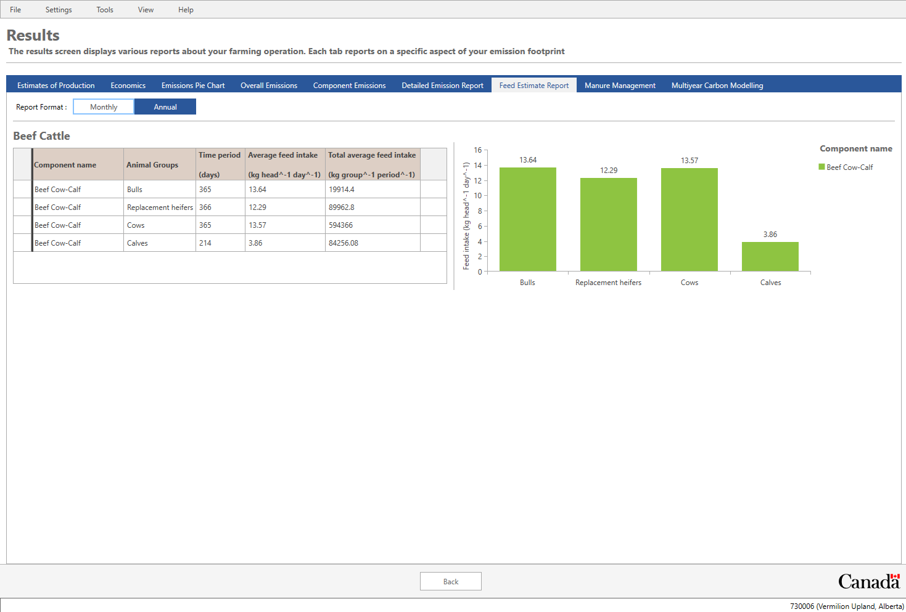
     
    <em>
		Figure 9-8 - Feed Estimate Report Results Tab.
	</em>

 

### Manure Management

Displayed only when an animal component is added to a farm. Holos will display how much manure details for each animal group in your system.  Like the Details screen this screen also has the data tray to toggle any of the columns in the grid

 

 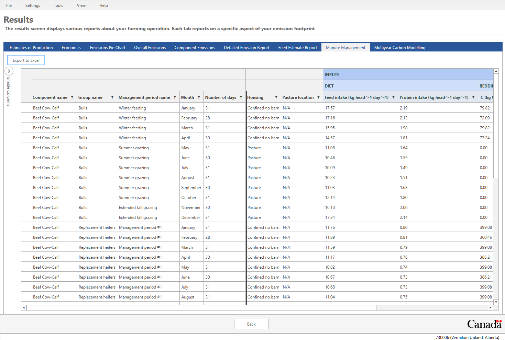
     
    <em>
		Figure 9-9 - Manure Management Results Tab.
	</em>

 

### Multiyear Carbon Modelling

Displayed only when 'Multi-Year Mode' is selected.  

Displays a graph showing the Soil Organic Carbon (SOC) for the fields in the farm over a given period (default is 1985 – present).  You can view the “Fields” tab as a graph or a table displaying various data regarding climate, carbon, nitrogen, etc.  Like the “Details” screen and “Manure Management” tab we also have access to the data tray to toggle appropriate data columns

Click on the "Grid" or "Graph" toggle to view the results in the corresponding format.

**While in the graph view**, **hovering** the mouse over data points of any year shows basic information regarding that point. The user is also able to click a link in each pop-up to view further information about that year's data in the "Grid" view.

 

 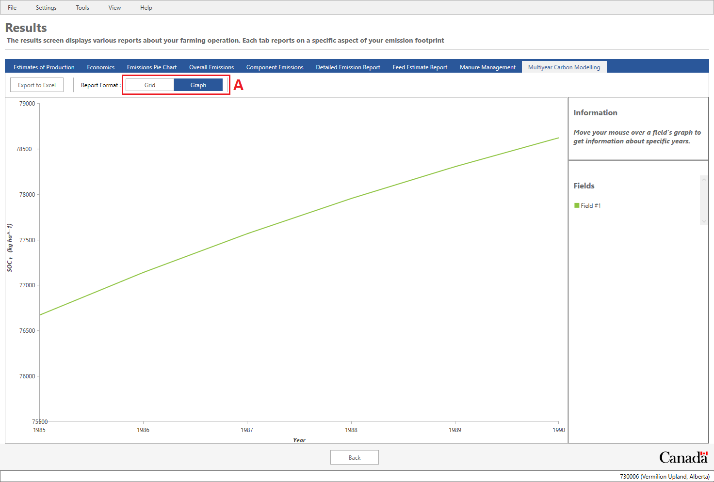
     
    <em>
		Figure 9-10 - Multi-Year Carbon Modelling Results Tab - Graph View.
		 
		A: Toggle that allows switching between Grid and Graph representation.
	</em>

 

 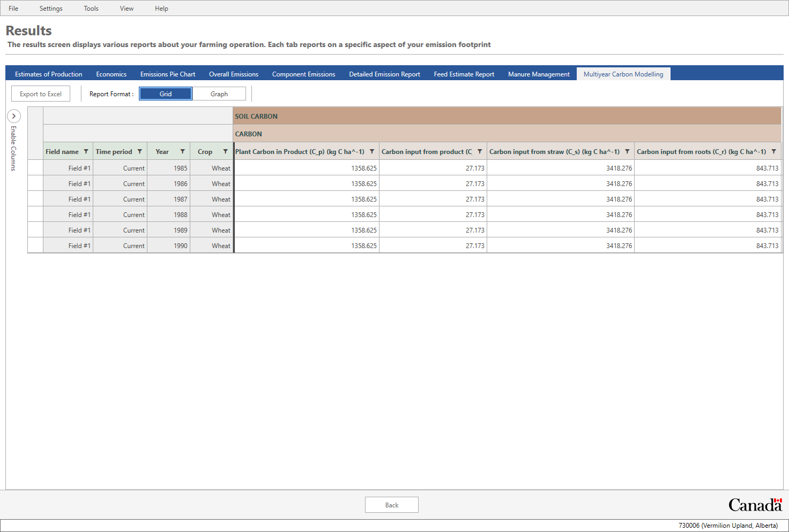
     
    <em>
		Figure 9-11 - Multi-Year Carbon Modelling Results Tab - Table/Grid View.
	</em>

 

 
     
    <em>
		Figure 9-12 - ToolTip in Graph View showing additional information for a data point.
	</em>

 

### Shelterbelt Results

Displayed only when a shelterbelt is added to a farm. Displays how much each animal component group consumed on average per day (can be displayed monthly or yearly). 

 

 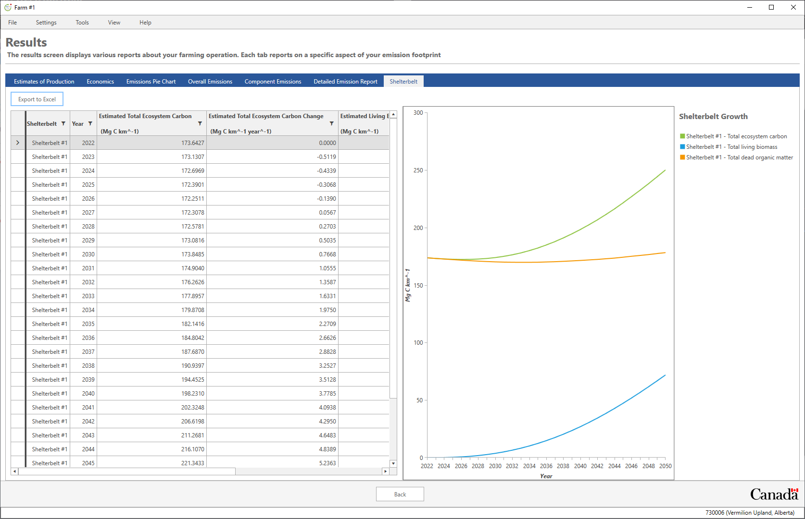
     
    <em>
		Figure 9-13 - Shelterbelt Results Tab.
	</em>

 

 

# Chapter 10 - Command Line Interface

## What is a Command Line Interface

-	The Holos Command Line Interface (CLI) allows you to efficiently process large amounts of data corresponding to the various operations on your Farm.
-	The interface requires the user to **create data input Excel files** for multiple farms and their respective components (i.e. fields, cow-calf, swine, etc.).
-	Excel files for data input should be saved using CSV format. **Microsoft Excel is recommended** since other third-party software (such as OpenOffice) is known to cause input errors.
-	Input files cannot be open in another program while the CLI is running. 
-	In this section, we will go through instructions on how to **set up the CLI**, how to **modify settings files**, how to **create data files for each Component and how to use the CLI.**

 
 

## Setting up the Command Line Interface
In this section, we will go through the steps to properly set up the CLI regarding: navigating the Holos directory, modifying the global settings files, creating/modifying data input Excel files and adding a new farm folder to the CLI,  for each of the Components in your farm.

### The CLI Farms Folder

- The Holos Command Line Interface requires the user to create a "Farms" folder where all farm related data will be stored.
- This Farms folder in a general folder that contains all individual farms that the user wants to work with.
- Each individual farm folder then contains different folders for each of the components in your farm as well as a global settings file for that farm (where you can set your global defaults for each farm). 
- Additionally, each component folder contains Excel files that store the data inputs for each of your operations (i.e., data input files for a field or a cow-calf component in your farm).

 

#### Creating a New Farms Folder

1. When you start Holos CLI, you will be prompted to enter the location of your "Farms" folder. This "Farms" folder can be located anywhere on your PC. After you specify your general Farms folder, Holos will create a default farm folder inside this general folder called called “HolosExampleFarm”.

	This default folder will contain multiple other folders for each of Holo's Components as well as a '**Farm.Settings**' file containing all settings related to this specific farm.

 

 
     
    <em>
		Figure 10-1 - Prompt to enter location of farm.
	</em>

 

 
     
    <em>
		Figure 10-2 - Default farm folder created by CLI.
	</em>

 

 
     
    <em>
		Figure 10-3 - Default component folders created by CLI.
	</em>

 

You will then be prompted to import any farms from the Holos GUI version. Subsequent options will prompt you regarding further settings related to your Farms.

2. To create a proper template farm folder, Holos needs to know the units of measurement you would prefer. Please select Metric or Imperial when prompted.

 

 
     
    <em>
		Figure 10-4 - Prompt the select the Units of Measurement.
	</em>

 

3. The default template farm folder will be created in your specified directory. Press “enter” to allow the program to exit so you can create data input files for your farm(s). Navigate to the location to see your new farm folder.

	This default template Farm folder will contain all the necessary component directories, a settings file and template data files for each component for you to use to create your own farms

 

 
     
    <em>
		Figure 10-5 - Prompt after the default farm folder is created.
	</em>

 
	

Please note that if you have previously used the Holos CLI, after opening the CLI again you will be prompted to enter the location of the previously used "Farms" folder or select a new "Farms folder"

 

 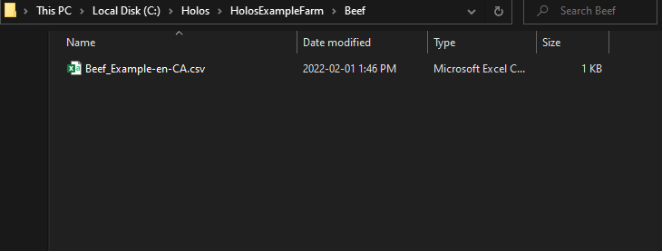
     
    <em>
		Figure 10-6 - Prompt to enter location of farm
	</em>

 

#### Add a New Farm to Existing Farms Folder:
How do I add a new farm to my current farms CLI folder
There are two methods to add a new farm to an existing farms folder. [The common questions section covers both methods.](#how-do-i-add-a-new-farm-to-my-current-farms-cli-folder)

#### Navigating through the Farms Folder:

1. By default, Holos will create an example farm folder in the Holos CLI “Farms” directory as shown below

 

 
     
    <em>
		Default farm folder created by CLI
	</em>

 

2.	This example farm folder will automatically contain a list of folders corresponding to all the components that are available for use in Holos (i.e., fields, cow-calf etc.). As well as a settings file for that specific farm folder

 

 
     
    <em>
		Default component folders created by CLI
	</em>

 

3.	Each of these component folders will all have a template data input Excel file that you can use as a reference to create additional data input files. Each data input Excel file represents one of that components whose folder we have chosen. 

	For example, if we are in the shelterbelts folder, each data input Excel file will represent one shelterbelt in your farm. So, if you have two shelterbelts in your farm, you will have two of these data input files.

 

 
     
    <em>
		Figure 10-6 - A template file representing a single component.
	</em>

 

### Modifying Settings Files

-	Each of your Farm Folders will have a settings file that will allow you to set the specific defaults such as Global Settings, Farm Defaults, Temperature, Precipitation, Evapotranspiration, Soil and Crop Defaults for that specific farm

1. Navigate to the farm folder whose default settings file you wish to modify.
2. In the selected farm folder, will be a file called “farm.settings”, open this file.
3. In the settings file, you can modify the default values for settings that are relevant to the operations in your farm such as:  Global Settings, Precipitation, Temperature, Evapotranspiration and Soil Defaults.
4. This settings file can be opened using any text editor e.g. Notepad.

 

 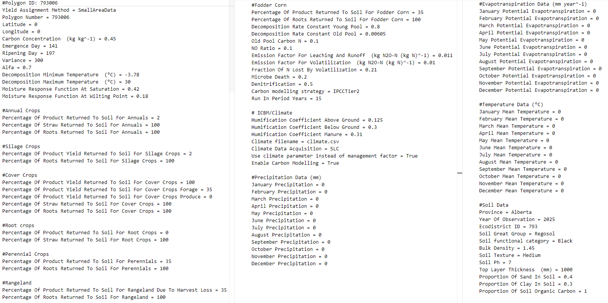
     
    <em>
		Figure 10-7 - Farm global settings file.
	</em>

 

### Modifying Component Data Input Excel Files

-	As mentioned above, each farm folder contains a list of folders that correspond to the available components that are available for use in Holos. Each of these component folders contains a template data input Excel file that you can **modify to suit the operations for each component in your farm.**
-	In this section, we will go through the guidelines for populating the data inputs for each of the component’s data input Excel files. **Each data input file should represent one of your components**. For example, if you have multiple shelterbelts on your farm, you will create a different data input Excel file **for each shelterbelt**.

 

#### Land Management Components

 

#### Shelterbelt Data Input Excel Files

-	**Row**: refers to the row in the Excel file
-	**Shelterbelt** row: refers to the row of trees in a shelterbelt
-	**Each row in the Shelterbelt data input Excel file can be split into three groups:**
	-	**Shelterbelt Data**: Hardiness Zone, Ecodistrict ID, Shelterbelt Name, Year of Observation
	-	**Shelterbelt Row Data**: Row Name, Row Length, Row ID, Plant Year, Cut Year
	-	**Tree Group Data**: Species, Planted Tree Count, Planted Tree Spacing(m), Live Tree Count, DBH 
-	If your shelterbelt row consists of more than one tree type, you would create an Excel data row that corresponds to each tree type that is a part of that shelterbelt row.

 

 
     
    <em>
		Figure 10-8 - Shelterbelt Data Input Excel Files.
		 
		A: Selterbelt Data.
		 
		B: Shelterbelt Row Data.
		 
		C: Tree Group Data.
	</em>

 

-	Below, we can see that both of the highlighted Excel rows are referring to the same shelterbelt row, the only difference is that **one Excel row refers to the tree type,** **caragana**, while the **other row refers to the tree type, green ash**. These two Excel rows together, represent the data for the shelterbelt row, “**Caragana, Green Ash**” which consists of the two tree groups where **each tree group has its own set of data, but they belong to the same row.**

 

 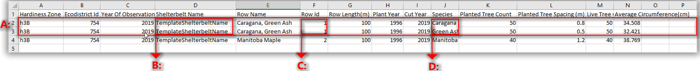
     
    <em>
		Figure 10-9 - Representation of a Single-Row Shelterbelt
		 
		A: The Excel rows that represent the shelterbelt row “Caragana, Green Ash”
		 
		B: Both Excel rows refer to the same single-row shelterbelt (e.g. N of House, West side, etc.)
		 
		C: Both Excel rows refer to the same row id (meaning they are part of the same shelterbelt row) e.g. front, middle, back
		 
		D: These two Excel rows have a different species because the single-row shelterbelt consists of the two species: caragana and green ash where each species has its own set of data
	</em>

 

- For every single row of trees in a shelterbelt, please set a unique row ID

-	For multi-row shelterbelts, each row of trees will need a unique row ID please follow the same procedure as shown above to populate the rest of the Excel data input file. 
-	However, there are some inputs that accept different data values such as the “Hardiness Zone” and “Species”. 

 

##### Special Data Input Values
-	**Hardiness Zone**:  Naming convention follows “H(0-9)(a-b)”. For example, a valid hardiness zone would be “H3a” or “H3b” or “H9a”, where the first letter will always be “H” and for the subsequent number/letter, you can choose a range between 0-9 and either a or b to represent the appropriate hardiness zone for your farm.
-	**Species**: Caragana, Green Ash, Hybrid Poplar, Manitoba Maple, Scots Pine, White Spruce, Average Deciduous, Average Conifer.
- For more information about the Shelterbelt component, [Click here](#shelterbelt-component)

 

#### Field Data Input Excel Files

-	**Row**: refers to the row in the Excel file
-	**Field Crop Row:** refers to a row of Crops in the Field component
	-	Each row in the field data input Excel file can be split into 7 groups with the corresponding data:
-	**Field Data**: Phase Number, Field Name, Area(ha), Current Year
-	**Crop Row Data**: Crop Year, Crop Type, Tillage  Type, Year In Perennial Stand, Row ID, Perennial Stand Length(Years), Biomass Coefficient Product, Biomass Coefficient Straw, Biomass Coefficient Roots, Biomass Coefficient Extra roots, Nitrogen Content In Product (kg kg^-1), Nitrogen Content In Straw (kg kg^-1), Nitrogen Content In Roots(kg kg^-1), Nitrogen Content In Extra roots (kg kg^-1), Carbon Concentration (kg kg^-1).
-	**Crop Data**: Yield (kg ha ^-1), Harvest Method, Nitrogen Fertilizer Rate(kg N ha^-1), Phosphorous Fertilizer Rate(kg P ha^-1), Is Irrigated, Irrigation Type, Amount Of Irrigation(mm), Moisture Content Of Crop(%), Percentage Of Straw Returned To Soil(%),Percentage Of Roots Returned To Soil(%), Percentage Of Product Yield Returned To Soil(%), Is Pesticide Used, Number Of Pesticide Passes
-	**Manure Data**: Manure Applied, Amount of Manure Applied (kg ha^-1), Manure Application Type, Manure Animal Source Type, Manure State Type, Manure Location Source Type
-	**Cover Crop Data**: Cover Crops Used, Cover Crop Type, Cover Crop Termination Type
-	**Undersown Crop Data**: Under Sown Crops Used
-	**Grazed Crop Data**: Crop Is Grazed
-	The figures below are an example of the different data groups based on the field data input Excel file to make it easier to visualize.

 

**Field Data Input Section (Field and Crop Row Data)**

 

 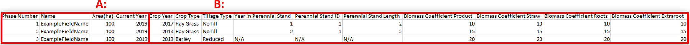
     
    <em>
		Figure 10-10 - Field Data Input Section (Field and Crop Row Data)
		 
		A: Field Row
		 
		B: Crop Row Data
	</em>

 

**Field Data Input Section (Crop Row Data)**

 

 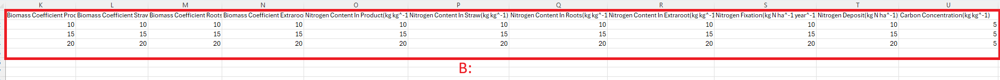
     
    <em>
		Figure 10-11 - Field Data Input Section (Crop Row Data)
		 
		B: Crop Row Data – numbers and coefficients can be found in the Holos algorithm document.
	</em>

 

**Field Data Input Section (Crop Data)**

 

 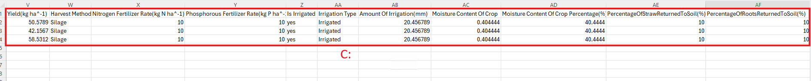
     
    <em>
		Figure 10-12 - Field Data Input Section (Crop Data)
		 
		C: Crop Data
	</em>

 

**Field Data Input Section (Crop Data, Manure Data, Cover Crop Data)**

 

 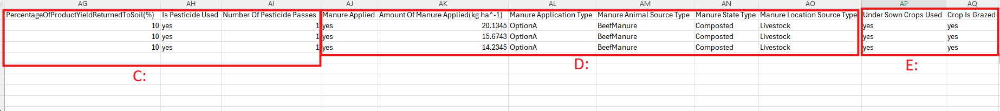
     
    <em>
		Figure 10-13 - Field Data Input Section (Crop Data, Manure Data, Cover Crop Data)
		 
		C: Crop Data 
		 
		D: Manure Data
		 
		E: Cover Crop Data
	</em>

 

**Field Data Input Section (Undersown Crops or Grazed Crop Data)**

 

 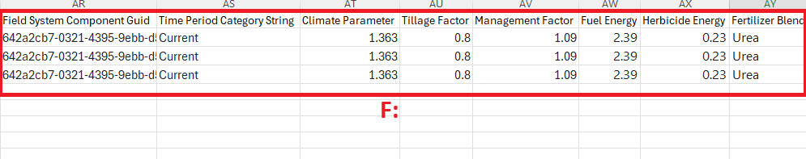
     
    <em>
		Figure 10-14 - Field Data Input Section (Crop Data).
		 
		F: Undersown Crops/Grazed Crop Data.
	</em>

 

-	**Each Excel row represents the data associated with ONE crop** (Crop, Manure, Cover Crop Data, etc.) and the Crop Row/Field the Crop the Crop belongs to (Crop Row\Field Data).

 

##### Perennial Crop

-	If the crop is **perennial, there are three important data fields that need to be filled properly**: Crop Year, Perennial Stand ID, and Perennial Stand Length (Years). 
-	Perennial stand ID takes on the form of 00000000-0000-0000-0000-000000000000, where the zero’s can be any character you wish.  A simple stand ID might be 00000000-0000-0000-0000-000000000001.
-	**To create a perennial stand length**, please create the appropriate row(s) for each year but **change the Crop Year and Year in Perennial Stand accordingly and refer to the appropriate Perennial Crop via the Perennial Stand ID**. (i.e. if we are referring to PerennialCrop1, and it has a Perennial Stand Length of four years, we will have four Excel rows that refer to the Perennial Stand ID of 00000000-0000-0000-0000-000000000001 but with different values for the Crop Year (2017, 2018, 2019 & 2020) and Year In Perennial Stand (1, 2, 3, 4)  and varying data values for the Crop’s Data. 
-	This is so that we can accurately group together the **perennial crop(s)** data for each year. 
-	**For each different type of perennial crop, please assign a unique perennial stand ID**. E.g. If the perennial stand was a mixed hay of smooth brome grass & alfalfa; smooth brome would have a unique perennial stand ID and alfalfa would have a unique perennial stand ID.
-	Therefore, for each of the perennial crops in your field, please follow the same procedure as shown above to populate the rest of the field Excel data input file. 
-	Look at Figures 10.10 - 10.14 for examples of Perennial Crop Data (Hay Grass).

 

##### Annual Crop

-	**If the crop is not a perennial crop**, please set the values for the Perennial Stand headers above to “N/A” and the stand ID to 00000000-0000-0000-0000-000000000000. Populate the rest of the data columns appropriately for that crop.
-	Therefore, for each of the annual crops in your field, please follow the same procedure as shown above to populate the rest of the Field Excel data input file. 
-	Look at Figures 10.10 - 10.14 for examples of Non-Perennial Crop Data (Barley).

 

##### Special Data Input Values:

**Crop Type**:

- **Annual crops, Spring seeded**: 
 	- **Cereals** – Wheat, Barley, Oats, etc.
	- **Oilseeds** - Canola, Mustard, flax
	- **Pulses** – Soybean, Beans (dry field), Chickpea, etc. 
	- **Root crops** – Potato, Sugar Beets
	- **Corn** – Grain corn, silage corn 
	- **Cover crops** – Winter weeds, Rye, Hairy vetch, Hairy vetch + Rye
	- **Other** – Safflower, Sunflower seed, Tobacco, etc.
- Annual, Fall Seeded: 
	- Winter wheat
	- Fall Rye
- **Perennial Crops:**
	- Forage crops for Hay - legumes, grasses & mixed.
	- Pasture
	- Grassland (native)
	- Forage for seed

**Harvest Methods:**
- Cash Crops
- Swathing
- Silage
- GreenManure

**Tillage Type:**
- Intensive
- No Tillage
- Reduced

**Is Irrigated, Manure Applied, Cover Crops Used, Crop Is Grazed**: 
- Yes
- No

**Manure Application Type**:  
- Tilled Land Solid Spread
- Untilled Land Solid Spread
- Slurry Broadcasting
- Drop Hose Banding
- SHallow Injection
- Deep Injection

**Manure Location Source Type:**  
- Livestock
- Imported

**Manure Animal Source Types:** 
- Beef Manure
- Dairy Manure
- Swine Manure
- Poultry Manure

**Cover Crop Types:** 
- Alfalfa
- Annual Ryegrass
- Austrian winter pea

If you need to know more about the Field Component, [Click Here: More Information On The Field Component](#field-component)

 

#### Animal Components

-	The animal components consist of **Swine, Beef, Dairy, Sheep, Poultry and Other Livestock** groups.
-	Animal components all **consist of different animal groups** 
-	Each animal group has its own management period(s) that consists of data for the **Diet, Housing and Manure** details **for one management period.**
-	**You can have multiple management periods for an animal group.** 
-	**If you have multiple management periods for an animal group**, please add another row referring to the same animal group (**same group name and group type**) but change the management period data accordingly.
-	**You cannot have two different animal types that belong to the same group**. For example: if you are looking at a swine component and you have one group called “SwineStartersGroup1”. This group cannot refer to more than one animal type (i.e. only Swine Starters, or Swine Finishers or Growers) – you can call the group anything you want, **an animal group cannot refer to more than one animal type.**
-	Some **animal components** will have some extra data that are specific to their animal type such as **Milk Production** for dairy animals or **Wool Production** for sheep.
-	In this section, we will go over the different types of animal components and their data files. 
-	**Below** is an example of the categories you will see in an animal component data file.
-	The headers **Housing Type** and **Manure Management** are only shown below as an example to make it easier to categorize. They will **NOT** be present in your data input files.

 

##### Example of Animal Component Data Broken Down into Sections

 

 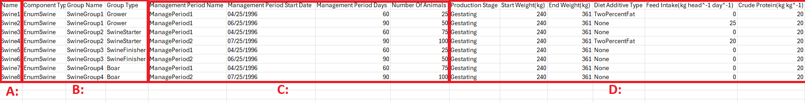
     
    <em>
		Figure 10-15 - Swine Data Section 1
		 
		A:  Swine Component Name.
		 
		B: Swine group data.
		 
		C: Swine group management period'.
		 
		D: Diet details for management period.
	</em>

 

 

 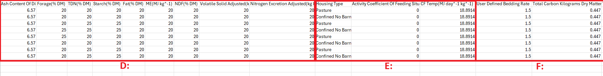
     
    <em>
		Figure 10-16 - Swine Data Section 2.
		 
		D:  Diet details for management period.
		 
		E: Housing details for management period.
		 
		F: Manure details for management period.
	</em>

 

 

 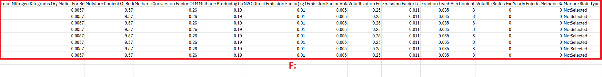
     
    <em>
		Figure 10-17 - Swine Data Section 2.
		 
		F: Manure details for management period.
	</em>

 

##### Special Data Input Values for All Animal Components

-	The data inputs are **not case-sensitive** but please make sure to **spell them correctly**!.
-	These apply to **all animal components**, the only data field that **varies is the group type**.
-	There are some data fields that **require special inputs for the data to process correctly**. Please look for the headers below and choose from the list accordingly:
	-	**Group Type: varies** based on the animal component, **described in each section** corresponding to the animal component.
	-	**Diet Additive Type**: two percent fat, four percent fat, none.

 

##### Swine Data Input Excel Files

-	**Each row** in the Excel file will refer to **one of these animal groups** and **one management period** (an animal group can have multiple management periods).
-	**If you have multiple management periods for an animal group (same group name and group type)**, please add another row referring to the same animal group but change the management period data accordingly.
-	Go to figure’s 10.15-10.17 above to see an example of a swine component data file.

 

##### Swine Special Data Input Values

-	A swine component can refer to the following swine animal groups:
-	**Group Type**: gilts, sows, boars, piglets, hogs

 

##### Beef Data Input Excel Files

-	**Each row** in the Excel file will refer to **one of these animal groups** and **one management period** (an animal group can have multiple management periods).
-	**If you have multiple management periods for an animal group (same group name and group type),** please add another row referring to the same animal group but change the management period data accordingly.
-	Some beef components have **specific data** for **average daily gain,**
-	The “**lactating cows**” animal group requires additional fields for the **milk production, milk fat content and milk protein**
-	If the data does not apply to the animal group, please enter “N/A” as shown below in Figure 10.18

Below is an example of a beef component data file broken into sections

 

 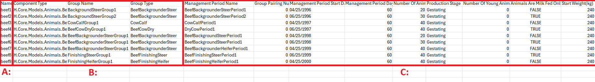
     
    <em>
		Figure 10-18 - Beef Data Section 1
		 
		A: Beef component name
		 
		B: Beef group data
		 
		C: Beef group management period
	</em>

 

 

 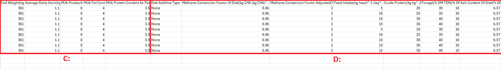
     
    <em>
		Figure 10-19 - Beef Data Section 2
		 
		C: Beef group management period
		 
		D: Diet details for management period
	</em>

 

 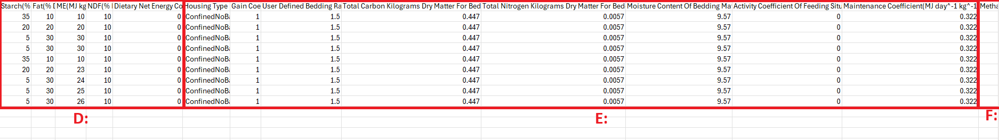
     
    <em>
		Figure 10-20 - Beef Data Section 3
		 
		D: Diet details for management period
		 
		E: Housing details for management period
		 
		F: Manure details for management period
	</em>

 

 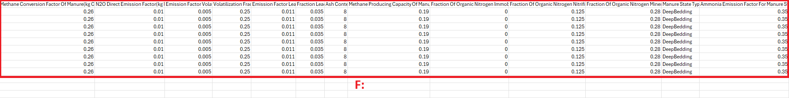
     
    <em>
		Figure 10-21 - Swine Data Section 4
		 
		F: Manure details for management period
	</em>

 

##### Beef Special Data Input Values

-	A beef component can refer to the following beef animal groups: 
- Group Type: 
	- Heifer
	- Seer
	- Bulls
	- Replacement Heifers 
	- Lactating Cows
	- Calves

 

##### Dairy Data Input Excel Files

-	Each row in the Excel file will refer to one of these animal groups and one management period (an animal group can have multiple management periods).
-	If you have multiple management periods for an animal group (same group name and group type), please add another row referring to the same animal group but change the management period data accordingly.
-	Dairy components have specific data for average daily gain, milk production, milk fat content and milk protein
-	If the data does not apply to an animal group, please enter “N/A” as shown below in Figure 10.18

 

**Below is an example of a dairy component data file broken into sections:**

 

 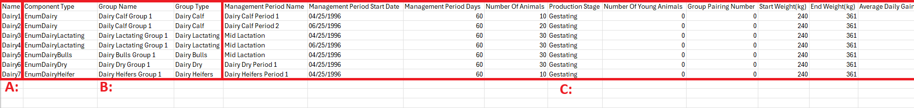
     
    <em>
		Figure 10-22 - Dairy Data Section 1.
		 
		A: Dairy component name.
		 
		B: Dairy group name.
		 
		C: Dairy group management period.
	</em>

 

 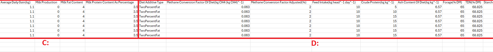
     
    <em>
		Figure 10-23 - Dairy Data Section 2.
		 
		D: Diet details for management period.
	</em>

 

 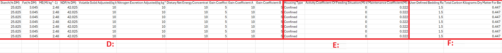
     
    <em>
		Figure 10-24 - Dairy Data Section 3.
		 
		D: Diet details for management period.
		 
		E: Housing details for management period.
		 
		F: Manure details for management period.
	</em>

 

 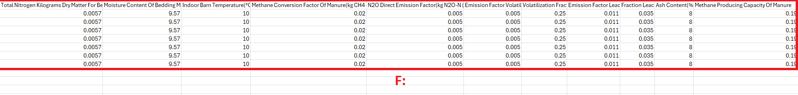
     
    <em>
		Figure 10-25 - Dairy Data Section 4.
		 
		F: Manure details for management period.
	</em>

 

##### Dairy Special Data Input Values

-	A dairy component can refer to the following dairy animal groups:
- Group Type: 
	- Dairy Lactating 
	- Dairy Calf 
	- Dairy Bulls
	- Dairy Heifers
	- Dairy Dry

 

##### Sheep Data Input Excel Files

-	Each row in the Excel file will refer to **one of these animal groups** and **one management period** (an animal group can have multiple management periods).
-	**If you have multiple management periods for an animal group (same group name and group type)**, please add another row referring to the same animal group but change the management period data accordingly.
-	Sheep components have specific data for **wool production, energy required to produce wool, energy required to produce milk, gain coefficient A and gain coefficient B**,
-	**If the data does not apply to an animal group, please enter “N/A” as shown below in figure 10.18**

Below is an example of a sheep component data file broken into sections

 

 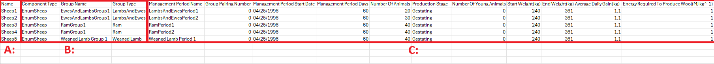
     
    <em>
		Figure 10-26 - Sheep Data Section 1.
		 
		A: Sheep component name.
		 
		B: Sheep group name.
		 
		C: Sheep group management period.
	</em>

 

 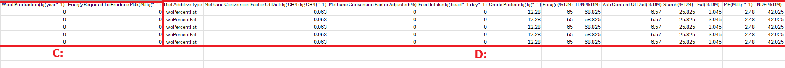
     
    <em>
		Figure 10-27 - Sheep Data Section 2.
		 
		C: Sheep group management period.
		 
		D: Diet details for management period.
	</em>

 

 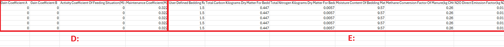
     
    <em>
		Figure 10-28 - Sheep Data Section 3.
		 
		E: Housing details for management period.
		 
		F: Manure details for management period.
	</em>

 

##### Sheep Special Data Input Values

- A sheep component can refer to the following sheep animal groups: 
- Group Type:
	- Lambs and Ewes 
	- Ram
	- Weaned Lamb

 

##### Poultry Data Input Excel Files

-	**Each row** in the Excel file will refer to **one of these animal groups** and **one management period** (an animal group can have multiple management periods).
-	**If you have multiple management periods for an animal group (same group name and group type),** please add another row referring to the same animal group but change the management period data accordingly.
-	**Poultry components do not require data for the diet, housing, and manure details.**

**Below is an example of a poultry component data file broken into sections**

 

 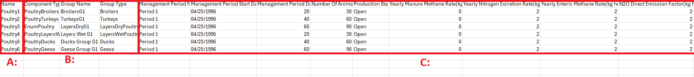
     
    <em>
		Figure 10-29 - Poultry Data Section 1.
		 
		A: Poultry component name.
		 
		B: Poultry group data.
		 
		C: Poultry group management period.
	</em>

 

 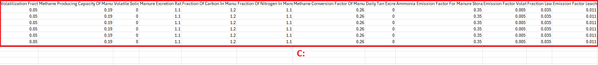
     
    <em>
		Figure 10-30 - Poultry Data Section 2.
		 
		C: Poultry group management period.
	</em>

 

##### Poultry Special Data Input Values

- A poultry component can refer to the following poultry animal groups:
- Group Type 
	- Turkeys 
	- Ducks
	- Layers Dry Poultry 
	- Layers Wet Poultry
	- Broilers
	- Geese

##### Other Livestock Data Input Excel Files

-	**Each row** in the Excel file will refer to **one of these animal groups** and **one management period** (an animal group can have multiple management periods).
-	**If you have multiple management periods for an animal group (same group name and group type)**, please add another row referring to the same animal group but change the management period data accordingly.

 

 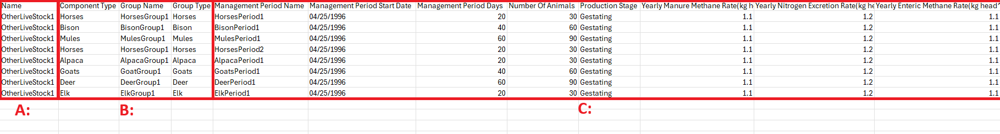
     
    <em>
		Figure 10-31 - Other Livestock Data Section 1
		 
		A: Other livestock component name
		 
		B: Other livestock group data
		 
		C: Other livestock group management period
	</em>

 

 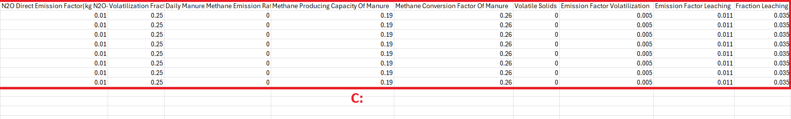
     
    <em>
		Figure 10-32 - Other Livestock Data Section 1
		 
		C: Other livestock group management period
	</em>

 

##### Other Livestock Special Data Input Values

-	Another livestock component can refer to the following other livestock animal groups:
- 	Group type
	- 	Alpacas
	- 	Goats
	- 	Deer
	- 	Elk
	- 	Horses
	- 	Mules
	- 	Bison

 
 

## Using the Command Line Interface

-	If you have not set up your folders and data input files for the components in your farm(s), please click here: [How to Set Up the Command Line Interface](#setting-up-the-command-line-interface)
-	If you do not know how to modify your settings file for your farm please click here: [How to Modify the Settings Files for a Farm](#modifying-settings-files)
-	Please look at the CLI Checklist here: [Holos Command Line Interface Checklist](#check-list-for-command-line-interface)
-	Otherwise, the files corresponding to your farm(s) are ready to be processed and this section will guide you on how to run the Command Line Interface.

 

1.	In your settings file for each farm, adjust the settings to suit your operations. If you do not know what a settings file is, please click here: [Modifying Settings Files](#modifying-settings-files).

2.	The first time you start the Command Line Interface, you will be prompted to enter the location of your “Farms” folder (this can be any folder that you create on your computer). 

	The subsequent times you start the Holos Command Line Interface, you will be asked if you would like to use your previously entered location or to enter a new location. 

	Refer to [Creating a New Farms Folder](#creating-a-new-farms-folder) for help creating an initial farms folder and learning about subsequent prompts.

3. You will be prompted to select a unit of measurement for the program to run in (Metric = 1, Imperial = 2). Please select an option

4. The Command Line Interface will now process each of the farms that you have created and their corresponding component data input files.

	When the processing and parsing is finished, you will see a "Conversion Finished" message in the CLI.
	
5. The results for your farm(s) will be exported to the base directory of your “Farms” directory in an “Outputs” folder to be in Step 1. 

 

 
     
    <em>
		Figure 10-33 - The output folder is created after the CLI is finished processing files.
	</em>

 

 
 

## Command Line Interface Results

-	The Command Line Interface will output the **results for each farm** you have created and their respective components as well as the **total results for all the farms combined.**
-	The results will be displayed in an Excel file and correspond to the following categories: **Carbon Dioxide Equivalence Emissions, Green House Gas Emissions, Estimates of Production and Feed Estimates.**
-	**Carbon Dioxide Equivalence Emissions** are in units of **Megagrams (Mg)** and **Green House Gas Emissions** are in units of **kilograms (kg).**
-	**If you have multiple settings files for a farm**, there will be results files for each settings file in that farm.
-	You can find these results in the “**Outputs**” folder of the Holos Command Line Interface base directory.
-	**If you are looking for more specific results for each farm, please go to the appropriate farm output folder.**

 

### Total Results (Yearly Basis)

-	The **Total Results (All Farms)** will calculate the appropriate estimates for every farm and their respective components and animal groups and will display them in an Excel file. You will be able to see the totals for each farm and the totals for all the farms combined on a **yearly basis.** 
-	**Each component** in a farm **is categorized** in the following: **Beef Production, Dairy, Other livestock, Poultry, Sheep, and Swine.**
-	**If the data is not applicable**, the data field will show “N/A”
-	**Each component category** consists of **components**, where each component consists of **animal groups.** 
-	The results for each of these component categories and their respective components will be calculated and displayed for each farm.
-	These results will be in the “**Outputs**” folder located in the base directory of your “**Farms**” folder in the “**TotalResultsForAllFarms**” folder

 

 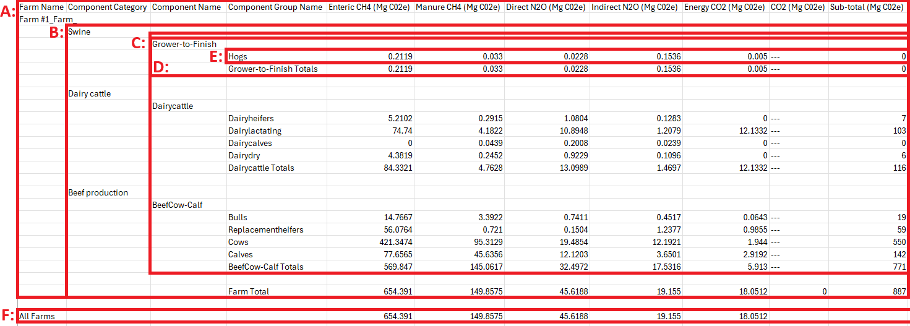
     
    <em>
		Figure 10-34 - Total Results For A Farm – Yearly Basis
		 
		A: Data corresponding to a farm and settings file
		 
		B: Data corresponding to a component category
		 
		C: Data corresponding to a component
		 
		D: Data corresponding to Grower Totals
		 
		E: Data corresponding to an animal group
		 
		F: Totals for all farm
	</em>

 

### Results For A Farm (Monthly Basis)

-	The **results for each farm** will calculate the appropriate estimates for each farm and their respective components and animal groups and will display them in an Excel file. You will be able to see the totals for the farm, and each component and animal group **monthly**. These results will be in the “**Outputs**” folder and in the appropriate farm’s results directory folder in the format: **YourFarmName_Results.**
-	**If the data is not applicable**, the data field will show “N/A”
-	**Each component** in a farm is **categorized** in the following: **Beef Production, Dairy, Other livestock, Poultry, Sheep, and Swine.**
-	Each component category consists of components, and each one of those component consists of animal groups. 
-	**Each** animal group is split up into **months**.
-	The results for each of these component categories and their respective components will be calculated and displayed for each farm. The **farm totals** will be displayed at the very bottom

 

 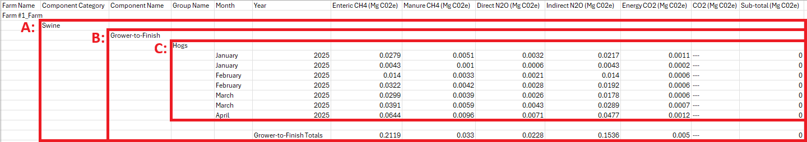
     
    <em>
		Figure 10-35 - Total Results For A Farm – Monthly Basis
		 
		A: Results for a component category
		 
		B: Results for a component
		 
		C: Monthly results for an animal group, including totals for all the months
	</em>

 

### Carbon Dioxide Equivalence Emissions

-	Holos will calculate the carbon dioxide equivalence emissions for each Farm and their respective components.
-	The results will include the following calculated emission values: **Enteric CH4, Manure Ch4, Direct Nitrous Oxide, Indirect Nitrous Oxide, Energy Carbon Dioxide and Carbon Dioxide emissions.**
-	**Energy carbon dioxide** is calculated for **each animal group** (i.e. backgrounder steers), **therefore**, you will see “**N/A**” for the data fields that are not applicable.

 

### Green House Gas Emissions

-	Holos will calculate the green house gas emissions for each farm and their respective components.
-	The results will include the following calculated emission values: **Enteric CH4, Manure CH4, Direct Nitrous Oxide, Indirect Nitrous Oxide, Energy Carbon Dioxide and Carbon Dioxide emissions.** 
-	**Energy carbon dioxide** is calculated for **each animal group** (i.e. backgrounder steers), **therefore**, you will see “N/A” for the data fields that are not applicable.
-	**However, these are not converted to carbon dioxide equivalence values**

 

### Estimates of Production

-	Holos will calculate the estimates of production for each farm and their respective components.
-	The results will include the following calculated estimates of production values: **Harvest, Area, Manure Available for Land Application, Beef Produced, Lamb Produced, Milk Produced and Fat Protein Corrected Milk Production.**

 

### Feed Estimates

-	Holos will calculate the estimates of production for each farm and their respective components.
-	The results will include the following calculated feed estimate value: **Dry Matter Intake.**

 

### Specific Component Results for a Farm

-	In each farm output folder, there will be directories corresponding to each available land management component category in Holos. 
-	For each land management component, there will be a specific output results file for each land management component data file you have made. **These results are specific to the component you are interested in** and we will go over each in this section.

 

#### Shelterbelt Component Results
-	The shelterbelt results will provide carbon emission details for every row and their corresponding species ranging from the **start year** until the **cut year.**

 

#### Field Component Results
-	The field results will display results based on the **Introductory Carbon Balance Model (ICBM)** which will show all the carbon and nitrogen emission information related to your crops from 1985 to present day.

 

### Navigating Through Holos CLI Results Directories

Below are example directories and their corresponding results

#### Total Results Example Directory

 

 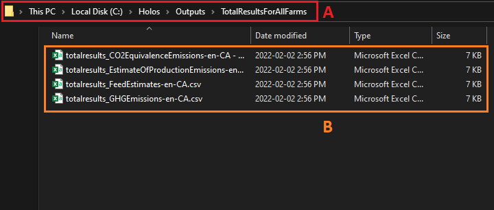
     
    <em>
		Figure 10-36 - Total Farm results directory
		 
		A: Path to total results for all farms directory. The results folder is created inside the user created general Farms directory
		 
		B: Output files for each calculated result category (yearly basis)
	</em>

 

#### Results for a Farm Example Directory

 

 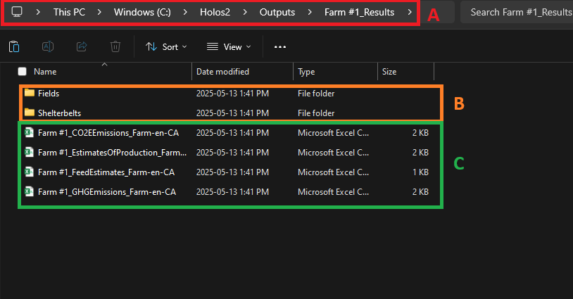
     
    <em>
		Figure 10-37 - Results for each calculated category
		 
		A: Path to the directory
		 
		B: Specific output results for each land management component in a farm
		 
		C: Output files for each calculated result category (monthly basis) for the farm and for each settings file
	</em>

 

## Check List for Command Line Interface

-	The Command Line Interface requires the data inputs to be properly formatted and the appropriate components to be created for the data to be able to be processed. 
-	This section is a guideline for you to make sure that you do not encounter any errors when setting up the Command Line Interface.
-	 If you do encounter errors please click here: [Error Guide For The Command Line Interface](#error-guide-for-the-command-line-interface)

 

### Properly Filled Data Files
-	Fill according to the guidelines in the section: [How To Modify Component Data Input Excel Files](#modifying-component-data-input-excel-files)
-	**Remember that each file is a representation of one of the components in your farm**. For example, if you have two shelterbelts that you would like to represent as data input Excel files, you will need to create two data input Excel files, one for each shelterbelt and make sure their names are unique.
-	**Do not modify or remove the headers** of any of the data input Excel files or the Command Line Interface will stop processing.
-	**Fill in the data corresponding to the guidelines for each component**, there are **special headers that require specific data inputs** that you can choose from in each guideline. Make sure you spell your data inputs correctly!
-	**If you encounter one of these errors**, please navigate to the appropriate component guide under: [Modifying Component Data Input Files](#modifying-component-data-input-excel-files). Each of the sections will have a guide for the special data fields, indicating what data inputs are valid for that field.
-	**Do not input negative values where they do not make sense**. For example, if you set the “Year of Observation” to be “-1996”, the Command Line Interface will stop processing
-	**Do not leave data fields empty,** the command line interface will stop processing if there is no data.
-	**For some data fields, if the header is not applicable,  set the data input to be “N/A”**, for example in a field component, if you have an annual crop and you come across the headers “**Perennial Stand ID**”, “**Perennial Stand Length**” and “**Year in Perennial Stand**”, please set those fields to be “**N/A**”

 

### Unique Names for Components

For example, in the shelterbelts directory, if you have two Excel files: Shelterbelt1.csv and Shelterbelt2.csv and they both hold data for the component “ExampleShelterbelt1”, the Holos Command Line Interface will not process the data because their names are not unique.

 

### Valid References to Other Components

The user must ensure that the references to other components are valid and the component is actually a data file.

-	Make sure that if one of your component’s requires a reference to another component you have made, that the component you are referencing has the proper data input Excel file created in the appropriate farm and component folder and that you reference the component’s name (**NOT THE FILE NAME**) if you are required to refer to it in one of your data input fields for another component.
-	**For example**, in a **swine** component, you have selected the **Housing Type** to be “Pasture” and the pasture you would like to refer to is a custom field that reflects your farming operation. **Please make sure to create a data input Excel file with the data that reflects your custom field in the chosen farm’s fields folder** and make sure that the component name data field for each data input file is unique(**you cannot have components with the same name**).
-	Therefore, if the custom field component you have created has its **field name** set to “**FieldNameExample1**”, then whenever you would like to refer to that specific field in any component that can have a reference to a field, you would set the data field to be “FieldNameExample1”. 
-	As a result, for the pasture data field of the swine component, you would set the data input field to be “FieldNameExample1” if you would like to refer to that custom field.

 

### CLI Generated Cmponent Directory Names are not Changed

The user must ensure that they do not change the names of the component directories in each farm.

If the names of the component’s are not valid, the data will not be processed. You will be shown a message that will tell you which component directory is invalid.

 
 

## Error Guide for the Command Line Interface

-	This section will focus on the possible errors that can occur when you are creating your data input Excel files for each component.
-	The error message will always be displayed on the Command Line Interface and will tell you the row, column, and file where the error has occurred.
-	**If the Command Line Interface encounters any of the errors below, it will stop execution of the program until the issue is fixed.**

 

### General Data Input Errors

### One of the Data Values is Empty

1. Below is an example of an empty data value in a shelterbelt data input Excel file

 

 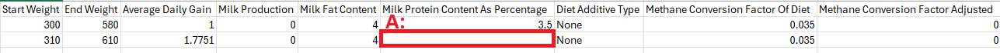
     
    <em>
		Figure 10-38 - Example of an Empty Data Value in a Shelterbelt Data Input Excel File
		 
		A: Empty data value
	</em>

 

2.	If this error occurs, you will be shown a message on the Command Line Interface stating that there is an empty data value at row, column, and the file where the error occurred.

 

 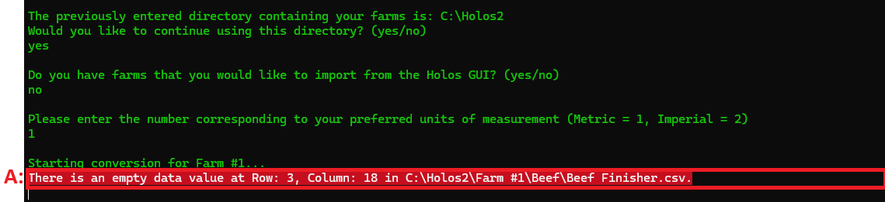
     
    <em>
		Figure 10-39 - Command Line Interface Encountering Empty Data Error.
		 
		A: The error message displayed if the data input excel file has an empty data value.
	</em>

 

 

### Negative Values for Data Fields Where It Does Not Make Sense

1. Below is an example of a negative value for a data field in a Shelterbelt data input Excel file. It does not make sense for the Year of Observation to be -1996.

 

 
     
    <em>
		Figure 10-40 - Example of a Negative Value That Does Not Make Sense in a Shelterbelt Data Input Excel File
		 
		A: Invalid negative data value for year of observation
	</em>

 

2. If this error occurs, you will be shown a message on the Command Line Interface stating the invalid, negative data value and the row, column, and file where the error occurred.

 

 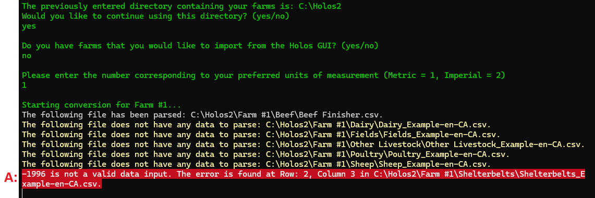
     
    <em>
		Figure 10-41 - Command Line Interface Encountering Invalid Negative Data Value
		 
		A: The error message displayed if the data input excel file has an invalid negative data value 
	</em>

 

### A Header Has Been Modified (Misspelled, Empty, Special Characters)

Please do not modify the headers in any of the component data input Excel files.

1. Below is an example of a header that has been modified – meaning it is empty or has been misspelled

 

 
     
    <em>
		Figure 10-42 - Example of an Invalid Header in a Shelterbelt Data Input Excel File
		 
		A: Invalid header value
	</em>

 

2.	If this error occurs, you will be shown a message on the Command Line Interface stating the location of the invalid header by the row and the file where the error occurred. You will also be shown the valid header that should be in that file.

 

 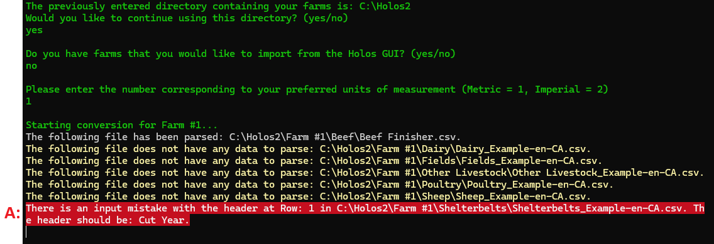
     
    <em>
		Figure 10-43 - Command Line Interface Encountering An Invalid Header.
		 
		A: Invalid header value.
	</em>

 

### Unique Fields That Have Special Data Input Values

-	These errors are special because they **require specific data input values** and are **different for each component** (i.e. A shelterbelt component will have different fields than a field component, therefore the errors you may encounter will be different).
-	**If you encounter one of these errors**, please navigate to the appropriate component guide under: [Modifying Component Data Input Files](#modifying-component-data-input-excel-files). Each of the sections will have a guide for the special data fields, indicating what data inputs are valid for that field.

 

1. Below is an example of a special data field in the shelterbelt data input file that has been incorrectly entered. A “Hardiness Zone” can take a data value in the following format: “H(0-9)(a-b)”. Meaning the data values should always be preceded by an “H” and the subsequent numbers/letter can be any value within the specified range (0-9 or a-b).

 

 
     
    <em>
		Figure 10-44 - Example of an Invalid Special Data Input Value for Hardiness Zone in a Shelterbelt Data Input Excel File
		 
		A: Invalid hardiness zone value
	</em>

 

2. If this error occurs, you will be shown a message on the Command Line Interface stating the invalid, data value corresponding to a specific unique field, and the row, column, and file where the error occurred

 

 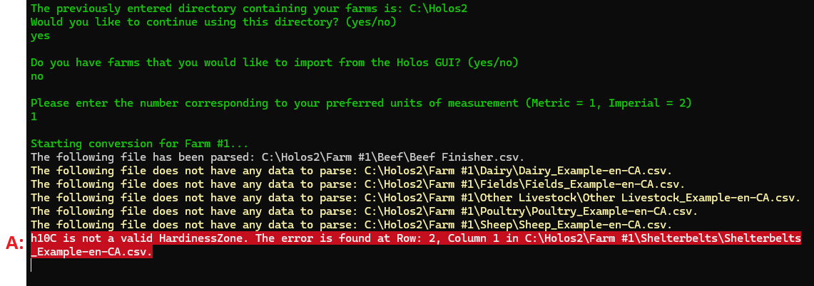
     
    <em>
		Figure 10-45 - Command Line Interface Encountering Invalid Special Data Input Value
		 
		A: The error message displayed if there is an invalid special data input value in the data input Excel file
	</em>

 

 
 

# Chapter 11 Common Questions & Toubleshooting

### How do I enable Advanced Mode:

If you have started the farm in Basic mode and want to switch to Advanced mode, the process is extremely simple.

1. Click on **Settings** in the top menu bar.
2. Select **"Farm Defaults"**.
3. Select "Advanced Mode" under the "**Farm**" tab.

 

 
     
    <em>
		Figure 11-1 - Advanced mode can be selected from the farm defaults/details setting.
	</em>

 

### How do I enable Multi Year Mode

Multi-year mode is only available if you are currently in Advanced Mode. If you are currently in Basic Mode, please [switch over to Advanced Mode](#how-do-i-enable-advanced-mode). After doing that look for a toggle at the top-right of the Holos program. You can use this toggle to switch between either mode.

 

 
     
    <em>
		Figure 11-2 - Click the Toggle to Switch between Basic and Advanced Mode.
	</em>

 

### How to switch between IPCC Tier 2 & ICBM Carbon models

Holos uses the IPCC Tier 2 carbon model as default but allows the user to switch to and from the ICBM carbon model. To switch between the models:

1. Click on "**Settings**" in the top menu bar.
2. Select "**User Settings**".
3. In the "**Carbon Modelling Strategy**" drop-down, select the carbon model you want to use in your calculations.

 

 
     
    <em>
		Figure 11-3 - Switching between carbon models that are used in Holos.
	</em>

 

### How do I add a new farm to my current farms CLI folder:

##### Method 1: Copying an existing empty farm folder.

1. In your current 'Farms" folder, create a new folder for your new farm with an appropriate name.
2. Copy all files from an existing farm and paste them into this new folder that you have just created.
3. Modify the data input files as needed.

##### Method 2: Running the CLI again.

1. Start the Holos CLI.
2. You will be prompted to use the previously used Farms folder. Select**yes**.
3. Select the appropriate units of measurement in the next prompt.

 

 
     
    <em>
		Figure 11-4 - Using the Holos CLI to create a new farms folder.
	</em>

 

### How to find the Holos Program data file(s).

The Holos program data files contain useful information that can help the Holos developers troubleshoot program crashes and other issues you might notice in the program. The Holos data files are unique to each system that in running the Holos software and is based on your usage of the program. You can find these files by following these steps:

- On your windows computer, **press the start button**. This is the button on the bottom left corner of your screen that looks like a windows icon. After pressing this button type **run** and press **enter**.

 

 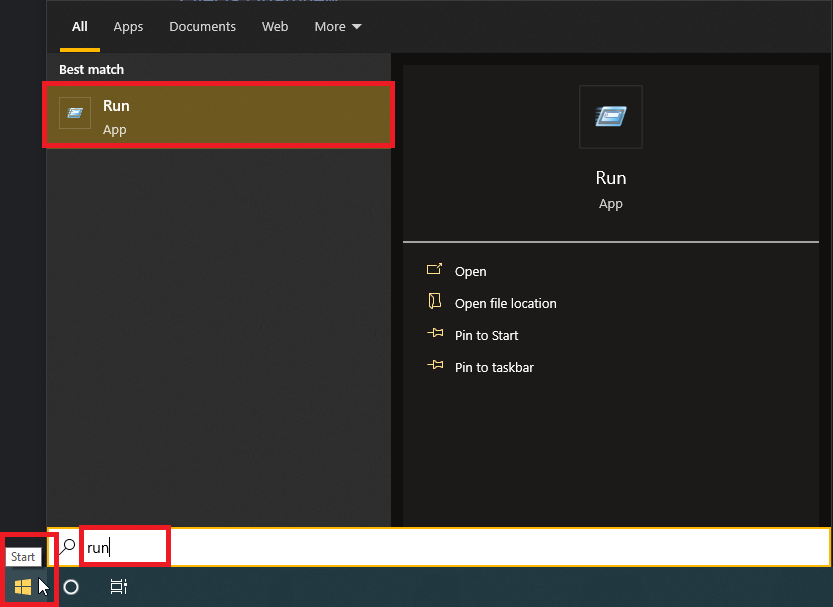
     
    <em>
		Figure 11-5 - Type run in windows search.
	</em>

 

- When you press enter, a new window will pop-up on the screen. In this window, type **%LocalAppData%** and then **press enter again** or click on the **OK button**.

 

 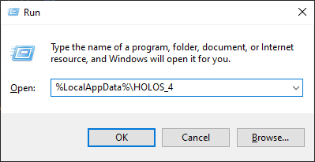
     
    <em>
		Figure 11-6 - Opening the local folder inside the Appdata folder.
	</em>

 

- After pressing enter, another window will now appear on your screen. This window will show you the contents of the Appdata folder on your PC. In this new window, find a folder called **HOLOS_4**. You might have to scroll down and look for the folders starting with the letter **H**.

 

 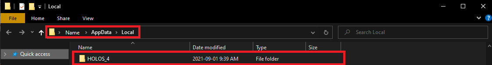
     
    <em>
		Figure 11-7 - Locate the folder called HOLOS_4
	</em>

 

- Open the folder called HOLOS_4 and inside this folder, you will find files related to the configuration and settings of the Holos program. For example, one of these files is named **json-data**. This file is the Holos project data file and includes data and information regarding your farms and settings. Depending on how you use Holos, there might be multiple files in this folder in addition to **json-data**.

 

 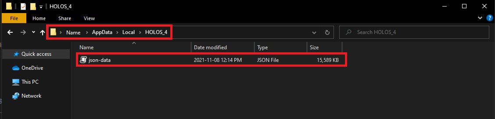
     
    <em>
		Figure 11-8 - json-data file stores information regarding your farm(s) and settings.
	</em>

 

-	If you are trying to troubleshoot Holos, please add all these files to a zip archive and send that .zip file to [aafc.holos.acc@canada.ca](mailto:aafc.holos.acc@canada.ca) as an attachment. Please see the following section on [how to create a .zip archive](#how-to-create-a-zip-archive-file).

 

### How to create a .zip archive file

#### Instructions for Windows 11 based systems

Please follow these steps for Windows 11 based systems. In this example we will work with the **HOLOS_4** folder mentioned in the [how to find the holos data files section.](#how-to-find-the-holos-program-data-files)

1.	Using your mouse, while holding down the left mouse button, select all the files you want to add to your achieve(.zip) file. In this example, this will be all the files inside HOLOS_4 folder.

 

 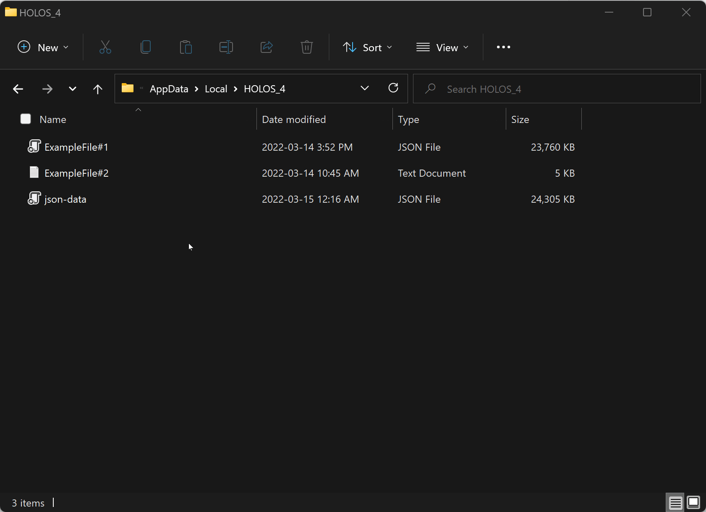
     
    <em>
		Figure 11-9 - Highlight all the files you want to add to the archive.
	</em>

 

2.	After selecting all the files. Right click using your mouse’s right button on any of the highlighted files to open a new menu. In this new menu, select “**Compress to ZIP file**”. Selecting this option will open a pop-up with a progress bar showing your files being compressed. This process will create a single .zip file containing all the files you selected in **Step 1.**

 

 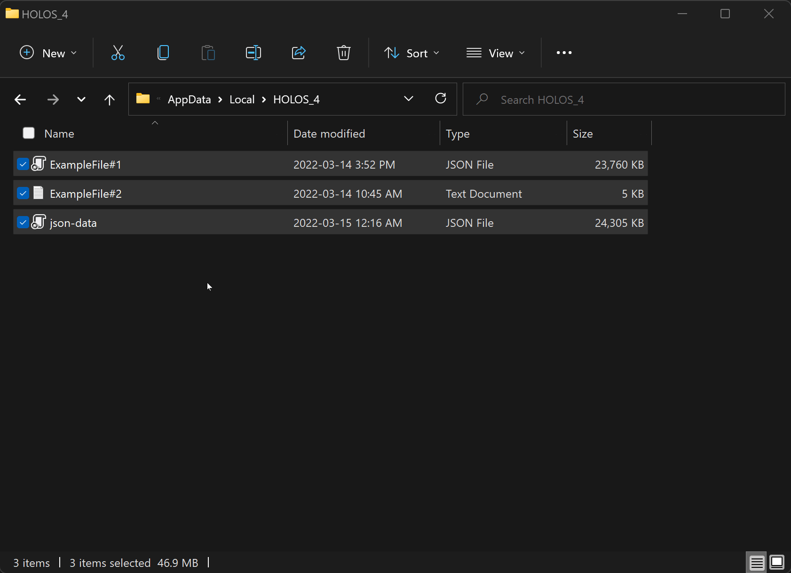
     
    <em>
		Figure 11-10 - Adding files to a .zip archive.
	</em>

 

3.	After the process is finished, a new file will be created in the same folder (HOLOS_4). Windows will then allow you to rename this zipped file. Change the name of this file to **holos-data-files**. You can then send this compressed/zipped file to [aafc.holos.acc@canada.ca](mailto:aafc.holos.acc@canada.ca) as an attachment for troubleshooting purposes. This zipped archive file will contain all the files that you selected in step 1.

 

 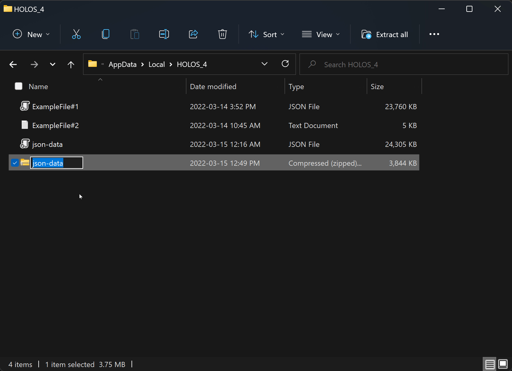
     
    <em>
		Figure 11-11 - Renaming the new folder to holos-data-files.
	</em>

 

#### Instructions for Windows 10 based systems

Please follow these steps for Windows 10 based systems. In this example we will work with the HOLOS_4 folder mentioned in the [how to find the holos data files section](#how-to-find-the-holos-program-data-files)

1.	Using your mouse, while holding down the left mouse button, select all the files you want to add to your achieve(.zip) file.  In this example, this will be all the files inside HOLOS_4 folder.

 

 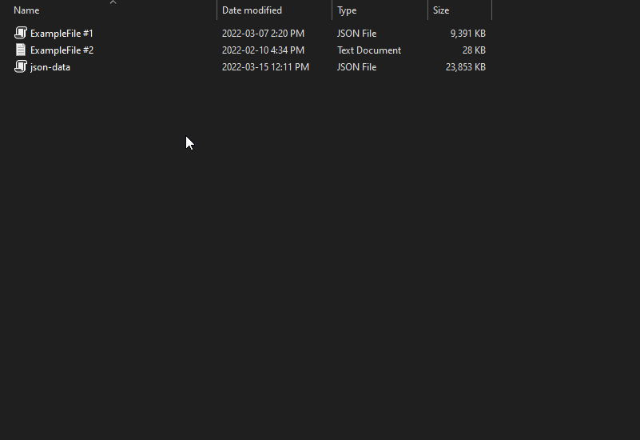
     
    <em>
		Figure 11-12 - Highlight all the files you want to add to the archive.
	</em>

 

2.	After selecting all the files. Right click using your mouse’s right button on any of the highlighted files to open a new menu. In this new menu, go to **Send to** and select “**Compressed (zipped) folder**”. Selecting this will create a single new .zip file containing all the files you selected/highlighted in **Step 1.**

 

 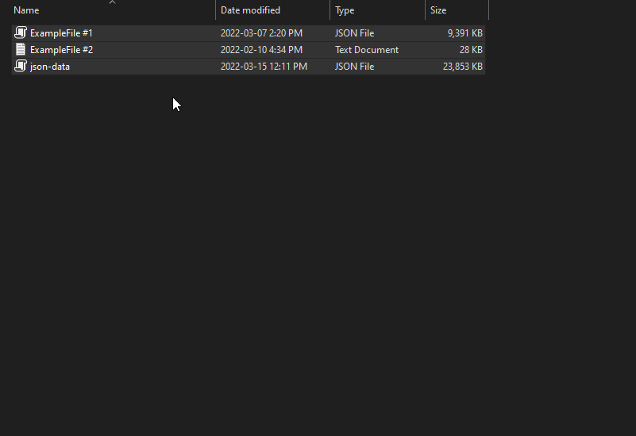
     
    <em>
		Figure 11-13 - Adding files to a .zip archive.
	</em>

 

3.	After the compression is finished, a new file will be created in the same folder (HOLOS_4). Windows will then allow you to rename this file. Change the name of this file to **holos-data-files**. You can then send this compressed (zipped) file to [aafc.holos.acc@canada.ca](mailto:aafc.holos.acc@canada.ca) as an attachment for troubleshooting purposes. This zip file will contain all the files that you selected in step 1.

 

 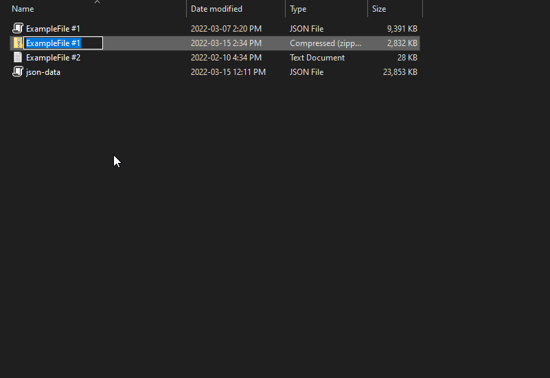
     
    <em>
		Figure 11-14 - Renaming the new folder to holos-data-files.
	</em>

 

 

### Holos Error Messages

Error messages can appear when Holos encounters an internal error and is unable to resolve the issue. When Holos encounters an internal error, it displays a message in the program informing the user that an error has occurred. Below is an example of a similar error.

 

 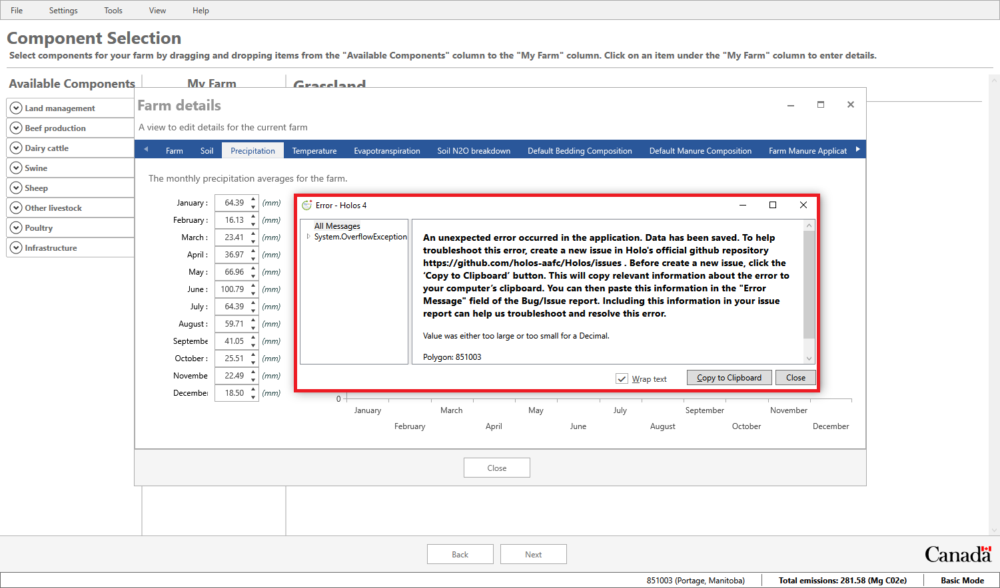
     
    <em>
		Figure 11-15 - Error message screen.
	</em>

 

The message that Holos displays includes information about what the error was and how to report this error to the Holos developers. The next section describes the process of reporting this error to the Holos team.

### How to report an Error Message.

Reporting an error message to the Holos developers can allow them to troubleshoot the issue and help resolve any possible conflicts. When an internal error occurs, the software displays an error message (see Figure 11-16). To report this error to the developers, follow these steps:

-	Click the button that says **Copy to Clipboard**. This will copy the error message and other relevant information to your computer’s clipboard. Clicking this button allows you to paste this information in a different program or to include in your communication with the Holos developers. 

*Please note that clicking the "Copy to Clipboard" button doesn't submit any information to the Holos developers. It simply copies information to your computer's clipboard.*

 

 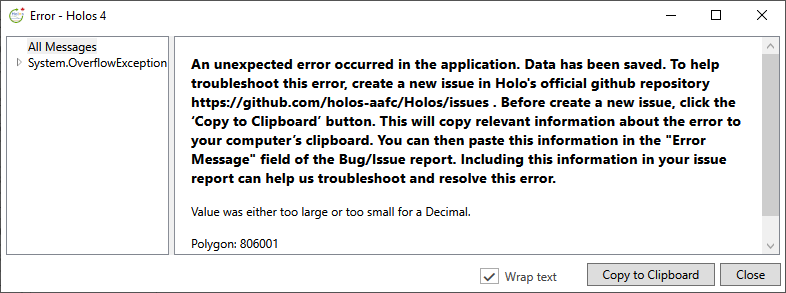
     
    <em>
		Figure 11-16 - Click copy to clipboard to copy information related to the error.
	</em>

 

-	To send this information to the Holos developers, you will have to create a new issue in the official Github repository for Holos. You can click [here](https://github.com/holos-aafc/Holos/issues) to go to the issue reporting page. 

-	After going to the issue reporting page, click on "**New Issue**".

 

 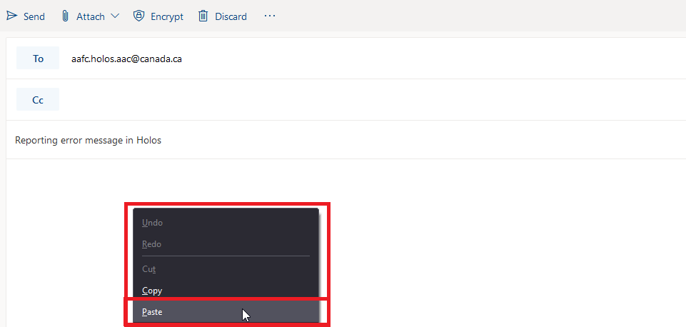
     
    <em>
		Figure 11-17 - The new issue button on the Holos Github repository.
	</em>

 

- On this page, you will click on "**Get Started**" opposite the "**Bug / Issue Report**" category.

 

 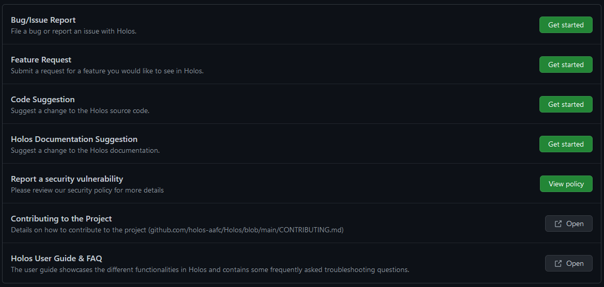
     
    <em>
		Figure 11-18 - The new issue button on the Holos Github repository.
	</em>

 

- You will be presented with a new page where you can post details about the issue and provide additional information. This information includes:
  - **Title of issue**
  - **Contact details** (in case we need to contact you outside of Github)
  - **Expected Behaviour** when using Holos.
  - **Actual Behaviour** displayed by Holos resulting in the bug/issue.
  - **Details of issue including steps to reproduce the issue**.
  - **Error message.**
  - **Holos version number.**

 

 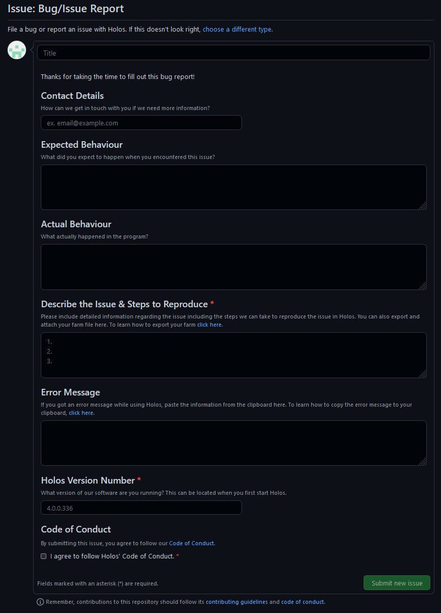
     
    <em>
		Figure 11-19 - The Bug/Issue reporting category.
	</em>

 

- Paste the information you [copied earlier to your clipboard](#how-to-report-an-error-message), in the section titled "**Error Message**" and fill the other information as directed.

- Click on "**Submit new issue**" button at the bottom of the Bug/Issue report screen.

- A new issue will now be created with the included information.

 

### Finding the Holos Software version number

The version number of your current Holos installation is displayed when you first launch the program. After starting the program, look for the version number in the small window that pops up where you're able to select your language.

 

 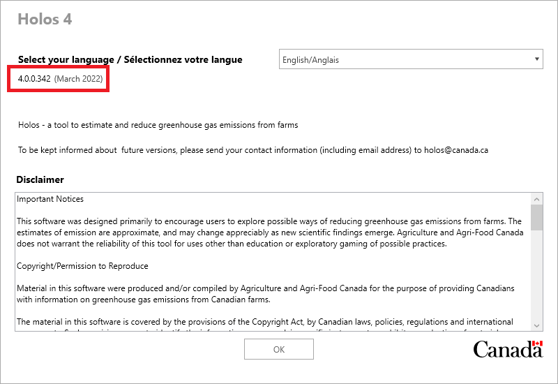
     
    <em>
		Figure 11-20 - Version number of the Holos installation.
	</em>

 