

 
     

# Chapitre 1 Introduction

Pour installer Holos, rendez-vous ici sur le Web. Cliquez sur le fichier zip indiqué pour le télécharger. Une fois le téléchargement effectué, accédez au dossier de téléchargement et double-cliquez sur le programme **Installation**. Si vous souhaitez installer l’application, cliquez sur **Installer**.

 

    
     
    <em>Figure 1.1 Écran d’installation pour Holos 4.</em>

  
L’installation prendra plusieurs minutes; vous pouvez effectuer d’autres tâches sur votre ordinateur en attendant la fin du processus.

 

    
     
    <em>Figure 1.2 Barre de téléchargement pour l’installation de Holos.</em>

 
  
Une fois l’installation terminée, Holos doit se mettre en marche immédiatement et vous accueillir avec l’avis de non-responsabilité ci-dessous.

 

    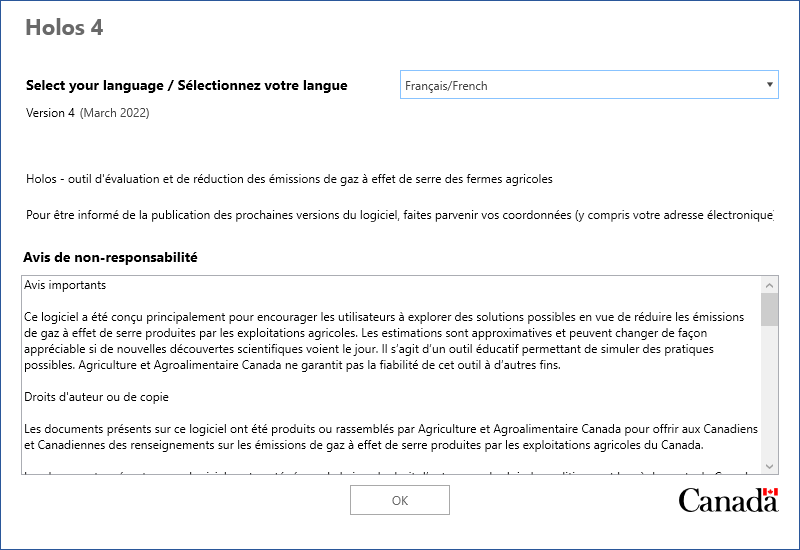
     
    <em>Figure 1.3 Avis de non-responsabilité de Holos au démarrage.</em>

 

Vous pouvez accéder à Holos à partir du menu de démarrage de Windows. Ouvrez le menu de démarrage; Holos devrait se trouver dans un dossier intitulé AAFC-AAC.

 

 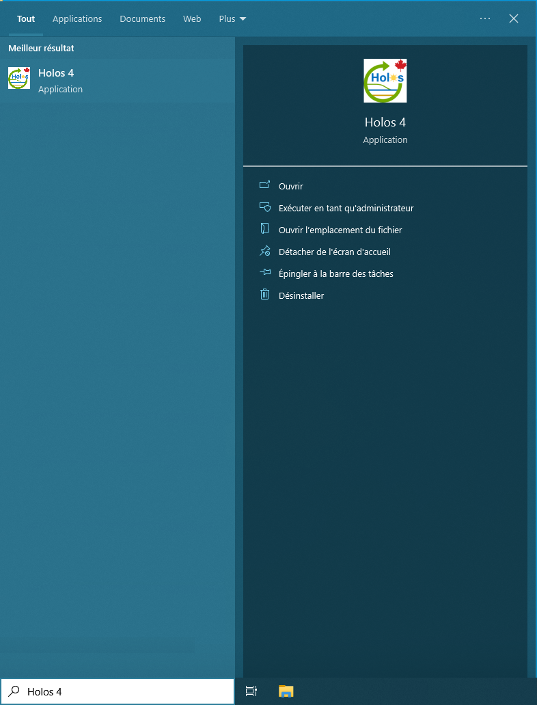
     
    <em>Figure 1.4 Holos dans le menu de démarrage.</em>

 
  
  
Si vous avez déjà Holos 3 sur votre ordinateur, il n’interférera pas avec Holos 4. Il est toutefois important de garder à l’esprit que Holos 4 n’est pas rétrocompatible avec la version 3. Le travail enregistré dans Holos 3 ne sera pas reporté dans Holos 4.

Pour une démonstration rapide de la façon d’installer Holos du début à la fin, vous pouvez également regarder notre vidéo sur YouTube. Vous n’avez qu’à suivre ce lien : [Holos Install](https://www.youtube.com/watch?v=V5jXTIq8558)

 
 

# Chapitre 2  Démarrage de Holos

Holos fonctionne selon l’un des deux modes appelés « De base » et « Avancé ». Comme leur nom l’indique, ils permettent d’adapter l’expérience Holos à des besoins différents. Si vous n’avez pas besoin de toutes les fonctions offertes par Holos et préférez obtenir un résumé des émissions provenant de votre ferme, il est recommandé d’utiliser le mode de base. Si vous voulez tirer le maximum de Holos et obtenir des résultats détaillés, le mode avancé est conçu pour vous.

Holos peut gérer plusieurs fermes créées par l’utilisateur, chacune représentant différents scénarios agricoles. L’utilisateur peut expérimenter ce que les pratiques de gestion font bien ensemble ou déterminer la combinaison de cultures à utiliser en fonction de leur rendement potentiel et de leurs émissions de gaz à effet de serre.

 

## Créer une nouvelle ferme

1. Pour chaque entreprise en démarrage de Holos, vous pouvez créer une nouvelle ferme, ouvrir une ferme existante ou importer une ferme à partir du dossier. La figure 2.1 présente l’interface qui vous accueille lors de chaque démarrage. Votre démarrage initial de Holos après l’installation sautera cet écran et vous enverra à l’étape deux, en sélectionnant automatiquement « **Nouveau** » pour vous permettre de commencer le processus de création.

 

    
     
	<em>
		Figure 2-1: Créez une nouvelle ferme ou ouvrez un écran de sélection d’une ferme existante ou importez une ferme à partir d’un dossier
		 
		 A: Cliquez sur le bouton Nouveau pour créer une nouvelle ferme. 
	</em>

 

2.	Veuillez entrer un nom pour la ferme que vous souhaitez créer dans la section « Nom » et ajouter tout commentaire supplémentaire dans la section « **Commentaires** ». Une fois que vous avez nommé votre ferme, vous devez préciser le mode avec lequel vous souhaitez exploiter Holos, soit le mode de base ou le mode avancé. Lorsque vous avez terminé, cliquez sur le bouton OK pour continuer.

 

    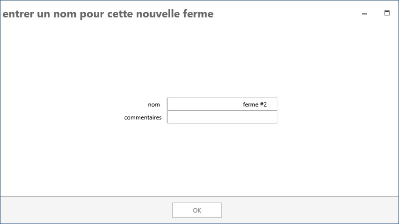
     
	<em>
		Figure 2-2: Saisie du nom et des commentaires, et sélection du mode de fonctionnement. 
	</em>

 

3.	Si vous choisissez le mode avancé, vous pouvez sélectionner « **Métrique** » ou « **Impérial** » dans la liste déroulante (le mode de base sautera cette étape et mettra automatiquement vos unités à Métrique). Après avoir choisi votre unité de mesure, cliquez sur le bouton Suivant au bas de l’écran pour continuer (figure 2.3).

 

    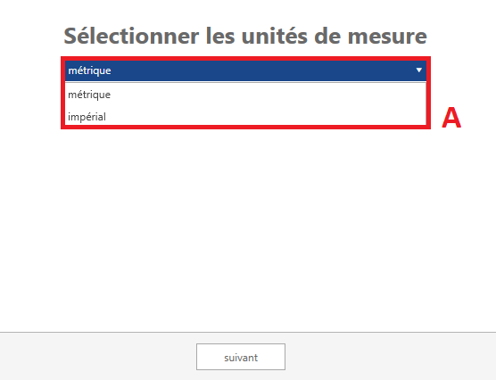
     
	<em>
		Figure 2.3: Écran de sélection de l’unité de mesure. A : Sélectionnez une unité de mesure dans le menu déroulant. 
	</em>

 

4.	Sélectionnez votre province dans la liste déroulante et cliquez sur Suivant au bas de l’écran.

 

    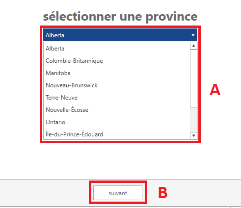
     
	<em>
		Figure 2.4: Écran de sélection de la province. 
		 
		A : Veuillez sélectionner votre province dans le menu déroulant ici. 
		 
		B : Lorsque vous avez sélectionné votre province, cliquez ici. 
	</em>

 

## Sélection de l’emplacement de la ferme

1.	Sur votre écran apparaissent maintenant plusieurs régions de la province que vous avez sélectionnée. Chacune des régions concernées est représentée en rouge. Vous pouvez régler l’agrandissement (c.-à-d. le zoom avant/arrière) de la carte à l’aide de la molette de la souris ou en sélectionnant la loupe au bas de l’écran. Veuillez sélectionner l’emplacement de votre ferme en cliquant sur l’une des régions avec le bouton droit de la souris (voir la figure 2.5).

    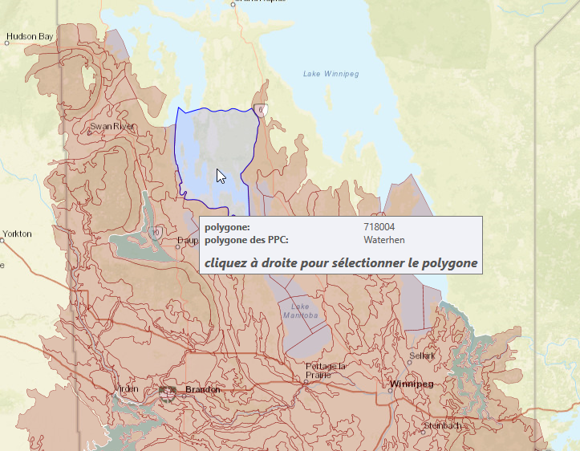
     
	<em>
	    Figure 2.5: Le passage de la souris sur les régions de la carte fait apparaître une infobulle près du pointeur de la souris.
	</em>

 

2.	Lorsque vous aurez cliqué sur l’une des régions, Holos téléchargera les données climatiques directement de la NASA. Une barre de progression affiche l’avancement du téléchargement des données. Cela ne devrait prendre que quelques secondes. Les détails sur cette région s’affichent à droite de l’écran (pour afficher uniquement le mode avancé, voir la figure 2.6). Vous verrez les détails de l’emplacement, le sol et les zones de rusticité, ainsi que les détails sur les conditions climatiques à l’emplacement que vous avez choisi.

     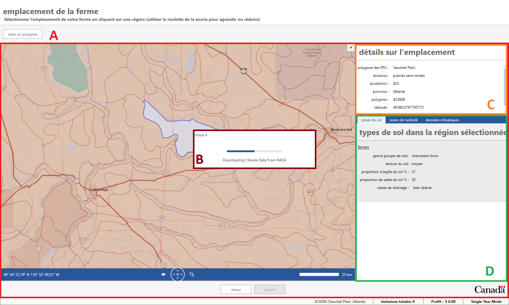
         
    	<em>
    		Figure 2.6: Écran de sélection de l’emplacement de la ferme. 
    		 
    		A : Sélectionnez l’emplacement de votre ferme dans cette section. 
    		 
    		B : Barre de progression pour télécharger des données climatiques de la NASA.  
    		 
    		C : Les données concernant l’emplacement que vous avez sélectionné s’affichent ici, à savoir l’écodistrict, la province et le numéro de polygone.   
    		 
    		D : Les données concernant les zones de sol, les zones de rusticité et les détails des conditions climatiques pour l’emplacement sélectionné s’affichent ici. 
    	</em>

3.	Si la région que vous avez sélectionnée compte plusieurs types de sols, veuillez choisir l’option appropriée pour votre ferme en fonction du type de sol prédominant dans votre région ou de l’emplacement des activités agricoles ou des pratiques de gestion. L’option sélectionnée apparaît plus foncée pour indiquer qu’elle a été sélectionnée.

 

 
     
    <em>  Figure 2.7 Sélection de la zone de sol.</em>

 

4.	Si la région que vous avez sélectionnée comporte plusieurs zones de rusticité, veuillez sélectionner l’option appropriée pour votre ferme. L’option sélectionnée apparaîtra ombragée pour indiquer qu’elle a été sélectionnée. Pour voir la liste des zones de rusticité, veuillez cliquer sur l’onglet en haut de l’écran qui indique « **Zones de rusticité** ».

 

    
     
	<em>
        Figure 2.8: Sélection de la zone de rusticité. 
		 
		A : pour voir les options disponibles, sélectionnez l’onglet Zone de rusticité, l’onglet Zone de sol ou l’onglet Données climatiques. 
		 
		B : Veuillez sélectionner votre zone de rusticité ici. 
	</em>

 

5.	Chaque région que vous sélectionnez donne accès aux données climatiques. Si vous choisissez d’ignorer cet onglet, Holos téléchargera les données climatiques appropriées par défaut. Si vous souhaitez télécharger des données personnalisées, vous pouvez télécharger vos propres données à partir d’un fichier avec l’extension « **.csv** ». Holos confirmera que vos données personnalisées ont été téléchargées.

 

 
     
	<em>
		Figure 2.9: Onglet Données climatiques.  
		 
		Téléchargez votre fichier personnalisé de données climatiques en cliquant sur le bouton
		 
		Une barre de téléchargement s’affiche pendant le téléchargement des données.
		 
		Si le téléchargement s’effectue correctement, un message de confirmation s’affichera. 
	</em>

 

6. Lorsque vous avez fini vos choix du type de sol, de la zone de rusticité et des données climatiques, cliquez sur Suivant.

 

## Formatage du fichier personnalisé de données climatiques

Pour importer vos propres données climatiques dans Holos, le fichier doit être un fichier de valeurs séparées par des virgules (CSV) et avoir l’extension de fichier « .csv ». Il doit également contenir les colonnes suivantes :
* **Année** – L’année à laquelle se rapportent les données climatiques.
* **Jour julien** – La journée selon le calendrier julien.
* **Température moyenne quotidienne de l’air** – La température moyenne de la journée.
* **Précipitations quotidiennes moyennes** – Les précipitations moyennes de la journée.
* **Évapotranspiration potentielle quotidienne moyenne (TEP)** – Évapotranspiration potentielle moyenne de la journée.

  

 
 

# Chapitre 3  Barre d’outils utilisateur  

Lorsque vous sélectionnez vos composantes pour votre ferme, vous trouverez en haut de l’écran des options de gestion des fermes. Il existe actuellement cinq options : **Fichier, Paramètres, Outils, Affichage et Aide.**

## Onglet Fichier

L’onglet **Fichier** offre plusieurs options pour gérer les fichiers de ferme, comme il est indiqué ci-dessous.

 

 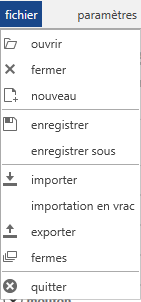
     
    <em>
		   Figure 3.1: Barre d’outils de l’onglet Fichier Holos. 
		    
		   Ces options permettent à l’utilisateur de manier les fichiers associés à Holos. 
	</em>

 

### Nouvelle ferme

#### Création d’une nouvelle ferme

* Pour créer un nouveau fichier de ferme, cliquez sur **Nouveau** sous l’onglet Fichier. Vous pourrez alors créer une nouvelle ferme en suivant les étapes des sections **Créer une nouvelle ferme et Sélectionner un emplacement de ferme.**
* Si vous ne savez pas comment créer une nouvelle ferme, cliquez ici : **Comment créer une nouvelle ferme**
* Si vous ne savez pas comment ouvrir une ferme existante, suivez les instructions sous **Ouvrir/fermer des dossiers**.

 

### Ouvrir/fermer des dossiers

#### Ouvrir

1.	Si vous avez sauvegardé des fichiers de fermes déjà existants, vous pouvez les ouvrir en cliquant sur **Ouvrir** sous l’onglet **Fichier**.
2.	Après avoir cliqué sur **Ouvrir**, une liste des fermes que vous avez déjà créées s’affichera avec des indications comme le **Nom de la ferme**, les **Commentaires**, la **Date de création et la Date de modification**.
3.	Il est possible de trier les données de vos fermes **en cliquant sur chaque en-tête**. Par exemple, en cliquant sur **Nom**, les fichiers de la ferme seront triés par ordre alphabétique et **le type de tri sera indiqué par une flèche vers le haut ou vers le bas** située à côté du nom de l’en-tête. **Par exemple**, si vous voulez trier le nom des fermes de A à Z, cliquez sur l’en-tête **Nom** jusqu’à ce qu’une flèche vers le haut s’affiche et vice versa.

 

 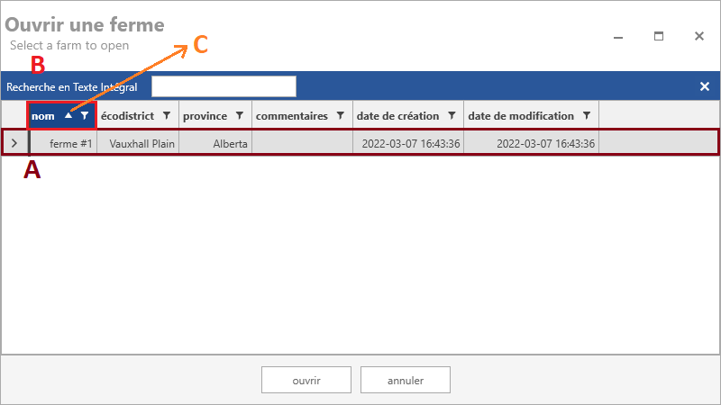
     
    <em>
	    Figure 3.2: Ouverture de la rubrique « Sélection de la ferme » 
		 
		A : Un affichage de toutes les fermes existantes disponibles dans Holos.
		 
		B : Cliquez sur l’un des en-têtes de données pour trier les fermes par ordre alphabétique.
		 
		C : Affiche le type de tri qui a été effectué dans la liste des fermes. Vers le haut = A-Z, vers le bas = Z-A. 
	</em>

 

4.	Si vous souhaitez **filtrer davantage vos fermes** (c.-à-d. effectuer une recherche plus détaillée), vous trouverez à côté de chaque en-tête une **icône en forme d’entonnoir** sur laquelle vous pouvez cliquer. Une fenêtre s’affichera pour vous indiquer les options de filtrage de l’en-tête que vous avez choisi.

 

 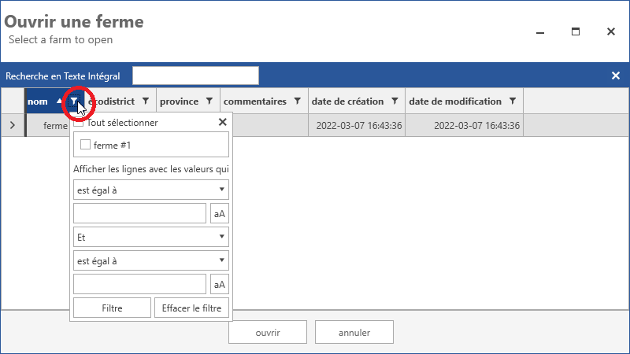
     
    <em>
		Figure 3.3 Filtrage supplémentaire pour les fermes disponibles pour chaque en-tête de données.
		 
		Cliquez sur l’icône en forme d’entonnoir à côté de l’en-tête pour appliquer un filtrage supplémentaire.
	</em>

 

5.	Si vous souhaitez faire une **recherche dans la liste des fermes pour trouver un mot clé**, il y a une section dans le haut de la fenêtre intitulée **Recherche en texte intégral**. Entrez le mot que vous souhaitez rechercher et les résultats associés à ce mot seront mis en surbrillance.

 

 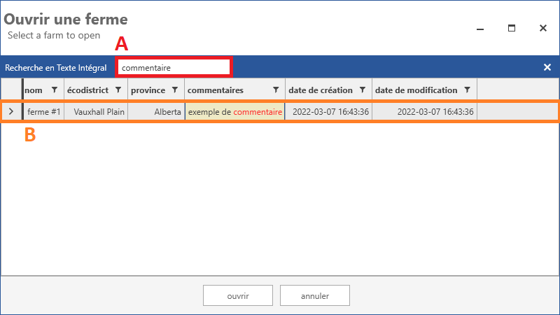
     
    <em>
		Figure 3.4 Option de recherche en texte intégral
		 
		A: Entrez dans la case le texte que vous souhaitez rechercher. 
		 
		B: Les résultats de la recherche seront mis en évidence, comme on le voit ici.
	</em>

 

6.	Sélectionnez la ferme que vous souhaitez ouvrir en cliquant sur l’une des options. La ferme sélectionnée sera plus foncée et sera indiquée par un « > » à gauche. Pour ouvrir le fichier, cliquez sur Ouvrir au bas de l’écran.

 

 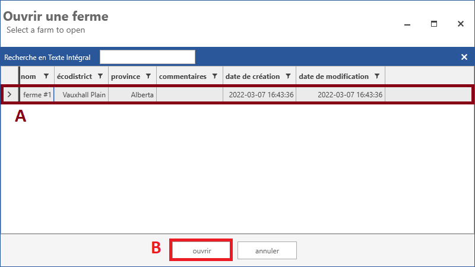
     
    <em>
		Figure 3.5 Ouverture d’une ferme. 
		 
		A: Sélectionnez l’une des fermes de la liste ici. 
		 
		B: Cliquez ici pour ouvrir la ferme que vous avez sélectionnée. 
	</em>

 

#### Fermer

Pour fermer un fichier, cliquez sur **Fermer** sous l’onglet **Fichier**. Cette opération permet de sauvegarder automatiquement votre ferme, de quitter le fichier et de revenir à l’écran principal où vous pourrez **créer une nouvelle ferme ou ouvrir un fichier de ferme existant**.

### Exportation/importation de fichiers de configuration de ferme

Vous pouvez exporter vos fichiers de configuration de ferme dans un fichier JSON (extension de fichier «. **json** »), puis les importer dans Holos sur un autre ordinateur. Cela ne fonctionne que pour Holos 4, vous ne pouvez pas importer d’anciens fichiers de Holos 3 dans Holos 4 et vice versa.

#### Exporter

1.	Pour exporter un fichier, cliquez sur l’icône **Exporter** sous l’onglet **Fichier**. Cette opération ouvre une fenêtre dans laquelle vous verrez la liste des fermes que vous pouvez exporter.
2.	Vous pouvez **ajouter une description** à chaque ferme ou modifier le nom de la ferme en cliquant sur la case appropriée et en modifiant son contenu.
3.	Cliquez sur la ou les **fermes** que vous souhaitez inclure et cliquez sur Exporter au bas pour **choisir un emplacement pour votre fichier exporté. La ou les fermes sélectionnées s’afficheront en gris.

 

 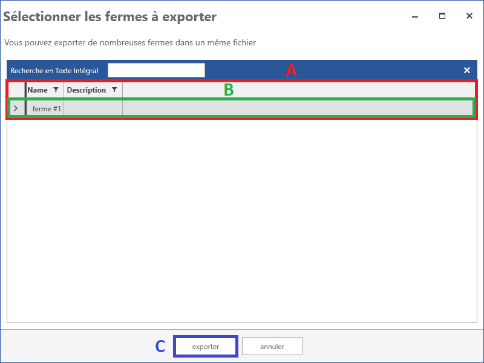
     
    <em>
	    Figure 3.6 Exportation d’une ferme. 
		 
		A : Liste des fermes pouvant être exportées. Sélectionnez la ou les fermes que vous souhaitez exporter en cliquant n’importe où dans la ligne.
		 
		B : Une ligne correspond à une ferme, et vous pouvez modifier n’importe laquelle des valeurs de données qui s’y trouvent, comme le nom et la description. 
		 
		C : Cliquez ici après avoir choisi la ou les fermes que vous souhaitez exporter.
	</em>

 

4.	Après avoir sélectionné votre ferme et cliqué sur le bouton **Exporter**, vous serez invité à **choisir un emplacement où vous souhaitez créer le fichier**.
5.	Vous pouvez **naviguer** dans votre système avec les onglets du côté gauche de l’écran.
6.	Vous pouvez également **ajouter un nouveau dossier** à l’emplacement actuel en **cliquant sur le bouton Nouveau dossier** dans le coin supérieur gauche de votre écran.
7.	Vous pouvez **modifier le nom** de votre fichier en **cliquant dans la section où il est écrit Nom du fichier** au bas de votre écran.
8.	Une fois que vous avez sélectionné un emplacement, cliquez sur **Sauvegarder** pour terminer le processus.

 

 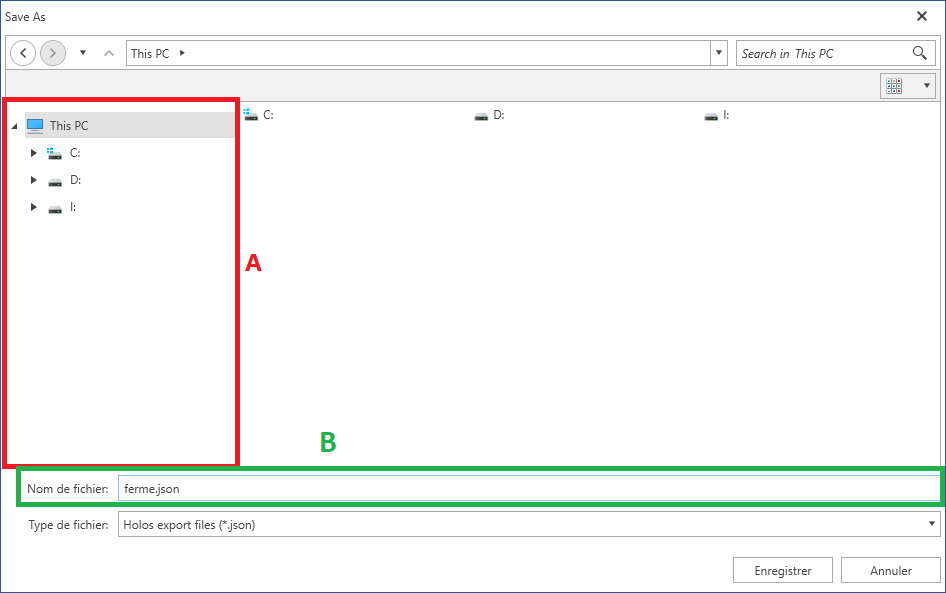
     
    <em>
	    Figure 3.7 Choix d’un emplacement pour exporter les fermes sélectionnées. 
		 
		A : Naviguez dans votre ordinateur à l’aide de cette section.
		 
		B : Personnalisez le nom de vos fermes exportées ici. 
		 
		C : Cliquez sur **Sauvegarder** pour finaliser l’exportation de votre ferme. 
	</em>

 

#### Importer

1.	Pour importer votre ferme, cliquez sur **Importer** sous l’onglet **Fichier**. Une fenêtre (illustrée ci-dessous) s’ouvrira dans laquelle vous pouvez voir l’emplacement des fichiers sur votre ordinateur.
2.	Accédez au fichier que vous souhaitez importer dans Holos et sélectionnez-le en cliquant dessus. Cliquez ensuite sur **Ouvrir**.

 

 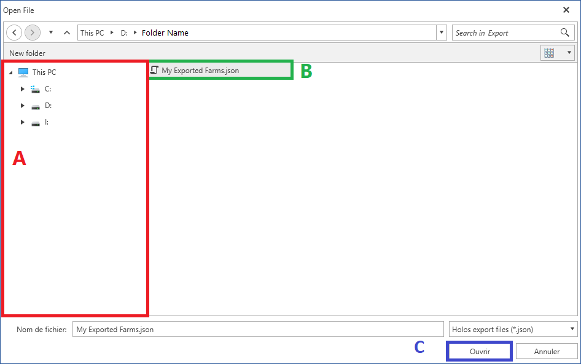
     
    <em>
		Figure 3.8 Choisir les fermes à importer. 
		 
		A: Naviguer dans votre ordinateur ici. 
		 
		B: Sélectionnez le fichier qui contient la ou les fermes que vous souhaitez importer. 
		 
		C: Cliquez sur Ouvrir pour choisir la ou les fermes que vous souhaitez importer. 
	</em>

 

4.	Une fois le fichier ouvert, une fenêtre affichera la liste des fermes dans ce fichier. **Sélectionnez les fermes que vous souhaitez importer en cliquant n’importe où dans leurs sections**. Quand elles sont sélectionnées, la case devient plus foncée.
5.	Cliquez sur **Importer** pour poursuivre.

 

 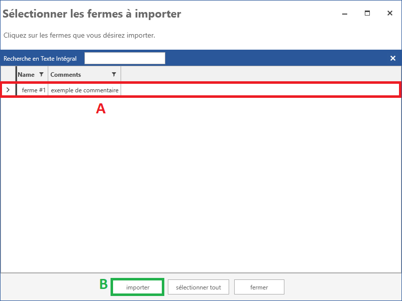
     
    <em>
		Figure 3.9 Sélection des fermes à importer. 
		 
		A : Cliquez n’importe où dans la rangée des fermes que vous souhaitez importer. Vous pouvez en sélectionner plus d’une. 
		 
		B : Cliquez sur Importer pour importer les fermes que vous avez sélectionnées
	</em>

 

#### Importation en vrac

1. Pour importer des fermes à partir de plus d’un fichier, sélectionnez **Importer en vrac**. Une fenêtre s’ouvre et vous permet de sélectionner le dossier contenant vos fichiers.
2. Accédez aux dossiers où vous stockez vos fermes exportées. Vous pouvez sélectionner plusieurs dossiers si vos fichiers sont répartis dans différents dossiers. Pour sélectionner plusieurs dossiers, appuyez sur la touche **CTRL** et maintenez-la enfoncée pendant que vous sélectionnez les dossiers. Lorsque vous avez sélectionné le ou les dossiers, cliquez sur **Ouvrir**. Si vous ne sélectionnez aucun dossier, Holos utilise le dossier de travail actuel comme dossier à ouvrir.
3. Passez aux étapes 3 et 4 de la section [Importation](#importer).

 

 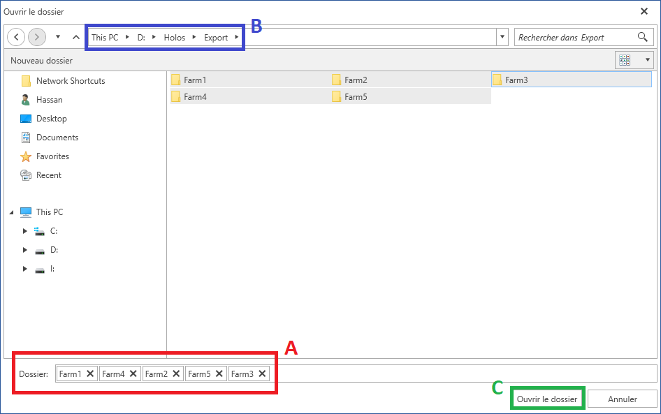
     
    <em>
		Figure 3.10 Sélection des fermes à importer à partir de plusieurs dossiers. 
		 
		A : Les dossiers sélectionnés contenant les fichiers de ferme exportés. 
		 
		B : Le dossier de travail actuel où se trouvent les données et les dossiers d’exportation.
		 
		C. Cliquez sur Ouvrir le dossier pour ouvrir les dossiers sélectionnés. 
	</em>

 

#### Sauvegarder

1.	Si vous avez déjà créé une ferme, mais souhaitez l’enregistrer sous un autre nom et la modifier, vous pouvez sélectionner **Enregistrer sous**. Comme pour d’autres produits, vous pouvez créer une copie au moyen de **Enregistrer sous**. Il vous suffit de sélectionner E**nregistrer sous** à l’onglet Fichier et d’entrer un nom pour enregistrer votre nouvelle ferme.

2.	Si le nom existe déjà, Holos vous en avertira et vous demandera de le changer.
3.	Vous pouvez maintenant accéder à cette nouvelle ferme copiée de la même façon que vous ouvririez une ferme à partir de l’onglet Fichier.

 

### Gestion des fermes

Dans cette section, vous pouvez voir toutes les fermes qui figurent dans le fichier sur lequel vous travaillez actuellement. Vous verrez une liste de toutes les fermes avec leurs données. **Vous pouvez supprimer vos fermes dans cet onglet et modifier certaines de leurs données.**
1.	Cliquez sur l’icône **Fermes** sous l’en-tête Fichier en haut de l’écran.
2.	Une fenêtre s’ouvrira pour afficher chaque ferme dans le fichier. Il est possible de modifier chaque section de la ferme, **Nom, Commentaires, Date de création et Date de modification**, en cliquant sur la case appropriée et en modifiant son contenu.
3.	Pour **supprimer une ferme**, sélectionnez-la en cliquant dessus, puis cliquez sur le bouton **Supprimer** au bas de l’écran.

 

 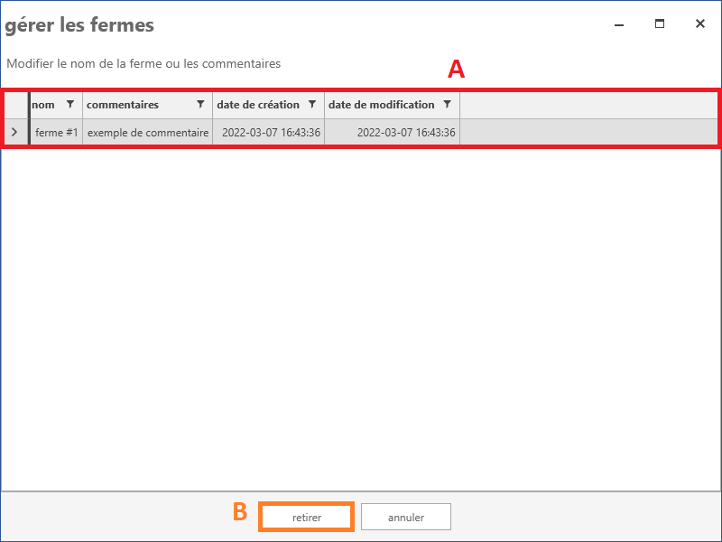
     
    <em>
		Figure 3.11 Écran Gestion des fermes.
		 
		A : Une liste de fermes.
		 
		B : Après avoir sélectionné une ferme, si vous souhaitez la supprimer, cliquez sur Supprimer. 
	</em>

 

## Onglet Aide

Sous l’onglet **Aide** se trouvent les options **Envoi de commentaires, À propos de Holos et Avertissement.**

 

 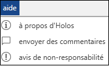
     
    <em>
	   Figure 3.12 Affichage du menu d’aide 
	</em>

 

### Envoi de commentaires

1.	Cliquez sur **Envoi de commentaires**.
2.	Vous recevrez un formulaire vous demandant certains renseignements, comme le prénom, le nom de famille, la raison des commentaires et les commentaires des utilisateurs.

 

 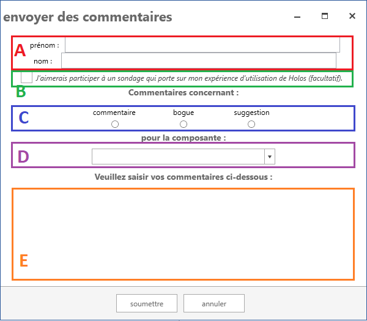
     
    <em>
		Figure 3.13 Envoyer le formulaire de commentaires. 
		 
		A : Si l’équipe Holos doit communiquer avec l’utilisateur, elle aura le nom complet de la personne. 
		 
		B : Case à cocher pour répondre à un très court sondage sur l’expérience utilisateur. 
		 
		C : Type de commentaires fournis par l’utilisateur. 
		 
		D : Pour quelle composante de l’application l’utilisateur souhaite-t-il fournir des commentaires? 
		 
		E : Entrez les commentaires de l’utilisateur dans cette zone. 
	</em>

 

3.	Il est possible de fournir des commentaires sur l’expérience de l’utilisateur (à quel point était-il facile d’utiliser l’application?). Cette option est entièrement facultative et peut être laissée non cochée. 

    * Si vous souhaitez cocher cette case, vous devrez préciser quelle a été votre expérience du programme en utilisant une série de boutons allant de très **facile à très difficile**. 
    
    * Une fois votre choix sélectionné, vous pouvez décrire votre expérience.
    

 

 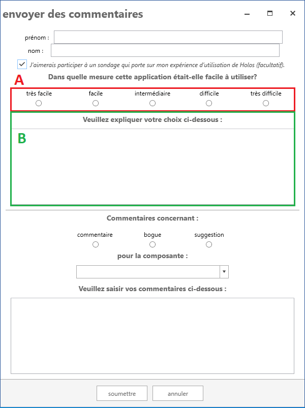
     
    <em>
		Figure 3.14 Envoyer le formulaire de commentaires avec le sondage facultatif affiché. 
		 
		A : Les choix offerts à l’utilisateur pour enregistrer son expérience.
		 
		B : L’utilisateur peut donner des précisions sur sa sélection à partir de la partie A de cette section.
		 
		REMARQUE : Si l’utilisateur sélectionne cette option, il DOIT remplir le sondage au complet pour que la soumission soit valide.
	</em>

 

4.	Lorsque vous avez rempli le formulaire en entier, cliquez sur **Soumettre**. Si vous souhaitez quitter le formulaire sans soumettre vos commentaires, cliquez sur **Annuler**.
5.	Votre application de courriel par défaut s’ouvrira avec un message contenant l’adresse de destination, le sujet et le corps du message.
6.	Appuyez sur **Envoyer**.

 
 

# Chapitre 4 - Paramètres

Sous l’en-tête Valeurs par défaut, trois options sont offertes : Renseignements sur la ferme, Paramètres d’utilisateur et Valeurs par défaut des cultures.

 

 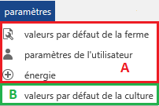
     
    <em>
		Figure 4.1: Options par défaut
		 
		A: Une liste des options disponibles pour définir les valeurs par défaut pour vos opérations.
		 
		B: Permet à l’utilisateur de définir des valeurs par défaut personnalisées pour des cultures individuelles. 
		 
		C: Option d’affichage des résultats en format annuel ou pluriannuel.
	</em>

 

## Renseignements sur la ferme

1.	Cliquez sur l’icône Renseignements sur la ferme.
2.	Ici, vous pourrez définir certains paramètres par défaut pour votre ferme, par exemple : Ferme, Sol, Précipitations, Température, Évaporation, Décomposition du N2O dans le sol, Valeurs par défaut pour la composition de la litière, Valeurs par défaut pour la composition du fumier. Sélectionnez la catégorie pour laquelle vous souhaitez modifier les paramètres par défaut.
3.	Chaque catégorie comporte son propre ensemble de champs à remplir. Chaque fois que vous créez une nouvelle ferme dans ce fichier, elle intégrera ces paramètres par défaut.

 

 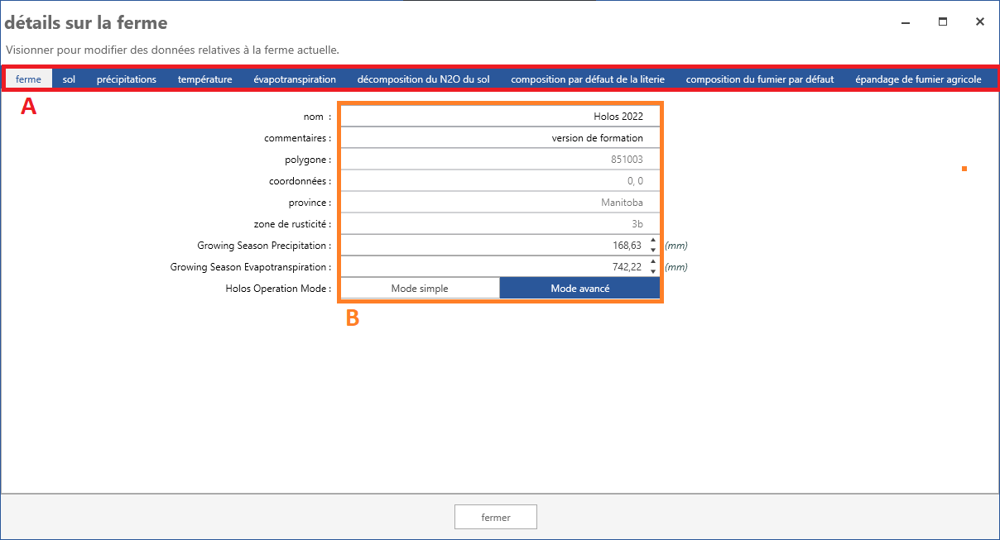
     
    <em>
		Figure 4.2 Sélection des Renseignements sur la ferme. 
		 
		A : Les différentes valeurs par défaut disponibles.
		 
		B : Les paramètres par défaut spécifiques correspondant à la catégorie que vous avez sélectionnée et qui peuvent être ajustés. 
	</em>

 

Dans la section Renseignements sur la ferme, les catégories de renseignements sur la ferme sont les suivantes :

* **Ferme** : Valeurs par défaut des renseignements généraux sur la ferme

*	**Sol** : Valeurs par défaut du sol, dont la texture, l’épaisseur, etc.
*	**Précipitations** : Moyenne mensuelle des précipitations pour la ferme
*	**Température** : Moyennes mensuelles des températures
*	**Évapotranspiration**: Valeurs mensuelles de l’évapotranspiration de la ferme
*	**Décomposition du N2O dans le sol** : Répartition mensuelle des émissions pour l’année
*	**Valeurs par défaut pour la composition de la literie** : Matériel de litière par défaut pour le bœuf, les bovins laitiers, le porc et la volaille
*	**Valeurs par défaut pour la composition du fumier** : Types de fumier et valeurs par défaut pour sa composition
*	**Épandage de fumier agricole** : Bilan de toutes les applications de fumier dans différents champs de la ferme

 

## Paramètres d’utilisateur

Les données par défaut pour cet écran sont basées sur les informations contenues dans le document de l’algorithme à consulter ici. 1. Cliquez sur l’icône Paramètres d’utilisateur. 2. Ici, vous pourrez définir certains paramètres d’utilisateur par défaut, tels que : concentration de carbone (kg kg^-1), jour d’émergence ou épaisseur de la surface du sol (mm). 3. Cliquez sur OK pour sauvegarder les changements à vos paramètres d’utilisateur.

 

 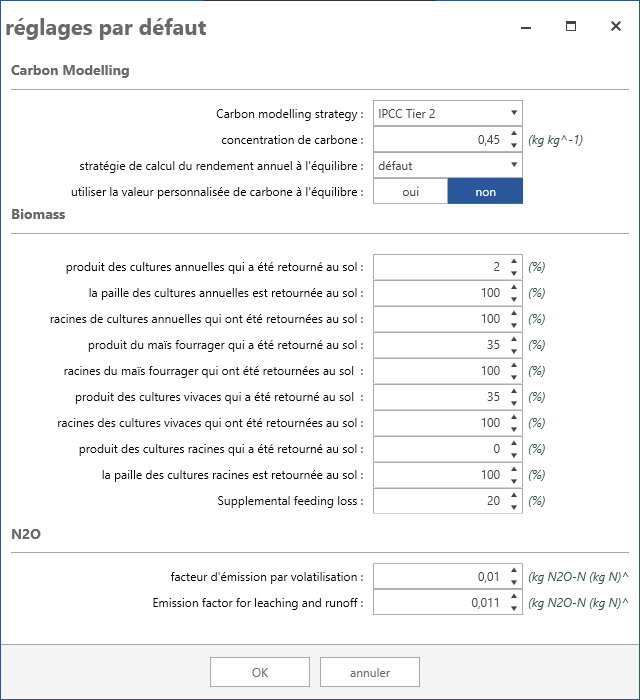
     
    <em>
		Figure 4.3 Paramètres d’utilisateur par défaut. 
		 
		Les paramètres d’utilisateur par défaut spécifiques qu’il est possible d’ajuster pour toutes les fermes.
	</em>

    

## Énergie

*	L’onglet Énergie affiche la conversion de l’énergie de la ferme (électricité, diesel, production) en émissions de gaz à effet de serre.
*	L’onglet Énergie indique la quantité d’énergie utilisée pour chaque composante agricole disponible.

 

 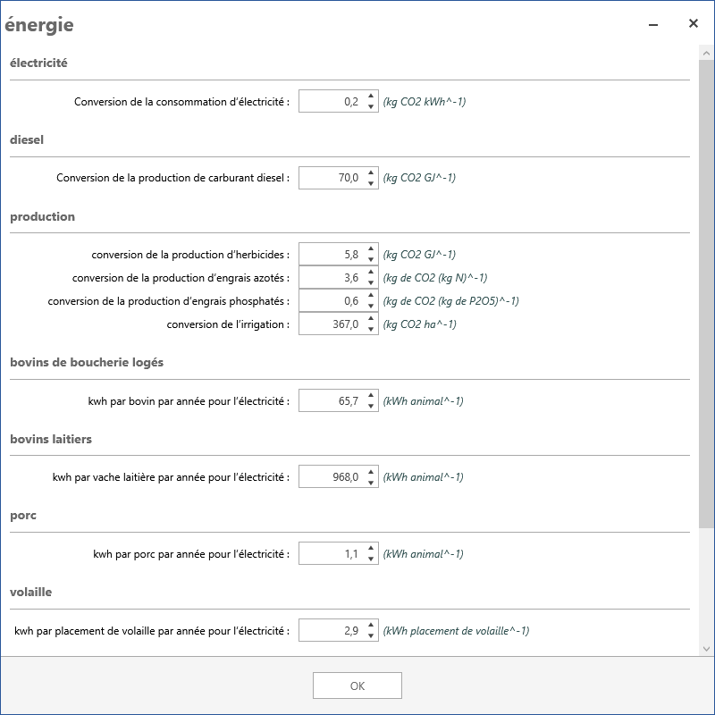
     
    <em>
		Figure 4.4 – Paramètres de l’énergie 
	</em>

 
   

## Valeurs par défaut des cultures

1.	Sélectionnez Valeurs par défaut des cultures.
2.	Cette vue vous permet de spécifier les valeurs par défaut pour chaque culture que vous pourriez rencontrer dans Holos. Par exemple, chaque fois que vous entrez l’orge comme culture dans une composante sur le terrain, Holos utilisera les valeurs enregistrées ici pour effectuer ses calculs.
3.	Pour modifier une culture, sélectionnez-la dans la zone de défilement de gauche. Si vous souhaitez personnaliser les valeurs par défaut, cliquez sur Oui sous Étape 2.

 

 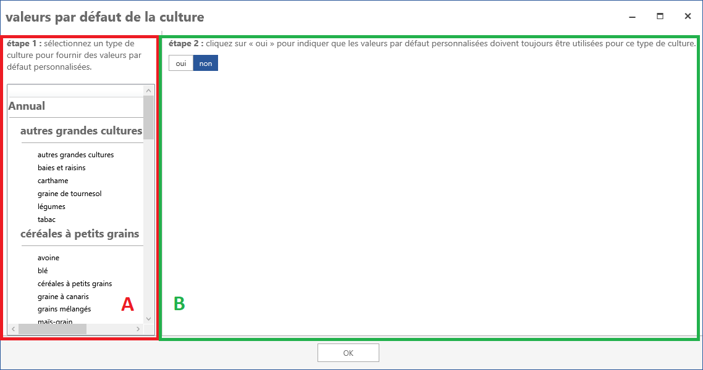
     
    <em>
		Figure 4.5 – Valeurs par défaut des cultures. 
		 
		A : Étape 1. Sélectionnez un type de culture pour lequel vous souhaitez fournir des valeurs personnalisées par défaut.
		 
		B : Étape 2 Sélectionnez Oui si vous voulez toujours utiliser les valeurs personnalisées pour cette culture. 
	</em>

 

 

4.	Si vous sélectionnez Oui à l’Étape 2, une nouvelle section s’affichera pour indiquer les valeurs par défaut personnalisées que vous pouvez définir.

 

 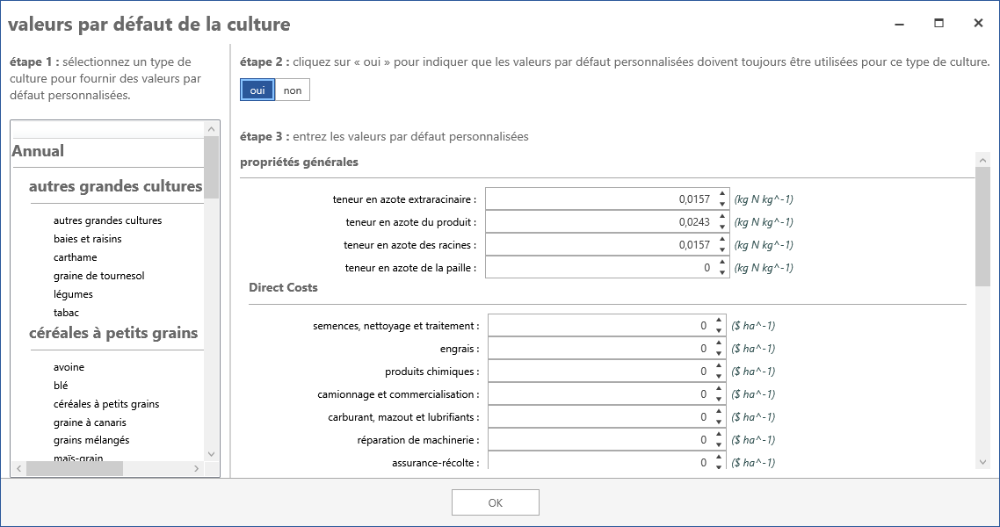
     
    <em>
		Figure 4.6 – Étape 3, section. 
		 
		Cette section s’affiche lorsque l’utilisateur sélectionne Oui à l’étape 2. 
 	</em>

 
   
   
   

## Modèle annuel et pluriannuel

*	Holos travaille avec une ferme selon deux modes, **Annuel** et **Pluriannuel**. Le mode de base est le mode **annuel**, certains boutons et menus étant masqués pour plus de simplicité. Holos démarre par défaut toute ferme en mode **Annuel**. Comme son nom l’indique, le mode **Annuel** ne fournit des données que pour une seule année. Le mode Pluriannuel permet de mettre en place un **système avancé de modélisation du carbone** sur une période allant de 1985 à nos jours.

*	Le mode **Annuel** est le plus simple pour utiliser Holos; il suffit d’ajouter des composantes à votre ferme et d’appuyer sur **Suivant** pour charger les résultats. Il s’agit du mode par défaut pour créer une nouvelle ferme dans Holos.
*	Le mode Pluriannuel modifie l’interface de certaines composantes (voir la figure 4.6).

 

 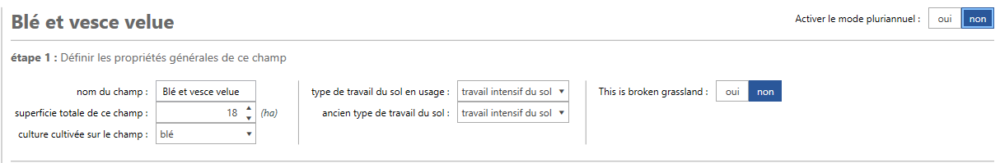
     
    <em>
		Figure 4.7 – Propriétés d’une composante sur le terrain en mode Annuel 
 	</em>

 

 

 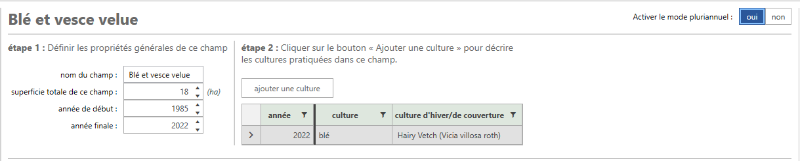
     
    <em>
		Figure 4.8 – Propriétés d’une composante sur le terrain en mode Pluriannuel.
 	</em>

 

 

*	Le mode **Pluriannuel** modifiera le flux de Holos, au lieu des étapes normales suivies par le mode **Annuel**, dans le mode **Pluriannuel**, vous devez ajouter des composantes à votre ferme, puis naviguer jusqu’à l’écran Calendrier. À partir de cet écran, selon les paramètres, passez à l’écran Détails et arrivez finalement à la section des résultats.

*	Vous pouvez basculer entre les modes Annuel ou Pluriannuel dans **Paramètres** ou cliquer sur **Oui** à côté de **Activer le mode Pluriannuel** dans l’écran de sélection des composantes. Dans le bas du Holos apparaît le mode de travail sélectionné, soit Annuel ou Pluriannuel.

 

 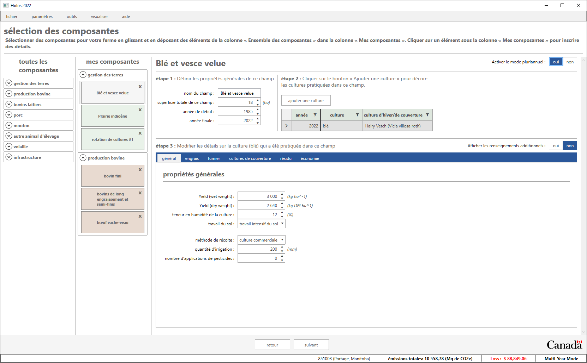
     
    <em>
		Figure 4.9 – Le mode de l’année en cours est affiché dans le coin inférieur droit
		 
		A : Le bouton à bascule de changement de mode d’année.
		 
		B : Le mode de l’année en cours. 
 	</em>

 
 

# Chapitre 5 – Outils

Sous l’en-tête Outils, vous pouvez créer une ration personnalisée pour le bétail de votre choix.

 

 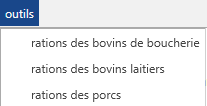
     
    <em>
		Figure 5.1 – Outil Créateur de ration personnalisée 
	</em>

 
   

## Créateur de ration personnalisée
*	Avec le Créateur de ration personnalisée, vous pouvez **créer une ration personnalisée pour chaque type d’animal de votre ferme**. Il vous permet de préciser les éléments de la ration, notamment : le fourrage (%), l’amidon (% MS) et le gras (% MS).
*	Après avoir sélectionné un créateur de ration en particulier, l’utilisateur verra s’afficher une nouvelle fenêtre qui lui permet de créer une ration personnalisée pour le bétail de son choix.
*	Vous pouvez afficher les **rations par défaut** en cliquant sur Oui à côté de la section **Afficher les rations par défaut**.
*	Pour **créer une ration personnalisée**, cliquez sur **Ajouter une ration personnalisée** dans le haut de la fenêtre. 

 

### Créer une ration personnalisée

1.	Cliquez sur **Ajouter une ration personnalisée**.
2.	Chaque ration ajoutée sera affichée sous la section **Mes rations personnalisées**. Vous pouvez changer le nom, le type d’animal et tout autre champ associé à cette ration.
3.	Chaque ration contient une liste des **Ingrédients entrant dans la composition des aliments du bétail** et figure à droite de votre écran. Les ingrédients entrant dans la composition des aliments du bétail serviront à calculer les données de votre ration personnalisée.
4.	Choisissez dans la liste les ingrédients que vous voulez ajouter à votre ration.
5.	Si vous ne savez pas comment ajouter un ingrédient, suivez les instructions de la section suivante intitulée **Comment ajouter un ingrédient à ma ration.**

 

 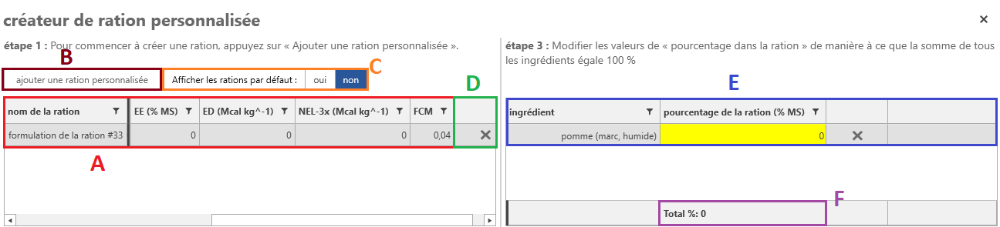
     
    <em>
		Figure 5.2 – Création d’une ration personnalisée. 
	 	 
		 A : Une liste des rations (peut comprendre les rations par défaut) et les données correspondantes.
		 
	     B : Ajoutez une nouvelle ration personnalisée. Elle apparaîtra dans la liste actuelle de rations. 
		 
		 C : Bouton à bascule qui permet d’afficher ou non les rations par défaut. 
		 
		 D : Pour supprimer une ligne de ration personnalisée, cliquez sur le bouton « X ». 
		 
		 E : Une liste des ingrédients entrant dans la composition des aliments du bétail qui sont associés à la ration que vous avez choisie dans la liste de la section A. 
		 
		 F : Pourcentage total actuel de tous les ingrédients entrant dans la composition des aliments du bétail. Ce total doit être égal à 100 (%).
	</em>

  
   

### Ajout d’ingrédients entrant dans la composition des aliments du bétail

*	**Sélectionnez la ration** à laquelle vous souhaitez ajouter un ingrédient ou sélectionnez **Ajouter une ration personnalisée** pour ajouter une nouvelle ration.
*	**Cliquez sur l’ingrédient entrant dans la composition des aliments du bétail** que vous souhaitez ajouter dans la section **Étape 2**. Vous pouvez modifier les données associées à l’ingrédient sélectionné en cliquant sur la case du champ de données que vous souhaitez modifier. L’ingrédient sélectionné sera alors ombragé.
*	Pour ajouter l’ingrédient à votre ration, cliquez sur **Ajouter l’ingrédient sélectionné à la ration**.
*	Dans la case jaune située devant l’ingrédient que vous venez d’ajouter, inscrivez le pourcentage de sa contribution à la ration.

Vous pouvez cliquer sur Oui à côté de Afficher colonnes supplémentaires pour consulter les champs de données supplémentaires associés aux ingrédients.

 

 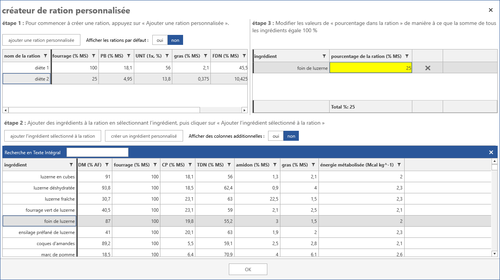
     
    <em>
		Figure 5.3 – Ajout d’un ingrédient alimentaire à une ration. 
	</em>

 

### Création d’un ingrédient personnalisé  

1.	Sous **Ingrédients entrant dans la composition des aliments du bétail disponibles**, cliquez sur **Créer un ingrédient personnalisé**.

2.	Un champ de données vide apparaîtra dans la liste des ingrédients entrant dans la composition des aliments du bétail disponibles. Vous pouvez personnaliser chaque champ de données pour vous conformer à l’ingrédient personnalisé que vous souhaitez ajouter, comme le nom, le **fourrage (%), la matière sèche (% tel que servi) et la protéine brute (% MS)**.

 

 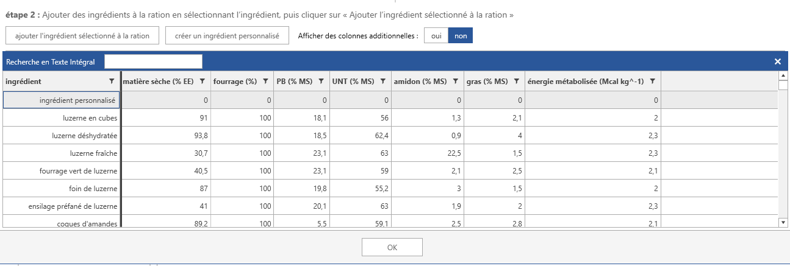
     
    <em>
		Figure 5.4 – Création d’un ingrédient personnalisé entrant dans la composition des aliments du bétail.
	</em>

 

## Infobulles

Les infobulles sont des messages d’information qui servent à décrire certains éléments du programme. Le logiciel Holos intègre des infobulles dans tout le programme pour mieux définir les différents termes et abréviations.

Pour activer une infobulle, il faut placer le curseur de la souris (ou le pointeur) sur un élément spécifique du programme

 

 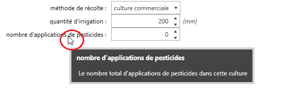
     
    <em>
		Figure 5.5 – Une infobulle pour un champ du programme.
	</em>

 
    

Une infobulle affiche les renseignements suivants au sujet des éléments de programme non abrégés : – Titre – Description – Unités de mesure (s’il y a lieu).

Des infobulles sont également disponibles pour les termes abrégés que l’on trouve dans diverses parties du programme Holos, p. ex., dans le Créateur de ration personnalisée déjà mentionné :

 

 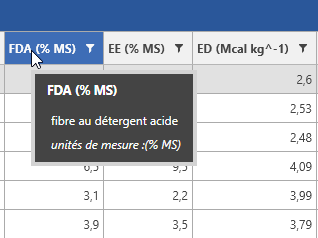
     
    <em>
		Figure 5.6 – Infobulle pour un en-tête de tableau abrégé.
		 
		Le pointeur de la souris sur un terme abrégé indique sa signification et ses unités de mesure (s’il y a lieu).
	</em>

     
 
 

# Chapitre 6 – Création et modification des composantes de la ferme

## Présentation de la sélection des composantes

Avec Holos, vous pouvez créer votre propre ferme au moyen d’une sélection de composantes qui sont disponibles dans la section **Toutes les composantes**.

Chaque composante est classée par type et comprend ce qui suit : **Gestion des terres, Production de bœuf, Produits laitiers, Porcs, Volaille, Moutons et Autres animaux d’élevage**.

 

 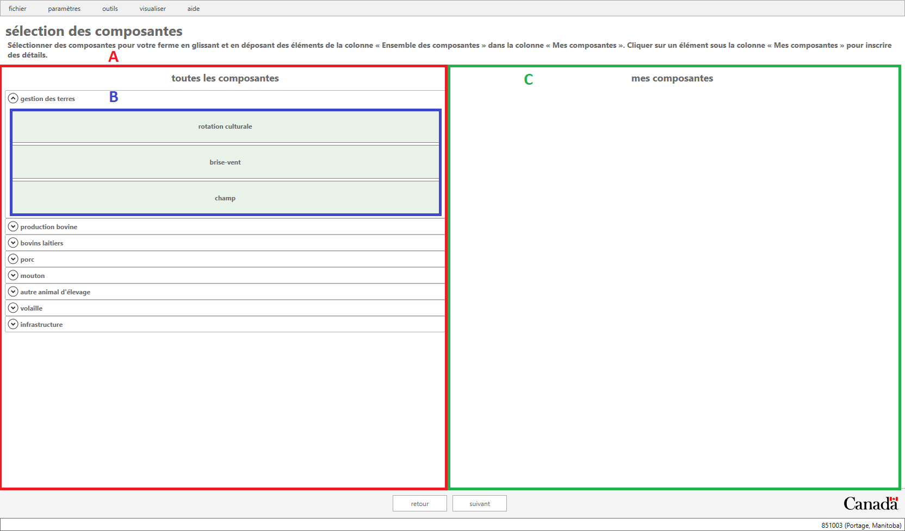
     
    <em>
		Figure 6.1 – Sélection de la composante. 
	 	 
		A : Toutes les composantes possibles, réparties par les catégories de composantes qui peuvent être ajoutées à la ferme. 
		 
		B : Une seule catégorie de composantes.
		 
	    C : Toutes les composantes qui ont été ajoutées à la ferme.
	</em>

 

### Ajouter une composante à votre ferme
  
1.	Pour ajouter une composante à votre ferme, vous devez double-cliquer ou faire glisser une composante de la liste **Composantes disponibles** dans **Ma ferme**.
2.	Ainsi, la composante s’affichera sous l’onglet **Ma ferme** et les données associées à cette composante que vous avez choisie s’afficheront dans la section à droite de **Mes composantes**.
3.	Pour passer d’une composante de ferme à une autre, cliquez sur la composante que vous voulez voir et le programme basculera automatiquement pour afficher les renseignements qui la concernent.
4.	Voir la figure 6.2 ci-dessous pour une représentation visuelle.

 

 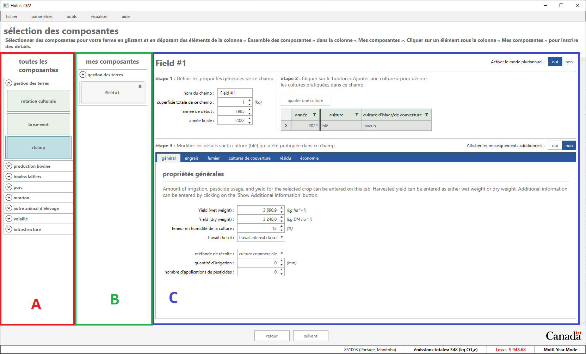
     
    <em>
		Figure 6.2 – Ajouter une composante. 
	 	 
		A : Une liste de toutes les composantes disponibles qui peuvent être ajoutées à la ferme, réparties en catégories de composantes.
		 
		B : Une liste des composantes qui ont été ajoutées à la ferme.
		 
		C : Les données associées à la composante sélectionnée.
	</em>

 

### Copier une composante dans votre ferme

1.	Vous pouvez copier une composante dans votre ferme en cliquant sur la composante avec le bouton droit de la souris et en sélectionnant **Créer une copie**.
2.	Une fenêtre s’affiche. Vous pouvez sélectionner le nombre de copies que vous souhaitez créer. Une fois l’opération terminée, appuyez sur **OK (voir la figure 6.3)**.

 

 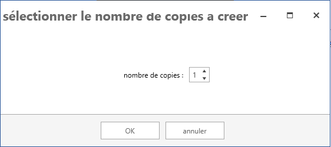
     
    <em>
		Figure 6.3 – Fenêtre permettant d’obtenir le nombre de copies de votre composante.
	</em>

 

## Composantes de la gestion des terres
 
### Composante sur le terrain

* Une composante sur le terrain contient des données comme les semis, la superficie des terres et le travail du sol (voir la figure 6.4). Les cultures sont classées selon leur type de croissance (c.-à-d. annuelle, vivace, etc.)
* Pour entrer des données précises sur le champ, vous devez accéder à l’Affichage de l’onglet contenant les propriétés **Renseignements généraux, Fumier et Résidus** pour le champ.
* Pour afficher les renseignements supplémentaires, cliquez sur **Oui** à côté de **Afficher les renseignements supplémentaires**

 

 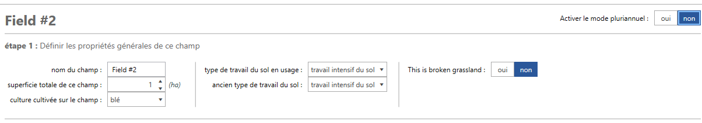
     
    <em>
		Figure 6.4 – Champ Étape 1 Définir le nom, la superficie, la culture et le type de travail du sol pour votre composante sur le terrain. 
	</em>

 

La composante sur le terrain contient différents onglets pour chaque aspect de la composante.

#### Onglet Afficher

##### Propriétés générales

Contient des renseignements comme le rendement, la méthode de récolte, le taux d’épandage des engrais, etc.

 

 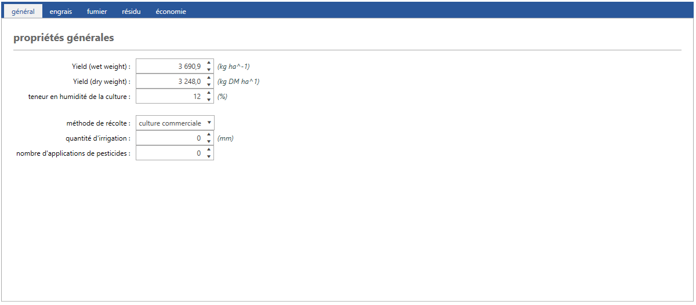
     
    <em>
		Figure 6.5 – Onglet Renseignements généraux pour une composante sur le terrain.
	</em>

 

##### Engrais

Permet à l’utilisateur d’ajouter un épandage d’engrais au champ. Cette application comprend des données comme la saison de l’épandage, le type de mélange et le taux d’épandage.

 

 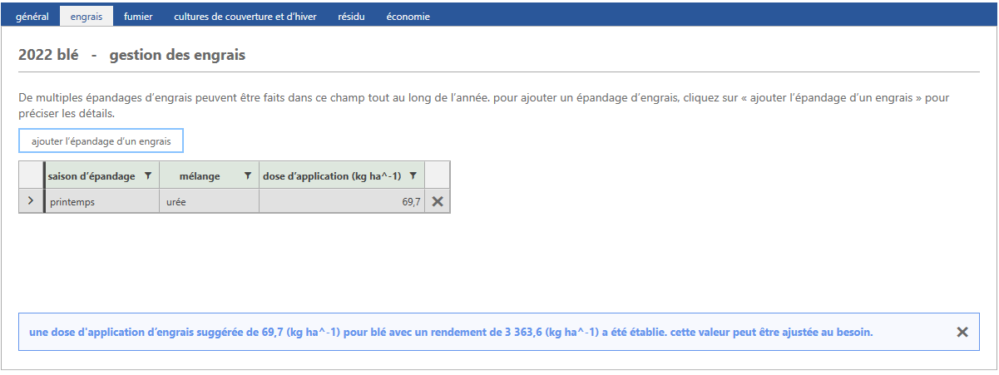
     
    <em>
		Figure 6.6 – Onglet Engrais pour une composante sur le terrain. Cet onglet montre le tableau d’épandage de l’engrais pour un champ.
	</em>

 

##### Fumier

Permet à l’utilisateur d’ajouter un épandage de fumier au champ. Cette application comprend des renseignements comme la date de l’épandage, le type de fumier utilisé, son origine et la quantité épandue.

Un résumé de tous les épandages de fumier à une ferme se trouve dans la section [Renseignements sur la ferme](#renseignements-sur-la-ferme) du programme. La section des renseignements sur la ferme est accessible sous l'en-tête/l'élément de menu [Paramètres](#chapitre-4---paramètres).

 

 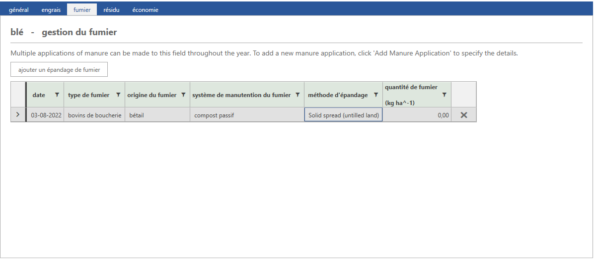
     
    <em>
		Figure 6.7 -- Onglet Fumier pour une composante sur le terrain. Indique le tableau d'épandage du fumier pour un champ.
	</em>

 

 

##### Résidus

Dans cette section, l'utilisateur peut indiquer la quantité de carbone et d'azote présente dans les cultures. Il peut également indiquer la proportion de la culture qui reste au-dessus ou au-dessous du sol après la récolte.

 

 
     
    <em>
		Figure 6.8 -- Onglet Résidus pour une composante sur le terrain.
	</em>

 

 

##### Économie

La section Économie présente diverses données économiques concernant la composante, comme le prix des cultures, les coûts directs et les coûts fixes et variables totaux.

 

 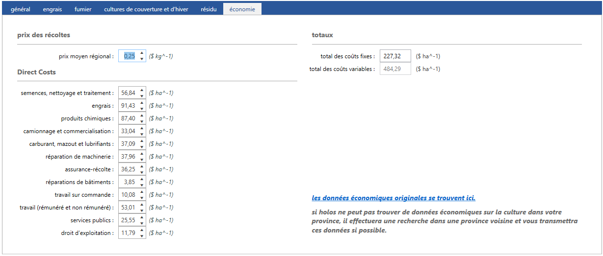
     
    <em>
		Figure 6.9 -- Onglet Économie pour une composante sur le terrain indiquant divers coûts liés au champ.
	</em>

 

### Composante des brise-vent

-   Un **brise-vent** est constitué de rangées d'arbres dont chacune contient divers types d'arbres, comme le caragana, le frêne vert, le peuplier hybride, etc.

-   **Une rangée brise-vent peut contenir plus d'un type d'arbre et il faut remplir des champs de données pour chaque type d'arbre.**

-   Dans cette section, nous parcourrons étape par étape la façon dont nous pouvons modifier les données d'une composante de brise-vent en fonction de votre exploitation.

-   **Si vous n'avez pas créé de composante de brise-vent**, veuillez cliquer ici [Introduction à la sélection de omposantes](#présentation-de-la-sélection-des-composantes) pour savoir comment ajouter une composante à votre ferme.

 

#### Configuration du brise-vent

Après avoir ajouté une composante de brise-vent, vous disposez de diverses options pour la configurer.

1.  Inscrivez l'**Année d'observation** pour votre brise-vent.
2.  Lorsque la composante est ajoutée à votre ferme, il y a une rangée d'arbres dans le brise-vent, par défaut. **Pour ajouter une rangée d'arbres supplémentaire, cliquez sur Rangée supplémentaire.**

 

 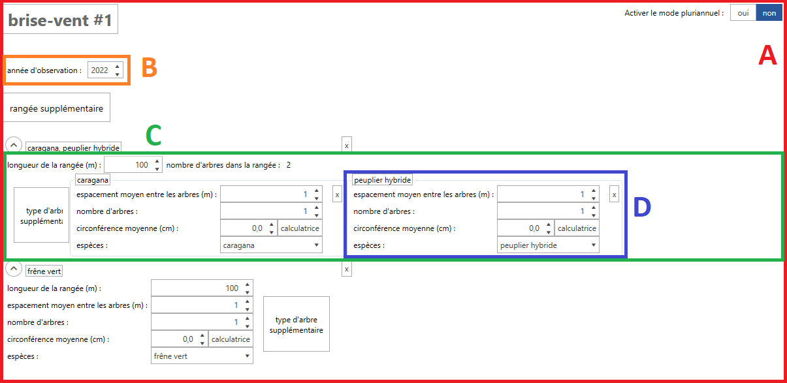
     
    <em>
		Figure 6.10 -- Composante du brise-vent.
		 
		A : La composante du brise-vent.
		 
		B : Nom du brise-vent et année d'observation.
		 
		C : Une rangée de brise-vent : longueur de la rangée et nom de la rangée.
		 
		D : Type d'arbre dans une rangée de brise-vent
	</em>

 

#### Modification des rangées de brise-vent

-   **Chaque rangée d'un brise-vent est composée de divers types d'arbres** et **chaque type d'arbre a ses propres champs de données** qui doivent être remplis, comme le montre **la figure 6.3**. **Cette question sera traitée dans la section Modification des données sur le type d'arbre.**

-   Chaque ligne comporte un champ de données pour le **Nom de la rangée et la longueur de la rangée (m)** et se trouve au-dessus de chaque rangée, comme le **montre la figure 6.3**.

-   Par défaut, le nom de la rangée correspondra toujours aux types d'arbres précis de votre rangée de brise-vent, mais vous avez la possibilité de personnaliser le nom de la rangée en fonction de votre exploitation. Par exemple, à la figure 6.3, la première rangée de notre brise-vent est composée d'un caragana et d'un peuplier hybride; par conséquent, le nom de la rangée sera automatiquement modifié pour devenir Caragana, Peuplier hybride.

-   **Si vous souhaitez ajouter un autre type d'arbre à l'une de vos rangées de brise‑vent**, cliquez sur le bouton **Autre type d'arbre** à côté de chaque rangée de brise-vent.

#### Modification des données sur le type d'arbre dans une rangée de brise-vent

Pour chaque type d'arbre dans vos rangées de brise-vent, il faut remplir un ensemble de champs de données correspondant aux brise-vent de votre ferme. 1. **Sélectionnez le type d'arbre** en cliquant sur le menu déroulant à côté de l'onglet **Espèces**. Une liste des types des arbres disponibles s'affiche, sélectionnez-en un. 2. **Entrez le reste des données correspondant à votre type d'arbre**, ce qui comprend l'espacement moyen entre les arbres (m), le nombre d'arbres, leur circonférence moyenne (cm) et le nom du type d'arbre. 3. Si vous ne connaissez pas la circonférence moyenne de votre type d'arbre, cliquez sur le bouton **Calculatrice** à côté du champ Circonférence moyenne. Pour en savoir plus sur la calculatrice de circonférence moyenne, suivez les instructions de la section suivante intitulée Calculatrice de circonférence moyenne.

 

 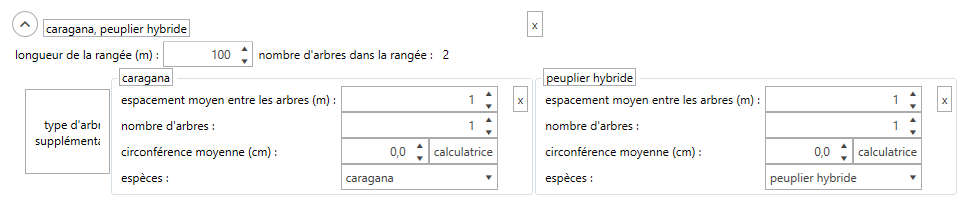
     
    <em>
		Figure 6.11 -- Types d'arbres dans une rangée de brise-vent. 
	</em>

 

#### Calculatrice de circonférence moyenne

-   La calculatrice produira la circonférence moyenne du type d'arbre qui vous intéresse en fonction de la circonférence du tronc de l'arbre à hauteur de poitrine.
-   **Si vous connaissez déjà la circonférence moyenne des arbres**, vous pouvez définir le champ de données dans le coin supérieur gauche de la calculatrice de circonférence et sélectionner **Entrée directe** **comme le montre la figure 6.5, section A.**

 

 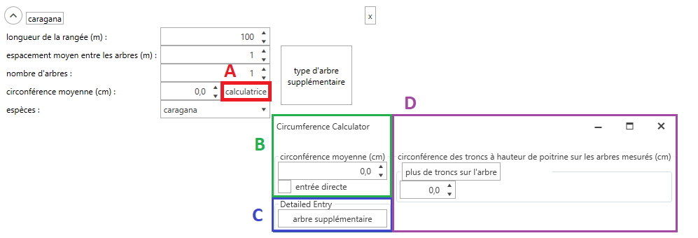
     
    <em>
		Figure 6.12 -- Calculatrice de circonférence moyenne.
		 
		A : Cliquez sur le bouton de la calculatrice pour afficher la fenêtre de la calculatrice de circonférence moyenne.
		 
		B : Saisie directe de la circonférence moyenne d'un type d'arbre.
		 
		C : Ajouter un arbre à la section C.
		 
		D : Circonférence des troncs à hauteur de poitrine associée aux arbres de votre type d'arbre.
	</em>

 

-   Il y a une section intitulée **Circonférence des troncs à hauteur de poitrine sur les arbres mesurés (cm)**. Dans cette section, vous pouvez entrer les données associées à vos arbres.
-   Pour ajouter un autre tronc à un arbre, cliquez sur **Plus de troncs sur l'arbre** et un nouveau champ de données s'affichera sous les données associées à l'arbre auquel vous ajoutez un tronc.
-   Si vous souhaitez ajouter un autre arbre, cliquez sur **Arbre supplémentaire** comme le montre la figure 6.11, section B. Le nouvel arbre sera ajouté sous la section Circonférence des troncs à hauteur de poitrine sur les arbres mesurés (cm).

 

 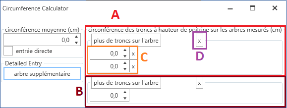
     
    <em>
		Figure 6.13 -- Données sur la circonférence des troncs à hauteur de poitrine sur les arbres mesurés.
		 
		A : Arbre 1. 
		 
		B : Arbre 2.
		 
		C : Les troncs et leur circonférence à hauteur de poitrine pour l'arbre 1.
		 
		D : Bouton de suppression de tronc. En cliquant sur ce bouton, vous supprimerez cette ligne de tronc.
	</em>

 

   

##### Détails sur les brise-vent

-   Si votre ferme compte plusieurs brise-vent à côté de l'onglet **Sélecteur de brise‑vent**, vous pouvez sélectionner en haut de la page la composante des brise‑vent pour laquelle vous souhaitez voir les résultats, comme le montre la figure 6.14, section A.

-   Pour accéder à la page des détails, cliquez sur **Suivant** au bas de la page du calendrier.

-   La page des détails **affichera une liste de données pour chaque rangée de brise-vent et leurs types d'arbres**, à partir de l'année de la plantation jusqu'à l'année de coupe que vous avez inscrite sur la page du calendrier des brise-vent (figure 6.14, section C).

-   La page des détails produira également des calculs supplémentaires comme la catégorie de mortalité en pourcentage (0/15/30/50), le carbone de surface (kg C par arbre) et le carbone souterrain (kg C
par arbre).

-   Si vous modifiez des valeurs dans les pages précédentes, cliquez sur **Reconstruire les colonnes de données** pour actualiser les données du tableau (Figure 6.14, section B).

-   Si vous souhaitez voir les colonnes de la calculatrice (pour la circonférence moyenne), cliquez sur **Afficher les colonnes de la calculatrice** dans le coin supérieur droit de la page Détails du brise-vent, et une colonne de la calculatrice s'affichera. Si vous ne savez pas ce qu'est la calculatrice de circonférence moyenne, cliquez ici : [Comment utiliser la calculatrice de circonférence moyenne](#calculatrice-de-circonférence-moyenne)

 

 
     
    <em>
		Figure 6.14 -- Détails du brise-vent.
		 
		A : Les brise-vent de votre ferme.
		 
		B : Si vous avez modifié des données dans les pages précédentes, veuillez cliquer ici pour reconstruire les colonnes de données.
		 
		C : Les données associées à chaque rangée de brise-vent et à leur type d'arbre correspondant de l'année de plantation jusqu'à l'année de coupe.
		 
		D : Si vous avez trié les données et souhaitez revenir à l'année par défaut, cliquez ici.
	</em>

 

 
  

##### Résultats du brise-vent

1.  **Pour obtenir les résultats**, cliquez sur le bouton **Résultats** au bas de chaque page des composantes.
2.  La page des résultats affichera l'empreinte des émissions du brise-vent sélectionné en fournissant des données sur les émissions de gaz à effet de serre calculées à partir des données entrées dans les pages précédentes.

## Composantes animales

-   Les composantes animales sont réparties dans les catégories suivantes : **Production de bœuf, Produits laitiers, Porcs, Volaille, Moutons et Autres animaux d'élevage.**

-   Tous les résultats pour chaque composante animale seront affichés sur une **seule page de résultats.**

-   Par contre, chaque composante animale doit avoir son propre ensemble d'entrées de données!

-   Dans cette section, nous verrons comment entrer les données pour chaque catégorie de composantes.

### Configuration des composantes animales

-   Les composantes animales sont très semblables en ce qui concerne la structure et les données requises pour créer les composantes.

-   Chaque composante animale comprend **un ou plusieurs groupes d'animaux (p. ex., génisses par opposition à bouvillons)**, parmi lesquels **chaque groupe fait l'objet d'une ou de plusieurs périodes
de gestion.**

-   La **période de gestion** est divisée en catégories et permet à l'utilisateur d'entrer des données sur les détails concernant les **Renseignements généraux, Ration, Logement et Fumier** pour chaque **groupe d'animaux.**

 

 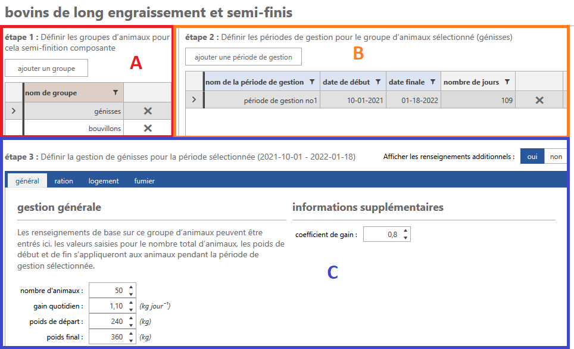
     
    <em>
		Figure 6.15 -- Présentation des Bovins de long engraissement et semi-finis présentant une composante animale.
		 
		A : Une liste des groupes d'animaux qui ont été ajoutés à la composante animale.
		 
		 B : Une liste des périodes de gestion pour un groupe d'animaux sélectionnés.
		 
		C : Les détails de la période de gestion sélectionnée
	</em>

 

  

#### Groupes

-   **Chaque** composante animale peut comprendre **un ou plusieurs groupes d'animaux**.
-   La **principale considération est que chaque groupe d'animaux** a un type particulier ou différent d'intrants et de pratiques de gestion qui y sont associés, p. ex., logement, ration, gestion du fumier, etc.
-   Pour **ajouter un groupe** à votre composante animale, vous pouvez utiliser les boutons situés en haut à droite de la section des groupes d'animaux.
-   Le groupe ajouté s'affichera sous **Étape 1**.
-   Vous pouvez **supprimer un groupe d'animaux** en cliquant sur le **X** à côté du groupe d'animaux que vous souhaitez supprimer.
-   Vous pouvez **également trier les groupes par ordre alphabétique** en cliquant sur l'en-tête **Nom du groupe**\".
-   Si vous voulez voir les détails sur un groupe d'animaux, veuillez le sélectionner en cliquant n'importe où dans la section des groupes. Le groupe d'animaux sélectionné sera indiqué par un symbole « \> » dans la colonne de gauche.
-   Vous pouvez **modifier le nom de chacun de vos groupes d'animaux** en cliquant sur le nom que vous souhaitez modifier et en y inscrivant votre nom personnalisé.

 

 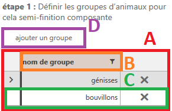
     
    <em>
		Figure 6.16 -- Groupes d'animaux.
		 
		A : Tous les groupes d'animaux actuellement ajoutés. Chaque ligne contient un seul groupe.
		 
		B : Un groupe animal particulier -- bouvillons.
		 
		C : Pour trier les noms, cliquez sur l'en-tête **Nom du groupe**.
		 
		D : Boutons pour ajouter un groupe d'animaux.
	</em>

 

    

#### Période de gestion

-   Une période de gestion est une période pendant laquelle il est possible de saisir les détails relatifs à un groupe d'animaux, en fonction des opérations effectuées pendant cette période.
-   Chaque **groupe d'animaux** peut faire l'objet d'**une ou plusieurs** périodes de gestion.
-   Pour voir la ou les périodes de gestion d'un groupe d'animaux, veuillez **sélectionner le groupe sous Étape 1**.
-   Vous pouvez modifier le **nom, la date de début** et le **nombre de jours** pour chaque période de gestion.
-   Pour ajouter une nouvelle période de gestion à votre groupe d'animaux sélectionné, veuillez cliquer sur le bouton **Ajouter une période de gestion** sous **Étape 2**.
-   Pour **supprimer une période de gestion**, cliquez sur le bouton **X** à côté de la période que vous souhaitez supprimer.
-   Les données sur une période de gestion peuvent être réparties en quatre catégories : **Renseignements généraux, Ration, Logement et Fumier**.
-   Pour voir les données sur une période de gestion, veuillez cliquer sur celle que vous souhaitez consulter.

 

 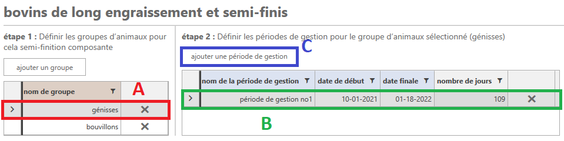
     
    <em>
		Figure 6.17 -- Périodes de gestion pour le groupe d'animaux.
		 
		A : Le groupe d'animaux sélectionné.
		 
		B : Périodes de gestion pour le groupe d'animaux sélectionné.
		 
		C : Cliquez ici pour ajouter une nouvelle périodede gestion pour votre groupe d'animaux
	</em>

   

-   Pour voir les renseignements supplémentaires pour chaque section, cliquez sur **Oui** à côté de l'en-tête Afficher les renseignements supplémentaires.

 

##### Renseignements généraux

-   La section des renseignements généraux contient des données simples sur le groupe animal, comme le **nombre d'animaux** et le taux quotidien moyen des **coefficients de gain**.
-   Vous pouvez également inscrire les poids de **départ** et de **fin** pour votre groupe d'animaux.
-   Certains groupes d'animaux comportent des champs de données supplémentaires propres à ce groupe.

 

 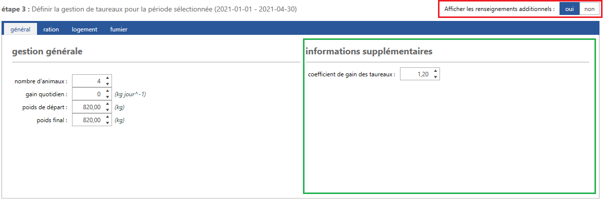
     
    <em>
		Figure 6.18 -- Onglet général Périodes de gestion.
		 
		A : Le bouton à bascule **Afficher les renseignements supplémentaires** vous permet de consulter des renseignements supplémentaires dans un onglet.
		 
		B : Renseignements supplémentaires concernant une section d'onglet.
	</em>

 

  

##### Rations

-   La section sur le régime alimentaire contient des renseignements sur les rations de votre groupe d'animaux au cours de la période de gestion sélectionnée.
-   Vous pouvez sélectionner l'une des **rations par défaut**, par exemple : **faible, moyen ou élevé** en protéines.
-   Si vous avez sélectionné **Renseignements supplémentaires**, vous pouvez ajouter des précisions sur la ration, comme le fourrage, les   protéines brutes, les matières grasses, etc.
-   Si vous voulez créer votre propre **ration personnalisée**, il y a un bouton **Créateur de ration personnalisée** au bas de la section sur le régime alimentaire. Si vous ne savez pas comment créer une ration personnalisée, cliquez ici : [Comment créer une ration personnalisée](#créer-une-ration-personnalisée).

 

 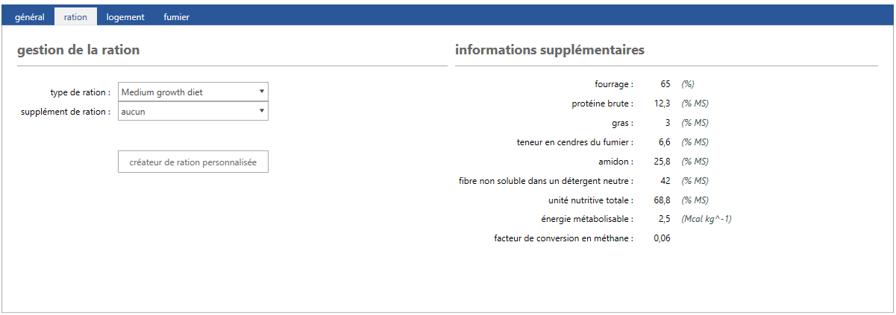
     
    <em>
		Figure 6.19 -- Périodes de gestion -- onglet Ration
	</em>

 

##### Logement

-   La section sur le logement contient des renseignements sur la situation du logement pour le groupe d'animaux que vous avez choisi au cours de la période de gestion sélectionnée.
-   Vous pouvez sélectionner des types de logements par défaut, comme : enclos sans étable, enclos, pâturage fermé, etc.

 

 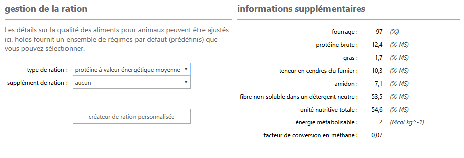
     
    <em>
		Figure 6.20 -- Périodes de gestion -- Onglet Logement.
	</em>

-   Si vous sélectionnez **Pâturage fermé**, vous verrez un champ de données supplémentaire pour **Emplacement du pâturage**.

##### Fumier

-   La section sur le fumier contient des détails sur les utilisations de fumier pour le groupe d'animaux que vous avez sélectionné au cours de la période de gestion sélectionnée.
-   Vous pouvez sélectionner des types de gestion du fumier par défaut, comme : Litière profonde, stockage solide, etc.
-   Si vous avez choisi de voir des renseignements supplémentaires, vous pouvez fournir des données d'entrée pour obtenir des précisions sur le fumier.

 

 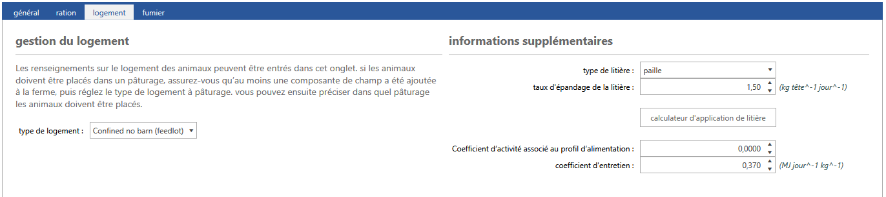
     
    <em>
		Figure 6.21 -- Périodes de gestion -- Onglet Fumier.
	</em>

 

### Production bovine

La catégorie de production bovine comprend les composantes animales suivantes :

-   Boeufs -- Vaches/veaux
-   Bovins de long engraissement et semi-finis
-   Finition des bovins

 

### Produits laitiers

La catégorie des produits laitiers comprend la composante animale suivante : 
- Bovins laitiers.

 

### Porcs

La catégorie des porcs comprend les composantes animales suivantes : 
- Porcs d'engraissement et porcs de finition
- De la naissance au sevrage 
- Sevrage en isolement
- De la naissance à la finition.

 

### Volaille

La catégorie de la volaille comprend les composantes animales suivantes :
- Ferme de poulettes 
- Éleveur-multiplicateur de poulets 
- Production de viande de poulet 
- Éleveur-multiplicateur de dindons 
- Production de viande de dinde 
- Production d'œufs de poulet 
- Couvoir multiplicateur de poulets.

 

### Moutons

La catégorie des moutons comprend les composantes animales suivantes :

- Parc d'engraissement de moutons 
- Béliers 
- Agneaux et brebis.

 

### Autres animaux d'élevage

La catégorie des autres animaux d'élevage comprend les composantes animales suivantes : 
- Chèvres 
- Chevreuils 
- Chevaux 
- Mules
- Bisons 
- Lamas.

 

## Composantes de l'infrastructure

Cette catégorie comprend les composantes liées à l'infrastructure de la
ferme.

 

### Composante de la digestion anaérobie

 

#### La composante fait partie des travaux en cours.

 
 

# Chapitre 7 - Calendrier

Pour afficher le CALENDRIER, votre ferme doit être en mode avancé et activez le mode pluriannuel dans l’écran de sélection des composantes

- [Apprendre comment passer du mode de base au mode avancé.](#comment-puis-je-activer-le-mode-avance)

- [Découvrez comment activer le mode pluriannuel.](#comment-puis-je-activer-le-mode-pluriannuel)

L’écran Calendrier vous permet de voir votre ferme sur une période allant de 1985 à aujourd’hui.

## Configuration d’un système de production

*	Pour **ajouter un système de production historique ou prévu**, cliquez sur le champ dans la liste des systèmes de production sous « **Étape 1** » ou sélectionnez le système dans la région du calendrier.

*	Une fois que le système a été sélectionné et est actif, cliquez sur « **Ajouter un système de production historique** » ou « **Ajouter un système de production prévu** ».
*	L’ajout d’un **système de production historique** créera un nouveau bloc intégré avec le champ original au **début du calendrier**, tandis qu’un **système de production prévu** placera le nouveau bloc à la **fin du calendrier**.

   
   
 

 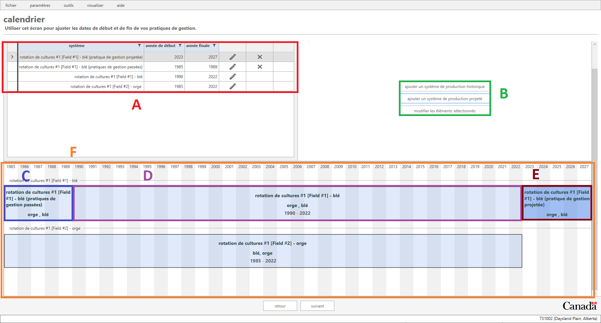
     
    <em>
		Figure 7.1 – Écran du calendrier. 
		 
		A : Les systèmes de production disponibles. 
		 
		B : Commandes pour ajouter ou modifier des systèmes de production historiques ou prévus. 
		 
		C : Un système de production historique. 
		 
		DD : Le système de production d’origine à partir de l’écran de sélection des composantes.  
		 
		E : Un système de production prévu.
		 
		F : Région du calendrier 
	</em>

 
 

# Chapitre 8 - Détails

## Survol

-   Pour afficher cet écran, assurez-vous d'**activer le mode pluriannuel** en **mode avancé** et de **désactiver les résultats simplifiés** dans la barre d'outils.

-   Cet écran présente une grille détaillée liée aux champs de votre ferme, comme l'**apport en carbone**, le **rendement** et d'**autres facteurs** pour chaque année de vos systèmes de production que vous avez créés dans le **calendrier**.

-   Si vous ne savez pas comment créer un système de production, vous pouvez apprendre comment en lisant Calendrier : Configuration d'un système de production.

-   Nous avons d'abord vu le « **plateau de données** » (voir la figure 8.1) à gauche de la grille des systèmes de culture.
    -   Cliquez sur « **Activer les colonnes** » à gauche de la grille de données pour agrandir un plateau des colonnes de données disponibles.
    -   Cliquez de nouveau sur « Activer les colonnes » pour réduire le plateau sur le côté.
    -   Le plateau vous permet d'afficher ou de masquer différentes colonnes dans la grille. Votre choix des colonnes à masquer persistera entre les séances et les fermes (c.‑à‑d. les colonnes de données masquées dans une ferme seront également masquées dans d'autres fermes nouvelles ou existantes).
    -   Les données sont disponibles dans d'autres vues lorsqu'on utilise exactement la même fonctionnalité pour chaque cas.
    
-   Si vous êtes arrivé à cet écran et que vous êtes retourné pour modifier quelque chose à propos de vos champs, vous devrez peut-être recharger les données pour les tenir à jour en fonction de vos changements. Pour effectuer le rechargement, cliquez sur « **Recharger les données de l'écran précédent** » dans le coin supérieur gauche de la vue.

-   Vous pouvez modifier la façon dont l'écran affiche les rendements de vos champs à l'aide du menu déroulant à côté de « **Méthode d'attribution du rendement** » **(la valeur par défaut est « Rendement moyen »).**

-   Comme pour les autres grilles de Holos, vous pouvez trier et filtrer chaque colonne affichée. Tout ce qui se trouve à droite de la colonne Rendement peut être modifié à la main.

 

 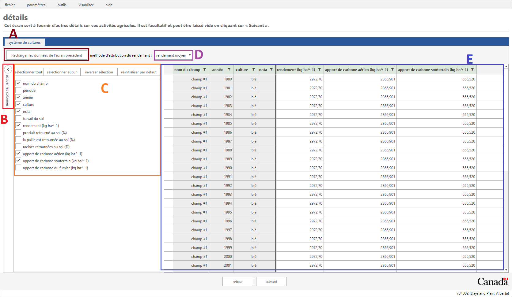
     
    <em>
		Figure 8.1 -- Écran de détail.
		 
		A : Cliquez ici pour recharger vos modifications de l'écran précédent.
		 
		B : Cliquez sur ce bouton pour agrandir ou réduire le plateau de données.
		 
		C : Le plateau de données.
		 
		D : L'attribution de rendement actuelle.
		 
		E : Données pouvant être modifiées par l'utilisateur.
	</em>

 

   
 

## Charger un fichier d'entrée

-   Pour attribuer un fichier avec des rendements personnalisés dans l'affichage des résultats de Holos, sélectionnez le menu déroulant à côté de « **Méthode d'attribution du rendement** » et choisissez « **fichier d'entrée** ».

-   Cliquez sur le bouton qui s'affiche, intitulé « **Charger les données sur le rendement personnalisé** ».

-   Un explorateur de fichiers s'affiche. Accédez à votre fichier d'entrée.

-   Le fichier d'entrée doit être un fichier de **valeurs séparées par des virgules (CSV)**.

-   Le format du fichier doit être comme suit :
    -   Une colonne pour l'année et autant de colonnes que vous avez de rotations.
    -   Vous pouvez avoir autant d'années et de rotations que vous le souhaitez dans le fichier si elles sont conformes au format ci-dessus.
    -   Veuillez noter que vous devez séparer le nom du champ et le nom de la rotation par un trait d'union pour que Holos associe correctement la valeur du rendement au champ et à la rotation appropriés.
    

| Année  | Champ no 1 - Rotation no 1 | Champ no 1 - Rotation no 2 | ... |
| ----- | :---------------------: | :----------------------------: | :-: |
| 1990  |          1065           |                 1378           | ... |
| 1991  |          1020           |                 1223           | ... |
| ...   |          ...            |                  ...           | ... |

 
 

# Chapitre 9 - Résultats

Les résultats sont disponibles sous forme simplifiée ou détaillée. Les résultats détaillés sont les résultats par défaut lorsque vous cliquez sur « **Résultats** » en **mode avancé**. Pour activer les résultats simplifiés, cliquez sur « **Afficher** » dans la barre d'outils et cliquez sur « **Activer les résultats simplifiés** ».

## Résultats simplifiés

-   En « mode de base », la page de résultats affiche un ensemble de résultats de base.

-   Cette page présente un résumé général des émissions de la ferme et de la quantité produite pour chaque composante de la ferme.

-   La page présente également un graphique montrant les émissions globales pour chaque composante de la ferme.

 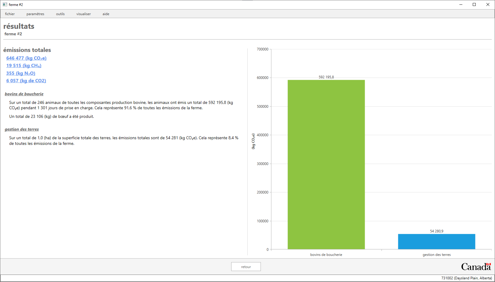
     
    <em>
		Figure 9-1 - Résultats simplifiés en mode année unique.
		 
		A : Détails sommaires de la ferme.
		 
		B : Graphiques affichant les données de diverses composantes ajoutées à la ferme.
	</em>

 

  

## Résultats détaillés

-   En « mode avancé », la page de résultats affiche un ensemble de résultats avancés. Ces résultats sont divisés en plusieurs onglets, chaque onglet s'affichant avec chaque composante affichant de l'information sur un aspect particulier des résultats de la ferme.

### Estimations de la production

Fournit des détails sur la production de la ferme. Le rapport peut être présenté mensuellement ou annuellement. Si la composante comporte plusieurs produits comme les bovins de boucherie (fumier et bœuf), il y aura des boutons qui apparaîtront au-dessus de la partie graphique du rapport pour afficher le graphique approprié.

 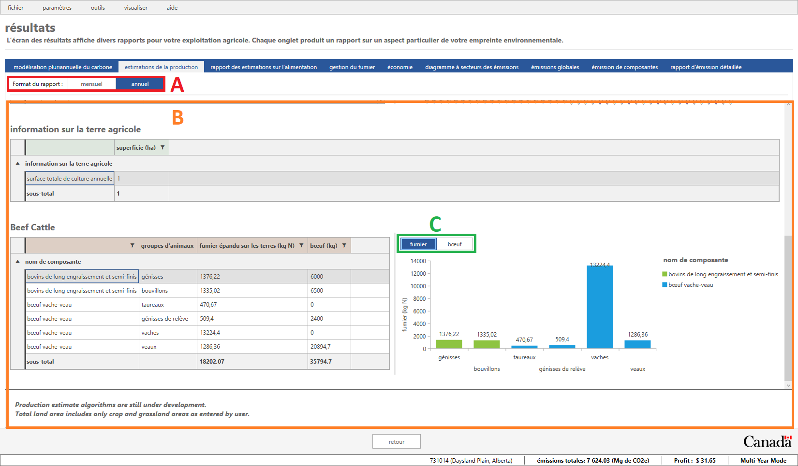
     
    <em>
		Figure 9-2 - Onglet des résultats des estimations de la production.
		 
		A :Permet de passer au format de présentation mensuel ou annuel.
		 
		B :Estimations de la production.
		 
		C : Bouton à bascule qui permet de passer d'une composante à l'autre.
	</em>

 

   

### Données économiques

Indiquent le prix du marché et le total des revenus de votre ferme. Les données économiques sont fournies par diverses sources de données de 2020 et pourraient être inexactes. Cet onglet donne une estimation approximative de ce que vous pourriez gagner et devrait être utilisé avec prudence.

 

 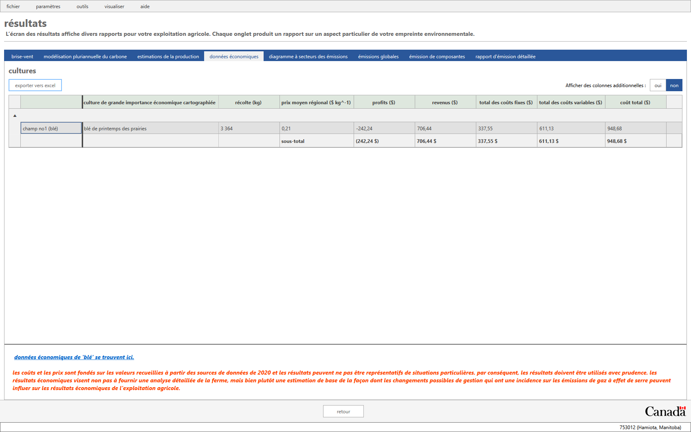
     
    <em>
		Figure 9-3 - Onglet des résultats économiques.
		 
		A : Bouton permettant d'exporter des données vers un fichier Excel (feuille de calcul).
		 
		B : Bouton à bascule qui active ou désactive des colonnes supplémentaires.
		 
		C : Les données économiques pour la culture.
	</em>

 

   

### Diagramme circulaire des émissions

Une représentation proportionnelle de toutes les émissions de la ferme. Vous pouvez voir comment chaque composante de la ferme contribue en cliquant sur « **Oui** » à côté de « **Afficher les détails** ». Vous pouvez également modifier les unités de mesure : cliquez sur la liste déroulante à côté de « **Unités de mesure** ». Le graphique met en surbrillance chaque secteur sur lequel vous passez le curseur pour en
faciliter l'identification.

 

 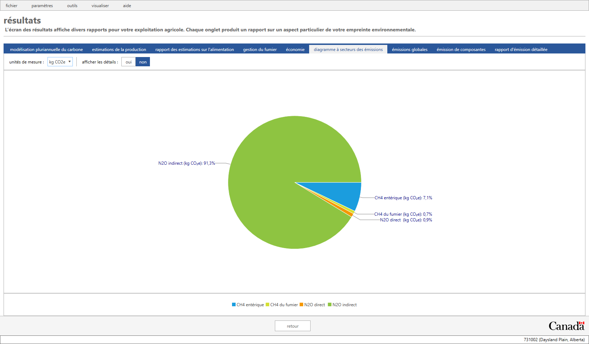
     
    <em>
		Figure 9-4 - Onglet des résultats du graphique circulaire économique.
		 
		A : Diverses options liées à l'affichage du graphique.
		 
	    B : Le graphique circulaire et les données.
		 
		C : Les diverses émissions de la ferme.
	</em>

 

 

### Émissions globales

Afficher la quantité totale de chaque gaz à effet de serre produit par la ferme.

 

 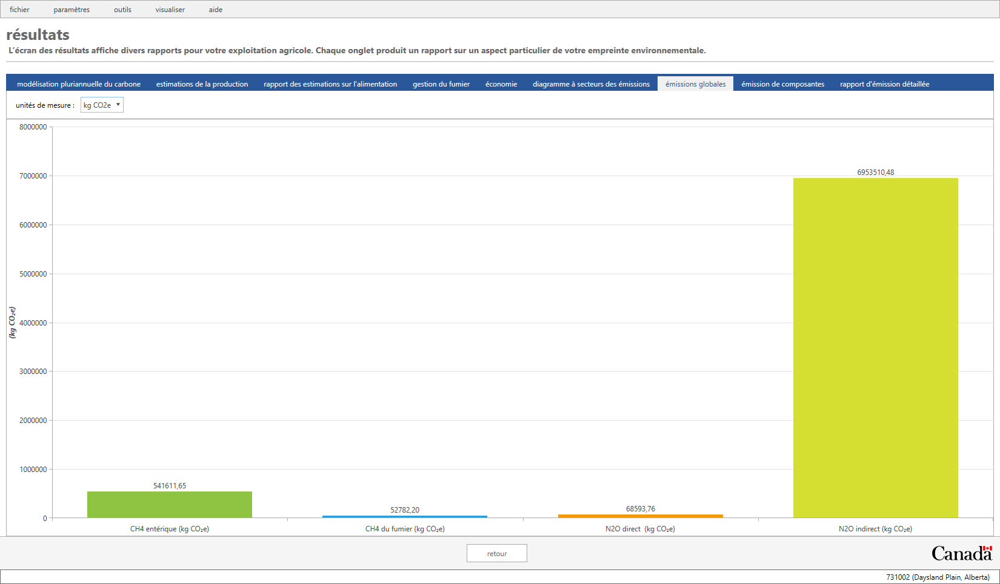
     
    <em>
		Figure 9-5 - Onglet Résultats des émissions globales
	</em>

 

### Émissions provenant des composantes

Présente une ventilation mensuelle de toutes les émissions d'une ferme.

 

 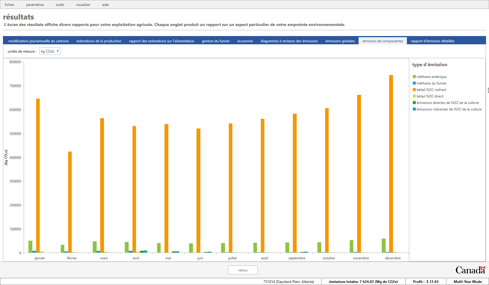
     
    <em>
		Figure 9-6 - Onglet Résultats des émissions des composantes.
	</em>

 

### Rapport détaillé sur les émissions

Un résumé détaillé de chaque composante de la ferme, indiquant la répartition des émissions pour chaque composante (c.-à-d. le total de N2O direct/indirect, de CH4 entérique et de CH4 du fumier produit par la composante donnée). Vous pouvez exporter ces données dans un fichier CSV de votre choix. Vous pouvez également comparer plusieurs fermes et voir
la comparaison dans le tableau.

 

 
     
    <em>
		Figure 9-7 - Onglet Résultats des émissions détaillées.
		 
		A : Barre de commande capable d'exporter les données du graphique, en comparant plusieurs fermes, ainsi que d'autres options mentionnées précédemment.
		 
		B: Légende représentant chaque type d'émission.
		 
		C : Incertitude associée à chaque type d'émission.
	</em>

 

   

### Rapport d'estimation des aliments

Affiché seulement lorsqu'une composante animale est ajoutée à une ferme. Affiche la quantité consommée par chaque groupe de la composante animale en moyenne par jour (peut être affiché mensuellement ou annuellement).

 

 
     
    <em>
		Figure 9-8 - Onglet Résultats du rapport d'estimation des aliments.
	</em>

 

### Gestion du fumier

Affichée seulement lorsqu'une composante animale est ajoutée à une ferme. Holos affichera la quantité de fumier pour chaque groupe d'animaux dans votre système. Comme l'écran Détails, cet écran comporte
également le plateau de données pour basculer entre les colonnes de la grille.

 

 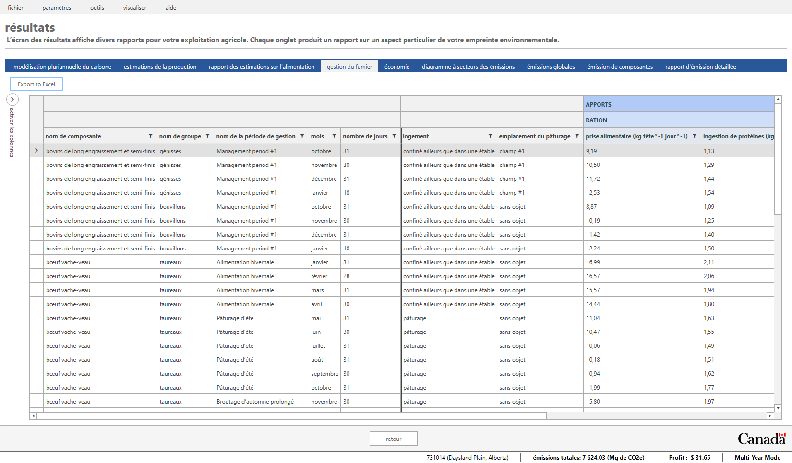
     
    <em>
		Figure 9-9 - Onglet Résultats de la gestion du fumier.
	</em>

 

### Modélisation pluriannuelle du carbone

S'affiche uniquement lorsque le mode pluriannuel est sélectionné.

Affiche un graphique montrant le carbone organique du sol (COS) pour les champs de la ferme sur une période donnée (la valeur par défaut est 1985 -- présent). Vous pouvez voir l'onglet « Champs » sous forme de graphique ou de tableau affichant diverses données concernant le climat, le carbone, l'azote, etc. Comme avec l'écran « Détails » et l'onglet « Gestion du fumier », nous avons également accès au plateau de données pour basculer entre les colonnes de données appropriées.

Cliquez sur le bouton à bascule « Grille » ou « Graphique » pour afficher les résultats dans le format correspondant.

**Dans la vue Graphique**, **lorsque vous passez la souris** sur des points de données d'une année donnée, vous obtenez des renseignements de base sur ce point. L'utilisateur peut également cliquer sur un lien dans chaque fenêtre contextuelle pour afficher de plus amples renseignements sur les données de cette année dans la vue « Grille ».

 

 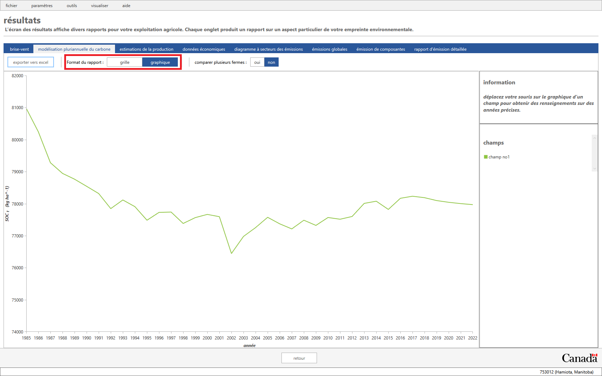
     
    <em>
		Figure 9-10 - Onglet Résultats de la modélisation pluriannuelle du carbone - Vue Graphique.
		 
		A : Bouton permettant de basculer entre les représentations Grille et Graphique.
	</em>

 

 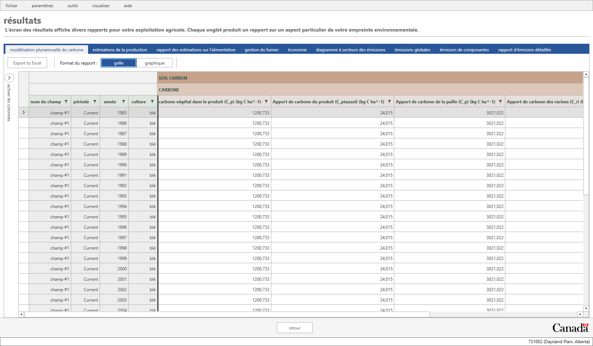
     
    <em>
		Figure 9-11 - Onglet Résultats de la modélisation pluriannuelle du carbone - Vue Tableau/Grille
	</em>

 

 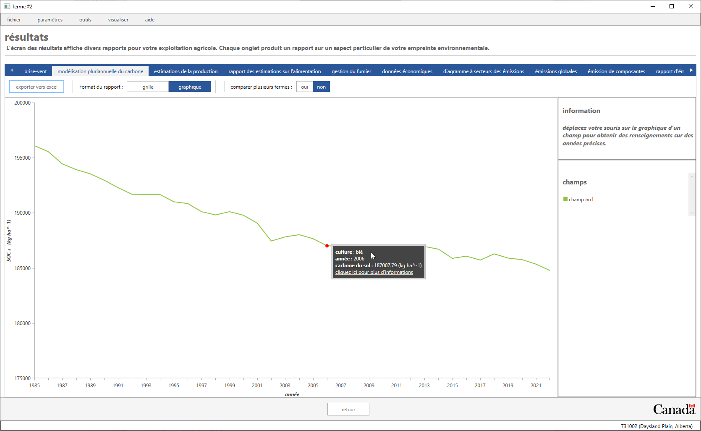
     
    <em>
		Figure 9-12 - Infobulle dans la vue Graphique montrant de l'information supplémentaire pour un point de données.
	</em>

 
 

# Chapitre 10 - Interface de ligne de commande

## Qu'est-ce qu'une interface de ligne de commande?

-   L'interface de ligne de commande (CLI) Holos vous permet de traiter efficacement de grandes quantités de données correspondant aux diverses activités de votre ferme.

-   L'interface exige que l'utilisateur **crée des fichiers Excel d'entrée de données** pour plusieurs fermes et leurs composantes respectives (c.-à-d. champs, naissage, porcs, etc.).

-   Les fichiers Excel d'entrée de données doivent être enregistrés en format CSV. **Microsoft Excel est recommandé** étant donné que d'autres logiciels tiers (tels qu'OpenOffice) sont connus pour
causer des erreurs de saisie.

-   Les fichiers d'entrée ne peuvent pas être ouverts dans un autre programme pendant l'exécution de la CLI.

-   Dans cette section, nous verrons comment **configurer la CLI**, comment **modifier les fichiers de paramètres**, comment **créer des fichiers de données pour chaque composante et comment utiliser la
CLI.**

## Configuration de l'interface de ligne de commande

Dans cette section, nous passerons en revue les étapes à suivre pour bien configurer la CLI en ce qui concerne la navigation dans le répertoire Holos, la modification des fichiers de paramètres globaux, la
création ou la modification de fichiers Excel d'entrée de données et l'ajout d'un nouveau dossier à la CLI, pour chacune des composantes de votre ferme.

 

### Le dossier Fermes dans la CLI

-   L'interface de ligne de commande Holos exige que l'utilisateur crée un dossier « Fermes » dans lequel toutes les données liées aux fermes seront stockées.

-   Ce dossier Fermes se trouve dans un dossier général qui contient toutes les fermes individuelles avec lesquelles l'utilisateur veut travailler.

-   Chaque dossier de ferme individuelle contient des dossiers différents pour chacune des composantes de votre ferme, ainsi qu'un fichier de paramètres globaux pour cette ferme (où vous pouvez établir vos valeurs par défaut globales pour chaque ferme).

-   De plus, chaque dossier de composante contient des fichiers Excel qui stockent les données d'entrée pour chacune de vos activités (c.-à-d. des fichiers d'entrée de données pour un champ ou une composante naissage dans votre ferme).

 

#### Créer un nouveau dossier Fermes

1.  Lorsque vous démarrez CLI Holos, vous êtes invité à entrer l'emplacement de votre dossier « **Fermes** ». Ce dossier « **Fermes** » peut se trouver n'importe où sur votre ordinateur. Après avoir spécifié votre dossier Fermes général, Holos créera un dossier par défaut dans ce dossier général, qui sera appelé « **FermeExempleHolos** ».

    Ce dossier par défaut contiendra plusieurs autres dossiers pour chacune des composantes de Holos, ainsi qu'un fichier « **Paramètres.Ferme** » contenant tous les paramètres liés à cette ferme en particulier.

 

 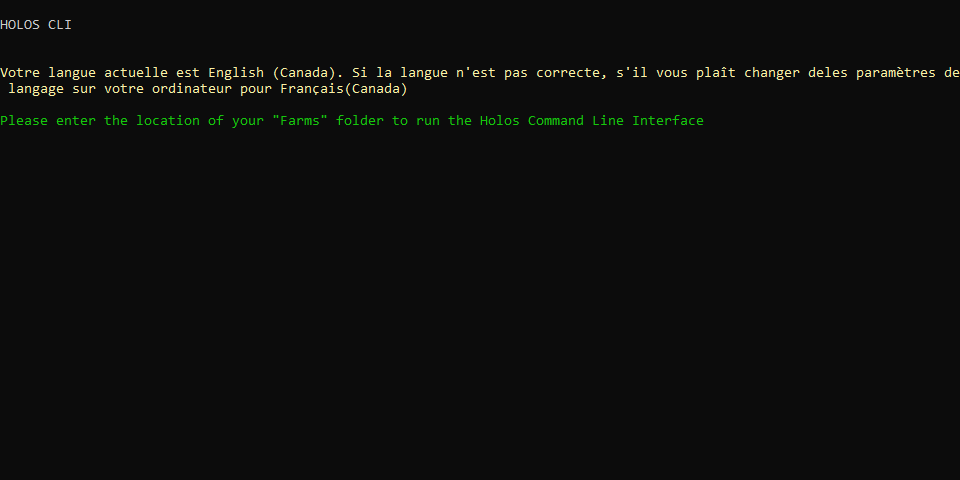
     
    <em>
		Figure 10-1 - Invitation à entrer l'emplacement de la ferme.
	</em>

 

 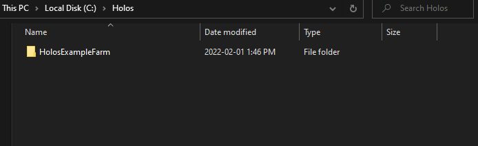
     
    <em>
		Figure 10-2 - Dossier par défaut créé par la CLI.
	</em>

 

 
     
    <em>
		FFigure 10-3 - Dossiers de composants par défaut créés par CLI.
	</em>

 

Vous serez ensuite invité à importer des fermes de la version de l'interface utilisateur graphique Holos. Les options suivantes vous inviteront à choisir d'autres paramètres liés à vos fermes.

2.  Pour créer un dossier modèle approprié, Holos doit connaître les unités de mesure que vous préférez. Veuillez sélectionner Métrique ou Impérial lorsque vous y êtes invité.

 

 
     
    <em>
		Figure 10-4 - Invitation à sélectionner les unités de mesure.
	</em>

 

3.  Le dossier modèle par défaut sera créé dans le répertoire que vous avez spécifié. Appuyez sur « Entrée » pour permettre la sortie du programme afin que vous puissiez créer des fichiers d'entrée de
données pour votre ou vos fermes. Naviguez jusqu'à l'emplacement pour voir votre nouveau dossier.

    Ce dossier modèle par défaut contiendra tous les répertoires de composantes nécessaires, un fichier de paramètres et des fichiers de données modèles pour chaque composante que vous utiliserez pour
créer vos propres fermes.

 

 
     
    <em>
		Figure 10-5 - Message après la création du dossier par défaut.
	</em>

 

Veuillez noter que si vous avez déjà utilisé la CLI de Holos, après avoir rouvert la CLI, vous serez invité à entrer l'emplacement du dossier « Fermes » précédemment utilisé ou à sélectionner un nouveau dossier « ****Fermes** ».

 

 
     
    <em>
		Figure 10-6 - Invite à entrer l'emplacement de la ferme.
	</em>

 

#### Ajouter une nouvelle ferme au dossier des fermes existantes :

Comment puis-je ajouter une nouvelle ferme au dossier CLI de ma ou mes fermes actuelles. Il y a deux méthodes pour ajouter une nouvelle ferme à un dossier existant. [La section des questions courantes porte sur les deux méthodes.](#comment-puis-je-ajouter-une-nouvelle-ferme-à-mon-dossier-cli-actuel)

 

#### Navigation dans le dossier des fermes :

1.  Par défaut, Holos créera un exemple de dossier dans le répertoire « **Fermes** » de la CLI de Holos, comme indiqué ci-dessous.

 

 
     
    <em>
		 Dossier par défaut créé par la CLI
	</em>

 

2.  Cet exemple de dossier contiendra automatiquement une liste de dossiers correspondant à toutes les composantes qui sont disponibles pour être utilisées dans Holos (c.-à-d. champs, naissage, etc.). Ainsi qu'un fichier de paramètres pour ce dossier en particulier

 

 
     
    <em>
		Dossiers de composantes par défaut créés par CLI
	</em>

 

3.  Chacun de ces dossiers de composantes aura un fichier Excel de saisie de données modèle que vous pourrez utiliser comme référence pour créer des fichiers de saisie de données supplémentaires. Chaque fichier Excel d'entrée de données représente l'une des composantes dont nous avons choisi le dossier.

    Par exemple, si nous sommes dans le dossier des brise-vent, chaque fichier Excel d'entrée de données représentera un brise-vent dans votre ferme. Donc, si vous avez deux brise-vent dans votre ferme, vous aurez deux de ces fichiers d'entrée de données.

 

 
     
    <em>
		Figure 10-6 - Un fichier modèle représentant une seule composante.
	</em>

 

### Modification des fichiers de paramètres

 Chacun de vos dossiers de ferme aura un fichier de paramètres qui vous permettra de définir des valeurs par défaut précises, comme Paramètres globaux, Valeurs par défaut de la ferme, Température, Précipitations, Évapotranspiration, Valeurs par défaut du sol et des cultures pour cette ferme en particulier.

1.  Accédez au dossier de la ferme dont vous souhaitez modifier le fichier de paramètres par défaut.

2.  Dans le dossier de la ferme sélectionnée, il y aura un fichier appelé « paramètres.ferme »; ouvrez ce fichier.

3.  Dans le fichier des paramètres, vous pouvez modifier les valeurs par défaut pour les paramètres qui sont pertinents pour les activités de votre ferme, comme : Paramètres globaux, Précipitations, Température, Évapotranspiration et Valeurs par défaut du sol.

4.  Ce fichier de paramètres peut être ouvert à l'aide de n'importe quel éditeur de texte, p. ex., Notepad.

 

 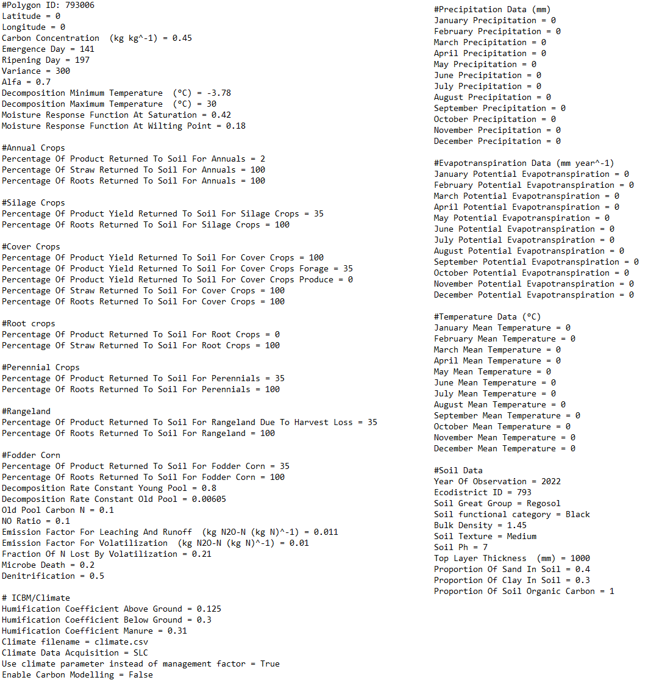
     
    <em>
		Figure 10-7 - Fichier des paramètres globaux de la ferme.
	</em>

 

### Modification des fichiers Excel d'entrée de données des composantes

-   Comme nous l'avons mentionné ci-dessus, chaque dossier de ferme contient une liste de dossiers qui correspondent aux composantes disponibles qui peuvent être utilisées dans Holos. Chacun de ces dossiers de composantes contient un modèle de fichier Excel d'entrée de données que vous pouvez **modifier en fonction des activités pour chaque composante de votre ferme.**

-   Dans cette section, nous passerons en revue les lignes directrices relatives à l'entrée des données pour chacun des fichiers Excel d'entrée de données de la composante. **Chaque fichier d'entrée de données doit représenter l'une de vos composantes**. Par exemple, si vous avez plusieurs brise-vent dans votre ferme, vous créerez un fichier Excel d'entrée de données différent **pour chaque brise‑vent**.

 

#### Composantes de la gestion des terres

#### Fichiers Excel d'entrée de données sur les brise-vent

-   **Ligne** : désigne la ligne du fichier Excel.

-   **Rangée brise-vent** : désigne la rangée d'arbres dans un brise-vent.

-   **Chaque ligne du fichier Excel d'entrée de données pour les brise-vent peut être divisée en trois groupes :**
    -   **Données sur les brise-vent**: Zone de rusticité, nom de l'écodistrict, nom du brise-vent, année d'observation.
    
-   **Données sur les rangées de brise-vent**: Nom de la rangée, longueur de la rangée, identifiant de la rangée, année de la plantation, année de la coupe.

    -   **Données sur les groupes d'arbres**: Espèces, nombre d'arbres plantés, espacement des arbres plantés (m), nombre d'arbres vivants, DHP.
    
-   Si votre rangée de brise-vent comprend plus d'un type d'arbre, vous créeriez une ligne de données Excel qui correspond à chaque type d'arbre faisant partie de cette rangée.

 

 
     
    <em>
		Figure 10-8 - Fichiers Excel d'entrée de données sur les brise-vent.
		 
		A: Données sur les brise-vent.
		 
		B : Données sur les rangées de brise-vent.
		 
		C : Données sur les groupes d'arbres.
	</em>

 

  

-   Nous pouvons voir ci-dessous que les deux lignes Excel mises en évidence renvoient à la même rangée de brise-vent, la seule différence étant qu'**une ligne Excel fait référence au type d'arbre,** **le caragana**, tandis que **l'autre fait référence au type d'arbre, le frêne vert**. Ces deux lignes Excel ensemble représentent les données pour la rangée de brise-vent, « **Caragana, Frêne vert »,** qui comprend les deux groupes d'arbres où **chaque groupe a son propre ensemble de données, bien que les deux appartiennent à la même rangée.**

 

 
     
    <em>
		Figure 10-9 - Représentation d'un brise-vent à une rangée.
		 
		A : Les lignes Excel qui représentent la rangée de brise-vent « Caragana, Frêne vert ».
		 
		B : Les deux lignes Excel renvoient au même brise-vent à une rangée (p. ex., N de la maison, Côté ouest, etc.).
		 
		C : Les deux lignes Excel renvoient au même identifiant de rangée (ce qui signifie qu'elles font partie du même brise-vent), p. ex., devant, milieu, arrière.
		 
		D : Ces deux lignes Excel comportent une espèce différente parce que le brise-vent à une rangée se compose de deux espèces, le caragana et le frêne vert, où chaque espèce a son propre ensemble de données.
	</em>

 

-   Pour chaque rangée d'arbres dans un brise-vent, veuillez établir un identifiant de rangée unique.

-   Pour les brise-vent à plusieurs rangées, chaque rangée d'arbres aura besoin d'un identifiant de rangée unique. Veuillez suivre la même procédure que ci-dessus pour remplir le reste du fichier d'entrée de données Excel.

-   Cependant, certains intrants acceptent des valeurs de données différentes, comme la « zone de rusticité » et les « espèces ».

##### Valeurs d'entrée de données spéciales

-   **Zone de rusticité**: La convention d'appellation est « H(0-9)(a-b) ». Par exemple, une zone de rusticité valide serait « H3a » ou « H3b » ou « H9a », où la première lettre serait toujours « H » et, pour le numéro ou la lettre suivant, vous pouvez choisir une fourchette entre 0 et 9 et a ou b pour représenter la zone de rusticité appropriée pour votre ferme.

-   **Espèces**: Caragana, frêne vert, peuplier hybride, érable du Manitoba, pin sylvestre, épinette blanche, feuillu moyen, conifère moyen.

-   Pour en savoir plus à propos de la composante Brise-vent, [Cliquez ici](#composante-des-brise-vent)

#### Fichiers Excel d'entrée de données sur le champ

-   **Ligne** : fait référence à la ligne du fichier Excel

-   **Rangée de grande culture :** désigne une rangée de grande culture
    dans la composante Champ
    -   Chaque ligne du fichier Excel de saisie des données sur le champ
        peut être divisée en sept groupes avec les données
        correspondantes.

-   **Données sur le champ**: Numéro de la phase, nom du champ,
    superficie (ha), année en cours
    
-   **Données sur les rangées de cultures**: Année-récolte, type de culture, type de travail du sol, année en peuplement vivace, identifiant de rangée, durée de peuplement vivace (années), coefficient de biomasse -- produit, coefficient de biomasse --paille, coefficient de biomasse -- racines, coefficient
de biomasse -- racines supplémentaires, teneur en azote du produit (kg kg\^-1), teneur en azote de la paille (kg kg\^-1), teneur en azote des racines (kg kg\^-1), teneur en azote des racines supplémentaires (kg kg\^-1), concentration en carbone (kg kg\^-1).

-   **Données sur les cultures**: Rendement (kg ha\^-1), méthode de récolte, taux d'engrais azoté (kg N ha\^-1), taux d'engrais phosphoreux (kg P ha\^-1), est irrigué, type d'irrigation, quantité d'irrigation (mm), teneur en humidité de la culture (%), pourcentage de paille retournée au sol (%), pourcentage de racines retournées au sol (%), pourcentage du rendement du produit retourné au sol (%), utilisation de pesticides, nombre de passages de pesticides.

-   **Données sur le fumier**: Fumier épandu, quantité de fumier épandu (kg ha\^-1), type d'épandage du fumier, type de source animale du fumier, type d'état du fumier, type de source d'emplacement du fumier.

-   **Données sur les cultures de couverture**: Cultures de couverture utilisées, type de culture de couverture, type de terminaison de culture de couverture.

-   **Données sur les cultures en sous-semis**: Cultures en sous-semis utilisées.

-   **Données sur les cultures broutées**: La culture est broutée/

-   Les figures ci-dessous sont un exemple des différents groupes de données fondés sur le fichier Excel d'entrée de données sur le champ pour faciliter la visualisation.

**Section d'entrée de données sur le champ (données sur les rangées de champ et de culture)**

 

 
     
    <em>
		Figure 10-10 - Section d'entrée de données sur le champ (données sur les rangées de champ et de culture).
		 
		A : Rangées de champ Ligne 
		 
		B : Données sur les rangées de culture
	</em>

 

 

**Section d'entrée de données sur le champ (données sur les rangées de cultures)**

 

 
     
    <em>
		Figure 10-11 - Section d'entrée de données sur le champ (données sur les rangées de culture).
		 
		B : Données sur les rangées de culture -- Les nombres et les coefficients se trouvent dans le document de l'algorithme Holos.
	</em>

 

 

**Section d'entrée de données sur le champ (données sur les cultures)**

 

 
     
    <em>
		Figure 10-12 - Section d'entrée de données sur le champ (données sur les cultures) .
		 
		C : Données sur les cultures.
	</em>

 

**Section d'entrée de données sur le champ (données sur les cultures,
données sur le fumier, données sur les cultures de couverture)**

 

 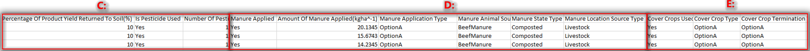
     
    <em>
		Figure 10-13 - Section d'entrée de données sur le champ (données sur les cultures, données sur le fumier, données sur les cultures de couverture).
		 
		C : Données sur les cultures.
		 
		D : Données sur le fumier.
		 
		E :Données sur les cultures de couverture.
	</em>

 

  E :Données sur les cultures de couverture

**Section d'entrée de données sur le champ (données sur les cultures en
sous-semis ou les cultures broutées)**

 

 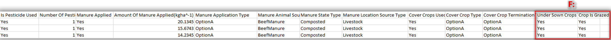
     
    <em>
		Figure 10-14 - Section d'entrée de données sur le champ (données sur les cultures) 
		 
		F : Données sur les cultures en sous-semis/cultures broutées.
	</em>

 

-   **Chaque ligne Excel représente les données associées à UNE culture** (culture, fumier, culture de couverture, etc.) et à la rangée de culture/le champ auquel la culture appartient (données sur les rangées de culture).

##### Cultures vivaces

-   Si la culture est **vivace, il y a trois champs de données importants qui doivent être remplis correctement** : année de la récolte, identifiant du peuplement vivace et durée du peuplement vivace (années).
    
-   L'identifiant du peuplement vivace prend la forme 00000000-0000-0000-0000-000000000000, où les zéros peuvent être le caractère que vous voulez. Un identifiant de peuplement simple peut être 00000000-0000-0000-0000-000000000001.
    
-   **Pour créer une durée de peuplement vivace**, veuillez créer la ou les rangées appropriées pour chaque année, mais **changez l'année de récolte et l'année de peuplement vivace en conséquence et reportez-vous à la culture vivace appropriée au moyen de l'identifiant de peuplement vivace**. (p. ex., si nous faisons référence à Culturevivace1, et qu'elle a une durée de peuplement vivace de quatre ans, nous aurons quatre lignes Excel qui se rapportent à l'identifiant de peuplement vivace de 00000000-0000-0000-0000-000000000001, mais avec des valeurs différentes pour l'année-récolte (2017, 2018, 2019 et 2020) et l'année de peuplement vivace (1, 2, 3, 4) et des valeurs de données variables pour les données sur les cultures.
    
-   Cela nous permet de regrouper avec précision les données sur les **cultures vivaces** pour chaque année.

-   **Pour chaque type de culture vivace, veuillez attribuer un identifiant de peuplement vivace unique**. P. ex., si le peuplement vivace était un mélange de foin de brome inerme et de luzerne; le brome inerme aurait un identifiant de peuplement vivace unique et la luzerne aurait un identifiant de peuplement vivace unique.

-   Par conséquent, pour chacune des cultures vivaces de votre champ, veuillez suivre la même procédure que celle indiquée ci-dessus pour remplir le reste du fichier d'entrée de données Excel.

-   Regardez les figures 10.10 à 10.14 pour voir des exemples de données sur les cultures vivaces (foin).

 

##### Cultures annuelles

-   **Si la culture n'est pas une culture vivace**, veuillez régler lesvaleurs des en-têtes de peuplement vivace ci-dessus à « S/O » et l'identifiant de peuplement à 00000000-0000-0000-0000-000000000000. Remplissez le reste des colonnes de données de façon appropriée pour cette culture.
-   Par conséquent, pour chacune des cultures annuelles dans votre champ, veuillez suivre la même procédure que celle qui est indiquée ci-dessus pour remplir le reste du fichier d'entrée de données sur
le champ Excel.
-   Regardez les figures 10.10 à 10.14 pour voir des exemples de données sur les cultures non vivaces (orge).

 

##### Valeurs d'entrée de données spéciales :

**Type de culture**:

-   **Cultures annuelles, ensemencées au printemps**:
    -   **Céréales** -- Blé, orge, avoine, etc.
    -   **Oléagineux** - Canola, moutarde, lin
    -   **Légumineuses** -- Soya, haricots (champ sec), pois chiches,
        etc.
    -   **Plantes racines** -- Pommes de terre, betteraves à sucre
    -   **Maïs** -- Maïs-grain, maïs d'ensilage
    -   **Cultures de couverture** -- Mauvaises herbes d'hiver, seigle,
        vesce velue, vesce velue + seigle
    -   **Autres** -- Carthame, graines de tournesol, tabac, etc.

-   **Annuel, ensemencé à l'automne** :
    -   Blé d'hiver
    -   Seigle d'automne
 
-   **Cultures vivaces**
    -   Cultures fourragères pour le foin - légumineuses, graminées et mélanges.
    -   Pâturage
    -   Prairie (indigène)
    -   Fourrage pour graines

**Méthodes de récolte :** 
- Cultures commerciales 
- Andainage 
- Ensilage 
- Engrais vert

**Type de travail du sol :** 
- Intensif 
- Aucun travail 
- Réduit

**Irrigué, épandage de fumier, cultures de couverture utilisées, culture broutée**: 
- Oui 
- Non

**Type d'épandage de fumier**:
- Épandage de solides de terre labourée 
- Épandage de solides de terre
non labourée - Diffusion de boues 
- Épandage en bandes 
- Injection à
faible profondeur 
- Injection en profondeur

**Type de source d'emplacement du fumier :**
- Bétail 
- Importé

**Types de sources animales du fumier :** 
- Fumier de bœuf 
- Fumier debovins laitiers 
- Fumier de porc - Fumier de volaille

**Types de cultures de couverture :** 
- Luzerne 
- Ivraie multiflore 
- Pois d'hiver autrichien

Si vous avez besoin d'en savoir plus sur la composante Champ, [cliquez ici : Renseignements supplémentaires sur la composante Champ](#composante-sur-le-terrain)

 

#### Composantes animales

-   Les composantes animales comprennent les groupes du **porc, du boeuf, des bovins laitiers, du mouton, de la volaille et d'autres animaux d'élevage**.

-   Les composantes animales **comprennent toutes différents groupes d'animaux**

-   Chaque groupe d'animaux a sa ou ses propres périodes de gestion qui consistent en des données sur les **régimes alimentaires, les bâtiments d'élevage et le fumier** **pour une période de gestion.**

-   **Vous pouvez avoir plusieurs périodes de gestion pour un groupe d'animaux.**

-   **Si vous avez plusieurs périodes de gestion pour un groupe d'animaux**, veuillez ajouter une autre rangée faisant référence au même groupe d'animaux (**même nom de groupe et même type de groupe**), mais modifiez les données de la période de gestion en conséquence.

-   **Vous ne pouvez pas avoir deux types d'animaux différents qui appartiennent au même groupe**. Par exemple, si vous examinez une composante porcine et que vous avez un groupe appelé « GroupeDémarragePorcs1 ». Ce groupe ne peut pas faire référence à plus d'un type d'animal (c.-à-d. seulement Démarrage des porcs, Finition ou Croissance des porcs) -- vous pouvez appeler le groupe
comme vous le voulez, **un groupe d'animaux ne peut pas faire référence à plus d'un type d'animal.**

-   Certaines **composantes animales** auront des données supplémentaires qui sont propres à leur type d'animal, comme la **production laitière** pour les animaux laitiers ou la **production de laine** pour les moutons.

-   Dans cette section, nous passerons en revue les différents types de composantes animales et leurs fichiers de données.

-   Vous trouverez **ci-dessous** un exemple des catégories que vous verrez dans un fichier de données sur les composantes animales.

-   Les en-têtes **Type de bâtiment d'élevage** et **Gestion du fumier** ne sont présentés ci-dessous qu'à titre d'exemple pour faciliter la catégorisation. Elles ne seront **PAS** présentes dans vos fichiers d'entrée de données.

##### Exemple de données de composantes animales réparties en sections

 

 
     
    <em>
		Figure 10-15 - Section 1 -- Données sur le porc.
		 
		A : Nom de la composante Porc.
		 
		B : Données sur le groupe des porcs.
		 
		C : Période de gestion du groupe des porcs.
		 
		D : Détails sur le régime pour la période de gestion.
	</em>

 

 

 
     
    <em>
		Figure 10-16 - Section 2 -- Données sur le porc.
		 
		D : Détails sur le régime alimentaire pour la période de gestion.
		 
		E : Détails sur les bâtiments d'élevage pour la période de gestion.
		 
		F : Détails sur le fumier pour la période de gestion
	</em>

 

 

 
     
    <em>
		Figure 10-17 - Section 2 -- Données sur le porc.
		 
		F : Détails sur le fumier pour la période de gestion.
	</em>

 

##### Valeurs d'entrée de données spéciales pour tous les composantes animales

-   Les données saisies ne sont **pas sensibles à la casse,** mais assurez-vous de **les orthographier correctement** !

-   Celles-ci s'appliquent à **toutes les composantes animales**, le seul champ de données qui **varie est le type de groupe**.

-   Certains champs de données **nécessitent des entrées spéciales pour que les données soient traitées correctement**. Veuillez chercher les en-têtes ci-dessous et choisir dans la liste en conséquence :

    -   **Type de groupe : varie** selon la composante animale, **décrite dans chaque section** correspondant à la composante animale.
    
    -   **Type d'additif alimentaire** : 2 % de gras, 4 % de gras, aucun.

##### Fichiers Excel d'entrée de données sur le porc

-   **Chaque ligne** du fichier Excel fait référence à l'**un de ces groupes d'animaux** et à **une période de gestion** (un groupe d'animaux peut avoir plusieurs périodes de gestion).

-   **Si vous avez plusieurs périodes de gestion pour un groupe d'animaux (même nom de groupe et même type de groupe)**, veuillez ajouter une ligne faisant référence au même groupe d'animaux, mais modifier les données de la période de gestion en conséquence.

-   Allez aux figures 10.15-10.17 ci-dessus pour voir un exemple de fichier de données sur la composante Porc.

##### Valeurs d'entrée de données spéciales sur le porc

-   Une composante Porc peut faire référence aux groupes d'animaux
    porcins suivants :
-   **Type de groupe** : cochettes, truies, sangliers, porcelets, porcs

 

##### Fichiers Excel d'entrée de données sur le bœuf

-   **Chaque ligne** du fichier Excel fait référence à l'**un de ces groupes d'animaux** et à **une période de gestion** (un groupe d'animaux peut avoir plusieurs périodes de gestion).
-   **Si vous avez plusieurs périodes de gestion pour un groupe d'animaux (même nom de groupe et même type de groupe),** veuillez ajouter une ligne faisant référence au même groupe d'animaux, mais modifier les données de la période de gestion en conséquence.
-   Certains composantes bovines ont des **données particulières** pour **le gain quotidien moyen,**
-   Le groupe des « **vaches en lactation** » a besoin de champs supplémentaires pour la **production laitière, la teneur en matière grasse du lait et les protéines du lait**
-   Si les données ne s'appliquent pas au groupe d'animaux, veuillez inscrire « S. O. » comme le montre la figure 10.18.

Voici un exemple de fichier de données sur la composante Bœuf divisé en
sections

 

 
     
    <em>
		Figure 10-18 - Section 1 - Données sur le boeuf.
		 
		A : Nom de la composante Boeuf .
		 
		B : Données sur le groupe des bovins.
		 
		C : Période de gestion du groupe des bovins.
	</em>

 

 

 
     
    <em>
		Figure 10-19 - Section 2 -- Données sur le boeuf.
		 
		C : Période de gestion du groupe des bovins.
		 
		D : Détails du régime pour la période de gestion.
	</em>

 

 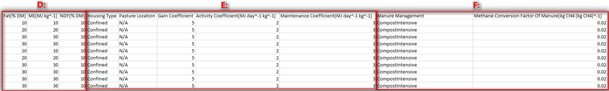
     
    <em>
		Figure 10-20 - Section 3 -- Données sur le boeuf.
		 
		D : Renseignements sur le régime alimentaire pour la période de gestion
		 
		E : Détails sur les bâtiments d'élevage pour la période de gestion.
		 
		F : Détails sur le fumier pour la période de gestion
	</em>

 

 
     
    <em>
		Figure 10-21 - Section 4 -- Données sur le porc.
		 
		F : Détails sur le fumier pour la période de gestion.
	</em>

 
  

##### Valeurs d'entrée de données spéciales sur le bœuf

-   Une composante Bœuf peut faire référence aux groupes de bovins
    suivants :
-   Type de groupe :
    -   Génisses
    -   Bouvillons
    -   Taureaux
    -   Génisses de remplacement
    -   Vaches en lactation
    -   Veaux

 

##### Fichiers Excel d'entrée de données sur les bovins laitiers

-   Chaque ligne du fichier Excel fait référence à l'un de ces groupes d'animaux et à une période de gestion (un groupe d'animaux peut avoir plusieurs périodes de gestion).

-   Si vous avez plusieurs périodes de gestion pour un groupe d'animaux (même nom de groupe et même type de groupe), veuillez ajouter une ligne faisant référence au même groupe d'animaux, mais modifier les données de la période de gestion en conséquence.

-   Les composantes Bovins laitiers ont des données particulières pour le gain quotidien moyen, la production laitière, la teneur en matière grasse du lait et les protéines du lait.

-   Si les données ne s'appliquent pas à un groupe d'animaux, veuillez inscrire « S. O. » comme le montre la figure 10.18.

 

**Voici un exemple de fichier de données sur les composantes Bovins laitiers divisé en sections :**

 

 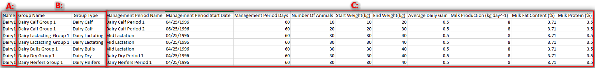
     
    <em>
		Figure 10-22 - Section 1 - Données sur les bovins laitiers.
		 
		A : Nom de la composante Bovins laitiers.
		 
		B : Nom du groupe de bovins laitiers.
		 
		C : Période de gestion du groupe des bovins laitiers.
	</em>

 

 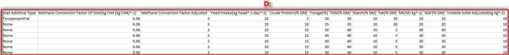
     
    <em>
		Figure 10-23 - Section 2 - Données sur les bovins laitiers.
		 
		D : Détails du régime pour la période de gestion.
	</em>

 

 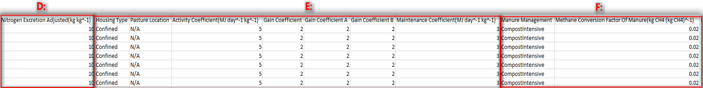
     
    <em>
		Figure 10-24 - Section 3 - Données sur les bovins laitiers.
		 
		D : Détails sur le régime alimentaire pour la période de gestion.
		 
		E : Détails sur les bâtiments d'élevage pour la période de gestion.
		 
		F : Détails sur le fumier pour la période de gestion.
	</em>

 

 
     
    <em>
		Figure 10-25 - Section 4 - Données sur les bovins laitiers
		 
		F : Détails sur le fumier pour la période de gestion
	</em>

 

##### Valeurs d'entrée de données spéciales sur les bovins laitiers

-   Une composante Bovins laitiers peut s'appliquer aux groupes
    d'animaux laitiers suivants :

-   Type de groupe :
    -   Vaches laitières en lactation
    -   Veaux laitiers
    -   Taureaux laitiers
    -   Génisses laitières
    -   Vaches laitières taries

 

##### Fichiers Excel d'entrée de données sur les moutons

-   Chaque ligne du fichier Excel fait référence à l'**un de ces groupes d'animaux** et à **une période de gestion** (un groupe d'animaux peut avoir plusieurs périodes de gestion).

-   **Si vous avez plusieurs périodes de gestion pour un groupe d'animaux (même nom de groupe et même type de groupe)**, veuillez ajouter une ligne faisant référence au même groupe d'animaux, mais modifier les données de la période de gestion en conséquence.

-   Les composantes ovines ont des données spécifiques pour la **production de laine, l'énergie nécessaire pour produire de la laine, l'énergie nécessaire pour produire du lait, le coefficient de gain A et le coefficient de gain B**.

-   **Si les données ne s'appliquent pas à un groupe d'animaux, veuillez inscrire « S. O. » comme le montre la figure 10.18.**

Voici un exemple de fichier de données sur les composantes Moutons divisé en sections.

 
     
    <em>
		Figure 10-26 - Section 1 - Données sur les moutons.
		 
		A : Nom de la composante Moutons.
		 
		B : Nom du groupe de moutons.
		 
		C : Période de gestion du groupe des moutons.
	</em>

 

 
     
    <em>
		Figure 10-27 - Section 2 -- Données sur les moutons.
		 
		C : Période de gestion du groupe des moutons.
		 
		D : Détails du régime pour la période de gestion.
	</em>

 

 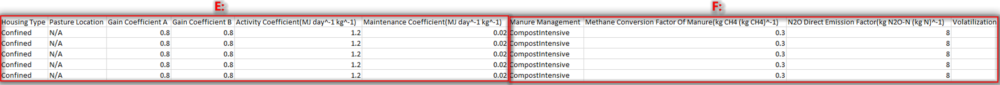
     
    <em>
		Figure 10-28 - Section 3 - Données sur les moutons.
		 
		E : Détails sur les bâtiments d'élevage pour la période de gestion.
		 
		F : Détails sur le fumier pour la période de gestion.
	</em>

 

##### Valeurs d'entrée des données spéciales sur les moutons

-   Une composante ovine peut faire référence aux groupes d'animaux
    ovins suivants :
-   Type de groupe :
    -   Agneaux et brebis
    -   Béliers
    -   Agneaux sevrés

##### Fichiers Excel d'entrée de données sur la volaille

-   **Chaque ligne** du fichier Excel fait référence à l'**un de ces groupes d'animaux** et à **une période de gestion** (un groupe d'animaux peut avoir plusieurs périodes de gestion).
-   **Si vous avez plusieurs périodes de gestion pour un groupe d'animaux (même nom de groupe et même type de groupe),** veuillez ajouter une ligne faisant référence au même groupe d'animaux, mais modifier les données de la période de gestion en conséquence.
-   **Les composantes Volaille ne nécessitent pas de données pour les détails sur le régime alimentaire, les bâtiments d'élevage et le fumier.**

**Voici un exemple de fichier de données sur les composantes Volaille divisé en sections.**

 

 
     
    <em>
		Figure 10-29 - Section 1 - Données sur la volaille.
		 
		A : Nom de la composante Volaille .
		 
		B : Données sur le groupe de la volaille.
		 
		C : Période de gestion du groupe de la volaille.
	</em>

 

 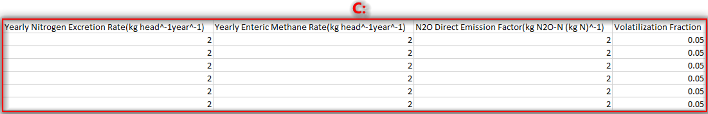
     
    <em>
		Figure 10-30 - Section 2 -- Données sur la volaille.
		 
		C : Période de gestion du groupe de la volaille.
	</em>

 

##### Valeurs d'entrée de données spéciales sur la volaille

-   Une composante Volaille peut faire référence aux groupes d'animaux
    suivants :
-   Type de groupe
    -   Dindons
    -   Canards
    -   Poules pondeuses (sec)
    -   Poules pondeuses (humide)
    -   Poules à griller
    -   Oies

##### Fichiers Excel d'entrée de données sur les autres animaux d'élevage

-   **Chaque ligne** du fichier Excel fait référence à l'**un de ces groupes d'animaux** et à **une période de gestion** (un groupe d'animaux peut avoir plusieurs périodes de gestion).

-   **Si vous avez plusieurs périodes de gestion pour un groupe d'animaux (même nom de groupe et même type de groupe)**, veuillez ajouter une ligne faisant référence au même groupe d'animaux, mais modifier les données de la période de gestion en conséquence.

 

 
     
    <em>
		Figure 10-31 - Section 1 - Données sur les autres animaux d'élevage.
		 
		A :Nom de la composante Autres animaux d'élevage.
		 
		B : Données sur les groupes d'autres animaux d'élevage.
		 
		C : Période de gestion des groupes d'autres animaux d'élevage.
	</em>

 

 
     
    <em>
		Figure 10-32 - Section 1 - Données sur les autres animaux d'élevage.
		 
		C: Période de gestion des groupes d'autres animaux d'élevage.
	</em>

 

   

 

##### Valeurs d'entrée de données spéciales sur les autres animaux d'élevage

-   Une composante Autres animaux d'élevage peut faire référence aux
    groupes d'autres animaux d'élevage suivants :
-   Type de groupe
    -   Alpagas
    -   Chèvres
    -   Cerfs
    -   Wapitis
    -   Chevaux
    -   Mulets
    -   Bisons

## Utilisation de l'interface de ligne de commande

-   Si vous n'avez pas configuré vos dossiers et fichiers d'entrée de données pour les composantes de votre ferme, veuillez cliquer ici : [Configuration de l'interface de ligne de commande](#configuration-de-linterface-de-ligne-de-commande)

-   Si vous ne savez pas comment modifier votre fichier de paramètres pour votre ferme, veuillez cliquer ici : [Modification des fichiers de paramètres d'une ferme](#modification-des-fichiers-de-paramètres)

-   Veuillez consulter la liste de vérification de la CLI ici : [Liste de vérification de l'interface de ligne de commande Holos](#liste-de-vérification-de-linterface-de-ligne-de-commande)
-   Autrement, les fichiers correspondant à votre ferme sont prêts à être traités et cette section vous indiquera comment exécuter l'interface de ligne de commande.

1.  Dans votre fichier de paramètres pour chaque ferme, ajustez les paramètres en fonction de vos activités. Si vous ne savez pas ce qu'est un fichier de paramètres, cliquez ici : [Modification des
fichiers de paramètres](#modification-des-fichiers-de-paramètres).

2.  La première fois que vous démarrerez l'interface de ligne de commande, vous serez invité à entrer l'emplacement de votre dossier « Fermes » (il peut s'agir de n'importe quel dossier que vous créez sur votre ordinateur).

    -   Les autres fois que vous démarrez l'interface de ligne de commande Holos, vous devez indiquer si vous souhaitez utiliser votre emplacement précédemment entré ou entrer un nouvel emplacement.
    
    - Reportez-vous à la section [Créer un nouveau dossier Fermes](#créer-un-nouveau-dossier-fermes) pour obtenir de l'aide sur la création d'un dossier de ferme initiales et pour en savoir plus sur les invites subséquentes.

3.  Vous serez invité à sélectionner une unité de mesure pour le programme à exécuter (Métrique = 1, Impérial = 2). Veuillez faire un choix

4.  L'interface de ligne de commande traitera maintenant chacune des fermes que vous avez créées et les fichiers d'entrée de données de leurs composantes correspondantes.

-   Une fois le traitement et l'analyse terminés, vous verrez un message « Conversion terminée » dans la CLI.

5.  Les résultats pour votre ferme seront exportés dans le répertoire de base de votre répertoire « Fermes » dans un dossier « Extrants » à l'étape 1.

 

 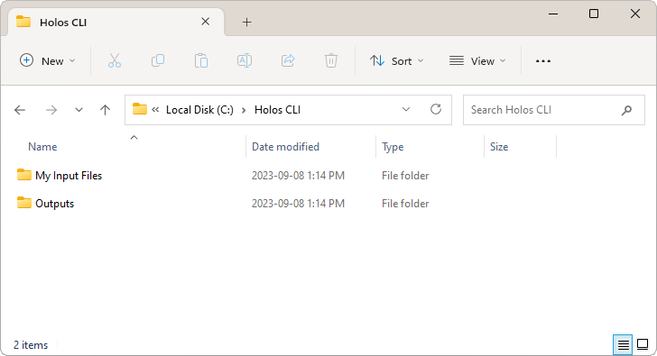
     
    <em>
		Figure 10-33 - Le dossier de sortie est créé une fois que la CLI a terminé le traitement des fichiers.
	</em>

 

## Résultats de l'interface de ligne de commande

-   L'interface de ligne de commande produira les **résultats pour chaque ferme** que vous avez créée et ses composantes respectives, ainsi que les **résultats totaux pour toutes les fermes combinées.**

-   Les résultats seront affichés dans un fichier Excel et correspondront aux catégories suivantes : **Émissions d'équivalent du dioxyde de carbone, Émissions de gaz à effet de serre, Estimations de la production et Estimations des aliments.**

-   Les **émissions d'équivalent du dioxyde de carbone** sont exprimées en **mégagrammes (Mg)** et les **émissions de gaz à effet de serre**, en **kilogrammes (kg).**

-   **Si vous avez plusieurs fichiers de paramètres pour une ferme**, il y aura des fichiers de résultats pour chaque fichier de paramètres dans cette ferme.

-   Vous trouverez ces résultats dans le dossier « **Extrants** » du répertoire de base de l'interface de ligne de commande Holos.

-   **Si vous cherchez des résultats plus précis pour chaque ferme, veuillez vous rendre au dossier d'extrants approprié.**

### Total des résultats (par année)

-   Les **résultats totaux (toutes les fermes)** calculeront les estimations appropriées pour chaque ferme et leurs composantes et groupes d'animaux respectifs et les afficheront dans un fichier Excel. Vous pourrez voir les totaux pour chaque ferme et les totaux pour toutes les fermes combinées **chaque année.**

-   **Chaque composante** d'une ferme **est catégorisée** comme suit : **Production de bœuf, bovins laitiers, autres animaux d'élevage, volaille, moutons et porcs.**

-   **Si les données ne s'appliquent pas**, le champ de données affichera « S. O. ».

-   **Chaque catégorie de composantes** comprend des **composantes**, chacune étant constituée de **groupes d'animaux.**

-   Les résultats pour chacune de ces catégories de composantes et leurs composantes respectives seront calculés et affichés pour chaque ferme.

-   Ces résultats se trouveront dans le dossier « **Extrants** » situé dans le répertoire de base de votre dossier « **Fermes** » dans le dossier « **RésultatsTotauxPourToutesLesFermes** ».

 

 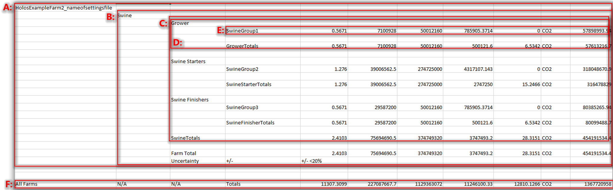
     
    <em>
		Figure 10-34 - Résultats totaux pour une ferme -- Base annuelle.
		 
		A :Données correspondant à un fichier de ferme et de paramètres.
		 
		B :Données correspondant à une catégorie de composantes.
		 
		C : Données correspondant à une composante.
		 
		D : Données correspondant aux totaux des producteurs.
		 
		E : Données correspondant à un groupe d'animaux.
		 
		F : Totaux pour toutes les fermes.
	</em>

 

### Résultats pour une ferme (base mensuelle)

-   Les **résultats pour chaque ferme** établiront les estimations appropriées pour chaque ferme et leurs composantes et groupes d'animaux respectifs et les afficheront dans un fichier Excel. Vous pourrez voir les totaux de la ferme, de chaque composante et de chaque groupe d'animaux **chaque mois**. Ces résultats se trouveront dans le dossier «** Extrants **» et dans le dossier approprié du répertoire des résultats de la ferme dans le format suivant : **Résultats_NomDeVotreFerme.**

-   **Si les données ne s'appliquent pas**, le champ de données affichera « S. O. ».

-   **Chaque composante** d'une ferme est **catégorisée** comme suit : **Production de bœuf, bovins laitiers, autres animaux d'élevage, volaille, moutons et porcs.**

-   Chaque catégorie de composantes comprend des composantes, et chacune de ces composantes comprend des groupes d'animaux.

-   **Chaque** groupe d'animaux est divisé en **mois**.

-   Les résultats pour chacune de ces catégories de composantes et leurs composantes respectives seront calculés et affichés pour chaque ferme. Les **totaux des fermes** seront affichés au bas de l'écran.

 

 
     
    <em>
		Figure 10-35 - Résultats totaux pour une ferme -- Base mensuelle.
		 
		A :Résultats pour une catégorie de composantes.
		 
		B : Résultats pour une composante.
		 
		C : Résultats mensuels pour un groupe d'animaux, y compris les totaux pour tous les mois.
	</em>

 

   

### Émissions d'équivalent en dioxyde de carbone

-   Holos calculera les émissions d'équivalent en dioxyde de carbone pour chaque ferme et leurs composantes respectives.

-   Les résultats comprendront les valeurs d'émission calculées suivantes : **Émissions de CH~4~ entérique, CH~4~ du fumier, oxyde nitreux (directes), oxyde nitreux (indirectes), dioxyde de carbone par énergie et dioxyde de carbone.**

-   Le **dioxyde de carbone provenant des énergies** est calculé pour **chaque groupe d'animaux** (c.-à-d. les bouvillons de finition). **Par conséquent**, vous verrez « **S.O.** » pour les champs de données qui ne s'appliquent pas.

### Émission de gaz à effet de serre

-   Holos calculera les émissions de gaz à effet de serre pour chaque ferme et leurs composantes respectives.

-   Les résultats comprendront les valeurs d'émission calculées suivantes : **Émissions de CH~4~ entérique, CH~4~ du fumier, oxyde nitreux (directes), oxyde nitreux (indirectes), dioxyde de carbone par énergie et dioxyde de carbone.**

-   Le **dioxyde de carbone provenant des énergies** est calculé pour **chaque groupe d'animaux** (c.-à-d. les bouvillons de finition). **Par conséquent**, vous verrez « S.O. » pour les champs de données qui ne s'appliquent pas.

-   **Toutefois, ces valeurs ne sont pas converties en valeurs d'équivalent du dioxyde de carbone.**

### Estimations de la production

-   Holos calculera les estimations de la production pour chaque ferme et leurs composantes respectives.

-   Les résultats comprendront les estimations calculées suivantes des valeurs de production : **Récolte, superficie, fumier disponible pour l'épandage sur le sol, bœuf produit, agneau produit, lait produit et production de lait normalisé en m.g. et protéines.**

### Estimations des aliments pour animaux

-   Holos calculera les estimations de la production pour chaque ferme et leurs composantes respectives.

-   Les résultats comprendront la valeur estimative calculée suivante pour les aliments : **Ingestion de matières sèches.**

### Résultats des composantes particulières pour une ferme

-   Dans chaque dossier de résultats pour une ferme , il y aura des répertoires correspondant à chaque catégorie de composante de gestion des terres disponible dans Holos.

-   Pour chaque composante de la gestion des terres, il y aura un fichier de résultats spécifique pour chaque fichier de données de composante de la gestion des terres que vous aurez créé. **Ces résultats sont propres à la composante qui vous intéresse** et nous allons les passer en revue dans cette section.

#### Résultats de la composante Brise-vent

-   Les résultats des brise-vent fourniront des renseignements sur les émissions de carbone pour chaque rangée et les espèces correspondantes, de l'**année de début** jusqu'à l'**année de coupe.**

#### Résultats de la composante Champ

-   Les résultats pour le champ consisteront en résultats fondés sur le **modèle d'introduction du bilan de carbone (MIBC)**, qui présentera tous les renseignements sur les émissions de carbone et d'azote liées à vos cultures de 1985 à aujourd'hui.

### Navigation dans les répertoires de résultats CLI Holos

Voici des exemples de répertoires et leurs résultats correspondants

#### Répertoire des exemples de résultats totaux

 

 
     
    <em>
		Figure 10-36 - Répertoire des résultats totaux de la ferme.
		 
		A : Chemin d'accès aux résultats totaux pour le répertoire de toutes les fermes. Le dossier des résultats est créé à l'intérieur du répertoire général des fermes créé par l'utilisateur.
		 
		B : Fichiers de sortie pour chaque catégorie de résultats calculée (sur une base annuelle).
	</em>

 

  

#### Résultats pour un répertoire d'exemples de ferme

 

 
     
    <em>
		Figure 10-37 - Résultats pour chaque catégorie calculée.
		 
		A : Chemin d'accès au répertoire.
		 
		B : Résultats spécifiques pour chaque composante de gestion des terres dans une ferme.
		 
		C : Fichiers de sortie pour chaque catégorie de résultats calculée (base mensuelle) pour la ferme et pour chaque fichier de paramètres.
	</em>

 

   

## Liste de vérification de l'interface de ligne de commande

-   L'interface de ligne de commande exige que les données d'entrée soient correctement formatées et que les composantes appropriées soient créées pour que les données puissent être traitées.

-   Cette section vous permet de vous assurer que vous ne rencontrez aucune erreur lors de la configuration de l'interface de ligne de commande.

-   Si vous rencontrez des erreurs, veuillez cliquer ici : [Guide d'erreur pour l'interface de ligne de commande](#guide-derreur-pour-linterface-de-ligne-de-commande)

 

### Fichiers de données correctement remplis

-   Remplir conformément aux directives de la section : [Comment modifier les fichiers Excel d'entrée de données des composantes](#modification-des-fichiers-excel-dentrée-de-données-des-composantes).
-   **N'oubliez pas que chaque fichier représente l'une des composantes de votre ferme**. Par exemple, si vous avez deux brise-vent que vous aimeriez représenter comme fichiers Excel d'entrée de données, vous devrez créer deux fichiers Excel d'entrée de données, un pour chaque brise-vent et vous assurer que leurs noms sont uniques.
    
-   **Ne modifiez pas ou ne supprimez pas les en-têtes** des fichiers Excel d'entrée de données, sinon l'interface de ligne de commande cessera le traitement.
    
-   **Entrez les données correspondant aux lignes directrices pour chaque composante**; il y a des **en-têtes spéciaux qui nécessitent des données précises** que vous pouvez choisir dans chaque ligne directrice. Assurez-vous d'orthographier vos données d'entrée correctement!
    
-   **Si vous rencontrez l'une de ces erreurs**, veuillez accéder au guide des composantes approprié sous : [Modification des fichiers d'entrée de données des composantes](#modification-des-fichiers-excel-dentrée-de-données-des-composantes). Chacune des sections contiendra un guide pour les champs de données spéciaux, indiquant quelles données sont valides pour ce champ.
    
-   **N'entrez pas de valeurs négatives lorsqu'elles ne sont pas logiques**. Par exemple, si vous réglez l'« année d'observation » à « -1996 », l'interface de ligne de commande cessera le traitement.
    
-   **Ne laissez pas de champs de données vides,** : l'interface de ligne de commande cessera le traitement s'il n'y a pas de données.
    
-   **Pour certains champs de données, si l'en-tête ne s'applique pas, réglez l'entrée de données à « S.O. »**, par exemple dans une composante champ, si vous avez une récolte annuelle et que vous tombez sur les en-têtes « **Identifiant de peuplement vivace** », « **Durée de peuplement vivace** » et « **Année en peuplement vivace** », veuillez régler ces champs à « **S.O.** ».

 

### Noms uniques des composantes

Par exemple, dans le répertoire des brise-vent, si vous avez deux fichiers Excel : Brise-vent1.csv et Brise-vent2.csv et qu'ils contiennent tous deux des données pour la composante « **Brise-vent Exemple1** », l'interface de ligne de commande Holos ne traitera pas les données parce que leurs noms ne sont pas uniques.

 

### Références valides à d'autres composantes

L'utilisateur doit s'assurer que les références aux autres composantes sont valides et que la composante est en fait un fichier de données.

-   Assurez-vous que si l'une de vos composantes nécessite une référence à une autre composante que vous avez établie, que la composante en question a le bon fichier Excel d'entrée de données créé dans le bon dossier de ferme et de composante et que vous mentionnez le nom de la composante (**PAS LE NOM DU FICHIER**). si vous devez vous y référer dans l'un de vos champs de saisie de données pour une autre composante.

-   **Par exemple**, dans une composante **porcine**, vous avez choisi comme **type de bâtiment d'élevage** « pâturage » et le pâturage auquel vous aimeriez vous référer est un champ personnalisé qui reflète votre exploitation agricole. **Veuillez vous assurer de créer un fichier Excel d'entrée de données avec les données qui reflètent votre champ personnalisé dans le dossier des champs de la ferme choisi et de** vous assurer que le champ de données du nom de la composante pour chaque fichier d'entrée de données est unique (**vous ne pouvez pas avoir de composantes portant le même nom**).

-   Par conséquent, si le **nom du champ** personnalisé que vous avez créé est « **NomChampExemple1** », chaque fois que vous souhaitez vous référer à ce champ spécifique dans un composante qui peut avoir une référence à un champ, vous devez définir le champ de données comme « NomChampExemple1 ».

-   Par conséquent, pour le champ de données Pâturage de la composante Porcs, vous établiriez le champ de saisie de données à « NomChampExemple1 » si vous souhaitez vous référer à ce champ personnalisé.

 

### Les noms des répertoires de composantes générés par la CLI ne sont pas modifiés

L'utilisateur doit s'assurer de ne pas modifier les noms des répertoires de composantes dans chaque ferme.

Si les noms des composantes ne sont pas valides, les données ne seront pas traitées. Un message s'affiche pour indiquer quel répertoire de composantes n'est pas valide.

 

## Guide d'erreur pour l'interface de ligne de commande

-   Cette section porte sur les erreurs qui peuvent se produire lorsque vous créez vos fichiers Excel d'entrée de données pour chaque composante.
-   Le message d'erreur s'affiche toujours sur l'interface de ligne de commande et indique la ligne, la colonne et le fichier où l'erreur s'est produite.
-   **Si l'interface de ligne de commande rencontre l'une des erreurs ci-dessous, l'exécution du programme est interrompue jusqu'à ce que le problème soit résolu.**

 

### Erreurs générales de saisie de données

### L'une des valeurs de données est vide

1. Voici un exemple de valeur de données vide dans un fichier Excel d'entrée de données sur les brise-vent.

 

 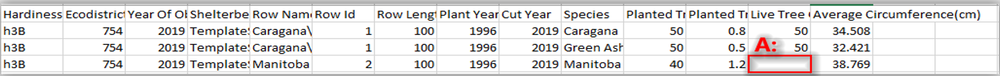
     
    <em>
		Figure 10-38 - Exemple d'une valeur de données vide dans un fichier Excel d'entrée de données sur les brise-vent.
		 
		A : Valeur de données vide.
	</em>

 

 

2.  Si cette erreur se produit, un message s'affiche sur l'interface de ligne de commande indiquant qu'il y a une valeur de données vide dans la ligne, la colonne et le fichier où l'erreur s'est produite.

 

 
     
    <em>
		Figure 10-39 - Interface de ligne de commande rencontrant une erreur de données vides.
		 
		A : Le message d'erreur s'affiche si le fichier Excel d'entrée de données a une valeur de données vide.
	</em>

 

 

### Valeurs négatives pour les champs de données lorsque cela n'a pas de sens

1. Voici un exemple de valeur négative pour un champ de données dans un fichier Excel d'entrée de données sur les brise-vent. Il n'est pas logique que l'année d'observation soit -1996.

 

 
     
    <em>
		Figure 10-40 - Exemple d'une valeur négative qui n'a pas de sens dans un fichier Excel d'entrée de données sur les brise-vent.
		 
		A : Valeur de données négative invalide pour l'année d'observation.
	</em>

 

 
2.  Si cette erreur se produit, un message s'affiche sur l'interface de ligne de commande indiquant la valeur de données négative invalide ainsi que la ligne, la colonne et le fichier où l'erreur s'est
produite.

 

 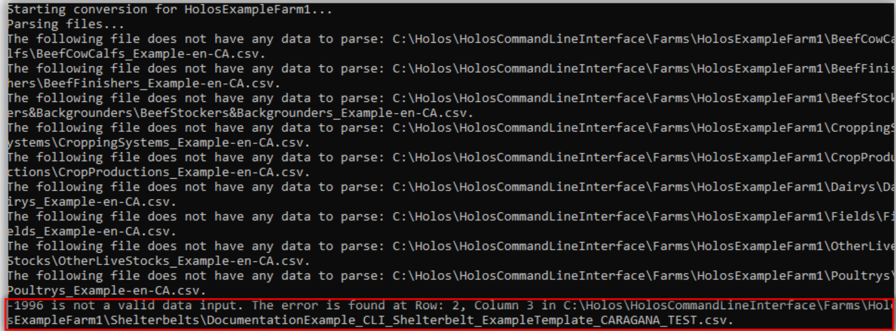
     
    <em>
		Figure 10-41 - Interface de ligne de commande présentant des valeurs négatives invalides.
		 
		 A : Le message d'erreur s'affiche si le fichier Excel d'entrée de données a une valeur négative invalide.
	</em>

 

### Un en-tête a été modifié (mal orthographié, vide, caractères spéciaux)

Veuillez ne pas modifier les en-têtes des fichiers Excel d'entrée de données des composantes.

1. Vous trouverez ci-dessous un exemple d'en-tête qui a été modifié, ce qui signifie qu'il est vide ou qu'il a été mal orthographié.

 

 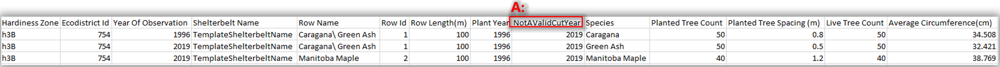
     
    <em>
		Figure 10-42 - Exemple d'en-tête invalide dans un fichier Excel d'entrée de données sur les brise-vent.
		 
		A : Valeur d'en-tête non valide
	</em>

 

2.  Si cette erreur se produit, un message s'affiche sur l'interface de ligne de commande indiquant l'emplacement de l'en-tête non valide par la ligne et le fichier où l'erreur s'est produite. Vous verrez également l'en-tête valide qui devrait se trouver dans ce fichier.

 

 
     
    <em>
		Figure 10-43 - Interface de ligne de commande rencontrant un en-tête nonvalide.
		 
		A : Valeur d'en-tête invalide.
	</em>

 

 

### Champs uniques ayant des valeurs d'entrée de données spéciales

-   Ces erreurs sont spéciales parce qu'elles **nécessitent des valeurs de saisie de données précises** et sont **différentes pour chaque composante** (c.-à-d. qu'une composante brise-vent aura des champs
différents d'une composante champ, de sorte que les erreurs que vous pourriez rencontrer seront différentes).
-   **Si vous rencontrez l'une de ces erreurs**, veuillez accéder au guide des composantes approprié sous : [Modification des fichiers d'entrée de données des composantes](#modification-des-fichiers-excel-dentrée-de-données-des-composantes). Chacune des sections contiendra un guide pour les champs de données spéciaux, indiquant quelles données sont valides pour ce champ.

1. Vous trouverez ci-dessous un exemple d'un champ de données spécial dans le fichier d'entrée de données sur les brise-vent qui a été entré incorrectement. Une « zone de rusticité » peut prendre une
valeur de données dans le format suivant : « H(0-9)(a-b) ». Cela signifie que les valeurs de données doivent toujours être précédées d'un « H » et que les chiffres/lettres suivants peuvent être n'importe quelle valeur dans la plage spécifiée (0-9 ou a-b).

 

 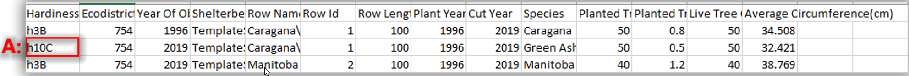
     
    <em>
		Figure 10-44 - Exemple d'une valeur d'entrée de données spéciale invalide pour une zone de rusticité dans un fichier Excel d'entrée de données sur les brise-vent.
		 
		A : Valeur de zone de rusticité non valide.
	</em>

 

 

2.  Si cette erreur se produit, un message s'affichera sur l'interface de ligne de commande indiquant la valeur invalide, la valeur de données correspondant à un champ unique spécifique, ainsi que la ligne, la colonne et le fichier où l'erreur s'est produite.

 

 
     
    <em>
		Figure 10-45 - Interface de ligne de commande présentant une valeur d'entrée de données spéciale invalide.
		 
		A : Le message d'erreur s'affiche s'il y a une valeur d'entrée de données spéciale non valide dans le fichier d'entrée de données Excel.
	</em>

 

# Chapitre 11 Questions courantes

## Comment puis-je activer le mode avance

Si vous avez démarré la ferme en mode de base et que vous souhaitez passer au mode avancé, le processus est extrêmement simple.

1.	Cliquez sur Paramètres dans la barre de menu supérieure.
2.	Sélectionnez « **Valeurs par défaut de la ferme** ».
3.	Sélectionnez « **Mode avancé** » sous l’onglet « Ferme ».

 

 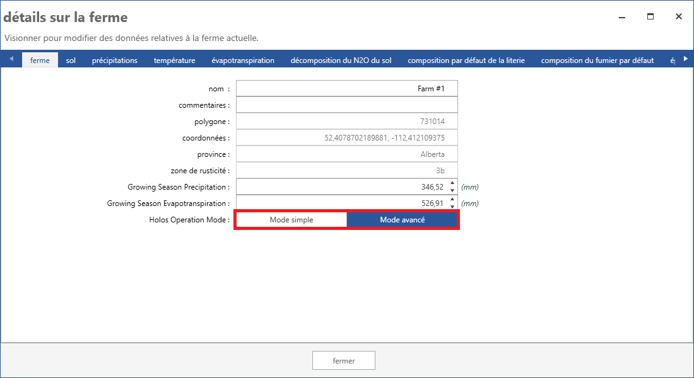
     
    <em>
		Figure 11-1 - Le mode avancé peut être sélectionné à partir du réglage des valeurs par défaut/détails de la ferme. 
	</em>

  

## Comment puis-je activer le mode pluriannuel

Le mode pluriannuel n’est disponible que si vous êtes actuellement en mode avancé. Si vous êtes actuellement en mode de base, passez au mode avancé. Ensuite, cherchez un bouton à bascule dans le coin supérieur droit du programme Holos. Vous pouvez utiliser ce bouton pour passer d’un mode à l’autre.

 

 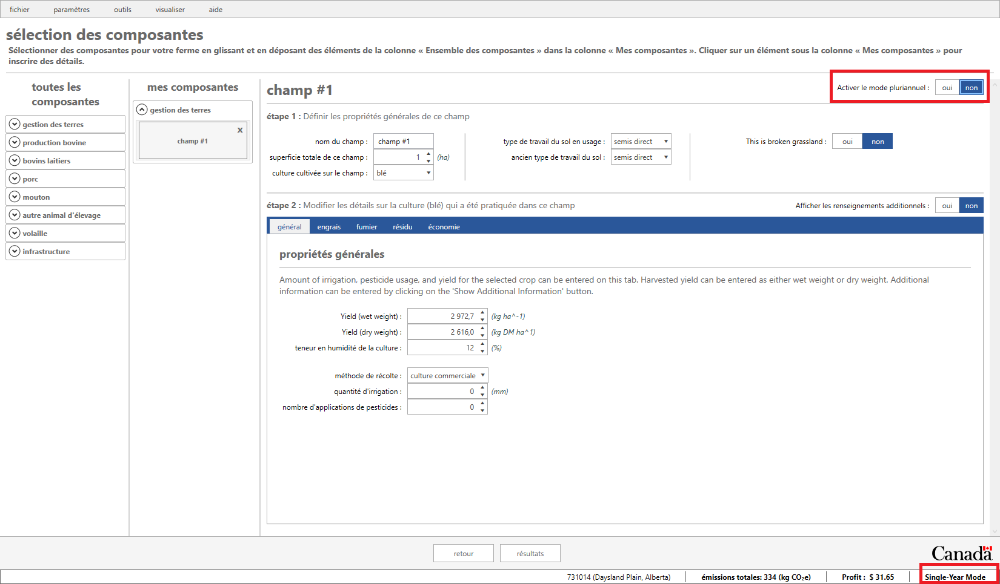
     
    <em>
		Figure 11-2 - Cliquez sur le bouton à bascule pour passer du mode de base au mode avancé. 
	</em>

 

## Comment basculer entre les modèles de carbone de niveau 2 du GIEC et MIBC

Holos utilise par défaut le modèle de carbone de niveau 2 du GIEC, mais il permet à l’utilisateur de passer au modèle de carbone MIBC. Pour passer d’un modèle à l’autre :
1.	Cliquez sur Paramètres dans la barre de menu supérieure.
2.	Sélectionnez « **Paramètres de l’utilisateur** ».
3.	Dans la liste déroulante « **Stratégie de modélisation du carbone** », sélectionnez le modèle de carbone que vous voulez utiliser dans vos calculs.

 

 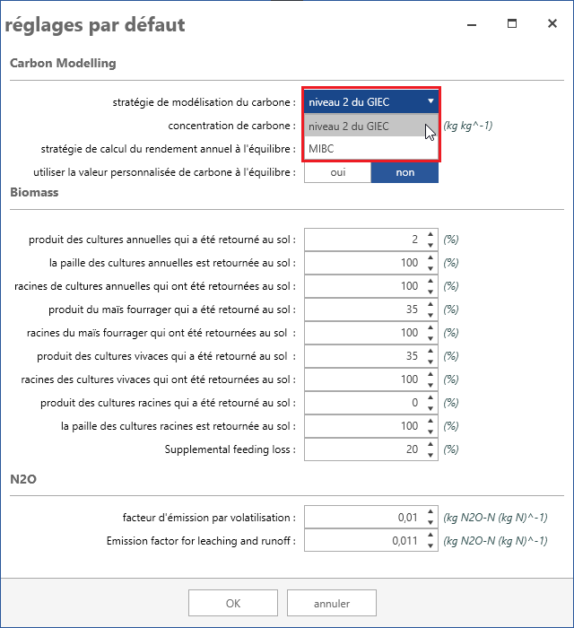
     
    <em>
		Figure 11-3 - Changement de modèle de carbone utilisé dans Holos. 
	</em>

    

 
## Comment puis-je ajouter une nouvelle ferme à mon dossier CLI actuel

### Méthode 1 : Copier un dossier de ferme vide existant.

1.	Dans votre dossier « Fermes » actuel, créez un nouveau dossier pour votre nouvelle ferme avec un nom approprié.
2.	Copiez tous les fichiers d’une ferme existante et collez-les dans le nouveau dossier que vous venez de créer.
3.	Modifiez les fichiers d'entrée de données au besoin.

### Méthode 2 : Exécuter à nouveau la CLI.

1.	Démarrer la CLI Holos.
2.	Vous serez invité à utiliser le dossier Fermes précédemment utilisé. Sélectionnez oui.
3.	Sélectionnez les unités de mesure appropriées dans l’invite suivante.

 

 
     
    <em>
		Figure 11-4 - Utilisation de la CLI Holos pour créer un nouveau dossier de ferme. 
	</em>

 
  
   
